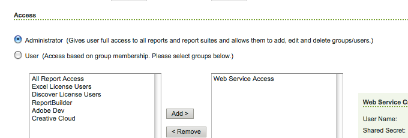

# Connessione ad Adobe Analytics e creazione di framework {#connecting-to-adobe-analytics-and-creating-frameworks}

Per tenere traccia dei dati web dalle pagine dell’AEM in Adobe Analytics, crea una configurazione dei servizi Adobe Analytics Cloud e un framework Adobe Analytics:

* **Configurazione Adobe Analytics:** Informazioni sul tuo account Adobe Analytics. La configurazione di Adobe Analytics consente all’AEM di connettersi ad Adobe Analytics. Crea una configurazione di Adobe Analytics per ogni account utilizzato.
* **Framework Adobe Analytics:** Un set di mappature tra le proprietà della suite di rapporti di Adobe Analytics e le variabili CQ. Utilizza un framework per configurare il modo in cui i dati del tuo sito web compilano i rapporti di Adobe Analytics. I framework sono associati a una configurazione Adobe Analytics. Puoi creare più framework per ogni configurazione.

Quando si associa una pagina Web a un framework, il framework esegue il tracciamento della pagina e dei relativi discendenti. Le visualizzazioni di pagina possono quindi essere recuperate da Adobe Analytics e visualizzate nella console Sites.

## Prerequisiti {#prerequisites}

### Account Adobe Analytics {#adobe-analytics-account}

Per tenere traccia dei dati AEM in Adobe Analytics, devi disporre di un account Adobe Experience Cloud Adobe Analytics valido.

L’account Adobe Analytics deve:

* Hanno **Amministratore** privilegi
* Essere assegnato al **Accesso al servizio Web** gruppo di utenti.

>[!CAUTION]
>
>Fornitura **Amministratore** privilegi (in Adobe Analytics) non sono sufficienti per consentire a un utente di connettersi da AEM ad Adobe Analytics. L’account deve inoltre avere **Accesso al servizio Web** privilegi.

Prima di procedere, accertati di disporre delle credenziali per accedere ad Adobe Analytics. In uno dei modi seguenti:

* [Accesso a Adobe Experience Cloud](https://experience.adobe.com/#/@login/home)

* [Accesso ad Adobe Analytics](https://sc.omniture.com/login/)

### Configurazione dell’AEM per l’utilizzo dei centri dati di Adobe Analytics {#configuring-aem-to-use-your-adobe-analytics-data-centers}

Adobe Analytics [data center](https://experienceleague.adobe.com/docs/analytics/analyze/reports-analytics/reporting-interface/overview-data-collection.html?lang=en) raccogliere, elaborare e archiviare i dati associati alla suite di rapporti di Adobe Analytics. Configura AEM per utilizzare il data center che ospita la tua suite di rapporti Adobe Analytics. Il centro dati è menzionato nel contratto. Per queste informazioni, contatta un amministratore della tua organizzazione.

Se necessario, utilizza quanto segue per essere indirizzato al centro dati corretto: `https://api.omniture.com/`.

Se l’organizzazione richiede la raccolta o il recupero di dati da un centro dati specifico, utilizza quanto segue:

| Datacenter | URL |
|---|---|
| Londra | `https://api3.omniture.com/` |
| Singapore | `https://api4.omniture.com/` |
| Oregon | `https://api5.omniture.com/` |

Utilizza il [Console web per configurare il bundle OSGi](/help/sites-deploying/configuring-osgi.md#osgi-configuration-with-the-web-console) **Adobe Client HTTP di AEM Analytics**. Aggiungi il **URL del datacenter** per il data center che ospita una suite di rapporti per la quale le pagine AEM raccolgono i dati.

1. Apri la console Web nel browser. ([https://localhost:4502/system/console/configMgr](https://localhost:4502/system/console/configMgr))
1. Per accedere alla console, immetti le tue credenziali.

   >[!NOTE]
   >
   >Per verificare se è possibile accedere a questa console, contattare l&#39;amministratore del sito.

1. Seleziona l’elemento di configurazione denominato **Adobe Client HTTP di AEM Analytics**.
1. Per aggiungere l&#39;URL di un data center, premere il pulsante + accanto al **URL del datacenter** e digita l’URL nella casella.

1. Per rimuovere un URL dall’elenco, fai clic sul pulsante - accanto all’URL.
1. Fai clic su Salva.

## Configurazione della connessione ad Adobe Analytics {#configuring-the-connection-to-adobe-analytics}

>[!CAUTION]
>
>In seguito a modifiche di sicurezza nell’API di Adobe Analytics, non è più possibile utilizzare la versione di Activity Map inclusa in AEM.
>
>Il [Plug-in ActivityMap fornito da Adobe Analytics](https://experienceleague.adobe.com/docs/analytics/analyze/activity-map/getting-started/get-started-users/activitymap-install.html?lang=it) ora deve essere utilizzato.

## Configurazione per l’Activity Map {#configuring-for-the-activity-map}

>[!CAUTION]
>
>In seguito a modifiche di sicurezza nell’API di Adobe Analytics, non è più possibile utilizzare la versione di Activity Map inclusa in AEM.
>
>Il [Plug-in ActivityMap fornito da Adobe Analytics](https://experienceleague.adobe.com/docs/analytics/analyze/activity-map/getting-started/get-started-users/activitymap-install.html?lang=it) ora deve essere utilizzato.

## Creazione di un framework Adobe Analytics {#creating-a-adobe-analytics-framework}

Per l’ID suite di rapporti (RSID) in uso, puoi controllare quali istanze del server (authoring, pubblicazione o entrambe) contribuiscono ai dati della suite di rapporti:

* **Tutti**: le informazioni provenienti sia dall’istanza di authoring che da quella di pubblicazione popolano la suite di rapporti.
* **Autore**: solo le informazioni dell’istanza di authoring popolano la suite di rapporti.
* **Pubblica**: solo le informazioni dell’istanza Publish popolano la suite di rapporti.

>[!NOTE]
>
>La selezione del tipo di istanza del server non limita le chiamate ad Adobe Analytics, ma controlla semplicemente le chiamate che includono l’RSID.
>
>Ad esempio, un framework è configurato per utilizzare il *diweretail* suite di rapporti e autore è l’istanza del server selezionata. Quando si pubblicano le pagine insieme al framework, vengono comunque effettuate chiamate ad Adobe Analytics, tuttavia queste chiamate non contengono l’RSID. Solo le chiamate dall&#39;istanza di authoring includono l&#39;RSID.

1. Utilizzo di **Navigazione**, seleziona **Strumenti**, **Cloud Service**, quindi **Cloud Service legacy**.
1. Scorri fino a **Adobe Analytics** e seleziona **Mostra configurazioni**.
1. Fai clic su **[+]** accanto alla configurazione di Adobe Analytics.

1. In **Crea framework** finestra di dialogo:

   * Specificare un **Titolo**.
   * Facoltativamente, puoi specificare **Nome**, per il nodo che memorizza i dettagli del framework nell’archivio.
   * Seleziona **Framework Adobe Analytics**

   E fai clic su **Crea**.

   Il framework si apre per la modifica.

1. In **Suite di rapporti** sezione laterale (lato destro del pannello principale), fai clic su **Aggiungi elemento**. Quindi utilizza l’elenco a discesa per selezionare l’ID suite di rapporti (ad esempio, `geometrixxauth`) con cui il framework interagisce.

   >[!NOTE]
   >
   >Quando selezioni un ID suite di rapporti, il Finder dei contenuti a sinistra viene compilato con le variabili di Adobe Analytics (Variabili di SiteCatalyst).

1. Per selezionare le istanze del server a cui si desidera inviare informazioni, utilizzare **Modalità di esecuzione** (accanto all’ID Report Suite).

   

1. Per rendere il framework disponibile nell’istanza di pubblicazione del sito, nella **Pagina** scheda della barra laterale, fare clic su **Attiva framework.**

### Configurazione delle impostazioni del server per Adobe Analytics {#configuring-server-settings-for-adobe-analytics}

Il framework system consente di modificare le impostazioni del server all’interno di ogni framework Adobe Analytics.

>[!CAUTION]
>
>Queste impostazioni determinano dove vengono inviati i dati e come, pertanto è fondamentale che tu *non manomettere queste impostazioni* e al suo posto, lascia che sia il tuo rappresentante Adobe Analytics a configurarlo.

Per iniziare, apri il pannello. Premi la freccia verso il basso accanto a **Server**:

* **Server per tracking**

   * contiene l’URL utilizzato per inviare chiamate Adobe Analytics

      * `cname` : impostazioni predefinite dell&#39;account Adobe Analytics *Nome dell’azienda*
      * `d1` : corrisponde al data center a cui vengono inviate le informazioni (tramite `d1`, `d2`, o `d3`)
      * `sc.omtrdc.net` - nome di dominio

* **Server di tracciamento protetto**

   * Ha gli stessi segmenti del server di tracciamento
   * Utilizzato per inviare dati da pagine protette (`https://`)

* **Namespace visitatore**

   * Lo spazio dei nomi determina la prima parte dell’URL di tracciamento.
   * Ad esempio, modificando lo spazio dei nomi in **CNAME** determina l’aspetto delle chiamate effettuate ad Adobe Analytics **CNAME.d1.omtrdc.net** invece del valore predefinito.

## Associazione di una pagina a un framework Adobe Analytics {#associating-a-page-with-a-adobe-analytics-framework}

Quando una pagina è associata a un framework Adobe Analytics, invia dati ad Adobe Analytics al caricamento della pagina. Le variabili che la pagina compila vengono mappate e recuperate dalle variabili di Adobe Analytics nel framework. Ad esempio, le visualizzazioni di pagina vengono recuperate da Adobe Analytics.

I discendenti della pagina ereditano l’associazione con il framework. Ad esempio, quando si associa la pagina principale del sito a un framework, tutte le pagine del sito vengono associate al framework.

1. Dalla sezione **Sites** , seleziona la pagina da impostare con il tracciamento.
1. Apri **[Proprietà pagina](/help/sites-authoring/editing-page-properties.md)**, direttamente dalla console o dall’editor di pagine.
1. Apri la scheda** Cloud Service **.

1. Utilizza il **Aggiungi configurazione** a discesa per selezionare **Adobe Analytics** dalle opzioni disponibili. Se è presente l’ereditarietà, disattivala prima che il selettore diventi disponibile.

1. Selettore a discesa per **Adobe Analytics** viene aggiunto alle opzioni disponibili. Seleziona la configurazione del framework richiesta.

1. Seleziona **Salva e chiudi**.
1. Per attivare la pagina e le configurazioni/i file collegati: **[Pubblica](/help/sites-authoring/publishing-pages.md)** la pagina.
1. Il passaggio finale consiste nel visitare la pagina nell’istanza Publish e cercare una parola chiave (ad esempio, melanzana) utilizzando **Ricerca** componente.
1. Puoi quindi controllare le chiamate effettuate ad Adobe Analytics utilizzando uno strumento appropriato, ad esempio, [Adobe Experience Cloud Debugger](https://experienceleague.adobe.com/docs/experience-platform/debugger/home.html).
1. Utilizzando l’esempio fornito, la chiamata deve contenere il valore inserito (ossia melanzana) in eVar7 e l’elenco degli eventi deve contenere event3.

### Visualizzazioni pagina {#page-views}

Quando una pagina è associata a un framework Adobe Analytics, il numero di visualizzazioni di pagina può essere visualizzato nella vista a elenco della console Sites.

Consulta [Visualizzazione dei dati di analisi delle pagine](/help/sites-authoring/page-analytics-using.md) per ulteriori dettagli.

<!-- SP19
### Configuring the Import Interval {#configuring-the-import-interval}

Configure the appropriate instance of the **Adobe AEM Analytics Report Sling Importer** service:

* **Fetch attempts**:
  Number of attempts to fetch a queued report. 
  The default is `6`.

* **Fetch delay**:
  The number of milliseconds between attempts to fetch a queued report. 
  The default is `10000`. As this is in milliseconds it corresponds to 10 seconds.

* **Fetch frequency**:
  A `cron` expression to determine the frequency for fetching the Analytics Report. 
  The default is `0 0 0/12 * * ?`; this corresponds to 12 fetches every hour.

To configure this OSGi service, you can either use the [Web Console](/help/sites-deploying/configuring-osgi.md#osgi-configuration-with-the-web-console) or an [osgiConfig node in the repository](/help/sites-deploying/configuring-osgi.md#osgi-configuration-in-the-repository) (the service PID is `com.day.cq.analytics.sitecatalyst.impl.importer.ReportImporterScheduler`).
-->

### Configurazione dell&#39;intervallo di importazione {#configuring-the-import-interval}

Configura l’istanza appropriata del **Adobe Configurazione polling gestito AEM** servizio:

* **Intervallo di polling**: intervallo in secondi durante il quale il servizio recupera i dati di visualizzazione della pagina da Adobe Analytics.
L’intervallo predefinito è di 43200000 ms (12 ore).

* **Abilita**: attiva o disattiva il servizio. Per impostazione predefinita, il servizio è abilitato.

Per configurare questo servizio OSGi, puoi utilizzare [Console web](/help/sites-deploying/configuring-osgi.md#osgi-configuration-with-the-web-console) o un [Nodo osgiConfig nell’archivio](/help/sites-deploying/configuring-osgi.md#osgi-configuration-in-the-repository) (il PID del servizio è `com.day.cq.polling.importer.impl.ManagedPollConfigImpl`).

## Modifica delle configurazioni e/o dei framework di Adobe Analytics {#editing-adobe-analytics-configurations-and-or-frameworks}

Come per la creazione di una configurazione o di un framework Adobe Analytics, passa a (legacy) **Cloud Service** schermo. Seleziona **Mostra configurazioni**, quindi fai clic sul collegamento alla configurazione specifica da aggiornare.

Durante la modifica di una configurazione di Adobe Analytics, premi **Modifica** nella pagina di configurazione stessa per aprire **Modifica componente** .

## Eliminazione dei framework di Adobe Analytics {#deleting-adobe-analytics-frameworks}

Per eliminare un framework Adobe Analytics: [apri per la modifica](#editing-adobe-analytics-configurations-and-or-frameworks).

Quindi seleziona **Elimina framework** dal **Pagina** della barra laterale.
