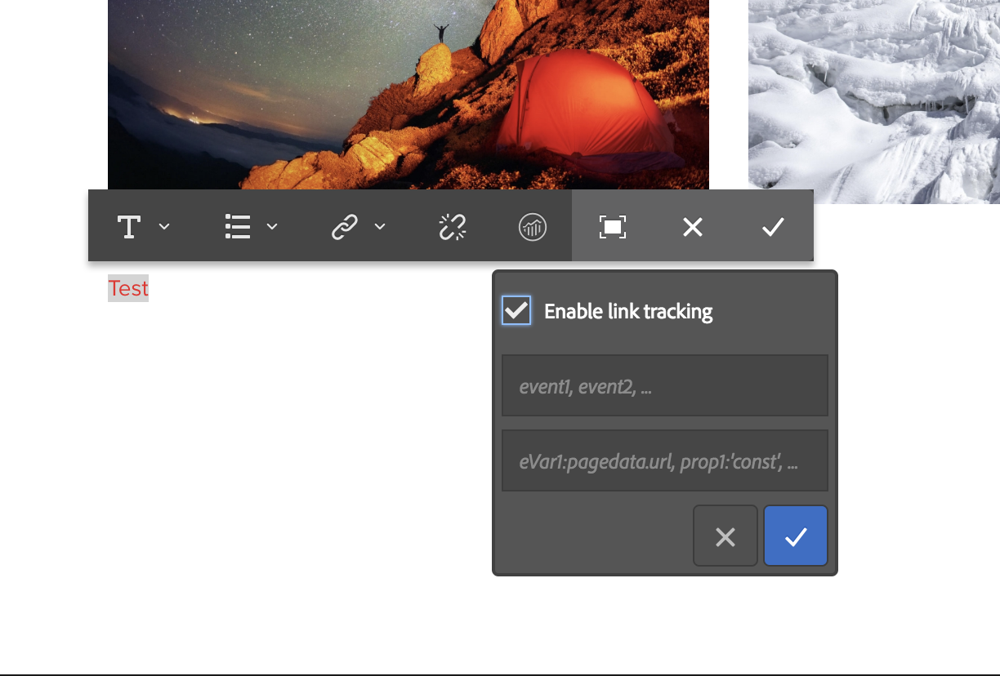

# Configurazione del tracciamento dei collegamenti per Adobe Analytics{#configuring-link-tracking-for-adobe-analytics}

Quando gli utenti fanno clic sui collegamenti nelle pagine del sito web, è possibile acquisire informazioni correlate in Adobe Analytics. Ad esempio, utilizza il tracciamento dei collegamenti per scoprire come gli utenti interagiscono con il sito, tracciare i download dei file e tenere traccia dei collegamenti di uscita.

## Configurazione del tracciamento dei collegamenti per un framework Adobe Analytics {#configuring-link-tracking-for-an-adobe-analytics-framework}

1. Utilizzo di **Navigazione**, vai tramite **Distribuzione**, **Cloud Services** al **Adobe Analytics** sezione.

1. Utilizzo di **Mostra configurazioni**, apri il framework Adobe Analytics richiesto.
1. Espandi **Configurazione tracciamento collegamenti** e configura come richiesto (questa pagina fornisce ulteriori dettagli):

   

## Tracciamento dei download di file {#tracking-file-downloads}

Configura il framework Adobe Analytics in modo che i file scaricati dalle pagine associate vengano automaticamente tracciati come download in Adobe Analytics. Quando abiliti il tracciamento dei download, vengono tracciati solo i tipi di file specificati.

Per impostazione predefinita, viene tenuta traccia dei download dei seguenti tipi di file:

* exe
* zip
* wav
* mp3
* mov
* mpg
* avi
* wmv
* doc
* pdf
* xls

Ad esempio, con il tracciamento del download abilitato per i file PDF, ogni volta che gli utenti fanno clic su collegamenti a file PDF, viene tracciato il download del PDF.

Le proprietà di tracciamento del download del framework sono implementate come codice nel `analytics.sitecatalyst.js` file generato per una pagina. Il seguente codice di esempio rappresenta la configurazione predefinita di tracciamento del download:

```
s.trackDownloadLinks= true;
s.linkDownloadFileTypes= 'exe,zip,wav,mp3,mov,mpg,avi,wmv,doc,pdf,xls';
```

Per abilitare il tracciamento dei download per il framework Adobe Analytics:

1. [Apri il framework di Adobe Analytics ed espandi la sezione Configurazione di tracciamento dei collegamenti](#configuring-link-tracking-for-an-adobe-analytics-framework).
1. Abilita **Tracciare i download**.
1. In **Tipi di file di download** digitare le estensioni del nome file per i tipi di file che si desidera tracciare.

## Tracciamento dei collegamenti esterni {#tracking-external-links}

Puoi tenere traccia del clic dei collegamenti esterni (collegamenti di uscita) sulle pagine.

Per tenere traccia dei collegamenti esterni per il framework Adobe Analytics:

1. [Apri il framework Adobe Analytics ed espandi la sezione **Configurazione tracciamento collegamenti** sezione](#configuring-link-tracking-for-an-adobe-analytics-framework).
1. Configura le seguenti proprietà in base alle tue esigenze.

Proprietà per il tracciamento quando si fa clic su collegamenti esterni:

* **Tracciamento esterno**
Abilita il tracciamento dei collegamenti esterni.

* **Filtri esterni**
(Facoltativo) Definisce i filtri per la corrispondenza agli URL esterni delle destinazioni dei collegamenti. Quando le destinazioni dei collegamenti corrispondono al filtro, il collegamento viene tracciato. I filtri esterni sono utili per tenere traccia solo di alcuni collegamenti esterni sulle pagine.

  Per specificare i collegamenti esterni di cui tenere traccia, digitare tutto o parte dell&#39;URL della destinazione del collegamento. Separa più filtri con una virgola. Racchiudere i valori letterali stringa tra virgolette singole. Nessun valore (il valore predefinito di `''`, due virgolette singole) tiene traccia di tutti i collegamenti esterni.

* **Filtri interni**
Definisce i filtri per la corrispondenza con gli URL dei collegamenti interni. Quando il collegamento è destinato a URL che corrispondono a questo filtro, il collegamento non viene tracciato. Il valore predefinito è un comando javascript che restituisce il nome host dell&#39;URL per l&#39;indirizzo della finestra corrente.

  Per specificare i collegamenti interni non tracciati, digita tutto o parte dell’URL interno della destinazione del collegamento. Separa più filtri con una virgola. Racchiudere i valori letterali stringa tra virgolette singole.

  Il valore predefinito è `'javascript:,'+window.location.hostname`

* **Lascia stringa di query**
Include i parametri URL durante la valutazione delle corrispondenze con filtri interni ed esterni.

  Abilita questa opzione per includere i parametri URL durante la valutazione degli URL di destinazione del collegamento rispetto ai filtri esterni e interni.

Le proprietà di tracciamento dei collegamenti esterni sono implementate come codice nel `analytics.sitecatalyst.js` file generato per una pagina. Il seguente codice di esempio viene generato per una pagina associata a un framework che ha abilitato il tracciamento dei collegamenti esterni con la seguente configurazione:

* Il filtro esterno è `'google.com'`
* Il filtro interno è il valore predefinito di `'javascript:,'+window.location.hostname`
* Le stringhe di query non sono incluse durante la valutazione della destinazione del collegamento rispetto ai filtri.

```
s.trackExternalLinks= false;
s.linkExternalFilters= 'google.com';
s.linkInternalFilters= 'javascript:,'+window.location.hostname;
s.linkLeaveQueryString= false;
```

## Invio di dati variabili con clic sui collegamenti {#sending-variable-data-with-link-clicks}

Puoi configurare l’AEM per inviare dati di eventi e variabili ad Adobe Analytics quando un utente fa clic su un collegamento. Il **Configurazione tracciamento collegamenti** Le proprietà consentono di specificare gli eventi e le variabili di Adobe Analytics di cui tenere traccia quando si verificano i clic sui collegamenti.

Le mappature framework determinano i valori di evento e variabile. Puoi mappare le variabili di Adobe Analytics alle variabili dei componenti di contenuto che memorizzano i dati che desideri tracciare quando fai clic sui collegamenti.

Per inviare i dati delle variabili con i clic dei collegamenti:

1. [Apri il framework di Adobe Analytics ed espandi la sezione Configurazione di tracciamento dei collegamenti](#configuring-link-tracking-for-an-adobe-analytics-framework).
1. Configura le seguenti proprietà in base alle tue esigenze.

Proprietà per l’invio di dati variabili con clic sui collegamenti:

* **Link Track Events**
Immetti le variabili evento Adobe Analytics da utilizzare per il conteggio dei clic sui collegamenti.

  Separa più nomi di variabili con una virgola.

  Il valore predefinito di `None` non causa il tracciamento degli eventi.

* **Variabili di tracciamento collegamenti**
Immetti le variabili Adobe Analytics da inviare ad Adobe Analytics quando fai clic sui collegamenti. Separa più nomi di variabili con una virgola.

  Il valore predefinito di `None` non invia dati di variabili.

Quando specifichi gli eventi e le variabili da inviare, la configurazione viene implementata come codice nel `analytics.sitecatalyst.js` file generato per una pagina. Il codice di esempio seguente viene generato per una pagina quando il framework tiene traccia del `event10` evento e `prop4` proprietà:

```
s.linkTrackEvents= 'event10';
s.linkTrackVars= 'prop4';
```

## Esempio di configurazione del tracciamento dei collegamenti {#example-link-tracking-configuration}

Per esplorare il comportamento di tracciamento dei collegamenti dell’integrazione Adobe Analytics, effettua le seguenti procedure. Le procedure mostrano i risultati da [Adobe Marketing Cloud Debugger](https://experienceleague.adobe.com/docs/debugger/using/experience-cloud-debugger.html).

### Configurazione generale {#general-configuration}

Questo esempio illustra il funzionamento della mappatura nel contesto del tracciamento e del debugger:

1. Apri il framework che è stato associato a una pagina web.
1. Trascina **Pagina** componente nell&#39;area mappature del framework. Il **Pagina** il componente appartiene al **Generale** nel Sidekick.

   >[!NOTE]
   >
   >Il componente da utilizzare in uno scenario reale dipende dal componente ereditato da (se del caso).
   >
   >In caso contrario, dovresti avere esposto il tuo componente (definendo un sottonodo di analisi nel suo componente pagina).

   Configura la mappatura in base alla tabella seguente, trascinando la variabile Analytics (SiteCatalyst) dal pannello laterale sinistro:

<table>
 <tbody>
  <tr>
   <th>Variabile CQ<br /> </th>
   <th>Voce nel browser variabili<br /> </th>
   <th>Variabile Adobe Analytics</th>
  </tr>
  <tr>
   <td>pagedata.title</td>
   <td>EVar personalizzato 1 (eVar 1)</td>
   <td>eVar1</td>
  </tr>
  <tr>
   <td>eventdata.events.pageView</td>
   <td>Personalizzato 1 (event1)</td>
   <td>event1</td>
  </tr>
 </tbody>
</table>

1. Trascina il componente Ricerca nell’area delle mappature del framework. Il componente Ricerca appartiene al gruppo di componenti Generale nel Sidekick. Configura la mappatura in base alla tabella seguente, trascinando la variabile Analytics (SiteCatalyst) dal pannello laterale sinistro:

<table>
 <tbody>
  <tr>
   <th>Variabile CQ<br /> </th>
   <th>Voce nel browser variabili</th>
   <th>Variabile Adobe Analytics</th>
  </tr>
  <tr>
   <td>eventdata.keyword</td>
   <td>EVar personalizzato 2 (eVar 2)</td>
   <td>eVar2</td>
  </tr>
  <tr>
   <td>eventdata.results</td>
   <td>EVar personalizzato 3 (eVar 3)</td>
   <td>eVar3</td>
  </tr>
  <tr>
   <td>eventdata.events.search</td>
   <td>Personalizzato 2 (event2)</td>
   <td>event2</td>
  </tr>
 </tbody>
</table>

### Configurare il tracciamento dei collegamenti esterni {#configure-external-link-tracking}

1. Nel framework, espandi il **Configurazione tracciamento collegamenti** area.
1. Deseleziona **Tracciare i download**.

1. Seleziona **Tracciamento esterno**.
1. Deseleziona **Lascia stringa di query**.
1. Utilizza il seguente valore per **Filtri esterni** per identificarlo come URL esterno:

   `‘yahoo.com’`

1. Aggiungi il seguente valore al **Link Track Events** campo:

   ```
       event1,event2
   ```

1. Aggiungi il seguente valore al **Variabili di tracciamento dei collegamenti** campo:

   ```
       eVar1,eVar2
   ```

1. Nella pagina associata al framework, aggiungi un **Testo** componente. All&#39;interno del **Testo** aggiungere un collegamento ipertestuale che punti al seguente indirizzo:

   `https://search.yahoo.com/?p=this`

1. Passa a **Modalità Anteprima** e fai clic sul collegamento.

La chiamata effettuata sarà simile alla seguente quando viene visualizzata con Adobe Marketing Cloud Debugger:


>[!NOTE]
>
>L’URL non contiene la stringa di query: `?p=this`

### Includi il parametro URL {#include-the-url-parameter}

1. Nel framework, espandi la sezione **Configurazione tracciamento collegamenti** area.
1. Abilita **Lascia stringa di query**.
1. Ricarica l’anteprima della pagina e fai clic sul collegamento.

I dettagli delle chiamate visualizzati in Adobe Marketing Cloud Debugger sono simili a quelli del seguente esempio:


>[!NOTE]
>
>Questa volta l’URL contiene la stringa di query: `?p=this`

## Tracciamento collegamenti ad hoc {#ad-hoc-link-tracking}

Il tracciamento dei collegamenti ad hoc consente agli autori di contenuto di configurare il tracciamento dei collegamenti per un componente. La configurazione del componente sostituisce la **Configurazione tracciamento collegamenti** del framework, quindi nelle pagine associate al framework, **Testo** I componenti possono essere configurati per il tracciamento dei collegamenti degli URL.

Il tracciamento dei collegamenti ad-hoc consente di tenere traccia dei collegamenti di download, dei collegamenti esterni e dei dati di eventi e variabili.

Per abilitare il tracciamento dei collegamenti ad-hoc è necessario:

* [Associa la pagina che contiene **Testo** componente con il framework](/help/sites-administering/adobeanalytics-connect.md#associating-a-page-with-a-adobe-analytics-framework).
* [Configura il framework Adobe Analytics per abilitare il tracciamento di collegamenti ad hoc](#enabling-ad-hoc-link-tracking).
* [Configurare il tracciamento dei collegamenti per un componente testo](#configuring-link-tracking-for-a-text-component).

### Abilitazione del tracciamento dei collegamenti ad-hoc {#enabling-ad-hoc-link-tracking}

Configura il framework Adobe Analytics per abilitare il tracciamento dei collegamenti ad hoc.

1. Apri il framework Adobe Analytics ed espandi la sezione **Configurazione tracciamento collegamenti** sezione.

1. Abilita **Tracciamento collegamenti ad-hoc**.

   >[!NOTE]
   >
   >Non tutti i tipi di utente hanno accesso a questa casella di controllo. Se hai bisogno di accedere, contatta l’amministratore del sito.

>[!NOTE]
>
>La configurazione dell’antisamia XSS è ora in SLING nel percorso **/libs/sling/xss.config.xml** e affinché il collegamento ad hoc funzioni, è necessario aggiungere le seguenti regole:

#### Estensione regola tag di ancoraggio {#anchor-tag-rule-extension}

```xml
<attribute name="onclick">
    <literal-list>
        <literal value="CQ_Analytics.Sitecatalyst.customTrack(this)"/>
    </literal-list>
</attribute>
<attribute name="adhocenable">
    <literal-list>
        <literal value="true"/>
        <literal value="false"/>
    </literal-list>
</attribute>
<attribute name="adhocevents">
    <regexp-list>
        <regexp name="anything"/>
    </regexp-list>
</attribute>
<attribute name="adhocevars">
    <regexp-list>
        <regexp name="anything"/>
    </regexp-list>
</attribute>
```

### Configurazione del tracciamento dei collegamenti per un componente testo {#configuring-link-tracking-for-a-text-component}

Prima di poter configurare il tracciamento dei collegamenti ad-hoc per **Testo** componenti stessi, le seguenti configurazioni devono essere già state implementate:

* Il [Il framework Adobe Analytics è configurato per abilitare il tracciamento di collegamenti ad hoc](#enabling-ad-hoc-link-tracking).
* Il [pagina che contiene **Testo** il componente è associato al framework](/help/sites-administering/adobeanalytics-connect.md#associating-a-page-with-a-adobe-analytics-framework).

Per configurare il tracciamento dei collegamenti per un **Testo** componente:

1. Apri la pagina in modalità di modifica e modifica **Testo** componente.

1. Selezionare il testo da utilizzare come ipertesto e fare clic sul pulsante Collegamento ipertestuale.

   

1. Aggiungi l’URL di destinazione nella casella Collega a, quindi espandi l’area Tracciamento collegamenti.

   >[!NOTE]
   >
   >Il tracciamento dei collegamenti personalizzati è visibile come azione separata, accanto all&#39;azione Collega/Scollega (icona di Analytics).
   >
   >L’opzione sarà attivata solo dopo aver selezionato un collegamento valido nell’editor Rich Text.

   

1. Abilita **Tracciamento personalizzato dei collegamenti** per ignorare la configurazione di tracciamento dei collegamenti del framework Adobe Analytics e per abilitare il tracciamento dei collegamenti per il collegamento corrente.

1. (Facoltativo) Per tenere traccia degli eventi con il clic del collegamento, aggiungi i nomi degli eventi Adobe Analytics nel **Includi variabili Adobe Analytics** campo. Separa il nome di più eventi con virgole, ad esempio

   `event1, event22`.

1. (Facoltativo) Per tenere traccia dei dati delle variabili con il clic del collegamento, aggiungi le variabili di Adobe Analytics in **Includi variabili Adobe Analytics** campo. Utilizza uno dei seguenti formati:

   * *`<Variable-name>`*: *`<Dynamic Value>`*
   * *`<Variable-name>`*: *`‘CONSTANT'`*

   Gli esempi seguenti illustrano ogni formato:

   * `eVar10:pagedata.title`
   * `prop1: ‘Aubergine'`

   Separa più valori con una virgola.

1. Seleziona **OK**.
