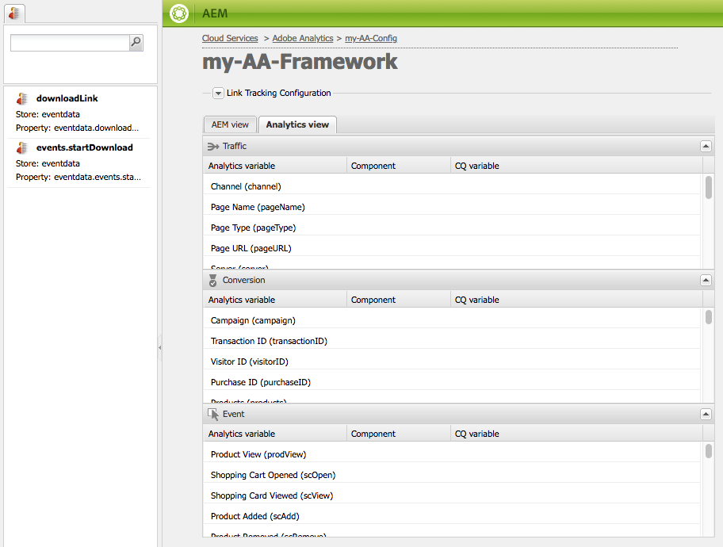

# Mappatura dei dati dei componenti con le proprietà di Adobe Analytics{#mapping-component-data-with-adobe-analytics-properties}

Aggiungi componenti al framework che raccolgono i dati da inviare ad Adobe Analytics. I componenti progettati per raccogliere i dati di Analytics memorizzano i dati nel modo appropriato **Variabile CQ**. Quando aggiungi un componente di questo tipo a un framework, il framework visualizza l’elenco delle variabili CQ in modo da poter ognuna di esse al **Variabile di Analytics**.

Quando il **AEM** è aperta le variabili di Analytics visualizzate in Content Finder.

Puoi mappare più variabili di Analytics con la stessa **Variabile CQ**.

I dati mappati vengono inviati ad Adobe Analytics al caricamento della pagina e sono soddisfatte le seguenti condizioni:

* La pagina è associata al framework.
* La pagina utilizza i componenti che vengono aggiunti al framework.

Utilizza la seguente procedura per mappare le variabili dei componenti CQ con le proprietà dei rapporti di Adobe Analytics.

1. In **AEM**, trascina un componente di tracciamento dalla barra laterale al framework. Ad esempio, trascina la **Pagina** componente dal **Generale** categoria.

   

   Sono disponibili diversi gruppi di componenti predefiniti: **Generale**, **Commerce**, **Community**, **Search&amp;Promote** e **Altro**. L’istanza AEM può essere configurata per visualizzare gruppi e componenti diversi.

1. Per mappare le variabili di Adobe Analytics con le variabili definite nel componente, trascina un **Variabile di Analytics** da Content Finder a un campo sul componente di tracciamento. Ad esempio, trascina `Page Name (pageName)` a `pagedata.title`.

   

   >[!NOTE]
   >
   >L’ID della suite di rapporti (RSID) selezionato per il framework determina le variabili Adobe Analytics visualizzate in Content Finder.

1. Ripeti i due passaggi precedenti per altri componenti e variabili.

   >[!NOTE]
   >
   >Puoi mappare più variabili di Analytics (ad esempio `props`, `eVars`, `events`) alla stessa variabile CQ (ad esempio `pagedata.title`)

   >[!CAUTION]
   >
   >Si consiglia vivamente di:
   >
   >* `eVars` e `props` sono mappate su variabili CQ che iniziano con `pagedata.X` o `eventdata.X`
   >* considerando che gli eventi devono essere mappati su variabili che iniziano con `eventdata.events.X`

1. Per rendere il framework disponibile nell’istanza di pubblicazione del sito, apri la **Pagina** scheda della barra laterale e fai clic su **Attiva framework.**

## Mappatura delle variabili relative al prodotto {#mapping-product-related-variables}

AEM utilizza una convenzione per la denominazione di variabili ed eventi relativi al prodotto che devono essere mappati sulle proprietà relative al prodotto Adobe Analytics:

| Variabile CQ | Variabile di Analytics | Descrizione |
|--- |--- |--- |
| `product.category` | `product.category` (variabile di conversione) | La categoria di prodotto. |
| `product.sku` | `product.sku` (variabile di conversione) | Il prodotto sku. |
| `product.quantity` | `product.quantity` (variabile di conversione) | Numero di prodotti acquistati. |
| `product.price` | `product.price` (variabile di conversione) | Il prezzo del prodotto. |
| `product.events.<eventName>` | Gli eventi di successo da associare al prodotto nel rapporto. | `product.events` è il prefisso per gli eventi denominati *eventName.* |
| `product.evars.<eVarName>` | La variabile o le variabili di conversione ( `eVar`) da associare al prodotto. | `product.evars` è il prefisso delle variabili eVar denominate *eVarName.* |

Diversi componenti Commerce AEM utilizzano questi nomi di variabili.

>[!NOTE]
>
>Non mappare la proprietà Adobe Analytics Products a una variabile CQ. La configurazione delle mappature relative al prodotto come descritto nella tabella equivale effettivamente alla mappatura della variabile Products .

### Verifica dei rapporti su Adobe Analytics {#checking-reports-on-adobe-analytics}

1. Accedi al sito web Adobe Analytics utilizzando le stesse credenziali fornite a AEM.
1. Assicurati che l&#39;RSID selezionato sia quello utilizzato nei passaggi precedenti.
1. In **Rapporti** (sul lato sinistro della pagina) seleziona **Conversione personalizzata**, quindi **Conversione personalizzata 1-10** e seleziona la variabile corrispondente a `eVar7`

1. A seconda della versione di Adobe Analytics in uso, è necessario attendere in media 45 minuti affinché il rapporto venga aggiornato con il termine di ricerca utilizzato; Ad esempio melanzane nell’esempio

## Utilizzo di Content Finder (cf#) con i framework Adobe Analytics {#using-the-content-finder-cf-with-adobe-analytics-frameworks}

Inizialmente, quando apri un framework Adobe Analytics, il Content Finder contiene variabili Analytics predefinite in:

* Traffico
* Conversione
* Eventi

Quando un RSID viene selezionato, tutte le variabili appartenenti a tale RSID vengono aggiunte all&#39;elenco.\
La `cf#` è necessario per mappare le variabili Analytics alle variabili CQ presenti sui diversi componenti di tracciamento. Vedere Impostazione di un framework per il tracciamento di base.

A seconda della vista selezionata per il framework, Content Finder sarà popolato da variabili di Analytics (in AEM vista) o da variabili CQ (in visualizzazione Analytics).

L’elenco può essere manipolato nei seguenti modi:

1. All&#39;interno **AEM**, l’elenco può essere filtrato a seconda del tipo di variabile selezionato utilizzando i 3 pulsanti di filtro:

   * Se *pulsante nessuno* selezionato, l’elenco mostra l’elenco completo.
   * Se la **Traffico** viene selezionato , l’elenco mostra solo le variabili appartenenti alla sezione Traffico .
   * Se la **Conversione** Se è selezionato, l’elenco mostrerà solo le variabili appartenenti alla sezione Conversione .
   * Se la **Eventi** Se è selezionato, l’elenco mostrerà solo le variabili appartenenti alla sezione Eventi .

   >[!NOTE]
   >
   >È possibile attivare un solo pulsante di filtro alla volta.

   >[!NOTE]
   >
   >Anche le variabili di Search&amp;Promote appartengono alla sezione Conversione .

   1. L’elenco dispone anche di una funzione di ricerca che filtra gli elementi in base al testo inserito nel campo di ricerca.
   1. Se durante la ricerca di elementi nell’elenco viene attivata un’opzione di filtro, i risultati visualizzati verranno filtrati in base anche al pulsante attivo.
   1. L’elenco può essere ricaricato in qualsiasi momento utilizzando il pulsante con le frecce girevoli.
   1. Se nel framework sono selezionati più RSID, tutte le variabili nell&#39;elenco verranno visualizzate utilizzando tutte le etichette utilizzate all&#39;interno degli RSID selezionati.

1. Nella visualizzazione Adobe Analytics, Content Finder visualizza tutte le variabili CQ appartenenti ai componenti di tracciamento trascinati nella visualizzazione CQ.

   * ad esempio nel caso in cui **Scarica componente** è *solo un trascinato* nella vista CQ (con due variabili mappabili) *eventdata.downloadLink* e *eventdata.events.startDownload*), il Content Finder sarà simile al seguente quando si passa alla visualizzazione Adobe Analytics:

   

   * Le variabili possono essere trascinate e rilasciate su qualsiasi variabile Adobe Analytics appartenente a una delle tre sezioni di variabili (**Traffico**, **Conversione** e **Eventi**).

   * Quando si trascina un nuovo componente di tracciamento nel framework in visualizzazione CQ, le variabili CQ appartenenti al componente vengono aggiunte automaticamente al Content Finder (cf#) nella visualizzazione Adobe Analytics.
   >[!NOTE]
   >
   >È possibile mappare una sola variabile CQ a una variabile Adobe Analytics in un dato momento.

## Utilizzo della vista AEM e della vista Analytics {#using-aem-view-and-analytics-view}

In un dato momento, gli utenti possono scegliere di passare da 2 modi diversi di visualizzare le mappature Adobe Analytics quando si trovano in una pagina di framework. Le due viste forniscono una migliore panoramica delle mappature all&#39;interno del quadro, da 2 prospettive diverse.

### Visualizzazione AEM {#aem-view}

Prendendo come esempio l&#39;immagine precedente, il **AEM** ha le seguenti proprietà:

1. Questa è la vista predefinita all&#39;apertura del framework.
1. Lato sinistro: content finder (cf#) viene popolato da variabili Adobe Analytics in base agli RSID selezionati.
1. Intestazioni di tabulazione (**AEM** e **Vista Analytics**): utilizza questi per passare da una visualizzazione all’altra.

1. **Vista AEM**:

   1. Se il framework presenta componenti ereditati dal relativo elemento padre, questi verranno elencati qui, insieme alle variabili mappate ai componenti.

      1. I componenti ereditati sono bloccati.
      1. Per sbloccare un componente ereditato, fai doppio clic sul lucchetto accanto al nome del componente
      1. Per ripristinare l’ereditarietà, è necessario eliminare il componente sbloccato; dopo di che riprenderà lo stato bloccato.
   1. **Trascina qui i componenti per includerli nel framework di analytics**: I componenti possono essere trascinati dalla barra laterale e rilasciati qui.
   1. Puoi trovare tutti i componenti attualmente inclusi nel framework di analytics:

      1. Per aggiungere un componente, trascinatene uno dalla scheda Componenti della barra laterale
      1. Per eliminare un componente e tutte le sue mappature, seleziona Elimina dal menu di scelta rapida del componente, quindi accetta l’eliminazione nella finestra di dialogo di conferma.
      1. Tieni presente che un componente può essere eliminato solo dal framework in cui è stato creato e non può essere eliminato dai framework figlio nel senso tradizionale (possono solo essere sovrascritti).

### Visualizzazione di Analytics {#analytics-view}

1. Per accedere a questa visualizzazione, passa alla **Vista Analytics** scheda nel framework.
1. Lato sinistro: Content Finder (cf#) popolato da variabili CQ basate sui componenti trascinati nel framework in visualizzazione CQ.
1. Intestazioni di tabulazione (**AEM** e **Vista Analytics**): utilizza questi per passare da una visualizzazione all’altra.

1. Le tre tabelle (Traffico, Conversione, Evento) elencano tutte le variabili Adobe Analytics disponibili. appartenenti agli RSID selezionati. Le mappature qui visualizzate devono essere uguali a quelle nella vista AEM:

   * **Traffico**:

      * Variabile traffico ( `prop1`) mappata a una variabile CQ ( `eventdata.downloadLink`)

      * Se accanto al componente è presente un blocco a mano, questo significa che viene ereditato da un framework padre e non può quindi essere modificato
   * **Conversione**:

      * Variabile di conversione ( `eVar1`) mappata a una variabile CQ ( `pagedata.title`)

      * Variabile di conversione ( `eVar3`) mappata a un&#39;espressione javascript aggiunta in linea facendo doppio clic sul campo della variabile CQ e immettendo il codice manualmente
   * **Evento**:

      * Variabile evento ( `event1`) mappata a un evento CQ ( `eventdata.events.pageView`)

>[!NOTE]
>
>È possibile compilare in linea anche la colonna della variabile CQ di qualsiasi tabella facendo doppio clic sul campo e aggiungendone del testo. Questi campi accettano javascript come input.
>
>Ad esempio, accanto a `prop3` puoi aggiungere:
>     `'`* `Adobe:'+pagedata.title+':'+pagedata.sitesection`\
per inviare *title* di una pagina concatenata con i relativi *seziona* utilizzo *:* (due punti) e con prefisso *Adobe* come `prop3`

>[!CAUTION]
È possibile mappare una sola variabile CQ a una variabile Adobe Analytics in un dato momento.
