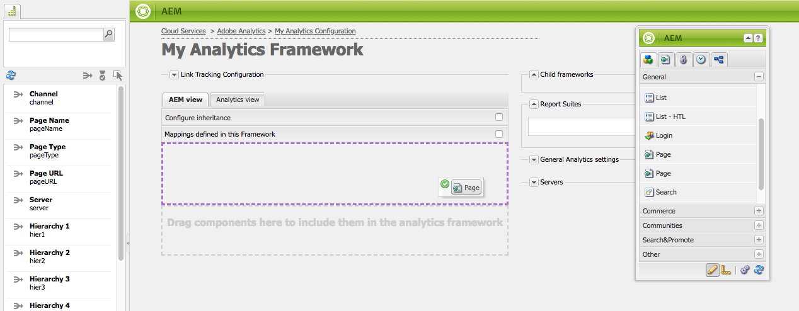

# Mappatura dei dati dei componenti con le proprietà di Adobe Analytics{#mapping-component-data-with-adobe-analytics-properties}

Aggiungi componenti al framework che raccolgono i dati da inviare ad Adobe Analytics. I componenti progettati per raccogliere i dati di analisi memorizzano i dati nel modo appropriato **Variabile CQ**. Quando aggiungi un componente di questo tipo a un framework, il framework visualizza l’elenco delle variabili CQ in modo che possiate aggiungerle al framework appropriato **Variabile di Analytics**.

Quando **Vista AEM** è aperto, le variabili di Analytics vengono visualizzate in content finder.

È possibile mappare più variabili di Analytics con lo stesso **Variabile CQ**.

I dati mappati vengono inviati ad Adobe Analytics quando la pagina viene caricata e vengono soddisfatte le seguenti condizioni:

* La pagina è associata al framework.
* La pagina utilizza i componenti aggiunti al framework.

Utilizza la procedura seguente per mappare le variabili dei componenti CQ con le proprietà dei rapporti di Adobe Analytics.

1. In **Vista AEM**, trascina un componente di tracciamento dalla barra laterale al framework. Ad esempio, trascina **Pagina** componente da **Generale** categoria.

   

   Esistono diversi gruppi di componenti predefiniti: **Generale**, **Commerce**, **Community**, e **Altro**. L’istanza AEM può essere configurata per visualizzare diversi gruppi e componenti.

1. Per mappare le variabili di Adobe Analytics con le variabili definite nel componente, trascina un’ **Variabile di Analytics** da content finder a un campo sul componente di tracciamento. Ad esempio, trascina `Page Name (pageName)` a `pagedata.title`.

   

   >[!NOTE]
   >
   >L’ID suite di rapporti (RSID) selezionato per il framework determina le variabili di Adobe Analytics che vengono visualizzate nel Finder del contenuto.

1. Ripeti i due passaggi precedenti per altri componenti e variabili.

   >[!NOTE]
   >
   >Puoi mappare più variabili di Analytics (ad esempio, `props`, `eVars`, `events`) alla stessa variabile CQ (ad esempio, `pagedata.title`)

   >[!CAUTION]
   >
   >Si consiglia vivamente di:
   >
   >* `eVars` e `props` sono mappati su variabili CQ che iniziano con `pagedata.X` o `eventdata.X`
   >* considerando che gli eventi devono essere mappati su variabili che iniziano con `eventdata.events.X`

1. Per rendere il framework disponibile nell’istanza di pubblicazione del sito, apri il **Pagina** scheda della barra laterale e fare clic su **Attiva framework.**

## Mappatura delle variabili relative al prodotto {#mapping-product-related-variables}

L’AEM utilizza una convenzione per denominare le variabili e gli eventi relativi ai prodotti che devono essere mappati sulle proprietà relative ai prodotti Adobe Analytics:

| Variabile CQ | Variabile di Analytics | Descrizione |
|--- |--- |--- |
| `product.category` | `product.category` (variabile di conversione) | La categoria del prodotto. |
| `product.sku` | `product.sku` (variabile di conversione) | Lo SKU del prodotto. |
| `product.quantity` | `product.quantity` (variabile di conversione) | Il numero di prodotti acquistati. |
| `product.price` | `product.price` (variabile di conversione) | Il prezzo del prodotto. |
| `product.events.<eventName>` | Eventi di successo da associare al prodotto nel report. | `product.events` è il prefisso degli eventi denominati *eventName.* |
| `product.evars.<eVarName>` | Variabili di conversione ( `eVar`) da associare al prodotto. | `product.evars` è il prefisso delle variabili eVar denominate *eVarName.* |

Diversi componenti di AEM Commerce utilizzano questi nomi di variabili.

>[!NOTE]
>
>Non mappare la proprietà Prodotti Adobe Analytics a una variabile CQ. La configurazione delle mappature relative al prodotto come descritto nella tabella equivale effettivamente alla mappatura della variabile Products.

### Controllo dei rapporti su Adobe Analytics {#checking-reports-on-adobe-analytics}

1. Accedi al sito web di Adobe Analytics utilizzando le stesse credenziali fornite all’AEM.
1. Verificare che l&#39;RSID selezionato sia quello utilizzato nei passaggi precedenti.
1. In entrata **Rapporti** (sul lato sinistro della pagina) seleziona **Conversione personalizzata**, quindi **Conversione personalizzata 1-10** e seleziona la variabile corrispondente a `eVar7`

1. A seconda della versione di Adobe Analytics in uso, è necessario attendere in media 45 minuti per l&#39;aggiornamento del rapporto con il termine di ricerca utilizzato, ad esempio melanzana

## Utilizzo di Content Finder (cf#) con i framework di Adobe Analytics {#using-the-content-finder-cf-with-adobe-analytics-frameworks}

Inizialmente, quando apri un framework Adobe Analytics, Content Finder contiene variabili Analytics predefinite in:

* Traffico
* Conversione
* Eventi

Quando viene selezionato un RSID, tutte le variabili appartenenti a tale RSID vengono aggiunte all&#39;elenco.\
Il `cf#` è necessario per mappare le variabili di Analytics alle variabili CQ presenti sui diversi componenti di tracciamento. Consulta Impostazione di un framework per il tracciamento di base.

A seconda della vista selezionata per il framework, il content finder verrà compilato da variabili di Analytics (nella vista AEM) o da variabili CQ (nella vista Analytics).

L’elenco può essere manipolato nei seguenti modi:

1. In **Vista AEM**, l’elenco può essere filtrato a seconda del tipo di variabile selezionato utilizzando i tre pulsanti di filtro:

   * Se *nessun pulsante* è selezionato, l’elenco mostra l’elenco completo.
   * Se il **Traffico** è selezionato, l’elenco mostra solo le variabili appartenenti alla sezione Traffico.
   * Se il **Conversione** è selezionato, l’elenco mostra solo le variabili appartenenti alla sezione Conversione.
   * Se il **Eventi** è selezionato, l’elenco mostra solo le variabili appartenenti alla sezione Eventi.

   >[!NOTE]
   >
   >Può essere attivo un solo pulsante di filtro alla volta.

   1. L’elenco dispone anche di una funzione di ricerca, che filtra gli elementi in base al testo immesso nel campo di ricerca.
   1. Se viene attivata un’opzione di filtro durante la ricerca di elementi nell’elenco, i risultati visualizzati verranno filtrati anche in base al pulsante attivo.
   1. L’elenco può essere ricaricato in qualsiasi momento utilizzando il pulsante con frecce ruotanti.
   1. Se nel framework sono selezionati più RSID, tutte le variabili dell&#39;elenco verranno visualizzate utilizzando tutte le etichette utilizzate negli RSID selezionati.

1. Nella vista Adobe Analytics, Content Finder mostra tutte le variabili CQ appartenenti ai componenti di tracciamento trascinati nella vista CQ.

   * Ad esempio, se il **Scarica componente** è il *solo un trascinato* nella vista CQ (con due variabili mappabili) *eventdata.downloadLink* e *eventdata.events.startDownload*), il Content Finder si presenta così quando si passa alla vista Adobe Analytics:

   

   * Le variabili possono essere trascinate e rilasciate su qualsiasi variabile Adobe Analytics appartenente a una delle tre sezioni delle variabili (**Traffico**, **Conversione** e **Eventi**).

   * Quando si trascina un nuovo componente di tracciamento nel framework in visualizzazione CQ, le variabili CQ appartenenti al componente vengono aggiunte automaticamente al Content Finder (cf#) in visualizzazione Adobe Analytics.

   >[!NOTE]
   >
   >È possibile mappare una sola variabile CQ a una variabile Adobe Analytics in un dato momento.

## Utilizzo delle viste AEM e Analytics {#using-aem-view-and-analytics-view}

In qualsiasi momento, gli utenti possono passare da una modalità all’altra per visualizzare le mappature di Adobe Analytics quando si trovano su una pagina del framework e viceversa. Le due opinioni forniscono una migliore panoramica delle mappature all&#39;interno del quadro, da due prospettive distinte.

### Vista AEM {#aem-view}

Prendendo l’immagine precedente come esempio, il **Vista AEM** ha le seguenti proprietà:

1. Questa è la vista predefinita all&#39;apertura del framework.
1. Lato sinistro: il Finder del contenuto (cf#) viene compilato da variabili Adobe Analytics in base agli RSID selezionati.
1. Intestazioni scheda (**Vista AEM** e **Vista Analytics**): utilizza questi per passare da una visualizzazione all’altra.

1. **Vista AEM**:

   1. Se il framework ha componenti ereditati dal relativo elemento padre, questi verranno elencati qui, insieme alle variabili mappate ai componenti.

      1. I componenti ereditati sono bloccati.
      1. Per sbloccare un componente ereditato, fai doppio clic sul lucchetto accanto al nome del componente
      1. Per ripristinare l’ereditarietà, elimina il componente sbloccato; dopodiché recupera lo stato bloccato.

   1. **Trascina qui i componenti da includere nel framework di analisi**: i componenti possono essere trascinati dal Sidekick e rilasciati qui.
   1. Puoi trovare tutti i componenti attualmente inclusi nel framework di analisi:

      1. Per aggiungere un componente, trascinane uno dalla scheda Componenti della barra laterale
      1. Per eliminare un componente e tutte le relative mappature, seleziona Elimina dal menu di scelta rapida del componente, quindi accetta l’eliminazione nella finestra di dialogo di conferma.
      1. Tieni presente che un componente può essere eliminato solo dal framework in cui è stato creato e non può essere eliminato dai framework secondari nel senso tradizionale del termine (può solo essere sovrascritto).

### Vista Analytics {#analytics-view}

1. È possibile accedere a questa visualizzazione passando alla **Vista Analytics** sul framework.
1. Lato sinistro: Content Finder (cf#) popolato da variabili CQ basate sui componenti trascinati nel framework nella vista CQ.
1. Intestazioni scheda (**Vista AEM** e **Vista Analytics**): utilizza questi per passare da una visualizzazione all’altra.

1. Nelle tre tabelle (Traffico, Conversione, Evento) sono elencate tutte le variabili Adobe Analytics disponibili. appartenenti agli RSID selezionati. Le mappature mostrate qui dovrebbero essere le stesse della vista AEM:

   * **Traffico**:

      * Variabile traffico ( `prop1`) mappato a una variabile CQ ( `eventdata.downloadLink`)

      * Quando il componente è associato a un lucchetto, questo significa che viene ereditato da un framework padre e quindi non può essere modificato

   * **Conversione**:

      * Variabile di conversione ( `eVar1`) mappato a una variabile CQ ( `pagedata.title`)

      * Variabile di conversione ( `eVar3`) mappato a un’espressione JavaScript aggiunta in linea facendo doppio clic sul campo della variabile CQ e immettendo il codice manualmente

   * **Evento**:

      * Variabile evento ( `event1`) mappato a un evento CQ ( `eventdata.events.pageView`)

>[!NOTE]
>
>Anche la colonna della variabile CQ di qualsiasi tabella può essere compilata in linea facendo doppio clic sul campo e aggiungendovi del testo. Questi campi accettano JavaScript come input.
>
>Ad esempio, accanto a `prop3` puoi aggiungere:
>     `'`* `Adobe:'+pagedata.title+':'+pagedata.sitesection`\
>per inviare *titolo* di una pagina concatenata con i relativi *sitesection* utilizzo *:* (due punti) e preceduto da *Adobe* as `prop3`
>

>[!CAUTION]
>
>È possibile mappare una sola variabile CQ a una variabile Adobe Analytics in un dato momento.
