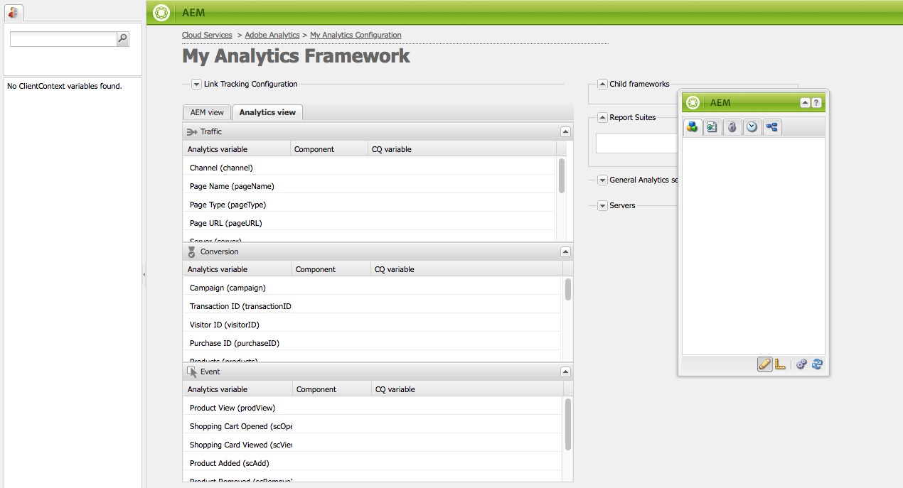

# Mappatura dei dati dei componenti con  proprietà Adobe Analytics{#mapping-component-data-with-adobe-analytics-properties}

Aggiungete componenti al framework che raccoglie i dati da inviare a  Adobe Analytics. I componenti progettati per raccogliere i dati di analisi memorizzano i dati nella variabile **CQ** appropriata. Quando aggiungete un componente di questo tipo a un framework, il framework visualizza l&#39;elenco delle variabili CQ in modo da poter passare alla **variabile Analytics** appropriata.

Quando la **vista AEM** è aperta, le variabili Analytics vengono visualizzate in Content Finder.

Potete mappare più variabili Analytics con la stessa **variabile CQ**.

I dati mappati vengono inviati a  Adobe Analytics quando la pagina viene caricata e vengono soddisfatte le seguenti condizioni:

* La pagina è associata al framework.
* La pagina utilizza i componenti che vengono aggiunti al framework.

Per mappare le variabili dei componenti CQ con  proprietà dei rapporti Adobe Analytics, attenersi alla procedura descritta di seguito.

1. Nella **vista AEM**, trascinate un componente di tracciamento dalla barra laterale al framework. Ad esempio, trascinare il componente **Page** dalla categoria **General**.

   

   Esistono diversi gruppi di componenti predefiniti: **Generale**, **Commerce**, **Communities**, **Search&amp;Promote** e **Altro**. L’istanza AEM può essere configurata per visualizzare diversi gruppi e componenti.

1. Per mappare  variabili Adobe Analytics con variabili definite nel componente, trascinate una **variabile Analytics** da Content Finder su un campo del componente di tracciamento. Ad esempio, trascinare `Page Name (pageName)` su `pagedata.title`.

   

   >[!NOTE]
   >
   >L&#39;ID Suite di rapporti (RSID) selezionato per il framework determina le variabili Adobe Analytics  visualizzate in Content Finder.

1. Ripetere i due passaggi precedenti per altri componenti e variabili.

   >[!NOTE]
   >
   >Potete mappare più variabili di Analytics (ad es. `props`, `eVars`, `events`) nella stessa variabile CQ (ad esempio `pagedata.title`)

   >[!CAUTION]
   >
   >Si consiglia vivamente di:
   >    
   >    * `eVars` e  `props` sono mappati su variabili CQ che iniziano con  `pagedata.X` o  `eventdata.X`
      >    
      >    
   * considerando che gli eventi devono essere mappati su variabili a partire da `eventdata.events.X`

1. Per rendere il framework disponibile nell&#39;istanza di pubblicazione del sito, aprite la scheda **Pagina** della barra laterale e fate clic su **Attiva framework.**

## Mapping delle variabili relative al prodotto {#mapping-product-related-variables}

AEM utilizza una convenzione per denominare variabili ed eventi relativi ai prodotti che devono essere mappati  proprietà relative ai prodotti Adobe Analytics:

| Variabile CQ | Variabile di Analytics | Descrizione |
|---|---|---|
| `product.category` | `product.category` (variabile di conversione) | La categoria di prodotti. |
| `product.sku` | `product.sku` (variabile di conversione) | Il prodotto sku. |
| `product.quantity` | `product.quantity` (variabile di conversione) | Numero di prodotti acquistati. |
| `product.price` | `product.price` (variabile di conversione) | Il prezzo del prodotto. |
| `product.events.<eventName>` | Gli eventi di successo da associare al prodotto nel rapporto. | `product.events` è il prefisso per gli eventi denominati  *eventName.* |
| `product.evars.<eVarName>` | Le variabili di conversione ( `eVar`) da associare al prodotto. | `product.evars` è il prefisso per  variabili di eVar denominate  *eVarName.* |

Diversi componenti Commerce AEM utilizzano questi nomi di variabili.

>[!NOTE]
>
>Non mappate la proprietà Prodotti Adobe Analytics  su una variabile CQ. La configurazione delle mappature relative ai prodotti come descritto nella tabella equivale a mappare la variabile Prodotti.

### Verifica dei rapporti  Adobe Analytics {#checking-reports-on-adobe-analytics}

1. Effettuate l&#39;accesso al sito Web  Adobe Analytics utilizzando le stesse credenziali fornite per AEM.
1. Assicurarsi che l&#39;RSID selezionato sia quello utilizzato nei passaggi precedenti.
1. In **Report** (sul lato sinistro della pagina) selezionare **Conversione personalizzata**, quindi **Conversione personalizzata 1-10** e selezionare la variabile corrispondente a `eVar7`

1. A seconda della versione di  Adobe Analytics in uso, è necessario attendere in media 45 minuti prima che il rapporto venga aggiornato con il termine di ricerca utilizzato; ad esempio melanzana nell&#39;esempio

## Utilizzo di Content Finder (cf#) con  framework Adobe Analytics {#using-the-content-finder-cf-with-adobe-analytics-frameworks}

Inizialmente, quando aprite un framework Adobe Analytics , Content Finder contiene variabili Analytics predefinite in:

* Traffico
* Conversione
* Eventi

Quando un RSID viene selezionato, tutte le variabili appartenenti a tale RSID vengono aggiunte all&#39;elenco.\
La `cf#` è necessaria per mappare le variabili di Analytics alle variabili CQ presenti nei diversi componenti di tracciamento. Vedere Impostazione di un framework per il tracciamento di base.

A seconda della vista selezionata per il framework, Content Finder viene popolato da variabili Analytics (nella vista AEM) o da variabili CQ (nella vista Analytics).

L’elenco può essere modificato nei seguenti modi:

1. In **AEM vista**, l&#39;elenco può essere filtrato a seconda del tipo di variabile selezionato utilizzando i 3 pulsanti di filtro:

   * Se *nessun pulsante* è selezionato, l&#39;elenco mostra l&#39;elenco completo.
   * Se è selezionato il pulsante **Traffic**, nell&#39;elenco verranno visualizzate solo le variabili appartenenti alla sezione Traffic.
   * Se è selezionato il pulsante **Conversion**, nell&#39;elenco verranno visualizzate solo le variabili appartenenti alla sezione Conversion.
   * Se è selezionato il pulsante **Eventi**, nell&#39;elenco verranno visualizzate solo le variabili appartenenti alla sezione Eventi.

   >[!NOTE]
   >
   >È possibile attivare un solo pulsante di filtro alla volta.

   >[!NOTE]
   >
   >Anche le variabili di Search&amp;Promote appartengono alla sezione Conversion (Conversione).

   1. Nell&#39;elenco è presente anche una funzione di ricerca, che filtra gli elementi in base al testo immesso nel campo di ricerca.
   1. Se durante la ricerca di elementi nell&#39;elenco viene attivata un&#39;opzione filtro, i risultati visualizzati verranno filtrati in base al pulsante attivo.
   1. L&#39;elenco può essere ricaricato in qualsiasi momento utilizzando il pulsante delle frecce a vortice.
   1. Se nel framework sono selezionati più RSID, tutte le variabili nell&#39;elenco verranno visualizzate utilizzando tutte le etichette utilizzate all&#39;interno dei RSID selezionati.

1. In  visualizzazione Adobe Analytics, Content Finder visualizza tutte le variabili CQ appartenenti ai componenti di tracciamento trascinati in CQ.

   * Ad esempio, se il **componente Download** è l&#39; *solo trascinato* nella visualizzazione CQ (che dispone di due variabili mappabili *eventdata.downloadLink* e *eventdata.events.startDownload*), Content Finder sarà simile a questo quando si passa alla visualizzazione  Adobe Analytics:

   

   * Le variabili possono essere trascinate&amp;llate su qualsiasi  variabile Adobe Analytics appartenente a una delle 3 sezioni variabili (**Traffic**, **Conversion** e **Events**).

   * Quando si trascina un nuovo componente di tracciamento nel framework in visualizzazione CQ, le variabili CQ appartenenti al componente vengono automaticamente aggiunte a Content Finder(cf#)  visualizzazione Adobe Analytics.
   >[!NOTE]
   >
   >È possibile mappare una sola variabile CQ a una  variabile Adobe Analytics contemporaneamente

## Utilizzo della vista AEM e della vista Analytics {#using-aem-view-and-analytics-view}

In qualsiasi momento, gli utenti possono scegliere tra due modi diversi per visualizzare le mappature Adobe Analytics  in una pagina di framework. Le due viste forniscono una migliore panoramica delle mappature all&#39;interno del quadro, da due prospettive distinte.

### Visualizzazione AEM {#aem-view}

Prendendo ad esempio l&#39;immagine precedente, la **AEM view** dispone delle seguenti proprietà:

1. Questa è la visualizzazione predefinita all&#39;apertura del framework.
1. Lato sinistro: Content Finder(cf#) è popolato da  variabili Adobe Analytics in base agli RSID selezionati.
1. Intestazioni di tabulazione (**vista AEM** e **vista Analytics**): usate queste per passare da una vista all’altra.

1. **Vista AEM**:

   1. Se il framework presenta componenti ereditati dal relativo elemento padre, questi saranno elencati qui, insieme alle variabili mappate ai componenti.

      1. I componenti ereditati sono bloccati.
      1. Per sbloccare un componente ereditato, fai doppio clic sul lucchetto accanto al nome del componente
      1. Per ripristinare l’ereditarietà, è necessario eliminare il componente sbloccato; dopodiché riprenderà il suo stato bloccato.
   1. **Trascina qui i componenti per includerli nel framework** di analisi: I componenti possono essere trascinati dalla barra laterale e rilasciati qui.
   1. Puoi trovare tutti i componenti attualmente inclusi nel framework di analisi:

      1. Per aggiungere un componente, trascinatelo dalla scheda Componenti della barra laterale
      1. Per eliminare un componente e tutte le relative mappature, selezionare Elimina dal menu di scelta rapida del componente, quindi accettare l&#39;eliminazione nella finestra di dialogo di conferma.
      1. Tenete presente che un componente può essere eliminato solo dal framework in cui è stato creato e non può essere eliminato dai framework figlio nel senso tradizionale (possono essere solo sovrascritti).

### Visualizzazione analisi {#analytics-view}

1. Per accedere a questa visualizzazione, passare alla scheda **Visualizzazione analisi** del framework.
1. Lato sinistro: Content Finder (cf#) popolato da variabili CQ basate sui componenti trascinati nel framework in visualizzazione CQ.
1. Intestazioni di tabulazione (**vista AEM** e **vista Analytics**): usate queste per passare da una vista all’altra.

1. Le tre tabelle (Traffico, Conversione, Evento) elencano tutte  variabili Adobe Analytics disponibili. appartenenti ai RSID selezionati. Le mappature mostrate di seguito devono corrispondere a quelle mostrate nella visualizzazione AEM:

   * **Traffico**:

      * Variabile Traffico ( `prop1`) mappata a una variabile CQ ( `eventdata.downloadLink`)

      * Se accanto al componente è presente un blocco blocco, questo significa che viene ereditato da un framework padre e non può essere modificato
   * **Conversione**:

      * Variabile di conversione ( `eVar1`) mappata a una variabile CQ ( `pagedata.title`)

      * Variabile di conversione ( `eVar3`) mappata a un&#39;espressione javascript aggiunta in linea facendo doppio clic sul campo della variabile CQ e immettendo manualmente il codice
   * **Evento**:

      * Variabile evento ( `event1`) mappata a un evento CQ ( `eventdata.events.pageView`)

>[!NOTE]
>
>È inoltre possibile compilare in linea la colonna della variabile CQ di qualsiasi tabella facendo doppio clic sul campo e aggiungendo del testo. Questi campi accettano javascript come input.
>
>* Ad esempio, accanto a `prop3` è possibile aggiungere
>* `'`* `Adobe:'+pagedata.title+':'+pagedata.sitesection`\
   >  per inviare il *titolo* di una pagina concatenata con la relativa *sezione del sito* utilizzando *:* (due punti) e con il prefisso *Adobe* come `prop3`

>

>[!CAUTION]
>
>È possibile mappare una sola variabile CQ a una  variabile Adobe Analytics in un dato momento.

