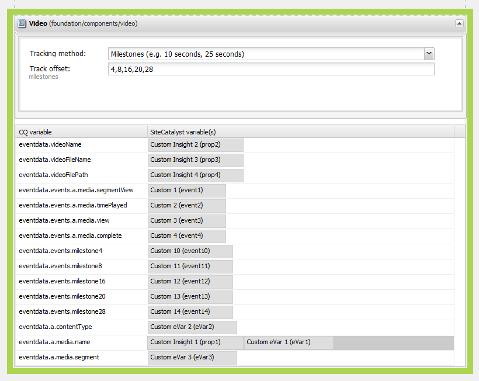

# Configurazione del tracciamento video per Adobe Analytics{#configuring-video-tracking-for-adobe-analytics}

Sono disponibili diversi metodi per il tracciamento degli eventi video, due dei quali sono opzioni legacy per le versioni precedenti di Adobe Analytics. Queste opzioni legacy sono: Milestone legacy e Secondi legacy.

>[!NOTE]
>
>Prima di continuare, accertarsi di disporre di **video riproducibile** caricati all’interno dell’AEM.
>
>Per fare in modo che i tuoi video vengano riprodotti sulla pagina, consulta **[questa esercitazione](/help/sites-authoring/default-components-foundation.md#video)** per informazioni su come trascodificare file video in AEM.

Utilizza la procedura seguente per impostare un framework per il tracciamento video utilizzando ogni metodo.

>[!NOTE]
>
>Per le nuove implementazioni, si consiglia di **non utilizzare** le opzioni legacy per il tracciamento video. Utilizza il **Milestone** al suo posto.

## Passaggi comuni {#common-steps}

1. Impostare una pagina Web trascinando una **componente video** dalla barra laterale e aggiungendo un elemento riproducibile **video come risorsa** per il componente

1. [Creare una configurazione e un framework di Adobe Analytics](/help/sites-administering/adobeanalytics.md).

   * Gli esempi nelle sezioni successive utilizzano il nome **my-sc-configuration** per la configurazione e **videofw** per il framework.

1. Nella pagina framework, selezionare un RSID e impostare l&#39;utilizzo su tutti. ([https://localhost:4502/cf#/etc/cloudservices/sitecatalyst/videoconf/videofw.html](https://localhost:4502/cf#/etc/cloudservices/sitecatalyst/videoconf/videofw.html))
1. Dalla categoria Componente generale in Sidekick, trascina il componente Video nel framework.
1. Seleziona un metodo di tracciamento:

   * [Milestone](/help/sites-administering/adobeanalytics.md)
   * [Milestone non legacy](/help/sites-administering/adobeanalytics.md)
   * [Milestone legacy](/help/sites-administering/adobeanalytics.md)
   * [Secondi legacy](/help/sites-administering/adobeanalytics.md)

1. Quando selezioni un metodo di tracciamento, l’elenco delle variabili CQ cambia di conseguenza. Utilizza le sezioni seguenti per informazioni su come configurare ulteriormente il componente e mappare le variabili CQ con le proprietà di Adobe Analytics.

## Milestone {#milestones}

Il metodo Milestones traccia la maggior parte delle informazioni sul video, è altamente personalizzabile e facile da configurare.

Per utilizzare il metodo Milestones, specificare gli offset della traccia basati sul tempo per definire le milestone. Quando una riproduzione video supera una fase cardine, la pagina chiama Adobe Analytics per tracciare l’evento. Per ogni attività cardine definita, il componente crea una variabile CQ da mappare su una proprietà Adobe Analytics. Il nome di queste variabili CQ utilizza il seguente formato:

```shell
eventdata.events.milestoneXX
```

Il suffisso XX è lo scostamento della traccia che definisce la fase cardine. Ad esempio, specificando uno scostamento di 4, 8, 16, 20 e 28 secondi, vengono generate le seguenti variabili CQ:

* `eventdata.events.milestone4`
* `eventdata.events.milestone8`
* `eventdata.events.milestone16`
* `eventdata.events.milestone20`
* `eventdata.events.milestone28`

Nella tabella seguente vengono descritte le variabili CQ predefinite fornite per il metodo Milestones:

<table>
 <tbody>
  <tr>
   <th>Variabili CQ</th>
   <th>Proprietà Adobe Analytics</th>
  </tr>
  <tr>
   <td>eventdata.videoName </td>
   <td>Le variabili mappate a questo conterranno il <strong>semplice da usare</strong> nome (<strong>Titolo</strong>) del video se è impostato in DAM; se non è impostato, il video <strong>nome file</strong> verrà inviato al suo posto. Inviato una sola volta, all’inizio della riproduzione di un video.</td>
  </tr>
  <tr>
   <td>eventdata.videoFileName </td>
   <td>Le variabili mappate a questo conterranno il nome del file. Inviato solo con eventdata.events.a.media.view </td>
  </tr>
  <tr>
   <td>eventdata.videoFilePath </td>
   <td>Le variabili mappate a questo conterranno il percorso del file sul server. Inviato solo con eventdata.events.a.media.view </td>
  </tr>
  <tr>
   <td>eventdata.events.a.media.segmentView </td>
   <td>Inviato ogni volta che viene passata una milestone di segmento </td>
  </tr>
  <tr>
   <td>eventdata.events.a.media.timePlayed</td>
   <td>Inviato ogni volta che viene attivata una milestone, insieme a questo evento viene inviato anche il numero di secondi trascorsi dall’utente a guardare il segmento specificato. ad esempio, eventX=21<br /> </td>
  </tr>
  <tr>
   <td>eventdata.events.a.media.view </td>
   <td>Inviato all’inizializzazione della visualizzazione video</td>
  </tr>
  <tr>
   <td>eventdata.events.a.media.complete </td>
   <td>Inviato al termine della riproduzione del video<br /> </td>
  </tr>
  <tr>
   <td>eventdata.events.milestoneX </td>
   <td>Inviato quando la data milestone viene passata, X sta per il secondo momento in cui la milestone viene attivata<br /> </td>
  </tr>
  <tr>
   <td>eventdata.a.contentType </td>
   <td>Inviato per ogni milestone; viene visualizzato come pev3 nella chiamata di Adobe Analytics, di solito inviata come "video"<br /> </td>
  </tr>
  <tr>
   <td>eventdata.a.media.name </td>
   <td>Corrisponde esattamente a eventdata.videoName </td>
  </tr>
  <tr>
   <td>eventdata.a.media.segment </td>
   <td>Contiene informazioni sul segmento visualizzato, ad esempio 2:O:4-8 </td>
  </tr>
 </tbody>
</table>

>[!NOTE]
>
>È possibile impostare i **semplice da usare** nome aprendo il video per la modifica in DAM e impostando **Titolo** campo di metadati al nome desiderato.

1. Dopo aver selezionato le Milestone come metodo di tracciamento, nella casella Offset tracciamento immettere un elenco separato da virgole di offset di tracciamento in secondi. Ad esempio, il seguente valore definisce le milestone a 4, 8, 16, 20 e 28 secondi dopo l’inizio del video:

   ```xml
   4,8,16,20,24
   ```

   I valori di offset devono essere numeri interi maggiori di 0. Il valore predefinito è `10,25,50,75`.

1. Per mappare le variabili CQ alle proprietà di Adobe Analytics, trascina le proprietà di Adobe Analytics da ContentFinder accanto alla variabile CQ sul componente.

   Per informazioni sull&#39;ottimizzazione delle mappature, vedere [Misurazione dei video in Adobe Analytics](https://experienceleague.adobe.com/docs/media-analytics/using/media-overview.html) guida.

1. [Aggiungere il framework](/help/sites-administering/adobeanalytics.md) alla pagina.
1. Per verificare la configurazione in **Modalità Anteprima**, riproduci il video per attivare le chiamate Adobe Analytics.

Gli esempi di dati di tracciamento di Adobe Analytics riportati di seguito si applicano al tracciamento di Milestone utilizzando offset di tracciamento di 4,8,16,20 e 24 e le seguenti mappature per le variabili CQ:

<table>
 <tbody>
  <tr>
   <th>Variabile CQ</th>
   <th>Adobe Analytics, proprietà</th>
  </tr>
  <tr>
   <td>eventdata.videoName </td>
   <td>prop2</td>
  </tr>
  <tr>
   <td>eventdata.videoFileName </td>
   <td>prop3 </td>
  </tr>
  <tr>
   <td>eventdata.videoFilePath </td>
   <td>prop4</td>
  </tr>
  <tr>
   <td>eventdata.events.a.media.segmentView </td>
   <td>event1</td>
  </tr>
  <tr>
   <td>eventdata.events.a.media.timePlayed</td>
   <td>event2<br /> </td>
  </tr>
  <tr>
   <td>eventdata.events.a.media.view </td>
   <td>event3</td>
  </tr>
  <tr>
   <td>eventdata.events.a.media.complete </td>
   <td>event4<br /> </td>
  </tr>
  <tr>
   <td>eventdata.events.milestone4</td>
   <td>event10</td>
  </tr>
  <tr>
   <td>eventdata.events.milestone8</td>
   <td>event11</td>
  </tr>
  <tr>
   <td>eventdata.events.milestone16</td>
   <td>event12</td>
  </tr>
  <tr>
   <td>eventdata.events.milestone20</td>
   <td>event13</td>
  </tr>
  <tr>
   <td>eventdata.events.milestone24</td>
   <td>event14</td>
  </tr>
  <tr>
   <td>eventdata.a.contentType </td>
   <td>eVar3</td>
  </tr>
  <tr>
   <td>eventdata.a.media.name </td>
   <td>eVar 1, prop1 </td>
  </tr>
  <tr>
   <td>eventdata.a.media.segment </td>
   <td>eVar2</td>
  </tr>
 </tbody>
</table>

In questo esempio, il componente Video viene visualizzato come segue nella pagina del framework:



>[!NOTE]
>
>Per visualizzare le chiamate effettuate ad Adobe Analytics utilizza uno strumento appropriato, come DigitalPulse Debugger o Fiddler.

Le chiamate ad Adobe Analytics che utilizzano l&#39;esempio fornito dovrebbero essere simili a queste quando vengono visualizzate con DigitalPulse Debugger:


*Questo è il **prima chiamata**apportate ad Adobe Analytics contenenti i seguenti valori:*

* *prop1 e eVar1 per eventdata.a.media.name,*
* *props2-4, insieme a eVar2 e eVar3 contenenti contentType (video) e segmento (1):O:1-4)*
* *event3 mappato su eventdata.events.a.media.view.*


*Questo è il **terza chiamata**made in Adobe Analytics:*

* *prop1 e eVar1 contengono a.media.name;*
* *event1 perché è stato visualizzato un segmento*
* *event2 inviato con tempo di riproduzione = 4*
* *event11 inviato perché è stato raggiunto eventdata.events.milestone8*
* *prop2-4 non viene inviato (poiché eventdata.events.a.media.view non è stato attivato)*

## Milestone non legacy {#non-legacy-milestones}

Il metodo delle Milestone non legacy è simile al metodo delle Milestone, tranne per il fatto che le milestone sono definite utilizzando percentuali della lunghezza del tracciato. Le caratteristiche comuni sono le seguenti:

* Quando una riproduzione video supera una fase cardine, la pagina chiama Adobe Analytics per tracciare l’evento.
* Il [set statico di variabili CQ](#cqvars) definiti per la mappatura con le proprietà di Adobe Analytics.
* Per ogni attività cardine definita, il componente crea una variabile CQ da mappare su una proprietà Adobe Analytics.

Il nome di queste variabili CQ utilizza il seguente formato:

Il suffisso XX è la percentuale della lunghezza del brano che definisce la fase cardine. Ad esempio, specificando percentuali di 10, 25, 50 e 75 si generano le seguenti variabili CQ:

* `eventdata.events.milestone10`
* `eventdata.events.milestone25`
* `eventdata.events.milestone50`
* `eventdata.events.milestone75`

```shell
eventdata.events.milestoneXX
```

1. Dopo aver selezionato le Milestone non legacy come metodo di tracciamento, nella casella Offset traccia immettere un elenco separato da virgole di percentuali della lunghezza del tracciamento. Ad esempio, il seguente valore predefinito definisce le attività cardine al 10, 25, 50 e 75 per cento della lunghezza del tracciamento:

   ```xml
   10,25,50,75
   ```

   I valori di offset devono essere numeri interi maggiori di 0.

1. Per mappare le variabili CQ alle proprietà di Adobe Analytics, trascina le proprietà di Adobe Analytics da ContentFinder accanto alla variabile CQ sul componente.

   Per informazioni sull&#39;ottimizzazione delle mappature, vedere [Misurazione dei video in Adobe Analytics](https://experienceleague.adobe.com/docs/media-analytics/using/media-overview.html) guida.

1. [Aggiungere il framework](/help/sites-administering/adobeanalytics.md) alla pagina.
1. Per verificare la configurazione in **Modalità Anteprima**, riproduci il video per attivare le chiamate Adobe Analytics.

## Milestone legacy {#legacy-milestones}

Questo metodo è simile al metodo Milestones con la differenza che le milestone specificate in *Offset tracciamento* sono percentuali invece dei set point all’interno del video.

>[!NOTE]
>
>Il campo Offset tracciamento accetta solo un elenco separato da virgole contenente numeri interi compresi tra 1 e 100.

1. Impostate l&#39;offset del brano.

   * ad esempio,10,50,75,100

   Inoltre, le informazioni inviate ad Adobe Analytics sono meno personalizzabili; sono disponibili solo 3 variabili per la mappatura:

<table>
 <tbody>
  <tr>
   <td>eventdata.videoName <br /> </td>
   <td>Le variabili mappate a questo conterranno il <strong>semplice da usare</strong> nome (<strong>Titolo</strong>) del video se è impostato in DAM; se il Titolo non è impostato, il video <strong>nome file</strong> verrà inviato al suo posto. Inviato una sola volta, all’inizio della riproduzione di un video.<br /> </td>
  </tr>
  <tr>
   <td>eventdata.videoFileName </td>
   <td>Le variabili mappate a questo conterranno il nome del file. Inviato una sola volta, all’inizio della riproduzione di un video.</td>
  </tr>
  <tr>
   <td>eventdata.videoFilePath </td>
   <td>La variabile mappata a questo conterrà il percorso del file sul server. Inviato una sola volta, all’inizio della riproduzione di un video.</td>
  </tr>
 </tbody>
</table>

>[!NOTE]
>
>È possibile impostare i **semplice da usare** nome aprendo il video per la modifica in DAM e impostando **Titolo** campo di metadati al nome desiderato. Al termine, è inoltre necessario salvare le modifiche apportate.

1. Mappa queste variabili su prop da 1 a 3

   Il **altre informazioni pertinenti** nella chiamata sarà inviato concatenato in **uno** variabile denominata **pev3**.

   **Chiamate di esempio** Per Adobe Analytics, l’esempio fornito dovrebbe essere simile al seguente quando viene visualizzato con DigitalPulse Debugger:

   

   *Il **pev3**la variabile inviata nella chiamata contiene le seguenti informazioni:*

   * *Nome* - Nome del file video (*film.avi*)

   * *Lunghezza* - Lunghezza del file video, in secondi (*100*)

   * *Nome lettore* - Lettore video utilizzato per riprodurre il file video (*Video su HTML5*)

   * *Totale secondi riprodotti* - Numero totale di secondi in cui il video è stato riprodotto (*25*)

   * *Timestamp di inizio* - Marca temporale che identifica quando è iniziata la riproduzione del video (*1331035567*)

   * *Riproduci sessione* - Dettagli della sessione di riproduzione. Questo campo indica come l’utente ha interagito con il video. Questo può includere dati quali il punto in cui è iniziata la riproduzione del video, se è stato utilizzato il cursore video per far avanzare il video e il punto in cui è stata interrotta la riproduzione del video (*L10E24S58L58 - video interrotto al secondo. 25 della sezione L10, quindi saltato a sec. 48*)

## Secondi legacy {#legacy-seconds}

Quando si utilizza il metodo ** secondi precedenti**, le chiamate di Adobe Analytics vengono attivate ogni N-esimo secondo, dove N è specificato nel campo Offset tracciamento.

1. Impostare lo scostamento del brano su un numero qualsiasi di secondi,

   * ad esempio, 6

   >[!NOTE]
   >
   >Il campo Offset tracciamento accetta solo numeri interi superiori a 0

   Le informazioni inviate ad Adobe Analytics sono meno personalizzabili. Sono disponibili solo 3 variabili per la mappatura:

<table>
 <tbody>
  <tr>
   <td>eventdata.videoName <br /> </td>
   <td>Le variabili mappate a questo conterranno il <strong>semplice da usare</strong> nome (<strong>Titolo</strong>) del video se è impostato in DAM; se il Titolo non è impostato, il video <strong>nome file</strong> verrà inviato al suo posto. Inviato una sola volta, all’inizio della riproduzione di un video.<br /> </td>
  </tr>
  <tr>
   <td>eventdata.videoFileName </td>
   <td>La variabile mappata a questo conterrà il nome del file. Inviato una sola volta, all’inizio della riproduzione di un video.</td>
  </tr>
  <tr>
   <td>eventdata.videoFilePath </td>
   <td>La variabile mappata a questo conterrà il percorso del file sul server. Inviato una sola volta, all’inizio della riproduzione di un video.</td>
  </tr>
 </tbody>
</table>

>[!NOTE]
>
>È possibile impostare i **semplice da usare** nome aprendo il video per la modifica in DAM e impostando **Titolo** campo di metadati al nome desiderato. Al termine, è inoltre necessario salvare le modifiche apportate.

1. Mappa queste variabili su prop1, prop2 e prop3

   Il **altre informazioni pertinenti** nella chiamata sarà inviato concatenato in **uno** variabile denominata **pev3**.

   Le chiamate ad Adobe Analytics che utilizzano l&#39;esempio fornito dovrebbero essere simili a queste quando vengono visualizzate con DigitalPulse Debugger:

   

   *La chiamata è simile alla chiamata Precedenti Milestone legacy. Vedi le informazioni sul pev3 **[fornito lì](/help/sites-administering/adobeanalytics.md)**.*

**Riferimenti utilizzati in questa esercitazione:**

[0] [https://experienceleague.adobe.com/docs/media-analytics/using/media-overview.html](https://experienceleague.adobe.com/docs/media-analytics/using/media-overview.html)
