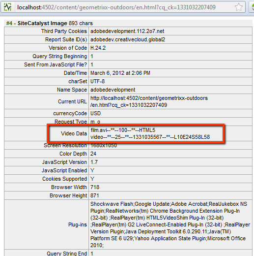

# Configurazione del tracciamento video per Adobe Analytics{#configuring-video-tracking-for-adobe-analytics}

Sono disponibili diversi metodi per monitorare gli eventi video, due dei quali sono opzioni legacy per le versioni precedenti di Adobe Analytics. Queste opzioni legacy sono: Milestone legacy e secondi legacy.

>[!NOTE]
>
>Prima di continuare, assicurati di disporre di un **video riproducibile** caricato in AEM.
>
>Per assicurarti che i tuoi video vengano riprodotti sulla pagina, consulta **[esercitazione](/help/sites-authoring/default-components-foundation.md#video)** per informazioni su come transcodificare i file video in AEM.

Segui la procedura seguente per impostare un framework per il tracciamento video utilizzando ogni metodo.

>[!NOTE]
>
>Per le nuove implementazioni, ti consigliamo di: **non utilizzare** le opzioni legacy per il tracciamento video. Utilizza la **Milestone** invece.

## Passaggi comuni {#common-steps}

1. Impostare una pagina web trascinando un **componente video** dalla barra laterale e aggiungere un elemento riproducibile **video come risorsa** per il componente

1. [Creare una configurazione e un framework Adobe Analytics](/help/sites-administering/adobeanalytics.md).

   * Gli esempi nelle sezioni seguenti utilizzano il nome **my-sc-configuration** per la configurazione e **video** per il quadro.

1. Nella pagina del framework, seleziona un RSID e imposta l&#39;utilizzo su tutti. ([https://localhost:4502/cf#/etc/cloudservices/sitecatalyst/videoconf/videofw.html](https://localhost:4502/cf#/etc/cloudservices/sitecatalyst/videoconf/videofw.html))
1. Dalla categoria del componente Generale nella barra laterale, trascinate il componente Video nel framework.
1. Seleziona un metodo di tracciamento:

   * [Milestone](/help/sites-administering/adobeanalytics.md)
   * [Milestone non legacy](/help/sites-administering/adobeanalytics.md)
   * [Milestone legacy](/help/sites-administering/adobeanalytics.md)
   * [Secondi legacy](/help/sites-administering/adobeanalytics.md)

1. Quando selezioni un metodo di tracciamento, l’elenco delle variabili CQ cambia di conseguenza. Utilizza le sezioni seguenti per informazioni su come configurare ulteriormente il componente e mappare le variabili CQ con le proprietà di Adobe Analytics.

## Milestone {#milestones}

Il metodo Milestones traccia la maggior parte delle informazioni sul video, è altamente personalizzabile e facile da configurare.

Per utilizzare il metodo Milestones, specificare gli offset di traccia basati sul tempo per definire le tappe. Quando una riproduzione video supera un punto cardine, la pagina chiama Adobe Analytics per tenere traccia dell’evento. Per ogni cardine definita, il componente crea una variabile CQ da mappare a una proprietà Adobe Analytics. Il nome di queste variabili CQ utilizza il formato seguente:

```shell
eventdata.events.milestoneXX
```

Il suffisso XX è l&#39;offset della traccia che definisce la cardine. Ad esempio, se si specificano gli offset di tracciamento di 4, 8, 16, 20 e 28 secondi, vengono generate le seguenti variabili CQ:

* `eventdata.events.milestone4`
* `eventdata.events.milestone8`
* `eventdata.events.milestone16`
* `eventdata.events.milestone20`
* `eventdata.events.milestone28`

La tabella seguente descrive le variabili CQ predefinite fornite per il metodo Milestones:

<table>
 <tbody>
  <tr>
   <th>Variabili CQ</th>
   <th>Proprietà di Adobe Analytics</th>
  </tr>
  <tr>
   <td>eventdata.videoName </td>
   <td>Le variabili mappate a questo conterranno <strong>facile da usare</strong> nome (<strong>Titolo</strong>) del video, se impostato nel DAM; se questo non è impostato, il video è <strong>nome file</strong> verranno invece inviati. Inviato una sola volta, all'inizio della riproduzione di un video.</td>
  </tr>
  <tr>
   <td>eventdata.videoFileName </td>
   <td>Le variabili mappate a questo conterranno il nome del file. Inviato solo con eventdata.events.a.media.view </td>
  </tr>
  <tr>
   <td>eventdata.videoFilePath </td>
   <td>Le variabili mappate a questo conterranno il percorso del file sul server. Inviato solo con eventdata.events.a.media.view </td>
  </tr>
  <tr>
   <td>eventdata.events.a.media.segmentView </td>
   <td>Inviato ogni volta che viene passata una fase cardine del segmento </td>
  </tr>
  <tr>
   <td>eventdata.events.a.media.timePlayed</td>
   <td>Inviato ogni volta che viene attivata un’attività cardine, viene inviato insieme a questo evento anche il numero di secondi trascorsi dall’utente a guardare il segmento specificato. ad esempio eventX=21<br /> </td>
  </tr>
  <tr>
   <td>eventdata.events.a.media.view </td>
   <td>Inviato all'inizializzazione della visualizzazione video</td>
  </tr>
  <tr>
   <td>eventdata.events.a.media.complete </td>
   <td>Inviato al termine della riproduzione del video<br /> </td>
  </tr>
  <tr>
   <td>eventdata.events.milestoneX </td>
   <td>Inviato quando l'attività cardine specificata viene passata, X rappresenta il secondo in cui l'attività cardine viene attivata in<br /> </td>
  </tr>
  <tr>
   <td>eventdata.a.contentType </td>
   <td>Inviato su ogni pietra miliare; si presenta come pev3 nella chiamata di Adobe Analytics, solitamente inviata come "video"<br /> </td>
  </tr>
  <tr>
   <td>eventdata.a.media.name </td>
   <td>Corrisponde esattamente a eventdata.videoName </td>
  </tr>
  <tr>
   <td>eventdata.a.media.segment </td>
   <td>Contiene informazioni sul segmento visualizzato, ad esempio 2:O:4-8 </td>
  </tr>
 </tbody>
</table>

>[!NOTE]
>
>È possibile impostare i **facile da usare** apri il video per la modifica nel DAM e imposta il **Titolo** campo metadati con il nome desiderato.

1. Dopo aver selezionato Milestones come metodo di tracciamento, nella casella Traccia offset immettere un elenco separato da virgole di offset di tracciamento in secondi. Ad esempio, il seguente valore definisce le tappe a 4, 8, 16, 20 e 28 secondi dall’inizio del video:

   ```xml
   4,8,16,20,24
   ```

   I valori di offset devono essere numeri interi maggiori di 0. Il valore predefinito è `10,25,50,75`.

1. Per mappare le variabili CQ alle proprietà Adobe Analytics, trascina le proprietà Adobe Analytics da ContentFinder accanto alla variabile CQ sul componente.

   Per informazioni sull’ottimizzazione delle mappature, consulta la sezione [Misurazione di video in Adobe Analytics](https://experienceleague.adobe.com/docs/media-analytics/using/media-overview.html) guida.

1. [Aggiungi il framework](/help/sites-administering/adobeanalytics.md) alla pagina.
1. Per verificare la configurazione in **Modalità Anteprima**, riproduci il video per attivare le chiamate Adobe Analytics.

Gli esempi di dati di tracciamento Adobe Analytics che seguono si applicano al tracciamento Milestone utilizzando offset di tracciamento pari a 4,8,16,20 e 24, e le seguenti mappature per le variabili CQ:

<table>
 <tbody>
  <tr>
   <th>Variabile CQ</th>
   <th>Proprietà Adobe Analytics</th>
  </tr>
  <tr>
   <td>eventdata.videoName </td>
   <td>prop2</td>
  </tr>
  <tr>
   <td>eventdata.videoFileName </td>
   <td>prop3 </td>
  </tr>
  <tr>
   <td>eventdata.videoFilePath </td>
   <td>prop4</td>
  </tr>
  <tr>
   <td>eventdata.events.a.media.segmentView </td>
   <td>event1</td>
  </tr>
  <tr>
   <td>eventdata.events.a.media.timePlayed</td>
   <td>event2<br /> </td>
  </tr>
  <tr>
   <td>eventdata.events.a.media.view </td>
   <td>event3</td>
  </tr>
  <tr>
   <td>eventdata.events.a.media.complete </td>
   <td>evento4<br /> </td>
  </tr>
  <tr>
   <td>eventdata.events.milestone4</td>
   <td>event10</td>
  </tr>
  <tr>
   <td>eventdata.events.milestone8</td>
   <td>event11</td>
  </tr>
  <tr>
   <td>eventdata.events.milestone16</td>
   <td>event12</td>
  </tr>
  <tr>
   <td>eventdata.events.milestone20</td>
   <td>event13</td>
  </tr>
  <tr>
   <td>eventdata.events.milestone24</td>
   <td>event14</td>
  </tr>
  <tr>
   <td>eventdata.a.contentType </td>
   <td>eVar 3</td>
  </tr>
  <tr>
   <td>eventdata.a.media.name </td>
   <td>eVar1, prop1 </td>
  </tr>
  <tr>
   <td>eventdata.a.media.segment </td>
   <td>eVar 2</td>
  </tr>
 </tbody>
</table>

Per questo esempio, il componente Video viene visualizzato come segue nella pagina del framework:


>[!NOTE]
>
>Per visualizzare le chiamate effettuate ad Adobe Analytics utilizza uno strumento appropriato, come DigitalPulse Debugger o Fiddler.

Le chiamate ad Adobe Analytics utilizzando l&#39;esempio fornito dovrebbero avere questo aspetto quando visualizzate con DigitalPulse Debugger:


*Questa è la **prima chiamata**in Adobe Analytics contenente i seguenti valori:*

* *prop1 e eVar1 per eventdata.a.media.name,*
* *props2-4, insieme ad eVar2 e eVar3 contenenti contentType (video) e segmenti (1):O:1-4)*
* *event3 mappato a eventdata.events.a.media.view.*


*Questa è la **terza chiamata**su Adobe Analytics:*

* *prop1 e eVar1 contengono a.media.name;*
* *event1 perché è stato visualizzato un segmento*
* *event2 inviato con tempo riprodotto = 4*
* *event11 inviato perché è stato raggiunto eventdata.events.milestone8*
* *Le proprietà da 2 a 4 non vengono inviate (poiché eventdata.events.a.media.view non è stato attivato)*

## Milestone non legacy {#non-legacy-milestones}

Il metodo Milestones non legacy è simile al metodo Milestones, tranne che per le milestone definite utilizzando percentuali della lunghezza del binario. I comuni sono i seguenti:

* Quando una riproduzione video supera un punto cardine, la pagina chiama Adobe Analytics per tenere traccia dell’evento.
* La [set statico di variabili CQ](#cqvars) definiti per la mappatura con le proprietà di Adobe Analytics.
* Per ogni cardine definita, il componente crea una variabile CQ da mappare a una proprietà Adobe Analytics.

Il nome di queste variabili CQ utilizza il formato seguente:

Il suffisso XX è la percentuale di lunghezza del brano che definisce il cardine. Ad esempio, specificando le percentuali di 10, 25, 50 e 75 si generano le seguenti variabili CQ:

* `eventdata.events.milestone10`
* `eventdata.events.milestone25`
* `eventdata.events.milestone50`
* `eventdata.events.milestone75`

```shell
eventdata.events.milestoneXX
```

1. Dopo aver selezionato Milestoni non legacy come metodo di tracciamento, nella casella Offset traccia immettere un elenco separato da virgole di percentuali di lunghezza del brano. Ad esempio, il seguente valore predefinito definisce le tappe a 10, 25, 50 e 75% della lunghezza del binario:

   ```xml
   10,25,50,75
   ```

   I valori di offset devono essere numeri interi maggiori di 0.

1. Per mappare le variabili CQ alle proprietà Adobe Analytics, trascina le proprietà Adobe Analytics da ContentFinder accanto alla variabile CQ sul componente.

   Per informazioni sull’ottimizzazione delle mappature, consulta la sezione [Misurazione di video in Adobe Analytics](https://experienceleague.adobe.com/docs/media-analytics/using/media-overview.html) guida.

1. [Aggiungi il framework](/help/sites-administering/adobeanalytics.md) alla pagina.
1. Per verificare la configurazione in **Modalità Anteprima**, riproduci il video per attivare le chiamate Adobe Analytics.

## Milestone legacy {#legacy-milestones}

Questo metodo è simile al metodo Milestones con la differenza che le tappe specificate nel *Offset tracciamento* i campi sono percentuali invece dei punti impostati all’interno del video.

>[!NOTE]
>
>Il campo Offset tracciamento accetta solo un elenco separato da virgole contenente numeri interi compresi tra 1 e 100.

1. Imposta l&#39;offset del brano.

   * e.g.10,50,75,100

   Inoltre, le informazioni inviate ad Adobe Analytics sono meno personalizzabili; sono disponibili solo 3 variabili per la mappatura:

<table>
 <tbody>
  <tr>
   <td>eventdata.videoName <br /> </td>
   <td>Le variabili mappate a questo conterranno <strong>facile da usare</strong> nome (<strong>Titolo</strong>) del video, se impostato nel DAM; se il campo Titolo non è impostato, l’ <strong>nome file</strong> verranno invece inviati. Inviato una sola volta, all'inizio della riproduzione di un video.<br /> </td>
  </tr>
  <tr>
   <td>eventdata.videoFileName </td>
   <td>Le variabili mappate a questo conterranno il nome del file. Inviato una sola volta, all'inizio della riproduzione di un video.</td>
  </tr>
  <tr>
   <td>eventdata.videoFilePath </td>
   <td>La variabile mappata a questo conterrà il percorso del file sul server. Inviato una sola volta, all'inizio della riproduzione di un video.</td>
  </tr>
 </tbody>
</table>

>[!NOTE]
>
>È possibile impostare i **facile da usare** apri il video per la modifica nel DAM e imposta il **Titolo** campo metadati con il nome desiderato. Al termine, è inoltre necessario salvare le modifiche apportate.

1. Mappa queste variabili nelle proprietà da 1 a 3

   La **resto delle informazioni pertinenti** nella chiamata di viene inviata concatenata in **uno** variabile denominata **pev3**.

   **Chiamate di esempio** per Adobe Analytics che utilizza l’esempio fornito dovrebbe essere simile al seguente quando viene visualizzato con DigitalPulse Debugger:

   

   *La **pev3**la variabile inviata nella chiamata contiene le informazioni seguenti:*

   * *Nome* - Il nome del file video (*film.avi*)

   * *Length* - La lunghezza del file video, in secondi (*100*)

   * *Nome del lettore* - Il lettore video utilizzato per riprodurre il file video (*Video su HTML5*)

   * *Secondi totali riprodotti* - Il numero totale di secondi di riproduzione del video (*25*)

   * *Timestamp iniziale* - Timestamp che identifica l&#39;avvio della riproduzione video (*1331035567*)

   * *Riproduci sessione* - I dettagli della sessione di gioco. Questo campo indica il modo in cui l’utente ha interagito con il video. Potrebbero includere dati quali la posizione in cui hanno iniziato a riprodurre il video, se hanno usato il cursore video per far avanzare il video e la posizione in cui hanno interrotto la riproduzione del video (*L10E24S58L58 - video arrestato al secondo. 25 della sezione L10, quindi ignorato al secondo. 48*)

## Secondi legacy {#legacy-seconds}

Quando si utilizza il metodo** dei secondi precedenti**, le chiamate Adobe Analytics vengono attivate ogni N-esimo secondo, dove N è specificato nel campo di offset del brano.

1. Imposta l&#39;offset del brano su un numero qualsiasi di secondi,

   * ad esempio 6
   >[!NOTE]
   >
   >Il campo Offset tracciamento accetta solo numeri interi superiori a 0

   Le informazioni inviate ad Adobe Analytics sono meno personalizzabili. Sono disponibili solo 3 variabili per la mappatura:

<table>
 <tbody>
  <tr>
   <td>eventdata.videoName <br /> </td>
   <td>Le variabili mappate a questo conterranno <strong>facile da usare</strong> nome (<strong>Titolo</strong>) del video, se impostato nel DAM; se il campo Titolo non è impostato, l’ <strong>nome file</strong> verranno invece inviati. Inviato una sola volta, all'inizio della riproduzione di un video.<br /> </td>
  </tr>
  <tr>
   <td>eventdata.videoFileName </td>
   <td>La variabile mappata a questo conterrà il nome del file. Inviato una sola volta, all'inizio della riproduzione di un video.</td>
  </tr>
  <tr>
   <td>eventdata.videoFilePath </td>
   <td>La variabile mappata a questo conterrà il percorso del file sul server. Inviato una sola volta, all'inizio della riproduzione di un video.</td>
  </tr>
 </tbody>
</table>

>[!NOTE]
>
>È possibile impostare i **facile da usare** apri il video per la modifica nel DAM e imposta il **Titolo** campo metadati con il nome desiderato. Al termine, è inoltre necessario salvare le modifiche apportate.

1. Mappa queste variabili su prop1, prop2 e prop3

   La **resto delle informazioni pertinenti** nella chiamata viene inviata concatinata in **uno** variabile denominata **pev3**.

   Le chiamate ad Adobe Analytics utilizzando l&#39;esempio fornito dovrebbero avere questo aspetto quando visualizzate con DigitalPulse Debugger:

   

   *La chiamata è simile alla chiamata Milestones legacy di cui sopra. Si prega di vedere le informazioni su pev3 **[purché](/help/sites-administering/adobeanalytics.md)**.*

**Riferimenti utilizzati in questa esercitazione:**

[0] [https://experienceleague.adobe.com/docs/media-analytics/using/media-overview.html](https://experienceleague.adobe.com/docs/media-analytics/using/media-overview.html)
