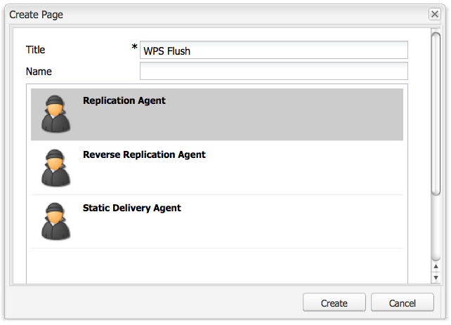
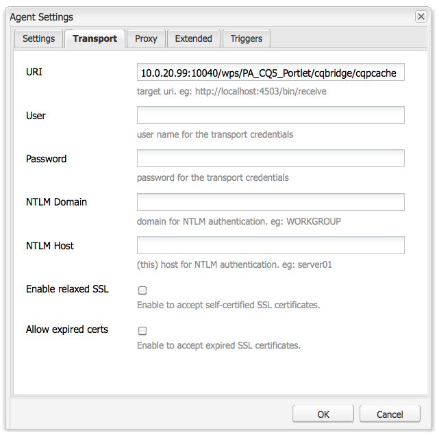
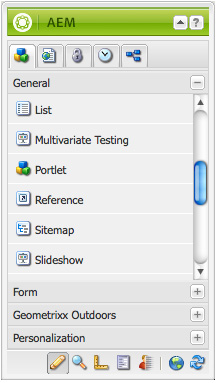

# Portali e portlet AEM{#aem-portals-and-portlets}

Questo documento descrive quanto segue:

* Architettura del portale AEM
* Amministrazione e configurazione di AEM come portale
* Utilizzo dell’AEM come portale
* Installazione, configurazione e visualizzazione di contenuto AEM in un portlet (ad esempio, un server Web)

## Architettura del portale AEM {#aem-portal-architecture}

L&#39;architettura del portale AEM include definizioni di portali e portlet.

### Che cos&#39;è un portale? {#what-is-a-portal}

Un portale è un&#39;applicazione Web che offre personalizzazione, accesso singolo, integrazione di contenuti da origini diverse e ospita il livello di presentazione dei sistemi informativi.

È possibile eseguire portlet conformi a JSR 286 in AEM. Il componente portlet consente di incorporare un portlet nella pagina. Consulta [Amministrazione del portlet dei contenuti dell’AEM](#administeringthecqcontentportlet).

### Che cos&#39;è un portlet? {#what-is-a-portlet}

I portlet sono componenti web distribuiti all’interno di un contenitore che genera contenuto dinamico. L&#39;interfaccia portlet viene creata e distribuita come file .war all&#39;interno di un contenitore portlet. Se si esegue AEM come portale, è necessario il file .war del portlet per eseguire il portlet.

Per configurare il contenuto AEM in modo che venga visualizzato in un portale, vedere [Installazione, configurazione e utilizzo di AEM in un portlet](#installingconfiguringandusingcqinaportlet).

### Director del portale AEM {#aem-portal-director}

>[!CAUTION]
>
>Il portale Director dell’AEM è diventato obsoleto a partire da AEM 6.4. Consulta [Funzioni obsolete e rimosse](https://helpx.adobe.com/experience-manager/6-4/release-notes/deprecated-removed-features.html).

## Amministrazione del portlet dei contenuti dell’AEM {#administering-the-aem-content-portlet}

Il portlet dei contenuti dell’AEM consente di visualizzare il contenuto dell’AEM in un portale. Il portlet è disponibile all&#39;indirizzo `/crx-quickstart/opt/portal`e possono essere personalizzati in vari modi. Ad esempio, puoi personalizzare la gestione di SSO/autenticazione implementando un servizio di autenticazione personalizzato che generi le informazioni di autenticazione richieste affinché l’AEM possa sovrascrivere il comportamento predefinito. I plug-in utilizzano un’API definita che ti consente di aggiungere le tue funzionalità creando il plug-in rispetto all’API. Il plug-in può essere distribuito nel portlet in esecuzione. Per funzionare correttamente, è necessaria una configurazione dell’istanza di authoring e pubblicazione dell’AEM insieme al percorso del contenuto da visualizzare all’avvio.

Alcune configurazioni possono essere modificate tramite le preferenze del portlet e altre tramite le configurazioni del servizio OSGi. Puoi modificare queste configurazioni utilizzando **config** o la console Web OSGi.

### Preferenze portlet {#portlet-preferences}

Le preferenze del portlet possono essere configurate al momento della distribuzione nel server di portale o modificando **WEB-INF/portlet.xml** prima di distribuire l&#39;applicazione Web portlet. Per impostazione predefinita, il file portlet.xml viene visualizzato come segue:

```xml
<?xml version="1.0" encoding="UTF-8"?>
<portlet-app xmlns="https://java.sun.com/xml/ns/portlet/portlet-app_1_0.xsd"
             xmlns:xsi="https://www.w3.org/2001/XMLSchema-instance"
             xsi:schemaLocation="https://java.sun.com/xml/ns/portlet/portlet-app_1_0.xsd /opt/SUNWps/dtd/portlet.xsd"
             version="1.0">
   <portlet>
      <portlet-name>RSSWeatherPortlet</portlet-name>
      <portlet-class>org.jboss.portlet.weather.WeatherPortlet</portlet-class>
      <init-param>
         <name>default_zipcode</name>
         <value>05673</value>
      </init-param>
      <init-param>
         <name>RSS_XSL</name>
         <value>/WEB-INF/Rss.xsl</value>
      </init-param>
      <init-param>
         <name>base_url</name>
         <value>https://xml.weather.yahoo.com/forecastrss?p=</value>
      </init-param>
      <expiration-cache>180</expiration-cache>
      <supports>
         <mime-type>text/html</mime-type>
         <portlet-mode>VIEW</portlet-mode>
         <portlet-mode>EDIT</portlet-mode>
      </supports>
      <portlet-info>
         <title>Weather Portlet</title>
      </portlet-info>
      <portlet-preferences>
         <preference>
            <name>expires</name>
            <value>180</value>
         </preference>
         <preference>
            <name>RssXml</name>
            <value>https://xml.weather.yahoo.com/forecastrss?p=33145</value>
            <read-only>false</read-only>
         </preference>
      </portlet-preferences>
   </portlet>
</portlet-app>
```

Il portlet può essere configurato con le seguenti preferenze:

<table>
 <tbody>
  <tr>
   <td>startPath</td>
   <td><p>Questo è il percorso iniziale del portlet: definisce il contenuto visualizzato inizialmente.</p> <p><strong>Importante</strong>: se il portlet è configurato per connettersi alle istanze di authoring e pubblicazione AEM in esecuzione su un percorso di contesto diverso da<strong> /</strong>, è necessario attivare la forza <strong>CQUrlInfo</strong> nella configurazione Html Library Manager di queste istanze AEM (ad esempio, tramite Felix Webconsole) o la modifica non funzionerà e la finestra di dialogo delle preferenze non verrà visualizzata.</p> </td>
  </tr>
  <tr>
   <td>htmlSelector</td>
   <td>Il selettore che viene aggiunto a ogni URL. Per impostazione predefinita è <strong>portlet</strong>, in modo che tutte le richieste alle pagine html utilizzino gli URL che terminano con <strong>.portlet.html.</strong> Questo consente l’utilizzo di script personalizzati all’interno di AEM per il rendering del portlet.</td>
  </tr>
  <tr>
   <td>addCssToPortalHeader</td>
   <td><p>Per impostazione predefinita, i file CSS inclusi nella pagina HTML dell'AEM sono inclusi nel portlet. La disattivazione di questa opzione esclude i file css predefiniti.</p> <p>Se questa opzione è abilitata, i file CSS vengono aggiunti all’intestazione della pagina html o incorporati nella pagina html a seconda del comportamento del portale.</p> </td>
  </tr>
  <tr>
   <td>includeToolbar</td>
   <td>Per impostazione predefinita, viene eseguito il rendering di una barra degli strumenti all'interno del portlet dei contenuti per la funzionalità di gestione. Disattivando questa opzione, non viene riprodotta alcuna barra degli strumenti.</td>
  </tr>
  <tr>
   <td>urlParameterNames</td>
   <td><p>Elenco di nomi di parametri URL alternativi che potrebbero contenere il nuovo URL di contenuto da visualizzare per il portlet. L’elenco viene elaborato dall’alto verso il basso; viene utilizzato il primo parametro contenente un valore. Se non viene trovato alcun URL, viene utilizzato il parametro URL predefinito. L’URL fornito viene utilizzato così com’è, senza ulteriori modifiche.</p> <p>Questa impostazione si riferisce al portlet distribuito; consente inoltre di configurare globalmente alcuni parametri URL nella configurazione OSGi per "Day Portal Director Portlet Bridge".</p> </td>
  </tr>
  <tr>
   <td>preferenzaDialogo</td>
   <td>Percorso della finestra di dialogo delle preferenze in AEM: se lasciato vuoto, viene utilizzata la finestra di dialogo delle preferenze incorporata. Il valore predefinito è /libs/portal/content/prefs.html.</td>
  </tr>
  <tr>
   <td>initialRedirect</td>
   <td>Per impostazione predefinita, il portlet esegue un reindirizzamento JavaScript dell'intera pagina del portale alla prima chiamata. In questo modo è possibile supportare lo scenario di trascinamento della selezione dei server di portale moderni. In produzione questo reindirizzamento è raramente necessario e può quindi essere disattivato impostando questa preferenza su <em>false</em>.</td>
  </tr>
 </tbody>
</table>

#### Console web OSGi {#osgi-web-console}

Se il server portale viene eseguito su host locale, la porta 8080 e l&#39;applicazione Web portlet AEM sono montate nel contesto dell&#39;applicazione Web *portlet*, l’url di per la console web è `https://localhost:8080/cqportlet/cqbridge/system/console`. L&#39;utente e la password predefiniti sono **admin**.

Apri **Configurazioni** e seleziona **Configurazione server CQ directory portale**. Qui puoi specificare l’URL di base per l’istanza di authoring e pubblicazione. Questa procedura è descritta in [Configurazione del portlet](#configuring-the-portlet).

>[!NOTE]
>
>La console web OSGi è destinata solo alla modifica delle configurazioni durante lo sviluppo (o il test). Assicurati di bloccare le richieste alla console per i sistemi di produzione.

### Fornitura di configurazioni {#providing-configurations}

Per supportare le distribuzioni automatizzate e il provisioning della configurazione, il portlet dei contenuti AEM dispone del supporto integrato per la configurazione che tenta di leggere le configurazioni dal classpath fornito all&#39;applicazione portlet.

All&#39;avvio, la proprietà di sistema **com.day.cq.portet.config** viene letto per rilevare l’ambiente corrente. In genere, il valore di questa proprietà è simile a **dev**, **prod**, **test** e così via. Se non è impostato alcun ambiente, non viene letta alcuna configurazione.

Se è impostato un ambiente, viene eseguita una ricerca nel file di configurazione nel percorso di classe in* ***com/day/cq/portlet/{env}.config** dove **env** viene sostituito con il valore effettivo per l’ambiente. Questo file deve elencare tutti i file di configurazione per questo ambiente. La ricerca di questi file viene eseguita in base alla posizione del file di configurazione. Ad esempio, se il file contiene una riga `my.service.xml,` questo file viene letto dal percorso di classe in `com/day/cq/portlet/my.service.config.` Il nome del file è costituito dall’ID di persistenza del servizio, seguito da **.config**. Nell’esempio precedente, l’ID persistenza è **my.service**. Il formato del file di configurazione è il formato utilizzato dal programma di installazione di Apache Sling OSGi.

Ciò significa che, per ogni ambiente, è necessario aggiungere un file di configurazione corrispondente. Una configurazione che deve essere applicata a tutti gli ambienti deve essere immessa in tutti questi file; se si tratta di un ambiente singolo, viene appena immessa in quel file. Questo meccanismo garantisce il controllo completo sulla configurazione che viene letta in un determinato ambiente.

Per rilevare l’ambiente è possibile utilizzare una proprietà di sistema diversa. Specificare la proprietà di sistema **com.day.cq.portet.configproperty** contenente il nome della proprietà di sistema da utilizzare al posto di **com.day.cq.portet.config**.

#### Annullamento della validità della memorizzazione in cache e del caching {#caching-and-caching-invalidation}

Nella sua configurazione predefinita, il portlet memorizza nella cache le risposte ricevute da WCM AEM in una cache specifica per l’utente. Le cache devono essere invalidate quando si verificano modifiche nel contenuto dell’istanza Publish. A questo scopo, in WCM per AEM è necessario configurare un agente di replica nell’istanza di authoring. La cache può anche essere scaricata manualmente. In questa sezione vengono descritte entrambe le procedure.

Il portlet può essere configurato con una propria cache, in modo che il contenuto del portlet venga visualizzato senza richiedere l’accesso a AEM. Il portale è disponibile come contenuto in /libs/portal/director. Per accedere al contenuto, avvia un’istanza AEM e scarica il file da tale posizione utilizzando CRXDE Liti o Webdav.

Puoi distribuire questo bundle in fase di esecuzione o aggiungerlo all’applicazione web portlet all’indirizzo `WEB-INF/lib/resources/bundles` prima della distribuzione.

Una volta distribuita la cache, il portlet memorizza in cache i contenuti dell’istanza Publish. La cache del portlet può essere invalidata con uno svuotamento del dispatcher dall’AEM. Per configurare il portlet in modo che utilizzi la propria cache:

1. Configurare un agente di replica nell&#39;istanza di authoring che esegua il targeting del server portale.
1. Presupponendo che il server portale sia in esecuzione sull&#39;host **localhost**, **porta 8080 **e l&#39;applicazione web portlet AEM è montata nel contesto **portlet**, l’url per svuotare la cache è `https://localhost:8080/cqportlet/cqbridge/cqpcache?Path=$(path)`. Utilizza GET come metodo.
   **Nota:** Invece di utilizzare un parametro di richiesta, puoi inviare un’intestazione http denominata **Percorso**.

#### Scaricamento della cache tramite l’agente di replica {#flushing-the-cache-via-replication-agent}

Proprio come il normale annullamento della validità del dispatcher, è possibile configurare un agente di replica per eseguire il targeting della cache del portlet AEM del portale. Dopo aver configurato l’agente di replica, ogni attivazione regolare delle pagine svuota la cache del portale.

Se gestisci più nodi di portale che eseguono il portlet AEM, devi creare un agente per ciascun nodo come descritto in questa procedura.

Per configurare un agente di replica per il portale:

1. Accedi all’istanza di authoring.
1. Nella scheda Siti Web fare clic su *Strumenti* scheda.
1. Clic **Nuova pagina...** negli agenti di replica **Nuovo...** menu.

   

1. In entrata *Modello*, seleziona *Agente di replica* e immettere un nome per l&#39;agente. Fai clic su *Crea*.

   

1. Fai doppio clic sull’agente di replica creato. Viene visualizzato come non valido in quanto non è ancora stato configurato.

   

1. Clic **Modifica.**
1. In **Impostazioni** , seleziona la scheda **Abilitato** , selezionare **Scaricamento del Dispatcher** come tipo di serializzazione e inserisci un timeout per un nuovo tentativo (ad esempio, 60000).

   

1. Fai clic su **Trasporto** scheda.
1. In **URI** , immettere l&#39;URI di scaricamento (URL) del portlet. L’URI si trova nel formato seguente:

   ```xml
   https://<wps-host>:<port>/<wps-context>/<cq5-portlet-context>/cqbridge/cqpcache
   ```

   

1. Fai clic su **Esteso** scheda.

   

1. In **Metodo HTTP** campo, tipo **GET**.
1. In **Intestazioni HTTP** , fare clic su **+** per aggiungere una nuova voce e digitare **Percorso: {path}**.
1. Se necessario, fai clic su **Proxy** e immettere le informazioni sul proxy per l&#39;agente.
1. Clic **OK** per salvare le modifiche.
1. Per verificare la connessione, fare clic su **Verifica connessione** collegamento. Viene visualizzato un messaggio di registro che indica se il test di replica è riuscito. Ad esempio:

   

#### Scaricamento manuale della cache del portlet {#manually-flushing-the-portlet-cache}

Puoi svuotare manualmente la cache del portlet accedendo allo stesso URL configurato per l’agente di replica. Consulta [Scaricamento della cache](#flushing-the-cache-via-replication-agent) per il formato dell’URL. Inoltre, l’URL deve essere esteso con un parametro URL Path=&lt;path> per indicare cosa scaricare.

Ad esempio:

`https://10.0.20.99:10040/wps/PA_CQ5_Portlet/cqbridge/cqpcache?Path=*` svuota la cache completa. `https://10.0.20.99:10040/wps/PA_CQ5_Portlet/cqbridge/cqpcache?Path=/content/mypage/xyz` scaricamenti `/content/mypage/xyz` dalla cache.

### Sicurezza portale {#portal-security}

Il portale è il meccanismo di autenticazione guida. È possibile accedere all&#39;AEM con un utente tecnico, l&#39;utente del portale, un gruppo e così via. Il portlet non ha accesso alla password per l&#39;utente nel portale, quindi se il portlet non conosce tutte le credenziali per accedere correttamente a un utente, è necessario utilizzare una soluzione SSO. In questo caso, il portlet dell&#39;AEM inoltra tutte le informazioni richieste all&#39;AEM, che a sua volta le trasmette al relativo archivio AEM. Questo comportamento è collegabile e può essere personalizzato.

### Autenticazione al momento della pubblicazione {#authentication-on-publish}

In questa sezione vengono descritte le modalità di autenticazione disponibili che il portlet può utilizzare per comunicare con le istanze WCM AEM sottostanti.

Per impostazione predefinita, non vengono inviate informazioni sull’utente all’istanza Publish dell’AEM; il contenuto viene sempre visualizzato come utente anonimo. È necessario attivare questa opzione se le informazioni specifiche dell’utente devono essere fornite dall’AEM o se è richiesta l’autenticazione dell’utente per la pubblicazione.

#### Accesso alla configurazione di autenticazione del portlet {#accessing-the-portlet-s-authentication-configuration}

Le opzioni di configurazione dell’autenticazione utilizzate dal portlet nelle istanze WCM dell’AEM sono disponibili nella console web (configurazione OSGi).

>[!NOTE]
>
>Quando si lavora con AEM, sono disponibili diversi metodi di gestione delle impostazioni di configurazione per i servizi OSGi (nodi della console o dell’archivio).
>
>Consulta [Configurazione di OSGi](/help/sites-deploying/configuring-osgi.md) per informazioni dettagliate.

Per accedere alla configurazione dell&#39;autenticazione del portlet:

1. Accedi alla console Web al seguente URL:

   `https://localhost:8080/cqportlet/cqbridge/system/console`

   Ad esempio, nella sua configurazione predefinita:

   `https://wps-host:10040/wps/PA_CQ5_Portlet/cqbridge/system/console`

1. Accedi alla console Web. Le credenziali predefinite sono `admin/admin`.
1. Nella console, seleziona **Configurazione**.
1. In **Configurazione** selezionare un servizio specifico da configurare. I servizi sono forniti dal portlet nel framework OSGi.

   | Nome servizio | Descrizione |
   |---|---|
   | Day Portal Director Authenticator | Configurare la modalità di autenticazione utilizzata per le istanze WCM AEM. A seconda della modalità selezionata, è possibile specificare un utente tecnico o il nome del cookie SSO. È inoltre possibile abilitare l’autenticazione per le istanze di pubblicazione WCM dell’AEM. |
   | Cache file Director Day Portal | Configura i parametri del modo in cui il portlet memorizza nella cache le risposte ricevute dalle istanze WCM dell’AEM. |
   | Servizio Client HTTP Director Day Portal | Configurare il modo in cui il portlet si connette tramite HTTP alle istanze WCM AEM sottostanti. È possibile, ad esempio, specificare un server proxy. |
   | Gestore impostazioni internazionali Director Day Portal | Configurare le lingue supportate dal portlet. Le richieste alle istanze WCM dell’AEM si basano sulle impostazioni locali dell’utente; ad esempio, la lingua utente *tedesco *richiederebbe `/content/geometrixx/de/`.... |
   | Day Portal Gestione privilegi Director | Configurare se il portlet deve testare la scheda Siti Web in base all&#39;utente attualmente connesso. |
   | Rendering barra degli strumenti Director Day Portal | Personalizzare il rendering della barra degli strumenti del portlet. |

1. Inoltre, puoi configurare la console web e il servizio di registrazione. Ad esempio, puoi modificare le credenziali amministratore per la console web facendo clic sul collegamento Apache Felix OSGi Management Console.

#### Modalità utente tecnico {#technical-user-mode}

In modalità predefinita, tutte le richieste emesse dal portlet per l’istanza di authoring WCM dell’AEM vengono autenticate utilizzando lo stesso utente tecnico, indipendentemente dall’utente corrente del portale. La modalità utente tecnico è attivata per impostazione predefinita. Abilita/disabilita questa modalità nella rispettiva schermata di configurazione nella console di gestione OSGi:

L’utente tecnico specificato deve esistere nell’istanza di authoring WCM dell’AEM e nell’istanza di pubblicazione se **Autentica alla pubblicazione** è abilitato. Assicurati di fornire all’utente privilegi di accesso sufficienti per il lavoro di authoring.

#### SSO {#sso}

Il portlet supporta l’SSO con AEM preconfigurato. Il servizio di autenticazione può essere configurato in modo da utilizzare l&#39;SSO e trasmettere l&#39;utente del portale corrente con il formato **Base** come cookie denominato `cqpsso` all&#39;AEM. L’AEM deve essere configurato per utilizzare il gestore di autenticazione SSO per il percorso /. Il nome del cookie deve essere configurato anche qui.

Il `crx-quickstart/repository/repository.xml` per l’AEM deve essere configurato di conseguenza:

```xml
<LoginModule class="com.day.crx.security.authentication.CRXLoginModule">
  ...
  <param name="trust_credentials_attribute" value="TrustedInfo"/>
  <param name="anonymous_principal" value="anonymous"/>
</LoginModule>
```

#### Modalità di autenticazione SSO {#sso-authentication-mode}

Il portlet può eseguire l&#39;autenticazione per AEM WCM utilizzando lo schema Single Sign On (SSO). In questa modalità, l’utente attualmente connesso al portale viene inoltrato a WCM AEM sotto forma di cookie SSO. Se si utilizza la modalità SSO, tutti gli utenti del portale con accesso al portlet AEM devono essere noti alle istanze WCM dell’AEM sottostanti, più comunemente sotto forma di WCM dell’AEM connesso al protocollo LDAP o mediante la creazione manuale degli utenti in precedenza. Inoltre, prima di abilitare l’SSO nel portlet, l’istanza di authoring WCM AEM sottostante (e l’istanza di pubblicazione, se **Autentica alla pubblicazione** è abilitato) deve essere configurato per accettare richieste basate su SSO.

Per configurare il portlet per l&#39;utilizzo della modalità di autenticazione SSO, completare i passaggi seguenti (descritti in dettaglio nelle sezioni seguenti):

* Consente all&#39;archivio WCM AEM di accettare credenziali attendibili.
* Abilitare l&#39;autenticazione SSO in WCM AEM.
* Abilitare l&#39;autenticazione SSO nel portlet AEM.

#### Abilitazione dell&#39;archivio di WCM AEM per accettare credenziali attendibili {#enabling-aem-wcm-s-repository-to-accept-trusted-credentials}

Prima di poter abilitare l’SSO per WCM AEM, è necessario configurare l’archivio sottostante in modo da accettare le credenziali attendibili fornite da WCM AEM. A tale scopo, è necessario configurare il file repository.xml dell&#39;AEM.

1. Nel file system in cui è installato AEM WCM, aprire il file seguente:

   `//crx-quickstart/repository/repository.xml`

1. Nel file XML, trovare la voce per **LoginModule** e aggiungi trust_credentials_attribute alla relativa configurazione:

   ```xml
   <LoginModule class="com.day.crx.security.authentication.CRXLoginModule">
     ...
     <param name="trust_credentials_attribute" value="TrustedInfo"/>
     <param name="anonymous_principal" value="anonymous"/>
   </LoginModule>
   ```

1. Riavviare AEM WCM per rendere effettive le modifiche.

#### Abilitazione dell’autenticazione SSO in AEM WCM {#enabling-sso-authentication-in-the-aem-wcm}

Per abilitare l’SSO in WCM AEM, accedi alla voce di configurazione pertinente nell’OSGi (Apache Felix Web Management Console) di WCM AEM:

1. Accedi alla console tramite il relativo URI all’indirizzo https://&lt;aem-host>:&lt;port>/system/console.
1. Nel menu Configuration, selezionare SSO Authentication Handler (Gestore autenticazione SSO). In questo esempio, il gestore SSO accetta richieste SSO per tutti i percorsi in base al cookie fornito dal portlet AEM. La configurazione può variare.

   | Percorso | / | Abilita il gestore SSO per tutte le richieste |
   |---|---|---|
   | Nomi cookie | cqpsso | Nome del cookie fornito dal portlet come configurato nella console OSGi del portlet. |

1. Clic **Salva** per abilitare SSO. SSO è ora lo schema di autenticazione principale.

Per ogni richiesta ricevuta da AEM WCM, viene innanzitutto tentata l’autenticazione basata su SSO. In caso di errore, viene eseguito un fallback allo schema di autenticazione di base consueto. Di conseguenza, le normali connessioni a WCM AEM senza SSO rimangono possibili.

#### Abilitazione dell’autenticazione SSO in un portlet AEM {#enabling-sso-authentication-in-a-aem-portlet}

Affinché l&#39;istanza WCM AEM sottostante possa accettare richieste SSO, è necessario passare dalla modalità di autenticazione del portlet **Tecnico** a **SSO**.

Per abilitare l&#39;autenticazione SSO in un portlet AEM:

1. Accedi alla console tramite il relativo URI all’indirizzo https://&lt;aem-host>:&lt;port>/system/console.
1. Nel menu Configurazione, selezionare Day Portal Director Authenticator dall&#39;elenco delle configurazioni disponibili.
1. In Modalità, selezionare SSO. Lascia gli altri parametri con i loro valori predefiniti.

   

1. Fare clic su Salva per abilitare l&#39;SSO per il portlet.

   A scopo di test, accedere al portlet con l&#39;utente amministrativo del portale dopo aver creato lo stesso utente in AEM WCM con privilegi di amministratore.

Dopo aver eseguito questa procedura, le richieste vengono autenticate tramite SSO. Un frammento tipico della comunicazione HTTP rivela la presenza delle seguenti intestazioni specifiche SSO e Portlet:

```xml
C-12-#001898 -> [GET /mynet/en/_jcr_content/par/textimage/image.img.png HTTP/1.1 ]
C-12-#001963 -> [cq5:locale: en ]
C-12-#001979 -> [cq5:used-locale: en ]
C-12-#002000 -> [cq5:locales: en,en_US ]
C-12-#002023 -> [cqp:user: wpadmin ]
C-12-#002042 -> [cqp:portal: IBM WebSphere Portal/6.1 ]
C-12-#002080 -> [cqp:windowid: 7_CGAH47L000CE302V2KFNOG0084 ]
C-12-#002124 -> [cqp:windowstate: normal ]
C-12-#002149 -> [cqp:portletmode: view ]
C-12-#002172 -> [User-Agent: Jakarta Commons-HttpClient/3.1 ]
C-12-#002216 -> [Host: 10.0.0.68:4502 ]
C-12-#002238 -> [Cookie: $Version=0; cqpsso=Basic+d3BhZG1pbg%3D%3D ]
C-12-#002289 -> [ ]
```

### Abilitazione dell’autenticazione PIN {#enabling-pin-authentication}

Se non si utilizzano le funzioni di modifica in linea predefinite del portlet dei contenuti AEM, ma si desidera che la parte relativa all’authoring e all’amministrazione del portlet venga eseguita all’esterno del portale direttamente nell’istanza di authoring AEM, è necessario abilitare l’autenticazione PIN. È inoltre necessario modificare la configurazione dei pulsanti di gestione.

Per aprire la pagina di amministrazione del sito web o per modificare una pagina dal portlet, il portlet dei contenuti AEM utilizza la nuova autenticazione pin. Per impostazione predefinita, l’autenticazione pin è disabilitata. Pertanto, è necessario apportare le seguenti modifiche alla configurazione in AEM:

1. Abilita l’autenticazione attendibile in AEM aggiungendo le informazioni attendibili nel file repository.xml:

   ```xml
   <LoginModule class="com.day.crx.security.authentication.CRXLoginModule">
     ...
     <param name="trust_credentials_attribute" value="TrustedInfo"/>
   </LoginModule>
   ```

1. Nella console di configurazione OSGi, per impostazione predefinita disponibile all’indirizzo https://localhost:4502/system/console/configMgr, seleziona **Gestore autenticazione PIN CQ** dal menu a discesa.
1. Modifica il **Percorso directory principale URL** parametro per contenere solo il singolo valore **/**.

### Privilegi {#privileges}

Alcune funzioni del portlet sono protette da privilegi. L’utente corrente deve disporre di questo privilegio per poter accedere a questa funzione. Sono disponibili i seguenti privilegi predefiniti:

* &quot;toolbar&quot; : privilegio generale per visualizzare/utilizzare la barra degli strumenti nel portlet.
* &quot;prefs&quot; : Se l’utente dispone di questo privilegio, può visualizzare/modificare le preferenze del portlet.
* &quot;cq-author:edit&quot; : con questo privilegio, l’utente può richiamare la vista di modifica del contenuto.
* &quot;cq-author:preview&quot; : con questo privilegio, l’utente può visualizzare l’anteprima.
* &quot;cq-author:siteadmin&quot; : con questo privilegio, l’utente può aprire siteadmin all’interno dell’AEM.

L&#39;approccio migliore per gestire i privilegi consiste nell&#39;utilizzare i ruoli del portale e assegnare ruoli a tali privilegi. Questa operazione può essere eseguita tramite una configurazione OSGi. Day Portal Director Privilege Manager può essere configurato con un set di ruoli per ogni privilegio. Se l’utente dispone di uno dei ruoli, dispone del privilegio corrispondente.

Inoltre, è possibile definire questo ruolo in base all&#39;accesso a una base di istanze per portlet. La finestra di dialogo delle preferenze del portlet contiene un campo di input per ciascuno dei privilegi di cui sopra. Per ogni privilegio è possibile configurare un elenco di ruoli portlet separati da virgole. Se è configurato un valore, la configurazione globale verrà ignorata dal servizio &quot;Day Portal Director Privilege Manager&quot; e potrebbe essere necessario aggiungere gli stessi ruoli da questa impostazione globale in quanto i ruoli non vengono uniti. Se non viene specificato alcun valore, viene utilizzata la configurazione globale.

### Personalizzazione dell&#39;applicazione portlet AEM {#customizing-the-aem-portlet-application}

L’applicazione portlet AEM fornita avvia un contenitore OSGi all’interno dell’applicazione web proprio come avviene per l’AEM. Questa architettura consente di sfruttare tutti i vantaggi di OSGi:

* Facile da aggiornare ed estendere
* Fornisce aggiornamenti rapidi del portlet senza alcuna interazione del server di portale
* Facile personalizzazione del portlet

### Pulsanti barra degli strumenti {#toolbar-buttons}

La barra degli strumenti e i relativi pulsanti sono configurabili e possono essere personalizzati. È possibile aggiungere pulsanti personalizzati alla barra degli strumenti o definire i pulsanti da visualizzare in una determinata modalità. Ogni pulsante è un servizio OSGi configurabile tramite una configurazione OSGi.

La console Web OSGi elenca tutte le configurazioni di pulsanti sul **Configurazione** scheda. Per ogni pulsante è possibile definire la modalità di visualizzazione del pulsante. In questo modo è possibile disattivare un pulsante, ad esempio rimuovendo tutte le modalità.

Per impostazione predefinita, il portlet dei contenuti dell’AEM utilizza la funzionalità di modifica in linea. Tuttavia, se preferisci passare all’istanza di authoring AEM per la modifica, abilita **Pulsante SiteAdmin** e **Pulsante ContentFinder**, ma disattiva il **Pulsante Modifica**. In questo caso, assicurati di configurare correttamente l’autenticazione PIN in AEM.

Il layout della barra degli strumenti del portlet può essere personalizzato installando un bundle tramite la Console Web Felix del portlet, che contiene CSS/HTML personalizzati in una posizione predefinita.

#### Struttura del bundle {#bundle-structure}

Di seguito è riportato un esempio di struttura del bundle:

```xml
$ jar tvf target/toolbarlayout-0.0.1-SNAPSHOT.jar | awk '{print $8}'
META-INF/
META-INF/MANIFEST.MF
/com/day/cq/portlet/toolbar/layout/
/com/day/cq/portlet/toolbar/layout/author.gif
/com/day/cq/portlet/toolbar/layout/back.gif
/com/day/cq/portlet/toolbar/layout/button.html
/com/day/cq/portlet/toolbar/layout/edit.gif
/com/day/cq/portlet/toolbar/layout/manage.html
/com/day/cq/portlet/toolbar/layout/publish.html
/com/day/cq/portlet/toolbar/layout/refresh.gif
/com/day/cq/portlet/toolbar/layout/siteadmin.gif
/com/day/cq/portlet/toolbar/layout/toolbar.css
```

La cartella META-INF contiene il file MANIFEST.MF necessario a OSGi per identificarlo come bundle. Viene visualizzato come segue:

```xml
Manifest-Version: 1.0
Built-By: djaeggi
Created-By: Apache Maven Bundle Plugin
Import-Package: com.day.cq.portlet.toolbar.layout
Bnd-LastModified: 1234178347159
Export-Package: com.day.cq.portlet.toolbar.layout
Bundle-Version: 0.0.1.SNAPSHOT
Bundle-Name: Company CQ5 Portal Director Portlet Toolbar Layout
Bundle-Description: This bundle provides a custom layout for the CQ5 P
 ortal Director Portlet Toolbar.
Build-Jdk: 1.5.0_16
Bundle-ManifestVersion: 2
Bundle-SymbolicName: com.day.cq.portlet.company.toolbarlayout
Tool: Bnd-0.0.255
```

Il fatto che le immagini HTML/CSS/siano all&#39;interno della cartella /com/day/cq/portlet/toolbar/layout è obbligatorio per il portlet e non può essere modificato. Sulle stesse righe, le intestazioni Import-Package ed Export-Package in MANIFEST.MF devono essere denominate anche /com/day/cq/portlet/toolbar/layout. Il nome del pacchetto Bundle-SymbolicName deve essere univoco e completo.

Puoi generarlo utilizzando uno strumento come maven o creare manualmente un file jar di questo tipo con l’intestazione pertinente impostata come mostrato in questa sezione.

#### Visualizzazioni barra degli strumenti portlet {#portlet-toolbar-views}

La barra degli strumenti del portlet ha sostanzialmente due stati di visualizzazione. Ogni vista e i pulsanti associati possono essere personalizzati con un rispettivo file HTML.

#### Visualizzazione pubblicazione {#publish-view}

Nella visualizzazione di pubblicazione è disponibile un solo pulsante che consente di passare dalla barra degli strumenti alla visualizzazione Gestisci. La vista di pubblicazione è rappresentata dal file publish.html in [bundle precedente](/help/sites-deploying/configuring-osgi.md#bundles). Nel HTML, è possibile utilizzare i segnaposto seguenti, che vengono sostituiti dal portlet con il rispettivo contenuto al momento del rendering:

#### Pubblica segnaposto vista {#publish-view-placeholders}

| Stringa segnaposto | Descrizione |
|---|---|
| {buttonManage} | Il segnaposto è sostituito da **Gestisci** che passa allo stato di gestione del portlet. |

#### Gestisci visualizzazione {#manage-view}

La visualizzazione di gestione include quattro pulsanti: Modifica, scheda Siti Web, Aggiorna e Indietro. La vista di gestione è rappresentata dal file manage.html nella [bundle precedente](/help/sites-deploying/configuring-osgi.md#bundles). Nel HTML, è possibile utilizzare i segnaposto seguenti, che vengono sostituiti dal portlet con il rispettivo contenuto al momento del rendering:

#### Gestisci segnaposto visualizzazione {#manage-view-placeholders}

| Stringa segnaposto | Descrizione |
|---|---|
| {buttonEdit} | Il segnaposto è sostituito da **Modifica** , che apre una nuova finestra con la pagina corrente in modalità di modifica AEM. |
| {buttonWebsites tab} | Segnaposto, sostituito da un pulsante che apre la scheda Siti Web di WCM AEM. |
| {buttonRefresh} | Aggiorna la visualizzazione corrente. |
| {buttonBack} | Riporta il portlet nella visualizzazione di pubblicazione. |

#### Pulsanti {#buttons}

I pulsanti, indipendentemente dalla visualizzazione visualizzata, utilizzano lo stesso HTML comune definito in button.html.

Nel HTML, è possibile utilizzare i segnaposto seguenti, che vengono sostituiti dal portlet con il rispettivo contenuto al momento del rendering:

#### Pulsanti Gestisci e pubblica vista {#manage-and-publish-view-buttons}

| Stringa segnaposto | Descrizione |
|---|---|
| {nome} | Nome del pulsante, ad esempio **authoring, indietro, aggiornamento** e così via. |
| {id} | ID CSS del pulsante. |
| {url} | URL per la destinazione del pulsante. |
| {text} | Etichetta del pulsante. |
| {onclick} | JavaScript **onclick** funzione (contiene {url}). |

Esempio di file button.html:

```xml
<div class="cqp_button">

 <a href="#" onclick="{onclick}">

 

 </a>
</div>
```

#### Installazione di un layout personalizzato {#installing-a-custom-layout}

Per installare un layout personalizzato, accedi alla sezione **Bundle **console web OSGI del portlet) e carica il bundle.

#### Pacchetti {#packages}

Se devi caricare o creare pacchetti per l’installazione, consulta Gestione pacchetti nella documentazione dell’AEM per istruzioni dettagliate.

### Gestione dei collegamenti {#link-handling}

Tutti i collegamenti vengono riscritti in modo che funzionino nel contesto del portale. Per impostazione predefinita vengono utilizzati collegamenti con i parametri di rendering. È possibile configurare il rewriter di Portal Director HTML in modo da utilizzare i collegamenti alle azioni.

Puoi anche definire parametri di richiesta aggiuntivi da interrogare per il percorso del contenuto da visualizzare. Ciò è utile, ad esempio, se è presente un collegamento dall’esterno a contenuto specifico.

Inoltre, Portal Director HTML Rewriter può essere configurato con un elenco di espressioni regolari definite escluse per la riscrittura dei collegamenti. Ad esempio, se disponi di collegamenti relativi a sistemi esterni, devi aggiungerli a questo elenco di esclusione.

### Localizzazione {#localization}

Il portlet dei contenuti dell’AEM dispone di una funzione di localizzazione integrata che garantisce che il contenuto dell’AEM sia nella lingua corretta.

Questa operazione viene eseguita in due passaggi:

1. Il rilevatore delle impostazioni locali della directory portale rileva le impostazioni locali dell&#39;utente del portale ottenendo le impostazioni locali dal portale. Questo servizio deve essere configurato con l’elenco delle lingue disponibili nell’AEM.
1. Il gestore delle impostazioni internazionali di Portal Director gestisce la localizzazione della richiesta corrente. Prende il percorso del contenuto richiesto, ad esempio, `/content/geometrixx/en/company.html`e in base alla configurazione, riscrive il **it** con la lingua effettiva dell&#39;utente.

È possibile configurare il gestore delle impostazioni internazionali di Portal Director con i percorsi per verificare la disponibilità di informazioni sulle impostazioni internazionali. In genere sono inclusi tutti gli elementi presenti in `/content` e con la posizione delle informazioni sulle impostazioni locali nel percorso. Per impostazione predefinita, il gestore delle impostazioni internazionali segue la ridiffusione della strutturazione di siti multilingue all&#39;interno dell&#39;AEM.

Se il sito non dispone di regole severe per la gestione delle informazioni sulle impostazioni internazionali all&#39;interno del percorso, è possibile sostituire il gestore delle impostazioni internazionali con la propria implementazione.

### Servizi OSGi opzionali {#optional-osgi-services}

È possibile implementare servizi OSGi opzionali per personalizzare varie parti del portlet. Ogni servizio corrisponde a un’interfaccia Java. Questa interfaccia può essere implementata e implementata tramite un bundle nel portlet.

<table>
 <tbody>
  <tr>
   <td>RequestTracker</td>
   <td>Il Request Tracker riceve una notifica ogni volta che il contenuto viene visualizzato dal portlet. In questo modo è possibile tenere traccia delle chiamate del portlet.</td>
  </tr>
  <tr>
   <td>InvocationContextListener</td>
   <td>Listener richiamato all'inizio e alla fine di ogni richiesta al portlet. Il listener può essere utilizzato per modificare o aggiungere informazioni per la richiesta corrente.<br /> </td>
  </tr>
  <tr>
   <td>ErrorHandler</td>
   <td>Gestore degli errori personalizzato per gli errori durante la fase di rendering.</td>
  </tr>
  <tr>
   <td>HttpProcessor</td>
   <td>Questo servizio può essere utilizzato per aggiungere informazioni a ogni chiamata http a AEM.</td>
  </tr>
  <tr>
   <td>PortletAction</td>
   <td>Aggiungere una propria azione al portlet: questa azione può essere richiamata tramite un collegamento di azione del portlet.</td>
  </tr>
  <tr>
   <td>PortletDecoratorService</td>
   <td>Questo servizio può essere utilizzato per decorare il contenuto del portlet.</td>
  </tr>
  <tr>
   <td>ProviderRisorse</td>
   <td>Aggiungi il tuo provider di risorse per fornire alcune risorse tramite un collegamento di risorsa portlet al client.</td>
  </tr>
  <tr>
   <td>TextMapper</td>
   <td>Consente di pubblicare file HTML, CSS e JavaScript di processo.</td>
  </tr>
  <tr>
   <td>ToolbarButton</td>
   <td>Aggiungi un pulsante personalizzato alla barra degli strumenti.</td>
  </tr>
  <tr>
   <td>UrlMapper</td>
   <td>Aggiungi un servizio per applicare una mappatura URL personalizzata o la riscrittura.</td>
  </tr>
  <tr>
   <td>ProviderInformazioniUtente</td>
   <td>Aggiungere informazioni personalizzate sull'utente. Questo servizio può essere utilizzato per ottenere informazioni dal portale al portlet.</td>
  </tr>
 </tbody>
</table>

#### Sostituzione dei servizi predefiniti {#replacing-default-services}

I seguenti servizi hanno un’implementazione predefinita nel portlet dei contenuti (con la corrispondente interfaccia Java). Per personalizzare, è necessario distribuire nell&#39;applicazione portlet un bundle contenente la nuova implementazione del servizio.

Quando implementi tale servizio, assicurati di impostare il **service.ranking** del servizio a un valore positivo. L’implementazione predefinita utilizza la classificazione** 0** e il portlet utilizza il servizio con la classificazione più alta.

| **Nome** | **Descrizione** | **Comportamento predefinito** |
|---|---|---|
| Autenticatore | Fornisce le informazioni di autenticazione all&#39;AEM | Utilizza un utente tecnico configurabile per l’authoring e la pubblicazione. O SSO. |
| Editor HTML | Riscrive collegamenti, immagini e così via | Riscrive i collegamenti AEM ai collegamenti portale e può essere esteso da un UrlMapper e un TextMapper |
| HttpClientService | Gestisce tutte le connessioni http | Implementazione standard |
| LocaleHandler | Gestisce le informazioni sulle impostazioni locali | Riscrive un collegamento al contenuto rispetto alla lingua. |
| LocaleDetector | Rileva le impostazioni locali dell&#39;utente. | Utilizza le impostazioni locali fornite dal portale. |
| Gestione privilegi | Verifica i diritti utente | Controlla l’accesso all’istanza di authoring se l’utente può modificare il contenuto |
| ToolbarRenderer | Riproduce la barra degli strumenti | Aggiunge una funzionalità della barra degli strumenti |

### Eventi portlet {#portlet-events}

L’API del portlet (JSR-286) specifica gli eventi del portlet. Il portlet dei contenuti AEM dispone di un bridge integrato che distribuisce gli eventi portlet per il portlet AEM come eventi OSGi. In questo modo è possibile collegare la gestione degli eventi portlet.

Se desideri gestire eventi specifici, dichiarali come eventi di ricezione nel descrittore di distribuzione (o configuralo tramite il server portale) e implementa un servizio OSGi che dichiara l’interfaccia EventHandler (consulta le specifiche OSGi EventAdmin).

Ogni volta che si verifica un evento portlet, viene inviato un evento OSGi specifico che richiama il gestore. Il gestore ottiene tutte le informazioni di contesto e può aggiornare di conseguenza lo stato del portlet o inviare nuovi eventi. In pratica, all&#39;interno del metodo handle è possibile utilizzare tutte le funzionalità della fase dell&#39;evento portlet.

## Utilizzo dell’AEM come portale {#using-aem-as-a-portal}

Utilizzare il componente Portlet per aggiungere finestre portlet alle pagine AEM. Le librerie condivise installate nel server applicazioni consentono al componente Portlet di rilevare le applicazioni portlet distribuite.

Per utilizzare l&#39;AEM come portale, eseguire le operazioni seguenti:

1. Installare il componente Portlet e le librerie condivise.
1. Aggiungi il componente Portlet al Sidekick.
1. Configurare e distribuire l&#39;applicazione Web che contiene i portlet che si desidera visualizzare nel componente Portal.
1. Aggiungi il componente Portlet a una pagina e seleziona il portlet da visualizzare.

>[!NOTE]
>
>Puoi utilizzare il componente portlet solo quando AEM viene distribuito come applicazione web. ([Vedere Installazione di AEM con un server applicazioni](/help/sites-deploying/application-server-install.md).)

### Installazione del componente portlet {#installing-the-portlet-component}

Il file JAR Quickstart per AEM contiene i file dei componenti portlet. Per ottenere i file (cq-portlet-components.zip), puoi eseguire Quickstart o estrarre il contenuto.

1. Esegui o estrai il contenuto del file JAR di Quickstart e individua di conseguenza il file cq-portlet-components.zip:

   * Esegui Quickstart: crx-quickstart/opt/portal
   * Estrai contenuto Quickstart: static/opt/portal

1. Apri Gestione pacchetti dell’istanza di authoring CQ5 distribuita nel server applicazioni. (https://*appserverhost*:*porta*/cq5author/crx/packmgr)

1. Utilizzare Gestione pacchetti per [Carica e installa](/help/sites-administering/package-manager.md#uploading-packages-from-your-file-system) il pacchetto cq-portlets-components.zip.

   Il pacchetto installa cq-portlet-director-sharedlibs-x.x.x.jar nella cartella /libs/portal/director nell’archivio.

1. Copiare cq-portlet-director-sharedlibs-x.x.x.jar nel disco rigido. Utilizzare qualsiasi metodo per ottenere il file, ad esempio FileVault o un client WebDAV.
1. Spostare il file cq-portlet-director-sharedlibs.x.x.jar nella cartella della libreria condivisa del server applicazioni in modo che le classi siano disponibili per le applicazioni portlet distribuite.

### Aggiunta del componente Portlet al Sidekick {#adding-the-portlet-component-to-sidekick}

Aggiungi il componente portlet al sistema paragrafo affinché sia disponibile per gli autori.

1. In Sidekick, fare clic sull&#39;icona del righello per accedere alla modalità Progettazione.
1. Accanto al `Design of par` sopra il primo paragrafo, fai clic su **Modifica**.

1. In **Generale** categoria del componente, selezionare la casella di controllo accanto al componente Portlet e fare clic su OK.



### Configurazione e distribuzione delle applicazioni portlet {#configuring-and-deploying-your-portlet-applications}

Distribuire i portlet nel contenitore Web del server applicazioni in modo che siano disponibili per il componente Portal. Prima di distribuire l&#39;applicazione portlet, è necessario configurarla in modo che carichi il servlet contenitore del portale AEM. Questa configurazione consente al componente Portlet di accedere ai portlet.

1. Estrarre il contenuto del file WAR dell&#39;applicazione portlet.

   **Suggerimento** Il file jar xf *nameofapp*.war estrae i file.

1. Apri il file web.xml in un editor di testo.
1. Aggiungi la seguente configurazione servlet all’interno dell’elemento web-app:

   ```xml
   <servlet>
           <servlet-name>slingportal</servlet-name>
           <servlet-class>org.apache.sling.portal.container.api.ContainerServlet</servlet-class>
           <load-on-startup>1</load-on-startup>
   </servlet>
   <servlet-mapping>
           <servlet-name>slingportal</servlet-name>
           <url-pattern>/SlingPortletInvoker</url-pattern>
   </servlet-mapping>
   ```

1. Salva il file web.xml e crea un nuovo pacchetto del file WAR.

   **Suggerimento** Il `jar cvf nameofapp.war *` Il comando aggiunge il contenuto della directory corrente al file nameofapp.war.

1. Distribuire l&#39;applicazione portlet nel server applicazioni. Per informazioni, vedere la documentazione del server applicazioni.

### Aggiunta di portlet alla pagina AEM {#adding-portlets-to-your-aem-page}

Utilizza il componente Portal per aggiungere una finestra portlet alla pagina web. Utilizza le proprietà del componente per specificare il portlet da visualizzare.

1. Nella pagina web, trascina **Portlet** dal gruppo Generale nel Sidekick alla pagina.

   >[!NOTE]
   >
   >Dopo aver trascinato il componente nella pagina, ricarica la pagina per assicurarti che funzioni correttamente.

1. Fai doppio clic sul componente per aprire le proprietà Portlet.
1. In **Entità portlet** selezionare il portlet dall&#39;elenco.
1. Selezionare o deselezionare la casella di controllo **Nascondi barra del titolo **a seconda che si desideri visualizzare la barra del titolo del portlet.
1. In **Finestra portlet** immettere un ID univoco per la finestra del portlet, se necessario.

   >[!NOTE]
   >
   >Se si prevede di utilizzare lo stesso portlet più volte sulla stessa pagina, assegnare a ogni portlet un ID finestra diverso.

1. Fai clic su **OK**. Il portlet viene visualizzato sulla pagina AEM.

   

## Installazione, configurazione e utilizzo di AEM in un portlet {#installing-configuring-and-using-aem-in-a-portlet}

Per accedere al contenuto fornito da WCM AEM, il server di portale deve essere dotato del portlet Director del portale AEM. A tale scopo, installare, configurare e aggiungere il portlet alla pagina del portale utilizzando i passaggi descritti in questa sezione.

Per impostazione predefinita, il portlet si connette all&#39;istanza Publish in localhost:4503 e all&#39;istanza Author in localhost:4502. Questi valori possono essere modificati durante la distribuzione del portlet. Il director del portale è disponibile come contenuto nell’archivio in /libs/portal/directory. È necessario scaricare il file .war dell&#39;applicazione prima di utilizzarlo.

### Download del file .war {#downloading-the-war-file}

1. Utilizzando Webdav o CRXDE Liti, passa a /libs/portal/director.

1. Scarica *cq-portlet-webapp.war*.

>[!NOTE]
>
>Queste procedure utilizzano il portale WebSphere come esempio, anche se sono il più generiche possibile; le procedure variano per altri portali Web. Anche se i passaggi sono essenzialmente identici per tutti i portali web, è necessario riutilizzare i passaggi per il portale web specifico.

#### Installazione del portlet {#installing-the-portlet}

Per installare il portlet:

1. Accedere al portale con privilegi di amministratore.
1. Passare alla parte Gestione portlet del portale Web.
1. Fare clic su Installa e passare all&#39;applicazione portlet AEM (cq-portlet-webapp.war) scaricata e immettere altre informazioni importanti sul portlet.

   Per altre informazioni essenziali sui portlet, è possibile accettare le impostazioni predefinite o modificare i valori. Se si accettano i valori predefiniti, il portlet sarà disponibile all&#39;indirizzo https://&lt;wps-host>:&lt;port>/wps/PA_CQ5_Portlet. La console di amministrazione OSGi fornita dal portlet è disponibile all’indirizzo https://&lt;wps-host>:&lt;port>/wps/ PA_CQ5_Portlet/cqbridge/system/console (il nome utente/password predefinito è admin/admin).

1. Verificare che l&#39;applicazione portlet venga avviata automaticamente selezionando l&#39;opzione o la casella di controllo e salvare le modifiche. Viene visualizzato un messaggio che informa che l&#39;installazione è stata completata correttamente.

#### Configurazione del portlet {#configuring-the-portlet}

Dopo aver installato il portlet, devi configurarlo in modo che conosca gli URL delle istanze AEM sottostanti (authoring e pubblicazione). Puoi anche configurare altre opzioni.

Per configurare il portlet:

1. Nella finestra di amministrazione del portale dell&#39;app server, passare a gestione portlet, in cui sono elencati tutti i portlet e selezionare il portlet Director del portale AEM.
1. Configura il portlet, se necessario. Ad esempio, potrebbe essere necessario modificare l’URL per le istanze di authoring e pubblicazione e l’URL per il percorso iniziale. Le configurazioni predefinite sono descritte in [Preferenze portlet](/help/sites-administering/aem-as-portal.md#portlet-preferences).

   >[!NOTE]
   >
   >Se il portlet è configurato per connettersi alle istanze di creazione e pubblicazione AEM in esecuzione in un percorso di contesto diverso da **/**, è necessario attivare la forza **CQUrlInfo** nella configurazione Html Library Manager di queste istanze AEM (ad esempio, tramite Felix Webconsole) o la modifica non funzionerà e la finestra di dialogo delle preferenze non verrà visualizzata.

1. Salva le modifiche di configurazione nel server dell’app.

1. Passa a Admin Console OSGI per il portlet. La posizione predefinita è `https://<wps-host>:<port>/wps/PA_CQ5_Portlet/cqbridge/system/console/configMgr`. Il nome utente/password predefinito è **admin/admin**.

1. Seleziona la **Configurazione server Day Portal Director CQ** e modificare i seguenti valori:

   * **URL base autore**: URL di base per l’istanza di authoring AEM.
   * **URL di base pubblicazione**: URL di base per l’istanza di pubblicazione dell’AEM.
   * **L’Autore Viene Utilizzato Come Pubblicazione**: l’istanza di authoring viene utilizzata come istanza di pubblicazione (per lo sviluppo)?

   

1. Fai clic su **Salva**. È ora possibile aggiungere il portlet alle pagine del portale e utilizzare il portale.

### URL di contenuto {#content-urls}

Quando il contenuto viene richiesto dall’AEM, il portlet utilizza la modalità di visualizzazione corrente (pubblicazione o authoring) e il percorso corrente per assemblare un URL completo. Con i valori predefiniti, il primo URL è `https://localhost:4503/content/geometrixx/en.portlet.html`. Il valore della proprietà `htmlSelector` viene aggiunto automaticamente all’URL prima dell’estensione.

Se il portlet passa alla modalità guida e `appendHelpViewModeAsSelector` è selezionato, quindi `help` viene aggiunto anche il selettore, ad esempio, `https://localhost:4503/content/geometrixx/en.portlet.html.help`. Se la finestra del portlet è ingrandita e il `appendMaxWindowStateAsSelector` viene selezionato, quindi viene aggiunto anche il selettore, ad esempio, `https://localhost:4503/content/geometrixx/en.portlet.max.help`.

I selettori possono essere valutati in AEM e un modello diverso può essere utilizzato per selettori diversi.

### Utilizzo di una mappa URL di contenuto nell’AEM {#using-a-content-url-map-in-aem}

Di solito il percorso iniziale punta direttamente al contenuto nell’AEM. Tuttavia, se si desidera mantenere i percorsi iniziali in AEM anziché nelle preferenze del portlet, è possibile puntare il percorso iniziale a una mappa dei contenuti in AEM, come `/var/portlets`. In questo caso, uno script in esecuzione in AEM può utilizzare le informazioni inviate dal portlet per decidere quale URL è l’URL iniziale. Deve emettere un reindirizzamento all’URL corretto.

#### Aggiunta del portlet alla pagina portale {#adding-the-portlet-to-the-portal-page}

Per aggiungere il portlet alla pagina del portale:

1. Accertati di essere nella finestra di amministrazione dell&#39;app server e passa alla posizione in cui gestisci le pagine. (ad esempio, in WebSphere 6.1, fare clic su **Gestisci pagine**).
1. Selezionare il nome del portlet e quindi selezionare una pagina esistente o crearne una.
1. Modifica il layout della pagina.
1. Selezionare il portlet e aggiungerlo a un contenitore.
1. Salva le modifiche.

#### Utilizzo del portlet {#using-the-portlet}

Per accedere alla pagina aggiunta al portlet:

1. Nel menu di personalizzazione del portlet, configurare il portlet così come è stato configurato nel portale.
1. Apri la configurazione (il portlet visualizza l’URL iniziale di pubblicazione configurato nella configurazione del portlet), apporta le modifiche necessarie e quindi salvala.
