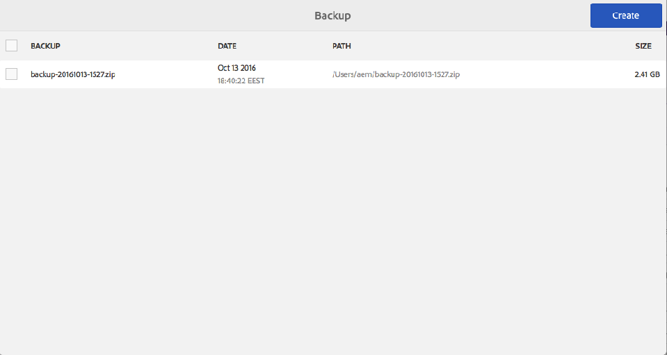

# Backup e ripristino{#backup-and-restore}

Esistono due modi per eseguire il backup e il ripristino del contenuto dell&#39;archivio in AEM:

* È possibile creare un backup esterno dell&#39;archivio e archiviarlo in un percorso sicuro. Se l’archivio si suddivide, puoi ripristinarlo allo stato precedente.
* Puoi creare versioni interne del contenuto dell’archivio. Queste versioni vengono memorizzate nell’archivio insieme al contenuto, in modo da poter ripristinare rapidamente i nodi e gli alberi modificati o eliminati.

## Generale {#general}

L&#39;approccio qui descritto si applica al backup e al ripristino del sistema.

Se è necessario eseguire il backup e/o il ripristino di una piccola quantità di contenuto, che viene persa, il ripristino del sistema non è necessariamente necessario:

* Puoi recuperare i dati da un altro sistema tramite un pacchetto
* in alternativa, è possibile ripristinare il backup su un sistema temporaneo, creare un pacchetto di contenuti e distribuirlo sul sistema, dove tale contenuto risulta mancante.

Per ulteriori informazioni, consulta [Backup dei pacchetti](/help/sites-administering/backup-and-restore.md#package-backup) di seguito.

## Tempistica {#timing}

Non eseguire il backup in parallelo con la raccolta di oggetti inattivi dell’archivio dati, in quanto potrebbe danneggiare i risultati di entrambi i processi.

## Backup offline {#offline-backup}

È sempre possibile eseguire un backup offline. Questo richiede tempi di inattività per l&#39;AEM, ma può essere abbastanza efficiente in termini di tempo richiesto rispetto a un backup online.

Nella maggior parte dei casi si utilizza uno snapshot del file system per creare una copia di sola lettura dello storage in quel momento. Per creare un backup non in linea, effettuare le seguenti operazioni:

* arresta l’applicazione
* creare un backup di snapshot
* avviare l’applicazione

Poiché il backup delle copie istantanee richiede in genere solo pochi secondi, l&#39;intero tempo di inattività è inferiore a pochi minuti.

## Backup online {#online-backup}

Questo metodo di backup crea un backup dell’intero archivio, incluse tutte le applicazioni distribuite al suo interno, ad esempio AEM. Il backup include contenuto, cronologia delle versioni, configurazione, software, aggiornamenti rapidi, applicazioni personalizzate, file di registro, indici di ricerca e così via. Se si utilizza il clustering e la cartella condivisa è una sottodirectory di `crx-quickstart` (fisicamente o utilizzando un softlink), viene eseguito anche il backup della directory condivisa.

È possibile ripristinare l&#39;intero repository (e qualsiasi applicazione) in un secondo momento.

Questo metodo funziona come backup &quot;a caldo&quot; o &quot;online&quot; e può essere eseguito mentre l’archivio è in esecuzione. Pertanto, l’archivio è utilizzabile durante l’esecuzione del backup. Questo metodo funziona per le istanze predefinite dell’archivio basate su archiviazione Tar.

Durante la creazione di un backup, sono disponibili le seguenti opzioni:

* Backup in una directory mediante lo strumento di backup integrato AEM.
* Backup in una directory mediante uno snapshot del file system

In ogni caso, il backup crea un’immagine (o un’istantanea) dell’archivio. L&#39;agente di backup del sistema deve quindi fare attenzione a trasferire effettivamente questa immagine a un sistema di backup dedicato (unità nastro).

>[!NOTE]
>
>Se la funzione di backup online dell’AEM viene utilizzata in un’istanza AEM con una configurazione personalizzata dell’archivio dati, si consiglia di configurare il percorso dell’archivio dati in modo che sia esterno al &quot; `crx-quickstart`&quot; ed eseguire separatamente il backup dell’archivio dati.

>[!CAUTION]
>
>Il backup online esegue solo il backup del file system. Se si archivia il contenuto del repository e/o i file del repository in un database, è necessario eseguire separatamente il backup del database. Se sta usando l’AEM con MongoDB, consulti la documentazione sull’utilizzo di [Strumenti di backup nativi MongoDB](https://docs.mongodb.org/manual/tutorial/backup-with-mongodump/).

### Backup online AEM {#aem-online-backup}

Un backup online del repository consente di creare, scaricare ed eliminare i file di backup. Si tratta di una funzione di backup &quot;a caldo&quot; o &quot;online&quot;, che può essere eseguita mentre l’archivio viene utilizzato normalmente in modalità di lettura-scrittura.

>[!CAUTION]
>
>Non eseguire il backup online dell&#39;AEM contemporaneamente a [Raccolta oggetti inattivi archivio dati](/help/sites-administering/data-store-garbage-collection.md) o [Pulizia revisioni](/help/sites-deploying/revision-cleanup.md#how-to-run-offline-revision-cleanup). Influenzerà negativamente le prestazioni del sistema.

All&#39;avvio di un backup è possibile specificare **Percorso di destinazione** e/o un **Ritardo**.

**Percorso di destinazione** I file di backup vengono in genere salvati nella cartella principale della cartella contenente il file jar quickstart (.jar). Ad esempio, se il file jar dell’AEM si trova in /InstallationKits/AEM, il backup verrà generato in /InstallationKits. Puoi anche specificare un target per una posizione a tua scelta.

Se il **TargetPath** è una directory, l’immagine dell’archivio viene creata in questa directory. Se la stessa directory viene utilizzata più volte (o sempre) per memorizzare il backup,

* i file modificati nell’archivio vengono modificati di conseguenza in TargetPath
* i file eliminati nel repository vengono eliminati in TargetPath
* i file creati nell’archivio vengono creati in TargetPath

>[!NOTE]
>
>Se **TargetPath** è impostato su nomefile con estensione **.zip**, viene eseguito il backup dell&#39;archivio in una directory temporanea e quindi il contenuto di questa directory temporanea viene compresso e memorizzato nel file ZIP.
>
>Questo approccio è sconsigliato, perché
>
>* richiede ulteriore spazio su disco durante il processo di backup (directory temporanea più file zip)
>* il processo di compressione viene eseguito dall’archivio e potrebbe influenzarne le prestazioni.
>* Ritarda il processo di backup.
>* Fino a Java 1.6 Java è in grado di creare solo file ZIP fino a una dimensione di 4 gigabyte.
>
>Se devi creare un file ZIP come formato di backup, devi eseguire il backup in una directory e quindi utilizzare un programma di compressione per creare il file zip.

**Ritardo** Indica un ritardo (in millisecondi) che non influisce sulle prestazioni dell’archivio. Per impostazione predefinita, il backup dell’archivio viene eseguito a piena velocità. È possibile rallentare la creazione di un backup online in modo da non rallentare altre attività.

Quando si utilizza un ritardo elevato, assicurarsi che il backup online non richieda più di 24 ore. In caso contrario, eliminare questo backup, poiché potrebbe non contenere tutti i file binari.
Un ritardo di 1 millisecondo comporta in genere un utilizzo della CPU del 10% e un ritardo di 10 millisecondi in genere comporta un utilizzo della CPU inferiore al 3%. Il ritardo totale in secondi può essere stimato come segue: dimensione dell’archivio in MB, moltiplicata per il ritardo in millisecondi, divisa per 2 (se si utilizza l’opzione zip), o divisa per 4 (quando si esegue il backup in una directory). Ciò significa che un backup in una directory di un archivio da 200 MB con un ritardo di 1 ms aumenta il tempo di backup di circa 50 secondi.

>[!NOTE]
>
>Consulta [Funzionamento del backup online dell&#39;AEM](#how-aem-online-backup-works) per i dettagli interni del processo.

Per creare un backup:

1. Accedi all’AEM come amministratore.

1. Vai a **Strumenti - Operazioni - Backup.**
1. Fai clic su **Crea**. Viene aperta la console di backup.

   

1. Nella console di backup, specifica **[Percorso di destinazione](#aem-online-backup)** e **[Ritardo](#aem-online-backup)**.

   

   >[!NOTE]
   >
   >La console di backup è disponibile anche utilizzando:
   >
   >
   >` https://<*hostname*>:<*port-number*>/libs/granite/backup/content/admin.html`

1. Clic **Salva**, una barra di avanzamento indica l&#39;avanzamento del backup.

   >[!NOTE]
   >
   >È possibile **Annulla** un backup in esecuzione in qualsiasi momento.

1. Al termine del backup, i file zip vengono elencati nella finestra di backup.

   

   >[!NOTE]
   >
   >I file di backup non più necessari possono essere rimossi utilizzando la console. Selezionare il file di backup nel riquadro di sinistra, quindi fare clic su **Elimina**.

   >[!NOTE]
   >
   >Se è stato eseguito il backup in una directory: al termine del processo di backup, AEM non scriverà nella directory di destinazione.

### Automazione del backup online dell&#39;AEM {#automating-aem-online-backup}

Se possibile, il backup online deve essere eseguito quando il carico sul sistema è ridotto, ad esempio al mattino.

I backup possono essere automatizzati utilizzando `wget` o `curl` Client HTTP. Di seguito sono riportati alcuni esempi di come automatizzare il backup utilizzando CURL.

#### Backup nella directory di destinazione predefinita {#backing-up-to-the-default-target-directory}

>[!CAUTION]
>
>Nell’esempio seguente vengono illustrati vari parametri di `curl` potrebbe essere necessario configurare il comando per la tua istanza; ad esempio, il nome host ( `localhost`), porta ( `4502`), password amministratore ( `xyz`) e nome file ( `backup.zip`).

```shell
curl -u admin:admin -X POST http://localhost:4502/system/console/jmx/com.adobe.granite:type=Repository/op/startBackup/java.lang.String?target=backup.zip
```

Il file/directory di backup viene creato sul server nella cartella padre della cartella contenente `crx-quickstart` come se si stesse creando il backup utilizzando il browser. Ad esempio, se hai installato AEM nella directory `/InstallationKits/crx-quickstart/`, quindi il backup viene creato in `/InstallationKits` directory.

Il comando curl viene restituito immediatamente, pertanto è necessario monitorare questa directory per vedere quando il file zip è pronto. Durante la creazione del backup è possibile visualizzare una directory temporanea (con il nome basato su quello del file zip finale), alla fine verrà compresso. Ad esempio:

* nome del file zip risultante: `backup.zip`
* nome della directory temporanea: `backup.f4d5.temp`

#### Backup in una directory di destinazione non predefinita {#backing-up-to-a-non-default-target-directory}

Di solito il file/la directory di backup viene creato sul server nella cartella principale della cartella contenente `crx-quickstart` cartella.

Se si desidera salvare il backup (di entrambi i tipi) in una posizione diversa, è possibile impostare un percorso assoluto &quot;per `target` parametro in `curl` comando.

Ad esempio, per generare `backupJune.zip` nella directory `/Backups/2012`:

```shell
curl -u admin:admin -X POST http://localhost:4502/system/console/jmx/com.adobe.granite:type=Repository/op/startBackup/java.lang.String?target=/Backups/2012/backupJune.zip"
```

>[!CAUTION]
>
>Quando si utilizza un server applicazioni diverso (ad esempio JBoss), il backup online potrebbe non funzionare come previsto, perché la directory di destinazione non è scrivibile. In questo caso, contatta il supporto tecnico.

>[!NOTE]
>
>È inoltre possibile attivare un backup [utilizzando gli MBean forniti dall’AEM](/help/sites-administering/jmx-console.md).

### Backup snapshot del file system {#filesystem-snapshot-backup}

Il processo qui descritto è particolarmente adatto per archivi di grandi dimensioni.

>[!NOTE]
>
>Se si desidera utilizzare questo approccio di backup, il sistema deve supportare le istantanee del file system. Ad esempio, per Linux questo significa che i file system devono essere posizionati su un volume logico.

1. Crea un’istantanea del file system su cui è implementato AEM.

1. Montare lo snapshot del file system.
1. Eseguire un backup e smontare la copia istantanea.

### Funzionamento del backup online dell&#39;AEM {#how-aem-online-backup-works}

Il servizio Backup online AEM è costituito da una serie di azioni interne volte a garantire l&#39;integrità dei dati di cui viene eseguito il backup e dei file di backup creati. Di seguito sono elencati i nomi delle persone interessate.

Il backup online utilizza il seguente algoritmo:

1. Quando si crea un file zip, il primo passaggio consiste nel creare o individuare la directory di destinazione.

   * Se si esegue il backup in un file zip, viene creata una directory temporanea. Il nome della directory inizia con `backup.` e termina con `.temp`ad esempio, `backup.f4d3.temp`.
   * Se si esegue il backup in una directory, viene utilizzato il nome specificato nel percorso di destinazione. È possibile utilizzare una directory esistente, altrimenti verrà creata una nuova directory.

     Un file vuoto denominato `backupInProgress.txt` viene creato nella directory di destinazione all&#39;avvio del backup. Questo file viene eliminato al termine del backup.

1. I file vengono copiati dalla directory di origine alla directory di destinazione (o alla directory temporanea durante la creazione di un file zip). L’archivio segmenti viene copiato prima dell’archivio dati per evitare il danneggiamento dell’archivio. I dati di indice e cache vengono omessi durante la creazione del backup. Di conseguenza, i dati provenienti da `crx-quickstart/repository/cache` e `crx-quickstart/repository/index` non è incluso nel backup. L’indicatore della barra di avanzamento del processo è compreso tra 0% e 70% quando si crea un file zip, oppure tra 0% e 100% se non viene creato alcun file zip.

1. Se il backup viene eseguito in una directory preesistente, i file &quot;vecchi&quot; nella directory di destinazione vengono eliminati. I file obsoleti sono file che non esistono nella directory di origine.

I file vengono copiati nella directory di destinazione in quattro fasi:

1. Nella prima fase di copia (indicatore di avanzamento 0% - 63% durante la creazione di un file zip o 0% - 90% se non viene creato alcun file zip), tutti i file vengono copiati mentre l’archivio è in esecuzione normalmente. Il processo si articola in due fasi:

   * Fase A: viene copiato tutto tranne l’archivio dati (con ritardo).
   * Fase B: viene copiato solo l’archivio dati (con ritardo).

1. Nella seconda fase di copia (indicatore di avanzamento 63% - 65,8% durante la creazione di un file zip o 90% - 94% se non viene creato alcun file zip) vengono copiati solo i file creati o modificati nella directory di origine dall&#39;avvio della prima fase di copia. A seconda dell’attività dell’archivio, questo può variare da nessun file, fino a un numero significativo di file (perché la prima fase di copia dei file in genere richiede più tempo). Il processo di copia è simile alla prima fase (fase A e fase B con ritardo).
1. Nella terza fase di copia (indicatore di avanzamento 65,8% - 68,6% quando si crea un file zip o 94% - 98% se non viene creato alcun file zip) vengono copiati solo i file creati o modificati nella directory di origine dall&#39;avvio della seconda fase di copia. A seconda dell’attività dell’archivio, potrebbero non esserci file da copiare o un numero molto ridotto di file (perché la seconda fase di copia dei file è in genere veloce). Il processo di copia è simile alla seconda fase - Fase A e Fase B ma senza ritardi.
1. Le fasi da uno a tre della copia dei file vengono tutte eseguite contemporaneamente durante l&#39;esecuzione dell&#39;archivio. Vengono copiati solo i file creati o modificati nella directory di origine dall&#39;avvio della terza fase di copia. A seconda dell’attività dell’archivio, potrebbero non esserci file da copiare o un numero molto, molto ridotto di file (perché la seconda fase di copia dei file è in genere molto veloce). Indicatore di avanzamento 68,6% - 70% quando si crea un file zip o 98% - 100% se non viene creato alcun file zip. Il processo di copia è simile alla terza fase.
1. A seconda della destinazione:

   * Se è stato specificato un file zip, questo viene creato dalla directory temporanea. Indicatore di progresso 70% - 100%. La directory temporanea viene quindi eliminata.
   * Se la destinazione era una directory, il file vuoto denominato `backupInProgress.txt` viene eliminato per indicare che il backup è terminato.

## Ripristino del backup {#restoring-the-backup}

È possibile ripristinare un backup nel modo seguente:

* Se si esegue un backup snapshot del file system, è sufficiente ripristinare un&#39;immagine del sistema.
* Se hai creato il backup come file zip, decomprimi il contenuto in una nuova cartella e avvia AEM da quella posizione.

## Backup dei pacchetti {#package-backup}

Per eseguire il backup e il ripristino del contenuto, è possibile utilizzare uno dei Gestori pacchetti, che utilizza il formato Pacchetto di contenuti per eseguire il backup e il ripristino del contenuto. Gestione pacchetti offre maggiore flessibilità nella definizione e nella gestione dei pacchetti.

Per maggiori informazioni sulle caratteristiche e sulle scelte rapide di ciascuno di questi formati, consultare [Come utilizzare i pacchetti](/help/sites-administering/package-manager.md).

### Ambito del backup {#scope-of-backup}

Quando esegui il backup dei nodi utilizzando Gestione pacchetti o Content Zipper, CRX salva le seguenti informazioni:

* Il contenuto dell’archivio sotto la struttura selezionata.
* Definizioni dei tipi di nodo utilizzate per il contenuto di cui si esegue il backup.
* Definizioni dello spazio dei nomi utilizzate per il contenuto di cui si esegue il backup.

Durante il backup, l&#39;AEM perde le seguenti informazioni:

* La cronologia delle versioni.
