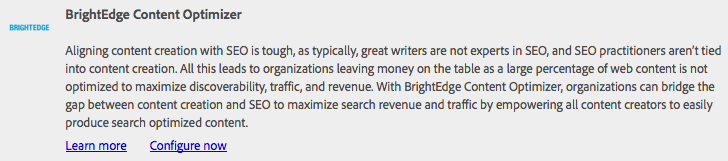

# Integrazione con BrightEdge Content Optimizer{#integrating-with-brightedge-content-optimizer}

Crea una configurazione cloud BrightEdge in modo che AEM connettersi utilizzando le credenziali del tuo account BrightEdge. Puoi creare più configurazioni se utilizzi più account.

Quando crei la configurazione, specifica un titolo. Il titolo deve essere descrittivo in modo che le persone possano correlare la configurazione con l’account BrightEdge. Quando un autore o un amministratore di una pagina web associa una pagina web all’account BrightEdge, questo titolo viene presentato in un elenco a discesa.

1. Nella barra, fai clic su Strumenti > Operazioni > Cloud > Cloud Services.
1. Fai clic sul collegamento visualizzato nella sezione BrightEdge Content Optimizer . Se è stata creata una configurazione BrightEdge determina il testo del collegamento:

   * Configura ora: Questo collegamento viene visualizzato quando non è stata creata alcuna configurazione.
   * Mostra configurazioni: Questo collegamento viene visualizzato quando sono state create una o più configurazioni.

   

1. Se hai fatto clic su Mostra configurazioni, fai clic sul collegamento + accanto a Configurazioni disponibili.
1. Digita un titolo per la configurazione. Facoltativamente, digita un nome per il nodo utilizzato per memorizzare la configurazione nella directory archivio. Fai clic su Crea.
1. Nella finestra di dialogo Configurazione di BrightEdge Content Optimizer digitare il nome utente e la password dell&#39;account BrightEdge, quindi fare clic su OK.

## Modifica di una configurazione BrightEdge {#editing-a-brightedge-configuration}

Se necessario, modifica il nome utente e la password di una configurazione BrightEdge. Le modifiche interessano tutte le pagine che utilizzano la configurazione.

1. Nella barra, fai clic su Strumenti > Operazioni > Cloud > Cloud Services.
1. Nella sezione BrightEdge Content Optimizer , fai clic su Mostra configurazioni.

   

1. Fai clic sul nome della configurazione da modificare.
1. Fare clic su Modifica, modificare i valori delle proprietà, quindi fare clic su OK.

## Associazione di pagine a una configurazione BrightEdge {#associating-pages-with-a-brightedge-configuration}

Associa pagine a una configurazione BrightEdge per inviare dati di pagina al servizio BrightEdge per l’analisi. Quando si associa una pagina a una configurazione, le pagine figlie ereditano l’associazione. In genere, si associa la home page del sito in modo che i dati di tutte le pagine vengano inviati a BrightEdge.

1. Apri la console Siti web classici . ([http://localhost:4502/siteadmin#/content](http://localhost:4502/siteadmin#/content))
1. Nella struttura Siti Web selezionare la cartella o la pagina contenente la pagina che si desidera associare alla configurazione BrightEdge.
1. Nell’elenco delle pagine fare clic con il pulsante destro del mouse sulla pagina da configurare e scegliere Proprietà.
1. Nella scheda Cloud Services fare clic sul pulsante Aggiungi servizio e nella finestra di dialogo Cloud Services selezionare BrightEdge Content Optimizer, quindi fare clic su OK.
1. Nell’elenco BrightEdge Content Optimizer , seleziona la configurazione BrightEdge da associare alla pagina, quindi fai clic su OK.

   

## Attivazione di una configurazione BrightEdge {#activating-a-brightedge-configuration}

Attiva una configurazione BrightEdge per replicarla nell’istanza di pubblicazione e per consentire alle pagine pubblicate di interagire con il servizio BrightEdge.

1. Nella barra, fai clic su Sites, quindi individua e seleziona la pagina associata alla configurazione BrightEdge.
1. Tocca o fai clic sull’icona Pubblica , quindi tocca o fai clic su Pubblica .

   

1. Nell’elenco delle configurazioni visualizzate, accertati che la configurazione BrightEdge sia selezionata e fai clic su Pubblica.

   
