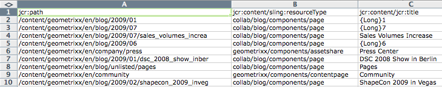

# Editor in blocco{#the-bulk-editor}

L’editor in blocco consente di modificare in modo efficiente quando il contesto della pagina visiva non è necessario, in quanto consente di:

* ricerca (e visualizzazione) di contenuti da più pagine, utilizzando GQL (Google Query Language)
* modificare questo contenuto direttamente nell’editor in blocco
* salva le modifiche (nelle pagine di origine)
* esporta questo contenuto in un file di foglio di calcolo separato da tabulazioni (.tsv)

>[!NOTE]
>
>Puoi anche importare il contenuto nell’archivio, ma per impostazione predefinita questa opzione è disabilitata per l’editor in blocco come disponibile nella **Strumenti** console.

Questa sezione descrive come lavorare con l’Editor collettivo in **Strumenti** console. In genere, gli amministratori utilizzano l’Editor collettivo per cercare e modificare più elementi. A tale scopo, compila la tabella utilizzando una query GQL e quindi seleziona gli elementi di contenuto su cui lavorare. Gli autori generalmente utilizzano l’Editor collettivo come parte di un’applicazione personalizzata per l’editor collettivo accessibile tramite [elenco prodotti](/help/sites-authoring/default-components.md#productlist) componente.

>[!CAUTION]
>
>Con il [l’interfaccia classica è diventata obsoleta](/help/release-notes/deprecated-removed-features.md) in AEM 6.4, anche l’Editor in blocco è stato dichiarato obsoleto, pertanto Adobe non prevede di migliorare ulteriormente l’Editor in blocco.

## Caso di utilizzo di esempio per l’editor in blocco {#example-use-case-for-the-bulk-editor}

Ad esempio, se hai bisogno di tutti i nomi e gli indirizzi e-mail degli utenti che hanno compilato un sondaggio particolare, l’Editor collettivo può fornire tali informazioni e puoi esportarle in un foglio di calcolo.

Un esempio per illustrare un caso d’uso di questo tipo è incluso nel Geometrixx web:

1. Accedi a **Supporto** e quindi al **Soddisfazione del servizio clienti** sondaggio.
1. **Modifica** il **Inizio modulo** paragrafo. Nella finestra di dialogo, fai clic su **Avanzate** , espandere la scheda **Configurazione azione**, quindi fai clic su **Visualizza dati...**.

   

1. L’editor collettivo è completamente personalizzabile, anche se in questo esempio l’editor collettivo non consente agli utenti di modificare il contenuto, ma solo di esportare le informazioni in un foglio di calcolo.

   

## Come utilizzare l’editor in blocco {#how-to-use-the-bulk-editor}

L’editor in blocco consente di:

* [cercare il contenuto in base ai parametri di query, visualizzare le proprietà specificate dei risultati in colonne, modificare il contenuto e salvare le modifiche](#searching-and-editing-content)
* [per esportare il contenuto in un foglio di calcolo separato da tabulazioni](#exporting-content)

* [per importare contenuto da un foglio di calcolo separato da tabulazioni](#importing-content)

### Ricerca e modifica dei contenuti {#searching-and-editing-content}

Per utilizzare l&#39;Editor collettivo per modificare più elementi contemporaneamente:

1. In **Strumenti** , fai clic su **Importatori** per espanderla.
1. Fai doppio clic su **Editor in blocco**.
1. Inserire i requisiti di selezione:

<table>
 <tbody>
  <tr>
   <td>Campo</td>
   <td>Proprietà</td>
  </tr>
  <tr>
   <td>Percorso directory principale</td>
   <td>Indica il percorso della directory principale cercato dall'editor di massa.  Ad esempio: <code>/content/geometrixx/en</code>. L’editor collettivo esegue la ricerca su tutti i nodi secondari.</td>
  </tr>
  <tr>
   <td>Parametri di query</td>
   <td>Utilizzando i parametri GQL, immetti la stringa di ricerca che desideri che l’Editor collettivo cerchi nel repository. Ad esempio: <code>type:Page</code> cerca tutte le pagine nel percorso principale, <code>text:professional</code> cerca tutte le pagine contenenti la parola "professionale" e <code>"jcr:title":English</code> cerca tutte le pagine il cui titolo è "English". È possibile cercare solo stringhe.</td>
  </tr>
  <tr>
   <td>Casella di controllo Modalità contenuto</td>
   <td>Selezionare questa casella di controllo per leggere le proprietà all'interno di <code>jcr:content</code> sottonodo dei risultati della ricerca, se esistente. Da utilizzare solo per le pagine. I nomi delle proprietà hanno il prefisso <code>"jcr:content/"</code></td>
  </tr>
  <tr>
   <td>Proprietà/Colonne</td>
   <td>Selezionare le caselle di controllo relative alle proprietà che si desidera vengano restituite dall'Editor collettivo. Le proprietà selezionate sono le intestazioni di colonna nel riquadro dei risultati. Per impostazione predefinita, il percorso del nodo viene visualizzato nei risultati.</td>
  </tr>
  <tr>
   <td>Proprietà/Colonne personalizzate</td>
   <td>Inserisci altre proprietà non elencate in <strong>Proprietà/Colonne</strong> campo. Queste proprietà personalizzate vengono visualizzate nel riquadro dei risultati. Puoi aggiungere più proprietà utilizzando una virgola per separare le proprietà. <i>Nota:</i> Se aggiungi una proprietà personalizzata che non esiste ancora, WCM per AEM visualizza una cella vuota. Quando modifichi la cella vuota e la salvi, la proprietà viene aggiunta al nodo. La proprietà appena creata deve rispettare i vincoli del tipo di nodo e gli spazi dei nomi delle proprietà.</td>
  </tr>
 </tbody>
</table>

Ad esempio:

1. Clic **Ricerca**. L’Editor collettivo visualizza i risultati.
Nell’esempio precedente, tutte le pagine che soddisfano i criteri di ricerca vengono restituite e visualizzate con le colonne richieste.

   

1. Fare doppio clic su una cella per apportare eventuali modifiche.

   

1. Clic **Salva** per salvare le modifiche (il **Salva** dopo aver modificato una cella).

   >[!CAUTION]
   >
   >Le modifiche apportate qui vengono scritte nel contenuto dell’archivio; ad esempio, la pagina a cui si fa riferimento in **Percorso**.

#### Parametri di query GQL aggiuntivi {#additional-gql-query-parameters}

* **percorso:** cerca solo nodi sotto questo percorso. Se specificate più di un termine con un prefisso di percorso, viene considerato solo l&#39;ultimo.
* **tipo:** restituisce solo nodi del tipo di nodo specificato. Sono inclusi i tipi principali e mixin. È possibile specificare più tipi di nodo separati da virgole. GQL restituisce nodi di uno qualsiasi dei tipi specificati.
* **ordine:** ordina il risultato in base alle proprietà specificate. È possibile specificare più nomi di proprietà separati da virgole. Per ordinare il risultato in ordine decrescente, aggiungi al nome della proprietà il prefisso meno. Ad esempio, order:-name. L&#39;utilizzo di un segno più restituisce il risultato in ordine crescente, che è anche l&#39;impostazione predefinita.
* **limite:** limita il numero di risultati utilizzando un intervallo. Ad esempio, limit:10..20 L&#39;intervallo è basato su zero, l&#39;inizio è inclusivo e la fine è esclusiva. È inoltre possibile specificare un valore `interval:limit:10..` o `limit:..20`
Se i punti vengono omessi e viene specificato un solo valore, GQL restituisce al massimo questo numero di risultati. Ad esempio: `limit:10` restituisce i primi dieci risultati.

### Esportazione del contenuto {#exporting-content}

Se necessario, esporta il contenuto in un foglio di calcolo Excel per apportare eventuali modifiche. È ad esempio possibile esportare una lista di distribuzione e modificare l&#39;indicativo di località di tutti i numeri di telefono elencati direttamente in Excel oppure aggiungere altre righe.

Per esportare il contenuto:

1. Cercare il contenuto come descritto in [Ricerca e modifica dei contenuti](#searching-and-editing-content).
1. Clic **Esporta** in modo da poter esportare le modifiche in un foglio di calcolo Excel separato da tabulazioni. WCM AEM ti chiede dove desideri scaricare il file.

   >[!NOTE]
   >
   >Per impostazione predefinita, le modifiche sono codificate in [Windows-1252](https://en.wikipedia.org/wiki/Windows-1252) (noto anche come CP-1252). È possibile selezionare UTF-8 per esportare le modifiche in UTF-8.

   

1. Seleziona il percorso e conferma di voler scaricare il file.
1. Dopo aver scaricato il file, puoi aprirlo dal programma del foglio di calcolo, ad esempio Microsoft® Excel. Il programma per fogli di calcolo importa il file e lo converte in un formato foglio di calcolo.

   

### Importazione del contenuto {#importing-content}

Per impostazione predefinita, la funzionalità di importazione è nascosta all&#39;apertura dell&#39;Editor collettivo. Aggiunta del parametro `hib=false` all’URL mostra il **Importa** nella pagina Bulk Editor. È possibile importare contenuto da qualsiasi scheda ( `.tsv`). Affinché l&#39;importazione funzioni correttamente, le intestazioni di colonna (prima riga di celle) devono corrispondere alle intestazioni di colonna della tabella in cui si esegue l&#39;importazione.

>[!NOTE]
>
>Quando reimporti il contenuto, cancelli eventuali contenuti precedenti per tali nodi. Fai attenzione a non sovrascrivere informazioni importanti.

Per importare il contenuto:

1. Apri l’Editor collettivo.
1. Aggiungi `?hib=false` all’URL, ad esempio:
   `https://localhost:4502/etc/importers/bulkeditor.html?hib=false`
1. Clic **Importa**.
1. Seleziona la `.tsv` file. I dati vengono importati nell’archivio.
