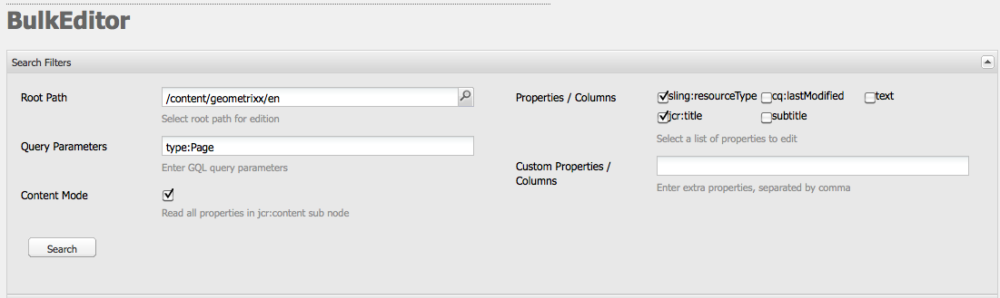

# L&#39;editor di massa{#the-bulk-editor}

L’editor di massa consente modifiche molto efficaci quando il contesto visivo della pagina non è necessario in quanto consente di:

* cercare (e visualizzare) contenuti da più pagine; questo viene fatto utilizzando GQL (Google Query Language)
* modifica di questo contenuto direttamente nell&#39;editor in blocco
* salvare le modifiche (nelle pagine originarie)
* esporta il contenuto in un file foglio di calcolo separato da tabulazioni (.tsv)

>[!NOTE]
>
>Potete anche importare contenuti nella directory archivio, ma per impostazione predefinita questo viene disattivato per l&#39;editor di massa come disponibile nella console **Strumenti**.

Questa sezione descrive come utilizzare l&#39;editor in blocco nella console **Strumenti**. In genere, gli amministratori utilizzano l’editor in blocco per cercare e modificare più elementi. A tal fine, la tabella viene compilata utilizzando una query GQL e quindi selezionando gli elementi di contenuto su cui lavorare. Gli autori in genere utilizzano l&#39;editor in blocco come parte di un&#39;applicazione di editing in blocco personalizzata accessibile tramite il componente [product list](/help/sites-authoring/default-components.md#productlist).

>[!CAUTION]
>
>Con la [deprecazione dell&#39;interfaccia classica](/help/release-notes/deprecated-removed-features.md) nella AEM 6.4, anche l&#39;Editor di massa è stato dichiarato obsoleto e pertanto  Adobe non intende migliorare ulteriormente l&#39;Editor di massa.

## Esempio di utilizzo per l&#39;editor di massa {#example-use-case-for-the-bulk-editor}

Ad esempio, se avete bisogno di tutti i nomi e gli indirizzi e-mail degli utenti che hanno compilato un sondaggio particolare, l’Editor di massa può fornire tali informazioni ed esportarle in un foglio di calcolo.

Un esempio per illustrare tale caso di utilizzo è incluso nel sito Web di Geometrixx:

1. Passare alla pagina **Assistenza** e quindi al sondaggio **Assistenza clienti**.
1. **Modificate** l’ **inizio del** paragrafo. Nella finestra di dialogo fare clic sulla scheda **Avanzate**, espandere la scheda **Configurazione azione**, quindi fare clic su **Visualizza dati...**.

   

1. L&#39;editor di massa è completamente personalizzabile. Anche se in questo esempio l&#39;editor di massa non consente agli utenti di modificare il contenuto, ma consente loro solo di esportare le informazioni in un foglio di calcolo.

   

## Come utilizzare l&#39;editor di massa {#how-to-use-the-bulk-editor}

L’editor di massa consente di:

* [ricerca di contenuto basato su parametri di query, visualizzazione di proprietà specifiche dei risultati in colonne, modifica di questo contenuto e salvataggio delle modifiche](#searching-and-editing-content)
* [per esportare il contenuto in un foglio di calcolo separato da tabulazioni](#exporting-content)

* [per importare contenuti da un foglio di calcolo separato da tabulazioni](#importing-content)

### Ricerca e modifica di contenuti {#searching-and-editing-content}

Per utilizzare l&#39;editor in blocco per modificare più elementi contemporaneamente:

1. Nella console **Strumenti**, fare clic sulla cartella **Importatori** per espanderla.
1. Fare doppio clic su **Bulk Editor** per aprirlo.
1. Immettete i requisiti di selezione:

<table>
 <tbody>
  <tr>
   <td>Campo</td>
   <td>Proprietà</td>
  </tr>
  <tr>
   <td>Percorso directory principale</td>
   <td>Indica il percorso principale ricercato dall'editor in blocco.  Esempio, <code>/content/geometrixx/en</code>. L’editor in blocco esegue la ricerca su tutti i nodi secondari.</td>
  </tr>
  <tr>
   <td>Parametri della ricerca</td>
   <td>Utilizzando i parametri GQL, inserire la stringa di ricerca che si desidera cercare nell’archivio dall’editor di massa; ad esempio, <code>type:Page</code> cerca tutte le pagine del percorso principale, <code>text:professional</code> cerca tutte le pagine che contengono la parola "professionale" e <code>"jcr:title":English</code> cerca tutte le pagine che hanno come titolo "Inglese". È possibile cercare solo le stringhe.</td>
  </tr>
  <tr>
   <td>Modalità contenuto, casella di controllo</td>
   <td>Selezionare questa casella di controllo per leggere le proprietà all'interno del nodo secondario <code>jcr:content</code> dei risultati di ricerca, se esiste. Utilizzate solo per le pagine. I nomi delle proprietà hanno il prefisso <code>"jcr:content/"</code></td>
  </tr>
  <tr>
   <td>Proprietà/Colonne</td>
   <td>Selezionate le caselle di controllo relative alle proprietà che desiderate vengano restituite dall’editor in blocco. Le proprietà selezionate sono le intestazioni di colonna nel riquadro dei risultati. Per impostazione predefinita, il percorso del nodo viene visualizzato nei risultati.</td>
  </tr>
  <tr>
   <td>Proprietà personalizzate/Colonne</td>
   <td>Immettere qualsiasi altra proprietà non elencata nel campo <strong>Proprietà/Colonne</strong>. Queste proprietà personalizzate vengono visualizzate nel riquadro dei risultati. È possibile aggiungere più proprietà utilizzando una virgola per separare le proprietà. <i>Nota:</i> se si aggiunge una proprietà personalizzata che non esiste ancora, AEM WCM visualizza una cella vuota. Quando modificate la cella vuota e la salvate, la proprietà viene aggiunta al nodo. La nuova proprietà creata deve rispettare i vincoli relativi al tipo di nodo e gli spazi dei nomi delle proprietà.</td>
  </tr>
 </tbody>
</table>

Esempio:

1. Fare clic su **Cerca**. Nell’editor di massa vengono visualizzati i risultati.
Per l’esempio precedente, tutte le pagine che soddisfano i criteri di ricerca vengono restituite e visualizzate con le colonne richieste.

   

1. Apportate le modifiche necessarie facendo doppio clic in una cella.

   

1. Fare clic su **Salva** per salvare le modifiche (il pulsante **Salva** verrà attivato dopo aver modificato una cella).

   >[!CAUTION]
   >
   >Le modifiche apportate qui sono scritte nel contenuto del repository; ad esempio, la pagina cui si fa riferimento in **Path**.

#### Parametri query GQL aggiuntivi {#additional-gql-query-parameters}

* **percorso:** solo nodi di ricerca al di sotto di questo percorso. Se si specifica più di un termine con il prefisso del percorso, verrà considerato solo l&#39;ultimo.
* **type:restituisce** solo i nodi dei tipi di nodo specificati. Ciò include sia i tipi primari che i tipi di mixin. È possibile specificare più tipi di nodi separati da virgola. GQL restituirà nodi di uno qualsiasi dei tipi specificati.
* **order:** ordinare il risultato per le proprietà specificate. È possibile specificare più nomi di proprietà separati da virgola. Per ordinare il risultato in ordine decrescente, premete semplicemente il nome della proprietà con un segno meno. Ad esempio: order:-name. L&#39;utilizzo di un segno più restituirà il risultato in ordine crescente, che è anche l&#39;impostazione predefinita.
* **limit:** limita il numero di risultati utilizzando un intervallo. Ad esempio: limit:10..20 Si prega di notare che l&#39;intervallo è basato su zero, start è incluso e end è esclusivo. È inoltre possibile specificare un intervallo aperto:limit:10. o limite:..20 Se i puntini vengono omessi e viene specificato un solo valore, GQL restituirà al massimo questo numero di risultati. Ad esempio, limit:10 (restituirà i primi 10 risultati)

### Esportazione di contenuto {#exporting-content}

Potrebbe essere necessario esportare il contenuto e apportare modifiche in un foglio di calcolo Excel. Ad esempio, è possibile esportare una mailing list e modificare il prefisso di tutti i numeri di telefono elencati direttamente in Excel, aggiungere altre righe e così via.

Per esportare il contenuto:

1. Cercare il contenuto come descritto in [Ricerca e modifica di contenuto](#searching-and-editing-content).
1. Fate clic su **Esporta** per esportare le modifiche in un foglio di calcolo Excel separato da tabulazioni. AEM WCM chiede dove si desidera scaricare il file.

   >[!NOTE]
   >
   >Per impostazione predefinita, le modifiche sono codificate in [Windows-1252](https://en.wikipedia.org/wiki/Windows-1252) (noto anche come CP-1252). Potete selezionare UTF-8 per esportare le modifiche in UTF-8.

   

1. Selezionate il percorso e confermate che desiderate scaricare il file.
1. Dopo aver scaricato il file, è possibile aprirlo dal programma del foglio di calcolo, ad esempio Microsoft Excel. Il programma per fogli di calcolo importa il file e lo converte in formato foglio di calcolo.

   

### Importazione di contenuto {#importing-content}

Per impostazione predefinita, la funzionalità di importazione è nascosta all’apertura dell’editor di massa. Se si aggiunge semplicemente il parametro `hib=false` all&#39;URL, il pulsante **Importa** verrà visualizzato nella pagina Modifiche collettive. Potete importare il contenuto da qualsiasi file separato da tabulazioni ( `.tsv`). Per il corretto funzionamento dell’importazione, le intestazioni di colonna (prima riga di celle) devono corrispondere alle intestazioni di colonna della tabella in cui si sta importando.

>[!NOTE]
>
>Quando reimportate del contenuto, eliminate qualsiasi contenuto precedente per tali nodi. Fate attenzione a non sovrascrivere informazioni importanti.

Per importare contenuto:

1. Aprite l’Editor di massa.
1. Aggiungi `?hib=false` all&#39;URL, ad esempio:
   `https://localhost:4502/etc/importers/bulkeditor.html?hib=false`
1. Fai clic su **Importa**.
1. Selezionare il file `.tsv`. I dati vengono importati nella directory archivio.