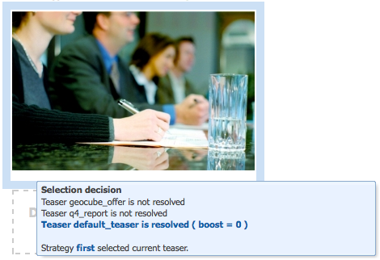

# Configurazione della segmentazione {#configuring-segmentation}

>[!NOTE]
>
>Questo documento descrive la configurazione della segmentazione utilizzata con ClientContext. Per configurare i segmenti con ContextHub utilizzando l’interfaccia utente touch, consulta [Configurazione della segmentazione con ContextHub](/help/sites-administering/segmentation.md).

La segmentazione è un concetto chiave per la creazione di una campagna. Consulta [Glossario della segmentazione](/help/sites-authoring/segmentation-overview.md) per informazioni sul funzionamento della segmentazione e sui termini chiave.

A seconda delle informazioni che hai già raccolto sui visitatori del tuo sito e degli obiettivi che desideri raggiungere, dovrai definire i segmenti e le strategie necessarie per i contenuti di destinazione.

Questi segmenti verranno poi utilizzati per fornire al visitatore i contenuti di destinazione più pertinenti. Questo contenuto viene mantenuto in [Campagne](/help/sites-classic-ui-authoring/classic-personalization-campaigns.md) sezione del sito web. Le pagine teaser definite qui possono essere incluse come paragrafi teaser in qualsiasi pagina e definiscono a quale segmento di visitatore è applicabile il contenuto specializzato.

AEM consente di creare e aggiornare facilmente segmenti, teaser e campagne. Consente inoltre di verificare i risultati delle definizioni.

Il **Editor segmento** consente di definire facilmente un segmento:

È possibile **Modifica** ogni segmento per specificare un **Titolo**, **Descrizione** e **Incrementa** fattore. Utilizzando la barra laterale puoi aggiungere **E** e **OPPURE** contenitori per definire **Logica del segmento**, quindi aggiungi il necessario **Caratteristiche segmento** per definire i criteri di selezione.

## Fattore di incremento {#boost-factor}

Ogni segmento ha una **Incrementa** parametro utilizzato come fattore di ponderazione; un numero più alto indica che il segmento verrà selezionato al posto di un segmento con un numero più basso.

* Valore minimo: `0`
* Valore massimo: `1000000`

## Logica del segmento {#segment-logic}

I seguenti contenitori logici sono disponibili come predefiniti e ti consentono di creare la logica della selezione dei segmenti. Possono essere trascinati dalla barra laterale all’editor:

<table>
 <tbody>
  <tr>
   <td> Contenitore E  </td>
   <td> Operatore AND boolean.  </td>
  </tr>
  <tr>
   <td> Contenitore O  </td>
   <td> Operatore OR boolean.</td>
  </tr>
 </tbody>
</table>

## Caratteristiche segmento {#segment-traits}

Le seguenti caratteristiche del segmento sono disponibili come predefinite e possono essere trascinate dalla barra laterale all’editor:

<table>
 <tbody>
  <tr>
   <td> Intervallo IP  </td>
   <td>Definisce un intervallo di indirizzi IP che il visitatore può avere.  </td>
  </tr>
  <tr>
   <td> Hit pagina  </td>
   <td>Con quale frequenza è stata richiesta la pagina.   </td>
  </tr>
  <tr>
   <td> Proprietà pagina  </td>
   <td>Qualsiasi proprietà della pagina visitata.  </td>
  </tr>
  <tr>
   <td> Parole chiave di riferimento  </td>
   <td>Parole chiave da associare alle informazioni del sito Web di provenienza.   </td>
  </tr>
  <tr>
   <td> Script</td>
   <td>Espressione JavaScript da valutare.  </td>
  </tr>
  <tr>
   <td> Riferimento segmento   </td>
   <td>Riferimento a un’altra definizione di segmento.  </td>
  </tr>
  <tr>
   <td> Tag cloud  </td>
   <td>Tag da abbinare a quelli delle pagine visitate.  </td>
  </tr>
  <tr>
   <td> Età utente  </td>
   <td>Come tratto dal profilo utente.  </td>
  </tr>
  <tr>
   <td> Proprietà utente  </td>
   <td>Qualsiasi altra informazione disponibile nel profilo utente. </td>
  </tr>
 </tbody>
</table>

Puoi combinare queste caratteristiche utilizzando gli operatori booleani OR e AND (vedi [Creazione di un nuovo segmento](#creating-a-new-segment)) per definire lo scenario esatto per la selezione di questo segmento.

Quando l’intera istruzione restituisce true, questo segmento è stato risolto. Nel caso in cui siano applicabili più segmenti, viene utilizzato anche il fattore **[Incremento.](/help/sites-administering/campaign-segmentation.md#boost-factor)**

>[!CAUTION]
>
>L’editor segmento non verifica la presenza di riferimenti circolari. Ad esempio, il segmento A fa riferimento a un altro segmento B, che a sua volta fa riferimento al segmento A. È necessario assicurarsi che i segmenti non contengano riferimenti circolari.

>[!NOTE]
>
>Proprietà con **_i18n** I suffissi sono impostati da uno script che fa parte della libreria client dell’interfaccia utente di personalizzazione. Tutte le clientlibs relative all’interfaccia utente vengono caricate sull’autore solo perché l’interfaccia utente non è necessaria al momento della pubblicazione.
>
>Pertanto, quando si crea un segmento con tali proprietà, è normalmente necessario fare affidamento su **browserFamily** ad esempio invece di **browserFamily_i18n**.

### Creazione di un nuovo segmento {#creating-a-new-segment}

Per definire il nuovo segmento:

1. Nella barra, scegli **Strumenti > Operazioni > Configurazione**.
1. Fai clic sul pulsante **Segmentazione** nel riquadro a sinistra e passare alla posizione desiderata.
1. Creare un [nuova pagina](/help/sites-authoring/editing-content.md#creatinganewpage) utilizzando **Segmento** modello.
1. Apri la nuova pagina per visualizzare l’editor di segmenti:

   

1. Utilizza la barra laterale o il menu di scelta rapida (in genere con un clic con il pulsante destro del mouse, quindi seleziona **Nuovo...** per aprire la finestra Inserisci nuovo componente) per trovare la caratteristica del segmento necessaria. Quindi trascinalo sul **Editor segmento** verrà visualizzato nel predefinito **E** contenitore.
1. Fare doppio clic sulla nuova caratteristica per modificare i parametri specifici, ad esempio la posizione del mouse:

   

1. Clic **OK** per salvare la definizione:
1. È possibile **Modifica** la definizione del segmento per assegnargli un **Titolo**, **Descrizione** e **[Incrementa](#boost-factor)** fattore:

   

1. Se necessario, aggiungi altre caratteristiche. È possibile formulare espressioni booleane utilizzando **Contenitore AND** e **Contenitore OR** componenti trovati in **Logica del segmento**. Con l’editor segmento è possibile eliminare caratteristiche o contenitori non più necessari o trascinarli in nuove posizioni all’interno dell’istruzione.

### Utilizzo dei contenitori AND e OR {#using-and-and-or-containers}

Puoi costruire segmenti complessi in AEM. È utile tenere presenti alcuni punti di base:

* Il livello superiore della definizione è sempre il contenitore AND creato inizialmente; questo non può essere modificato, ma non ha alcun effetto sul resto della definizione del segmento.
* Assicurati che la nidificazione del contenitore abbia una logica. I contenitori possono essere visualizzati come parentesi dell’espressione boolean.

L’esempio seguente viene utilizzato per selezionare i visitatori che sono:

Maschio e età compresa tra 16 e 65 anni

OPPURE

Femmina e di età compresa tra 16 e 62 anni

Poiché l’operatore principale è OR, è necessario iniziare con un **Contenitore OR**. All’interno di questo si hanno 2 istruzioni AND, per ognuna delle quali è necessario un **Contenitore AND**, in cui è possibile aggiungere le singole caratteristiche.

## Test dell’applicazione di un segmento {#testing-the-application-of-a-segment}

Una volta definito il segmento, è possibile testare i risultati potenziali con l’aiuto del **[ClientContext](/help/sites-administering/client-context.md)**:

1. Seleziona il segmento da testare.
1. Premi **[Ctrl-Alt-C](/help/sites-authoring/page-authoring.md#keyboardshortcuts)** per aprire **[ClientContext](/help/sites-administering/client-context.md)**, che mostra i dati raccolti. A scopo di test puoi **Modifica** determinati valori, o **Carica** un altro profilo per vederne l’impatto.

1. A seconda delle caratteristiche definite, i dati disponibili per la pagina corrente possono corrispondere o meno alla definizione del segmento. Lo stato della corrispondenza viene visualizzato sotto la definizione.

Ad esempio, una semplice definizione del segmento può essere basata sull’età e sul sesso dell’utente. Il caricamento di un profilo specifico mostra che il segmento è stato risolto correttamente:

Oppure no:

>[!NOTE]
>
>Tutte le caratteristiche vengono risolte immediatamente, anche se la maggior parte si modifica solamente quando la pagina viene ricaricata. Le modifiche apportate alla posizione del mouse sono immediatamente visibili e risultano quindi utili a scopo di test.

Tali test possono essere eseguiti anche sulle pagine di contenuto e in combinazione con **Teaser** componenti.

Passando il puntatore del mouse su un paragrafo teaser verranno visualizzati i segmenti applicati, indipendentemente dal fatto che siano attualmente risolti e quindi il motivo per cui è stata selezionata l’istanza teaser corrente:

### Utilizzo del segmento {#using-your-segment}

I segmenti sono attualmente utilizzati in [Campagne](/help/sites-classic-ui-authoring/classic-personalization-campaigns.md). Vengono utilizzati per gestire il contenuto effettivo visualizzato da un pubblico specifico. Consulta [Informazioni sui segmenti](/help/sites-authoring/segmentation-overview.md) per ulteriori informazioni.
