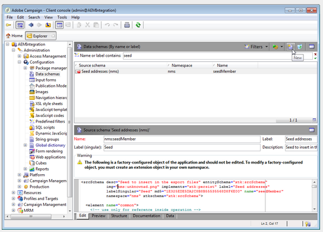

# Integrazione con Adobe Campaign Classic{#integrating-with-adobe-campaign-classic}

>[!NOTE]
>
>Questa documentazione descrive come integrare AEM con Adobe Campaign Classic, la soluzione locale. Se utilizzi Adobe Campaign Standard, consulta [Integrazione con Adobe Campaign Standard](/help/sites-administering/campaignstandard.md) .

Adobe Campaign consente di gestire i contenuti e i moduli per la distribuzione delle e-mail direttamente in Adobe Experience Manager.

Per utilizzare entrambe le soluzioni insieme allo stesso tempo, è innanzitutto necessario configurarle per collegarsi tra loro. Ciò comporta passaggi di configurazione sia in Adobe Campaign che in Adobe Experience Manager. Questi passaggi sono descritti in dettaglio in questo documento.

L&#39;utilizzo di Adobe Campaign in AEM include la possibilità di inviare e-mail tramite Adobe Campaign ed è descritto in [Utilizzo di Adobe Campaign](/help/sites-authoring/campaign.md). Include inoltre l’uso di moduli sulle pagine AEM per manipolare i dati.

Inoltre, i seguenti argomenti possono essere di interesse per l&#39;integrazione di AEM con [Adobe Campaign](https://helpx.adobe.com/support/campaign/classic.html):

* [Best practice per i modelli e-mail](/help/sites-administering/best-practices-for-email-templates.md)
* [Risoluzione dei problemi dell&#39;integrazione con Adobe Campaign](/help/sites-administering/troubleshooting-campaignintegration.md)

Se stai estendendo la tua integrazione con Adobe Campaign, potresti voler vedere le pagine seguenti:

* [Creazione di estensioni personalizzate](/help/sites-developing/extending-campaign-extensions.md)
* [Creazione di mappature di moduli personalizzate](/help/sites-developing/extending-campaign-form-mapping.md)

## Flusso di lavoro di integrazione di AEM e Adobe Campaign {#aem-and-adobe-campaign-integration-workflow}

Questa sezione descrive un flusso di lavoro tipico tra AEM e Adobe Campaign per la creazione di campagne e la distribuzione di contenuti.

Il flusso di lavoro tipico include quanto segue ed è descritto in dettaglio:

1. Inizia a creare la tua campagna (sia in Adobe Campaign che in AEM).
1. Prima di collegare i contenuti e la distribuzione, personalizza i contenuti in AEM e crea una distribuzione in Adobe Campaign.
1. Collega contenuti e distribuzione in Adobe Campaign.

### Iniziate a creare la campagna {#start-building-your-campaign}

Si inizia a creare una campagna in qualsiasi momento. Prima di collegare il contenuto, AEM e AC sono indipendenti Ciò significa che gli addetti al marketing possono iniziare a creare le proprie campagne e il targeting in Adobe Campaign, mentre i creatori di contenuti stanno lavorando alla progettazione in AEM.

### Prima di collegare contenuti e consegne {#before-linking-content-and-delivery}

Prima di collegare il contenuto e creare un meccanismo di distribuzione, dovete effettuare le seguenti operazioni:

**In AEM**

* Personalizzare utilizzando i campi di personalizzazione nel componente **Testo e personalizzazione**

**In Adobe Campaign**

* Creare una consegna di tipo **aemContent**

### Collegamento dei contenuti e impostazione della distribuzione {#linking-content-and-setting-delivery}

Dopo aver preparato il contenuto per il collegamento e la distribuzione, potete determinare esattamente come e dove collegare il contenuto.

Tutti questi passaggi sono completati in Adobe Campaign.

1. Specificate quale istanza AEM utilizzare.
1. Sincronizzate il contenuto facendo clic sul pulsante Sincronizza.
1. Aprite il selettore del contenuto per selezionare il contenuto.

### Se non hai mai utilizzato AEM {#if-you-are-new-to-aem}

Se non avete mai usato AEM, per comprendere AEM potete trovare i seguenti collegamenti:

* [Avvio di AEM](/help/sites-deploying/deploy.md)
* [Informazioni sugli agenti di replica](/help/sites-deploying/replication.md)
* [Ricerca e utilizzo dei file di registro](/help/sites-deploying/monitoring-and-maintaining.md#working-with-audit-records-and-log-files)
* [Introduzione alla piattaforma AEM](/help/sites-deploying/platform.md)

## Configurazione di Adobe Campaign {#configuring-adobe-campaign}

La configurazione di Adobe Campaign prevede quanto segue:

1. Installazione del pacchetto di integrazione AEM in Adobe Campaign.
1. Configurazione di un account esterno.
1. Verifica della configurazione corretta di AEMResourceTypeFilter.

Sono inoltre disponibili configurazioni avanzate, tra cui:

* Gestione dei blocchi di contenuto
* Gestione dei campi di personalizzazione

Consultate [Configurazioni](#advanced-configurations)avanzate.

>[!NOTE]
>
>Per eseguire queste operazioni, devi avere il ruolo di **amministrazione** in Adobe Campaign.

### Prerequisiti {#prerequisites}

Assicuratevi di disporre già dei seguenti elementi:

* [Un’istanza di creazione AEM](/help/sites-deploying/deploy.md#getting-started)
* [Un’istanza di pubblicazione AEM](/help/sites-deploying/deploy.md#author-and-publish-installs)
* [Un&#39;istanza](https://helpx.adobe.com/support/campaign/classic.html) di Adobe Campaign Classic, che include un client e un server
* Internet Explorer 11

>[!NOTE]
>
>Se esegui una versione precedente alla build 8640 di Adobe Campaign Classic, consulta la documentazione [di](https://docs.campaign.adobe.com/doc/AC6.1/en/PRO_Updating_Adobe_Campaign_Upgrading.html) aggiornamento per ulteriori informazioni. È necessario aggiornare client e database alla stessa build.

>[!CAUTION]
>
>Le operazioni descritte nelle sezioni [Configurazione di Adobe Campaign](#configuring-adobe-campaign) e [Configurazione di Adobe Experience Manager](#configuring-adobe-experience-manager) sono necessarie per il corretto funzionamento delle funzionalità di integrazione tra AEM e Adobe Campaign.

### Installazione del pacchetto di integrazione AEM {#installing-the-aem-integration-package}

Devi installare il pacchetto **AEM Integration** in Adobe Campaign. Per effettuare ciò:

1. Andate all&#39;istanza di Adobe Campaign che desiderate collegare con AEM.
1. *Selezionate* Strumenti *>* Avanzate *>* Importa pacchetto... .

   

1. Fate clic su **Installa un pacchetto** standard, quindi selezionate il pacchetto **AEM Integration** .

   

1. Fate clic su **Avanti**, quindi su **Avvia**.

   Questo pacchetto contiene l&#39;operatore **aemserver** che verrà utilizzato per collegare il server AEM ad Adobe Campaign.

   >[!CAUTION]
   >
   >Per impostazione predefinita, per questo operatore non è configurata alcuna zona di protezione. Per connettersi ad Adobe Campaign tramite AEM, devi selezionarne uno.
   >
   >Nel file **serverConf.xml** , l&#39;attributo **allowUserPassword** della zona di protezione selezionata deve essere impostato su **true** per autorizzare AEM a collegare Adobe Campaign tramite login/password.
   >
   >È vivamente consigliato creare una zona di sicurezza dedicata ad AEM per evitare problemi di sicurezza. Per ulteriori informazioni, consulta la guida all’ [installazione](https://docs.campaign.adobe.com/doc/AC/en/INS_Additional_configurations_Configuring_Campaign_server.html).

   

### Configurazione di un account AEM esterno {#configuring-an-aem-external-account}

Devi configurare un account esterno che ti consenta di collegare Adobe Campaign alla tua istanza di AEM.

>[!NOTE]
>
>* Quando si installa il pacchetto **AEM Integration** , viene creato un account AEM esterno. Puoi configurare la connessione all’istanza AEM da tale istanza o crearne una nuova.
>* In AEM, accertatevi di impostare la password per l’utente remoto della campagna. Devi impostare questa password per collegare Adobe Campaign ad AEM. Accedete come amministratore e nella console di amministrazione utente, cercate l’utente remoto della campagna e fate clic su **Imposta password**.
>


Per configurare un account AEM esterno:

1. Andate al nodo **Amministrazione** > **Piattaforma** > Account **** esterni.
1. Create un nuovo account esterno e selezionate il tipo di **AEM** .
1. Immettete i parametri di accesso per l’istanza di authoring di AEM: l&#39;indirizzo del server e l&#39;ID e la password utilizzati per connettersi a questa istanza. La password dell&#39;account utente campaign-api è la stessa dell&#39;utente remoto della campagna per cui avete impostato una password in AEM.

   >[!NOTE]
   >
   >Accertatevi che l&#39;indirizzo del server **non** termini in una barra finale. Ad esempio, immettete `https://yourserver:4502` anziché `https://yourserver:4502/`

    

1. Assicurarsi che la casella di controllo **Abilitato** sia selezionata.

### Verifica dell’opzione AEMResourceTypeFilter {#verifying-the-aemresourcetypefilter-option}

L&#39;opzione **AEMResourceTypeFilter** viene utilizzata per filtrare i tipi di risorse AEM utilizzabili in Adobe Campaign. Questo consente ad Adobe Campaign di recuperare contenuti AEM creati specificamente per essere utilizzati solo in Adobe Campaign.

Questa opzione deve essere preconfigurata; tuttavia, se modificate questa opzione, potrebbe causare un&#39;integrazione non funzionante.

Per verificare che l&#39;opzione **AEMResourceTypeFilter** sia configurata:

1. Vai a **Piattaforma** >**Opzioni**.
1. Nell’opzione **AEMResourceTypeFilter** , verificate che i percorsi siano corretti. Questo campo deve contenere il valore:

   **mcm/campaign/components/newsletter,mcm/campaign/components/campaign_newsletterpagina,mcm/neolane/components/newsletter**

   In alcuni casi, il valore è il seguente:

   **mcm/campaign/components/newsletter**

   

## Configuring Adobe Experience Manager {#configuring-adobe-experience-manager}

Per configurare AEM, dovete effettuare le seguenti operazioni:

* Configurare la replica tra le istanze.
* Collega AEM ad Adobe Campaign tramite Cloud Services.
* Configurare l&#39;esternalizzatore.

### Configurazione della replica tra le istanze AEM {#configuring-replication-between-aem-instances}

Il contenuto creato dall’istanza di creazione di AEM viene inviato per la prima volta all’istanza di pubblicazione. Per rendere disponibili le immagini della newsletter nell’istanza di pubblicazione e nei destinatari della newsletter, è necessario pubblicarle. L’agente di replica deve pertanto essere configurato per essere replicato dall’istanza di authoring di AEM all’istanza di pubblicazione di AEM.

>[!NOTE]
>
>Se non si desidera utilizzare l&#39;URL di replica ma utilizzare l&#39;URL rivolto al pubblico, è possibile impostare l&#39;URL **** pubblico nella seguente impostazione di configurazione in OSGi (logo **** AEM > icona **Strumenti** > Operazioni **> Console** > Configurazione **OSGiConfigurazione> Integrazione della campagna** **** **** AEM - Configurazionepromessa):
**** URL pubblico: com.day.cq.mcm.campaign.impl.IntegrationConfigImpl#aem.mcm.campaign.publicUrl

Questo passaggio è inoltre necessario per replicare alcune configurazioni dell’istanza di creazione nell’istanza di pubblicazione.

Per configurare la replica tra le istanze di AEM:

1. Dall’istanza di creazione, selezionate il logo **** AEM > Icona **Strumenti** > **Distribuzione** > **Replica** > **Agenti all’autore******, quindi fate clic suAgente predefinito.

   

   >[!NOTE]
   Evitate di utilizzare localhost (ossia una copia locale di AEM) per configurare l&#39;integrazione con Adobe Campaign, a meno che l&#39;istanza di pubblicazione e di creazione non si trovi entrambi sullo stesso computer.

1. Toccate o fate clic su **Modifica** , quindi selezionate la scheda **Trasporto** .
1. Configurate l’URI sostituendo **localhost** con l’indirizzo IP o l’indirizzo dell’istanza di pubblicazione AEM.

   

### Connessione di AEM ad Adobe Campaign {#connecting-aem-to-adobe-campaign}

Prima di poter utilizzare AEM e Adobe Campaign insieme, è necessario stabilire il collegamento tra entrambe le soluzioni in modo che possano comunicare.

1. Connettiti all’istanza di authoring di AEM.
1. Seleziona il logo **** AEM > icona **Strumenti** > **Distribuzione** > Servizi **** Cloud, quindi **Configura ora** nella sezione Adobe Campaign.

   

1. Crea una nuova configurazione immettendo un **Titolo** e facendo clic su **Crea**, oppure scegli la configurazione esistente da collegare all&#39;istanza di Adobe Campaign.
1. Modifica la configurazione in modo che corrisponda ai parametri dell&#39;istanza di Adobe Campaign.

   * **Nome utente**: **aemserver**, l&#39;operatore del pacchetto di integrazione AEM di Adobe Campaign utilizzato per stabilire il collegamento tra le due soluzioni.
   * **Password**: Password dell&#39;operatore server di Adobe Campaign. Potrebbe essere necessario specificare nuovamente la password per questo operatore direttamente in Adobe Campaign.
   * **Punto** finale API: URL dell&#39;istanza di Adobe Campaign.

1. Selezionate **Connetti ad Adobe Campaign** e fate clic su **OK**.

   

   >[!NOTE]
   Dopo aver [creato il messaggio e-mail e averlo](/help/sites-authoring/campaign.md)pubblicato, è necessario ripubblicare la configurazione nell’istanza di pubblicazione.

   

>[!NOTE]
Se la connessione non riesce, verificate quanto segue:
* È possibile che si verifichi un problema relativo al certificato quando si utilizza una connessione protetta a un&#39;istanza di Adobe Campaign (https). Dovrai aggiungere il certificato di istanza di Adobe Campaign al file **cacerts** del JDK dell&#39;istanza AEM.
* È necessario configurare un&#39;area di protezione per l&#39;operatore [server](#connecting-aem-to-adobe-campaign) aemserver in Adobe Campaign. Inoltre, nel file **serverConf.xml** , l&#39;attributo **allowUserPassword** dell&#39;area di protezione deve essere impostato su **true** per autorizzare la connessione AEM ad Adobe Campaign utilizzando la modalità login/password.

Inoltre, consulta [Risoluzione dei problemi di integrazione](/help/sites-administering/troubleshooting-campaignintegration.md)con AEM/Adobe Campaign.

### Configurazione dell&#39;esternalizzatore {#configuring-the-externalizer}

È necessario [configurare l’esternalizzatore](/help/sites-developing/externalizer.md) in AEM nell’istanza di creazione. L’esternalizzatore è un servizio OSGi che consente di trasformare un percorso di risorsa in un URL esterno e assoluto. Questo servizio fornisce una posizione centrale per configurare gli URL esterni e crearli.

Consultate [Configurare l&#39;esternalizzatore](/help/sites-developing/externalizer.md) per istruzioni generali. Per l&#39;integrazione con Adobe Campaign, accertatevi di configurare il server di pubblicazione `https://<host>:<port>/system/console/configMgr/com.day.cq.commons.impl.ExternalizerImpl`non puntando a `localhost:4503` ma a un server raggiungibile dalla console di Adobe Campaign.

Se indica `localhost:4503` o un altro server a cui Adobe Campaign non è in grado di accedere, le immagini non verranno visualizzate nella console di Adobe Campaign.


## Configurazioni avanzate {#advanced-configurations}

È inoltre possibile eseguire alcune configurazioni avanzate:

* Gestire campi e blocchi di personalizzazione.
* Disattiva un blocco di personalizzazione.
* Gestire i dati di estensione della destinazione.

### Gestione di campi e blocchi di personalizzazione {#managing-personalization-fields-and-blocks}

I campi e i blocchi disponibili per aggiungere personalizzazione al contenuto delle e-mail in AEM sono gestiti da Adobe Campaign.

Un elenco predefinito è fornito ma può essere modificato. Puoi anche aggiungere o nascondere campi e blocchi di personalizzazione.

#### Aggiunta di un campo di personalizzazione {#adding-a-personalization-field}

Per aggiungere un nuovo campo di personalizzazione a quelli già disponibili, devi estendere lo schema **nms:seedMember** di Adobe Campaign nel modo seguente:

>[!CAUTION]
Il campo che è necessario aggiungere deve essere già stato aggiunto tramite un&#39;estensione dello schema del destinatario (**nms:destinatario**). Per ulteriori informazioni, consultate la guida alla [configurazione](https://docs.campaign.adobe.com/doc/AC6.1/en/CFG_Editing_schemas_Editing_schemas.html) .

1. Andate al nodo **Amministrazione** > **Configurazione** > **Schemi** dati nella navigazione di Adobe Campaign.
1. Selezionate **Nuovo**.

   

1. Nella finestra a comparsa, selezionate **Estendi i dati nella tabella utilizzando uno schema** di estensione e fate clic su **Avanti**.

   

1. Immettete i diversi parametri dello schema esteso:

   * **Schema**: selezionate lo schema **nms:seedMember** . Gli altri campi della finestra vengono completati automaticamente.
   * **Spazio dei nomi**: personalizzare lo spazio nomi dello schema esteso.

1. Modificate il codice XML dello schema per specificare il campo da aggiungere. Per ulteriori informazioni sull&#39;estensione degli schemi in Adobe Campaign, consulta la guida [alla](https://docs.campaign.adobe.com/doc/AC6.1/en/CFG_Editing_schemas_Extending_a_schema.html)configurazione.
1. Salva lo schema, quindi aggiorna la struttura del database Adobe Campaign utilizzando il menu **Strumenti** > **Avanzate** > **Aggiorna struttura** del database nella console.
1. Disconnettiti, quindi ricollega la console di Adobe Campaign per salvare le modifiche. Il nuovo campo viene ora visualizzato nell’elenco dei campi di personalizzazione disponibili in AEM.

#### Esempio {#example}

Per aggiungere un campo **Numero** registrazione, è necessario disporre dei seguenti elementi:

* L&#39;estensione **nms:destinatario** dello schema denominata **cus:Recipient** contiene:

```xml
<element desc="Recipient table (profiles)" img="nms:recipient.png" label="Recipients" labelSingular="Recipient" name="recipient">

  <attribute dataPolicy="smartCase" desc="Recipient registration number"
  label="Registration Number"
  length="50" name="registrationNumber" type="string"/>

</element>
```

L&#39;estensione **nms:seedMember** dello schema denominata **cus:seedMember** contiene:

```xml
<element desc="Seed to insert in the export files" img="nms:unknownad.png" label="Seed addresses" labelSingular="Seed" name="seedMember">

  <element name="custom_nms_recipient">
    <attribute name="registrationNumber"
    template="cus:recipient:recipient/@registrationNumber"/>
  </element>

</element>
```

Il campo **Numero** di registrazione fa ora parte dei campi di personalizzazione disponibili:


#### Nascondere un campo di personalizzazione {#hiding-a-personalization-field}

Per nascondere un campo di personalizzazione tra quelli già disponibili, devi estendere lo schema Adobe Campaign **nms:seedMember** come indicato nella sezione [Aggiunta di un campo](#adding-a-personalization-field) di personalizzazione. Effettuate le seguenti operazioni:

1. Copiate il campo che desiderate acquisire dallo schema **nms:seedMember** nello schema esteso (ad esempio,**cus:seedMember** ).
1. Aggiungete l&#39;attributo XML **advanced=&quot;true&quot;** al campo. Non viene più visualizzato nell’elenco dei campi di personalizzazione disponibili in AEM.

   Ad esempio, per nascondere il campo Nome **** intermedio, lo schema **cud:seedMember** deve contenere l&#39;elemento seguente:

   ```xml
   <element desc="Seed to insert in the export files" img="nms:unknownad.png" label="Seed addresses" labelSingular="Seed" name="seedMember">
   
     <element name="custom_nms_recipient">
       <attribute advanced="true" name="middleName"/>
     </element>
   
   </element>
   ```

### Disattivazione di un blocco di personalizzazione {#deactivating-a-personalization-block}

Per disattivare un blocco di personalizzazione tra quelli disponibili:

1. Andate al nodo **Risorse** > Gestione **** campagna > Blocchi **di** personalizzazione nella navigazione di Adobe Campaign.
1. Selezionate il blocco di personalizzazione da disattivare in AEM.
1. Deselezionate la casella **Visibile nei menu** di personalizzazione e salvate le modifiche. Il blocco non viene più visualizzato nell&#39;elenco dei blocchi di personalizzazione disponibili in Adobe Campaign.

   

### Gestione dei dati di estensione di destinazione {#managing-target-extension-data}

Puoi anche inserire dati di estensione di destinazione per la personalizzazione. I dati di estensione di destinazione (denominati anche &quot;Dati di destinazione&quot;), derivano dall&#39;arricchimento o dall&#39;aggiunta di dati in una query in un flusso di lavoro della campagna, ad esempio. Per ulteriori informazioni, consultare le sezioni [Creazione di query](https://docs.campaign.adobe.com/doc/AC/en/PTF_Creating_queries_About_queries_in_Campaign.html) e [Arricchimento dei dati](https://docs.campaign.adobe.com/doc/AC/en/WKF_Use_cases_Enriching_data.html) .

>[!NOTE]
I dati nella destinazione sono disponibili solo se il contenuto AEM è sincronizzato con la distribuzione di Adobe Campaign. See [Synchronizing content created in AEM with a delivery from Adobe Campaign](/help/sites-authoring/campaign.md#synchronizing-content-created-in-aem-with-a-delivery-from-adobe-campaign-classic).


