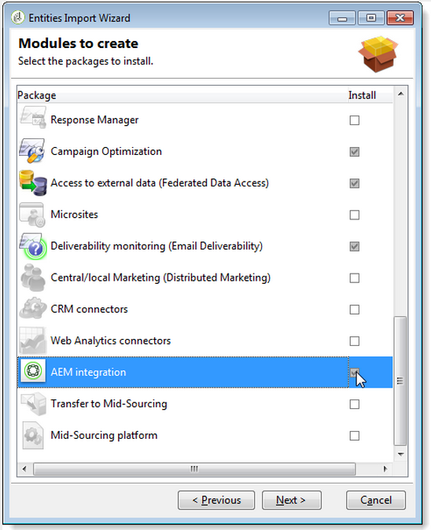
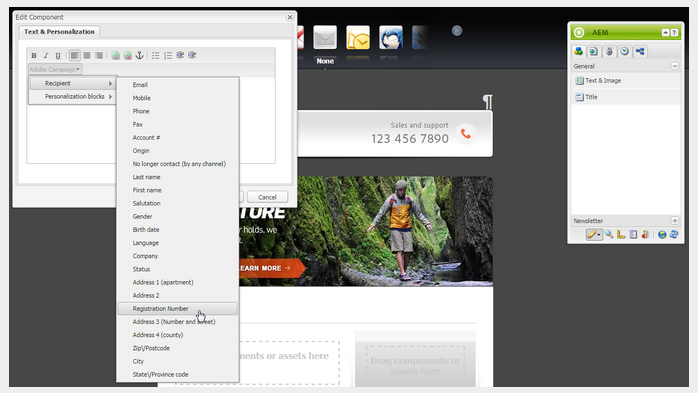

# Integrazione con Adobe Campaign Classic{#integrating-with-adobe-campaign-classic}

>[!NOTE]
>
>Questa documentazione descrive come integrare AEM con Adobe Campaign Classic, la soluzione locale. Se utilizzate  Adobe Campaign Standard, consultate [Integrazione con  Adobe Campaign Standard](/help/sites-administering/campaignstandard.md) per tali istruzioni.

 Adobe Campaign consente di gestire i contenuti e i moduli per la distribuzione tramite e-mail direttamente in Adobe Experience Manager.

Per utilizzare entrambe le soluzioni insieme allo stesso tempo, è innanzitutto necessario configurarle per collegarsi tra loro. Ciò richiede passaggi di configurazione sia in  Adobe Campaign che in Adobe Experience Manager. Questi passaggi sono descritti in dettaglio in questo documento.

Lavorare con  Adobe Campaign in AEM include la possibilità di inviare e-mail tramite  Adobe Campaign ed è descritto in [Utilizzo  Adobe Campaign](/help/sites-authoring/campaign.md). Include inoltre l&#39;uso di moduli su AEM pagine per manipolare i dati.

Inoltre, i seguenti argomenti possono interessare l&#39;integrazione di AEM con [ Adobe Campaign](https://helpx.adobe.com/support/campaign/classic.html):

* [Best practice per i modelli e-mail](/help/sites-administering/best-practices-for-email-templates.md)
* [Risoluzione dei problemi relativi all&#39;integrazione  Adobe Campaign](/help/sites-administering/troubleshooting-campaignintegration.md)

Se state estendendo l&#39;integrazione con  Adobe Campaign, potete visualizzare le pagine seguenti:

* [Creazione di estensioni personalizzate](/help/sites-developing/extending-campaign-extensions.md)
* [Creazione di mappature di moduli personalizzate](/help/sites-developing/extending-campaign-form-mapping.md)

## Flusso di lavoro AEM e  integrazione Adobe Campaign {#aem-and-adobe-campaign-integration-workflow}

Questa sezione descrive un flusso di lavoro tipico tra AEM e  Adobe Campaign durante la creazione di campagne e la distribuzione di contenuti.

Il flusso di lavoro tipico include quanto segue ed è descritto in dettaglio:

1. Iniziate a creare la campagna (sia in  Adobe Campaign che in AEM).
1. Prima di collegare il contenuto e la distribuzione, personalizzate i contenuti in AEM e create una distribuzione in  Adobe Campaign.
1. Collegamento di contenuti e distribuzione in  Adobe Campaign.

### Iniziate a creare la campagna {#start-building-your-campaign}

Si inizia a creare una campagna in qualsiasi momento. Prima di collegare i contenuti, AEM e CA sono indipendenti Ciò significa che gli addetti marketing possono iniziare a creare le proprie campagne e il targeting in  Adobe Campaign, mentre gli autori dei contenuti stanno lavorando alla progettazione in AEM.

### Prima di collegare contenuti e consegna {#before-linking-content-and-delivery}

Prima di collegare il contenuto e creare un meccanismo di distribuzione, è necessario effettuare le seguenti operazioni:

**In AEM**

* Personalizzare utilizzando i campi di personalizzazione nel componente **Testo e personalizzazione**

**In Adobe Campaign**

* Creare una consegna di tipo **aemContent**

### Collegamento di contenuti e impostazione della distribuzione {#linking-content-and-setting-delivery}

Dopo aver preparato il contenuto per il collegamento e la distribuzione, potete determinare esattamente come e dove collegare il contenuto.

Tutti questi passaggi sono completati in  Adobe Campaign.

1. Specificate quale istanza AEM utilizzare.
1. Sincronizzate il contenuto facendo clic sul pulsante Sincronizza.
1. Aprite il selettore del contenuto per selezionare il contenuto.

### Se non avete mai AEM {#if-you-are-new-to-aem}

Se non avete mai AEM, potete trovare utili i seguenti collegamenti per comprendere AEM:

* [AEM iniziale](/help/sites-deploying/deploy.md)
* [Informazioni sugli agenti di replica](/help/sites-deploying/replication.md)
* [Ricerca e utilizzo dei file di registro](/help/sites-deploying/monitoring-and-maintaining.md#working-with-audit-records-and-log-files)
* [Introduzione alla piattaforma AEM](/help/sites-deploying/platform.md)

## Configurazione  Adobe Campaign {#configuring-adobe-campaign}

La configurazione di  Adobe Campaign implica quanto segue:

1. Installazione del pacchetto di integrazione AEM in  Adobe Campaign.
1. Configurazione di un account esterno.
1. Verifica della configurazione corretta di AEMResourceTypeFilter.

Sono inoltre disponibili configurazioni avanzate, tra cui:

* Gestione dei blocchi di contenuto
* Gestione dei campi di personalizzazione

Vedere [Configurazioni avanzate](#advanced-configurations).

>[!NOTE]
>
>Per eseguire queste operazioni, è necessario avere il ruolo **administration** in  Adobe Campaign.

### Prerequisiti {#prerequisites}

Assicuratevi di disporre già dei seguenti elementi:

* [Un’istanza di authoring AEM](/help/sites-deploying/deploy.md#getting-started)
* [Un’istanza di pubblicazione AEM](/help/sites-deploying/deploy.md#author-and-publish-installs)
* [Un&#39;istanza](https://helpx.adobe.com/support/campaign/classic.html)  Adobe Campaign Classic, che include un client e un server
* Internet Explorer 11

>[!NOTE]
>
>Se è in esecuzione una versione precedente alla build 8640 di Adobe Campaign Classic, consultare la [documentazione di aggiornamento](https://docs.campaign.adobe.com/doc/AC6.1/en/PRO_Updating_Adobe_Campaign_Upgrading.html) per ulteriori informazioni. È necessario aggiornare client e database alla stessa build.

>[!CAUTION]
>
>Le operazioni descritte nelle sezioni [Configurazione  Adobe Campaign](#configuring-adobe-campaign) e [Configurazione di Adobe Experience Manager](#configuring-adobe-experience-manager) sono necessarie per il corretto funzionamento delle funzionalità di integrazione tra AEM e  Adobe Campaign.

### Installazione del pacchetto di integrazione AEM {#installing-the-aem-integration-package}

È necessario installare il pacchetto **AEM Integration** in  Adobe Campaign. Per effettuare ciò:

1. Passate all&#39;istanza di Adobe Campaign  con cui desiderate collegarvi a AEM.
1. Selezionare *Strumenti* > *Avanzate* > *Importa pacchetto...*.

   

1. Fare clic su **Installa un pacchetto standard**, quindi selezionare il pacchetto **AEM Integration**.

   

1. Fare clic su **Next**, quindi su **Start**.

   Questo pacchetto contiene l&#39;operatore **aemserver** che verrà utilizzato per collegare il server AEM a  Adobe Campaign.

   >[!CAUTION]
   >
   >Per impostazione predefinita, per questo operatore non è configurata alcuna zona di protezione. Per connettersi a  Adobe Campaign tramite AEM, è necessario selezionarne uno.
   >
   >Nel file **serverConf.xml**, l&#39;attributo **allowUserPassword** della zona di protezione selezionata deve essere impostato su **true** per autorizzare AEM la connessione  Adobe Campaign tramite login/password.
   >
   >Consigliamo vivamente di creare una zona di sicurezza dedicata a AEM per evitare problemi di sicurezza. Per ulteriori informazioni, consultare la [Guida all&#39;installazione](https://docs.campaign.adobe.com/doc/AC/en/INS_Additional_configurations_Configuring_Campaign_server.html).

   

### Configurazione di un account esterno AEM {#configuring-an-aem-external-account}

È necessario configurare un account esterno che consenta di collegare  Adobe Campaign all&#39;istanza AEM.

>[!NOTE]
>
>* Durante l&#39;installazione del pacchetto **AEM Integration**, viene creato un account AEM esterno. È possibile configurare la connessione all&#39;istanza AEM da essa oppure crearne una nuova.
>* In AEM, accertatevi di impostare la password per l’utente remoto della campagna. È necessario impostare questa password per collegarsi  Adobe Campaign con AEM. Accedete come amministratore e nella console di amministrazione utente, cercate l&#39;utente remoto della campagna e fate clic su **Imposta password**.

>


Per configurare un account AEM esterno:

1. Andate al nodo **Administration** > **Platform** > **External Accounts**.
1. Create un nuovo account esterno e selezionate il tipo **AEM**.
1. Immettete i parametri di accesso per l’istanza di authoring AEM: l&#39;indirizzo del server e l&#39;ID e la password utilizzati per connettersi a questa istanza. La password dell&#39;account utente campaign-api è la stessa dell&#39;utente remoto della campagna per cui avete impostato una password in AEM.

   >[!NOTE]
   >
   >Assicurarsi che l&#39;indirizzo del server **non** termini in una barra finale. Ad esempio, immettere `https://yourserver:4502` anziché `https://yourserver:4502/`

    

1. Assicurarsi che la casella di controllo **Abilitato** sia selezionata.

### Verifica dell&#39;opzione AEMResourceTypeFilter {#verifying-the-aemresourcetypefilter-option}

L&#39;opzione **AEMResourceTypeFilter** viene utilizzata per filtrare i tipi di risorse AEM che possono essere utilizzate in  Adobe Campaign. Questo consente  Adobe Campaign di recuperare AEM contenuti progettati specificamente per essere utilizzati solo  Adobe Campaign.

Questa opzione deve essere preconfigurata; tuttavia, se modificate questa opzione, potrebbe causare un&#39;integrazione non funzionante.

Per verificare che l&#39;opzione **AEMResourceTypeFilter** sia configurata:

1. Vai a **Piattaforma** >**Opzioni**.
1. Nell&#39;opzione **AEMResourceTypeFilter**, verificare che i percorsi siano corretti. Questo campo deve contenere il valore:

   **mcm/campaign/components/newsletter,mcm/campaign/components/campaign_newsletterpagina,mcm/neolane/components/newsletter**

   In alcuni casi, il valore è il seguente:

   **mcm/campaign/components/newsletter**

   

## Configurazione di Adobe Experience Manager {#configuring-adobe-experience-manager}

Per configurare AEM, è necessario effettuare le seguenti operazioni:

* Configurare la replica tra le istanze.
* Collegate AEM a  Adobe Campaign tramite Cloud Services.
* Configurare l&#39;esternalizzatore.

### Configurazione della replica tra AEM istanze {#configuring-replication-between-aem-instances}

Il contenuto creato dall’istanza di creazione AEM viene inviato per la prima volta all’istanza di pubblicazione. Per rendere disponibili le immagini della newsletter nell’istanza di pubblicazione e per i destinatari della newsletter, è necessario pubblicarle. L&#39;agente di replica deve pertanto essere configurato per eseguire la replica dall&#39;istanza di creazione AEM all&#39;istanza di pubblicazione AEM.

>[!NOTE]
>
>Se non si desidera utilizzare l&#39;URL di replica ma utilizzare l&#39;URL rivolto al pubblico, è possibile impostare l&#39; **URL pubblico** nella seguente impostazione di configurazione in OSGi (**AEM logo** > **Strumenti** icona > **Operazioni** > **Console** 10/>Configurazione OSGi **>** AEM Integrazione campagna - Configurazione **):**
**URL pubblico:** com.day.cq.mcm.campaign.impl.IntegrationConfigImpl#aem.mcm.campaign.publicUrl

Questo passaggio è inoltre necessario per replicare alcune configurazioni dell’istanza di creazione nell’istanza di pubblicazione.

Per configurare la replica tra AEM istanze:

1. Nell&#39;istanza di creazione, selezionare **AEM logo**> **Icona Strumenti** > **Distribuzione** > **Replica** > **Agenti sull&#39;autore**, quindi fare clic su **Agente predefinito**.

   

   >[!NOTE]
   Evitate di usare localhost (ossia una copia locale di AEM) per configurare l’integrazione con  Adobe Campaign, a meno che l’istanza di pubblicazione e di creazione non si trovi entrambe sullo stesso computer.

1. Toccate o fate clic su **Modifica**, quindi selezionate la scheda **Trasporto**.
1. Configurate l&#39;URI sostituendo **localhost** con l&#39;indirizzo IP o l&#39;indirizzo dell&#39;istanza di pubblicazione AEM.

   

### Collegamento AEM a  Adobe Campaign {#connecting-aem-to-adobe-campaign}

Prima di poter utilizzare AEM e  Adobe Campaign insieme, è necessario stabilire il collegamento tra entrambe le soluzioni in modo che possano comunicare.

1. Connettiti all’istanza di authoring AEM.
1. Selezionare **AEM logo** > **Icona Strumenti** > **Distribuzione** > **Cloud Services**, quindi **Configura ora** nella sezione  Adobe Campaign.

   

1. Per creare una nuova configurazione, immetti un **Titolo** e fai clic su **Crea** oppure scegli la configurazione esistente da collegare all&#39;istanza di Adobe Campaign .
1. Modificate la configurazione in modo che corrisponda ai parametri dell’istanza di Adobe Campaign .

   * **Nome utente**:  **aemserver**, l&#39;operatore  del pacchetto di integrazione AEM Adobe Campaign utilizzato per stabilire il collegamento tra le due soluzioni.
   * **Password**:  la password dell&#39;operatore Adobe Campaign aemserver. Potrebbe essere necessario specificare nuovamente la password per questo operatore direttamente in  Adobe Campaign.
   * **Punto** finale API:  l’URL dell’istanza Adobe Campaign.

1. Selezionare **Connetti a  Adobe Campaign** e fare clic su **OK**.

   

   >[!NOTE]
   Dopo aver [creato il messaggio e-mail e averlo pubblicato](/help/sites-authoring/campaign.md), è necessario ripubblicare la configurazione nell&#39;istanza di pubblicazione.

   

>[!NOTE]
Se la connessione non riesce, verificate quanto segue:
* È possibile che si verifichi un problema relativo al certificato quando si utilizza una connessione protetta a un&#39;istanza Adobe Campaign  (https). Sarà necessario aggiungere il certificato  istanza Adobe Campaign al file **cacerts** del JDK dell&#39;istanza AEM.
* È necessario configurare un&#39;area di protezione per l&#39; [operatore server ](#connecting-aem-to-adobe-campaign) in  Adobe Campaign. Inoltre, nel file **serverConf.xml**, l&#39;attributo **allowUserPassword** della zona di protezione deve essere impostato su **true** per autorizzare AEM connessione a  Adobe Campaign utilizzando la modalità login/password.

Inoltre, vedete [Risoluzione dei problemi relativi all&#39;integrazione AEM/ Adobe Campaign](/help/sites-administering/troubleshooting-campaignintegration.md).

### Configurazione dell&#39;esternalizzatore {#configuring-the-externalizer}

È necessario [configurare l&#39;esternalizzatore](/help/sites-developing/externalizer.md) in AEM nell&#39;istanza di creazione. L’esternalizzatore è un servizio OSGi che consente di trasformare un percorso di risorsa in un URL esterno e assoluto. Questo servizio fornisce una posizione centrale per configurare gli URL esterni e crearli.

Per istruzioni generali, vedere [Configurare l&#39;esternalizzatore](/help/sites-developing/externalizer.md). Per l&#39;integrazione con Adobe Campaign , accertatevi di configurare il server di pubblicazione su `https://<host>:<port>/system/console/configMgr/com.day.cq.commons.impl.ExternalizerImpl`non puntare a `localhost:4503` ma a un server raggiungibile dalla console Adobe Campaign .

Se punta a `localhost:4503` o a un altro server che  Adobe Campaign non riesce a raggiungere, le immagini non verranno visualizzate nella console Adobe Campaign .


## Configurazioni avanzate {#advanced-configurations}

È inoltre possibile eseguire alcune configurazioni avanzate:

* Gestire campi e blocchi di personalizzazione.
* Disattiva un blocco di personalizzazione.
* Gestire i dati di estensione della destinazione.

### Gestione di campi e blocchi di personalizzazione {#managing-personalization-fields-and-blocks}

I campi e i blocchi disponibili per aggiungere personalizzazione al contenuto delle e-mail in AEM sono gestiti da  Adobe Campaign.

Un elenco predefinito è fornito ma può essere modificato. Puoi anche aggiungere o nascondere campi e blocchi di personalizzazione.

#### Aggiunta di un campo di personalizzazione {#adding-a-personalization-field}

Per aggiungere un nuovo campo di personalizzazione a quelli già disponibili, è necessario estendere  schema Adobe Campaign **nms:seedMember** come segue:

>[!CAUTION]
Il campo che è necessario aggiungere deve essere già stato aggiunto tramite un&#39;estensione dello schema destinatario (**nms:destinatario**). Per ulteriori informazioni, vedere la guida [Configuration](https://docs.campaign.adobe.com/doc/AC6.1/en/CFG_Editing_schemas_Editing_schemas.html).

1. Andate al nodo **Administration** > **Configuration** > **Data schemas** nella navigazione Adobe Campaign .
1. Selezionare **New**.

   

1. Nella finestra a comparsa, selezionare **Estendi i dati nella tabella utilizzando uno schema di estensione**, quindi fare clic su **Avanti**.

   

1. Immettete i diversi parametri dello schema esteso:

   * **Schema**: selezionare  **nms:** seedMemberschema. Gli altri campi della finestra vengono completati automaticamente.
   * **Spazio dei nomi**: personalizzare lo spazio nomi dello schema esteso.

1. Modificate il codice XML dello schema per specificare il campo da aggiungere. Per ulteriori informazioni sull&#39;estensione degli schemi in  Adobe Campaign, fare riferimento alla [Guida alla configurazione](https://docs.campaign.adobe.com/doc/AC6.1/en/CFG_Editing_schemas_Extending_a_schema.html).
1. Salvate lo schema, quindi aggiornate la struttura del database Adobe Campaign  tramite il menu **Strumenti** > **Avanzate** > **Aggiorna struttura del database** nella console.
1. Disconnettetevi quindi di nuovo alla console Adobe Campaign  per salvare le modifiche. Il nuovo campo viene ora visualizzato nell’elenco dei campi di personalizzazione disponibili in AEM.

#### Esempio {#example}

Per aggiungere un campo **Numero registrazione**, è necessario disporre dei seguenti elementi:

* L&#39;estensione dello schema **nms:destinatario** denominata **cus:destinatario** contiene:

```xml
<element desc="Recipient table (profiles)" img="nms:recipient.png" label="Recipients" labelSingular="Recipient" name="recipient">

  <attribute dataPolicy="smartCase" desc="Recipient registration number"
  label="Registration Number"
  length="50" name="registrationNumber" type="string"/>

</element>
```

L&#39;estensione dello schema **nms:seedMember** denominata **cus:seedMember** contiene:

```xml
<element desc="Seed to insert in the export files" img="nms:unknownad.png" label="Seed addresses" labelSingular="Seed" name="seedMember">

  <element name="custom_nms_recipient">
    <attribute name="registrationNumber"
    template="cus:recipient:recipient/@registrationNumber"/>
  </element>

</element>
```

Il campo **Numero di registrazione** fa ora parte dei campi di personalizzazione disponibili:



#### Nascondere un campo di personalizzazione {#hiding-a-personalization-field}

Per nascondere un campo di personalizzazione tra quelli già disponibili, è necessario estendere lo schema Adobe Campaign  **nms:seedMember** come descritto nella sezione [Aggiunta di un campo di personalizzazione](#adding-a-personalization-field). Effettuate le seguenti operazioni:

1. Copiare il campo che si desidera acquisire dallo schema **nms:seedMember** nello schema esteso (**cus:seedMember** ad esempio).
1. Aggiungete l&#39;attributo **advanced=&quot;true&quot;** XML al campo. Non viene più visualizzato nell’elenco dei campi di personalizzazione disponibili in AEM.

   Ad esempio, per nascondere il campo **Nome intermedio**, lo schema **cud:seedMember** deve contenere il seguente elemento:

   ```xml
   <element desc="Seed to insert in the export files" img="nms:unknownad.png" label="Seed addresses" labelSingular="Seed" name="seedMember">
   
     <element name="custom_nms_recipient">
       <attribute advanced="true" name="middleName"/>
     </element>
   
   </element>
   ```

### Disattivazione di un blocco di personalizzazione {#deactivating-a-personalization-block}

Per disattivare un blocco di personalizzazione tra quelli disponibili:

1. Andate al nodo **Risorse** > **Gestione campagna** > **Blocchi di personalizzazione** nella navigazione  Adobe Campaign.
1. Selezionate il blocco di personalizzazione da disattivare in AEM.
1. Deselezionare la casella di controllo **Visibile nei menu di personalizzazione** e salvare le modifiche. Il blocco non viene più visualizzato nell&#39;elenco dei blocchi di personalizzazione disponibili in  Adobe Campaign.

   

### Gestione dei dati di estensione destinazione {#managing-target-extension-data}

Puoi anche inserire dati di estensione di destinazione per la personalizzazione. I dati di estensione di destinazione (denominati anche &quot;Dati di destinazione&quot;), derivano dall&#39;arricchimento o dall&#39;aggiunta di dati in una query in un flusso di lavoro della campagna, ad esempio. Per ulteriori informazioni, consultare le sezioni [Creazione di query](https://docs.campaign.adobe.com/doc/AC/en/PTF_Creating_queries_About_queries_in_Campaign.html) e [Arricchimento dei dati](https://docs.campaign.adobe.com/doc/AC/en/WKF_Use_cases_Enriching_data.html).

>[!NOTE]
I dati nella destinazione sono disponibili solo se il contenuto AEM è sincronizzato con una distribuzione Adobe Campaign . Consultate [Sincronizzazione del contenuto creato in AEM con una distribuzione  Adobe Campaign](/help/sites-authoring/campaign.md#synchronizing-content-created-in-aem-with-a-delivery-from-adobe-campaign-classic).


