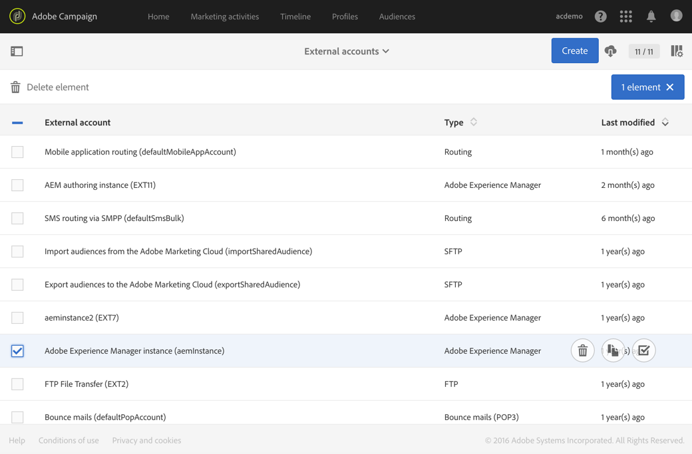

# Integrazione con Adobe Campaign Standard{#integrating-with-adobe-campaign-standard}

>[!NOTE]
>
>Questa documentazione descrive come integrare AEM con Adobe Campaign Standard, la soluzione basata su abbonamento. Se utilizzi Adobe Campaign 6.1, consulta [Integrazione con Adobe Campaign 6.1](/help/sites-administering/campaignonpremise.md) per quelle istruzioni.

Adobe Campaign ti consente di gestire i contenuti e i moduli delle e-mail di consegna direttamente in Adobe Experience Manager.

Per utilizzare entrambe le soluzioni contemporaneamente, è necessario prima configurarle per la connessione reciproca. Ciò comporta passaggi di configurazione sia in Adobe Campaign che in Adobe Experience Manager. Questi passaggi sono descritti in dettaglio in questo documento.

L’utilizzo di Adobe Campaign in AEM include la possibilità di inviare e-mail e moduli tramite Adobe Campaign ed è descritto in [Utilizzo di Adobe Campaign](/help/sites-authoring/campaign.md).

Inoltre, i seguenti argomenti possono essere di interesse per l&#39;integrazione di AEM con [Adobe Campaign](https://docs.campaign.adobe.com/doc/standard/en/home.html):

* [Best practice per i modelli e-mail](/help/sites-administering/best-practices-for-email-templates.md)
* [Risoluzione dei problemi relativi all’integrazione di Adobe Campaign](/help/sites-administering/troubleshooting-campaignintegration.md)

Se estendi l’integrazione con Adobe Campaign, potresti voler vedere le pagine seguenti:

* [Creazione di estensioni personalizzate](/help/sites-developing/extending-campaign-extensions.md)
* [Creazione di mappature di moduli personalizzate](/help/sites-developing/extending-campaign-form-mapping.md)

## Configurazione di Adobe Campaign {#configuring-adobe-campaign}

La configurazione di Adobe Campaign prevede quanto segue:

1. Configurazione della **aemserver** utente.
1. Creazione di un account esterno dedicato.
1. Verifica dell&#39;opzione AEMResourceTypeFilter.
1. Creazione di un modello di consegna dedicato.

>[!NOTE]
>
>Per eseguire queste operazioni, è necessario disporre della **amministrazione** ruolo in Adobe Campaign.

### Prerequisiti {#prerequisites}

Assicurati di avere in precedenza i seguenti elementi:

* [Un’istanza di authoring AEM](/help/sites-deploying/deploy.md#getting-started)
* [Un’istanza di pubblicazione AEM](/help/sites-deploying/deploy.md#author-and-publish-installs)
* [Un’istanza di Adobe Campaign](https://docs.adobe.com/content/docs/en/campaign/ACS.html)

>[!CAUTION]
>
>Operazioni descritte nel [Configurazione di Adobe Campaign](#configuring-adobe-campaign) e [Configurazione di Adobe Experience Manager](#configuring-adobe-experience-manager) Affinché le funzionalità di integrazione tra AEM e Adobe Campaign funzionino correttamente, sono necessarie delle sezioni .

### Configurazione dell’utente di aemserver {#configuring-the-aemserver-user}

La **aemserver** L’utente deve essere configurato in Adobe Campaign. La **aemserver** è un utente tecnico che verrà utilizzato per collegare il server AEM ad Adobe Campaign.

Vai a **Amministrazione** >  **Utenti e sicurezza** >  **Utenti**, quindi seleziona la **aemserver** utente. Fai clic su di esso per aprire le impostazioni utente.

* È necessario impostare una password per questo utente. Non è possibile farlo tramite l’interfaccia utente. Questa configurazione deve essere eseguita in REST da un amministratore tecnico.
* È possibile assegnare ruoli specifici a questo utente, ad esempio **deliveryPrepare**, che consente all’utente di creare e modificare le consegne.

### Configurazione di un account esterno Adobe Experience Manager {#configuring-an-adobe-experience-manager-external-account}

Devi configurare un account esterno che ti consenta di collegare Adobe Campaign all’istanza AEM.

>[!NOTE]
>
>In AEM, accertati di impostare la password per l’utente remoto della campagna. Devi impostare questa password per collegare Adobe Campaign a AEM. Accedi come amministratore e, nella console di amministrazione utente, cerca l’utente remoto della campagna e fai clic su **Imposta password**.

Per configurare un account esterno AEM:

1. Vai a **Amministrazione** > **Impostazioni applicazione** > **Account esterni**.

   

1. Seleziona il valore predefinito **aemInstance** account esterno o creane uno nuovo facendo clic sul pulsante **Crea** pulsante .
1. Seleziona **Adobe Experience Manager** i **Tipo** e immetti i parametri di accesso utilizzati per l’istanza di authoring di AEM: indirizzo server, nome account e password.

   >[!NOTE]
   >
   >Assicurati di non aggiungere un finale **/** la barra alla fine dell’URL o la connessione non funzionerà.

1. Assicurati che il **Abilitato** la casella di controllo è selezionata, quindi fai clic su **Salva** per salvare le modifiche.

### Verifica dell&#39;opzione AEMResourceTypeFilter {#verifying-the-aemresourcetypefilter-option}

La **AEMResourceTypeFilter** viene utilizzata per filtrare i tipi di risorse AEM che possono essere utilizzate in Adobe Campaign. Questo consente ad Adobe Campaign di recuperare AEM contenuti appositamente progettati per essere utilizzati solo in Adobe Campaign.

Questa opzione è preconfigurata; tuttavia, se modifichi questa opzione, potrebbe causare un’integrazione non funzionante.

Per verificare la **AEMResourceTypeFilter** è configurata:

1. Vai a **Amministrazione** > **Impostazioni applicazione** > **Opzioni**.
1. Nell’elenco, puoi verificare che la **AEMResourceTypeFilter** viene elencata l’opzione e i percorsi sono corretti.

### Creazione di un modello di consegna e-mail specifico per AEM {#creating-an-aem-specific-email-delivery-template}

Per impostazione predefinita, la funzione AEM non è abilitata nei modelli e-mail di Adobe Campaign. Puoi configurare un nuovo modello di consegna e-mail che verrà utilizzato per creare e-mail con contenuto AEM.

Per creare un modello di consegna e-mail specifico per AEM:

1. Vai a **Risorse** > **Modelli** > **Modelli di consegna**.
1. **Abilita selezione** facendo clic sul segno di spunta nella barra delle azioni e selezionando il **Posta elettronica standard (posta)** modello predefinito, quindi duplicalo facendo clic sul pulsante **Copia** icona e clic **Conferma**.
1. Disattiva la modalità di selezione facendo clic sul pulsante **x** e apri la nuova creazione **Copia dell&#39;e-mail standard (posta)** modello, quindi seleziona **Modifica proprietà** dalla barra delle azioni del dashboard del modello.

   È possibile modificare le **Etichetta**.

1. Nelle proprietà **Contenuto** sezione , modifica **Origine contenuto** a **Adobe Experience Manager**. Quindi seleziona l’account esterno creato in precedenza e fai clic su **Conferma**.

   Salva le modifiche facendo clic su **Conferma** e facendo clic su **Salva.**

   Le consegne e-mail create da questo modello avranno la funzione di contenuto AEM abilitata.

   

## Configurazione di Adobe Experience Manager {#configuring-adobe-experience-manager}

Per configurare AEM, è necessario effettuare le seguenti operazioni:

* Configura la replica tra le istanze.
* Connetti AEM ad Adobe Campaign.
* Configura l&#39;esternalizzatore.

### Configurazione della replica tra istanze AEM {#configuring-replication-between-aem-instances}

Il contenuto creato dall’istanza di authoring AEM viene inviato per la prima volta all’istanza di pubblicazione. Questa istanza di pubblicazione trasferisce quindi il contenuto in Adobe Campaign. L’agente di replica deve pertanto essere configurato per replicare dall’istanza di authoring AEM all’istanza di pubblicazione AEM.

>[!NOTE]
>
>Se non desideri utilizzare l&#39;URL di replica ma invece utilizzare l&#39;URL rivolto al pubblico, puoi impostare la **URL pubblico** nella seguente impostazione di configurazione in OSGi (**Strumenti** > **Console web** > **Configurazione OSGi > Integrazione campagna AEM - Configurazione**):
**URL pubblico:** com.day.cq.mcm.campaign.impl.IntegrationConfigImpl#aem.mcm.campaign.publicUrl

Questo passaggio è necessario anche per replicare alcune configurazioni di istanze di authoring nell’istanza di pubblicazione.

Per configurare la replica tra istanze AEM:

1. Dall’istanza di authoring, seleziona **Logo AEM**> **Strumenti** > **Distribuzione** > **Replica** > **Agenti sull&#39;autore**, quindi fai clic su **Agente predefinito**.

   

   >[!NOTE]
   Evita di utilizzare localhost (ovvero una copia locale di AEM) durante la configurazione dell’integrazione con Adobe Campaign, a meno che l’istanza di pubblicazione e authoring non si trovi entrambi sullo stesso computer.

1. Fai clic su **Modifica** quindi seleziona la **Trasporti** scheda .
1. Configura l’URI sostituendo **localhost** con l’indirizzo IP o l’indirizzo dell’istanza di pubblicazione AEM.

   

### Collegamento AEM ad Adobe Campaign {#connecting-aem-to-adobe-campaign}

Prima di poter utilizzare AEM e Adobe Campaign insieme, è necessario stabilire il collegamento tra entrambe le soluzioni in modo che possano comunicare.

1. Collegati all’istanza di authoring AEM.
1. Seleziona **Strumenti** > **Operazioni** > **Cloud** > **Cloud Services**, quindi **Configura ora** nella sezione Adobe Campaign .

   

1. Crea una nuova configurazione immettendo un **Titolo** e fai clic su **Crea** oppure scegli la configurazione esistente da collegare alla tua istanza Adobe Campaign.
1. Modifica la configurazione in modo che corrisponda ai parametri dell’istanza Adobe Campaign.

   * **Nome utente**: **aemserver**, l’operatore del pacchetto di integrazione di Adobe Campaign AEM utilizzato per stabilire il collegamento tra le due soluzioni.
   * **Password**: Password dell&#39;operatore aemserver Adobe Campaign. Potrebbe essere necessario specificare nuovamente la password per questo operatore direttamente in Adobe Campaign.
   * **Punto finale API**: URL dell’istanza di Adobe Campaign.

1. Seleziona **Connettersi ad Adobe Campaign** e fai clic su **OK**.

   

   >[!NOTE]
   Dopo [crea l’e-mail e pubblicala](/help/sites-authoring/campaign.md), devi ripubblicare la configurazione nell’istanza di pubblicazione.

   

>[!NOTE]
Se la connessione non riesce, verifica quanto segue:
* È possibile che si verifichi un problema di certificato quando si utilizza una connessione sicura a un&#39;istanza Adobe Campaign (https). Dovrai aggiungere il certificato dell’istanza Adobe Campaign al file **cacerts **del tuo JDK.
* Inoltre, vedi [Risoluzione dei problemi dell&#39;integrazione AEM/Adobe Campaign](/help/sites-administering/troubleshooting-campaignintegration.md).
>

### Configurazione dell’esternalizzatore {#configuring-the-externalizer}

Devi [configurare l&#39;esternalizzatore](/help/sites-developing/externalizer.md) in AEM sull’istanza di authoring. L’esternalizzatore è un servizio OSGi che consente di trasformare un percorso di risorsa in un URL esterno e assoluto. Questo servizio fornisce una posizione centrale per configurare gli URL esterni e generarli.

Vedi [Configurare l’esternalizzatore](/help/sites-developing/externalizer.md) per istruzioni generali. Per l’integrazione con Adobe Campaign, accertati di configurare il server di pubblicazione in `https://<host>:<port>/system/console/configMgr/com.day.cq.commons.impl.ExternalizerImpl` non indicare `localhost:4503` ma a un server raggiungibile dalla console Adobe Campaign.

Se indica `localhost:4503` Per un altro server che Adobe Campaign non è in grado di raggiungere, le immagini non verranno visualizzate nella console Adobe Campaign.

