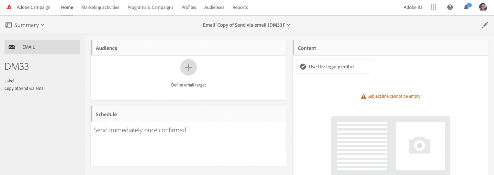

# Integrazione con Adobe Campaign Standard {#integrating-with-adobe-campaign-standard}

Integrando AEM con Adobe Campaign, puoi gestire e-mail, contenuti e moduli direttamente in AEM. I passaggi di configurazione sia in Adobe Campaign Standard che in AEM sono necessari per abilitare la comunicazione bidirezionale tra le soluzioni.

Questa integrazione consente di utilizzare AEM e Adobe Campaign Standard in modo indipendente. Gli addetti al marketing possono creare campagne e utilizzare il targeting in Adobe Campaign, mentre i creatori di contenuti possono lavorare contemporaneamente sulla progettazione del contenuto in AEM. Utilizzando l’integrazione, il contenuto e la progettazione della campagna creata in AEM possono essere mirati e consegnati da Adobe Campaign.

## Passaggi dell’integrazione {#integration-steps}

La configurazione dell’integrazione tra AEM e Adobe Campaign Standard richiede una serie di passaggi in entrambe le soluzioni.

1. [Configura le ](#aemserver-user)
1. [Verifica la ](#resource-type-filter)
1. [Creare un modello di consegna e-mail specifico per AEM in Campaign](#aem-email-delivery-template)
1. [Configurare l’integrazione di Campaign in AEM](#campaign-integration)
1. [Configurare la replica per l’istanza di pubblicazione AEM](#replication)
1. [Configurare AEM Externalizer](#externalizer)
1. [Configura le ](#campaign-remote-user)
1. [Configurare l’account esterno AEM in Campaign](#acc-external-user)

Il presente documento fornisce una guida dettagliata per superare ognuno di questi passaggi.

## Prerequisiti {#prerequisites}

* Accesso dell’amministratore ad Adobe Campaign Standard
   * Per ulteriori informazioni su come configurare e configurare Adobe Campaign Standard, consulta la sezione [Documentazione di Adobe Campaign Standard.](https://experienceleague.adobe.com/docs/campaign-standard/using/campaign-standard-home.html)
* Accesso amministratore a AEM

## Configurare l’utente aemserver in Campaign {#aemserver-user}

Per impostazione predefinita, Adobe Campaign Standard include un `aemserver` utente che utilizza AEM per connettersi ad Adobe Campaign. È necessario assegnare un gruppo di sicurezza appropriato per questo utente e impostarne la password.

1. Accedi ad Adobe Campaign come amministratore.

1. Tocca o fai clic sul logo Adobe Campaign in alto a sinistra nella barra dei menu per aprire la navigazione globale, quindi seleziona **Amministrazione** > **Utenti e sicurezza** > **Utenti** dal menu di navigazione.

1. Tocca o fai clic sul pulsante `aemserver` nella console utenti.

1. Assicurati che `aemserver` l&#39;utente viene assegnato almeno a un gruppo di sicurezza con il ruolo `deliveryPrepare` assegnato. Per impostazione predefinita, il gruppo `Standard Users` ha questo ruolo.

   

1. Tocca o fai clic su **Salva** per salvare le modifiche.

Le `aemserver` l’utente dispone ora dei diritti necessari affinché AEM possa utilizzarli per comunicare con Adobe Campaign.

Tuttavia, prima di AEM è possibile utilizzare il `aemserver` utente, la password deve essere impostata. Questo non può essere fatto tramite Adobe Campaign. Deve essere eseguito da un tecnico del supporto Adobe. [Presenta un ticket all’Assistenza clienti di Adobe](https://experienceleague.adobe.com/?support-tab=home&amp;lang=it#support) per richiedere la reimpostazione del `aemserver` password. Una volta ottenuta la password da Adobe Customer Care, mantieni la password in una posizione sicura.

## Verifica il filtro AEMResourceType in Campaign {#resource-type-filter}

La `AEMResourceTypeFilter` è un’opzione in Adobe Campaign utilizzata per filtrare AEM risorse utilizzabili in Adobe Campaign. Poiché AEM contiene molti contenuti, questa opzione funge da filtro che consente ad Adobe Campaign di recuperare solo i contenuti AEM di tipi progettati specificatamente per essere utilizzati in Adobe Campaign.

Questa opzione è preconfigurata. Tuttavia, potrebbe essere necessario aggiornarlo se hai personalizzato i componenti Campaign di AEM. Per verificare che `AEMResourceTypeFilter` è configurata, segui questi passaggi.

1. Accedi ad Adobe Campaign come amministratore.

1. Tocca o fai clic sul logo Adobe Campaign in alto a sinistra nella barra dei menu per aprire la navigazione globale, quindi seleziona **Amministrazione** > **Impostazioni applicazione** > **Opzioni** dal menu di navigazione.

1. Tocca o fai clic sul pulsante `AEMResourceTypeFilter` nella console delle opzioni.

1. Conferma la configurazione del `AEMResourceTypeFilter`. I percorsi sono delimitati da virgole e per impostazione predefinita contengono:

   * `mcm/campaign/components/newsletter`
   * `mcm/campaign/components/campaign_newsletterpage`
   * `mcm/neolane/components/newsletter`

   

1. Tocca o fai clic su **Salva** per salvare le modifiche.

Le `AEMResourceTypeFilter` è ora configurato per recuperare il contenuto corretto da AEM.

## Creare un modello di consegna e-mail specifico per AEM in Campaign {#aem-email-delivery-template}

Per impostazione predefinita, AEM non è abilitato nei modelli e-mail di Adobe Campaign. Devi configurare un nuovo modello di consegna e-mail che possa essere utilizzato per creare e-mail utilizzando AEM contenuto. Per creare un modello di consegna e-mail specifico per AEM, segui questi passaggi.

1. Accedi ad Adobe Campaign come amministratore.

1. Tocca o fai clic sul logo Adobe Campaign in alto a sinistra nella barra dei menu per aprire la navigazione globale, quindi seleziona **Risorse** > **Modelli** > **Modelli di consegna** dal menu di navigazione.

1. Nella console dei modelli di consegna, individua il modello e-mail predefinito **Invia via e-mail (posta)** e passate il mouse sulla scheda (o linea) che la rappresenta per visualizzare le opzioni. Fai clic su **Elemento duplicato**.

   

1. In **Conferma** finestra di dialogo, fai clic su **Conferma** per duplicare il modello.

   

1. Viene aperto l’editor modelli con la copia del **Invia via e-mail (posta)** modello. Fai clic sul pulsante **Modifica proprietà** in alto a destra nella finestra.

   

1. Nella finestra delle proprietà, modifica il **Etichetta** per essere descrittivo del nuovo modello di AEM.

1. Fai clic sul pulsante **Contenuto** per espanderlo e selezionare **Adobe Experience Manager** in **Origine contenuto** a discesa.

1. Questo rivela la **Account Adobe Experience Manager** campo . Utilizza il menu a discesa per selezionare **Istanza Adobe Experience Manager (aemInstance)** utente. Questo è l’utente esterno predefinito per l’integrazione AEM.

1. Fai clic su **Conferma** per salvare le modifiche apportate alle proprietà.

1. Nell’editor modelli, fai clic su **Salva** per salvare la copia modificata del modello e-mail da utilizzare con AEM.

Ora disponi di un modello e-mail che può utilizzare AEM contenuto.

## Configurare l’integrazione di Campaign in AEM {#campaign-integration}

AEM comunica con Adobe Campaign utilizzando un’integrazione integrata e la `aemserver` utente configurato in Adobe Campaign. Segui questi passaggi per configurare questa integrazione.

1. Accedi alla tua istanza di authoring di AEM come amministratore.

1. Dalla barra laterale di navigazione globale, seleziona **Strumenti** > **Cloud Services** > **Cloud Services legacy** > **Adobe Campaign**, quindi fai clic su **Configura ora**.

   

1. Nella finestra di dialogo, crea una configurazione del servizio Campaign inserendo un **Titolo** e facendo clic su **Crea**.

   

1. Viene visualizzata una nuova finestra di dialogo per modificare la configurazione. Fornisci le informazioni necessarie.

   * **Nome utente** - Questo è [la `aemserver` in Adobe Campaign configurato in un passaggio precedente.](#aemserver-user)Per impostazione predefinita, è `aemserver`.
   * **Password** - Password [la `aemserver` in Adobe Campaign che hai richiesto all’Assistenza clienti di Adobe in un passaggio precedente.](#aemserver-user)
   * **Endpoint API**: corrisponde all’URL dell’istanza di Adobe Campaign.

   

1. Seleziona **Connetti ad Adobe Campaign** per verificare la connessione, quindi fai clic su **OK**.

AEM adesso può comunicare con Adobe Campaign.

>[!NOTE]
>
>Assicurati che il server di Adobe Campaign sia raggiungibile tramite Internet. AEM non è possibile accedere alle reti private.

## Configurare la replica per l’istanza di pubblicazione AEM {#replication}

Il contenuto della campagna viene creato dagli autori di contenuti nell’istanza di authoring AEM. Questa istanza è in genere disponibile solo internamente nell’organizzazione. Affinché contenuti quali immagini e risorse siano accessibili ai destinatari della campagna, è necessario pubblicarli.

L’agente di replica è responsabile della pubblicazione dei contenuti dall’istanza di authoring AEM all’istanza di pubblicazione e deve essere configurato affinché l’integrazione funzioni correttamente. Questo passaggio è necessario anche per replicare alcune configurazioni di istanze di authoring nell’istanza di pubblicazione.

Per configurare la replica dall’istanza di authoring AEM all’istanza di pubblicazione:

1. Accedi alla tua istanza di authoring di AEM come amministratore.

1. Dalla barra laterale di navigazione globale, seleziona **Strumenti** > **Distribuzione** > **Replica** > **Agenti sull&#39;autore**, quindi tocca o fai clic su **Agente predefinito (pubblicazione)**.

   

1. Tocca o fai clic su **Modifica** quindi seleziona la **Trasporti** scheda .

1. Configura le **URI** sostituendo il campo predefinito `localhost` con l’indirizzo IP dell’istanza di pubblicazione AEM.

   

1. Tocca o fai clic su **OK** per salvare le modifiche alle impostazioni dell&#39;agente.

Hai configurato la replica nell’istanza di pubblicazione AEM in modo che i destinatari della campagna possano accedere al contenuto.

>[!NOTE]
>
>Se non desideri utilizzare l&#39;URL di replica ma invece utilizzi l&#39;URL rivolto al pubblico, puoi impostare l&#39;URL pubblico nella seguente impostazione di configurazione tramite OSGi
>
>Dalla barra laterale di navigazione globale, seleziona **Strumenti** > **Operazioni** > **Console web** > **Configurazione OSGi** e cerca **Integrazione di AEM Campaign - Configurazione**. Modifica la configurazione e modifica il campo **URL pubblico** (`com.day.cq.mcm.campaign.impl.IntegrationConfigImpl#aem.mcm.campaign.publicUrl`).

## Configurare AEM Externalizer {#externalizer}

[Externalizer è un servizio OSGi di AEM che trasforma un percorso di risorsa in un URL esterno e assoluto, necessario perché AEM possa distribuire i contenuti utilizzabili da Campaign. ](/help/sites-developing/externalizer.md) Devi configurarlo affinché l’integrazione Campaign funzioni.

1. Accedi all’istanza di authoring di AEM come amministratore.
1. Dalla barra laterale di navigazione globale, seleziona **Strumenti** > **Operazioni** > **Console web** > **Configurazione OSGi** e cerca **Day CQ link Externalizer**.
1. Per impostazione predefinita, l’ultima voce nel campo **Domini** è destinato all’istanza di pubblicazione. Modificare l’URL dal valore predefinito `http://localhost:4503` nella tua istanza di pubblicazione accessibile al pubblico.

   

1. Tocca o fai clic su **Salva**.

Hai configurato l’Externalizer e Adobe Campaign può ora accedere al tuo contenuto.

>[!NOTE]
L’stanza di pubblicazione deve essere raggiungibile dal server di Adobe Campaign. Se indica `localhost:4503` Per un altro server che Adobe Campaign non è in grado di raggiungere, le immagini da AEM non verranno visualizzate nella console Adobe Campaign.

## Configurare l’utente remoto della campagna in AEM {#campaign-remote-user}

Proprio come hai bisogno di un utente in Adobe Campaign che possa AEM usare per comunicare con Adobe Campaign, Adobe Campaign ha anche bisogno di un utente in AEM per comunicare con AEM. Per impostazione predefinita, l’integrazione Campaign crea la variabile `campaign-remote` in AEM. Segui questi passaggi per configurare questo utente.

1. Accedi ad AEM come amministratore.
1. Nella console di navigazione principale, fai clic su **Strumenti** nella barra a sinistra.
1. Quindi fai clic su **Sicurezza** > **Utenti** per aprire la console di amministrazione utente.
1. Individua l’utente `campaign-remote`.
1. Seleziona l’utente `campaign-remote` e fai clic su **Proprietà** per modificarlo.
1. Nella finestra **Modifica impostazioni utente**, fai clic su **Cambia password**.
1. Fornisci una nuova password per l’utente, annota la password e conservala in un luogo sicuro per utilizzarla in futuro.
1. Fai clic su **Salva** per salvare il cambiamento della password.
1. Fai clic su **Salva e chiudi** per salvare le modifiche apportate all’utente `campaign-remote`.

## Configurare l’account esterno AEM in Campaign {#acc-external-user}

Quando [creato un modello di consegna e-mail specifico per AEM,](#aem-email-delivery-template) hai specificato che il modello deve utilizzare `aemInstance` account esterno per comunicare con AEM. Per abilitare la comunicazione bidirezionale tra entrambe le soluzioni, devi configurare questo account in Adobe Campaign.

1. Accedi ad Adobe Campaign come amministratore.

1. Tocca o fai clic sul logo Adobe Campaign in alto a sinistra nella barra dei menu per aprire la navigazione globale, quindi seleziona **Amministrazione** > **Impostazioni applicazione** > **Account esterni** dal menu di navigazione.

1. Tocca o fai clic sul pulsante **Istanza Adobe Experience Manager (aemInstance)** nella console utenti.

1. Assicurati che l&#39;utente abbia **Adobe Experience Manager** come **Tipo**.

1. In **Connessione** definisci i campi seguenti:

   1. Server: Questo è l’URL del server di authoring AEM. Questo non dovrebbe finire in una battuta.
   1. Account: Questa è la `campaign-remote` utente [precedentemente configurato in AEM.](#campaign-remote-user)
   1. Password: Questa è la password per `campaign-remote`utente [precedentemente configurato in AEM.](#campaign-remote-user)

   

1. Assicurati che **Abilitato** seleziona la casella di controllo e fai clic su **Salva** per salvare le modifiche.

Congratulazioni. Hai completato l’integrazione tra AEM e Adobe Campaign Standard!

## Passaggi successivi {#next-steps}

Con Adobe Campaign Classic e AEM configurati, l’integrazione è ora completa.

Per scoprire come creare una newsletter in Adobe Experience Manager, prosegui con [il presente documento.](/help/sites-authoring/campaign.md)
