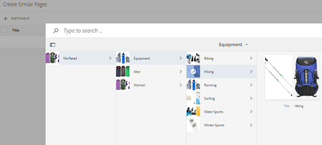

# Catalog Producer{#catalog-producer}

Scoprite come utilizzare Catalog Producer in  AEM Assets per generare cataloghi di prodotti utilizzando le risorse digitali.

Con Adobe Experience Manager (AEM) Assets Catalog Producer, potete creare cataloghi per i prodotti del vostro marchio utilizzando  modelli InDesign importati da un’applicazione  InDesign. Per importare  modelli di InDesign, integrate prima  AEM Assets con un server InDesign .

## Integrazione con  server InDesign {#integrating-with-indesign-server}

Come parte del processo di integrazione, configurate il flusso di lavoro **DAM Update Asset**, adatto per l&#39;integrazione con  InDesign. Inoltre, configurate un lavoratore proxy per il server InDesign . Per informazioni dettagliate, vedere [Integrazione  AEM Assets con  InDesign Server](/help/assets/indesign.md).

>[!NOTE]
>
>Potete generare modelli  InDesign da file  InDesign prima di importarli  AEM Assets. Per informazioni dettagliate, vedere [Utilizzo di file e modelli](https://helpx.adobe.com/indesign/using/files-templates.html).
>
>È possibile mappare gli elementi nei modelli di InDesign  ai tag XML. I tag mappati vengono visualizzati come proprietà quando mappate le proprietà del prodotto con le proprietà del modello in Catalog Producer. Per ulteriori informazioni sui tag XML nei file  InDesign, vedere [Assegnazione di tag ai contenuti per XML](https://helpx.adobe.com/indesign/using/tagging-content-xml.html).

>[!NOTE]
>
>Solo  file InDesign (.indd) vengono utilizzati come modelli. I file con estensione .indt non sono supportati.

## Creazione di un catalogo {#creating-a-catalog}

Catalog Producer utilizza i dati PIM (Product Information Management) per mappare le proprietà del prodotto con le proprietà XML visualizzate nel modello. Per creare un catalogo, effettuate le seguenti operazioni:

1. Dall&#39;interfaccia utente Risorse, tocca o fai clic sul **logo AEM**, quindi vai a **Risorse > Cataloghi**.
1. Nella pagina **Cataloghi**, tocca o fai clic su **Crea** dalla barra degli strumenti, quindi seleziona **Catalogo** dall&#39;elenco.
1. Nella pagina **Crea catalogo**, immettete un nome e una descrizione (facoltativo) per il catalogo e specificate eventuali tag. Potete anche aggiungere una miniatura al catalogo.

   

1. Toccate/fate clic su **Salva**. Una finestra di dialogo di conferma notifica che il catalogo viene creato. Toccate/fate clic su **Fine** per chiudere la finestra di dialogo.
1. Per aprire il catalogo creato, toccate o fate clic su di esso dalla pagina **Catalogs**.

   >[!NOTE]
   >
   >Per aprire il catalogo, potete anche toccare o fare clic su **Apri** nella finestra di dialogo di conferma indicata nel passaggio precedente.

1. Per aggiungere delle pagine al catalogo, toccate o fate clic su **Crea** nella barra degli strumenti, quindi scegliete l&#39;opzione **Nuova pagina**.
1. Dalla procedura guidata, selezionate un modello di InDesign  per la pagina. Quindi, toccate/fate clic su **Next**.
1. Specificate un nome per la pagina e una descrizione facoltativa. Specificate eventuali tag.
1. Toccate/fate clic su **Crea** nella barra degli strumenti. Quindi, toccate o fate clic su **Apri** dalla finestra di dialogo. Le proprietà del prodotto vengono visualizzate nel riquadro a sinistra. Le proprietà predefinite per il modello di InDesign  vengono visualizzate nel riquadro di destra.
1. Dal riquadro a sinistra, trascinate le proprietà del prodotto nelle proprietà del modello di InDesign  e create una mappatura tra di esse.

   Per visualizzare l&#39;aspetto della pagina in tempo reale, toccate o fate clic sulla scheda **Anteprima** nel riquadro a destra.

1. Per creare altre pagine, ripetete i passaggi da 6 a 9. Per creare pagine simili per altri prodotti, selezionate la pagina e toccate o fate clic sull&#39;icona **Crea pagine simili** nella barra degli strumenti.

   

   >[!NOTE]
   >
   >Potete creare solo pagine simili per prodotti con struttura simile.

   Toccate/fate clic sull&#39;icona Aggiungi, selezionate i prodotti dal selettore prodotti, quindi toccate/fate clic su **Seleziona** nella barra degli strumenti.

   

1. Dalla barra degli strumenti, fare clic o toccare **Crea**. Toccate/fate clic su **Fine** per chiudere la finestra di dialogo. Pagine simili sono incluse nel catalogo.
1. Per aggiungere un file di InDesign  esistente al catalogo, toccate o fate clic su **Crea** nella barra degli strumenti e scegliete l&#39;opzione **Aggiungi alla pagina esistente**.
1. Selezionate il file InDesign , quindi toccate o fate clic su **Aggiungi** nella barra degli strumenti. Quindi, toccate o fate clic su **OK** per chiudere la finestra di dialogo.

   Se i metadati dei prodotti a cui si fa riferimento nelle pagine del catalogo vengono modificati, le modifiche non vengono applicate automaticamente alle pagine del catalogo. Sulle immagini del prodotto presenti nelle pagine del catalogo di riferimento viene visualizzato un banner con l&#39;etichetta **Stale**, a indicare che i metadati per i prodotti di riferimento non sono aggiornati.

   

   Per fare in modo che le immagini del prodotto riflettano le ultime modifiche ai metadati, selezionate la pagina nella console Catalogo e toccate l&#39;icona **Aggiorna pagina** nella barra degli strumenti.

   

   >[!NOTE]
   >
   >Per modificare i metadati di un prodotto di riferimento, andate alla console Prodotti (**AEM Logo** > **Commerce** > **Prodotti**) e selezionate il prodotto. Quindi, toccate o fate clic sull&#39;icona **Visualizza proprietà** nella barra degli strumenti e modificate i metadati nella pagina Proprietà della risorsa.

1. Per ridisporre le pagine del catalogo, toccate o fate clic sull&#39;icona **Crea** nella barra degli strumenti, quindi scegliete **Unisci** dal menu. Nella procedura guidata, il carosello nella parte superiore consente di riordinare le pagine trascinandole. È inoltre possibile rimuovere delle pagine.

1. Toccate/fate clic su **Avanti**. Per aggiungere un file di InDesign  esistente come pagina di copertina, toccate o fate clic su **Sfoglia** accanto alla casella **Scegli pagina copertina** e specificate il percorso per il modello di copertina.
1. Toccate/fate clic su **Salva**, quindi toccate/fate clic su **Fine** per chiudere la finestra di dialogo di conferma.
Selezionando l&#39;opzione **Fine**, si apre una finestra di dialogo per selezionare se si desidera eseguire la rappresentazione .pdf.
   
formato pdfSe &#39;opzione Acrobat(PDF) è selezionata, viene creata una rappresentazione PDF in   **/jcr:content/** renditionoltre alla rappresentazione per indesign. Potete scaricare tutte le rappresentazioni selezionando la casella di controllo &quot;Rappresentazioni&quot; nella finestra di dialogo di download.

1. Per generare un&#39;anteprima per il catalogo creato, selezionatelo nella console **Catalogs**, quindi fate clic sull&#39;icona **Preview** nella barra degli strumenti.

   

   Rivedete le pagine del catalogo nell’anteprima. Toccate/fate clic su **Chiudi** per chiudere l&#39;anteprima.

