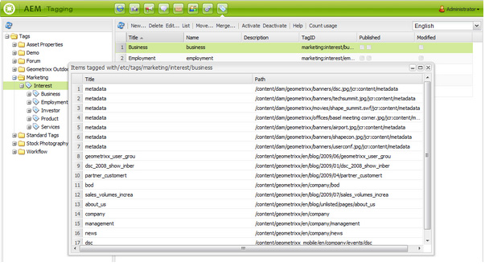

# Console classica per l’assegnazione di tag dell’interfaccia utente{#classic-ui-tagging-console}

Questa sezione è per la console di assegnazione tag dell’interfaccia classica.

>[!NOTE]
>
>Per informazioni dettagliate sulla console di assegnazione tag dell&#39;interfaccia utente ottimizzata per il tocco, vedere [Amministrazione dei tag](/help/sites-administering/tags.md#tagging-console).

Per accedere alla console di assegnazione tag dell’interfaccia classica:

* all’autore
* accedi con privilegi amministrativi
* passa alla console
ad esempio, [https://localhost:4502/tagging](https://localhost:4502/tagging)

## Creazione di tag e spazi dei nomi {#creating-tags-and-namespaces}

1. A seconda del livello da cui stai iniziando, puoi creare un tag o uno spazio dei nomi utilizzando **Nuovo**:

   Se selezioni **Tag** puoi creare uno spazio dei nomi:

   

   Se selezioni uno spazio dei nomi (ad esempio, **Demo**) puoi creare un tag all&#39;interno di tale spazio dei nomi:

   

1. In entrambi i casi immettere:

   * **Titolo**
(*Obbligatorio*) Titolo visualizzato per il tag. È possibile immettere qualsiasi carattere,
si consiglia di non utilizzare i seguenti caratteri speciali:

      * `colon (:)` - delimitatore spazio dei nomi
      * `forward slash (/)` - delimitatore tag secondario

     Questi caratteri non vengono visualizzati se vengono immessi.

   * **Nome**
(*Obbligatorio*) Nome del nodo per il tag.

   * **Descrizione**
(*Facoltativo*) Descrizione del tag.

   * seleziona **Crea**

## Modifica dei tag {#editing-tags}

1. Nel riquadro di destra selezionare il tag che si desidera modificare.
1. Fai clic su **Modifica**.
1. Puoi modificare il **Titolo** e la **Descrizione**.
1. Fai clic su **Salva** per chiudere la finestra di dialogo.

## Eliminazione dei tag {#deleting-tags}

1. Nel riquadro di destra selezionare il tag che si desidera eliminare.
1. Fai clic su **Elimina**.
1. Fare clic su **Sì** per chiudere la finestra di dialogo.

   Il tag non deve più essere elencato.

## Attivazione e disattivazione dei tag {#activating-and-deactivating-tags}

1. Nel riquadro di destra, seleziona lo spazio dei nomi o il tag che desideri attivare (pubblicare) o disattivare (annullare la pubblicazione).
1. Fai clic su **Attiva** o **Disattiva** come richiesto.

## Elenco: mostra dove si fa riferimento ai tag {#list-showing-where-tags-are-referenced}

**Elenco** apre una nuova finestra che mostra i percorsi di tutte le pagine che utilizzano il tag evidenziato:

## Spostamento dei tag {#moving-tags}

Per aiutare gli amministratori e gli sviluppatori di tag a ripulire la tassonomia o a rinominare un ID tag, è possibile spostare un tag in una nuova posizione:

1. Apri la console **Assegnazione tag**.
1. Selezionare il tag e fare clic su **Sposta...** nella barra degli strumenti superiore o nel menu di scelta rapida.
1. Nella finestra di dialogo **Sposta tag**, definisci:

   * **to**, il nodo di destinazione.
   * **Rinomina in**, il nome del nuovo nodo.

1. Fare clic su **Sposta**.

La finestra di dialogo **Sposta tag** ha il seguente aspetto:

>[!NOTE]
>
>Gli autori non devono spostare o rinominare un ID tag. Se necessario, gli autori devono solo [modificare i titoli dei tag](#editing-tags).

## Unione di tag {#merging-tags}

L’unione di tag può essere utilizzata quando una tassonomia presenta duplicati. Quando il tag A viene unito al tag B, tutte le pagine contrassegnate con il tag A vengono contrassegnate con il tag B e il tag A non è più disponibile per gli autori.

Per unire un tag in un altro:

1. Apri la console **Assegnazione tag**.
1. Seleziona il tag e fai clic su **Unisci...** nella barra degli strumenti superiore (o nel menu di scelta rapida).
1. Nella finestra di dialogo **Unisci tag**, definisci:

   * **in**, il nodo di destinazione.

1. Fare clic su **Unisci**.

La finestra di dialogo **Unisci tag** ha il seguente aspetto:

## Conteggio dell’utilizzo dei tag {#counting-usage-of-tags}

Per vedere quante volte un tag viene utilizzato:

1. Apri la console **Assegnazione tag**.
1. Fai clic su **Utilizzo conteggio** nella barra degli strumenti superiore: nella colonna Conteggio viene visualizzato il risultato.

## Gestione dei tag in lingue diverse {#managing-tags-in-different-languages}

La proprietà `title` facoltativa di un tag può essere tradotta in più lingue. Il tag `titles` può quindi essere visualizzato in base alla lingua utente o alla lingua della pagina.

### Definizione dei titoli di tag in più lingue {#defining-tag-titles-in-multiple-languages}

La procedura seguente illustra come tradurre `title`del tag **Animals** in inglese, tedesco e francese:

1. Passa alla console **Assegnazione tag**.
1. Modifica il tag **Animali** sotto **Tag** > **Foto d&#39;archivio**.
1. Aggiungi le traduzioni nelle seguenti lingue:

   * **Inglese**: animali
   * **Tedesco**: tiere
   * **Francese**: Animaux

1. Salva le modifiche.

La finestra di dialogo si presenta come segue:

La console Assegnazione tag utilizza l’impostazione della lingua utente, quindi per il tag Animal viene visualizzato &quot;Animaux&quot; per un utente che imposta la lingua sul francese nelle proprietà dell’utente.

Per aggiungere una nuova lingua alla finestra di dialogo, consulta la sezione [Aggiunta di una nuova lingua alla finestra di dialogo Modifica tag](/help/sites-developing/building.md#adding-a-new-language-to-the-edit-tag-dialog) nella sezione **Assegnazione di tag per sviluppatori**.

### Visualizzazione dei titoli di tag nelle proprietà della pagina in una lingua specificata {#displaying-tag-titles-in-page-properties-in-a-specified-language}

Per impostazione predefinita, il tag `titles` nelle proprietà della pagina viene visualizzato nella lingua della pagina. La finestra di dialogo del tag nelle proprietà della pagina contiene un campo di lingua che consente la visualizzazione del tag `titles` in una lingua diversa. Nella procedura seguente viene descritto come visualizzare il tag `titles` in francese:

1. Consulta la sezione precedente per aggiungere la traduzione in francese agli **Animali** sotto **Tag** > **Foto d&#39;archivio**.
1. Apri le proprietà della pagina **Prodotti** nel ramo inglese del sito **Geometrixx**.
1. Apri la finestra di dialogo **Tag/Parole chiave** (selezionando il menu a discesa a destra dell&#39;area di visualizzazione Tag/Parole chiave) e seleziona la lingua **Francese** dal menu a discesa nell&#39;angolo in basso a destra.
1. Scorri utilizzando le frecce sinistra-destra fino a selezionare la scheda **Foto Stock**

   Seleziona il tag **Animals** (**Animaux**) e fai clic all&#39;esterno della finestra di dialogo per chiuderlo e aggiungere il tag alle proprietà della pagina.

   

Per impostazione predefinita, la finestra di dialogo Proprietà pagina visualizza il tag `titles` in base alla lingua della pagina.

In generale, la lingua del tag viene presa dalla lingua della pagina se questa è disponibile. Quando il widget [`tag`](/help/sites-developing/building.md#tagging-on-the-client-side) viene utilizzato in altri casi (ad esempio nei moduli o nelle finestre di dialogo), il linguaggio dei tag dipende dal contesto.

>[!NOTE]
>
>Il tag cloud e le parole chiave meta nel componente pagina standard utilizzano il tag localizzato `titles` in base alla lingua della pagina, se disponibile.
