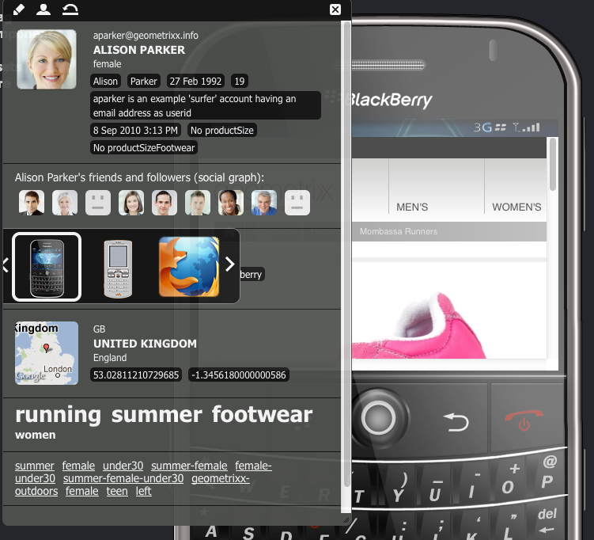
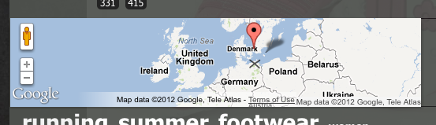
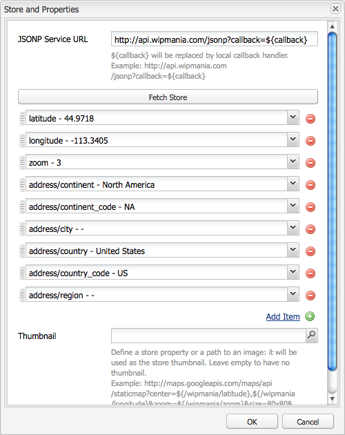

# ClientContext{#client-context}

>[!NOTE]
>
>ClientContext è stato sostituito da ContextHub. Per ulteriori dettagli, vedere la relativa documentazione [configuration]ch-configuring.md) e [sviluppatore](/help/sites-developing/contexthub.md).

ClientContext è un meccanismo che fornisce determinate informazioni sulla pagina corrente e sul visitatore. Può essere aperto utilizzando **Ctrl-Alt-c** (finestre) o **control-option-c** (Mac):

Nell&#39;ambiente [di pubblicazione e di creazione mostra informazioni](#propertiesavailableintheclientcontext) su:

* Il visitatore; a seconda dell’istanza, determinate informazioni vengono richieste o derivate.
* Tag pagina e il numero di volte in cui il visitatore corrente ha avuto accesso a tali tag (questo viene mostrato quando si sposta il mouse su un tag specifico).
* Informazioni sulla pagina.
* informazioni sul contesto tecnico; come l&#39;indirizzo IP, la risoluzione del browser e dello schermo.
* Eventuali segmenti attualmente risolti.

Le icone (disponibili solo nell’ambiente di authoring) consentono di configurare i dettagli del contesto client:

* ****
ModificaViene aperta una nuova pagina che consente di  [modificare, aggiungere o rimuovere una proprietà](#editingprofiledetails) di profilo.

* ****
LoadPotete  [selezionare un elenco di profili e caricare il ](#loading-a-new-user-profile) profilo da verificare.

* ****
ReimpostaPotete  [ripristinare il ](#resetting-the-profile-to-the-current-user) profilo su quello dell&#39;utente corrente.

## Componenti Client Context disponibili {#available-client-context-components}

ClientContext può mostrare le seguenti proprietà ([a seconda di ciò che è stato selezionato utilizzando Edit](#adding-a-property-component)):

**Surfer** InformationMostra le seguenti informazioni lato client:

* l&#39; **indirizzo IP**
* **parole** chiave utilizzate per il riferimento al motore di ricerca
* il **browser** utilizzato
* il **sistema operativo** (sistema operativo) utilizzato
* lo schermo **risoluzione**
* posizione **mouse X**
* posizione **mouse Y**

**Activity** StreamFornisce informazioni sull&#39;attività social dell&#39;utente su varie piattaforme; ad esempio, i forum AEM, i blog, le valutazioni ecc.

**** Campaign: consente agli autori di simulare un&#39;esperienza specifica per una campagna. Questo componente sostituisce la risoluzione normale della campagna e la selezione dell’esperienza per consentire il test di diverse mutazioni.

La risoluzione delle campagne è in genere basata sulla proprietà priority della campagna. L&#39;esperienza viene normalmente selezionata in base alla segmentazione.

**** CarrelloMostra le informazioni sul carrello della spesa incluse le voci di prodotto (titolo, quantità, prezzoFormattato, ecc.), le promozioni risolte (titolo, messaggio, ecc.) e voucher (codice, descrizione, ecc.).

L&#39;archivio delle sessioni del carrello informa anche il server delle modifiche alla promozione risolte (basate sulle modifiche alla segmentazione) tramite ClientContextCartServlet.

**Store generico:** un componente generico che visualizza il contenuto di uno store. Si tratta di una versione di livello inferiore del componente Proprietà store generiche.

Lo Store generico deve essere configurato con un renderer JS che visualizzerà i dati in modo personalizzato.

**Proprietà store generiche:** un componente generico che visualizza il contenuto di uno store. Si tratta di una versione di livello superiore del componente Store generico.

Il componente Proprietà store generiche include un renderer predefinito che elenca le proprietà configurate (insieme a una miniatura).

**** Geolocalizzazione: mostra la latitudine e la longitudine del client. Utilizza l’API di geolocalizzazione HTML5 per eseguire una query nel browser per la posizione corrente. Questo determina la visualizzazione di una finestra a comparsa per il visitatore, in cui il browser chiede se accetta di condividere la propria posizione.

Quando viene visualizzato in Context Cloud, il componente utilizza un&#39;API Google per visualizzare una mappa come miniatura. Il componente è soggetto ai limiti di utilizzo dell&#39;API Google [Limiti di utilizzo](https://developers.google.com/maps/documentation/staticmaps/intro#Limits).

>[!NOTE]
>
>In AEM 6.1, lo store Geolocalizzazione non fornisce più la funzione di geocodifica inversa. Di conseguenza, lo store Geolocation non recupera più i dettagli sulla posizione corrente, come il nome della città o il codice del paese. I segmenti che utilizzano questi dati dell&#39;archivio non funzioneranno correttamente. Lo store Geolocation contiene solo la latitudine e la longitudine di una posizione.

**JSONP** StoreComponente che visualizza il contenuto a seconda dell’installazione.

Lo standard JSONP è un complemento a JSON che consente di aggirare la stessa politica di origine (rendendo impossibile per un&#39;app Web comunicare con server che si trovano su un altro dominio). Consiste nel racchiudere l&#39;oggetto JSON in una chiamata di funzione per poterlo caricare come `<script>` dall&#39;altro dominio (che è un&#39;eccezione consentita per lo stesso criterio di origine).

JSONP Store è come qualsiasi altro store, ma carica informazioni provenienti da un altro dominio senza la necessità di avere un proxy per quelle informazioni sul dominio corrente. Vedere l&#39;esempio in [Memorizzazione dei dati in ClientContext tramite JSONP](/help/sites-administering/client-context.md#storing-data-in-client-context-via-jsonp).

>[!NOTE]
>
>JSONP Store non memorizza nella cache le informazioni contenute nel cookie, ma recupera tali dati in ogni caricamento di pagina.

**Profile** DataMostra le informazioni raccolte nel profilo utente. Ad esempio, sesso, età, indirizzo e-mail.

**Segmenti risoltiMostra i segmenti attualmente risolti (spesso dipendenti da altre informazioni visualizzate nel contesto client).** Questo è utile per configurare una campagna.

Ad esempio, se il mouse si trova attualmente sulla parte sinistra o destra della finestra. Questo segmento viene utilizzato principalmente per il test in quanto le modifiche possono essere visualizzate immediatamente.

**Grafico** social network: mostra il grafico sociale degli amici e dei follower dell’utente.

>[!NOTE]
>
>Attualmente questa è una funzione dimostrativa che si basa su dati preconfigurati impostati impostati impostati impostati sui nodi dei profili dei nostri utenti dimostrativi. Ad esempio, vedete:
>
>`/home/users/geometrixx/aparker@geometrixx.info/profile` =>, proprietà degli amici

**Tag** CloudMostra i tag impostati sulla pagina corrente e quelli raccolti durante la navigazione sul sito. Quando si sposta il mouse su un tag viene visualizzato il numero di volte in cui l&#39;utente corrente ha eseguito l&#39;accesso alle pagine che contengono tale tag specifico.

>[!NOTE]
I tag impostati sulle risorse DAM visualizzate sulle pagine visitate non verranno conteggiati.

**** Archivio tecnograficoQuesto componente dipende dall’installazione.

**** ViewedProductsConsente di tenere traccia dei prodotti visualizzati dall&#39;acquirente. È possibile richiedere il prodotto visualizzato più di recente o il prodotto visualizzato più di recente che non è già presente nel carrello.

Questo archivio sessioni non dispone di un componente ClientContext predefinito.

Per ulteriori informazioni, vedere [Client Context in Detail](/help/sites-developing/client-context.md).

>[!NOTE]
I dati pagina non sono più nel contesto client come componente predefinito. Se necessario, è possibile aggiungere questo componente modificando il contesto client, aggiungendo il componente **Proprietà store generiche**, quindi configurandolo per definire **Store** come `pagedata`.

## Modifica del profilo ClientContext {#changing-the-client-context-profile}

ClientContext consente di modificare in modo interattivo i dettagli:

* La modifica del profilo utilizzato nel contesto client consente di visualizzare le diverse esperienze che i vari utenti vedranno per la pagina corrente.
* Oltre a modificare il profilo utente, potete modificare alcuni dettagli del profilo per vedere in che modo l&#39;esperienza della pagina differisce in base a diverse condizioni.

### Caricamento di un nuovo profilo utente {#loading-a-new-user-profile}

Potete modificare il profilo tramite:

* [utilizzo dell&#39;icona di caricamento](#loading-a-new-visitor-profile-with-the-load-profile-icon)
* [utilizzo del cursore di selezione](#loadinganewvisitorprofilewiththeselectionslider)

Al termine è possibile [reimpostare il profilo](#resetting-the-profile-to-the-current-user).

#### Caricamento di un nuovo profilo visitatore con l&#39;icona Carica profilo {#loading-a-new-visitor-profile-with-the-load-profile-icon}

1. Fate clic sull’icona Carica profilo:

   

1. Viene aperta la finestra di dialogo, in cui potete selezionare il profilo da caricare:

   

1. Fare clic su **OK** per caricare.

#### Caricamento di un nuovo profilo utente con il cursore di selezione {#loading-a-new-user-profile-with-the-selection-slider}

Potete anche selezionare un profilo con il cursore di selezione:

1. Fate doppio clic sull&#39;icona che rappresenta l&#39;utente corrente. Il selettore si aprirà, utilizzate le frecce per navigare e visualizzare i profili disponibili:

   

1. Fate clic sul profilo da caricare. Una volta caricati i dettagli, fate clic all&#39;esterno del selettore per chiuderlo.

#### Reimpostazione del profilo per l&#39;utente corrente {#resetting-the-profile-to-the-current-user}

1. Utilizzate l&#39;icona Reimposta per riportare il profilo nel ClientContext a quello dell&#39;utente corrente:

   

### Modifica della piattaforma browser {#changing-the-browser-platform}

1. Fate doppio clic sull&#39;icona che rappresenta la piattaforma del browser. Il selettore si aprirà, utilizzare le frecce per navigare e vedere le piattaforme/browser disponibili:

   

1. Fate clic sul browser della piattaforma da caricare. Una volta caricati i dettagli, fate clic all&#39;esterno del selettore per chiuderlo.

### Modifica della geolocalizzazione {#changing-the-geolocation}

1. Fare doppio clic sull&#39;icona della geolocalizzazione. Viene aperta una mappa espansa in cui potete trascinare il marcatore in una nuova posizione:

   

1. Fate clic all&#39;esterno della mappa per chiuderla.

### Modifica della selezione dei tag {#changing-the-tag-selection}

1. Fate doppio clic sulla sezione Tag Cloud del ClientContext. Viene aperta la finestra di dialogo, in cui è possibile selezionare i tag:

   

1. Fare clic su OK per eseguire il caricamento nel ClientContext.

## Modifica del contesto client {#editing-the-client-context}

La modifica di un contesto client può essere utilizzata per impostare (o reimpostare) i valori di determinate proprietà, aggiungere una nuova proprietà o rimuoverne una non più necessaria.

### Modifica dei dettagli delle proprietà {#editing-property-details}

La modifica di un contesto client può essere utilizzata per impostare (o reimpostare) i valori di determinate proprietà. Questo consente di testare scenari specifici (particolarmente utile per [segmentazione](/help/sites-administering/campaign-segmentation.md) e [campagne](/help/sites-classic-ui-authoring/classic-personalization-campaigns.md)).

### Aggiunta di un componente proprietà {#adding-a-property-component}

Dopo aver aperto la **pagina di progettazione del ClientContext**, è anche possibile **aggiungere** una proprietà completamente nuova utilizzando i componenti disponibili (i componenti sono elencati sia nella barra laterale che nella finestra di dialogo **Inserisci nuovo componente** che viene aperta dopo un doppio clic sulla casella **Trascinate qui i componenti o le risorse**):

### Rimozione di un componente proprietà {#removing-a-property-component}

Dopo aver aperto la pagina di progettazione del ClientContext ****, è anche possibile **Rimuovere** una proprietà se non è più necessario. Sono incluse le proprietà fornite out-of-the-box; **Reset** li reimmetterà se sono stati rimossi.

## Memorizzazione dei dati in ClientContext tramite JSONP {#storing-data-in-client-context-via-jsonp}

Seguite questo esempio per utilizzare il componente archivio contesto JSONP Store per aggiungere dati esterni a ClientContext. Quindi, crea un segmento in base alle informazioni tratte da tali dati. Nell&#39;esempio viene utilizzato il servizio JSONP fornito da WIPmania.com. Il servizio restituisce informazioni sulla geolocalizzazione in base all&#39;indirizzo IP del client Web.

In questo esempio viene utilizzato il sito Web Geometrixx Outdoors di esempio per accedere a ClientContext e per verificare il segmento creato. Potete utilizzare un sito Web diverso a condizione che la pagina abbia attivato ClientContext. (Vedere [Aggiunta di contesto client a una pagina](/help/sites-developing/client-context.md#adding-client-context-to-a-page).)

### Aggiungere il componente JSONP Store {#add-the-jsonp-store-component}

Aggiungete il componente JSONP Store a ClientContext e utilizzatelo per recuperare e memorizzare le informazioni sulla geolocalizzazione sul client Web.

1. Aprite la home page inglese del sito Geometrixx Outdoors nell’istanza di creazione AEM. ([https://localhost:4502/content/geometrixx-outdoors/en.html](https://localhost:4502/content/geometrixx-outdoors/en.html)).
1. Per aprire ClientContext, premete Ctrl+Alt+C (Windows) o Ctrl+Opzione+C (Mac).
1. Fate clic sull&#39;icona di modifica nella parte superiore di ClientContext per aprire ClientContext Designer.

   

1. Trascinate il componente JSONP Store in ClientContext.

   

1. Fate doppio clic sul componente per aprire la finestra di dialogo di modifica.
1. Nella casella URL servizio JSONP, immettete il seguente URL, quindi fate clic su Recupera store:

   `https://api.wipmania.com/jsonp?callback=${callback}`

   Il componente chiama il servizio JSONP ed elenca tutte le proprietà contenute nei dati restituiti. Le proprietà incluse nell&#39;elenco sono quelle che saranno disponibili in ClientContext.

   

1. Fai clic su OK.
1. Tornate alla home page dei Geometrixx Outdoors e aggiornate la pagina. ClientContext ora include le informazioni dal componente JSONP Store.

   

### Creare il segmento {#create-the-segment}

Utilizzate i dati dell&#39;archivio sessioni creato con il componente Store JSONP. Il segmento utilizza la latitudine dall&#39;archivio delle sessioni e la data corrente per determinare se si tratta dell&#39;ora invernale nella posizione del cliente.

1. Aprite la console Strumenti nel browser Web (`https://localhost:4502/miscadmin#/etc`).
1. Nella struttura delle cartelle, fare clic sulla cartella Strumenti/Segmentazione, quindi fare clic su Nuovo > Nuova cartella. Specificate i seguenti valori di proprietà e fate clic su Crea:

   * Nome: mysegmenti
   * Titolo: Segmenti personali

1. Selezionate la cartella Segmenti personali e fate clic su Nuovo > Nuova pagina:

   1. Per il Titolo, digitate Inverno.
   1. Selezionare il modello Segmento.
   1. Fai clic su Crea.

1. Fare clic con il pulsante destro del mouse sul segmento Inverno e scegliere Apri.
1. Trascinate la proprietà Store generica sul contenitore AND predefinito.

   

1. Fate doppio clic sul componente per aprire la finestra di dialogo di modifica, specificate i seguenti valori delle proprietà, quindi fate clic su OK:

   * Store: wipmania
   * Nome proprietà: latitudine
   * Operatore: è maggiore di
   * Valore proprietà: 30

1. Trascinare il componente Script nello stesso contenitore AND e aprire la relativa finestra di dialogo di modifica. Aggiungete il seguente script e fate clic su OK:

   `3 < new Date().getMonth() < 12`

