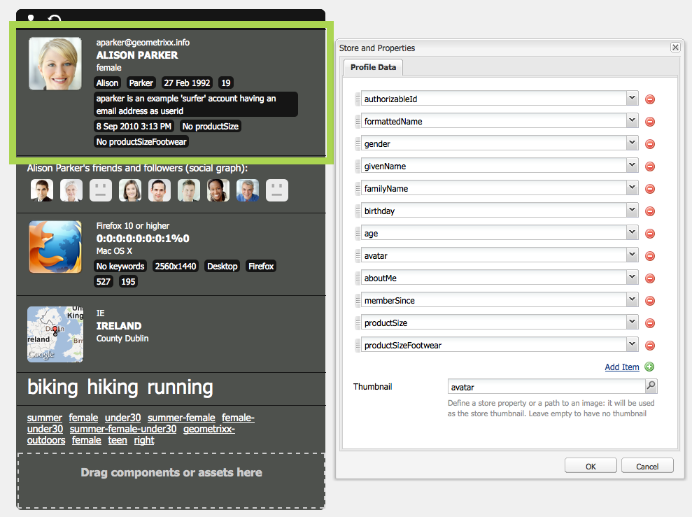

# ClientContext{#client-context}

>[!NOTE]
>
>ClientContext è stato sostituito da ContextHub. Per ulteriori dettagli, vedi le relative [configurazione](/help/sites-developing/ch-configuring.md) e [sviluppatore](/help/sites-developing/contexthub.md) documentazione.

ClientContext è un meccanismo che fornisce determinate informazioni sulla pagina corrente e sul visitatore. È possibile aprirlo utilizzando **Ctrl-Alt-C** (Windows) o **control-option-c** (Mac)

Sia nell’ambiente di pubblicazione che in quello di authoring vengono visualizzate informazioni su:

* Il visitatore; a seconda dell’istanza, alcune informazioni sono richieste o derivate.
* Tag pagina e il numero di accessi a tali tag da parte del visitatore corrente (visualizzato quando si sposta il mouse su un tag specifico).
* Informazioni pagina.
* Informazioni sull’ambiente tecnico, ad esempio l’indirizzo IP, il browser e la risoluzione dello schermo.
* Qualsiasi segmento attualmente risolto.

Le icone (disponibili solo nell’ambiente di authoring) consentono di configurare i dettagli del contesto client:

* **Modifica**
Viene visualizzata una nuova pagina [modificare, aggiungere o rimuovere una proprietà di profilo](#editingprofiledetails).

* **Carica**
È possibile [seleziona da un elenco di profili e carica il profilo](#loading-a-new-user-profile) vuoi testare.

* **Reimposta**
È possibile [reimpostare il profilo](#resetting-the-profile-to-the-current-user) a quella dell&#39;utente corrente.

## Componenti ClientContext disponibili {#available-client-context-components}

ClientContext può mostrare le seguenti proprietà ([a seconda di ciò che è stato selezionato utilizzando Modifica](#adding-a-property-component)):

**Informazioni surfista** Mostra le seguenti informazioni lato client:

* il **Indirizzo IP**
* **parole chiave** utilizzato per il riferimento al motore di ricerca
* il **browser** in uso
* il **SO** (sistema operativo) in uso
* lo schermo **risoluzione**
* il **mouse X** position
* il **mouse Y** position

**Flusso attività** Questo fornisce informazioni sull’attività sociale dell’utente su varie piattaforme, ad esempio forum, blog, valutazioni dell’AEM e così via.

**Campagna** Consente agli autori di simulare un’esperienza specifica per una campagna. Questo componente sostituisce la risoluzione normale della campagna e la selezione dell’esperienza per abilitare il test di varie permutazioni.

La risoluzione della campagna si basa di solito sulla proprietà di priorità della campagna. L’esperienza viene normalmente selezionata in base alla segmentazione.

**Carrello** Mostra le informazioni del carrello, inclusi gli articoli (titolo, quantità, prezzoFormattato e così via), le promozioni risolte (titolo, messaggio e così via) e i voucher (codice, descrizione e così via).

L’archivio sessioni del carrello notifica inoltre al server le modifiche di promozione risolte (in base alle modifiche di segmentazione) utilizzando ClientContextCartServlet.

**Store generico** È un componente generico che visualizza il contenuto di un archivio. Si tratta di una versione di livello inferiore del componente Proprietà store generico.

L’archivio generico deve essere configurato con un renderer JS che visualizzerà i dati in modo personalizzato.

**Proprietà store generico** È un componente generico che visualizza il contenuto di un archivio. Si tratta di una versione di livello superiore del componente Store generico.

Il componente Proprietà store generico include un renderer predefinito che elenca le proprietà configurate (insieme a una miniatura).

**Geolocalizzazione** Mostra la latitudine e la longitudine del client. Utilizza l’API di geolocalizzazione HTML5 per eseguire una query sul browser per la posizione corrente. Questo determina la visualizzazione di un pop-up al visitatore, dove il browser chiede se accetta di condividere la propria posizione.

Quando viene visualizzato in Context Cloud, il componente utilizza un’API Google per visualizzare una mappa come miniatura. Il componente è soggetto all’API Google [limiti di utilizzo](https://developers.google.com/maps/documentation/staticmaps/intro#Limits).

>[!NOTE]
>
>In AEM 6.1, l’archivio di geolocalizzazione non fornisce più la funzione di geocodifica inversa. Pertanto, l’archivio di geolocalizzazione non recupera più i dettagli sulla posizione corrente, ad esempio il nome della città o il codice del paese. I segmenti che utilizzano questi dati dell’archivio non funzioneranno correttamente. L’archivio di geolocalizzazione contiene solo la latitudine e la longitudine di una posizione.

**Store JSONP** Componente che visualizza il contenuto dipendente dall’installazione.

Lo standard JSONP è complementare a JSON e consente di aggirare la stessa policy di origine (rendendo impossibile a un’app web comunicare con server che si trovano su un altro dominio). Consiste nel wrapping dell’oggetto JSON in una chiamata di funzione per poterlo caricare come `<script>` dall’altro dominio (che è un’eccezione consentita allo stesso criterio di origine).

Il JSONP Store è come qualsiasi altro store, ma carica informazioni che provengono da un altro dominio senza la necessità di avere un proxy per quelle informazioni sul dominio corrente. Vedi l’esempio in [Memorizzazione dei dati in ClientContext tramite JSONP](/help/sites-administering/client-context.md#storing-data-in-client-context-via-jsonp).

>[!NOTE]
>
>L’archivio JSONP non memorizza nella cache le informazioni nel cookie, ma recupera tali dati a ogni caricamento di pagina.

**Dati profilo** Mostra le informazioni raccolte nel profilo utente. Ad esempio, genere, età, indirizzo e-mail, tra gli altri.

**Segmenti risolti** Mostra quali segmenti vengono attualmente risolti (spesso dipendenti da altre informazioni visualizzate nel contesto client). Ciò è di tuo interesse durante la configurazione di una campagna.

Ad esempio, se il mouse si trova sulla parte sinistra o destra della finestra. Questo segmento viene utilizzato principalmente per i test, in quanto le modifiche possono essere visualizzate immediatamente.

**Grafico social** Mostra il grafico social degli amici e dei follower dell’utente.

>[!NOTE]
>
>Attualmente questa è una funzione demo che si basa su un set di dati preconfigurato sui nodi di profilo dei nostri utenti dimostrativi. Ad esempio, consulta:
>
>`/home/users/geometrixx/aparker@geometrixx.info/profile` => proprietà amici

**Tag cloud** Mostra i tag impostati nella pagina corrente e quelli raccolti durante la navigazione nel sito. Lo spostamento del mouse su un tag indica il numero di accessi effettuati dall&#39;utente corrente alle pagine contenenti il tag specifico.

>[!NOTE]
>
I tag impostati sulle risorse DAM visualizzate nelle pagine visitate non verranno conteggiati.

**Store tecnografica** Questo componente dipende dall’installazione.

**ViewedProducts** Tiene traccia dei prodotti che l’acquirente ha visualizzato. Può essere richiesto il prodotto visualizzato più di recente o il prodotto visualizzato più di recente che non è già presente nel carrello.

Questo archivio sessione non dispone di un componente di contesto client predefinito.

Per ulteriori informazioni, consulta [ClientContext nei dettagli](/help/sites-developing/client-context.md).

>[!NOTE]
>
I dati di pagina non sono più nel contesto client come componente predefinito. Se necessario, puoi aggiungerlo modificando il contesto del client e aggiungendo **Proprietà store generico** , quindi configurando per definire il **Archivia** as `pagedata`.

## Modifica del profilo ClientContext {#changing-the-client-context-profile}

ClientContext consente di modificare i dettagli in modo interattivo:

* La modifica del profilo utilizzato in ClientContext consente di visualizzare le diverse esperienze che i vari utenti vedranno per la pagina corrente.
* Oltre a modificare il profilo utente, puoi modificare alcuni dettagli del profilo per vedere le differenze nell’esperienza della pagina in varie condizioni.

### Caricamento di un nuovo profilo utente {#loading-a-new-user-profile}

Puoi modificare il profilo in uno dei seguenti modi:

* [utilizzo dell’icona carica](#loading-a-new-visitor-profile-with-the-load-profile-icon)
* [utilizzo del cursore di selezione](#loadinganewvisitorprofilewiththeselectionslider)

Al termine, potrai [reimpostare il profilo](#resetting-the-profile-to-the-current-user).

#### Caricamento di un nuovo profilo visitatore con l’icona Carica profilo {#loading-a-new-visitor-profile-with-the-load-profile-icon}

1. Fai clic sull’icona Carica profilo:

   

1. Viene visualizzata la finestra di dialogo in cui puoi selezionare il profilo da caricare:

   

1. Clic **OK** da caricare.

#### Caricamento di un nuovo profilo utente con il cursore di selezione {#loading-a-new-user-profile-with-the-selection-slider}

Puoi anche selezionare un profilo con il cursore di selezione:

1. Fare doppio clic sull&#39;icona che rappresenta l&#39;utente corrente. Viene aperto il selettore, utilizza le frecce per navigare e visualizzare i profili disponibili:

   

1. Fai clic sul profilo da caricare. Una volta caricati i dettagli, fai clic all’esterno del selettore per chiuderlo.

#### Reimpostazione del profilo per l&#39;utente corrente {#resetting-the-profile-to-the-current-user}

1. Utilizza l’icona di reimpostazione per ripristinare il profilo nel contesto client su quello dell’utente corrente:

   

### Modifica della piattaforma del browser {#changing-the-browser-platform}

1. Fai doppio clic sull’icona che rappresenta la piattaforma del browser. Si apre il selettore, utilizza le frecce per navigare e vedi le piattaforme/browser disponibili:

   

1. Fai clic sul browser della piattaforma da caricare. Una volta caricati i dettagli, fai clic all’esterno del selettore per chiuderlo.

### Modifica della geolocalizzazione {#changing-the-geolocation}

1. Fai doppio clic sull’icona di geolocalizzazione. Viene visualizzata una mappa espansa, in cui potete trascinare il marcatore in una nuova posizione:

   

1. Fai clic all’esterno della mappa per chiuderla.

### Modifica della selezione dei tag {#changing-the-tag-selection}

1. Fai doppio clic sulla sezione Tag Cloud del Client Context. Viene visualizzata la finestra di dialogo in cui puoi selezionare i tag:

   

1. Fare clic su OK per caricare in ClientContext.

## Modifica di ClientContext {#editing-the-client-context}

La modifica di un contesto client può essere utilizzata per impostare (o reimpostare) i valori di determinate proprietà, aggiungere una nuova proprietà o rimuoverne una non più necessaria.

### Modifica dei dettagli delle proprietà {#editing-property-details}

La modifica di un contesto client può essere utilizzata per impostare (o reimpostare) i valori di determinate proprietà. Questo consente di testare scenari specifici (particolarmente utili per [segmentazione](/help/sites-administering/campaign-segmentation.md) e [campagne](/help/sites-classic-ui-authoring/classic-personalization-campaigns.md)).

### Aggiunta di un componente proprietà {#adding-a-property-component}

Dopo aver aperto il **Pagina progettazione ClientContext**, è inoltre possibile **Aggiungi** una proprietà completamente nuova che utilizza i componenti disponibili (i componenti sono elencati sia nella barra laterale che nella **Inserisci nuovo componente** che viene aperta dopo aver fatto doppio clic sul pulsante **Trascina qui i componenti o le risorse** box):

### Rimozione di un componente proprietà {#removing-a-property-component}

Dopo aver aperto il **Pagina progettazione ClientContext**, è inoltre possibile **Rimuovi** una proprietà se non è più richiesta. Sono incluse le proprietà fornite come predefinite; **Reimposta** ripristinerà questi elementi se sono stati rimossi.

## Memorizzazione dei dati in ClientContext tramite JSONP {#storing-data-in-client-context-via-jsonp}

Segui questo esempio per utilizzare il componente archivio di contesto JSONP Store per aggiungere dati esterni a ClientContext. Quindi, crea un segmento in base alle informazioni provenienti da tali dati. Nell&#39;esempio viene utilizzato il servizio JSONP fornito da WIPmania.com. Il servizio restituisce informazioni di geolocalizzazione in base all’indirizzo IP del client web.

In questo esempio viene utilizzato il sito Web di esempio Geometrixx Outdoors per accedere a ClientContext e per verificare il segmento creato. È possibile utilizzare un sito Web diverso purché la pagina abbia abilitato ClientContext. (vedere [Aggiunta di ClientContext a una pagina](/help/sites-developing/client-context.md#adding-client-context-to-a-page).)

### Aggiungi il componente JSONP Store {#add-the-jsonp-store-component}

Aggiungi il componente JSONP Store a ClientContext e utilizzalo per recuperare e memorizzare le informazioni di geolocalizzazione sul client web.

1. Apri la home page inglese del sito Geometrixx Outdoors nell’istanza di authoring AEM. ([https://localhost:4502/content/geometrixx-outdoors/en.html](https://localhost:4502/content/geometrixx-outdoors/en.html)).
1. Per aprire ClientContext, premere Ctrl-Alt-c (Windows) o Control-option-c (Mac).
1. Fare clic sull&#39;icona Modifica nella parte superiore di ClientContext per aprire ClientContext Designer.

   

1. Trascina il componente JSONP Store su ClientContext.

   

1. Fai doppio clic sul componente per aprire la finestra di dialogo per modifica.
1. Nella casella URL servizio JSONP, immetti il seguente URL, quindi fai clic su Recupera archivio:

   `https://api.wipmania.com/jsonp?callback=${callback}`

   Il componente chiama il servizio JSONP ed elenca tutte le proprietà contenute nei dati restituiti. Le proprietà incluse nell&#39;elenco sono quelle che saranno disponibili in ClientContext.

   

1. Fare clic su OK.
1. Torna alla home page dei Geometrixx Outdoors e aggiorna la pagina. ClientContext ora include le informazioni dal componente JSONP Store.

   

### Creare il segmento {#create-the-segment}

Utilizza i dati dell&#39;archivio sessione creato con il componente archivio JSONP. Il segmento utilizza la latitudine dell’archivio della sessione e la data corrente per determinare se si tratta dell’ora solare nella posizione del client.

1. Apri la console Strumenti nel browser Web (`https://localhost:4502/miscadmin#/etc`).
1. Nell’albero delle cartelle, fai clic sulla cartella Strumenti/Segmentazione, quindi fai clic su Nuovo > Nuova cartella. Specifica i seguenti valori delle proprietà, quindi fai clic su Crea:

   * Nome: miosegmenti
   * Titolo: I miei segmenti

1. Seleziona la cartella Segmenti personali e fai clic su Nuovo > Nuova pagina:

   1. Per Titolo, digitare Inverno.
   1. Seleziona il modello Segmento.
   1. Fai clic su Crea.

1. Fai clic con il pulsante destro del mouse sul segmento Inverno e fai clic su Apri.
1. Trascina la proprietà Store generico nel contenitore AND predefinito.

   

1. Fai doppio clic sul componente per aprire la finestra di dialogo per modifica, specifica i seguenti valori delle proprietà, quindi fai clic su OK:

   * Conservare: wipmania
   * Nome proprietà: latitude
   * Operatore: è maggiore di
   * Valore proprietà: 30

1. Trascina il componente Script nello stesso contenitore AND e apri la relativa finestra di dialogo per modifica. Aggiungi lo script seguente e fai clic su OK:

   `3 < new Date().getMonth() < 12`
