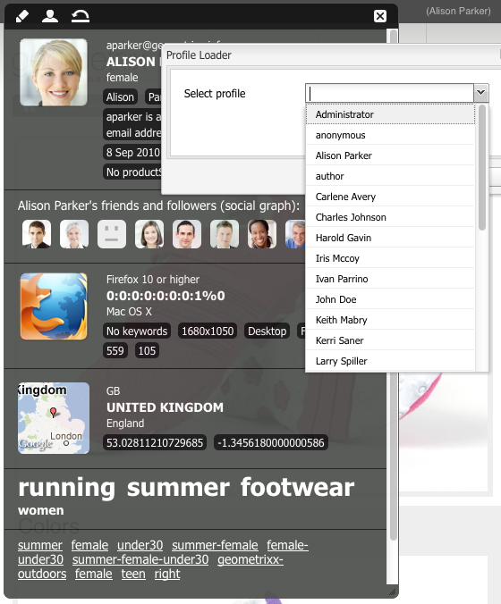

# ClientContext{#client-context}

>[!NOTE]
>
>Il contesto client è stato sostituito da ContextHub. Per ulteriori dettagli, consulta la [configurazione](/help/sites-developing/ch-configuring.md) e [sviluppatore](/help/sites-developing/contexthub.md) documentazione.

Il contesto client è un meccanismo che ti fornisce alcune informazioni sulla pagina corrente e sul visitatore. Può essere aperto utilizzando **Ctrl-Alt-C** (finestre) o **control-option-c** (Mac):

In entrambi i casi [ambiente di pubblicazione e authoring che mostra informazioni](#propertiesavailableintheclientcontext) informazioni:

* Il visitatore; a seconda dell&#39;istanza, determinate informazioni vengono richieste o derivate.
* Tag pagina e il numero di volte in cui il visitatore corrente ha effettuato l’accesso a tali tag (questo viene mostrato quando si sposta il mouse su un tag specifico) .
* Informazioni sulla pagina.
* informazioni sull&#39;ambiente tecnico; come indirizzo IP, browser e risoluzione dello schermo.
* Tutti i segmenti attualmente risolti.

Le icone (disponibili solo nell’ambiente di authoring) consentono di configurare i dettagli del contesto client:

* **Modifica**
Viene aperta una nuova pagina che consente di: [modificare, aggiungere o rimuovere una proprietà di profilo](#editingprofiledetails).

* **Load**
È possibile [seleziona da un elenco di profili e carica il profilo](#loading-a-new-user-profile) volete testare.

* **Reimposta**
È possibile [reimpostare il profilo](#resetting-the-profile-to-the-current-user) a quello dell&#39;utente corrente.

## Componenti Client Context disponibili {#available-client-context-components}

Il contesto client può mostrare le seguenti proprietà ([a seconda di ciò che è stato selezionato utilizzando Modifica](#adding-a-property-component)):

**Informazioni sul surfista** Mostra le seguenti informazioni lato client:

* la **Indirizzo IP**
* **parole chiave** utilizzato per il riferimento al motore di ricerca
* la **browser** utilizzato
* la **OS** (sistema operativo) utilizzato
* schermo **resolution**
* la **mouse X** posizione
* la **mouse Y** posizione

**Flusso di attività** Questo fornisce informazioni sull&#39;attività sociale dell&#39;utente su varie piattaforme; ad esempio, i forum AEM, i blog, le valutazioni, ecc.

**Campaign** Consente agli autori di simulare un’esperienza specifica per una campagna. Questo componente sostituisce la risoluzione normale della campagna e la selezione dell’esperienza per abilitare il test di varie permutazioni.

La risoluzione delle campagne si basa normalmente sulla proprietà priority della campagna. L’esperienza viene normalmente selezionata in base alla segmentazione.

**Carrello** Mostra informazioni sul carrello, incluse le voci di prodotto (titolo, quantità, prezzoFormattato, ecc.), le promozioni risolte (titolo, messaggio, ecc.) e buoni (codice, descrizione, ecc.).

L&#39;archivio delle sessioni del carrello notifica inoltre al server le modifiche risolte della promozione (basate sulle modifiche di segmentazione) utilizzando ClientContextCartServlet.

**Store generico** È un componente generico che visualizza il contenuto di un archivio. È una versione di livello inferiore del componente Proprietà store generiche.

L’archivio generico deve essere configurato con un renderer JS che visualizzerà i dati in modo personalizzato.

**Proprietà store generico** È un componente generico che visualizza il contenuto di un archivio. È una versione di livello superiore del componente Store generico.

Il componente Proprietà store generiche include un renderer predefinito che elenca le proprietà configurate (insieme a una miniatura).

**Geolocalizzazione** Mostra la latitudine e la longitudine del client. Utilizza l’API di geolocalizzazione di HTML5 per eseguire una query sul browser per la posizione corrente. Questo comporta la visualizzazione di un popup al visitatore, in cui il browser chiede se accetta di condividere la propria posizione.

Quando viene visualizzato in Context Cloud, il componente utilizza un’API Google per visualizzare una mappa come miniatura. Il componente è soggetto all’API di Google [limiti di utilizzo](https://developers.google.com/maps/documentation/staticmaps/intro#Limits).

>[!NOTE]
>
>In AEM 6.1, l&#39;archivio di geolocalizzazione non fornisce più la funzione di geocodifica inversa. Pertanto, l&#39;archivio di geolocalizzazione non recupera più i dettagli sulla posizione corrente, ad esempio il nome della città o il codice del paese. I segmenti che utilizzano questi dati dell’archivio non funzioneranno correttamente. L&#39;archivio di geolocalizzazione contiene solo la latitudine e la longitudine di una posizione.

**Store JSONP** Un componente che visualizza il contenuto dipendente dall’installazione.

Lo standard JSONP è un complemento a JSON che consente di eludere la stessa politica di origine (rendendo impossibile per un’app web comunicare con server che si trovano su un altro dominio). Consiste nel wrapping dell’oggetto JSON in una chiamata di funzione per poterlo caricare come `<script>` dall’altro dominio (che è un’eccezione consentita alla stessa regola di origine).

JSONP Store è come qualsiasi altro negozio, ma carica le informazioni provenienti da un altro dominio senza la necessità di avere un proxy per quelle informazioni sul dominio corrente. Vedi l&#39;esempio in [Memorizzazione dei dati nel contesto client tramite JSONP](/help/sites-administering/client-context.md#storing-data-in-client-context-via-jsonp).

>[!NOTE]
>
>JSONP Store non memorizza in cache le informazioni nel cookie, ma recupera tali dati a ogni caricamento di pagina.

**Dati profilo** Mostra le informazioni raccolte nel profilo utente. Ad esempio, genere, età, indirizzo e-mail, tra gli altri.

**Segmenti risolti** Mostra i segmenti attualmente risolti (spesso in base ad altre informazioni visualizzate nel contesto client). Questo è utile per configurare una campagna.

Ad esempio, se il mouse si trova attualmente sulla parte sinistra o destra della finestra. Questo segmento viene utilizzato principalmente per il test in quanto le modifiche possono essere visualizzate immediatamente.

**Grafico social** Mostra il grafico social degli amici e dei follower dell’utente.

>[!NOTE]
>
>Attualmente questa è una funzione dimostrativa che si basa su dati preconfigurati impostati impostati impostati sui nodi del profilo degli utenti dimostrativi. Ad esempio, vedi:
>
>`/home/users/geometrixx/aparker@geometrixx.info/profile` => Proprietà degli amici

**Tag Cloud** Mostra i tag impostati nella pagina corrente e quelli raccolti durante la navigazione nel sito. Lo spostamento del mouse su un tag mostra il numero di volte in cui l’utente corrente ha effettuato l’accesso alle pagine che contengono quel tag specifico.

>[!NOTE]
I tag impostati sulle risorse DAM visualizzate nelle pagine visitate non vengono conteggiati.

**Archivio tecnologico** Questo componente dipende dall’installazione.

**Prodotti visualizzati** Tiene traccia dei prodotti che l’acquirente ha visualizzato. Può essere richiesto per il prodotto visualizzato più di recente o per il prodotto visualizzato più di recente che non è già nel carrello.

Questo archivio sessioni non dispone di un componente ClientContext predefinito.

Per ulteriori informazioni, consulta [Contesto client in dettaglio](/help/sites-developing/client-context.md).

>[!NOTE]
I dati di pagina non sono più nel contesto client come componente predefinito. Se necessario, puoi aggiungere questa opzione modificando il contesto client, aggiungendo il **Proprietà store generico** , quindi configuralo per definire il **Store** come `pagedata`.

## Modifica del profilo di contesto client {#changing-the-client-context-profile}

ClientContext consente di modificare i dettagli in modo interattivo:

* La modifica del profilo utilizzato nel contesto client ti consente di vedere le diverse esperienze che i vari utenti vedranno per la pagina corrente.
* Oltre a modificare il profilo utente, puoi modificare alcuni dettagli del profilo per vedere in che modo l’esperienza della pagina differisce in varie condizioni.

### Caricamento di un nuovo profilo utente {#loading-a-new-user-profile}

Puoi modificare il profilo in uno dei seguenti modi:

* [utilizzo dell’icona di caricamento](#loading-a-new-visitor-profile-with-the-load-profile-icon)
* [utilizzo del cursore di selezione](#loadinganewvisitorprofilewiththeselectionslider)

Al termine, puoi [reimpostare il profilo](#resetting-the-profile-to-the-current-user).

#### Caricamento di un nuovo profilo visitatore con l’icona Carica profilo {#loading-a-new-visitor-profile-with-the-load-profile-icon}

1. Fai clic sull’icona Carica profilo :

   

1. Viene visualizzata la finestra di dialogo , in cui puoi selezionare il profilo da caricare:

   

1. Fai clic su **OK** da caricare.

#### Caricamento di un nuovo profilo utente con il cursore di selezione {#loading-a-new-user-profile-with-the-selection-slider}

Puoi anche selezionare un profilo con il cursore di selezione:

1. Fare doppio clic sull&#39;icona che rappresenta l&#39;utente corrente. Il selettore si aprirà, utilizza le frecce per navigare e visualizzare i profili disponibili:

   

1. Fai clic sul profilo da caricare. Una volta caricati i dettagli, fai clic all’esterno del selettore per chiuderlo.

#### Reimpostazione del profilo per l’utente corrente {#resetting-the-profile-to-the-current-user}

1. Utilizza l’icona di reimpostazione per restituire il profilo nel contesto client a quello dell’utente corrente:

   

### Modifica della piattaforma browser {#changing-the-browser-platform}

1. Fai doppio clic sull’icona che rappresenta la piattaforma del browser. Il selettore si aprirà, utilizza le frecce per navigare e visualizzare le piattaforme/browser disponibili:

   

1. Fai clic sul browser della piattaforma da caricare. Una volta caricati i dettagli, fai clic all’esterno del selettore per chiuderlo.

### Modifica della geolocalizzazione {#changing-the-geolocation}

1. Fare doppio clic sull&#39;icona di geolocalizzazione. Viene aperta una mappa espansa, in cui è possibile trascinare il marcatore in una nuova posizione:

   

1. Fai clic all’esterno della mappa per chiuderla.

### Modifica della selezione dei tag {#changing-the-tag-selection}

1. Fai doppio clic sulla sezione Tag Cloud del contesto client. Viene visualizzata la finestra di dialogo , in cui è possibile selezionare i tag:

   

1. Fai clic su OK per caricare nel contesto client.

## Modifica del contesto client {#editing-the-client-context}

La modifica di un contesto client può essere utilizzata per impostare (o reimpostare) i valori di alcune proprietà, aggiungere una nuova proprietà o rimuoverne una che non è più necessaria.

### Modifica dei dettagli delle proprietà {#editing-property-details}

La modifica di un contesto client può essere utilizzata per impostare (o reimpostare) i valori di alcune proprietà. Questo consente di testare scenari specifici (particolarmente utili per [segmentazione](/help/sites-administering/campaign-segmentation.md) e [campagne](/help/sites-classic-ui-authoring/classic-personalization-campaigns.md)).

### Aggiunta di un componente di proprietà {#adding-a-property-component}

Dopo aver aperto il **Pagina progettazione ClientContext**, è inoltre possibile **Aggiungi** una proprietà completamente nuova utilizzando i componenti disponibili (i componenti sono elencati sia nella barra laterale che nella **Inserisci nuovo componente** finestra di dialogo aperta dopo un doppio clic **Trascina qui i componenti o le risorse** box):

### Rimozione di un componente di proprietà {#removing-a-property-component}

Dopo aver aperto il **Pagina progettazione ClientContext**, è inoltre possibile **Rimuovi** una proprietà se non è più richiesta. Sono incluse le proprietà fornite out-of-the-box; **Reimposta** li reintrodurrà se sono stati rimossi.

## Memorizzazione dei dati nel contesto client tramite JSONP {#storing-data-in-client-context-via-jsonp}

Segui questo esempio per utilizzare il componente archivio contesti JSONP Store per aggiungere dati esterni al contesto client. Quindi, crea un segmento in base alle informazioni tratte da tali dati. Nell&#39;esempio viene utilizzato il servizio JSONP fornito da WIPmania.com. Il servizio restituisce informazioni di geolocalizzazione in base all&#39;indirizzo IP del client web.

In questo esempio viene utilizzato il sito web di esempio Geometrixx Outdoors per accedere al contesto client e per testare il segmento creato. È possibile utilizzare un sito web diverso purché la pagina abbia attivato il contesto client. (Vedi [Aggiunta di un contesto client a una pagina](/help/sites-developing/client-context.md#adding-client-context-to-a-page).)

### Aggiungere il componente JSONP Store {#add-the-jsonp-store-component}

Aggiungi il componente JSONP Store al ClientContext e utilizzalo per recuperare e memorizzare informazioni di geolocalizzazione sul client web.

1. Apri la home page inglese del sito Geometrixx Outdoors nell’istanza di authoring AEM. ([https://localhost:4502/content/geometrixx-outdoors/en.html](https://localhost:4502/content/geometrixx-outdoors/en.html)).
1. Per aprire Client Context, premere Ctrl-Alt-C (windows) o Control-option-c (Mac).
1. Fai clic sull’icona di modifica nella parte superiore del contesto client per aprire Client Context Designer.

   

1. Trascina il componente JSONP Store nel contesto client.

   

1. Fate doppio clic sul componente per aprire la finestra di dialogo di modifica.
1. Nella casella URL servizio JSONP, immetti l’URL seguente, quindi fai clic su Archivio di recupero:

   `https://api.wipmania.com/jsonp?callback=${callback}`

   Il componente chiama il servizio JSONP ed elenca tutte le proprietà contenute nei dati restituiti. Le proprietà incluse nell’elenco sono quelle che saranno disponibili nel contesto client.

   

1. Fai clic su OK.
1. Torna alla home page dei Geometrixx Outdoors e aggiorna la pagina. Il contesto client ora include le informazioni dal componente JSONP Store.

   

### Creare il segmento {#create-the-segment}

Utilizza i dati dell’archivio sessioni creati utilizzando il componente archivio JSONP. Il segmento utilizza la latitudine dall’archivio sessioni e la data corrente per determinare se si tratta dell’ora invernale nella posizione del client.

1. Apri la console Strumenti nel browser Web (`https://localhost:4502/miscadmin#/etc`).
1. Nella struttura delle cartelle fare clic sulla cartella Strumenti/Segmentazione e quindi su Nuovo > Nuova cartella. Specifica i seguenti valori di proprietà e fai clic su Crea:

   * Nome: mysegment
   * Titolo: Segmenti personali

1. Seleziona la cartella Segmenti personali e fai clic su Nuovo > Nuova pagina:

   1. Per Titolo, digita Inverno.
   1. Seleziona il modello Segmento .
   1. Fai clic su Crea.

1. Fai clic con il pulsante destro del mouse sul segmento Inverno e fai clic su Apri.
1. Trascina la proprietà store generica nel contenitore AND predefinito.

   

1. Fate doppio clic sul componente per aprire la finestra di dialogo di modifica, specificate i seguenti valori di proprietà, quindi fate clic su OK:

   * Archivio: wipmania
   * Nome proprietà: latitudine
   * Operatore: è maggiore di
   * Valore proprietà: 30

1. Trascina il componente Script nello stesso contenitore AND e apri la relativa finestra di dialogo di modifica. Aggiungi il seguente script e fai clic su OK:

   `3 < new Date().getMonth() < 12`
