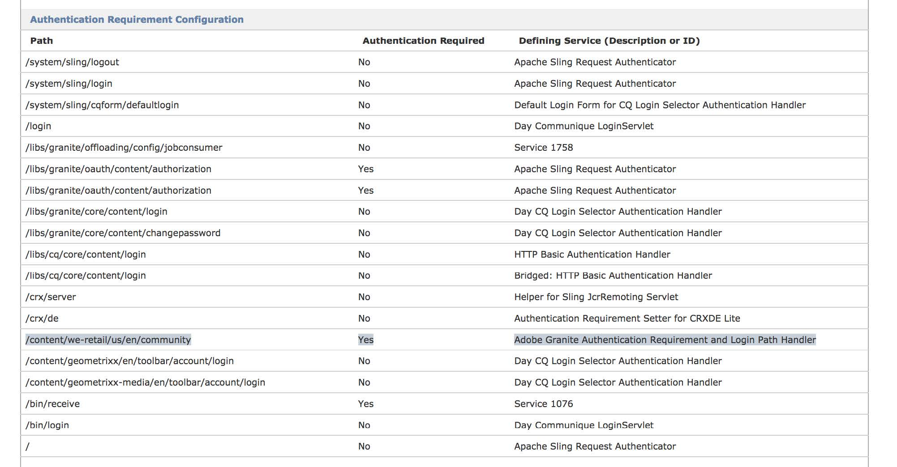

# Gruppi di utenti chiusi in AEM{#closed-user-groups-in-aem}

## Introduzione {#introduction}

A partire dal AEM 6.3, è disponibile una nuova implementazione del Gruppo utenti chiuso per risolvere i problemi di prestazioni, scalabilità e sicurezza presenti con l&#39;implementazione esistente.

>[!NOTE]
>
>Per semplicità, l&#39;abbreviazione CUG sarà utilizzata in tutta la documentazione.

L&#39;obiettivo della nuova implementazione è quello di coprire le funzionalità esistenti laddove necessario, affrontando al tempo stesso i problemi e le limitazioni di progettazione delle versioni precedenti. Il risultato è un nuovo progetto CUG con le seguenti caratteristiche:

* netta separazione degli elementi di autenticazione e di autorizzazione, che possono essere utilizzati singolarmente o in combinazione;
* modello di autorizzazione dedicato per riflettere l&#39;accesso in lettura limitata agli alberi CUG configurati senza interferire con altri requisiti di configurazione del controllo di accesso e di autorizzazione;
* separazione tra l’impostazione del controllo di accesso per l’accesso in lettura limitato, generalmente necessaria per le istanze di creazione, e la valutazione delle autorizzazioni, in genere richiesta solo al momento della pubblicazione;
* Modifica dell&#39;accesso in lettura limitato senza escalation di privilegi;
* Estensione specifica del tipo di nodo per contrassegnare i requisiti di autenticazione;
* Percorso di accesso facoltativo associato ai requisiti di autenticazione.

### Nuova implementazione del gruppo utenti personalizzato {#the-new-custom-user-group-implementation}

Un CUG noto nel contesto di AEM è costituito dai seguenti passaggi:

* Limita l’accesso in lettura alla struttura che deve essere protetta e consente la lettura solo delle entità elencate con una determinata istanza CUG o escluse dalla valutazione CUG. Questo è denominato elemento **di autorizzazione**.
* Applica l&#39;autenticazione su una struttura specifica e, facoltativamente, specifica una pagina di login dedicata per tale struttura ad albero che verrà successivamente esclusa. Questo è denominato elemento **autenticazione**.

La nuova implementazione è stata progettata per tracciare una linea tra gli elementi di autenticazione e di autorizzazione. A partire dal AEM 6.3, è possibile limitare l&#39;accesso in lettura senza aggiungere esplicitamente un requisito di autenticazione. Ad esempio, se una determinata istanza richiede l&#39;autenticazione totale o se una determinata struttura ad albero risiede già in una sottostruttura che richiede l&#39;autenticazione già.

Allo stesso modo, un determinato albero può essere contrassegnato con un requisito di autenticazione senza modificare l&#39;impostazione effettiva delle autorizzazioni. Le combinazioni e i risultati sono elencati nella sezione [Combining CUG Policies (Criteri CUG) e Authentication Requirements](/help/sites-administering/closed-user-groups.md#combining-cug-policies-and-the-authentication-requirement) (Requisiti di autenticazione).

## Panoramica {#overview}

### Autorizzazione: Limitazione dell&#39;accesso in lettura {#authorization-restricting-read-access}

La funzione chiave di un gruppo di utenti chiuso limita l’accesso in lettura a un determinato albero nell’archivio dei contenuti per tutti gli utenti tranne le entità selezionate. Invece di manipolare al volo il contenuto predefinito per il controllo dell’accesso, la nuova implementazione adotta un approccio diverso definendo un tipo dedicato di criteri per il controllo dell’accesso che rappresenta un CUG.

#### Criterio di controllo degli accessi per il CUG {#access-control-policy-for-cug}

Questo nuovo tipo di criterio ha le seguenti caratteristiche:

* politica di controllo degli accessi di tipo org.apache.jackrabbit.api.security.permissions.PrincipalSetPolicy (definita dall’API Apache Jackrabbit);
* PrincipalSetPolicy concede privilegi a un set modificabile di entità;
* I privilegi concessi e l&#39;ambito di applicazione della politica è un dettaglio di implementazione.

L’implementazione di PrincipalSetPolicy utilizzata per rappresentare i CUG definisce inoltre quanto segue:

* I criteri CUG consentono l&#39;accesso in lettura solo agli elementi JCR regolari (ad esempio, è escluso il contenuto del controllo di accesso);
* L’ambito è definito dal nodo controllato dall’accesso che contiene il criterio CUG;
* I criteri CUG possono essere nidificati, un CUG nidificato avvia un nuovo CUG senza ereditare il set di entità del CUG &#39;principale&#39;;
* L&#39;effetto del criterio, se è abilitata la valutazione, viene ereditato dall&#39;intera sottostruttura fino al successivo CUG nidificato.

Questi criteri CUG vengono distribuiti in un&#39;istanza AEM tramite un modulo di autorizzazione separato denominato oak-permissions-cug. Questo modulo è dotato di una propria gestione di controllo degli accessi e di una valutazione delle autorizzazioni. In altre parole, l&#39;impostazione predefinita AEM fornisce una configurazione del repository di contenuti Oak che combina più meccanismi di autorizzazione. Per ulteriori informazioni, vedere [questa pagina nella documentazione Apache Oak](https://jackrabbit.apache.org/oak/docs/security/authorization/composite.html).

In questa configurazione composita, un nuovo CUG non sostituisce il contenuto del controllo di accesso esistente collegato al nodo di destinazione, ma è progettato per essere un complemento che può essere rimosso anche in seguito senza influenzare il controllo di accesso originale, che per impostazione predefinita in AEM sarebbe un elenco di controllo di accesso.

A differenza della precedente implementazione, le nuove regole CUG vengono sempre riconosciute e trattate come contenuto di controllo dell’accesso. Ciò implica che vengono creati e modificati utilizzando l&#39;API di gestione del controllo degli accessi JCR. Per ulteriori informazioni, vedere la sezione [Gestione dei criteri CUG](#managing-cug-policies).

#### Autorizzazione di valutazione dei criteri CUG {#permission-evaluation-of-cug-policies}

Oltre a una gestione dedicata del controllo degli accessi per i CUG, il nuovo modello di autorizzazione consente di consentire la valutazione delle autorizzazioni in base alle proprie politiche. Questo consente di impostare i criteri CUG in un ambiente di staging e di abilitare la valutazione delle autorizzazioni effettive solo una volta replicate nell&#39;ambiente di produzione.

La valutazione delle autorizzazioni per le politiche CUG e l&#39;interazione con il modello di autorizzazione predefinito o con qualsiasi altro modello di autorizzazione aggiuntivo segue il modello progettato per meccanismi di autorizzazione multipli in Apache Jackrabbit Oak: viene concesso un determinato set di autorizzazioni se e solo se tutti i modelli concedono l’accesso. Per ulteriori informazioni, vedere [questa pagina](https://jackrabbit.apache.org/oak/docs/security/authorization/composite.html).

Le seguenti caratteristiche si applicano alla valutazione delle autorizzazioni associata al modello di autorizzazione progettato per gestire e valutare i criteri CUG:

* Gestisce solo le autorizzazioni di lettura per nodi e proprietà regolari, ma non legge il contenuto del controllo di accesso
* non gestisce le autorizzazioni di scrittura né alcun tipo di autorizzazioni necessarie per la modifica del contenuto JCR protetto (tra l&#39;altro, il controllo dell&#39;accesso, le informazioni sul tipo di nodo, il controllo delle versioni, il blocco o la gestione degli utenti); Tali autorizzazioni non sono interessate da un criterio CUG e non verranno valutate dal modello di autorizzazione associato. La concessione o meno di tali autorizzazioni dipende dagli altri modelli configurati nella configurazione della protezione.

L’effetto di un’unica politica CUG sulla valutazione delle autorizzazioni può essere riassunto come segue:

* L&#39;accesso in lettura è negato a tutti, ad eccezione degli oggetti contenenti entità o entità escluse elencate nel criterio;
* La politica ha effetto sul nodo controllato dell&#39;accesso che detiene il criterio e le sue proprietà;
* L&#39;effetto viene inoltre ereditato sotto la gerarchia, ovvero la struttura di elementi definita dal nodo controllato dall&#39;accesso;
* Tuttavia, non incide né sui fratelli né sugli antenati del nodo controllato dell&#39;accesso;
* L’ereditarietà di un determinato CUG si arresta in corrispondenza di un CUG nidificato.

#### Best practice   {#best-practices}

Per definire l’accesso in lettura limitato tramite i CUG è necessario tenere conto delle seguenti best practice:

* Decidere in modo consapevole se la necessità di un CUG consiste nella limitazione dell’accesso in lettura o in un requisito di autenticazione. In caso di quest&#39;ultimo o di necessità di entrambi, consultare la sezione relativa alle migliori pratiche per informazioni dettagliate sul requisito di autenticazione
* Creare un modello di minaccia per i dati o i contenuti che devono essere protetti per identificare i limiti delle minacce e ottenere un quadro chiaro sulla sensibilità dei dati e sui ruoli associati all&#39;accesso autorizzato
* Modella il contenuto del repository e i CUG tenendo presenti gli aspetti relativi all’autorizzazione generale e le best practice:

   * Ricorda che l&#39;autorizzazione di lettura sarà concessa solo se un determinato CUG e la valutazione di altri moduli distribuiti nella concessione di configurazione consentono a un determinato soggetto di leggere un dato elemento del repository
   * Evitare di creare CUG ridondanti in cui l&#39;accesso in lettura è già limitato da altri moduli di autorizzazione
   * L’eccessiva necessità di contenuti CUG nidificati potrebbe evidenziare problemi nella progettazione dei contenuti
   * L’eccessiva necessità di CUG (ad esempio, su ogni singola pagina) può indicare la necessità di un modello di autorizzazione personalizzato potenzialmente più adatto a soddisfare le specifiche esigenze di sicurezza dell’applicazione e del contenuto in questione.

* Limitare i percorsi supportati per i criteri CUG ad alcuni alberi nell&#39;archivio per consentire prestazioni ottimizzate. Ad esempio, consentono solo i CUG sotto il nodo /content come valore predefinito a partire da AEM 6.3.
* I criteri CUG sono progettati per garantire l&#39;accesso in lettura a un piccolo gruppo di entità. La necessità di un gran numero di entità può evidenziare problemi nella progettazione del contenuto o dell&#39;applicazione e dovrebbe essere riconsiderata.

### Autenticazione: Definizione del requisito di autenticazione {#authentication-defining-the-auth-requirement}

Le parti correlate all’autenticazione della funzione CUG consentono di contrassegnare gli alberi che richiedono l’autenticazione e, facoltativamente, di specificare una pagina di login dedicata. In conformità alla versione precedente, la nuova implementazione consente di contrassegnare gli alberi che richiedono l&#39;autenticazione nell&#39;archivio dei contenuti e di abilitare la sincronizzazione con il `Sling org.apache.sling.api.auth.Authenticator`responsabile dell&#39;applicazione finale del requisito e del reindirizzamento a una risorsa di accesso.

Questi requisiti vengono registrati con l&#39;Authenticator tramite un servizio OSGi che fornisce la proprietà di registrazione `sling.auth.requirements`. Tali proprietà vengono quindi utilizzate per estendere dinamicamente i requisiti di autenticazione. Per ulteriori informazioni, consultare la [documentazione Sling](https://sling.apache.org/apidocs/sling7/org/apache/sling/auth/core/AuthConstants.html#AUTH_REQUIREMENTS).

#### Definizione del requisito di autenticazione con un tipo di mixin dedicato {#defining-the-authentication-requirement-with-a-dedicated-mixin-type}

Per motivi di sicurezza, la nuova implementazione sostituisce l&#39;utilizzo di una proprietà JCR residua con un tipo di mixin dedicato denominato `granite:AuthenticationRequired`, che definisce una singola proprietà opzionale di tipo STRING per il percorso di login `granite:loginPath`. Solo le modifiche di contenuto relative a questo tipo di mixin porteranno all&#39;aggiornamento dei requisiti registrati con Apache Sling Authenticator. Le modifiche vengono monitorate in caso di modifiche temporanee persistenti e richiedono pertanto una chiamata `javax.jcr.Session.save()` per diventare effettiva.

Lo stesso vale per la proprietà `granite:loginPath`. Sarà rispettato solo se è definito dal tipo di mixin relativo ai requisiti di autenticazione. L&#39;aggiunta di una proprietà residua con questo stesso nome in un nodo JCR non strutturato non mostrerà l&#39;effetto desiderato e la proprietà verrà ignorata dal gestore responsabile dell&#39;aggiornamento della registrazione OSGi.

>[!NOTE]
>
>L&#39;impostazione della proprietà del percorso di login è facoltativa e necessaria solo se la struttura ad albero che richiede l&#39;autenticazione non può tornare alla pagina di login predefinita o ereditata in altro modo. Vedere la [Valutazione del percorso di accesso](/help/sites-administering/closed-user-groups.md#evaluation-of-login-path) di seguito.

#### Registrazione del requisito di autenticazione e del percorso di accesso con Sling Authenticator {#registering-the-authentication-requirement-and-login-path-with-the-sling-authenticator}

Poiché questo tipo di requisito di autenticazione deve essere limitato a determinate modalità di esecuzione e a un piccolo sottoinsieme di strutture presenti nell&#39;archivio dei contenuti, il tracciamento del tipo di mixin dei requisiti e delle proprietà del percorso di login è condizionale e associato a una configurazione corrispondente che definisce i percorsi supportati (vedere Opzioni di configurazione di seguito). Di conseguenza, solo le modifiche all&#39;interno dell&#39;ambito di questi percorsi supportati attiveranno un aggiornamento della registrazione OSGi, mentre altrove sia il tipo di mixin che la proprietà verranno ignorati.

L&#39;impostazione AEM predefinita ora utilizza questa configurazione consentendo di impostare il mixin in modalità di esecuzione dell&#39;autore, ma solo a partire dalla replica nell&#39;istanza di pubblicazione. Consultate [questa pagina](https://sling.apache.org/documentation/the-sling-engine/authentication/authenticationframework.html) per informazioni dettagliate su come Sling applica i requisiti di autenticazione.

Se si aggiunge il tipo di mixin `granite:AuthenticationRequired` all&#39;interno dei percorsi supportati configurati, la registrazione OSGi del gestore responsabile verrà aggiornata e conterrà una nuova voce aggiuntiva con la proprietà `sling.auth.requirements`. Se un determinato requisito di autenticazione specifica la proprietà opzionale `granite:loginPath`, il valore viene registrato anche con l&#39;Authenticator con il prefisso &#39;-&#39; per essere escluso dal requisito di autenticazione.

#### Valutazione e ereditarietà del requisito di autenticazione {#evaluation-and-inheritance-of-the-authentication-requirement}

I requisiti di autenticazione Apache Sling devono essere ereditati attraverso la gerarchia di pagine o nodi. I dettagli relativi all&#39;ereditarietà e alla valutazione dei requisiti di autenticazione, quali ordine e precedenza, sono considerati dettagli di implementazione e non saranno documentati in questo articolo.

#### Valutazione del percorso di login {#evaluation-of-login-path}

La valutazione del percorso di login e il reindirizzamento alla risorsa corrispondente al momento dell&#39;autenticazione è attualmente un dettaglio di implementazione del gestore di autenticazione del selettore di accesso Granite del Adobe  ( `com.day.cq.auth.impl.LoginSelectorHandler`), che è un gestore di autenticazione Apache Sling configurato con AEM per impostazione predefinita.

Quando si chiama `AuthenticationHandler.requestCredentials`, il gestore tenta di determinare la pagina di accesso per la mappatura a cui verrà reindirizzato l&#39;utente. Sono inclusi i seguenti passaggi:

* Distinguere tra la password scaduta e la necessità di un login regolare come motivo del reindirizzamento;
* In caso di login regolare, verifica se è possibile ottenere un percorso di login nel seguente ordine:

   * da LoginPathProvider come implementato dal nuovo `com.adobe.granite.auth.requirement.impl.RequirementService`,
   * dalla precedente implementazione CUG obsoleta,
   * dalle mappature pagina di login, come definito con la `LoginSelectorHandler`,
   * e infine, fallback alla pagina di accesso predefinita, come definito con il `LoginSelectorHandler`.

* Non appena un percorso di accesso valido è stato ottenuto tramite le chiamate sopra elencate, la richiesta dell&#39;utente verrà reindirizzata a tale pagina.

L&#39;obiettivo di questa documentazione è la valutazione del percorso di accesso come esposto dall&#39;interfaccia interna `LoginPathProvider`. L&#39;implementazione spedita a partire da AEM 6.3 si comporta come segue:

* La registrazione dei percorsi di login dipende dalla distinzione tra la password scaduta e la necessità di un login regolare come motivo del reindirizzamento
* In caso di login regolare, verifica se è possibile ottenere un percorso di login nel seguente ordine:

   * dal `LoginPathProvider` come implementato dal nuovo `com.adobe.granite.auth.requirement.impl.RequirementService`,
   * dalla precedente implementazione CUG obsoleta,
   * dalle mappature pagina di login come definito con la `LoginSelectorHandler`,
   * e infine fallback alla pagina di accesso predefinita come definito con il `LoginSelectorHandler`.

* Non appena un percorso di accesso valido è stato ottenuto tramite le chiamate sopra elencate, la richiesta dell&#39;utente verrà reindirizzata a tale pagina.

La `LoginPathProvider` implementata dal nuovo supporto dei requisiti di autenticazione in Granite espone i percorsi di login come definiti dalle proprietà `granite:loginPath`, che a loro volta sono definiti dal tipo di mixin come descritto sopra. La mappatura del percorso della risorsa contenente il percorso di login e il valore della proprietà stesso viene mantenuta in memoria e viene valutata per trovare un percorso di accesso adatto per altri nodi della gerarchia.

>[!NOTE]
>
>La valutazione viene eseguita solo per le richieste associate alle risorse che si trovano nei percorsi supportati configurati. Per ogni altra richiesta verranno valutati i metodi alternativi per determinare il percorso di accesso.

#### Best practice    {#best-practices-1}

Nella definizione dei requisiti di autenticazione è necessario tenere conto delle best practice seguenti:

* Evitate la nidificazione dei requisiti di autenticazione: l&#39;inserimento di un singolo marcatore di requisito di autenticazione all&#39;inizio di una struttura ad albero deve essere sufficiente ed è ereditato dall&#39;intera sottostruttura ad albero definita dal nodo di destinazione. Ulteriori requisiti di autenticazione all&#39;interno di tale albero dovrebbero essere considerati ridondanti e potrebbero causare problemi di prestazioni durante la valutazione dei requisiti di autenticazione all&#39;interno di Apache Sling. Con la separazione delle aree CUG relative all&#39;autorizzazione e all&#39;autenticazione è possibile limitare l&#39;accesso in lettura mediante CUG o altri tipi di criteri, applicando al contempo l&#39;autenticazione per l&#39;intero albero.
* Modello del contenuto dell&#39;archivio in modo che i requisiti di autenticazione si applichino all&#39;intero albero senza la necessità di escludere nuovamente le sottostrutture nidificate dai requisiti.
* Per evitare di specificare e registrare successivamente percorsi di login ridondanti:

   * affidarsi all&#39;ereditarietà ed evitare di definire percorsi di login nidificati,
   * non impostare il percorso di accesso facoltativo su un valore corrispondente al valore predefinito o ereditato,
   * gli sviluppatori di applicazioni devono identificare quali percorsi di login devono essere configurati nelle configurazioni globali del percorso di login (sia predefiniti che mappature) associate a `LoginSelectorHandler`.

## Rappresentazione nel repository {#representation-in-the-repository}

### Rappresentanza criteri CUG nell&#39;archivio {#cug-policy-representation-in-the-repository}

La documentazione di Oak illustra il modo in cui i nuovi criteri CUG si riflettono nel contenuto del repository. Per ulteriori informazioni, consultare [questa pagina](https://jackrabbit.apache.org/oak/docs/security/authorization/cug.html#Representation_in_the_Repository).

### Autenticazione richiesta nell&#39;archivio {#authentication-requirement-in-the-repository}

La necessità di un requisito di autenticazione separato si riflette nel contenuto del repository con un tipo di nodo mixin dedicato posizionato sul nodo di destinazione. Il tipo di mixin definisce una proprietà opzionale per specificare una pagina di login dedicata per la struttura ad albero definita dal nodo di destinazione.

La pagina associata al percorso di login può trovarsi all’interno o all’esterno della struttura ad albero. Sarà escluso dal requisito di autenticazione.

```java
[granite:AuthenticationRequired]
      mixin
      - granite:loginPath (STRING)
```

## Gestione dei criteri CUG e dei requisiti di autenticazione {#managing-cug-policies-and-authentication-requirement}

### Gestione dei criteri CUG {#managing-cug-policies}

Il nuovo tipo di criteri di controllo degli accessi per limitare l&#39;accesso in lettura per un CUG viene gestito tramite l&#39;API di gestione del controllo degli accessi JCR e segue i meccanismi descritti con la specifica [JCR 2.0](https://docs.adobe.com/content/docs/en/spec/jcr/2.0/16_Access_Control_Management.html).

#### Impostare un nuovo criterio CUG {#set-a-new-cug-policy}

Codice per applicare un nuovo criterio CUG a un nodo in cui non era già stato impostato un CUG. Tenere presente che `getApplicablePolicies` restituirà solo i nuovi criteri non impostati in precedenza. Alla fine la politica deve essere riscritta e i cambiamenti devono essere mantenuti.

```java
String path = [...] // needs to be a supported, absolute path

Principal toAdd1 = [...]
Principal toAdd2 = [...]
Principal toRemove = [...]

AccessControlManager acMgr = session.getAccessControlManager();
PrincipalSetPolicy cugPolicy = null;

AccessControlPolicyIterator it = acMgr.getApplicablePolicies(path);
while (it.hasNext()) {
        AccessControlPolicy policy = it.nextAccessControlPolicy();
        if (policy instanceof PrincipalSetPolicy) {
           cugPolicy = (PrincipalSetPolicy) policy;
           break;
        }
}

if (cugPolicy == null) {
   log.debug("no applicable policy"); // path not supported or no applicable policy (e.g.
                                                   // the policy was set before)
   return;
}

cugPolicy.addPrincipals(toAdd1, toAdd2);
cugPolicy.removePrincipals(toRemove));

acMgr.setPolicy(path, cugPolicy); // as of this step the policy can be edited/removed
session.save();
```

#### Modifica un criterio CUG esistente {#edit-an-existing-cug-policy}

Per modificare un criterio CUG esistente, sono necessari i seguenti passaggi. Nota: il criterio modificato deve essere riscritto e le modifiche devono essere mantenute utilizzando `javax.jcr.Session.save()`.

```java
String path = [...] // needs to be a supported, absolute path

Principal toAdd1 = [...]
Principal toAdd2 = [...]
Principal toRemove = [...]

AccessControlManager acMgr = session.getAccessControlManager();
PrincipalSetPolicy cugPolicy = null;

for (AccessControlPolicy policy : acMgr.getPolicies(path)) {
     if (policy instanceof PrincipalSetPolicy) {
        cugPolicy = (PrincipalSetPolicy) policy;
        break;
     }
}

if (cugPolicy == null) {
   log.debug("no policy to edit"); // path not supported or policy not set before
   return;
}

if (cugPolicy.addPrincipals(toAdd1, toAdd2) || cugPolicy.removePrincipals(toRemove)) {
   acMgr.setPolicy(path, cugPolicy);
   session.save();
} else {
     log.debug("cug policy not modified");
}
```

### Recupera criteri CUG effettivi {#retrieve-effective-cug-policies}

La gestione del controllo di accesso JCR definisce un metodo di sforzo migliore per recuperare i criteri che hanno effetto in un determinato percorso. Poiché la valutazione dei criteri CUG è condizionale e dipende dalla configurazione corrispondente da abilitare, la chiamata `getEffectivePolicies` è un metodo pratico per verificare se un determinato criterio CUG sta avendo effetto in una determinata installazione.

>[!NOTE]
>
>Notare la differenza tra `getEffectivePolicies` e l&#39;esempio di codice successivo che porta in alto la gerarchia per verificare se un determinato percorso fa già parte di un CUG esistente.

```java
String path = [...] // needs to be a supported, absolute path

AccessControlManager acMgr = session.getAccessControlManager();
PrincipalSetPolicy cugPolicy = null;

// log an debug message of all CUG policies that take effect at the given path
// there could be zero, one or many (creating nested CUGs is possible)
for (AccessControlPolicy policy : acMgr.getEffectivePolicies(path) {
     if (policy instanceof PrincipalSetPolicy) {
        String policyPath = "-";
        if (policy instanceof JackrabbitAccessControlPolicy) {
           policyPath = ((JackrabbitAccessControlPolicy) policy).getPath();
        }
        log.debug("Found effective CUG for path '{}' at '{}', path, policyPath);
     }
}
```

#### Recupera criteri CUG ereditati {#retrieve-inherited-cug-policies}

Ricerca di tutti i CUG nidificati definiti in un determinato percorso, indipendentemente dal fatto che abbiano o meno effetto. Per ulteriori informazioni, vedere la sezione [Opzioni di configurazione](/help/sites-administering/closed-user-groups.md#configuration-options).

```java
String path = [...]

List<AccessControlPolicy> cugPolicies = new ArrayList<AccessControlPolicy>();
while (isSupportedPath(path)) {
     for (AccessControlPolicy policy : acMgr.getPolicies(path)) {
         if (policy instanceof PrincipalSetPolicy) {
            cugPolicies.add(policy);
         }
      }
      path = (PathUtils.denotesRoot(path)) ? null : PathUtils.getAncestorPath(path, 1);
}
```

#### Gestione dei criteri CUG per Principe {#managing-cug-policies-by-pincipal}

Le estensioni definite da `JackrabbitAccessControlManager` che consentono di modificare i criteri di controllo dell&#39;accesso in base all&#39;entità non vengono implementate con la gestione del controllo dell&#39;accesso CUG, poiché per definizione una policy CUG interessa sempre tutte le entità: a quelli elencati con `PrincipalSetPolicy` viene concesso l&#39;accesso in lettura mentre a tutte le altre entità verrà impedito di leggere il contenuto nella struttura ad albero definita dal nodo di destinazione.

I metodi corrispondenti restituiscono sempre una matrice di criteri vuota, ma non generano eccezioni.

### Gestione del requisito di autenticazione {#managing-the-authentication-requirement}

La creazione, la modifica o la rimozione di nuovi requisiti di autenticazione viene ottenuta modificando il tipo di nodo effettivo del nodo di destinazione. La proprietà opzionale del percorso di login può quindi essere scritta utilizzando l&#39;API JCR regolare.

>[!NOTE]
>
>Le modifiche apportate a un determinato nodo di destinazione di cui sopra si rifletteranno sull&#39;Autenticatore Apache Sling solo se la `RequirementHandler` è stata configurata e la destinazione è contenuta nelle strutture ad albero definite dai percorsi supportati (vedere la sezione Opzioni di configurazione).
>
>Per ulteriori informazioni, vedere [Assegnazione di tipi di nodi misti](https://docs.adobe.com/docs/en/spec/jcr/2.0/10_Writing.html#10.10.3 Assegnazione di tipi di nodi misti) e [Aggiunta di nodi e impostazione di proprietà](https://docs.adobe.com/docs/en/spec/jcr/2.0/10_Writing.html#10.4 Aggiunta di nodi e impostazione di proprietà)

#### Aggiunta di un nuovo requisito di autenticazione {#adding-a-new-auth-requirement}

I passaggi per creare un nuovo requisito di autenticazione sono descritti di seguito. Il requisito verrà registrato con Apache Sling Authenticator solo se per la struttura ad albero contenente il nodo di destinazione è stato configurato `RequirementHandler`.

```java
Node targetNode = [...]

targetNode.addMixin("granite:AuthenticationRequired");
session.save();
```

#### Aggiungere un nuovo requisito di autenticazione con percorso di accesso {#add-a-new-auth-requirement-with-login-path}

Passaggi per creare un nuovo requisito di autenticazione, incluso un percorso di login. Nota: il requisito e l&#39;esclusione per il percorso di accesso saranno registrati con Apache Sling Authenticator solo se per la struttura ad albero contenente il nodo di destinazione è stato configurato `RequirementHandler`.

```java
Node targetNode = [...]
String loginPath = [...] // STRING property

Node targetNode = session.getNode(path);
targetNode.addMixin("granite:AuthenticationRequired");

targetNode.setProperty("granite:loginPath", loginPath);
session.save();
```

#### Modifica percorso di accesso esistente {#modify-an-existing-login-path}

I passaggi per modificare un percorso di login esistente sono descritti di seguito. La modifica verrà registrata con Apache Sling Authenticator solo se per la struttura ad albero contenente il nodo di destinazione è stato configurato `RequirementHandler`. Il valore del percorso di login precedente verrà rimosso dalla registrazione. Il requisito di autenticazione associato al nodo di destinazione non viene interessato da questa modifica.

```java
Node targetNode = [...]
String newLoginPath = [...] // STRING property

if (targetNode.isNodeType("granite:AuthenticationRequired")) {
   targetNode.setProperty("granite:loginPath", newLoginPath);
   session.save();
} else {
     log.debug("cannot modify login path property; mixin type missing");
}
```

#### Rimuovere un percorso di login esistente {#remove-an-existing-login-path}

Passaggi per rimuovere un percorso di login esistente. La voce del percorso di accesso non verrà registrata dall&#39;Autenticatore Apache Sling solo se per la struttura ad albero contenente il nodo di destinazione è stato configurato `RequirementHandler`. Il requisito di autenticazione associato al nodo di destinazione non viene interessato.

```java
Node targetNode = [...]

if (targetNode.hasProperty("granite:loginPath") &&
   targetNode.isNodeType("granite:AuthenticationRequired")) {
   targetNode.setProperty("granite:loginPath", null);
   session.save();
} else {
     log.debug("cannot remove login path property; mixin type missing");
}
```

Oppure, potete utilizzare il metodo seguente per raggiungere lo stesso scopo:

```java
String path = [...] // absolute path to target node

String propertyPath = PathUtils.concat(path, "granite:loginPath");
if (session.propertyExists(propertyPath)) {
    session.getProperty(propertyPath).remove();
    // or: session.removeItem(propertyPath);
    session.save();
}
```

#### Rimozione di un requisito di autenticazione {#remove-an-auth-requirement}

Procedura per rimuovere un requisito di autenticazione esistente. Il requisito verrà rimosso dalla registrazione dall&#39;Autenticatore Apache Sling solo se per la struttura ad albero contenente il nodo di destinazione è stato configurato `RequirementHandler`.

```java
Node targetNode = [...]
targetNode.removeMixin("granite:AuthenticationRequired");

session.save();
```

#### Recupera requisiti di autenticazione effettivi {#retrieve-effective-auth-requirements}

Non esiste un&#39;API pubblica dedicata per leggere tutti i requisiti di autenticazione effettivi registrati con Apache Sling Authenticator. Tuttavia, l&#39;elenco è esposto nella console di sistema in `https://<serveraddress>:<serverport>/system/console/slingauth` nella sezione &quot;**Configurazione del requisito di autenticazione**&quot;.

L&#39;immagine seguente mostra i requisiti di autenticazione di un&#39;istanza di pubblicazione AEM con contenuto demo. Il percorso evidenziato della pagina community illustra come un requisito aggiunto dall&#39;implementazione descritta in questo documento si riflette nell&#39;Autenticatore Apache Sling.

>[!NOTE]
>
>In questo esempio la proprietà del percorso di login facoltativo non è stata impostata. Di conseguenza, non è stata registrata alcuna seconda voce con l&#39;autenticatore.



#### Recuperare il percorso di login effettivo {#retrieve-the-effective-login-path}

Al momento non è disponibile alcuna API pubblica per recuperare il percorso di accesso che verrà attivato dopo l&#39;accesso anonimo a una risorsa che richiede l&#39;autenticazione. Consultate la sezione Valutazione del percorso di login per informazioni dettagliate sull’implementazione del metodo di recupero del percorso di login.

Tuttavia, a parte i percorsi di login definiti con questa funzione, esistono metodi alternativi per specificare il reindirizzamento al login, che devono essere presi in considerazione quando si progetta il modello di contenuto e i requisiti di autenticazione di una determinata installazione AEM.

#### Recupera il requisito di autenticazione ereditato {#retrieve-the-inherited-auth-requirement}

Come per il percorso di login, non esiste alcuna API pubblica per recuperare i requisiti di autenticazione ereditati definiti nel contenuto. L&#39;esempio seguente illustra come elencare tutti i requisiti di autenticazione definiti con una determinata gerarchia, indipendentemente dal fatto che abbiano o meno effetto. Per ulteriori informazioni, vedere [Opzioni di configurazione](/help/sites-administering/closed-user-groups.md#configuration-options).

>[!NOTE]
>
>Si consiglia di basarsi sul meccanismo di ereditarietà sia per i requisiti di autenticazione che per il percorso di accesso, evitando la creazione di requisiti di autenticazione nidificati.
>
>Per ulteriori informazioni, vedere [Valutazione e ereditarietà del requisito di autenticazione](#evaluation-and-inheritance-of-the-authentication-requirement), [Valutazione del percorso di accesso](#evaluation-of-login-path) e [Best Practices](#best-practices).

```java
String path = [...]
Node node = session.getNode(path);

Map<String, String> authRequirements = new ArrayList<String, String>();
while (isSupported(node)) {
     if (node.isNodeType("granite:AuthenticationRequired")) {
         String loginPath = (node.hasProperty("granite:loginPath") ?
                                     node.getProperty("granite:loginPath").getString() :
                                     "";
        authRequirements.put(node.getPath(), loginPath);
        node = node.getParent();
     }
}
```

### Combinazione di criteri CUG e requisito di autenticazione {#combining-cug-policies-and-the-authentication-requirement}

Nella tabella seguente sono elencate le combinazioni valide di criteri CUG e i requisiti di autenticazione in un&#39;istanza AEM con entrambi i moduli abilitati tramite la configurazione.

| **Autenticazione richiesta** | **Percorso di login** | **Accesso in lettura limitato** | **Effetto previsto** |
|---|---|---|---|
| Sì | Sì | Sì | Un determinato utente potrà visualizzare la struttura ad albero secondaria contrassegnata con il criterio CUG solo se la valutazione effettiva delle autorizzazioni consente l&#39;accesso. Un utente non autenticato verrà reindirizzato alla pagina di accesso specificata. |
| Sì | No | Sì | Un determinato utente potrà visualizzare la struttura ad albero secondaria contrassegnata con il criterio CUG solo se la valutazione effettiva delle autorizzazioni consente l&#39;accesso. Un utente non autenticato verrà reindirizzato a una pagina di login predefinita ereditata. |
| Sì | Sì | No | Un utente non autenticato verrà reindirizzato alla pagina di accesso specificata. Il fatto che sia consentito o meno visualizzare la struttura ad albero contrassegnata con i requisiti di autorizzazione dipende dalle autorizzazioni effettive dei singoli elementi contenuti nella sottostruttura. Nessun CUG dedicato che limita l&#39;accesso in lettura. |
| Sì | No | No | Un utente non autenticato verrà reindirizzato a una pagina di login predefinita ereditata. Il fatto che sia consentito o meno visualizzare la struttura ad albero contrassegnata con il requisito di autorizzazione dipende dalle autorizzazioni effettive dei singoli elementi contenuti nella sottostruttura. Nessun CUG dedicato che limita l&#39;accesso in lettura. |
| No | No | Sì | Un dato utente autenticato o non autenticato sarà in grado di visualizzare la struttura secondaria contrassegnata con i criteri CUG solo se la valutazione effettiva delle autorizzazioni consente l&#39;accesso. Un utente non autenticato verrà trattato allo stesso modo e non verrà reindirizzato all&#39;accesso. |

>[!NOTE]
>
>La combinazione di &#39;Autenticazione richiesta&#39; = No e &#39;Percorso di accesso&#39; = Sì non è elencata sopra, in quanto &#39;Percorso di accesso&#39; è un attributo facoltativo associato a un&#39;Autenticazione-Requisito. La specifica di una proprietà JCR con quel nome senza aggiungere il tipo di mixin di definizione non avrà alcun effetto e verrà ignorata dal gestore corrispondente.

## Componenti e configurazione OSGi {#osgi-components-and-configuration}

Queste sezioni forniscono una panoramica dei componenti OSGi e delle singole opzioni di configurazione introdotte con la nuova implementazione CUG.

Consulta anche la documentazione sulla mappatura CUG per una mappatura completa delle opzioni di configurazione tra la vecchia e la nuova implementazione.

### Autorizzazione: Configurazione {#authorization-setup-and-configuration}

Le nuove parti relative all&#39;autorizzazione sono contenute nel pacchetto **Oak CUG Authorization** ( `org.apache.jackrabbit.oak-authorization-cug`), che fa parte dell&#39;installazione predefinita AEM. Il bundle definisce un modello di autorizzazione separato che deve essere distribuito come ulteriore modo per gestire l&#39;accesso in lettura.

#### Impostazione dell&#39;autorizzazione CUG {#setting-up-cug-authorization}

La configurazione dell&#39;autorizzazione CUG è descritta in dettaglio nella [documentazione Apache pertinente](https://jackrabbit.apache.org/oak/docs/security/authorization/cug.html#pluggability). Per impostazione predefinita, AEM dispone dell&#39;autorizzazione CUG distribuita in tutte le modalità di esecuzione. Le istruzioni dettagliate possono essere utilizzate anche per disabilitare l’autorizzazione CUG nelle installazioni che richiedono un’autorizzazione diversa.

#### Configurazione del filtro referente {#configuring-the-referrer-filter}

È inoltre necessario configurare il [filtro Sling Referrer](/help/sites-administering/security-checklist.md#the-sling-referrer-filter) con tutti i nomi host che possono essere utilizzati per accedere ai AEM; ad esempio tramite CDN, Load Balancer ed altri.

Se il filtro di riferimento non è configurato, quando un utente tenta di accedere a un sito CUG vengono visualizzati degli errori simili a quelli riportati di seguito:

```shell
31.01.2017 13:49:42.321 *INFO* [qtp1263731568-346] org.apache.sling.security.impl.ReferrerFilter Rejected referrer header for POST request to /libs/granite/core/content/login.html/j_security_check : https://hostname/libs/granite/core/content/login.html?resource=%2Fcontent%2Fgeometrixx%2Fen%2Ftest-site%2Ftest-page.html&$$login$$=%24%24login%24%24&j_reason=unknown&j_reason_code=unknown
```

#### Caratteristiche dei componenti OSGi {#characteristics-of-osgi-components}

Sono stati introdotti due componenti OSGi per definire i requisiti di autenticazione e specificare percorsi di login dedicati:

* `org.apache.jackrabbit.oak.spi.security.authorization.cug.impl.CugConfiguration`
* `org.apache.jackrabbit.oak.spi.security.authorization.cug.impl.CugExcludeImpl`

**org.apache.jackrabbit.oak.spi.security.permissions.cug.impl.CugConfiguration**

<table>
 <tbody>
  <tr>
   <td>Etichetta</td>
   <td>Configurazione CUG Apache Jackrabbit Oak</td>
  </tr>
  <tr>
   <td>Descrizione</td>
   <td>Configurazione di autorizzazione dedicata alla configurazione e alla valutazione delle autorizzazioni CUG.</td>
  </tr>
  <tr>
   <td>Proprietà di configurazione</td>
   <td>
    <ul>
     <li><code>cugSupportedPaths</code></li>
     <li><code>cugEnabled</code></li>
     <li><code>configurationRanking</code></li>
    </ul> <p>Consultare anche <a href="#configuration-options">Opzioni di configurazione</a>.</p> </td>
  </tr>
  <tr>
   <td>Criteri di configurazione</td>
   <td><code>ConfigurationPolicy.REQUIRE</code></td>
  </tr>
  <tr>
   <td>Riferimenti</td>
   <td><code>CugExclude (ReferenceCardinality.OPTIONAL_UNARY)</code></td>
  </tr>
 </tbody>
</table>

**org.apache.jackrabbit.oak.spi.security.permissions.cug.impl.CugExcludeImpl**

<table>
 <tbody>
  <tr>
   <td>Etichetta</td>
   <td>Apache Jackrabbit Oak CUG Escludi elenco</td>
  </tr>
  <tr>
   <td>Descrizione</td>
   <td>Consente di escludere le entità con i nomi confusi dalla valutazione CUG.</td>
  </tr>
  <tr>
   <td>Proprietà di configurazione</td>
   <td>
    <ul>
     <li><code>principalNames</code></li>
    </ul> <p>Consultare anche la sezione Opzioni di configurazione di seguito.</p> </td>
  </tr>
  <tr>
   <td>Criteri di configurazione</td>
   <td><code>ConfigurationPolicy.REQUIRE</code></td>
  </tr>
  <tr>
   <td>Riferimenti</td>
   <td>NA</td>
  </tr>
 </tbody>
</table>

#### Opzioni di configurazione {#configuration-options}

Le opzioni di configurazione chiave sono:

* `cugSupportedPaths`: specificate le sottostrutture che possono contenere CUG. Nessun valore predefinito impostato
* `cugEnabled`: opzione di configurazione per abilitare la valutazione delle autorizzazioni per i criteri CUG correnti.

Le opzioni di configurazione disponibili associate al modulo di autorizzazione CUG sono elencate e descritte più dettagliatamente nella [Documentazione Apache Oak](https://jackrabbit.apache.org/oak/docs/security/authorization/cug.html#configuration).

#### Esclusione di entità dalla valutazione CUG {#excluding-principals-from-cug-evaluation}

L&#39;esenzione dei singoli principi dalla valutazione CUG è stata adottata dalla precedente attuazione. La nuova autorizzazione CUG copre questo problema con un&#39;interfaccia dedicata denominata CugExclude. Apache Jackrabbit Oak 1.4 è dotato di un&#39;implementazione predefinita che esclude un insieme fisso di entità e un&#39;implementazione estesa che consente di configurare i singoli nomi principali. Quest’ultimo è configurato in AEM istanze di pubblicazione.

L&#39;impostazione predefinita rispetto a AEM 6.3 impedisce che le seguenti entità siano interessate dai criteri CUG:

* entità amministrative (utente amministratore, gruppo amministratori)
* entità utente del servizio
* directory principale interna del repository

Per ulteriori informazioni, vedere la tabella nella sezione [Configurazione predefinita a partire da AEM 6.3](#default-configuration-since-aem) seguente.

L&#39;esclusione del gruppo &quot;amministratori&quot; può essere modificata o espansa nella console di sistema nella sezione di configurazione di **Apache Jackrabbit Oak CUG Exclude List**.

In alternativa, è possibile fornire e distribuire un&#39;implementazione personalizzata dell&#39;interfaccia CugExclude per regolare l&#39;insieme di entità escluse in caso di esigenze speciali. Per informazioni dettagliate e per un esempio di implementazione, consulta la documentazione relativa alla [pluggability CUG](https://jackrabbit.apache.org/oak/docs/security/authorization/cug.html#pluggability).

### Autenticazione: Configurazione {#authentication-setup-and-configuration}

Le nuove parti relative all&#39;autenticazione sono contenute nel pacchetto **Adobe Granite Authentication Handler** ( `com.adobe.granite.auth.authhandler` versione 5.6.48). Questo bundle fa parte dell&#39;installazione AEM predefinita.

Per impostare la sostituzione dei requisiti di autenticazione per il supporto CUG obsoleto, alcuni componenti OSGi devono essere presenti e attivi in una determinata installazione AEM. Per ulteriori dettagli, vedere **Caratteristiche dei componenti OSGi** di seguito.

>[!NOTE]
>
>A causa dell&#39;opzione di configurazione obbligatoria con RequirementHandler, le parti correlate all&#39;autenticazione saranno attive solo se la funzionalità è stata abilitata specificando un set di percorsi supportati. Con un’installazione AEM standard, la funzione è disattivata in modalità di esecuzione dell’autore e attivata per /content in modalità di esecuzione della pubblicazione.

**Caratteristiche dei componenti OSGi**

Sono stati introdotti i seguenti 2 componenti OSGi per definire i requisiti di autenticazione e specificare percorsi di login dedicati:

* `com.adobe.granite.auth.requirement.impl.RequirementService`
* `com.adobe.granite.auth.requirement.impl.DefaultRequirementHandler`

**com.adobe.granite.auth.requirements.impl.RequirementService**

<table>
 <tbody>
  <tr>
   <td>Etichetta</td>
   <td>-</td>
  </tr>
  <tr>
   <td>Descrizione</td>
   <td>Servizio OSGi dedicato per i requisiti di autenticazione che registra un osservatore per le modifiche dei contenuti che influiscono sui requisiti di autenticazione (attraverso il tipo di mixin <code>granite:AuthenticationRequirement</code>) e i percorsi di login con sono esposti al <code>LoginSelectorHandler</code>. </td>
  </tr>
  <tr>
   <td>Proprietà di configurazione</td>
   <td>-</td>
  </tr>
  <tr>
   <td>Criteri di configurazione</td>
   <td><code>ConfigurationPolicy.OPTIONAL</code></td>
  </tr>
  <tr>
   <td>Riferimenti</td>
   <td>
    <ul>
     <li><code>RequirementHandler (ReferenceCardinality.MANDATORY_UNARY)</code></li>
     <li><code>Executor (ReferenceCardinality.MANDATORY_UNARY)</code></li>
    </ul> </td>
  </tr>
 </tbody>
</table>

**com.adobe.granite.auth.requirements.impl.DefaultRequirementHandler**

| Etichetta |  Adobe requisito di autenticazione Granite e gestore del percorso di accesso |
|---|---|
| Descrizione | `RequirementHandler` implementazione che aggiorna i requisiti di autenticazione Apache Sling e la corrispondente esclusione per i percorsi di accesso associati. |
| Proprietà di configurazione | `supportedPaths` |
| Criteri di configurazione | `ConfigurationPolicy.REQUIRE` |
| Riferimenti | NA |

#### Opzioni di configurazione {#configuration-options-1}

Le parti correlate all’autenticazione della riscrittura CUG vengono fornite solo con un’unica opzione di configurazione associata al requisito di autenticazione granite del Adobe  e al gestore del percorso di accesso:

**&quot;Autenticazione richiesta e gestore percorso di login&quot;**

<table>
 <tbody>
  <tr>
   <td>Proprietà</td>
   <td>Tipo</td>
   <td>Valore predefinito</td>
   <td>Descrizione</td>
  </tr>
  <tr>
   <td><p>Etichetta = Percorsi supportati</p> <p>Name = 'supportedPaths'</p> </td>
   <td>Set&lt;String&gt;</td>
   <td>-</td>
   <td>Percorsi in cui i requisiti di autenticazione verranno rispettati da questo gestore. Lasciate disattivata questa configurazione se desiderate aggiungere il tipo di mixin <code>granite:AuthenticationRequirement</code> ai nodi senza doverli applicare (ad esempio, alle istanze dell'autore). Se mancante, la funzione è disattivata. </td>
  </tr>
 </tbody>
</table>

## Configurazione predefinita a partire da AEM 6.3 {#default-configuration-since-aem}

Per impostazione predefinita, le nuove installazioni di AEM utilizzeranno le nuove implementazioni sia per le parti relative all’autorizzazione che per l’autenticazione della funzione CUG. La vecchia implementazione &quot; Adobe di supporto per gruppo utenti chiuso (CUG)&quot; è stata rimossa e per impostazione predefinita verrà disattivata in tutte AEM installazioni. Le nuove implementazioni verranno invece abilitate come segue:

### Istanze autore {#author-instances}

| **&quot;Configurazione Apache Jackrabbit Oak CUG&quot;** | **Spiegazione** |
|---|---|
| Percorsi supportati `/content` | La gestione del controllo degli accessi per i criteri CUG è abilitata. |
| Valutazione CUG abilitata FALSE | La valutazione delle autorizzazioni è disabilitata. I criteri CUG non hanno effetto. |
| Classificazione | 200 | Consulta la documentazione Oak. |

>[!NOTE]
>
>Nelle istanze di authoring predefinite non è presente alcuna configurazione per **Apache Jackrabbit Oak CUG Exclude List** e **Adobe Granite Authentication Requirement and Login Path Handler**.

### Pubblica istanze {#publish-instances}

| **&quot;Configurazione Apache Jackrabbit Oak CUG&quot;** | **Spiegazione** |
|---|---|
| Percorsi supportati `/content` | La gestione del controllo degli accessi per i criteri CUG è abilitata sotto i percorsi configurati. |
| Valutazione CUG attivata TRUE | La valutazione delle autorizzazioni è abilitata sotto i percorsi configurati. I criteri CUG hanno effetto a partire da `Session.save()`. |
| Classificazione | 200 | Consulta la documentazione Oak. |

| **&quot;Apache Jackrabbit Oak CUG Exclude List&quot;** | **Spiegazione** |
|---|---|
| Amministratori dei nomi principali | Esclude l’entità amministratore dalla valutazione CUG. |

| **&quot; Adobe requisito di autenticazione granite e gestore percorso di login&quot;** | **Spiegazione** |
|---|---|
| Percorsi supportati `/content` | I requisiti di autenticazione definiti nell&#39;archivio mediante il tipo di mixin `granite:AuthenticationRequired` diventano effettivi al di sotto di `/content` al `Session.save()`. Sling Authenticator viene aggiornato. L&#39;aggiunta del tipo di mixin all&#39;esterno dei percorsi supportati viene ignorata. |

## Disattivazione dei requisiti di autorizzazione e autenticazione CUG {#disabling-cug-authorization-and-authentication-requirement}

La nuova implementazione può essere disabilitata nel caso in cui una determinata installazione non utilizzi CUG o utilizzi mezzi diversi per l’autenticazione e l’autorizzazione.

### Disattiva autorizzazione CUG {#disable-cug-authorization}

Per informazioni su come rimuovere il modello di autorizzazione CUG dalla configurazione dell&#39;autorizzazione composita, consultare la documentazione relativa alla [pluggability](https://jackrabbit.apache.org/oak/docs/security/authorization/cug.html#pluggability).

### Disabilitare il requisito di autenticazione {#disable-the-authentication-requirement}

Per disabilitare il supporto per il requisito di autenticazione come fornito dal modulo `granite.auth.authhandler`, è sufficiente rimuovere la configurazione associata a **Adobe requisiti di autenticazione granite e gestore del percorso di login**.

>[!NOTE]
>
>Tuttavia, la rimozione della configurazione non comporta l&#39;annullamento della registrazione del tipo di mixin, che era ancora applicabile ai nodi senza l&#39;entrata in vigore.

## Interazione con altri moduli {#interaction-with-other-modules}

### API Apache Jackrabbit {#apache-jackrabbit-api}

Al fine di riflettere il nuovo tipo di politica di controllo degli accessi utilizzata dal modello di autorizzazione CUG, l&#39;API definita da Apache Jackrabbit è stata estesa. Poiché la versione 2.11.0 del modulo `jackrabbit-api` definisce una nuova interfaccia denominata `org.apache.jackrabbit.api.security.authorization.PrincipalSetPolicy`, che si estende da `javax.jcr.security.AccessControlPolicy`.

### Apache Jackrabbit FileVault {#apache-jackrabbit-filevault}

Il meccanismo di importazione di Apache Jackrabbit FileVault è stato modificato per gestire le politiche di controllo degli accessi di tipo `PrincipalSetPolicy`.

### Distribuzione di contenuti Apache Sling {#apache-sling-content-distribution}

Vedere la sezione precedente [Apache Jackrabbit FileVault](/help/sites-administering/closed-user-groups.md#apache-jackrabbit-filevault).

### Replica granite  Adobe {#adobe-granite-replication}

Il modulo di replica è stato leggermente modificato per poter replicare i criteri CUG tra AEM istanze diverse:

* `DurboImportConfiguration.isImportAcl()` viene interpretato letteralmente e influenzerà solo l&#39;implementazione delle politiche di controllo dell&#39;accesso  `javax.jcr.security.AccessControlList`

* `DurboImportTransformer` rispetterà questa configurazione solo per gli ACL effettivi
* Altri criteri come `org.apache.jackrabbit.api.security.authorization.PrincipalSetPolicy` istanze create dal modello di autorizzazione CUG verranno sempre replicati e l&#39;opzione di configurazione `DurboImportConfiguration.isImportAcl`() verrà ignorata.

Esiste un limite alla replica delle politiche CUG. Se un determinato criterio CUG viene rimosso senza rimuovere il tipo di nodo del mixin corrispondente `rep:CugMixin,`, la rimozione non si riflette sulla replica. Questo problema è stato risolto rimuovendo sempre il mixin alla rimozione del criterio. La limitazione può tuttavia apparire se il tipo di mixin viene aggiunto manualmente.

### Gestore autenticazione granite  Adobe {#adobe-granite-authentication-handler}

Il gestore di autenticazione **Adobe Granite HTTP Header Authentication Handler** fornito con il pacchetto `com.adobe.granite.auth.authhandler` contiene un riferimento all&#39;interfaccia `CugSupport` definita dallo stesso modulo. Viene utilizzato per calcolare l&#39;area di autenticazione in determinate circostanze, tornando all&#39;area di autenticazione configurata con il gestore.

Questo è stato modificato per rendere opzionale il riferimento a `CugSupport` al fine di garantire la massima compatibilità con le versioni precedenti se una determinata configurazione decide di riabilitare l&#39;implementazione obsoleta. Le installazioni che utilizzano l&#39;implementazione non otterranno più l&#39;area di autenticazione estratta dall&#39;implementazione CUG, ma visualizzeranno sempre l&#39;area di autenticazione come definito con **Adobe Granite HTTP Header Authentication Handler**.

>[!NOTE]
>
>Per impostazione predefinita, il **Adobe Granite HTTP Header Authentication Handler** è configurato solo in modalità di esecuzione pubblica con l&#39;opzione &quot;Disattiva pagina di login&quot; ( `auth.http.nologin`) abilitata.

### AEM LiveCopy {#aem-livecopy}

La configurazione dei CUG in combinazione con LiveCopy è rappresentata nell’archivio tramite l’aggiunta di un nodo aggiuntivo e di una proprietà aggiuntiva, come segue:

* `/content/we-retail/us/en/blueprint/rep:cugPolicy`
* `/content/we-retail/us/en/LiveCopy@granite:loginPath`

Entrambi questi elementi vengono creati sotto il simbolo `cq:Page`. Con la progettazione corrente, MSM gestisce solo nodi e proprietà che si trovano sotto il nodo `cq:PageContent` (`jcr:content`).

Pertanto, non è possibile eseguire il rollback dei gruppi CUG da una blueprint a una Live Copy. Pianificate di conseguenza questo aspetto durante la configurazione di una Live Copy.

## Modifiche con la nuova implementazione CUG {#changes-with-the-new-cug-implementation}

Scopo di questa sezione è fornire una panoramica delle modifiche apportate alla funzione CUG e un confronto tra la vecchia e la nuova implementazione. Elenca le modifiche che influiscono sulla configurazione del supporto CUG e descrive come e da chi vengono gestiti i CUG nel contenuto del repository.

### Differenze nella configurazione e configurazione CUG {#differences-in-cug-setup-and-configuration}

Il componente OSGi obsoleto **Adobe Granite Closed User Group (CUG) Support** ( `com.day.cq.auth.impl.cug.CugSupportImpl`) è stato sostituito da nuovi componenti per poter gestire separatamente le parti relative all&#39;autorizzazione e all&#39;autenticazione della precedente funzionalità CUG.

## Differenze nella gestione dei CUG nel contenuto del repository {#differences-in-managing-cugs-in-the-repository-content}

Le sezioni seguenti descrivono le differenze tra la vecchia e la nuova implementazione dal punto di vista dell&#39;implementazione e della sicurezza. Mentre la nuova implementazione mira a fornire la stessa funzionalità, durante l’utilizzo del nuovo CUG è importante conoscere alcuni cambiamenti lievi.

### Differenze Relative All&#39;Autorizzazione {#differences-with-regards-to-authorization}

Le principali differenze dal punto di vista dell&#39;autorizzazione sono riassunte nell&#39;elenco seguente:

**Contenuto di controllo degli accessi dedicato per i CUG**

Nella precedente implementazione, il modello di autorizzazione predefinito è stato utilizzato per manipolare i criteri degli elenchi di controllo degli accessi al momento della pubblicazione, sostituendo eventuali ACE esistenti con la configurazione richiesta dal gruppo di utenti chiuso. Questo è stato attivato scrivendo proprietà JCR regolari e residue interpretate al momento della pubblicazione.

Con la nuova implementazione, la configurazione del controllo di accesso del modello di autorizzazione predefinito non viene modificata da alcun CUG creato, modificato o rimosso. Al contrario, un nuovo tipo di criterio denominato `PrincipalSetPolicy` viene applicato come contenuto di controllo di accesso aggiuntivo al nodo di destinazione. Questo criterio aggiuntivo si trova come elemento secondario del nodo di destinazione e, se presente, sarà di pari livello del nodo di criterio predefinito.

**Modifica dei criteri CUG in Gestione del controllo degli accessi**

Questo passaggio dalle proprietà JCR residue a una politica di controllo degli accessi dedicata ha un impatto sull&#39;autorizzazione necessaria per creare o modificare la parte di autorizzazione della funzione CUG. Poiché si tratta di una modifica per accedere ai contenuti di controllo, per poter essere scritti nella directory archivio sono necessari i privilegi di `jcr:readAccessControl` e `jcr:modifyAccessControl`. Pertanto, solo gli autori di contenuti autorizzati a modificare il contenuto del controllo di accesso di una pagina possono impostare o modificare tale contenuto. Ciò contrasta con la vecchia implementazione in cui la capacità di scrivere proprietà JCR regolari era sufficiente, con conseguente aumento dei privilegi.

**Nodo di destinazione definito dal criterio**

I criteri CUG devono essere creati nel nodo JCR che definisce la sottostruttura soggetta a accesso in lettura limitato. È probabile che si tratti di una pagina AEM nel caso in cui il CUG interesserà l’intero albero.

Tenere presente che l&#39;inserimento del criterio CUG solo nel nodo jcr:content situato sotto una determinata pagina limita l&#39;accesso al contenuto s.str di una determinata pagina, ma non ha effetto su alcuna pagina secondaria o di pari livello. Questo può essere un caso d&#39;uso valido ed è possibile ottenere con un editor repository che consente di applicare contenuto di accesso in grana fine. Tuttavia, contrasta con la precedente implementazione in cui l&#39;inserimento di una proprietà cq:cugEnabled nel nodo jcr:content era internamente mappato al nodo della pagina. Questa mappatura non viene più eseguita.

**Valutazione delle autorizzazioni con i criteri CUG**

Passando dal vecchio supporto CUG a un modello di autorizzazione aggiuntivo, cambia il modo in cui vengono valutate le autorizzazioni di lettura effettive. Come descritto nella [Documentazione Jackrabbit](https://jackrabbit.apache.org/oak/docs/security/authorization/composite.html), a un&#39;entità specificata consentita per visualizzare la `CUGcontent` sarà concesso l&#39;accesso in lettura solo se la valutazione delle autorizzazioni di tutti i modelli configurati nell&#39;archivio Oak concede l&#39;accesso in lettura.

In altre parole, per la valutazione delle autorizzazioni effettive, saranno prese in considerazione sia le voci `CUGPolicy` che le voci predefinite per il controllo dell&#39;accesso, e l&#39;accesso in lettura al contenuto CUG sarà concesso solo se è concesso da entrambi i tipi di criteri. In un&#39;installazione di pubblicazione AEM predefinita in cui l&#39;accesso in lettura alla struttura `/content` completa è consentito a tutti, l&#39;effetto dei criteri CUG sarà lo stesso della precedente implementazione.

**Valutazione su richiesta**

Il modello di autorizzazione CUG consente di attivare singolarmente la gestione del controllo degli accessi e la valutazione delle autorizzazioni:

* la gestione del controllo degli accessi è abilitata se il modulo dispone di uno o più percorsi supportati in cui è possibile creare i CUG
* la valutazione delle autorizzazioni è abilitata solo se l&#39;opzione **CUG Evaluation Enabled** è selezionata.

Nella nuova AEM di impostazione predefinita per i criteri CUG è abilitata solo con la modalità di esecuzione &quot;pubblica&quot;. Per ulteriori dettagli, vedere i dettagli sulla [configurazione predefinita a partire da AEM 6.3](#default-configuration-since-aem). Questo può essere verificato confrontando i criteri effettivi per un determinato percorso con i criteri memorizzati nel contenuto. I criteri effettivi verranno visualizzati solo se è abilitata la valutazione delle autorizzazioni per i CUG.

Come spiegato sopra, i criteri di controllo degli accessi CUG ora sono sempre memorizzati nel contenuto, ma la valutazione delle autorizzazioni effettive risultanti da tali criteri sarà applicata solo se **CUG Evaluation Enabled** è attivata nella console di sistema in Apache Jackrabbit Oak **Configurazione CUG.** Per impostazione predefinita, è abilitata solo in modalità di esecuzione &quot;Pubblica&quot;.

### Differenze Relative All&#39;Autenticazione {#differences-with-regards-to-authentication}

Le differenze per quanto riguarda l&#39;autenticazione sono descritte di seguito.

#### Tipo di mixin dedicato per il requisito di autenticazione {#dedicated-mixin-type-for-authentication-requirement}

Nella prima implementazione sia gli aspetti relativi all’autorizzazione che all’autenticazione di un CUG sono stati attivati da una singola proprietà JCR ( `cq:cugEnabled`). Per quanto riguarda l&#39;autenticazione, ciò ha portato a un elenco aggiornato di requisiti di autenticazione come memorizzato con l&#39;implementazione Apache Sling Authenticator. Con la nuova implementazione lo stesso risultato viene ottenuto contrassegnando il nodo di destinazione con un tipo di mixin dedicato ( `granite:AuthenticationRequired`).

#### Proprietà Per Escludere Il Percorso Di Login {#property-for-excluding-login-path}

Il tipo di mixin definisce una singola proprietà opzionale denominata `granite:loginPath`, che in pratica corrisponde alla proprietà `cq:cugLoginPage`. A differenza dell&#39;implementazione precedente, la proprietà del percorso di login sarà rispettata solo se il tipo di nodo dichiarato è il mixin indicato. L&#39;aggiunta di una proprietà con quel nome senza impostare il tipo di mixin non avrà alcun effetto e all&#39;autenticatore non verrà segnalato né un nuovo requisito né un&#39;esclusione per il percorso di accesso.

#### Privilegio per il requisito di autenticazione {#privilege-for-authentication-requirement}

Per aggiungere o rimuovere un tipo di mixin è necessario concedere il privilegio `jcr:nodeTypeManagement`. Nell&#39;implementazione precedente, il privilegio `jcr:modifyProperties` viene utilizzato per modificare la proprietà residua.

Per quanto riguarda `granite:loginPath`, lo stesso privilegio è necessario per aggiungere, modificare o rimuovere la proprietà.

#### Nodo di destinazione definito dal tipo di mixin {#target-node-defined-by-mixin-type}

I requisiti di autenticazione devono essere creati nel nodo JCR che definisce la sottostruttura ad albero da sottoporre a login imposto. È probabile che si tratti di una pagina AEM nel caso in cui il CUG influisca sull’intero albero e l’interfaccia utente per la nuova implementazione aggiungerà di conseguenza il tipo di mixin per i requisiti di autenticazione nel nodo di pagina.

Posizionando il criterio CUG solo nel nodo jcr:content situato sotto una determinata pagina, l&#39;accesso al contenuto sarà limitato ma non interesserà né il nodo della pagina né le pagine figlie.

Questo potrebbe essere uno scenario valido ed è possibile con un editor repository che consente di posizionare il mixin a qualsiasi nodo. Tuttavia, il comportamento contrasta con la precedente implementazione, in cui l&#39;inserimento di una proprietà cq:cugEnabled o cq:cugLoginPage nel nodo jcr:content veniva ricollegato internamente in ultima istanza al nodo della pagina. Questa mappatura non viene più eseguita.

#### Percorsi supportati configurati {#configured-supported-paths}

Sia il tipo di mixin `granite:AuthenticationRequired` che la proprietà granite:loginPath saranno rispettati solo all&#39;interno dell&#39;ambito definito dall&#39;insieme di **Paths** supportati disponibili con il **Adobe Granite Authentication Requirements and Login Path Handler**. Se non è stato specificato alcun percorso, la funzione di autenticazione richiesta è disabilitata completamente. In questo caso il tipo di mixin o la proprietà hanno effetto quando vengono aggiunti o impostati su un determinato nodo JCR.

### Mapping di contenuti JCR, servizi OSGi e configurazioni {#mapping-of-jcr-content-osgi-services-and-configurations}

Il documento seguente fornisce una mappatura completa dei servizi OSGi, delle configurazioni e del contenuto del repository tra la vecchia e la nuova implementazione.

Mapping CUG a partire da AEM 6.3

[Ottieni file](assets/cug-mapping.pdf)

## Aggiornamento CUG {#upgrade-cug}

### Installazioni esistenti utilizzando il CUG obsoleto {#existing-installations-using-the-deprecated-cug}

La precedente implementazione del supporto CUG è stata rimossa e verrà rimossa per le versioni future. È consigliabile passare alle nuove implementazioni quando si esegue l&#39;aggiornamento da versioni precedenti alla AEM 6.3.

Per l’installazione AEM aggiornata, è importante garantire che sia abilitata una sola implementazione CUG. La combinazione del nuovo e vecchio supporto CUG obsoleto non viene testata e può causare un comportamento indesiderato:

* collisioni in Sling Authenticator per quanto riguarda i requisiti di autenticazione
* accesso in lettura negato quando l&#39;impostazione ACL associata al vecchio CUG è in conflitto con un nuovo criterio CUG.

### Migrazione di contenuto CUG esistente {#migrating-existing-cug-content}

 Adobe fornisce uno strumento per la migrazione alla nuova implementazione CUG. Per utilizzarlo, effettuare le seguenti operazioni:

1. Passate a `https://<serveraddress>:<serverport>/system/console/cug-migration` per accedere allo strumento.
1. Immettere il percorso principale per il quale si desidera controllare i CUG e premere il tasto **Esegui esecuzione a secco**. Verranno analizzati i CUG idonei alla conversione nella posizione selezionata.
1. Dopo aver controllato i risultati, premere il tasto **Esegui migrazione** per passare alla nuova implementazione.

>[!NOTE]
>
>In caso di problemi, è possibile impostare un logger specifico a livello **DEBUG** su `com.day.cq.auth.impl.cug` per ottenere l&#39;output dello strumento di migrazione. Per ulteriori informazioni, vedere [Registrazione](/help/sites-deploying/configure-logging.md).

