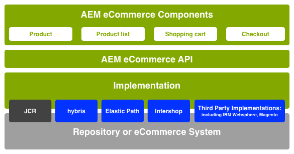
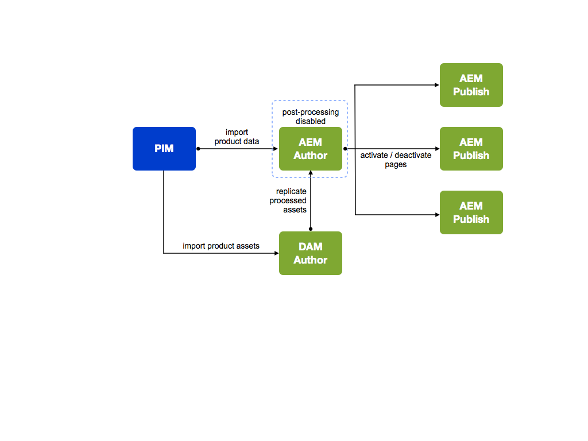
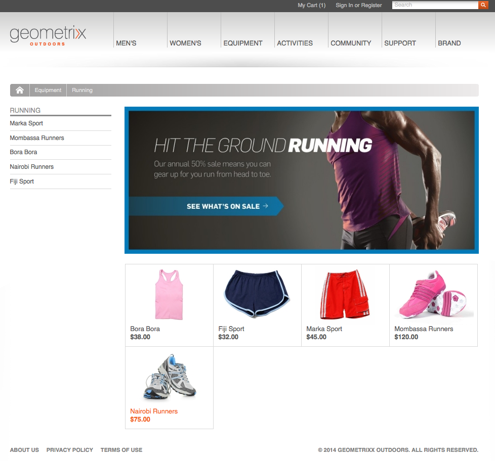

# Concetti {#concepts}

Il quadro di integrazione fornisce meccanismi e componenti per:

* connessione a un motore eCommerce
* trascinamento dei dati in AEM
* visualizzazione di tali dati e raccolta delle risposte dell&#39;acquirente
* restituzione dettagli transazione
* cercare i dati di entrambi i sistemi

Ciò significa che:

* Gli acquirenti possono registrarsi e fare acquisti senza aspettare.
* Le variazioni di prezzo saranno viste dagli acquirenti senza ritardo.
* I prodotti possono essere aggiunti secondo necessità.

>[!NOTE]
>
>Il framework eCommerce può essere utilizzato con:
>
>* [Magento](https://www.adobe.io/apis/experiencecloud/commerce-integration-framework/integrations.html#!AdobeDocs/commerce-cif-documentation/master/integrations/02-AEM-Magento.md)
>* [COMMERCE CLOUD SAP](/help/sites-administering/sap-commerce-cloud.md)
>* [Commerce Cloud Salesforce](https://github.com/adobe/commerce-salesforce)

>

>[!CAUTION]
>
>Il [framework di integrazione eCommerce](https://www.adobe.com/solutions/web-experience-management/commerce.html) è un componente aggiuntivo AEM.
>
>Il rappresentante commerciale sarà in grado di fornire informazioni complete, in base al motore appropriato.

>[!CAUTION]
>
>Il framework fornisce i requisiti di base per il proprio progetto.
>
>Per adattare il framework alle proprie specifiche, è sempre necessario un certo lavoro di sviluppo.

>[!CAUTION]
>
>L&#39;installazione standard AEM include l&#39;implementazione generica AEM eCommerce (JCR).
>
>Al momento è destinato a scopi dimostrativi, o come base per un&#39;implementazione personalizzata in base alle tue esigenze.

Per ottimizzare il funzionamento, sia AEM che il motore di eCommerce si concentrano sulla propria area di competenza. Le informazioni sono trasferite tra i due in tempo reale; ad esempio:

* AEM:

   * Richiesta:

      * Informazioni sul prodotto dal motore eCommerce.
   * Fornisci:

      * Visualizzazioni utente per informazioni sui prodotti, carrello acquisti e checkout.
      * Carrello acquisti e informazioni sul checkout per il motore eCommerce.
      * Ottimizzazione del motore di ricerca (SEO).
      * Funzionalità community.
      * Interazioni di marketing non strutturate.

* Il motore eCommerce può:

   * Fornisci:

      * Informazioni sui prodotti provenienti dal database.
      * Gestione delle varianti di prodotto.
      * Gestione degli ordini.
      * ERP (Enterprise Resource Planning).
      * Cercate all&#39;interno delle informazioni sul prodotto.
   * Processo:

      * Il carrello.
      * Il checkout.
      * evasione ordine.

>[!NOTE]
>
>I dettagli esatti dipenderanno dal motore eCommerce e dall&#39;implementazione del progetto.

Per utilizzare il livello di integrazione sono disponibili diversi componenti AEM predefiniti. Attualmente questi includono:

* Informazioni sul prodotto
* Carrello
* Check-out
* Account personale

Sono disponibili anche diverse opzioni di ricerca.

## Architettura {#architecture}

Il framework di integrazione fornisce l&#39;API, una serie di componenti per illustrare le funzionalità e diverse estensioni per fornire esempi di metodi di connessione:

Il framework consente di accedere a funzionalità quali:

### Implementazioni {#implementations}

AEM eCommerce è implementato con un motore eCommerce:

* Il framework di integrazione eCommerce è stato creato per consentire di integrare facilmente un motore di eCommerce con AEM. Il motore eCommerce appositamente creato controlla i dati di prodotto, i carrelli commerciali, l&#39;evasione degli ordini e il checkout, mentre AEM controlla la visualizzazione dei dati e le campagne di marketing.

>[!NOTE]
>
>L&#39;installazione standard AEM include l&#39;implementazione generica AEM eCommerce (JCR).
>
>Al momento è destinato a scopi dimostrativi, o come base per un&#39;implementazione personalizzata in base alle tue esigenze.
>
>AEM eCommerce implementato in AEM utilizzando lo sviluppo generico basato su JCR è:
>
>* Un esempio di eCommerce AEM-nativo standalone per illustrare l&#39;utilizzo dell&#39;API. Questo può essere utilizzato per controllare i dati dei prodotti, i carrelli commerciali e il checkout insieme alla visualizzazione dei dati e alle campagne di marketing esistenti. In questo caso il database del prodotto è memorizzato nella directory archivio nativa di AEM ( implementazione  Adobe di [JCR](https://docs.adobe.com/content/docs/en/spec/jcr/2.0/index.html)).
>
>  
L&#39;installazione standard AEM contiene le nozioni di base dell&#39; [implementazione generica di eCommerce](/help/sites-administering/generic.md).

### Fornitori Commerce {#commerce-providers}

Durante l&#39;importazione di dati da un motore di eCommerce AEM nel sito di eCommerce, viene utilizzato un provider di servizi commerciali per fornire agli importatori i dati. Un fornitore commerciale può supportare più importatori.

Un provider di servizi commerciali è AEM codice personalizzato per:

* interfaccia per un motore di back-end commerce
* implementazione di un sistema di commercio sopra l&#39;archivio JCR

Sono disponibili due provider di commercio di esempio per AEM:

* uno per geometrixx-hybris
* un altro per geometrixx-Generic (JCR)

Anche se in genere un progetto dovrà sviluppare un proprio provider di commercio personalizzato specifico per il proprio PIM e lo schema di dati del prodotto.

>[!NOTE]
>
>Gli importatori geometrixx utilizzano file CSV; nei commenti sopra l&#39;implementazione è presente una descrizione dello schema accettato (con proprietà personalizzate consentite).

[ProductServicesManager](https://helpx.adobe.com/experience-manager/6-5/sites/developing/using/reference-materials/javadoc/com/adobe/cq/commerce/pim/api/ProductServicesManager.html) mantiene (attraverso [OSGi](/help/sites-deploying/configuring.md#osgi-configuration-settings)) un elenco delle implementazioni delle interfacce [ProductImporter](https://helpx.adobe.com/experience-manager/6-5/sites/developing/using/reference-materials/javadoc/com/adobe/cq/commerce/pim/api/ProductImporter.html) e [CatalogBlueprintImporter](https://helpx.adobe.com/experience-manager/6-5/sites/developing/using/reference-materials/javadoc/com/adobe/cq/commerce/pim/api/CatalogBlueprintImporter.html). Questi sono elencati nel campo a discesa **Importatore/Commerce Provider** della procedura guidata di importazione (utilizzando la proprietà `commerceProvider` come nome).

Quando dal menu a discesa è disponibile un provider importatore/commercio specifico, tutti i dati supplementari necessari devono essere definiti (a seconda del tipo di importatore) in:

* `/apps/commerce/gui/content/catalogs/importblueprintswizard/importers`
* `/apps/commerce/gui/content/products/importproductswizard/importers`

La cartella nella cartella `importers` appropriata deve corrispondere al nome dell&#39;importatore; ad esempio:

* `.../importproductswizard/importers/geometrixx/.content.xml`

Il formato del file di importazione di origine è definito dall&#39;importatore. Oppure l&#39;importatore può stabilire una connessione (ad esempio WebDAV o http) al motore di e-commerce.

## Ruoli {#roles}

Il sistema integrato è dotato dei seguenti ruoli per la manutenzione dei dati:

* Gestione delle informazioni sui prodotti (PIM) Utente che gestisce:

   * Informazioni sul prodotto.
   * Tassonomia, categorizzazione, approvazione.
   * Interagisce con la gestione delle risorse digitali.
   * Prezzi - spesso questo proviene da un sistema ERP e non è mantenuto esplicitamente nel sistema commerciale.

* Autore/Marketing Manager che gestisce:

   * Contenuto marketing per tutti i canali.
   * Promozioni.
   * Voucher.
   * Campagne.

* Surfer / Shopper che:

   * Visualizza le informazioni sul prodotto.
   * Posiziona gli articoli nel carrello.
   * Controlla i loro ordini.
   * Attesa evasione ordine.

anche se la posizione effettiva può dipendere dall’implementazione; ad esempio, generico o con un motore eCommerce:

## Prodotti {#products}

### Prodotto Dati e dati di marketing {#product-data-versus-marketing-data}

#### Categorie strutturali e di marketing {#structural-versus-marketing-categories}

Se le due categorie seguenti possono essere differenziate, questo consente di rendere chiari gli URL con una struttura significativa (alberi di `cq:Page` nodi) e quindi molto vicini alla classica gestione dei contenuti AEM):

* *Categorie strutturali

   La struttura delle categorie che definisce *cosa è un prodotto*; ad esempio:

   `/products/mens/shoes/sneakers`

* *Categorie* di marketing

   Tutte le altre categorie a *prodotto possono appartenere a*; ad esempio:

   `/special-offers/christmas/shoes`)

### Dati prodotto {#product-data}

Per rappresentare e gestire il prodotto, è necessario disporre di una serie di informazioni su di essi.

I dati del prodotto possono essere:

* mantenuto direttamente in AEM (generico).
* mantenuti nel motore eCommerce e resi disponibili in AEM.

   A seconda del tipo di dati, è [sincronizzato](#catalog-maintenance-data-synchronization), a seconda delle necessità, o vi si accede direttamente; ad esempio, dati altamente volatili e critici come i prezzi dei prodotti vengono recuperati dal motore di e-commerce su ogni richiesta di pagina per assicurarsi che siano sempre aggiornati.

In entrambi i casi, quando i dati del prodotto sono stati immessi/importati in AEM, possono essere visualizzati dalla console **Products**. Qui le viste scheda ed elenco di un prodotto mostrano informazioni come:

* l&#39;immagine
* il codice SKU
* data dell&#39;ultima modifica

### Varianti prodotto {#product-variants}

Per i prodotti appropriati è possibile tenere anche informazioni sulle varianti. Ad esempio, per gli articoli di abbigliamento i diversi colori disponibili sono conservati come varianti:

### Attributi prodotto {#product-attributes}

I singoli attributi contenuti in ciascun prodotto possono dipendere dal motore eCommerce utilizzato e dall’implementazione AEM. Sono disponibili (se appropriato) quando si visualizzano le pagine di prodotto e/o si modificano le informazioni sui prodotti e possono includere:

* **Immagine**

   Un&#39;immagine del prodotto.

* **Titolo**

   Il nome del prodotto.

* **Descrizione**

   Una descrizione testuale del prodotto.

* **Tag**

   Tag utilizzati per raggruppare prodotti correlati.

* **Categoria risorse predefinita**

   Categoria predefinita per le risorse.

* **Dati ERP**

   Informazioni ERP (Enterprise Resource Planning).

   * **SKU**

      Informazioni sulle unità di conservazione delle scorte (SKU).

   * **Colore**
   * **Dimensione**
   * **Prezzo**

      Il prezzo unitario del prodotto.

* **Riepilogo**

   Un riepilogo delle funzioni del prodotto.

* **Funzioni**

   Maggiori dettagli sulle caratteristiche del prodotto.

### Risorse prodotto {#product-assets}

Per i singoli prodotti è possibile conservare una selezione di risorse. Comunemente questi includono immagini e video.

## Cataloghi {#catalogs}

Un catalogo raggruppa i dati del prodotto per semplificare la gestione e la rappresentazione dell&#39;acquirente. Spesso un catalogo è strutturato in base ad attributi come lingua, area geografica, marchio, stagione, hobby, sport, tra molti altri.

### Struttura catalogo {#catalog-structure}

#### Cataloghi in più lingue {#catalogs-in-multiple-languages}

AEM supporta il contenuto del prodotto in più lingue. Quando si richiedono i dati, il framework di integrazione recupera la lingua dalla struttura corrente (ad esempio, `en_US` per le pagine in `/content/geometrixx-outdoors/en_US`).

Per uno store multilingue, è possibile importare il catalogo per ogni albero lingua singolarmente (o copiarlo mediante [MSM](/help/sites-administering/msm.md)).

#### Cataloghi per più marchi {#catalogs-for-multiple-brands}

Come per le lingue, le grandi aziende multinazionali possono avere bisogno di occuparsi di più marchi.

#### Cataloghi per tag {#catalogs-by-tags}

I tag possono essere utilizzati anche per raggruppare i prodotti in un catalogo. Questi possono essere utilizzati per cataloghi più dinamici, come le offerte stagionali.

### Impostazione catalogo (importazione iniziale) {#catalog-setup-initial-import}

A seconda dell’implementazione, potete importare in AEM i dati di prodotto richiesti per il catalogo di base da:

* un file CSV (per l’implementazione generica)
* il motore eCommerce

### Manutenzione catalogo (sincronizzazione dati) {#catalog-maintenance-data-synchronization}

Ulteriori modifiche ai dati del prodotto saranno inevitabili:

* per l&#39;implementazione generica, questi possono essere gestiti con l&#39; [editor di prodotti](/help/sites-administering/generic.md#editing-product-information)
* quando si utilizza un motore [eCommerce, le modifiche devono essere sincronizzate](#data-synchronization-with-an-ecommerce-engine-ongoing)

#### Sincronizzazione dei dati con un motore di eCommerce (in corso) {#data-synchronization-with-an-ecommerce-engine-ongoing}

Dopo l&#39;importazione iniziale, le modifiche ai dati del prodotto sono inevitabili.

Quando si utilizza un motore di eCommerce, i dati del prodotto vengono mantenuti e devono essere disponibili in AEM. Questi dati del prodotto devono essere sincronizzati quando vengono effettuati gli aggiornamenti.

Questo può dipendere dal tipo di dati:

* Una [sincronizzazione periodica viene utilizzata insieme a un feed di dati di modifiche](/help/sites-developing/sap-commerce-cloud.md#product-synchronization-and-publishing).

   Inoltre, potete selezionare aggiornamenti specifici per un aggiornamento rapido.

* I dati altamente volatili, come le informazioni sui prezzi, vengono recuperati dal motore di commercio per ogni richiesta di pagina, per essere sicuri che sia sempre aggiornato.

### Cataloghi - Prestazioni e scalabilità {#catalogs-performance-and-scaling}

L&#39;importazione di un catalogo di grandi dimensioni con un numero elevato di prodotti (in genere più di 100.000) da un motore di eCommerce (PIM) può avere un impatto sul sistema a causa del grande numero di nodi. Può inoltre rallentare l’istanza di authoring se i prodotti dispongono di risorse associate (ad esempio, immagini di prodotto). Ciò è dovuto al fatto che la post-elaborazione di queste risorse richiede molta CPU e memoria.

Esistono diverse strategie che potete scegliere per risolvere i seguenti problemi:

* [Bucketing](#bucketing)  - per gestire il grande numero di nodi
* [Scaricate l&#39;elaborazione post-produzione delle risorse in un&#39;istanza dedicata](#offload-asset-post-processing-to-a-dedicated-instance)
* [Importa solo dati di prodotto](#only-import-product-data)
* [Importa soglie e salvataggi batch](#import-throttling-and-batch-saves)
* [Test delle prestazioni](#performance-testing)
* [Prestazioni - Varie](#performance-miscellaneous)

#### Allacciamento {#bucketing}

Se un nodo JCR ha molti nodi figlio diretti (ad esempio, 1000 e più), i bucket (cartelle fantasma) sono necessari per garantire che le prestazioni non vengano compromesse. Questi vengono generati in base a un algoritmo al momento dell&#39;importazione.

Questi bucket hanno la forma di cartelle fantasma introdotte nella struttura del catalogo, ma possono essere configurate in modo che non siano visibili negli URL pubblici.

#### Scaricate la post-elaborazione delle risorse in un&#39;istanza dedicata {#offload-asset-post-processing-to-a-dedicated-instance}

Questo scenario richiede l’impostazione di due istanze di creazione:

1. Istanza dell&#39;autore principale

   Importa i dati del prodotto da PIM, su cui è disattivata la post-elaborazione per i percorsi delle risorse.

1. istanza di creazione DAM dedicata

   Importa e post-elabora risorse di prodotto dal PIM, quindi le replica nuovamente nell’istanza di creazione principale per l’uso.

#### Importa solo dati prodotto {#only-import-product-data}

Se i prodotti non contengono risorse (immagini) da importare, potete importare i dati del prodotto senza essere interessati dalla post-elaborazione delle risorse.

<!--delete
#### Import Throttling and Batch Saves {#import-throttling-and-batch-saves}

[Import throttling](/help/sites-deploying/scaling.md#import-throttling) and [batch saves](/help/sites-deploying/scaling.md#batch-saves) are two general [scaling](/help/sites-deploying/scaling.md) mechanisms that can help when importing large volumes of data.-->

#### Verifica delle prestazioni {#performance-testing}

Le verifiche delle prestazioni devono essere prese in considerazione nelle implementazioni AEM eCommerce:

* Ambiente di authoring:

   L&#39;attività in background (ad esempio, l&#39;importazione) può svolgersi contemporaneamente alla normale attività dell&#39;utente (ad esempio, l&#39;editing di pagina) e anche se le prestazioni front-end sono (in generale) considerate con maggiore priorità, le prestazioni sbagliate, viste dagli autori online, possono causare frustrazione e bloccare una decisione live.

* Ambiente di pubblicazione:

   La replica è un processo fondamentale per garantire che il contenuto venga pubblicato in modo rapido e affidabile. Questo può essere influenzato dal modo in cui l’autore raggruppa il contenuto da pubblicare.

* Front-end:

   La combinazione di invalidazioni front-end e cache può portare a sorprese delle prestazioni. La verifica consente di evitare questi problemi.

Nota che questo test delle prestazioni richiede conoscenza e analisi del tuo obiettivo:

* Volumi di contenuto

   * Assets
   * Prodotti localizzati, I18ned e SKU

* Attività utente:

   * Bulk edition
   * Pubblicazione in blocco
   * Richieste di ricerca intense

* Processi in background

   * Importazioni
   * Aggiornamenti della sincronizzazione (ad esempio, prezzi)

* Requisiti di manutenzione (backup, ottimizzazione Tar PM, raccolta di rifiuti nei datastore, ecc.)

#### Prestazioni - Varie {#performance-miscellaneous}

Per tutte le implementazioni è possibile tenere presenti i punti seguenti:

* Come prodotto, le unità di conservazione delle scorte e le categorie possono essere numerose, provare a utilizzare il numero minimo di nodi possibile per modellare il contenuto.

   Maggiore è il numero di nodi, maggiore è la flessibilità del contenuto (ad es. parsys). Tuttavia, tutto è un trade-off e avete bisogno di flessibilità individuale (per impostazione predefinita) quando manipolate (ad esempio) prodotti 30K?

* Evitate duplicazioni quanto più possibile (consultate la localizzazione), oppure pensate a quanti nodi causeranno la duplicazione.
* Per preparare l&#39;ottimizzazione della query, provare a assegnare al contenuto il tag più possibile.

   Esempio:

   `/content/products/france/fr/shoe/reebok/pump/46 SKU`

   devono avere un tag per livello di contenuto (ad es. paese, lingua, categoria, marchio, prodotto). Ricerca

   `//element(*,my:Sku)[@country=’france’ and @language=’fr’`

   e

   `@category=’shoe’ and @brand=’reebok’ and @product=’pump’]`

   saranno drasticamente più veloci della ricerca

   `/jcr:root/content/france/fr/shoe/reebok/pump/element(*,my:Sku)`

* Nello stack tecnico, pianificate modelli e servizi di accesso ai contenuti molto strutturati. Si tratta di una best practice generale, ma è ancora più cruciale, come si può, nelle fasi di ottimizzazione, aggiungere cache delle applicazioni per i dati che vengono letti molto spesso (e che non si desidera riempire la cache del bundle con).

   Ad esempio, la gestione degli attributi è molto spesso un buon candidato per il caching, in quanto riguarda i dati che vengono aggiornati attraverso l&#39;importazione di prodotti.
* Prendere in considerazione l&#39;utilizzo di [pagine proxy](/help/sites-administering/concepts.md#proxy-pages).

### Pagine sezione catalogo {#catalog-section-pages}

Le sezioni del catalogo forniscono, ad esempio:

* introduzione (immagine e/o testo) alla categoria; può essere utilizzato anche per banner e teaser per promuovere offerte speciali
* collegamenti ai singoli prodotti in quella categoria
* collegamenti alle altre categorie

### Pagine prodotto {#product-pages}

Le pagine dei prodotti forniscono informazioni complete sui singoli prodotti. Anche gli aggiornamenti dinamici da sono riportati; ad esempio, le variazioni di prezzo registrate nel motore eCommerce.

Le pagine prodotto sono AEM pagine che utilizzano il componente **Product**; ad esempio, all&#39;interno del modello **Commerce Product**:

Il componente Prodotto fornisce:

* Informazioni generali sul prodotto; testo e immagini inclusi.
* Prezzi; in genere questo viene recuperato dal motore eCommerce ogni volta che la pagina viene visualizzata o aggiornata.
* informazioni sulla variante del prodotto; ad esempio, colore e dimensione.

Queste informazioni consentono all&#39;acquirente di selezionare quanto segue quando aggiunge un elemento al carrello:

* Varianti di colore e dimensione
* Quantità

#### Pagine di destinazione del prodotto {#product-landing-pages}

Si tratta AEM pagine che forniscono principalmente informazioni statiche; ad esempio, un&#39;introduzione e una panoramica con collegamenti alle pagine di prodotto sottostanti.

### Componente prodotto {#product-component}

Il componente **Prodotto** può essere aggiunto a qualsiasi pagina con una pagina padre che fornisca i metadati richiesti (ovvero i percorsi `cartPage` e `cartObject`). Nel sito dimostrativo, i Geometrixx Outdoors vengono forniti da `UserInfo.jsp`.

Il componente **Product** può essere personalizzato anche in base alle proprie esigenze.

### Pagine proxy {#proxy-pages}

Le pagine proxy sono utilizzate per semplificare la struttura dell&#39;archivio e ottimizzare lo storage per cataloghi di grandi dimensioni.

La creazione di un catalogo utilizza dieci nodi per prodotto, in quanto fornisce singoli componenti per ogni prodotto che potete aggiornare e personalizzare all’interno di AEM. Questo elevato numero di nodi può diventare un problema se il catalogo contiene centinaia o persino migliaia di prodotti. Per evitare problemi, potete creare il catalogo utilizzando le pagine proxy.

Le pagine proxy utilizzano una struttura a due nodi ( `cq:Page` e `jcr:content`) che non contiene il contenuto effettivo del prodotto. Il contenuto viene generato, al momento della richiesta, facendo riferimento ai dati del prodotto e alla pagina del modello.

Tuttavia, esiste un compromesso. Non sarà possibile personalizzare le informazioni sui prodotti entro AEM, verrà utilizzato un modello standard (definito per il sito).

>[!NOTE]
>
>Non si verificheranno problemi se si importa un catalogo di grandi dimensioni senza pagine proxy.
>
>È possibile convertire da una metodologia all&#39;altra in qualsiasi momento. Potete inoltre convertire una sottosezione del catalogo.

## Promozioni e voucher {#promotions-and-vouchers}

### Voucher {#vouchers}

I voucher sono un metodo provato e testato per offrire sconti per attirare gli acquirenti nel fare un acquisto e/o ricompensare la fedeltà dei clienti.

* Fornitura di voucher:

   * Un codice di voucher (che deve essere digitato nel carrello dal cliente).
   * Etichetta del voucher (da visualizzare dopo che l&#39;acquirente l&#39;ha inserita nel carrello).
   * Un percorso di promozione (che definisce l’azione applicata dal voucher).

* I motori per il commercio esterno possono anche fornire voucher.

In AEM:

* Un voucher è un componente basato su pagina creato/modificato con la console Siti Web.
* Il componente **Voucher** fornisce:

   * Un renderer per l’amministrazione del voucher; vengono visualizzati tutti i voucher attualmente presenti nel carrello.
   * Le finestre di dialogo di modifica (modulo) per l&#39;amministrazione (aggiunta/rimozione) dei voucher.
   * Azioni necessarie per aggiungere o rimuovere voucher nel carrello.

* I voucher non dispongono di date/ore di attivazione e disattivazione, ma utilizzano quelle delle campagne padre.

>[!NOTE]
>
>AEM utilizza il termine **Voucher**, sinonimo di **Coupon**.

### Promozioni {#promotions}

Le promozioni, insieme ai voucher, consentono di realizzare scenari quali:

* Una società fornisce prezzi personalizzati per i dipendenti, che è un elenco di utenti creato a mano.
* I clienti a lungo termine ricevono sconti su tutti gli ordini.
* Un prezzo di vendita offerto in un periodo di tempo ben definito.
* Un cliente riceve un voucher quando il suo ordine precedente supera un importo specifico.
* Al cliente che acquista *product-X* viene offerto uno sconto su *product-Y* (prodotti coppia).

Le promozioni non vengono solitamente gestite dai responsabili delle informazioni sui prodotti, ma dai responsabili marketing:

* Una promozione è un componente basato su pagina creato/modificato con la console Siti Web. &quot;
* Offerta promozionale:

   * Priorità
   * Un percorso gestore di promozione

* Potete collegare le promozioni a una campagna per definirne la data/ora di attivazione/disattivazione.
* Puoi collegare le promozioni a un&#39;esperienza per definirne i segmenti.
* Le promozioni non collegate a un&#39;esperienza non si attivano autonomamente, ma possono essere comunque attivate da un Voucher.
* Il componente Promozione contiene:

   * renderer e finestre di dialogo per l&#39;amministrazione della promozione
   * componenti secondari per il rendering e la modifica dei parametri di configurazione specifici per i gestori della promozione

In AEM le promozioni sono integrate anche in [Gestione campagna](/help/sites-authoring/personalization.md):

* a [campaign](/help/sites-authoring/personalization.md) specifica i tempi di attivazione/disattivazione
* [Le ](/help/sites-authoring/personalization.md) ** esperienze all’interno della campagna vengono utilizzate per raggruppare le risorse (pagine teaser, promozioni, ecc.) in base al segmento di pubblico a cui corrispondono

Una promozione può essere organizzata in un&#39;esperienza o direttamente nella campagna:

* Se una promozione viene mantenuta in un&#39;esperienza, può essere applicata automaticamente a un segmento di pubblico.

   Ad esempio, nel sito di esempio geometrixx-outdoors, la promozione:

   `/content/campaigns/geometrixx-outdoors/big-spender/ordervalueover100/free-shipping`

   è in un&#39;esperienza e viene attivato automaticamente ogni volta che il segmento ( `ordervalueover100`) viene risolto.

* Se una promozione non viene visualizzata all&#39;interno di un&#39;esperienza (solo nella campagna), non può essere applicata automaticamente a un&#39;audience. Tuttavia, può ancora essere attivato se l&#39;acquirente inserisce un voucher nel suo carrello e tale voucher fa riferimento alla promozione.

   Ad esempio, la promozione:

   `/content/campaigns/geometrixx-outdoors/article/10-bucks-off`

   è al di fuori di un&#39;esperienza e quindi non viene mai attivato automaticamente (ad esempio: in base alla segmentazione). Tuttavia, vi fanno riferimento i voucher che si trovano in diverse esperienze all&#39;interno della campagna articolo. L&#39;inserimento di tali codici di voucher nel carrello darà luogo all&#39;attivazione della promozione.

>[!NOTE]
>
>[hybris ](https://www.hybris.com/modules/promotion) promozioni e  [hybris ](https://www.hybris.com/en/modules/voucher) voucherscover tutto ciò che influenza il carrello ed è collegato al prezzo. La promozione di contenuti di marketing specifici (come banner, ecc.) non fa parte della promozione hybris.

## Personalizzazione {#personalization}

### Registrazione clienti e account {#customer-registration-and-accounts}

Quando un cliente si registra, i dettagli dell&#39;account devono essere sincronizzati tra AEM e il motore eCommerce. I dati sensibili vengono conservati in modo indipendente, ma i profili vengono condivisi:

Il meccanismo esatto può dipendere dallo scenario:

1. Gli account utente esistono in entrambi i sistemi:

   1. Nessuna azione richiesta.

1. L&#39;account utente esiste solo in AEM:

   1. L&#39;utente verrà creato nel motore eCommerce con lo stesso ID account e una password casuale che verrà memorizzata in AEM.
   1. La password casuale è necessaria, in quanto AEM tenta di accedere al motore eCommerce alla prima chiamata (ad esempio, quando viene richiesta una pagina di prodotto e viene fatto riferimento al motore eCommerce per il prezzo). Poiché questo accade dopo il login del AEM, la password non è disponibile.

1. L&#39;account utente esiste solo nel motore eCommerce:

   1. L&#39;account verrà creato in AEM con lo stesso ID account e la stessa password.

Quando si utilizza un motore di eCommerce, AEM memorizza solo l&#39;ID account e la password (facoltativamente un gruppo di utenti). Tutte le altre informazioni sono memorizzate nel motore eCommerce.

>[!NOTE]
>
>Quando si utilizza un motore di eCommerce, è necessario assicurarsi che gli account creati per gli utenti che accedono a un&#39;istanza AEM vengano replicati (ad esempio tramite flussi di lavoro) in qualsiasi altra AEM istanza che comunica con tale motore.
>
>In caso contrario, anche queste altre istanze AEM cercheranno di creare account per gli stessi utenti nel motore. Queste azioni non riusciranno con un `DuplicateUidException` proveniente dal motore.

### Iscrizione cliente {#customer-sign-up}

Spesso l&#39;accesso è necessario per consentire all&#39;acquirente di accedere al carrello. Ciò richiede la registrazione (Crea account) in modo che sia possibile creare un account specifico per il cliente.

>[!NOTE]
>
>È inoltre supportato un carrello e un checkout anonimi.

### Accesso cliente {#customer-sign-in}

Una volta effettuato l&#39;accesso, l&#39;acquirente può effettuare l&#39;accesso con il proprio account in modo che le azioni dell&#39;acquirente possano essere monitorate e che gli ordini vengano eseguiti.

### Single Sign-On {#single-sign-on}

È disponibile l&#39;SSO (Single Sign-On), in modo che gli autori siano noti sia in AEM che nel sistema eCommerce senza dover effettuare il login due volte.

### myAccount {#myaccount}

I dati delle transazioni del motore eCommerce sono combinati con informazioni personali sull&#39;acquirente. AEM utilizza alcuni di questi dati come dati di profilo. L&#39;azione di un modulo AEM riscrive le informazioni nel motore eCommerce.

È disponibile una pagina che consente di gestire facilmente le informazioni sull’account. Per accedervi, fate clic su **My Account** nella parte superiore di una pagina geometrixx oppure passate a `/content/geometrixx-outdoors/en/user/account.html`.

### Rubrica {#address-book}

Il sito dovrà memorizzare una selezione di indirizzi; compresi consegna, fatturazione e indirizzi alternativi. Questo può essere implementato utilizzando moduli basati sul formato dell&#39;indirizzo predefinito oppure è possibile utilizzare il componente Rubrica fornito da AEM.

Questo componente Rubrica consente di:

* modificare gli indirizzi nel libro
* selezionare un indirizzo dal libro per l&#39;indirizzo di spedizione
* selezionare un indirizzo dalla rubrica per la fatturazione

Potete scegliere l’indirizzo predefinito desiderato.

Il componente della rubrica è raggiungibile dalla pagina **Account** facendo clic su **Rubrica** oppure passando a `/content/geometrixx-outdoors/en/user/account/address-book.html`.

È possibile fare clic su **Aggiungi nuovo indirizzo...** per aggiungere un nuovo indirizzo nella rubrica. Apre un modulo che è possibile compilare e quindi fare clic su **Aggiungi indirizzo**.

>[!NOTE]
>
>È possibile inserire diversi indirizzi nella Rubrica.

La Rubrica viene utilizzata quando si estrae il carrello:

Gli indirizzi sono persistenti sotto `user_home/profile/addresses`.
Ad esempio, per Alison Parker, si trova in /home/users/geometrixx/aparker@geometrixx.info/profile/address

Potete scegliere l&#39;indirizzo che desiderate utilizzare come predefinito. Queste informazioni sono persistenti nel profilo dell&#39;acquirente invece che con l&#39;indirizzo. La proprietà profilo `address.default` è impostata con il percorso dell&#39;indirizzo selezionato per il valore.

### Prezzi specifici per il cliente {#customer-specific-pricing}

Il motore eCommerce utilizza il contesto (essenzialmente le informazioni dell&#39;acquirente) per determinare il prezzo che detiene, quindi fornire le informazioni corrette a AEM.

## Carrello acquisti e ordini {#shopping-cart-and-orders}

Quando si effettua la spesa, l&#39;acquirente può sfogliare le pagine dei prodotti e selezionare gli articoli da inserire nel carrello. Quando procedono al checkout, è possibile inserire un ordine.

### Acquirenti anonimi {#anonymous-shoppers}

Un cliente anonimo può:

* Visualizza prodotti
* Aggiungere prodotti al carrello
* Eseguire il checkout per eseguire l&#39;ordine

>[!NOTE]
>
>A seconda della configurazione dell&#39;indirizzo dell&#39;istanza, o della registrazione del cliente, potrebbe essere necessario prima del checkout.

### Acquirenti registrati {#registered-shoppers}

Un cliente registrato può:

* Login al proprio account
* Visualizza prodotti
* Aggiungere prodotti al carrello
* Eseguire il checkout per eseguire l&#39;ordine
* Visualizzare e tenere traccia degli ordini precedenti

### Panoramica del contenuto del carrello {#shopping-cart-content-overview}

Il carrello offre:

* una panoramica degli elementi selezionati
* collegamenti alle pagine di prodotto per gli elementi selezionati
* la capacità di:

   * aggiornare il numero/la quantità dei singoli articoli
   * rimuovere singoli elementi

Il carrello viene salvato in base al motore utilizzato:

* AEM generico memorizza il carrello in un cookie.
* Alcuni motori di eCommerce possono archiviare il carrello in una sessione.

In entrambi i casi, gli elementi rimangono nel carrello (e possono essere ripristinati) attraverso l&#39;accesso/disconnessione (ma solo sullo stesso computer/browser). Esempio:

* sfogliare come `anonymous` e aggiungere prodotti al carrello
* accedere come `Allison Parker` - il carrello è vuoto
* aggiungere prodotti al carrello
* disconnetti - il carrello mostrerà i prodotti per `anonymous`

* accedere di nuovo come `Allison Parker` - i suoi prodotti vengono ripristinati

>[!NOTE]
>
>Un carrello anonimo può essere ripristinato solo sullo stesso computer/browser.

>[!NOTE]
>
>Non è consigliabile testare il ripristino del contenuto del carrello con l&#39;account `admin`, in quanto questo può entrare in conflitto con l&#39;account `admin` del motore eCommerce (ad esempio hybris).

>[!NOTE]
>
>hybris può essere configurato per rimuovere i carrelli in sospeso dopo un determinato periodo di tempo.

Prima del checkout, le variazioni di prezzo si riflettono (in entrambi i sistemi) nel momento in cui si verificano.

### Informazioni ordine {#order-information}

A seconda delle informazioni di implementazione relative a un ordine che si trovano nel motore eCommerce o AEM, queste informazioni vengono sottoposte a rendering da AEM.

Sono memorizzate diverse informazioni, che possono includere:

* **ID ordine**

   Il numero di riferimento per l&#39;ordine.

* **Inserito**

   Data in cui è stato effettuato l’ordine.

* **Stato**

   lo stato dell&#39;ordine; ad esempio, Spedito.

* **Valuta**

   La valuta dell&#39;ordine.

* **Elementi contenuto**

   Un elenco di articoli ordinati.

* **Subtotale**

   Costo totale degli articoli ordinati.

* **Imposte**

   L&#39;importo di eventuali imposte dovute sull&#39;ordine.

* **Spedizione**

   Spese di spedizione.

* **Totale**

   Il valore totale dell&#39;ordine; articoli ordinati, tasse e spedizione.

* **Indirizzo di fatturazione**

   Indirizzo a cui deve essere inviata la fattura.

* **Token di pagamento**

   Metodo di pagamento.

* **Stato dei pagamenti**

   Stato del pagamento.

* **Indirizzo di spedizione**

   L&#39;indirizzo a cui le merci devono essere spedite.

* **Metodo di spedizione**

   Il metodo di spedizione; ad esempio, terra, mare o aria.

* **Numero di tracciamento**

   Qualsiasi numero di tracciamento utilizzato dalla società di spedizione.

* **Collegamento per tracciamento**

   Collegamento utilizzato per tenere traccia dell&#39;ordine durante la spedizione.

>[!NOTE]
>
>I campi utilizzati nella procedura guidata per la creazione dell’ordine dipendono dalla presenza di una pagina di scaffolding ottimizzata per il tocco definita per la posizione. Nell&#39;esempio generico, questo è possibile trovare all&#39;indirizzo:
>`/etc/scaffolding/geometrixx-outdoors/order/jcr:content/cq:dialog`

Quando l’ordine è tenuto all’interno AEM console Ordine, per ciascun ordine vengono visualizzati i seguenti elementi:

* il numero di elementi nel carrello
* il valore totale dell&#39;ordine
* quando è stato effettuato l&#39;ordine
* lo stato

### Monitoraggio ordine {#order-tracking}

Dopo aver effettuato un ordine, gli acquirenti spesso tornano a:

* Controllare lo stato del loro ordine
* Rimozione di prodotti dall&#39;ordine
* Aggiungere prodotti all&#39;ordine

Dopo aver ricevuto la consegna dell&#39;ordine, gli acquirenti potrebbero anche voler visualizzare la cronologia degli ordini effettuati in un determinato periodo di tempo.

L&#39;evasione e il tracciamento degli ordini sono in genere gestiti dal motore eCommerce. Le informazioni possono essere visualizzate AEM utilizzando il componente Cronologia ordine, che mostra tutti i dettagli pertinenti, inclusi i voucher e le promozioni applicate. Esempio:

## Pagamento {#checkout}

Il checkout è implementato con moduli AEM standard. Questo consente al manager marketing di personalizzare l&#39;esperienza con il contenuto di marketing.

eCommerce gestisce quindi il processo di estrazione con l&#39;input dei moduli AEM.

### Cauzione di pagamento {#payment-security}

I dettagli di pagamento, comprese le informazioni sulla carta di credito, sono spesso gestiti dal motore eCommerce. AEM inoltrare tali informazioni transazionali al motore (da dove vengono poi inoltrate a un servizio di elaborazione dei pagamenti).

È possibile ottenere la conformità PCI (Payment Card Industry).

### Conferma dell&#39;ordine {#confirmation-of-order}

L&#39;ordine viene confermato sullo schermo e può essere tracciato con il monitoraggio [ordine](#order-tracking).

## Ricerca {#search-features}

Poiché AEM utilizza pagine standard per i prodotti, potete utilizzare il componente di ricerca standard per creare una pagina di ricerca.

Se hai bisogno di un&#39;implementazione più completa, puoi:

* Estendete il componente di ricerca predefinito con le funzionalità necessarie.
* Implementa il metodo di ricerca nella `CommerceService`, quindi usa il componente di ricerca eCommerce nella pagina di ricerca.

Quando si utilizza un motore di eCommerce, l&#39;API di ricerca eCommerce può essere implementata completamente nella soluzione del motore di eCommerce, per poter utilizzare il componente di ricerca eCommerce fornito out-of-the-box. La ricerca sfaccettata consente di effettuare ricerche JCR e/o sul motore:

