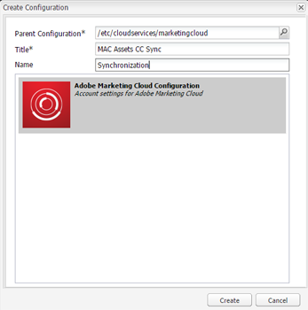

# Configurare l&#39;integrazione di AEM Assets con Experience Cloud e Creative Cloud {#configure-aem-assets-integration-with-experience-cloud-and-creative-cloud}

Se sei un cliente Adobe Experience Cloud, puoi sincronizzare le tue risorse in Adobe Experience Manager (AEM) Assets con Adobe Creative Cloud e viceversa. Puoi anche sincronizzare le tue risorse con Experience Cloud e viceversa. Potete configurare questa sincronizzazione tramite Adobe I/O.

Il flusso di lavoro per impostare questa integrazione è:

1. Create un&#39;autenticazione in Adobe I/O utilizzando un gateway pubblico e ottenete un ID applicazione.
1. Crea un profilo nell’istanza di Risorse AEM utilizzando l’ID applicazione.
1. Utilizza questa configurazione per sincronizzare le risorse in Risorse AEM con Creative Cloud.

Sul back-end, il server AEM autentica il tuo profilo con il gateway e quindi sincronizza i dati tra Risorse AEM e Experience Cloud.

>[!CAUTION]
>
>La funzione di condivisione delle cartelle da AEM a Creative Cloud è obsoleta in Risorse AEM. Scopri di più e trova sostituzioni nelle best practice per l’integrazione con [AEM e Creative Cloud](/help/assets/aem-cc-integration-best-practices.md).

Flusso di dati quando AEM Assets e Creative Cloud sono integrati

>[!NOTE]
>
>La condivisione di risorse tra Adobe Experience Cloud e Adobe Creative Cloud richiede privilegi di amministratore per l&#39;istanza AEM.

>[!CAUTION]
>
>Adobe Marketing Cloud è stato classificato come Adobe Experience Cloud. Le procedure riportate di seguito fanno ancora riferimento a Marketing Cloud per riflettere l&#39;interfaccia corrente. Tali menzioni verranno modificate in una data successiva.

## Creare un&#39;applicazione {#create-an-application}

1. Per accedere all’interfaccia del gateway Adobe Developer, effettuate l’accesso all’indirizzo [https://legacy-oauth.cloud.adobe.io](https://legacy-oauth.cloud.adobe.io/).

   >[!NOTE]
   >
   >Per creare un ID applicazione sono necessari privilegi di amministratore.

1. Nel riquadro a sinistra, passare a Strumenti **[!UICONTROL per]** sviluppatori > **[!UICONTROL Applicazioni]** per visualizzare un elenco delle applicazioni.
1. Fate clic su **[!UICONTROL Aggiungi]** aem_assets_addcerchio_icon  per creare un&#39;applicazione.
1. Dall&#39;elenco Credenziali **** client, selezionare Account **[!UICONTROL servizio (Asserzione JWT)]**, un servizio di comunicazione server-to-server per l&#39;autenticazione server.

   

1. Specificate un nome per l’applicazione e una descrizione facoltativa.
1. Dall’elenco **[!UICONTROL Organizzazione]** , selezionate l’organizzazione per la quale desiderate sincronizzare le risorse.
1. Nell&#39;elenco **[!UICONTROL Ambito]** , selezionare **[!UICONTROL dam-read]**, **[!UICONTROL dam-sync]**, **[!UICONTROL dam-write]** e **[!UICONTROL cc-share]**.
1. Fai clic su **[!UICONTROL Crea]**. Un messaggio notifica che l’applicazione è stata creata.

   

1. Copiate l&#39;ID **** applicazione generato per la nuova applicazione.

   >[!CAUTION]
   >
   >Assicuratevi di non copiare inavvertitamente il Segreto **** applicazione invece dell&#39;ID **** applicazione.

## Aggiunta di una nuova configurazione a Marketing Cloud {#add-a-new-configuration-to-marketing-cloud}

1. Fai clic sul logo AEM nell’interfaccia utente dell’istanza locale di Risorse AEM e passa a **[!UICONTROL Strumenti]** > Servizi **** cloud > Servizi **** legacy di Cloud.

1. Individuate il servizio **[!UICONTROL Adobe Marketing Cloud]** . Se non esistono configurazioni, fate clic su **[!UICONTROL Configura ora]**. Se sono presenti configurazioni, fate clic su **[!UICONTROL Mostra configurazioni]** e fate clic su **[!UICONTROL [+]]** per aggiungere una nuova configurazione.

   >[!NOTE]
   >
   >Utilizzate un account Adobe ID con privilegi di amministratore per l&#39;organizzazione.

1. Nella finestra di dialogo **[!UICONTROL Crea configurazione]** , specificate un titolo e un nome per la nuova configurazione e fate clic su **[!UICONTROL Crea]**.

   

1. Nel campo URL **** tenant, specificate l’URL per Risorse AEM.

   >[!CAUTION]
   >
   >A causa di un rebranding, se hai inserito l&#39;URL tenant come `https://<tenant_id>.marketing.adobe.com` devi modificare in `https://<tenant_id>.experiencecloud.adobe.com.` Per eseguire questa operazione, procedi come segue:
   >
   >1. Vai a **Strumenti > Servizi cloud > Servizi** cloud legacy.
   1. In Adobe Marketing Cloud, fate clic su **Mostra configurazioni**.
   1. Selezionate la configurazione creata durante la configurazione della sincronizzazione AEM-MAC-CC.
   1. Modificate la configurazione del servizio cloud e sostituite **marketing.adobe.com** nel campo URL tenant con **experience**.adobe.com.
   1. Salvate la configurazione.
   1. Verificate gli agenti di replica della sincronizzazione mac.

1. Nel campo ID **** client, incollate l&#39;ID applicazione che avete copiato alla fine della procedura [Creare un&#39;applicazione](/help/sites-administering/configure-assets-cc-integration.md#create-an-application).

   

1. In **[!UICONTROL Sincronizzazione]** , selezionate **[!UICONTROL Abilitato]** per abilitare la sincronizzazione e fate clic su **[!UICONTROL OK]**.

   >[!NOTE]
   Se selezionate **Disattivato**, la sincronizzazione funzionerà in una sola direzione.

1. Dalla pagina di configurazione, fate clic su **[!UICONTROL Visualizza chiave]** pubblica per visualizzare la chiave pubblica generata per l’istanza. In alternativa, fai clic su **[!UICONTROL Scarica chiave pubblica per Gateway]** OAuth per scaricare il file contenente la chiave pubblica. Quindi, aprite il file per visualizzare la chiave pubblica.

## Abilita sincronizzazione {#enable-synchronization}

1. Visualizzare la chiave pubblica utilizzando uno dei seguenti metodi menzionati nell&#39;ultimo passaggio della procedura [Aggiungere una nuova configurazione a Marketing Cloud](/help/sites-administering/configure-assets-cc-integration.md#add-a-new-configuration-to-marketing-cloud). Fate clic su **[!UICONTROL Visualizza chiave]** pubblica.

   

1. Copiate la chiave pubblica e incollatela nel campo Chiave **** pubblica dell&#39;interfaccia di configurazione dell&#39;applicazione creata in [Creare un&#39;applicazione](/help/sites-administering/configure-assets-cc-integration.md#create-an-application).

   

1. Click **[!UICONTROL Update]**. Sincronizza ora le risorse con l’istanza Risorse AEM.

## Verificare la sincronizzazione {#test-the-synchronization}

1. Fai clic sul logo AEM nell&#39;interfaccia utente dell&#39;istanza locale di Risorse AEM e passa a **[!UICONTROL Strumenti]**> **[!UICONTROL Distribuzione]**> **[!UICONTROL Replica]**per individuare i profili di replica creati per la sincronizzazione.
1. Nella pagina **[!UICONTROL Replica]** , fate clic su **[!UICONTROL Agenti sull’autore]**.
1. Dall&#39;elenco dei profili, fate clic sul profilo di replica predefinito per l&#39;organizzazione in uso per aprirlo.
1. Nella finestra di dialogo, fate clic su **[!UICONTROL Test connessione]**.

   

1. Al termine della replica, verificare la presenza di un messaggio di riuscita alla fine dei risultati del test.

## Aggiunta di utenti a Marketing Cloud {#add-users-to-marketing-cloud}

1. Effettuate l&#39;accesso a Marketing Cloud utilizzando le credenziali di amministratore.
1. Dai binari, andate a **[!UICONTROL Amministrazione]** e quindi fate clic o toccate **[!UICONTROL Avvia Enterprise Dashboard]**.
1. Dalla barra laterale, fate clic su **[!UICONTROL Utenti]** per aprire la pagina Gestione **** utente.
1. Dalla barra degli strumenti, fate clic o toccate **Aggiungi** aem_assets_add_icon .
1. Aggiungete uno o più utenti per consentire loro di condividere le risorse con Creative Cloud.

   >[!NOTE]
   Solo gli utenti aggiunti a Marketing Cloud possono condividere le risorse da Risorse AEM a Creative Cloud.

## Scambio di risorse tra AEM Assets e Marketing Cloud {#exchange-assets-between-aem-assets-and-marketing-cloud}

1. Accedi a Risorse AEM.
1. Nella console Risorse, create una cartella e caricate alcune risorse. Ad esempio, create una cartella **mc-demo** e caricate una risorsa su di essa.
1. Selezionate la cartella e fate clic su **Condividi** .
1. Dal menu, selezionate **[!UICONTROL Adobe Marketing Cloud]** e fate clic su **[!UICONTROL Condividi]**. Un messaggio notifica che la cartella è condivisa con Marketing Cloud.

   

   >[!NOTE]
   La condivisione di una cartella di risorse di tipo `sling:OrderedFolder`non è supportata nel contesto della condivisione in Adobe Marketing Cloud. Se desiderate condividere una cartella, quando la create in Risorse AEM, non selezionate l’opzione **[!UICONTROL Ordinato]** .

1. Aggiorna l’interfaccia utente di Risorse AEM. La cartella creata nella console Risorse dell’istanza locale di Risorse AEM viene copiata nell’interfaccia utente di Marketing Cloud. La risorsa caricata nella cartella in Risorse AEM viene visualizzata nella copia della cartella in Marketing Cloud dopo essere stata elaborata dal server AEM.
1. Potete anche caricare una risorsa nella copia replicata della cartella in Marketing Cloud. Una volta elaborata, la risorsa viene visualizzata nella cartella condivisa in Risorse AEM.

## Scambio di risorse tra AEM Assets e Creative Cloud {#exchange-assets-between-aem-assets-and-creative-cloud}

>[!CAUTION]
La funzione AEM to Creative Cloud Folder Sharing è obsoleta. È fortemente consigliato utilizzare funzionalità più recenti, come [Adobe Asset Link](https://helpx.adobe.com/enterprise/using/adobe-asset-link.html) o l&#39;app [desktop](https://helpx.adobe.com/experience-manager/desktop-app/aem-desktop-app.html)AEM. Ulteriori informazioni nelle best practice per l&#39;integrazione con [AEM e Creative Cloud](/help/assets/aem-cc-integration-best-practices.md).

Risorse AEM consente di condividere cartelle contenenti risorse con utenti Adobe Creative Cloud.

1. Nella console Risorse, selezionate la cartella da condividere con Creative Cloud.
1. Dalla barra degli strumenti, fate clic su **[!UICONTROL Condividi]** .
1. Dall&#39;elenco, selezionate l&#39;opzione **[!UICONTROL Adobe Creative Cloud]** .

   >[!NOTE]
   Le opzioni sono disponibili per gli utenti con autorizzazioni di lettura nella directory principale. Gli utenti devono disporre dell&#39;autorizzazione necessaria per accedere alle informazioni dell&#39;agente di replica di Marketing Cloud.

1. Nella pagina Condivisione **[!UICONTROL di]** Creative Cloud aggiungete l&#39;utente con cui condividere la cartella e scegliete un ruolo per l&#39;utente. Fate clic su **[!UICONTROL Salva]** e su **[!UICONTROL OK]**.

1. Accedete a Creative Cloud con le credenziali dell&#39;utente con cui avete condiviso la cartella. La cartella condivisa è disponibile in Creative Cloud.

La sincronizzazione AEM Assets-Marketing Cloud è progettata in modo che l’istanza del computer dell’utente da cui viene caricata la risorsa mantenga il diritto di modificare la risorsa. Solo queste modifiche vengono propagate all&#39;altra istanza.

Ad esempio, se una risorsa viene caricata da un’istanza di Risorse AEM (nei locali), le modifiche alla risorsa da questa istanza vengono propagate all’istanza Marketing Cloud. Tuttavia, le modifiche apportate dall’istanza Marketing Cloud alla stessa risorsa non vengono propagate all’istanza AEM e viceversa per le risorse caricate da Marketing Cloud.

>[!MORELIKETHIS]
* [Best practice per l&#39;integrazione di AEM e Creative Cloud](/help/assets/aem-cc-integration-best-practices.md)
* [Best practice per la condivisione di cartelle da AEM a Creative Cloud](/help/assets/aem-cc-folder-sharing-best-practices.md)

