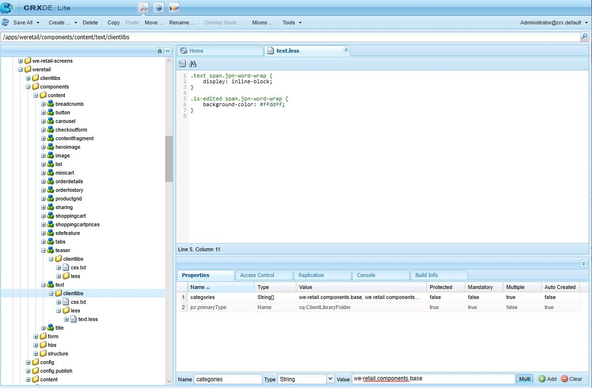

# Configurare i plug-in Editor Rich Text {#configure-the-rich-text-editor-plug-ins}

Le funzionalità dell’editor Rich Text sono disponibili tramite una serie di plug-in, ciascuno con proprietà features . Puoi configurare la proprietà feature per attivare o disattivare una o più funzioni dell’editor Rich Text. Questo articolo descrive come configurare in modo specifico i plug-in RTE.

Per informazioni dettagliate sulle altre configurazioni dell’editor Rich Text, consulta [Configurare l’editor Rich Text](/help/sites-administering/rich-text-editor.md).

>[!NOTE]
>
>Quando si lavora con CRXDE Lite, è consigliabile salvare regolarmente le modifiche utilizzando l&#39;opzione [!UICONTROL Salva tutto].

## Attivare un plug-in e configurare la proprietà features {#activateplugin}

Per attivare un plug-in, effettua le seguenti operazioni. Alcuni passaggi sono necessari solo quando configuri un plug-in per la prima volta, in quanto i nodi corrispondenti non esistono.

Per impostazione predefinita, i plug-in `format`, `link`, `list`, `justify` e `control` e tutte le relative funzioni sono abilitati nell’editor Rich Text.

>[!NOTE]
>
>Il rispettivo nodo `rtePlugins` è indicato come `<rtePlugins-node>` per evitare duplicazioni in questo articolo.

1. Utilizzando CRXDE Lite, individua il componente di testo per il progetto.
1. Crea il nodo principale di `<rtePlugins-node>` se non esiste, prima di configurare eventuali plug-in RTE:

   * A seconda del componente, i nodi principali sono:

      * `config: .../text/cq:editConfig/cq:inplaceEditing/config`
      * un nodo di configurazione alternativo: `.../text/cq:editConfig/cq:inplaceEditing/inplaceEditingTextConfig`
      * `text: .../text/dialog/items/tab1/items/text`
   * Sono di tipo: **jcr:primaryType** `cq:Widget`
   * Entrambi dispongono della seguente proprietà:

      * **Nome** `name`
      * **Tipo** `String`
      * **Valore** `./text`


1. A seconda dell&#39;interfaccia per la quale stai configurando, crea un nodo `<rtePlugins-node>`, se non esiste:

   * **Nome** `rtePlugins`
   * **Tipo** `nt:unstructured`

1. Di seguito, crea un nodo per ogni plug-in che desideri attivare:

   * **Tipo** `nt:unstructured`
   * **** Denomina l&#39;ID plug-in del plug-in richiesto

Dopo aver attivato un plug-in, segui queste linee guida per configurare la proprietà `features` .

|  | Abilita tutte le funzionalità | Abilitare alcune funzioni specifiche | Disattiva tutte le funzioni |
|---|---|---|---|
| Nome | caratteristiche | caratteristiche | caratteristiche |
| Tipo | Stringa | String[] (stringa multipla; impostare Tipo su Stringa e fare clic su Multi in CRXDE Lite) | Stringa |
| Valore | `*` (un asterisco) | impostato su uno o più valori di feature | - |

## Comprendere il plug-in più recente {#findreplace}

Il plug-in `findreplace` non richiede alcuna configurazione. Funziona fuori dagli schemi.

Quando si utilizza la funzionalità di sostituzione, la stringa di sostituzione da sostituire deve essere immessa contemporaneamente alla stringa di ricerca. Tuttavia è ancora possibile fare clic su trova per cercare la stringa prima di sostituirla. Se la stringa di sostituzione viene immessa dopo aver fatto clic su trova, la ricerca viene reimpostata all’inizio del testo.

La finestra di dialogo trova e sostituisci diventa trasparente quando si fa clic su trova e diventa opaca quando si fa clic su sostituisci. Questo consente all’autore di rivedere il testo che verrà sostituito dall’autore. Se gli utenti fanno clic su sostituisci tutto, la finestra di dialogo viene chiusa e viene visualizzato il numero di sostituzioni effettuate.

## Configurare le modalità Incolla {#paste-modes}

Quando si utilizza l’editor Rich Text, gli autori possono incollare i contenuti in una delle tre modalità seguenti:

* **Modalità** browser: Incolla il testo utilizzando l’implementazione di incolla predefinita del browser. Non è un metodo consigliato in quanto potrebbe introdurre markup indesiderati.

* **Modalità** testo normale: Incolla il contenuto degli Appunti come testo normale. Elimina tutti gli elementi di stile e formattazione dal contenuto copiato prima di inserirli nel componente [!DNL Experience Manager].

* **Modalità** MS Word: Incolla il testo, incluse le tabelle, con la formattazione durante la copia da MS Word. La copia e l&#39;incolla del testo da un&#39;altra origine, ad esempio una pagina Web o MS Excel, non è supportata e mantiene solo la formattazione parziale.

### Configurare le opzioni Incolla disponibili nella barra degli strumenti dell’Editor Rich Text  {#configure-paste-options-available-on-the-rte-toolbar}

Puoi fornire alcune, tutte o nessuna di queste tre icone agli autori nella barra degli strumenti dell’editor Rich Text:

* **[!UICONTROL Incolla (Ctrl+V)]**: Può essere preconfigurato per corrispondere a una delle tre modalità Incolla di cui sopra.

* **[!UICONTROL Incolla come testo]**: Offre funzionalità per la modalità testo normale.

* **[!UICONTROL Incolla da Word]**: Fornisce la funzionalità della modalità MS Word.

Per configurare l’editor Rich Text per visualizzare le icone richieste, effettua le seguenti operazioni.

1. Passa al componente, ad esempio `/apps/<myProject>/components/text`.
1. Passa al nodo `rtePlugins/edit`. Consulta [attivare un plug-in](#activateplugin) se il nodo non esiste.
1. Crea la proprietà `features` sul nodo `edit` e aggiungi una o più funzioni. Salva tutte le modifiche.

### Configurare il comportamento dell’icona Incolla (Ctrl+V) e della scelta rapida {#configure-the-behavior-of-the-paste-ctrl-v-icon-and-shortcut}

Puoi preconfigurare il comportamento dell’icona **[!UICONTROL Incolla (Ctrl+V)]** seguendo i passaggi seguenti. Questa configurazione definisce anche il comportamento della scelta rapida da tastiera Ctrl+V che gli autori utilizzano per incollare il contenuto.

La configurazione consente i seguenti tre tipi di casi d’uso:

* Incolla il testo utilizzando l’implementazione di incolla predefinita del browser. Non è un metodo consigliato in quanto potrebbe introdurre markup indesiderati. Configurato utilizzando `browser` di seguito.

* Incolla il contenuto degli Appunti come testo normale. Elimina tutti gli elementi di stile e formattazione dal contenuto copiato prima di inserirli in AEM componente. Configurato utilizzando `plaintext` di seguito.

* Incolla il testo, incluse le tabelle, con la formattazione durante la copia da MS Word. La copia e l&#39;incolla del testo da un&#39;altra origine, ad esempio una pagina Web o MS Excel, non è supportata e mantiene solo la formattazione parziale. Configurato utilizzando `wordhtml` di seguito.

1. Nel componente , accedi al nodo `<rtePlugins-node>/edit` . Crea i nodi se non esistono. Per ulteriori informazioni, consulta [attivare un plug-in](#activateplugin).
1. Nel nodo `edit` crea una proprietà utilizzando i seguenti dettagli:

   * **Nome** `defaultPasteMode`
   * **Tipo** `String`
   * **** ValueUna delle modalità di incolla richieste  `browser`,  `plaintext` o  `wordhtml`.

### Configurare i formati consentiti per incollare il contenuto {#pasteformats}

È possibile configurare ulteriormente la modalità incolla-come-Microsoft-Word (`paste-wordhtml`) in modo da poter definire in modo esplicito gli stili consentiti quando si incollano AEM da un altro programma, ad esempio Microsoft Word.

Ad esempio, se è consentito incollare solo formati ed elenchi in grassetto, è possibile filtrare gli altri formati. Questa operazione è denominata filtro di incolla configurabile, che può essere eseguito per entrambi:

* [Testo](#paste-modes)
* [Collegamenti](#linkstyles)

Per i collegamenti è inoltre possibile definire i protocolli accettati automaticamente.

Per configurare quali formati sono consentiti quando si incolla testo in AEM da un altro programma:

1. Nel componente , accedi al nodo `<rtePlugins-node>/edit`. Crea i nodi se non esistono. Per ulteriori dettagli, consulta [attivare un plug-in](#activateplugin).
1. Crea un nodo sotto il nodo `edit` per contenere le regole di incolla HTML:

   * **Nome** `htmlPasteRules`
   * **Tipo** `nt:unstructured`

1. Crea un nodo sotto `htmlPasteRules` per contenere i dettagli dei formati di base consentiti:

   * **Nome** `allowBasics`
   * **Tipo** `nt:unstructured`

1. Per controllare i singoli formati accettati, crea una o più delle seguenti proprietà sul nodo `allowBasics` :

   * **Nome** `bold`
   * **Nome** `italic`
   * **Nome** `underline`
   * **Nome** `anchor`  (sia per i collegamenti che per gli ancoraggi denominati)
   * **Nome** `image`

   Tutte le proprietà sono di **Tipo** `Boolean`, quindi nel **Valore** appropriato è possibile selezionare o rimuovere il segno di spunta per abilitare o disabilitare la funzionalità.

   >[!NOTE]
   >
   >Se non è definito in modo esplicito, viene utilizzato il valore predefinito true e il formato viene accettato.

1. Altri formati possono essere definiti anche utilizzando un intervallo di altre proprietà o nodi, applicati anche al nodo `htmlPasteRules`. Salva tutte le modifiche.

È possibile utilizzare le seguenti proprietà per `htmlPasteRules`.

| Proprietà | Tipo | Descrizione |
|---|---|---|
| `allowBlockTags` | Stringa | Definisce l’elenco dei tag di blocco consentiti. Alcuni possibili tag di blocco includono: <ul> <li>titoli (h1, h2, h3)</li> <li>lettera p)</li> <li>elenchi (ol, ul)</li> <li>tabelle (tabella)</li> </ul> |
| `fallbackBlockTag` | Stringa | Definisce il tag blocco utilizzato per tutti i blocchi con un tag blocco non incluso in `allowBlockTags`. `p` nella maggior parte dei casi è sufficiente. |
| tabella | nt:unstructured | Definisce il comportamento da seguire per incollare le tabelle. Questo nodo deve avere la proprietà `allow` (tipo Boolean) per definire se è consentito incollare tabelle. Se allow è impostato su `false`, è necessario specificare la proprietà `ignoreMode` (tipo String) per definire la modalità di gestione del contenuto della tabella incollata. I valori validi per `ignoreMode` sono: <ul> <li>`remove`: Rimuove il contenuto della tabella.</li> <li>`paragraph`: Trasforma le celle della tabella in paragrafi.</li> </ul> |
| elenco | nt:unstructured | Definisce il comportamento durante l’incollaggio degli elenchi. Per definire se è consentito incollare elenchi, è necessario disporre della proprietà `allow` (tipo Boolean). Se `allow` è impostato su `false`, è necessario specificare la proprietà `ignoreMode` (tipo String) per definire la gestione del contenuto dell’elenco incollato. I valori validi per `ignoreMode` sono: <ul><li> `remove`: Rimuove il contenuto dell’elenco.</li> <li>`paragraph`: Converte le voci di elenco in paragrafi.</li> </ul> |

Di seguito è riportato un esempio di struttura `htmlPasteRules` valida.

```xml
"htmlPasteRules": {
    "allowBasics": {
        "italic": true,
        "link": true
    },
    "allowBlockTags": [
        "p", "h1", "h2", "h3"
    ],
    "list": {
        "allow": false,
        "ignoreMode": "paragraph"
    },
    "table": {
        "allow": true,
        "ignoreMode": "paragraph"
    }
}
```

## Configurare gli stili di testo {#textstyles}

Gli autori possono applicare gli stili per modificare l’aspetto di una parte di testo. Gli stili si basano sulle classi CSS predefinite nel foglio di stile CSS. Il contenuto stilizzato è racchiuso tra tag `span` che utilizzano l’attributo `class` per fare riferimento alla classe CSS. Esempio, `<span class=monospaced>Monospaced Text Here</span>`.

Quando il plug-in Stili è attivato per la prima volta, non è disponibile alcun Stili predefinito. L&#39;elenco a comparsa è vuoto. Per fornire gli autori Stili, procedi come segue:

* Attiva il selettore a discesa Stile .
* Specificare le posizioni dei fogli di stile.
* Specifica i singoli stili che possono essere selezionati dall’elenco a discesa Stile .

Per configurazioni successive, ad esempio per aggiungere altri stili, seguire solo le istruzioni per fare riferimento a un nuovo foglio di stile e specificare gli stili aggiuntivi.

>[!NOTE]
>
>È possibile definire gli stili per le tabelle o le celle di tabella [o](/help/sites-administering/configure-rich-text-editor-plug-ins.md#tablestyles). Queste configurazioni richiedono procedure separate.

### Attiva l’elenco a discesa Stile {#styleselectorlist}

A questo scopo, abilita il plug-in Stili.

1. Nel componente , accedi al nodo `<rtePlugins-node>/styles`. Crea i nodi se non esistono. Per ulteriori dettagli, consulta [attivare un plug-in](#activateplugin).
1. Crea la proprietà `features` sul nodo `styles` :

   * **Nome** `features`
   * **Tipo** `String`
   * **Valore** `*`  (asterisco)

1. Salva tutte le modifiche.

>[!NOTE]
>
>Una volta abilitato il plug-in Stili, l’elenco a discesa Stile viene visualizzato nella finestra di dialogo di modifica. Tuttavia, l’elenco è vuoto in quanto non è configurato alcun stile.

### Specificare la posizione del foglio di stile {#locationofstylesheet}

Quindi, specificare le posizioni dei fogli di stile a cui si desidera fare riferimento:

1. Passa al nodo principale del componente di testo, ad esempio `/apps/<myProject>/components/text`.
1. Aggiungi la proprietà `externalStyleSheets` al nodo principale di `<rtePlugins-node>`:

   * **Nome** `externalStyleSheets`
   * **Type** `String[]`  (multi-stringa; fai clic su  **** Multiin CRXDE)
   * **Valore(i)** Il percorso e il nome del file di ogni foglio di stile che si desidera includere. Utilizza i percorsi del repository.

   >[!NOTE]
   >
   >È possibile aggiungere riferimenti a fogli di stile aggiuntivi in qualsiasi momento successivo.

1. Salva tutte le modifiche.

>[!NOTE]
>
>Quando si utilizza l’editor Rich Text in una finestra di dialogo (interfaccia classica) È possibile specificare fogli di stile ottimizzati per la modifica di testo RTF. A causa di limitazioni tecniche, il contesto CSS viene perso nell’editor, quindi potrebbe essere utile emulare questo contesto per migliorare l’esperienza WYSIWYG.
>
>L’editor Rich Text utilizza un elemento DOM contenitore con ID `CQrte` che può essere utilizzato per fornire stili diversi per la visualizzazione e la modifica:
>
>
```
>#CQ td {
> // defines the style for viewing
> }
>```
>
>
```
>#CQrte td {
> // defines the style for editing
> }
>```

### Specificare gli stili disponibili nell&#39;elenco a comparsa {#stylesindropdown}

1. Nella definizione del componente, accedi al nodo `<rtePlugins-node>/styles`, come creato in [Abilitazione del selettore a discesa Stile](#styleselectorlist).
1. Sotto il nodo `styles`, crea un nuovo nodo (detto anche `styles`) per mantenere l’elenco disponibile:

   * **Nome** `styles`
   * **Tipo** `cq:WidgetCollection`

1. Crea un nuovo nodo sotto il nodo `styles` per rappresentare un singolo stile:

   * **Nome**, è possibile specificare il nome, ma deve essere adatto allo stile
   * **Tipo** `nt:unstructured`

1. Aggiungi la proprietà `cssName` a questo nodo per fare riferimento alla classe CSS:

   * **Nome** `cssName`
   * **Tipo** `String`
   * **** ValueIl nome della classe CSS (senza un precedente &quot;.&quot;; ad esempio, `cssClass` anziché `.cssClass`)

1. Aggiungi la proprietà `text` allo stesso nodo; definisce il testo visualizzato nella casella di selezione:

   * **Nome** `text`
   * **Tipo** `String`
   * **** ValueDescription dello stile; nella casella di selezione a discesa Stile.

1. Salva le modifiche.

   Ripeti i passaggi precedenti per ogni stile richiesto.

### Configurare l’editor Rich Text per interruzioni di parole ottimali in giapponese {#jpwordwrap}

Gli autori che utilizzano AEM per creare contenuti in lingua giapponese possono applicare uno stile ai caratteri per evitare interruzioni di riga nei casi in cui non sia necessaria un’interruzione. Questo permette agli autori di lasciare che le frasi si rompano nella posizione desiderata. Lo stile di questa funzionalità si basa sulla classe CSS predefinita nel foglio di stile CSS.

>[!NOTE]
>
>Questa funzione richiede almeno AEM Service Pack 1 6.5.

Per creare lo stile che gli autori possono applicare al testo giapponese, effettua le seguenti operazioni:

1. Crea un nuovo nodo sotto il nodo degli stili. Vedere [specificare un nuovo stile](#stylesindropdown).
   * Nome: `jpn-word-wrap`
   * Tipo: `nt:unstructure`

1. Aggiungi la proprietà `cssName` al nodo per fare riferimento alla classe CSS. Questo nome di classe è un nome riservato per la funzione di ritorno a capo automatico in giapponese.
   * Nome: `cssName`
   * Tipo: `String`
   * Valore: `jpn-word-wrap` (senza una precedente `.`)

1. Aggiungi il testo della proprietà allo stesso nodo. Il valore è il nome dello stile visualizzato dagli autori durante la selezione dello stile.
   * Nome: `text`
*Tipo: 
`String`
   * Valore: `Japanese word-wrap`

1. Creare un foglio di stile e specificarne il percorso. Vedere [specificare la posizione del foglio di stile](#locationofstylesheet). Aggiungere il contenuto seguente al foglio di stile. Modificate il colore di sfondo desiderato.

   ```css
   .text span.jpn-word-wrap {
       display:inline-block;
   }
   .is-edited span.jpn-word-wrap {
       background-color: #ffddff;
   }
   ```

   

## Configurare i formati paragrafo {#paraformats}

Qualsiasi testo creato nell’editor Rich Text viene inserito all’interno di un tag di blocco, il valore predefinito è `<p>`. Attivando il plug-in `paraformat` , è possibile specificare tag blocco aggiuntivi da assegnare ai paragrafi mediante un elenco a discesa di selezione. I formati paragrafo determinano il tipo di paragrafo assegnando il tag blocco corretto. L’autore può selezionarli e assegnarli utilizzando il selettore Formato. I tag blocco di esempio includono, tra gli altri, il paragrafo standard &lt;p>, i titoli &lt;h1>, &lt;h2> e così via.

>[!CAUTION]
>
>Questo plug-in non è adatto per contenuti con struttura complessa, ad esempio elenchi o tabelle.

>[!NOTE]
>
>Se un tag blocco, ad esempio un tag &lt;hr>, non può essere assegnato a un paragrafo, non si tratta di un caso d’uso valido per un plug-in in formato paraformato.

Quando il plug-in Formati paragrafo è attivato per la prima volta, non sono disponibili formati paragrafo predefiniti. L&#39;elenco a comparsa è vuoto. Per fornire agli autori i formati di paragrafo, procedi come segue:

* Attivare l&#39;elenco a discesa Formato.
* Specifica i tag di blocco che possono essere selezionati come formati di paragrafo dal menu a discesa.

Per configurazioni successive, ad esempio per aggiungere altri formati, seguire solo la parte pertinente delle istruzioni.

### Attiva il selettore a discesa Formato {#formatselectorlist}

Per prima cosa, abilita il plug-in paraformat:

1. Nel componente , accedi al nodo `<rtePlugins-node>/paraformat`. Crea i nodi se non esistono. Per ulteriori dettagli, consulta [attivare un plug-in](#activateplugin).
1. Crea la proprietà `features` sul nodo `paraformat` :

   * **Nome** `features`
   * **Tipo** `String`
   * **Valore** `*`  (asterisco)

>[!NOTE]
Se il plug-in non è configurato ulteriormente, vengono abilitati i seguenti formati predefiniti:
* Paragrafo ( `<p>`)
* Intestazione 1 ( `<h1>`)
* Intestazione 2 ( `<h2>`)
* Intestazione 3 ( `<h3>`)


>[!CAUTION]
Durante la configurazione dei formati di paragrafo dell’editor Rich Text, non rimuovere il tag paragrafo &lt;p> come opzione di formattazione. Se il tag `<p>` viene rimosso, l’autore del contenuto non può selezionare l’opzione **Formati di paragrafo** anche se sono configurati altri formati.

### Specificare i formati paragrafo disponibili {#paraformatsindropdown}

I formati paragrafo possono essere resi disponibili per la selezione:

1. Nella definizione del componente, accedi al nodo `<rtePlugins-node>/paraformat`, come creato in [Abilitazione del selettore a discesa del formato](#styleselectorlist).
1. Sotto il nodo `paraformat` crea un nuovo nodo, per contenere l&#39;elenco dei formati:

   * **Nome** `formats`
   * **Tipo** `cq:WidgetCollection`

1. Crea un nuovo nodo sotto il nodo `formats`, che contiene i dettagli di un singolo formato:

   * **Nome**, è possibile specificare il nome, ma deve essere adatto al formato (ad esempio, myParagraph, myheader1).
   * **Tipo** `nt:unstructured`

1. A questo nodo, aggiungi la proprietà per definire il tag blocco utilizzato:

   * **Nome** `tag`
   * **Tipo** `String`
   * **** ValueIl tag blocco per il formato; ad esempio: p, h1, h2, ecc.

      Non è necessario inserire le parentesi angolari di delimitazione.

1. Allo stesso nodo aggiungere un&#39;altra proprietà, affinché il testo descrittivo venga visualizzato nell&#39;elenco a discesa:

   * **Nome** `description`
   * **Tipo** `String`
   * **** ValoreIl testo descrittivo per questo formato; ad esempio Paragrafo, Titolo 1, Titolo 2 e così via. Questo testo viene visualizzato nell&#39;elenco di selezione Formato.

1. Salva le modifiche.

   Ripetere i passaggi per ogni formato richiesto.

>[!CAUTION]
Se si definiscono formati personalizzati, i formati predefiniti (`<p>`, `<h1>`, `<h2>` e `<h3>`) vengono rimossi. Ricrea il formato `<p>` in quanto è il formato predefinito.

## Configurare caratteri speciali {#spchar}

In un&#39;installazione AEM standard, quando il plug-in `misctools` è abilitato per caratteri speciali (`specialchars`) è immediatamente disponibile per l&#39;uso una selezione predefinita; ad esempio, i simboli di copyright e marchio.

Puoi configurare l’editor Rich Text per rendere disponibile una tua selezione di caratteri; definendo caratteri distinti o un&#39;intera sequenza.

>[!CAUTION]
L’aggiunta di caratteri speciali personalizzati sostituisce la selezione predefinita. Se necessario, (ri)definisci questi caratteri nella tua selezione.

### Definire un singolo carattere {#definesinglechar}

1. Nel componente , accedi al nodo `<rtePlugins-node>/misctools`. Crea i nodi se non esistono. Per ulteriori dettagli, consulta [attivare un plug-in](#activateplugin).
1. Crea la proprietà `features` sul nodo `misctools` :

   * **Nome** `features`
   * **Tipo** `String[]`
   * **Valore** `specialchars`

          (o `String / *` se si applicano tutte le funzioni per questo plug-in)

1. In `misctools` crea un nodo per mantenere le configurazioni dei caratteri speciali:

   * **Nome** `specialCharsConfig`
   * **Tipo** `nt:unstructured`

1. Sotto `specialCharsConfig` crea un altro nodo per contenere l&#39;elenco di caratteri:

   * **Nome** `chars`
   * **Tipo** `nt:unstructured`

1. In `chars` aggiungi un nuovo nodo per contenere una definizione di singolo carattere:

   * **** Il nome può essere specificato, ma deve riflettere il carattere; per esempio, metà.
   * **Tipo** `nt:unstructured`

1. A questo nodo aggiungi la seguente proprietà:

   * **Nome** `entity`
   * **Tipo** `String`
   * **** Valuta la rappresentazione HTML del carattere richiesto; per esempio,  `&189;` per la frazione una metà.

1. Salva le modifiche.

In CRXDE, una volta salvata la proprietà, viene visualizzato il carattere rappresentato. Vedi sotto l&#39;esempio della metà. Ripeti i passaggi precedenti per rendere disponibili agli autori altri caratteri speciali.


### Definire un intervallo di caratteri {#definerangechar}

1. Utilizza i passaggi da 1 a 3 di [Definizione di un singolo carattere](#definesinglechar).
1. Sotto `chars` aggiungi un nuovo nodo per contenere la definizione dell&#39;intervallo di caratteri:

   * **** Il nome può essere specificato, ma deve riflettere l’intervallo di caratteri; per esempio, matite.
   * **Tipo** `nt:unstructured`

1. Sotto questo nodo (denominato in base all&#39;intervallo di caratteri speciale) aggiungi le due seguenti proprietà:

   * **Nome** `rangeStart`

      **Tipo** `Long`
      **** Valore della  [](https://unicode.org/) presentazione Unicoderepresentazione (decimale) del primo carattere dell’intervallo

   * **Nome** `rangeEnd`

      **Tipo** `Long`
      **** Valuta la  [](https://unicode.org/) presentazione Unicode (decimale) dell’ultimo carattere dell’intervallo

1. Salva le modifiche.

   Ad esempio, definisci un intervallo da 9998 - 10000 ti fornisce i seguenti caratteri.

   

   *Figura: In CRXDE, definisci un intervallo di caratteri da rendere disponibile nell’editor Rich Text*

   

## Configurare gli stili di tabella {#tablestyles}

Gli stili vengono in genere applicati al testo, ma è possibile applicare un set separato di Stili anche a una tabella o a alcune celle della tabella. Tali stili sono disponibili per gli autori dalla casella di selezione Stile della finestra di dialogo Proprietà cella o Proprietà tabella. Gli stili sono disponibili quando si modifica una tabella all’interno di un componente Testo (o derivato) e non nel componente Tabella standard.

>[!NOTE]
È possibile definire stili per tabelle e celle solo per l’interfaccia classica.

>[!NOTE]
Le tabelle copiate e incollate nel componente RTE o dal componente RTE dipendono dal browser. Non è supportato come funzionalità integrata per tutti i browser. È possibile ottenere risultati variabili a seconda della struttura della tabella e del browser. Ad esempio, quando copi e incolla una tabella in un componente RTE in Mozilla Firefox nell’interfaccia classica e Touch, il layout della tabella non viene mantenuto.

1. All’interno del componente, accedi al nodo `<rtePlugins-node>/table`. Crea i nodi se non esistono. Per ulteriori dettagli, consulta [attivare un plug-in](#activateplugin).
1. Crea la proprietà `features` sul nodo `table` :

   * **Nome** `features`
   * **Tipo** `String`
   * **Valore** `*`

   >[!NOTE]
   Se non desideri abilitare tutte le funzionalità della tabella, puoi creare la proprietà `features` come segue:
   * **Tipo** `String[]`

   * **Valore** uno o più dei seguenti valori, a seconda delle necessità:
      * `table` consentire la modifica delle proprietà della tabella; inclusi gli stili.
      * `cellprops` per consentire la modifica delle proprietà delle celle, inclusi gli stili.


1. Definisci la posizione dei fogli di stile CSS in modo da farvi riferimento. Vedere [Specifica della posizione del foglio di stile](#locationofstylesheet) come quando si definiscono gli stili [per il testo](#textstyles). La posizione può essere definita se hai definito altri stili.
1. Sotto il nodo `table` crea i seguenti nuovi nodi (come richiesto):

   * Per definire gli stili per l’intera tabella (disponibile in **Proprietà tabella**):

      * **Nome** `tableStyles`
      * **Tipo** `cq:WidgetCollection`
   * Per definire gli stili per le singole celle (disponibile in **Proprietà cella**):

      * **Nome** `cellStyles`
      * **Tipo** `cq:WidgetCollection`


1. Crea un nuovo nodo (sotto il nodo `tableStyles` o `cellStyles` a seconda dei casi) per rappresentare un singolo stile:

   * **** È possibile specificare il nome, ma deve riflettere lo stile.
   * **Tipo** `nt:unstructured`

1. In questo nodo creare le proprietà:

   * Per definire lo stile CSS a cui fare riferimento

      * **Nome** `cssName`
      * **Tipo** `String`
      * **** Valuta il nome della classe CSS (senza un precedente,  `.`ad esempio,  `cssClass` anziché  `.cssClass`)
   * Definizione di un testo descrittivo da visualizzare nel selettore a discesa

      * **Nome** `text`
      * **Tipo** `String`
      * **** Valutare il testo da visualizzare nell’elenco di selezione


1. Salva tutte le modifiche.

Ripeti i passaggi precedenti per ogni stile richiesto.

### Configurare intestazioni nascoste nelle tabelle per l’accessibilità {#hiddenheader}

A volte è possibile creare tabelle di dati senza testo visivo in un’intestazione di colonna, partendo dal presupposto che lo scopo dell’intestazione sia determinato dalla relazione visiva della colonna con altre colonne. In questo caso, è necessario fornire un testo interno nascosto all’interno della cella di intestazione per consentire agli assistenti vocali e altre tecnologie per l’accessibilità di comprendere lo scopo della colonna.

Per migliorare l’accessibilità in tali scenari, l’editor Rich Text supporta celle di intestazione nascoste. Inoltre, fornisce le impostazioni di configurazione relative alle intestazioni nascoste nelle tabelle. Queste impostazioni consentono di applicare stili CSS sulle intestazioni nascoste nelle modalità di modifica e anteprima. Per aiutare gli autori a identificare le intestazioni nascoste nella modalità di modifica, includi nel codice i seguenti parametri:

* `hiddenHeaderEditingCSS`: Specifica il nome della classe CSS applicata alla cella di intestazione nascosta quando viene modificato l’editor Rich Text.
* `hiddenHeaderEditingStyle`: Specifica una stringa di stile applicata alla cella di intestazione nascosta quando viene modificato l’editor Rich Text.

Se si specificano sia il CSS che la stringa di stile nel codice, la classe CSS ha la precedenza sulla stringa di stile e può sovrascrivere eventuali modifiche di configurazione apportate dalla stringa di stile.

Per aiutare gli autori ad applicare CSS sulle intestazioni nascoste nella modalità di anteprima, puoi includere nel codice i seguenti parametri:

* `hiddenHeaderClassName`: Specifica il nome della classe CSS applicata alla cella di intestazione nascosta in modalità anteprima.
* `hiddenHeaderStyle`: Specifica una stringa di stile applicata alla cella di intestazione nascosta in modalità anteprima.

Se si specificano sia il CSS che la stringa di stile nel codice, la classe CSS ha la precedenza sulla stringa di stile e può sovrascrivere eventuali modifiche di configurazione apportate dalla stringa di stile.

## Aggiungere dizionari per il controllo ortografia {#adddict}

Quando il plug-in per il controllo ortografia viene attivato, l’editor Rich Text utilizza dizionari per ogni lingua appropriata. Questi vengono quindi selezionati in base alla lingua del sito web, scegliendo la proprietà language della struttura secondaria o estraendo la lingua dall’URL; ad esempio. il ramo `/en/` viene selezionato come inglese, il ramo `/de/` come tedesco.

>[!NOTE]
Il messaggio `Spell checking failed` viene visualizzato se si tenta di controllare una lingua non installata. I dizionari standard si trovano in `/libs/cq/spellchecker/dictionaries`, insieme ai file readme appropriati. Non modificare i file.

Un&#39;installazione standard AEM include i dizionari per inglese americano (`en_us`) e inglese britannico (`en_gb`). Per aggiungere altri dizionari, segui questi passaggi.

1. Passa alla pagina [https://extensions.openoffice.org/](https://extensions.openoffice.org/).

1. Effettua una delle seguenti operazioni per trovare un dizionario della tua lingua scelta:

   * Cerca un dizionario di tua scelta di lingua. Nella pagina del dizionario, individuare il collegamento alla pagina web originale dell&#39;origine o dell&#39;autore. Individua i file del dizionario per v2.x in tale pagina.
   * Cerca i file del dizionario v2.x in [https://wiki.openoffice.org/wiki/User:Khirano/Dictionaries](https://wiki.openoffice.org/wiki/User:Khirano/Dictionaries).

1. Scarica l’archivio con le definizioni dell’ortografia. Estrarre il contenuto dell&#39;archivio sul file system.

   >[!CAUTION]
   Sono supportati solo i dizionari nel formato `MySpell` per OpenOffice.org v2.0.1 o versioni precedenti. Poiché i dizionari ora sono file di archivio, si consiglia di verificare l’archivio dopo averlo scaricato.

1. Individua i file .aff e .dic. Mantieni il nome del file in minuscolo. Ad esempio, `de_de.aff` e `de_de.dic`.
1. Carica i file .aff e .dic nell&#39;archivio in `/apps/cq/spellchecker/dictionaries`.

>[!NOTE]
Il controllo ortografico dell’editor Rich Text è disponibile su richiesta. Non viene eseguito automaticamente quando si inizia a digitare del testo. Per eseguire il controllo ortografico, fai clic su [!UICONTROL Controllo ortografia] nella barra degli strumenti. L’editor Rich Text controlla l’ortografia delle parole ed evidenzia le parole errate.
Se si incorpora una modifica suggerita dal controllo ortografia, lo stato del testo cambia e le parole errate non vengono più evidenziate. Per eseguire il controllo ortografico, toccare/fare di nuovo clic sul pulsante Controllo ortografia.

## Configurare le dimensioni della cronologia per le azioni di annullamento e ripristino {#undohistory}

L’editor Rich Text consente agli autori di annullare o ripristinare alcune ultime modifiche. Per impostazione predefinita, nella cronologia sono memorizzate 50 modifiche. Puoi configurare questo valore come necessario.

1. All’interno del componente, accedi al nodo `<rtePlugins-node>/undo`. Crea questi nodi se non esistono. Per ulteriori dettagli, consulta [attivare un plug-in](#activateplugin).
1. Sul nodo `undo` crea la proprietà:

   * **Nome** `maxUndoSteps`
   * **Tipo** `Long`
   * **** Valuta il numero di passaggi di annullamento da salvare nella cronologia. Il valore predefinito è 50. Utilizzare `0` per disattivare completamente Annulla/Ripristina.

1. Salva le modifiche.

## Configurare le dimensioni della scheda {#tabsize}

Quando si preme il carattere di tabulazione all’interno di un testo, viene inserito un numero predefinito di spazi; per impostazione predefinita sono presenti tre spazi unificatori e uno spazio.

Per definire la dimensione della scheda:

1. Nel componente , accedi al nodo `<rtePlugins-node>/keys`. Crea i nodi se non esistono. Per ulteriori dettagli, consulta [attivare un plug-in](#activateplugin).
1. Sul nodo `keys` crea la proprietà:

   * **Nome** `tabSize`
   * **Tipo** `String`
   * **** Valuta il numero di caratteri di spazio da utilizzare per il tabulatore.

1. Salva le modifiche.

## Imposta margine di rientro {#indentmargin}

Quando il rientro è abilitato (impostazione predefinita), è possibile definire le dimensioni del rientro:

>[!NOTE]
Questa dimensione del rientro è applicata solo ai paragrafi (blocchi) di testo; non incide sul rientro degli elenchi effettivi.

1. All’interno del componente, accedi al nodo `<rtePlugins-node>/lists`. Crea questi nodi se non esistono. Per ulteriori dettagli, consulta [attivare un plug-in](#activateplugin).
1. Sul nodo `lists` crea il parametro `identSize` :

   * **Nome**: `identSize`
   * **Tipo**: `Long`
   * **Valore**: numero di pixel richiesti per il margine di rientro.

## Configurare l’altezza dello spazio modificabile {#editablespace}

>[!NOTE]
Questa opzione è applicabile solo quando si utilizza l’editor Rich Text in una finestra di dialogo (non per la modifica locale nell’interfaccia classica).

Puoi definire l’altezza dello spazio modificabile visualizzato nella finestra di dialogo del componente:

1. Crea una nuova proprietà sul nodo `../items/text` nella definizione della finestra di dialogo del componente:

   * **Nome** `height`
   * **Tipo** `Long`
   * **** Valuta l’altezza dell’area di lavoro di modifica in pixel.

   >[!NOTE]
   L’altezza della finestra di dialogo non viene modificata.

1. Salva le modifiche.

## Configurazione di stili e protocolli per i collegamenti {#linkstyles}

Quando aggiungi collegamenti in AEM puoi definire:

* Stili CSS da utilizzare
* I protocolli automaticamente accettati

Per configurare la modalità di aggiunta dei collegamenti in AEM da un altro programma, definisci le regole HTML.

1. Utilizzando CRXDE Lite, individua il componente di testo per il progetto.
1. Crea un nuovo nodo allo stesso livello di `<rtePlugins-node>`, ovvero crea il nodo sotto il nodo principale di `<rtePlugins-node>`:

   * **Nome** `htmlRules`
   * **Tipo** `nt:unstructured`

   >[!NOTE]
   Il nodo `../items/text` ha la proprietà :
   * **Nome** `xtype`
   * **Tipo** `String`
   * **Valore** `richtext`

   La posizione del nodo `../items/text` può variare a seconda della struttura della finestra di dialogo; due esempi sono `/apps/myProject>/components/text/dialog/items/text` e `/apps/<myProject>/components/text/dialog/items/panel/items/text`.

1. In `htmlRules`, crea un nuovo nodo.

   * **Nome** `links`
   * **Tipo** `nt:unstructured`

1. Sotto il nodo `links` definisci le proprietà come richiesto:

   * Stile CSS per collegamenti interni:

      * **Nome** `cssInternal`
      * **Tipo** `String`
      * **** Valuta il nome della classe CSS (senza un precedente &quot;.&quot;; ad esempio, `cssClass` anziché `.cssClass`)
   * Stile CSS per collegamenti esterni

      * **Nome** `cssExternal`
      * **Tipo** `String`
      * **** Valuta il nome della classe CSS (senza un precedente &quot;.&quot;; ad esempio, `cssClass` anziché `.cssClass`)
   * Array di protocolli **validi**. I protocolli supportati sono `http://`, `https://`, `file://` e `mailto:`.

      * **Nome** `protocols`
      * **Tipo** `String[]`
      * **Valore** di uno o più protocolli
   * **defaultProtocol**  (proprietà di tipo  **String**): Protocollo da utilizzare se l&#39;utente non ne ha specificato esplicitamente uno.

      * **Nome** `defaultProtocol`
      * **Tipo** `String`
      * **Valori** uno o più protocolli predefiniti
   * Definizione di come gestire l’attributo di destinazione di un collegamento. Crea un nuovo nodo:

      * **Nome** `targetConfig`
      * **Tipo** `nt:unstructured`

      Sul nodo `targetConfig`: definire le proprietà richieste:

      * Specifica la modalità di destinazione:

         * **Nome** `mode`
         * **Tipo** `String`)
         * **Valori** :

            * `auto`: significa che è stato scelto un target automatico

               (specificato dalla proprietà `targetExternal` per i collegamenti esterni o `targetInternal` per i collegamenti interni).

            * `manual`: non applicabile in questo contesto
            * `blank`: non applicabile in questo contesto
      * Destinazione dei collegamenti interni:

         * **Nome** `targetInternal`
         * **Tipo** `String`
         * **** Valutare la destinazione per i collegamenti interni (da utilizzare solo quando la modalità è  `auto`)
      * Destinazione dei collegamenti esterni:

         * **Nome** `targetExternal`
         * **Tipo** `String`
         * **** Valuta la destinazione per i collegamenti esterni (utilizzato solo quando la modalità è  `auto`).


1. Salva tutte le modifiche.
