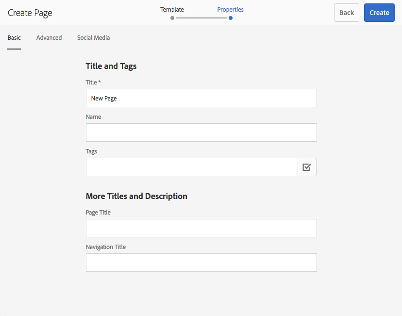
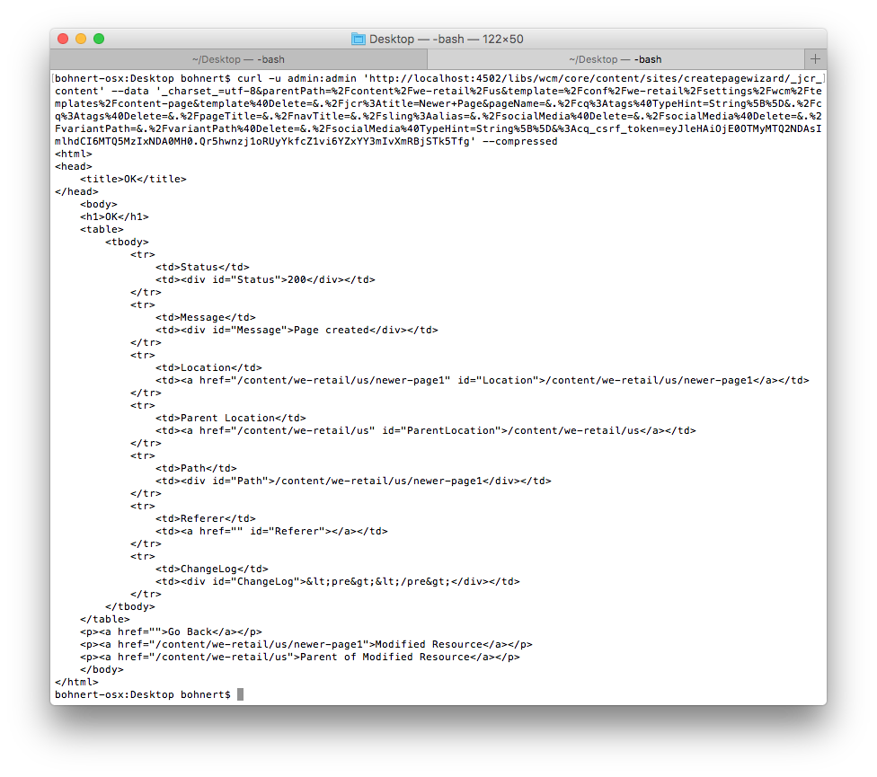

# Utilizzo di cURL con AEM{#using-curl-with-aem}

Gli amministratori devono spesso automatizzare o semplificare le attività più comuni all&#39;interno di qualsiasi sistema. In AEM, ad esempio, gestire gli utenti, installare i pacchetti e gestire i bundle OSGi sono attività che devono essere eseguite comunemente.

A causa della natura RESTful del framework Sling su cui viene creato AEM, la maggior parte delle attività può essere eseguita con una chiamata URL. cURL può essere utilizzato per eseguire tali chiamate URL e può essere uno strumento utile per gli amministratori AEM.

## Cos’è cURL {#what-is-curl}

cURL è uno strumento a riga di comando open-source utilizzato per eseguire manipolazioni URL. Supporta un&#39;ampia gamma di protocolli Internet tra cui HTTP, HTTPS, FTP, FTPS, SCP, SFTP, TFTP, LDAP, DAP, DICT, TELNET, FILE, IMAP, POP3, SMTP e RTSP.

cURL è uno strumento consolidato e ampiamente utilizzato per ottenere o inviare dati utilizzando la sintassi URL ed è stato originariamente rilasciato nel 1997. Il nome cURL originariamente intendeva &quot;vedi URL&quot;.

A causa della natura RESTful del framework Sling su cui viene generato AEM, la maggior parte delle attività può essere ridotta a una chiamata URL, che può essere eseguita con cURL. [Attività di manipolazione dei contenuti](/help/sites-administering/curl.md#common-content-manipulation-aem-curl-commands) ad esempio l’attivazione delle pagine, l’avvio dei flussi di lavoro e [compiti operativi](/help/sites-administering/curl.md#common-operational-aem-curl-commands) come la gestione dei pacchetti e gli utenti possono essere automatizzati utilizzando cURL. Inoltre, è possibile [crea il tuo cURL](/help/sites-administering/curl.md#building-a-curl-ready-aem-command) comandi per la maggior parte delle attività in AEM.

>[!NOTE]
>
>Qualsiasi comando AEM eseguito tramite cURL deve essere autorizzato come qualsiasi utente a AEM. Tutti gli ACL e i diritti di accesso vengono rispettati quando si utilizza cURL per eseguire un comando AEM.

## Download di cURL {#downloading-curl}

cURL è una parte standard di macOS e alcune sequenze Linux. Tuttavia è disponibile per la maggior parte dei sistemi operativi. Gli ultimi download sono disponibili all&#39;indirizzo [https://curl.haxx.se/download.html](https://curl.haxx.se/download.html).

L’archivio sorgente di cURL può essere trovato anche su GitHub.

## Creazione di un comando di AEM pronto per cURL {#building-a-curl-ready-aem-command}

I comandi cURL possono essere generati per la maggior parte delle operazioni in AEM come attivazione dei flussi di lavoro, controllo delle configurazioni OSGi, attivazione dei comandi JMX, creazione di agenti di replica e molto altro.

Per trovare il comando esatto necessario per una particolare operazione, è necessario utilizzare gli strumenti di sviluppo nel browser per acquisire la chiamata POST al server quando si esegue il comando AEM.

I passaggi seguenti descrivono come farlo utilizzando come esempio la creazione di una nuova pagina all’interno del browser Chrome.

1. Prepara l’azione da invocare in AEM. In questo caso, abbiamo proseguito fino alla fine del **Crea pagina** procedura guidata, ma non hai ancora fatto clic **Crea**.

   

1. Avvia gli strumenti per sviluppatori e seleziona la **Rete** scheda . Fai clic sul pulsante **Conserva registro** prima di cancellare la console.

   

1. Fai clic su **Crea** in **Crea pagina** creazione guidata per creare effettivamente il flusso di lavoro.
1. Fai clic con il pulsante destro del mouse sull’azione POST risultante e seleziona **Copia** -> **Copia come cURL**.

   

1. Copia il comando cURL in un editor di testo e rimuovi tutte le intestazioni dal comando, che inizia con `-H` (evidenziato in blu nell&#39;immagine seguente) e aggiungi il parametro di autenticazione appropriato, come `-u <user>:<password>`.

   

1. Esegui il comando cURL tramite la riga di comando e visualizza la risposta.

   

## Comandi comuni operativi AEM cURL {#common-operational-aem-curl-commands}

Elenco dei comandi cURL AEM per le attività amministrative e operative comuni.

>[!NOTE]
>
>Gli esempi seguenti presuppongono che AEM sia in esecuzione `localhost` sulla porta `4502` e utilizza l&#39;utente `admin` con password `admin`. I segnaposto di comando aggiuntivi sono impostati tra parentesi angolari.

### Gestione pacchetti {#package-management}

#### Elenca tutti i pacchetti installati

```shell
curl -u <user>:<password> http://<host>:<port>/crx/packmgr/service.jsp?cmd=ls
```

#### Creare un pacchetto {#create-a-package}

```shell
curl -u <user>:<password> -X POST http://localhost:4502/crx/packmgr/service/.json/etc/packages/mycontent.zip?cmd=create -d packageName=<name> -d groupName=<name>
```

#### Anteprima di un pacchetto {#preview-a-package}

```shell
curl -u <user>:<password> -X POST http://localhost:4502/crx/packmgr/service/.json/etc/packages/mycontent.zip?cmd=preview
```

#### Contenuto del pacchetto di elenco {#list-package-content}

```shell
curl -u <user>:<password> -X POST http://localhost:4502/crx/packmgr/service/console.html/etc/packages/mycontent.zip?cmd=contents
```

#### Creare un pacchetto {#build-a-package}

```shell
curl -X POST http://localhost:4502/crx/packmgr/service/.json/etc/packages/mycontent.zip?cmd=build
```

#### Riavvolgere un pacchetto {#rewrap-a-package}

```shell
curl -u <user>:<password> -X POST http://localhost:4502/crx/packmgr/service/.json/etc/packages/mycontent.zip?cmd=rewrap
```

#### Rinomina un pacchetto {#rename-a-package}

```shell
curl -u <user>:<password> -X POST -Fname=<New Name> http://localhost:4502/etc/packages/<Group Name>/<Package Name>.zip/jcr:content/vlt:definition
```

#### Caricare un pacchetto {#upload-a-package}

```shell
curl -u <user>:<password> -F cmd=upload -F force=true -F package=@test.zip http://localhost:4502/crx/packmgr/service/.json
```

#### Installare un pacchetto {#install-a-package}

```shell
curl -u <user>:<password> -F cmd=install http://localhost:4502/crx/packmgr/service/.json/etc/packages/my_packages/test.zip
```

#### Disinstallare un pacchetto {#uninstall-a-package}

```shell
curl -u <user>:<password> -F cmd=uninstall http://localhost:4502/crx/packmgr/service/.json/etc/packages/my_packages/test.zip
```

#### Eliminare un pacchetto {#delete-a-package}

```shell
curl -u <user>:<password> -F cmd=delete http://localhost:4502/crx/packmgr/service/.json/etc/packages/my_packages/test.zip
```

#### Scaricare un pacchetto {#download-a-package}

```shell
curl -u <user>:<password> http://localhost:4502/etc/packages/my_packages/test.zip
```

#### Replicare un pacchetto {#replicate-a-package}

```shell
curl -u <user>:<password> -X POST http://localhost:4502/crx/packmgr/service/.json/etc/packages/my_packages/test.zip?cmd=replicate
```

### User Management {#user-management}

#### Creare un nuovo utente {#create-a-new-user}

```shell
curl -u <user>:<password> -FcreateUser= -FauthorizableId=hashim -Frep:password=hashim http://localhost:4502/libs/granite/security/post/authorizables
```

#### Creare un nuovo gruppo {#create-a-new-group}

```shell
curl -u <user>:<password> -FcreateGroup=group1 -FauthorizableId=testGroup1 http://localhost:4502/libs/granite/security/post/authorizables
```

#### Aggiungere una proprietà a un utente esistente {#add-a-property-to-an-existing-user}

```shell
curl -u <user>:<password> -Fprofile/age=25 http://localhost:4502/home/users/h/hashim.rw.html
```

#### Creare un utente con un profilo {#create-a-user-with-a-profile}

```shell
curl -u <user>:<password> -FcreateUser=testuser -FauthorizableId=hashimkhan -Frep:password=hashimkhan -Fprofile/gender=male http://localhost:4502/libs/granite/security/post/authorizables
```

#### Creare un nuovo utente come membro di un gruppo {#create-a-new-user-as-a-member-of-a-group}

```shell
curl -u <user>:<password> -FcreateUser=testuser -FauthorizableId=testuser -Frep:password=abc123 -Fmembership=contributor http://localhost:4502/libs/granite/security/post/authorizables
```

#### Aggiungere un utente a un gruppo {#add-a-user-to-a-group}

```shell
curl -u <user>:<password> -FaddMembers=testuser1 http://localhost:4502/home/groups/t/testGroup.rw.html
```

#### Rimuovere un utente da un gruppo {#remove-a-user-from-a-group}

```shell
curl -u <user>:<password> -FremoveMembers=testuser1 http://localhost:4502/home/groups/t/testGroup.rw.html
```

#### Imposta appartenenza a un gruppo di utenti {#set-a-user-s-group-membership}

```shell
curl -u <user>:<password> -Fmembership=contributor -Fmembership=testgroup http://localhost:4502/home/users/t/testuser.rw.html
```

#### Eliminare un utente {#delete-a-user}

```shell
curl -u <user>:<password> -FdeleteAuthorizable= http://localhost:4502/home/users/t/testuser
```

#### Eliminare un gruppo {#delete-a-group}

```shell
curl -u <user>:<password> -FdeleteAuthorizable= http://localhost:4502/home/groups/t/testGroup
```

### Backup {#backup}

Vedi [Backup e ripristino](/help/sites-administering/backup-and-restore.md#automating-aem-online-backup) per i dettagli.

### OSGi {#osgi}

#### Avvio di un bundle {#starting-a-bundle}

```shell
curl -u <user>:<password> -Faction=start http://localhost:4502/system/console/bundles/<bundle-name>
```

#### Arresto di un bundle {#stopping-a-bundle}

```shell
curl -u <user>:<password> -Faction=stop http://localhost:4502/system/console/bundles/<bundle-name>
```

### Dispatcher {#dispatcher}

#### Annullare la validità della cache {#invalidate-the-cache}

```shell
curl -H "CQ-Action: Activate" -H "CQ-Handle: /content/test-site/" -H "CQ-Path: /content/test-site/" -H "Content-Length: 0" -H "Content-Type: application/octet-stream" http://localhost:4502/dispatcher/invalidate.cache
```

#### Elimina la cache {#evict-the-cache}

```shell
curl -H "CQ-Action: Deactivate" -H "CQ-Handle: /content/test-site/" -H "CQ-Path: /content/test-site/" -H "Content-Length: 0" -H "Content-Type: application/octet-stream" http://localhost:4502/dispatcher/invalidate.cache
```

### Agente di replica {#replication-agent}

#### Controllare lo stato di un agente {#check-the-status-of-an-agent}

```shell
curl -u <user>:<password> "http://localhost:4502/etc/replication/agents.author/publish/jcr:content.queue.json?agent=publish"
http://localhost:4502/etc/replication/agents.author/publish/jcr:content.queue.json?agent=publish
```

#### Eliminare un agente {#delete-an-agent}

```shell
curl -X DELETE http://localhost:4502/etc/replication/agents.author/replication99 -u <user>:<password>
```

#### Creare un agente {#create-an-agent}

```shell
curl -u <user>:<password> -F "jcr:primaryType=cq:Page" -F "jcr:content/jcr:title=new-replication" -F "jcr:content/sling:resourceType=/libs/cq/replication/components/agent" -F "jcr:content/template=/libs/cq/replication/templates/agent" -F "jcr:content/transportUri=http://localhost:4503/bin/receive?sling:authRequestLogin=1" -F "jcr:content/transportUser=admin" -F "jcr:content/transportPassword={DES}8aadb625ced91ac483390ebc10640cdf"http://localhost:4502/etc/replication/agents.author/replication99
```

#### Sospendi un agente {#pause-an-agent}

```shell
curl -u <user>:<password> -F "cmd=pause" -F "name=publish"  http://localhost:4502/etc/replication/agents.author/publish/jcr:content.queue.json
```

#### Cancella coda agente {#clear-an-agent-queue}

```shell
curl -u <user>:<password> -F "cmd=clear" -F "name=publish"  http://localhost:4502/etc/replication/agents.author/publish/jcr:content.queue.json
```

### Communities {#communities}

#### Assegnare e revocare i badge {#assign-and-revoke-badges}

Vedi [Punteggio e badge delle community](/help/communities/implementing-scoring.md#assign-and-revoke-badges) per i dettagli.

Vedi [Nozioni di base sul punteggio e sui badge](/help/communities/configure-scoring.md#example-setup) per i dettagli.

#### Reindicizzazione MSRP {#msrp-reindexing}

Vedi [MSRP - Provider risorsa di archiviazione MongoDB](/help/communities/msrp.md#running-msrp-reindex-tool-using-curl-command) per i dettagli.

### Sicurezza {#security}

#### Abilitazione e disabilitazione di CRX DE Lite {#enabling-and-disabling-crx-de-lite}

Vedi [Abilitazione di CRXDE Lite in AEM](/help/sites-administering/enabling-crxde-lite.md) per i dettagli.

### Archivio dati raccolta oggetti inattivi {#data-store-garbage-collection}

Vedi [Raccolta rifiuti dell&#39;archivio dati](/help/sites-administering/data-store-garbage-collection.md#automating-data-store-garbage-collection) per i dettagli.

### Integrazione di Analytics e Target {#analytics-and-target-integration}

Vedi [Accesso ad Adobe Analytics e Adobe Target](/help/sites-administering/opt-in.md#configuring-the-setup-and-provisioning-via-script) per i dettagli.

### Single Sign On {#single-sign-on}

#### Invia intestazione di test {#send-test-header}

Vedi [Single Sign On](/help/sites-deploying/single-sign-on.md) per i dettagli.

## Comandi di manipolazione dei contenuti comuni AEM cURL {#common-content-manipulation-aem-curl-commands}

Elenco dei comandi cURL AEM per la manipolazione dei contenuti.

>[!NOTE]
>
>Gli esempi seguenti presuppongono che AEM sia in esecuzione `localhost` sulla porta `4502` e utilizza l&#39;utente `admin` con password `admin`. I segnaposto di comando aggiuntivi sono impostati tra parentesi angolari.

### Gestione pagina {#page-management}

#### Attivazione pagina {#page-activation}

```shell
curl -u <user>:<password> -X POST -F path="/content/path/to/page" -F cmd="activate" http://localhost:4502/bin/replicate.json
```

#### Disattivazione pagina {#page-deactivation}

```shell
curl -u <user>:<password> -X POST -F path="/content/path/to/page" -F cmd="deactivate" http://localhost:4502/bin/replicate.json
```

#### Attivazione albero {#tree-activation}

```shell
curl -u <user>:<password> -F cmd=activate -F ignoredeactivated=true -F onlymodified=true -F path=/content/geometrixx http://localhost:4502/etc/replication/treeactivation.html
```

#### Blocca pagina {#lock-page}

```shell
curl -u <user>:<password> -X POST -F cmd="lockPage" -F path="/content/path/to/page" -F "_charset_"="utf-8" http://localhost:4502/bin/wcmcommand
```

#### Sblocca pagina {#unlock-page}

```shell
curl -u <user>:<password> -X POST -F cmd="unlockPage" -F path="/content/path/to/page" -F "_charset_"="utf-8" http://localhost:4502/bin/wcmcommand
```

#### Copia pagina {#copy-page}

```shell
curl -u <user>:<password> -F cmd=copyPage -F destParentPath=/path/to/destination/parent -F srcPath=/path/to/source/location http://localhost:4502/bin/wcmcommand
```

### Flussi di lavoro {#workflows}

Vedi [Interazione con flussi di lavoro a livello di programmazione](/help/sites-developing/workflows-program-interaction.md) per i dettagli.

### Contenuto Sling {#sling-content}

#### Creare una cartella {#create-a-folder}

```shell
curl -u <user>:<password> -F jcr:primaryType=sling:Folder http://localhost:4502/etc/test
```

#### Eliminare un nodo {#delete-a-node}

```shell
curl -u <user>:<password> -F :operation=delete http://localhost:4502/etc/test/test.properties
```

#### Spostare un nodo {#move-a-node}

```shell
curl -u <user>:<password> -F":operation=move" -F":applyTo=/sourceurl"  -F":dest=/target/parenturl/" https://localhost:4502/content
```

#### Copiare un nodo {#copy-a-node}

```shell
curl -u <user>:<password> -F":operation=copy" -F":applyTo=/sourceurl"  -F":dest=/target/parenturl/" https://localhost:4502/content
```

#### Carica file utilizzando Sling PostServlet {#upload-files-using-sling-postservlet}

```shell
curl -u <user>:<password> -F"*=@test.properties"  http://localhost:4502/etc/test
```

#### Carica i file utilizzando Sling PostServlet e specificando il nome del nodo {#upload-files-using-sling-postservlet-and-specifying-node-name}

```shell
curl -u <user>:<password> -F"test2.properties=@test.properties"  http://localhost:4502/etc/test
```

#### Caricare file che specificano un tipo di contenuto {#upload-files-specifying-a-content-type}

```shell
curl -u <user>:<password> -F "*=@test.properties;type=text/plain" http://localhost:4502/etc/test
```

### Manipolazione delle risorse {#asset-manipulation}

Vedi [API HTTP di Assets](/help/assets/mac-api-assets.md) per i dettagli.
