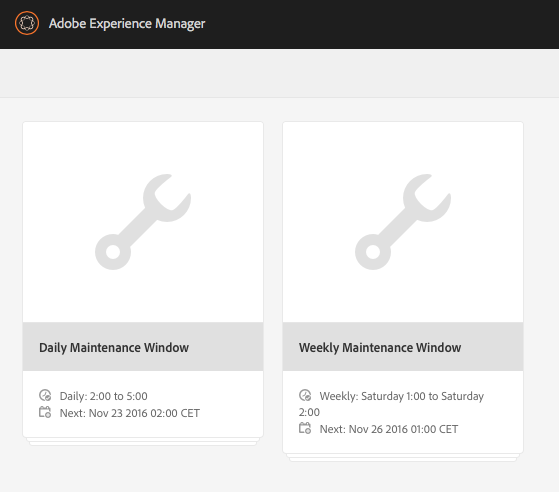
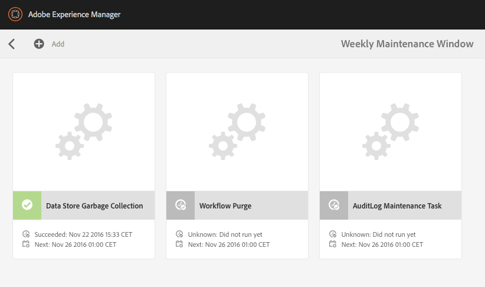

# Archivio dati raccolta oggetti inattivi {#data-store-garbage-collection}

Quando una risorsa WCM convenzionale viene rimossa, il riferimento al record dell&#39;archivio dati sottostante può essere rimosso dalla gerarchia dei nodi, ma il record dell&#39;archivio dati stesso rimane. Questo record dell&#39;archivio dati senza riferimento diventa quindi &quot;spazzatura&quot; che non deve essere conservata. Nei casi in cui esistono diverse risorse di rifiuti, è utile sbarazzarsene per preservare lo spazio e ottimizzare le prestazioni di backup e manutenzione del file system.

Nella maggior parte dei casi, un&#39;applicazione WCM tende a raccogliere informazioni ma non a eliminarle con la stessa frequenza. Anche se vengono aggiunte nuove immagini, anche in sostituzione delle versioni precedenti, il sistema di controllo delle versioni mantiene quello vecchio e supporta il ripristino, se necessario. Pertanto, la maggior parte dei contenuti che consideriamo come aggiunta al sistema viene effettivamente conservata in modo permanente. Quindi qual è la fonte tipica di &quot;spazzatura&quot; nel deposito in cui potremmo voler ripulire?

AEM utilizza l’archivio come archivio per una serie di attività interne e di gestione delle risorse:

* Pacchetti generati e scaricati
* File temporanei creati per la replica di pubblicazione
* Payload del flusso di lavoro
* Risorse create temporaneamente durante il rendering DAM

Quando uno qualsiasi di questi oggetti temporanei è sufficientemente grande da richiedere l&#39;archiviazione nell&#39;archivio dati e quando l&#39;oggetto alla fine smette di essere utilizzato, il record dell&#39;archivio dati stesso rimane come &quot;spazzatura&quot;. In una tipica applicazione di authoring/pubblicazione WCM, la più grande fonte di rifiuti di questo tipo è comunemente il processo di attivazione di pubblicazione. Quando i dati vengono replicati in Pubblica, vengono raccolti per la prima volta nelle raccolte in un formato di dati efficiente chiamato &quot;Durbo&quot; e memorizzati nell&#39;archivio sotto `/var/replication/data`. I bundle di dati sono spesso più grandi della soglia di dimensione critica per l&#39;archivio dati e quindi vengono archiviati come record dell&#39;archivio dati. Al termine della replica, il nodo in `/var/replication/data` viene eliminato, ma il record dell&#39;archivio dati rimane come &quot;spazzatura&quot;.

Un&#39;altra fonte di rifiuti recuperabili sono i pacchetti. I dati del pacchetto, come tutto il resto, vengono memorizzati nell’archivio e quindi per i pacchetti di dimensioni superiori a 4 KB, nell’archivio dati. Nel corso di un progetto di sviluppo o nel tempo durante la manutenzione di un sistema, i pacchetti possono essere generati e ricostruiti più volte, ogni build determina un nuovo record dell&#39;archivio dati, orfando il record della build precedente.

## Come funziona la raccolta degli oggetti inattivi nell’archivio dati? {#how-does-data-store-garbage-collection-work}

Se il repository è stato configurato con un archivio dati esterno, [la raccolta degli oggetti inattivi dell&#39;archivio dati viene eseguita automaticamente](/help/sites-administering/data-store-garbage-collection.md#automating-data-store-garbage-collection) come parte della finestra Manutenzione settimanale. L&#39;amministratore di sistema può anche [eseguire manualmente la raccolta degli oggetti dell&#39;archivio dati](#running-data-store-garbage-collection) se necessario. In generale, si consiglia di eseguire periodicamente la raccolta degli oggetti inattivi nell’archivio dati, ma di tenere conto dei seguenti fattori nella pianificazione delle raccolte di oggetti inattivi nell’archivio dati:

* Le raccolte di oggetti inattivi dell’archivio dati richiedono tempo e possono influire sulle prestazioni, pertanto dovrebbero essere pianificate di conseguenza.
* La rimozione dei record di oggetti inattivi dell’archivio dati non influisce sulle prestazioni normali, pertanto questa non è un’ottimizzazione delle prestazioni.
* Se l&#39;utilizzo dello storage e i fattori correlati, come i tempi di backup, non rappresentano un problema, allora la raccolta degli oggetti inattivi dell&#39;archivio dati potrebbe essere rinviata in modo sicuro.

Il Garbage Collector dell&#39;archivio dati nota prima la marca temporale corrente all&#39;inizio del processo. La raccolta viene quindi eseguita utilizzando un algoritmo di pattern a punti/sweep multipli.

Nella prima fase, il Garbage Collector dell’archivio dati esegue un attraversamento completo di tutto il contenuto dell’archivio. Per ogni oggetto di contenuto che ha un riferimento a un record dell&#39;archivio dati, ha individuato il file nel file system, eseguendo un aggiornamento dei metadati — modificando l&#39;attributo &quot;last modified&quot; o MTIME. A questo punto i file a cui si accede da questa fase diventano più recenti della marca temporale iniziale della linea di base.

Nella seconda fase, il Garbage Collector dell&#39;archivio dati attraversa la struttura di directory fisica dei dati archiviati nello stesso modo di un &quot;find&quot;. Ha esaminato l&#39;attributo &quot;last modified&quot; o MTIME del file ed effettua la seguente determinazione:

* Se il MTIME è più recente della marca temporale della linea di base iniziale, il file è stato trovato nella prima fase oppure è un file completamente nuovo che è stato aggiunto all&#39;archivio mentre il processo di raccolta era in corso. In uno di questi casi il record è considerato attivo e il file non deve essere cancellato.
* Se il valore MTIME è precedente alla marca temporale della linea di base iniziale, il file non è un file a cui viene fatto riferimento attivamente e viene considerato come un file di eliminazione rimovibile.

Questo approccio funziona bene per un singolo nodo con un archivio dati privato. Tuttavia l&#39;archivio dati può essere condiviso e, se ciò significa che i riferimenti live potenzialmente attivi ai record dell&#39;archivio dati di altri archivi non sono controllati e i file di riferimento attivi possono essere rimossi erroneamente. È fondamentale che l’amministratore di sistema comprenda la natura condivisa dell’archivio dati prima di pianificare qualsiasi raccolta di oggetti inattivi e utilizzi solo il semplice processo integrato di raccolta degli oggetti inattivi dell’archivio dati quando è noto che l’archivio dati non è condiviso.

>[!NOTE]
>
>Quando si esegue la raccolta oggetti inattivi in una configurazione dell’archivio dati in cluster o condiviso (con Mongo o Segment Tar), il registro potrebbe visualizzare avvisi sull’impossibilità di eliminare determinati ID BLOB. Questo accade perché gli ID BLOB eliminati in una precedente raccolta oggetti inattivi vengono erroneamente referenziati da altri nodi cluster o condivisi che non hanno informazioni sulle eliminazioni degli ID. Di conseguenza, quando si esegue la raccolta oggetti inattivi, viene registrato un avviso quando si tenta di eliminare un ID già eliminato nell’ultima esecuzione. Questo comportamento non influisce sulle prestazioni o sulle funzionalità.

## Esecuzione della raccolta degli oggetti inattivi dell&#39;archivio dati {#running-data-store-garbage-collection}

Esistono tre modi per eseguire la raccolta degli oggetti inattivi dell’archivio dati, a seconda della configurazione dell’archivio dati in cui AEM in esecuzione:

1. Via [Pulizia revisioni](/help/sites-deploying/revision-cleanup.md) - un meccanismo di raccolta degli oggetti inattivi solitamente utilizzato per la pulizia dell&#39;archivio nodi.

1. Via [Raccolta rifiuti dell&#39;archivio dati](/help/sites-administering/data-store-garbage-collection.md#running-data-store-garbage-collection-via-the-operations-dashboard) - un meccanismo di raccolta degli oggetti inattivi specifico per gli archivi di dati esterni, disponibile nel dashboard delle operazioni.
1. Tramite il [Console JMX](/help/sites-administering/jmx-console.md).

Se TarMK viene utilizzato sia come archivio nodi che come archivio dati, allora Revision Cleanup può essere utilizzato per la raccolta degli oggetti inattivi sia dell&#39;archivio nodi che dell&#39;archivio dati. Tuttavia, se un archivio dati esterno è configurato, ad esempio Archivio dati del file system, la raccolta degli oggetti inattivi dell&#39;archivio dati deve essere attivata in modo esplicito separatamente dal cleanup delle revisioni. La raccolta degli oggetti inattivi dell’archivio dati può essere attivata tramite il dashboard delle operazioni o la console JMX.

La tabella seguente mostra il tipo di raccolta degli oggetti inattivi dell’archivio dati che deve essere utilizzato per tutte le distribuzioni di archiviazione dati supportate nel AEM 6:

<table>
 <tbody>
  <tr>
   <td><strong>Archivio nodi</strong><br /> </td>
   <td><strong>Archiviazione dati</strong></td>
   <td><strong>Meccanismo di raccolta dei rifiuti</strong><br /> </td>
  </tr>
  <tr>
   <td>TarMK</td>
   <td>TarMK</td>
   <td>Pulizia revisioni (i binari sono allineati con l'archivio segmenti)</td>
  </tr>
  <tr>
   <td>TarMK</td>
   <td>File system esterno</td>
   <td><p>Attività di raccolta degli oggetti inattivi nell’archivio dati tramite il dashboard delle operazioni</p> <p>Console JMX</p> </td>
  </tr>
  <tr>
   <td>MongoDB</td>
   <td>MongoDB</td>
   <td><p>Attività di raccolta degli oggetti inattivi nell’archivio dati tramite il dashboard delle operazioni</p> <p>Console JMX</p> </td>
  </tr>
  <tr>
   <td>MongoDB</td>
   <td>File system esterno</td>
   <td><p>Attività di raccolta degli oggetti inattivi nell’archivio dati tramite il dashboard delle operazioni</p> <p>Console JMX</p> </td>
  </tr>
 </tbody>
</table>

### Esecuzione della raccolta degli oggetti inattivi dell’archivio dati tramite il dashboard delle operazioni {#running-data-store-garbage-collection-via-the-operations-dashboard}

Finestra di manutenzione settimanale integrata, disponibile tramite [Dashboard delle operazioni](/help/sites-administering/operations-dashboard.md), contiene un&#39;attività incorporata per attivare la Raccolta rifiuti dell&#39;archivio dati all&#39;1 del mattino della domenica.

Se devi eseguire la raccolta degli oggetti inattivi dell’archivio dati al di fuori di questo periodo di tempo, puoi attivarla manualmente tramite il dashboard delle operazioni.

Prima di eseguire la raccolta degli oggetti inattivi dell&#39;archivio dati è necessario verificare che non siano in esecuzione backup in quel momento.

1. Apri il dashboard delle operazioni tramite **Navigazione** -> **Strumenti** -> **Operazioni** -> **Manutenzione**.
1. Tocca o fai clic su **Finestra Manutenzione settimanale**.

   

1. Seleziona la **Raccolta rifiuti dell&#39;archivio dati** quindi tocca o fai clic su **Esegui** icona.

   

1. La raccolta degli oggetti inattivi dell&#39;archivio dati viene eseguita e il relativo stato viene visualizzato nel dashboard.

   

>[!NOTE]
>
>L&#39;attività Archivio dati raccolta oggetti inattivi sarà visibile solo se hai configurato un archivio dati file esterno. Vedi [Configurazione degli archivi di nodi e degli archivi di dati nel AEM 6](/help/sites-deploying/data-store-config.md#file-data-store) per informazioni su come impostare un archivio dati file.

### Esecuzione della raccolta degli oggetti inattivi dell’archivio dati tramite la console JMX {#running-data-store-garbage-collection-via-the-jmx-console}

Questa sezione descrive come eseguire manualmente la raccolta degli oggetti inattivi dell’archivio dati tramite la console JMX. Se l&#39;installazione è configurata senza un archivio dati esterno, questo non si applica all&#39;installazione. Vedi invece le istruzioni su come eseguire la pulizia delle revisioni in [Manutenzione dell’archivio](/help/sites-deploying/storage-elements-in-aem-6.md#maintaining-the-repository).

>[!NOTE]
>
>Se si esegue TarMK con un archivio dati esterno, è necessario eseguire prima Revision Cleanup per rendere efficace la raccolta degli oggetti inattivi.

Per eseguire la raccolta degli oggetti inattivi:

1. Nella console di gestione Apache Felix OSGi, evidenzia la **Principale** e seleziona **JMX** dal menu seguente.
1. Quindi, cerca e fai clic su **Gestione archivi** MBean (o vai a `https://<host>:<port>/system/console/jmx/org.apache.jackrabbit.oak%3Aname%3Drepository+manager%2Ctype%3DRepositoryManagement`).
1. Fai clic su **startDataStoreGC(booleano markOnly)**.
1. immetti &quot;`true`&quot; per `markOnly` se richiesto:

   | **Opzione** | **Descrizione** |
   |---|---|
   | markOnly booleano | Impostare su true per contrassegnare solo i riferimenti e non eseguire la sweep nell&#39;operazione di marcatura e sweep. Questa modalità deve essere utilizzata quando il BlobStore sottostante è condiviso tra più archivi diversi. Per tutti gli altri casi impostalo su false per eseguire la raccolta completa degli oggetti inattivi. |

1. Fai clic su **Richiama**. CRX esegue la raccolta degli oggetti inattivi e indica quando è stata completata.

>[!NOTE]
>
>La raccolta degli oggetti inattivi dell&#39;archivio dati non raccoglie i file che sono stati eliminati nelle ultime 24 ore.

>[!NOTE]
>
>L&#39;attività di raccolta oggetti inattivi dell&#39;archivio dati verrà avviata solo se hai configurato un archivio dati file esterno. Se non è stato configurato un archivio dati file esterno, l&#39;attività restituirà il messaggio `Cannot perform operation: no service of type BlobGCMBean found` dopo la chiamata. Vedi [Configurazione degli archivi di nodi e degli archivi di dati nel AEM 6](/help/sites-deploying/data-store-config.md#file-data-store) per informazioni su come impostare un archivio dati file.

## Automazione della raccolta degli oggetti inattivi nell’archivio dati {#automating-data-store-garbage-collection}

Se possibile, è necessario eseguire la raccolta degli oggetti inattivi dell&#39;archivio dati quando il sistema non è caricato, ad esempio la mattina.

Finestra di manutenzione settimanale integrata, disponibile tramite [Dashboard delle operazioni](/help/sites-administering/operations-dashboard.md), contiene un&#39;attività incorporata per attivare la Raccolta rifiuti dell&#39;archivio dati all&#39;1 del mattino della domenica. È inoltre necessario verificare che al momento non siano in esecuzione backup. L&#39;inizio della finestra di manutenzione può essere personalizzato tramite il dashboard, a seconda delle necessità.

>[!NOTE]
>
>Il motivo per non eseguirlo contemporaneamente è in modo che anche i file dell&#39;archivio dati vecchi (e inutilizzati) vengano sottoposti a backup, in modo che se è necessario eseguire il rollback a una vecchia revisione, i binari siano ancora presenti nel backup.

Se non desideri eseguire la raccolta oggetti inattivi dell&#39;archivio dati con la finestra Manutenzione settimanale nel Dashboard delle operazioni, puoi anche automatizzarla utilizzando i client HTTP wget o curl. Di seguito è riportato un esempio di come automatizzare il backup utilizzando curl:

>[!CAUTION]
>
>Nell&#39;esempio seguente `curl` potrebbero essere necessari la configurazione di diversi parametri per l&#39;istanza; ad esempio, il nome host ( `localhost`), porta ( `4502`), password amministratore ( `xyz`) e vari parametri per l&#39;archivio dati effettivo della raccolta degli oggetti inattivi.

Ecco un esempio di comando curl per richiamare l&#39;archivio dati garbage collection tramite la riga di comando:

```shell
curl -u admin:admin -X POST --data markOnly=true  https://localhost:4503/system/console/jmx/org.apache.jackrabbit.oak"%"3Aname"%"3Drepository+manager"%"2Ctype"%"3DRepositoryManagement/op/startDataStoreGC/boolean
```

Il comando curl ritorna immediatamente.

## Verifica della coerenza dell’archivio dati {#checking-data-store-consistency}

Il controllo di coerenza dell&#39;archivio dati segnalerà tutti i file binari dell&#39;archivio dati mancanti ma a cui si fa ancora riferimento. Per avviare un controllo di coerenza, effettua le seguenti operazioni:

1. Vai alla console JMX. Per informazioni su come utilizzare la console JMX, vedi [articolo](/help/sites-administering/jmx-console.md#using-the-jmx-console).
1. Cerca il **BlobGarbageCollection** Mbean e cliccatela.
1. Fai clic sul pulsante `checkConsistency()` link.

Al termine del controllo di coerenza, un messaggio mostra il numero di binari segnalati come mancanti. Se il numero è maggiore di 0, controlla il `error.log` per maggiori dettagli sui binari mancanti.

Di seguito trovi un esempio di come vengono segnalati i file binari mancanti nei registri:

```xml
11:32:39.673 INFO [main] MarkSweepGarbageCollector.java:600 Consistency check found [1] missing blobs
```

```xml
11:32:39.673 WARN [main] MarkSweepGarbageCollector.java:602 Consistency check failure intheblob store : DataStore backed BlobStore [org.apache.jackrabbit.oak.plugins.blob.datastore.OakFileDataStore], check missing candidates in file /tmp/gcworkdir-1467352959243/gccand-1467352959243
```
