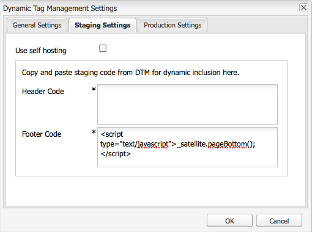

# Integrazione con Adobe Dynamic Tag Management {#integrating-with-adobe-dynamic-tag-management}

Integrare [Adobe Dynamic Tag Management](https://www.adobe.com/solutions/digital-marketing/dynamic-tag-management.html) con AEM per poter utilizzare le proprietà web di Dynamic Tag Management per tenere traccia AEM siti. Dynamic Tag Management consente agli esperti di marketing di gestire i tag per la raccolta dei dati e di distribuire i dati tra i sistemi di marketing digitale. Ad esempio, utilizza Dynamic Tag Management per raccogliere i dati di utilizzo per il sito web AEM e distribuirli per l’analisi in Adobe Analytics o Adobe Target.

Prima di eseguire l’integrazione, è necessario creare il Tag Management dinamico [proprietà web](https://microsite.omniture.com/t2/help/en_US/dtm/#Web_Properties) tiene traccia del dominio del sito AEM. La [opzioni di hosting](https://microsite.omniture.com/t2/help/en_US/dtm/#Hosting__Embed_Tab) della proprietà web deve essere configurata in modo da poter configurare AEM per accedere alle librerie Tag Management dinamiche.

Dopo aver configurato l’integrazione, le modifiche apportate agli strumenti e alle regole di distribuzione di Dynamic Tag Management non richiedono la modifica della configurazione di Dynamic Tag Management in AEM. Le modifiche sono automaticamente disponibili per AEM.

>[!NOTE]
>
>Se utilizzi DTM con una configurazione proxy personalizzata, devi configurare entrambe le configurazioni proxy del client HTTP, in quanto alcune funzionalità di AEM utilizzano le API 3.x e altre le API 4.x:
>
>* 3.x è configurato con [http://localhost:4502/system/console/configMgr/com.day.commons.httpclient](http://localhost:4502/system/console/configMgr/com.day.commons.httpclient)
>* 4.x è configurato con [http://localhost:4502/system/console/configMgr/org.apache.http.proxyconfigurator](http://localhost:4502/system/console/configMgr/org.apache.http.proxyconfigurator)
>

## Opzioni di distribuzione {#deployment-options}

Le seguenti opzioni di distribuzione influiscono sulla configurazione dell’integrazione con Dynamic Tag Management.

### Hosting dinamico Tag Management {#dynamic-tag-management-hosting}

AEM supporta la versione di Tag Management dinamica ospitata nel cloud o ospitata in AEM.

* In hosting sul cloud: Le librerie JavaScript di Dynamic Tag Management sono memorizzate nel cloud e le pagine AEM vi fanno riferimento direttamente.
* AEM: Dynamic Tag Management genera librerie javascript. AEM utilizza un modello di flusso di lavoro per ottenere e installare le librerie.

Il tipo di hosting utilizzato dall’implementazione determina alcune delle attività di configurazione e implementazione eseguite. Per informazioni sulle opzioni di hosting, vedi [Hosting - Scheda Incorpora](https://microsite.omniture.com/t2/help/en_US/dtm/#Hosting__Embed_Tab) nella Guida di Dynamic Tag Management.

### Libreria di staging e produzione {#staging-and-production-library}

Decidi se l’istanza di authoring AEM utilizza lo staging o il codice di produzione di Tag Management dinamico.

In genere l’istanza di authoring utilizza le librerie di staging di Dynamic Tag Management e l’istanza di produzione utilizza le librerie di produzione. Questo scenario consente di utilizzare l’istanza di authoring per testare le configurazioni Dynamic Tag Management non approvate.

Se necessario, l’istanza di authoring può utilizzare le librerie di produzione. Sono disponibili plug-in per browser Web che consentono di passare dall’utilizzo delle librerie di staging a scopo di test quando le librerie sono ospitate su cloud.

### Utilizzo del gancio di distribuzione Tag Management dinamico {#using-the-dynamic-tag-management-deployment-hook}

Quando AEM ospita le librerie Tag Management dinamiche, puoi utilizzare il servizio gancio di distribuzione Dynamic Tag Management per inviare automaticamente gli aggiornamenti della libreria a AEM. Gli aggiornamenti della libreria vengono inviati quando vengono apportate modifiche alle librerie, ad esempio quando vengono modificate le proprietà web di Dynamic Tag Management .

Per utilizzare il gancio di distribuzione, Dynamic Tag Management deve essere in grado di connettersi all’istanza AEM che ospita le librerie. Devi [abilitare l&#39;accesso a AEM](/help/sites-administering/dtm.md#enabling-access-for-the-deployment-hook-service) per i server Tag Management dinamici.

In alcune circostanze AEM irraggiungibile, ad esempio quando AEM si trova dietro un firewall. In questi casi, puoi utilizzare l’opzione Importazione polling AEM per recuperare periodicamente le librerie. Un&#39;espressione di lavoro cron determina la pianificazione per i download delle librerie.

## Abilitazione dell&#39;accesso al servizio di hook di distribuzione {#enabling-access-for-the-deployment-hook-service}

Abilita il servizio hook di distribuzione Dynamic Tag Management per accedere alle AEM in modo che il servizio possa aggiornare le librerie ospitate da AEM. Specifica l’indirizzo IP dei server Tag Management dinamici che aggiornano le librerie di staging e produzione in base alle esigenze:

* Staging: `107.21.99.31`
* Produzione: `23.23.225.112` e `204.236.240.48`

Esegui la configurazione utilizzando [Console web](/help/sites-deploying/configuring-osgi.md#osgi-configuration-with-the-web-console) o [`sling:OsgiConfig`](/help/sites-deploying/configuring-osgi.md#osgi-configuration-in-the-repository) nodo:

* Nella console Web, utilizza l’elemento Adobe DTM Deploy Hook Configuration nella pagina Configurazione.
* Per una configurazione OSGi, il PID del servizio è `com.adobe.cq.dtm.impl.servlets.DTMDeployHookServlet`.

Nella tabella seguente sono descritte le proprietà da configurare.

| Proprietà della console Web | OSGi, proprietà | Descrizione |
|---|---|---|
| Lista bianca DTM IP | `dtm.staging.ip.whitelist` | Indirizzo IP del server Tag Management dinamico che aggiorna le librerie di staging. |
| Elenco bianco IP DTM di produzione | `dtm.production.ip.whitelist` | Indirizzo IP del server Tag Management dinamico che aggiorna le librerie di produzione. |

## Creazione della configurazione Tag Management dinamica {#creating-the-dynamic-tag-management-configuration}

Crea una configurazione cloud in modo che l’istanza AEM possa autenticarsi con Dynamic Tag Management e interagire con la tua proprietà web.

>[!NOTE]
>
>Evita l&#39;inclusione di due codici di tracciamento di Adobe Analytics sulle tue pagine quando la tua proprietà web DTM include lo strumento Adobe Analytics e stai anche utilizzando [Approfondimenti contenuto](/help/sites-authoring/content-insights.md). Nel tuo [Configurazione cloud di Adobe Analytics](/help/sites-administering/adobeanalytics-connect.md#configuring-the-connection-to-adobe-analytics), seleziona l’opzione Non includere codice di tracciamento .

### Impostazioni generali {#general-settings}

<table>
 <tbody>
  <tr>
   <th>Proprietà</th>
   <th>Descrizione</th>
  </tr>
  <tr>
   <td>Token API</td>
   <td>Il valore della proprietà Token API del tuo account utente Tag Management dinamico. AEM utilizza questa proprietà per l’autenticazione con Dynamic Tag Management.</td>
  </tr>
  <tr>
   <td>Azienda</td>
   <td>Società a cui è associato l'ID di accesso.</td>
  </tr>
  <tr>
   <td>Proprietà</td>
   <td>Nome della proprietà Web creata per la gestione dei tag del sito AEM.</td>
  </tr>
  <tr>
   <td>Includi codice di produzione per Autore</td>
   <td>
Seleziona questa opzione per fare in modo che le istanze di authoring e pubblicazione AEM utilizzino la versione di produzione delle librerie Tag Management dinamiche. 
 
Quando questa opzione non è selezionata, le impostazioni di staging vengono applicate all’istanza dell’autore e le impostazioni di produzione vengono applicate all’istanza di pubblicazione.
 </td>
  </tr>
 </tbody>
</table>

### Proprietà di hosting autonomo - Staging e produzione {#self-hosting-properties-staging-and-production}

Le seguenti proprietà della configurazione di Dynamic Tag Management consentono AEM ospitare le librerie Dynamic Tag Management. Le proprietà consentono AEM scaricare e installare le librerie. Facoltativamente, puoi aggiornare automaticamente le librerie per assicurarti che riflettano eventuali modifiche apportate nell’applicazione di gestione Dynamic Tag Management.

Alcune proprietà utilizzano i valori ottenuti dalla sezione Download libreria della scheda Incorpora per la proprietà Web Tag Management dinamica. Per informazioni, consulta [Download libreria](https://microsite.omniture.com/t2/help/en_US/dtm/#Library_Download) nella Guida di Dynamic Tag Management.

>[!NOTE]
>
>Quando ospiti il bundle Dynamic Tag Management su AEM, prima di creare la configurazione è necessario abilitare Library Download in Dynamic Tag Management. Inoltre, Akamai deve essere abilitato perché Akamai fornisce le librerie per il download.

Quando ospita le librerie Dynamic Tag Management su AEM, AEM configura automaticamente alcune proprietà della proprietà web in base alla configurazione. Vedere le descrizioni nella tabella seguente.

<table>
 <tbody>
  <tr>
   <th>Proprietà</th>
   <th>Descrizione</th>
  </tr>
  <tr>
   <td>Utilizza hosting autonomo</td>
   <td>Seleziona quando ospiti il file della libreria Tag Management dinamica su AEM. Selezionando questa opzione vengono visualizzate le altre proprietà della tabella.</td>
  </tr>
  <tr>
   <td>URL bundle DTM</td>
   <td>URL da utilizzare per scaricare la libreria Tag Management dinamica. Ottieni questo valore dalla sezione Download URL della pagina Library Download di Dynamic Tag Management. Per motivi di sicurezza, questo valore deve essere configurato manualmente.</td>
  </tr>
  <tr>
   <td>Flusso di lavoro per download</td>
   <td>
Modello di flusso di lavoro da utilizzare per scaricare e installare la libreria Dynamic Tag Management. Il modello predefinito è Download del bundle DTM predefinito. Utilizzare questo modello a meno che non sia stato creato un modello personalizzato.
 
Il flusso di lavoro di download predefinito attiva automaticamente le librerie al momento del download.
 </td>
  </tr>
  <tr>
   <td>Suggerimento dominio</td>
   <td>
(Facoltativo) Il dominio del server AEM che ospita la libreria Tag Management dinamica. Specifica un valore per ignorare il dominio predefinito configurato per la <a href="/help/sites-developing/externalizer.md">Servizio Day CQ Link Externalizer</a>.
 
Quando è connesso a Dynamic Tag Management, AEM utilizza questo valore per configurare il Percorso HTTP di staging o il Percorso HTTP di produzione delle proprietà Download della libreria per la proprietà Web di Dynamic Tag Management.
 </td>
  </tr>
  <tr>
   <td>Suggerimento dominio sicuro</td>
   <td>
(Facoltativo) Il dominio del server AEM che ospita la libreria Tag Management dinamica tramite HTTPS. Specifica un valore per ignorare il dominio predefinito configurato per la <a href="/help/sites-developing/externalizer.md">Servizio Day CQ Link Externalizer</a>.
 
Quando si è connessi a Dynamic Tag Management, AEM utilizza questo valore per configurare il Percorso HTTPS di staging o il Percorso HTTPS di produzione delle proprietà Download della libreria per la proprietà web Dynamic Tag Management.
 </td>
  </tr>
  <tr>
   <td>Segreto condiviso</td>
   <td>
(Facoltativo) Il segreto condiviso da utilizzare per decrittografare il download. Ottieni questo valore dal campo Segreto condiviso della pagina Download libreria di Dynamic Tag Management.
 
<strong>Nota:</strong> Devi avere la <a href="https://www.openssl.org/docs/apps/openssl.html">OpenSSL</a> librerie installate nel computer in cui è installato AEM in modo che AEM decrittografare le librerie scaricate.
 </td>
  </tr>
  <tr>
   <td>Abilita importazione polling</td>
   <td>
(Facoltativo) Seleziona per scaricare e installare periodicamente la libreria Dynamic Tag Management per assicurarti di utilizzare una versione aggiornata. Quando questa opzione è selezionata, Dynamic Tag Management non invia richieste HTTP POST all’URL di collegamento di distribuzione.
 
AEM configura automaticamente la proprietà Deploy Hook URL delle proprietà Library Download per la proprietà Web Tag Management dinamica. Se selezionata, la proprietà viene configurata senza alcun valore. Se non è selezionata, la proprietà viene configurata con l’URL della configurazione di Dynamic Tag Management.
 
Abilita l’importazione di polling quando l’hook di distribuzione di Dynamic Tag Management non può connettersi a AEM, ad esempio quando AEM è dietro un firewall.
 </td>
  </tr>
  <tr>
   <td>Espressione di pianificazione</td>
   <td>(Viene visualizzato ed è richiesto se l’opzione Abilita importazione polling è selezionata). Espressione cron che controlla quando vengono scaricate le librerie di Dynamic Tag Management.</td>
  </tr>
 </tbody>
</table>

### Proprietà di hosting cloud - Staging e produzione {#cloud-hosting-properties-staging-and-production}

Puoi configurare le seguenti proprietà per la configurazione di Dynamic Tag Management quando la configurazione di Dynamic Tag è in hosting sul cloud.

<table>
 <tbody>
  <tr>
   <th>Proprietà</th>
   <th>Descrizione</th>
  </tr>
  <tr>
   <td>Utilizza hosting autonomo</td>
   <td>Deseleziona questa opzione quando il file della libreria Tag Management dinamica è ospitato nel cloud.</td>
  </tr>
  <tr>
   <td>Codice intestazione</td>
   <td>
Il codice intestazione per la gestione temporanea ottenuto da Dynamic Tag Management per l'host. Questo valore viene popolato automaticamente quando ci si connette a Dynamic Tag Management.
 
 Per visualizzare il codice in Dynamic Tag Management, fai clic sulla scheda Incorpora , quindi fai clic sul nome host. Espandi la sezione Header Code (Codice di intestazione) e fai clic su Copy Embed Code (Copia codice di incorporamento) del Staging Embed Code (Codice di incorporamento di staging) o sull’area Production Embed Code (Codice di incorporamento di produzione) come richiesto.
 </td>
  </tr>
  <tr>
   <td>Codice piè di pagina</td>
   <td>
Il codice a piè di pagina per lo staging ottenuto da Dynamic Tag Management per l'host. Questo valore viene popolato automaticamente quando ci si connette a Dynamic Tag Management.
 
Per visualizzare il codice in Dynamic Tag Management, fai clic sulla scheda Incorpora , quindi fai clic sul nome host. Espandi la sezione Codice piè di pagina e fai clic su Copia codice di incorporamento del codice di incorporamento della gestione temporanea o sull’area Codice di incorporamento produzione , a seconda delle esigenze.
 </td>
  </tr>
 </tbody>
</table>

La procedura seguente utilizza l’interfaccia touch per configurare l’integrazione con Dynamic Tag Management.

1. Nella barra, fai clic su Strumenti > Operazioni > Cloud > Cloud Services.
1. Nell’area di Dynamic Tag Management, per l’aggiunta di una configurazione viene visualizzato uno dei seguenti collegamenti:

   * Fai clic su Configura ora se si tratta della prima configurazione che stai aggiungendo.
   * Fai clic su Mostra configurazioni, quindi sul collegamento + accanto a Configurazioni disponibili, se sono state create una o più configurazioni.

   

1. Digita un titolo per la configurazione, quindi fai clic su Crea.
1. Nel campo Token API , immetti il valore della proprietà Token API del tuo account utente Tag Management dinamico.

   Per ottenere il valore del token API, contatta l’Assistenza clienti DTM.

   >[!NOTE]
   >
   >Il token API non scade finché l’utente di Dynamic Tag Management non lo richiede esplicitamente.

   

1. Fai clic su Connetti a DTM. AEM esegue l’autenticazione con Dynamic Tag Management e recupera l’elenco di società a cui è associato l’account.
1. Seleziona l&#39;azienda, quindi seleziona la proprietà che stai utilizzando per tenere traccia del tuo sito AEM.
1. Se utilizzi il codice di staging sull’istanza di authoring, deseleziona Includi codice di produzione sull’autore.
1. Immetti i valori delle proprietà nella scheda Impostazioni di staging e nella scheda Impostazioni produzione, se necessario, quindi fai clic su OK.

## Download manuale della libreria Tag Management dinamica {#manually-downloading-the-dynamic-tag-management-library}

Scarica manualmente le librerie Dynamic Tag Management per aggiornarle immediatamente su AEM. Ad esempio, scarica manualmente quando desideri testare una libreria aggiornata prima che venga pianificato il download automatico della libreria da parte dell’importatore di sondaggi.

1. Nella barra, fai clic su Strumenti > Operazioni > Cloud > Cloud Services.
1. Nell’area di Dynamic Tag Management, fai clic su Mostra configurazioni e quindi sulla configurazione.
1. Nell’area Impostazioni di staging o nell’area Impostazioni produzione, fai clic sul pulsante Flusso di lavoro di download del trigger per scaricare e distribuire il bundle della libreria.

   

>[!NOTE]
>
>I file scaricati sono memorizzati in `/etc/clientlibs/dtm/my config/companyID/propertyID/servertype`.
>
>I seguenti sono tratti direttamente dal tuo [Configurazione DTM](#creating-the-dynamic-tag-management-configuration).
>
>* `myconfig`
>* `companyID`
>* `propertyID`
>* `servertype`
>

## Associazione di una configurazione Tag Management dinamica al sito {#associating-a-dynamic-tag-management-configuration-with-your-site}

Associa la configurazione di Dynamic Tag Management alle pagine del sito web in modo che AEM aggiunga lo script richiesto alle pagine. Associa la pagina principale del sito alla configurazione. Tutti i discendenti di quella pagina ereditano l’associazione. Se necessario, è possibile ignorare l’associazione in una pagina discendente.

Segui la procedura seguente per associare una pagina e i discendenti a una configurazione di Dynamic Tag Management.

1. Apri la pagina principale del sito nell’interfaccia classica.
1. Nella barra laterale vengono aperte le proprietà della pagina.
1. Nella scheda Cloud Services fare clic su Aggiungi servizio, selezionare Tag Management dinamico, quindi fare clic su OK.

   

1. Utilizzare il menu a discesa Dynamic Tag Management per selezionare la configurazione, quindi fare clic su OK.

Per ignorare l’associazione di configurazione ereditata per una pagina, attenersi alla procedura descritta di seguito. L’override influisce sulla pagina e su tutti i discendenti della pagina.

1. Apri la pagina nell’interfaccia classica.
1. Nella barra laterale vengono aperte le proprietà della pagina.
1. Nella scheda Cloud Services fare clic sull&#39;icona a forma di lucchetto accanto alla proprietà Ereditato da, quindi fare clic su Sì nella finestra di dialogo di conferma.

   

1. Rimuovere o selezionare una diversa configurazione di Dynamic Tag Management, quindi fare clic su OK.
