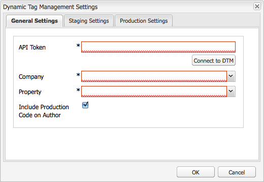

# Integrazione con  Gestione tag dinamica dei Adobi {#integrating-with-adobe-dynamic-tag-management}

Integrare [ Gestione tag dinamica dei Adobi](https://www.adobe.com/solutions/digital-marketing/dynamic-tag-management.html) con AEM in modo da poter utilizzare le proprietà Web di Gestione tag dinamica per tenere traccia AEM siti. Gestione tag dinamica consente agli esperti di marketing di gestire i tag per la raccolta dei dati e la distribuzione dei dati tra i sistemi di marketing digitale. Ad esempio, utilizzate Gestione tag dinamica per raccogliere i dati di utilizzo per il sito Web AEM e distribuire i dati per l&#39;analisi in  Adobe Analytics o  Adobe Target.

Prima di procedere all&#39;integrazione, è necessario creare la proprietà di gestione tag dinamica [web](https://microsite.omniture.com/t2/help/en_US/dtm/#Web_Properties) che tenga traccia del dominio del sito AEM. Le [opzioni di hosting](https://microsite.omniture.com/t2/help/en_US/dtm/#Hosting__Embed_Tab) della proprietà Web devono essere configurate in modo da poter configurare AEM per accedere alle librerie Gestione tag dinamica.

Dopo aver configurato l’integrazione, le modifiche apportate agli strumenti e alle regole di distribuzione Gestione tag dinamica non richiedono la modifica della configurazione Gestione tag dinamica in AEM. Le modifiche sono automaticamente disponibili per AEM.

>[!NOTE]
>
>Se utilizzi Gestione dinamica dei tag con una configurazione proxy personalizzata, devi configurare sia le configurazioni proxy del client HTTP che alcune funzionalità di AEM utilizzano le API 3.x, sia quelle di 4.x:
>
>* 3.x è configurato con [http://localhost:4502/system/console/configMgr/com.day.commons.httpclient](http://localhost:4502/system/console/configMgr/com.day.commons.httpclient)
>* 4.x è configurato con [http://localhost:4502/system/console/configMgr/org.apache.http.proxyconfigurator](http://localhost:4502/system/console/configMgr/org.apache.http.proxyconfigurator)

>

## Opzioni di distribuzione {#deployment-options}

Le seguenti opzioni di distribuzione influiscono sulla configurazione dell&#39;integrazione con Gestione tag dinamica.

### Gestione tag dinamica hosting {#dynamic-tag-management-hosting}

AEM supporta la gestione tag dinamica ospitata nel cloud o ospitata in AEM.

* In hosting sul cloud: Le librerie JavaScript di Gestione tag dinamica sono memorizzate nel cloud e le pagine AEM vi fanno riferimento direttamente.
* AEM: Gestione tag dinamica genera librerie JavaScript. AEM utilizza un modello di flusso di lavoro per ottenere e installare le librerie.

Il tipo di hosting utilizzato dall&#39;implementazione determina alcune delle attività di configurazione e implementazione che esegui. Per informazioni sulle opzioni di hosting, vedere [Hosting - Embed Tab](https://microsite.omniture.com/t2/help/en_US/dtm/#Hosting__Embed_Tab) nella Guida di Gestione tag dinamica.

### Libreria produzione e gestione temporanea {#staging-and-production-library}

Decidete se l&#39;istanza di autore AEM utilizza il codice di staging o di produzione Gestione tag dinamica.

In genere l’istanza di creazione utilizza le librerie di staging Gestione tag dinamica e l’istanza di produzione utilizza le librerie di produzione. Questo scenario consente di utilizzare l’istanza di creazione per testare le configurazioni di Gestione tag dinamica non approvate.

Se necessario, l’istanza di creazione può usare le librerie di produzione. Sono disponibili plug-in per browser Web che consentono di passare dall&#39;utilizzo di librerie di staging a scopo di test quando le librerie sono ospitate nel cloud.

### Utilizzo del gruppo di distribuzione Gestione tag dinamica {#using-the-dynamic-tag-management-deployment-hook}

Quando AEM ospita le librerie Gestione tag dinamica, puoi utilizzare il servizio gancio di distribuzione Gestione tag dinamica per inviare automaticamente gli aggiornamenti della libreria a AEM. Gli aggiornamenti della libreria vengono inviati in push quando vengono apportate modifiche alle librerie, ad esempio quando vengono modificate le proprietà Web di Gestione tag dinamica.

Per utilizzare il gancio di distribuzione, Gestione tag dinamica deve essere in grado di connettersi all&#39;istanza AEM che ospita le librerie. È necessario [abilitare l&#39;accesso a AEM](/help/sites-administering/dtm.md#enabling-access-for-the-deployment-hook-service) per i server Gestione tag dinamica.

In alcune circostanze AEM irraggiungibile, ad esempio quando AEM si trova dietro un firewall. In questi casi, potete utilizzare l&#39;opzione Importazione polling AEM per recuperare periodicamente le librerie. Un&#39;espressione di processo cron imposta la pianificazione per i download della libreria.

## Abilitazione dell&#39;accesso al servizio di assistenza alla distribuzione {#enabling-access-for-the-deployment-hook-service}

Abilita il servizio gancio di distribuzione Gestione tag dinamica per accedere ai AEM in modo che il servizio possa aggiornare le librerie AEM ospitate. Specificate l&#39;indirizzo IP dei server Gestione tag dinamica che aggiornano le librerie di staging e produzione come richiesto:

* Staging: `107.21.99.31`
* Produzione: `23.23.225.112` e `204.236.240.48`

Eseguire la configurazione utilizzando il nodo [Console Web](/help/sites-deploying/configuring-osgi.md#osgi-configuration-with-the-web-console) o [`sling:OsgiConfig`](/help/sites-deploying/configuring-osgi.md#osgi-configuration-in-the-repository):

* Nella console Web, utilizza l’elemento di configurazione del gruppo di distribuzione DTM di Adobe  nella pagina Configurazione.
* Per una configurazione OSGi, il servizio PID è `com.adobe.cq.dtm.impl.servlets.DTMDeployHookServlet`.

Nella tabella seguente sono descritte le proprietà da configurare.

| Console Web, proprietà | OSGi, proprietà | Descrizione |
|---|---|---|
| Gestione dinamica dei tag - Elenco bianco IP | `dtm.staging.ip.whitelist` | Indirizzo IP del server Gestione tag dinamica che aggiorna le librerie di staging. |
| Elenco bianco IP DTM produzione | `dtm.production.ip.whitelist` | L&#39;indirizzo IP del server Gestione tag dinamica che aggiorna le librerie di produzione. |

## Creazione della configurazione di gestione tag dinamica {#creating-the-dynamic-tag-management-configuration}

Create una configurazione cloud in modo che l&#39;istanza AEM possa autenticarsi con Gestione tag dinamica e interagire con la vostra proprietà Web.

>[!NOTE]
>
>Evitare di includere  codici di monitoraggio Adobe Analytics sulle pagine quando la proprietà Web di Gestione dinamica dei tag include lo strumento Adobe Analytics  e si utilizza anche [Content Insight](/help/sites-authoring/content-insights.md). Nella [ configurazione cloud Adobe Analytics](/help/sites-administering/adobeanalytics-connect.md#configuring-the-connection-to-adobe-analytics), selezionare l&#39;opzione Non includere codice di tracciamento.

### Impostazioni generali {#general-settings}

<table>
 <tbody>
  <tr>
   <th>Proprietà</th>
   <th>Descrizione</th>
  </tr>
  <tr>
   <td>Token API</td>
   <td>Il valore della proprietà Token API dell'account utente Gestione tag dinamica. AEM utilizza questa proprietà per l'autenticazione con Gestione tag dinamica.</td>
  </tr>
  <tr>
   <td>Azienda</td>
   <td>Società a cui è associato l’ID di accesso.</td>
  </tr>
  <tr>
   <td>Proprietà</td>
   <td>Nome della proprietà Web creata per la gestione dei tag per il sito AEM.</td>
  </tr>
  <tr>
   <td>Includi codice di produzione per Autore</td>
   <td>
Selezionate questa opzione per fare in modo che le istanze di creazione e pubblicazione AEM utilizzino la versione di produzione delle librerie Gestione tag dinamica. 
 
Se questa opzione non è selezionata, le impostazioni di gestione temporanea vengono applicate all’istanza di creazione e le impostazioni di produzione vengono applicate all’istanza di pubblicazione.
 </td>
  </tr>
 </tbody>
</table>

### Proprietà di hosting autonomo - Produzione e allestimento {#self-hosting-properties-staging-and-production}

Le seguenti proprietà della configurazione Gestione tag dinamica consentono AEM ospitare le librerie Gestione tag dinamica. Le proprietà consentono AEM scaricare e installare le librerie. Facoltativamente, puoi aggiornare automaticamente le librerie per assicurarti che riflettano eventuali modifiche apportate nell’applicazione Gestione tag dinamica.

Alcune proprietà utilizzano i valori ottenuti dalla sezione Download libreria della scheda Incorpora per la proprietà Web Gestione tag dinamica. Per ulteriori informazioni, vedere [Download della libreria](https://microsite.omniture.com/t2/help/en_US/dtm/#Library_Download) nella Guida alla gestione tag dinamica.

>[!NOTE]
>
>Quando ospitate il bundle Gestione tag dinamica su AEM, prima di creare la configurazione è necessario abilitare il download della libreria in Gestione tag dinamica. Inoltre, Akamai deve essere abilitato perché Akamai fornisce le librerie per il download.

Quando si ospitano le librerie Gestione tag dinamica su AEM, AEM configura automaticamente alcune proprietà della proprietà Web in base alla configurazione. Vedere le descrizioni nella tabella seguente.

<table>
 <tbody>
  <tr>
   <th>Proprietà</th>
   <th>Descrizione</th>
  </tr>
  <tr>
   <td>Usa hosting autonomo</td>
   <td>Seleziona quando ospitare il file di libreria Gestione tag dinamica su AEM. Selezionando questa opzione vengono visualizzate le altre proprietà della tabella.</td>
  </tr>
  <tr>
   <td>URL bundle DTM</td>
   <td>L'URL da utilizzare per scaricare la libreria Gestione tag dinamica. Ottenete questo valore dalla sezione Download URL della pagina Download libreria di Gestione tag dinamica. Per motivi di sicurezza, questo valore deve essere configurato manualmente.</td>
  </tr>
  <tr>
   <td>Flusso di lavoro per download</td>
   <td>
Modello di flusso di lavoro da utilizzare per scaricare e installare la libreria Gestione tag dinamica. Il modello predefinito è Download DTM Bundle predefinito. Utilizzare questo modello a meno che non sia stato creato un modello personalizzato.
 
Il flusso di lavoro predefinito per il download attiva automaticamente le librerie al momento del download.
 </td>
  </tr>
  <tr>
   <td>Suggerimento dominio</td>
   <td>
(Facoltativo) Il dominio del server AEM che ospita la libreria Gestione tag dinamica. Specificate un valore per ignorare il dominio predefinito configurato per il servizio <a href="/help/sites-developing/externalizer.md">Day CQ Link Externalizer Service</a>.
 
Quando è connesso a Gestione tag dinamica, AEM utilizza questo valore per configurare il Percorso HTTP temporaneo o il Percorso HTTP di produzione delle proprietà Download della libreria per la proprietà Web Gestione tag dinamica.
 </td>
  </tr>
  <tr>
   <td>Suggerimento dominio sicuro</td>
   <td>
(Facoltativo) Il dominio del server AEM che ospita la libreria Gestione tag dinamica tramite HTTPS. Specificate un valore per ignorare il dominio predefinito configurato per il servizio <a href="/help/sites-developing/externalizer.md">Day CQ Link Externalizer Service</a>.
 
Quando è connesso a Gestione tag dinamica, AEM utilizza questo valore per configurare il Percorso HTTPS di gestione temporanea o il Percorso HTTPS di produzione delle proprietà Download della libreria per la proprietà Web Gestione tag dinamica.
 </td>
  </tr>
  <tr>
   <td>Segreto condiviso</td>
   <td>
(Facoltativo) Il segreto condiviso da utilizzare per decrittografare il download. Ottenete questo valore dal campo Segreto condiviso della pagina Download della libreria di Gestione tag dinamica.
 
<strong>Nota:</strong> nel computer in cui è installato AEM devono essere installate le librerie   OpenSSL, in modo che AEM decrittografare le librerie scaricate.
 </td>
  </tr>
  <tr>
   <td>Abilita importazione polling</td>
   <td>
(Facoltativo) Selezionare questa opzione per scaricare e installare periodicamente la libreria Gestione tag dinamica per verificare di utilizzare una versione aggiornata. Se questa opzione è selezionata, Gestione tag dinamica non invia richieste di POST HTTP all’URL del gruppo di distribuzione.
 
AEM automaticamente la proprietà Deploy Hook URL (Distribuisci URL gruppo) delle proprietà Library Download (Download libreria) per la proprietà Web Gestione tag dinamica. Quando è selezionata, la proprietà è configurata senza alcun valore. Se non è selezionata, la proprietà viene configurata con l'URL della configurazione Gestione tag dinamica.
 
Abilita Polling Importer quando l’hook di distribuzione Gestione tag dinamica non è in grado di connettersi a AEM, ad esempio quando AEM è protetto da un firewall.
 </td>
  </tr>
  <tr>
   <td>Espressione di pianificazione</td>
   <td>(Viene visualizzato ed è richiesto se è selezionata l’opzione Abilita Importazione polling). Espressione cron che controlla quando vengono scaricate le librerie di gestione tag dinamica.</td>
  </tr>
 </tbody>
</table>

### Proprietà hosting cloud - Produzione e gestione temporanea {#cloud-hosting-properties-staging-and-production}

Quando la configurazione della gestione tag dinamica è in hosting sul cloud, puoi configurare le seguenti proprietà per la configurazione della gestione tag dinamica.

<table>
 <tbody>
  <tr>
   <th>Proprietà</th>
   <th>Descrizione</th>
  </tr>
  <tr>
   <td>Usa hosting autonomo</td>
   <td>Deselezionate questa opzione quando il file di libreria Gestione tag dinamica è in hosting nel cloud.</td>
  </tr>
  <tr>
   <td>Codice intestazione</td>
   <td>
Il codice dell'intestazione per l'area di gestione dei tag dinamici ottenuto da Gestione tag dinamica per l'host. Questo valore viene popolato automaticamente quando ci si connette a Gestione tag dinamica.
 
 Per visualizzare il codice in Gestione tag dinamica, fai clic sulla scheda Incorpora, quindi fai clic sul nome host. Espandete la sezione del codice di intestazione e fate clic su Copia codice da incorporare del codice di incorporamento temporaneo o, se necessario, sull'area del codice da incorporare produzione.
 </td>
  </tr>
  <tr>
   <td>Codice piè di pagina</td>
   <td>
Il codice piè di pagina per l'area di gestione dei tag dinamici ottenuto da Gestione tag dinamica per l'host. Questo valore viene popolato automaticamente quando ci si connette a Gestione tag dinamica.
 
Per visualizzare il codice in Gestione tag dinamica, fai clic sulla scheda Incorpora, quindi fai clic sul nome host. Espandete la sezione Codici piè di pagina e fate clic su Copia codice da incorporare del codice di incorporamento temporaneo o sull’area Codice da incorporare produzione, a seconda delle necessità.
 </td>
  </tr>
 </tbody>
</table>

La procedura seguente utilizza l’interfaccia touch per configurare l’integrazione con Gestione tag dinamica.

1. Nella barra laterale, fate clic su Strumenti > Operazioni > Cloud > Cloud Services.
1. Nell’area Gestione tag dinamica viene visualizzato uno dei seguenti collegamenti per l’aggiunta di una configurazione:

   * Fate clic su Configura ora se si tratta della prima configurazione che state aggiungendo.
   * Fate clic su Show Configurations (Mostra configurazioni), quindi fate clic sul collegamento + accanto a Available Configurations (Configurazioni disponibili) se sono state create una o più configurazioni.

   

1. Digitate un titolo per la configurazione e fate clic su Crea.
1. Nel campo Token API, immettete il valore della proprietà Token API dell&#39;account utente Gestione tag dinamica.

   Per ottenere il valore del token API, contatta l&#39;assistenza clienti DTM.

   >[!NOTE]
   >
   >Il token API scade solo se l&#39;utente di Gestione tag dinamica lo richiede esplicitamente.

   

1. Fate clic su Connetti a Gestione dinamica dei tag. AEM esegue l&#39;autenticazione con Gestione tag dinamica e recupera l&#39;elenco delle società a cui è associato l&#39;account.
1. Selezionate la Società, quindi selezionate la Proprietà che state utilizzando per tenere traccia del sito AEM.
1. Se utilizzate il codice di staging nell’istanza di creazione, deselezionate Includi codice produzione sull’autore.
1. Immettete i valori per le proprietà nelle schede Impostazioni di gestione temporanea e Impostazioni produzione, se necessario, quindi fate clic su OK.

## Download manuale della libreria Gestione tag dinamica {#manually-downloading-the-dynamic-tag-management-library}

Scarica manualmente le librerie Gestione tag dinamica per aggiornarle immediatamente su AEM. Ad esempio, scaricate manualmente quando desiderate testare una libreria aggiornata prima che venga pianificato il download automatico della libreria da parte di Importazione polling.

1. Nella barra laterale, fate clic su Strumenti > Operazioni > Cloud > Cloud Services.
1. Nell&#39;area Gestione tag dinamica, fai clic su Mostra configurazioni, quindi fai clic sulla configurazione.
1. Nell&#39;area Impostazioni di gestione temporanea o Impostazioni di produzione, fate clic sul pulsante Attiva flusso di lavoro per scaricare e distribuire il bundle della libreria.

   

>[!NOTE]
>
>I file scaricati vengono memorizzati in `/etc/clientlibs/dtm/my config/companyID/propertyID/servertype`.
>
>I seguenti sono tratti direttamente dalla [configurazione DTM](#creating-the-dynamic-tag-management-configuration).
>
>* `myconfig`
>* `companyID`
>* `propertyID`
>* `servertype`

>

## Associazione di una configurazione di gestione tag dinamica al sito {#associating-a-dynamic-tag-management-configuration-with-your-site}

Associate la configurazione Gestione tag dinamica alle pagine del sito Web in modo che AEM aggiunga lo script richiesto alle pagine. Associate la pagina principale del sito alla configurazione. Tutti i discendenti di tale pagina ereditano l&#39;associazione. Se necessario, è possibile ignorare l&#39;associazione in una pagina discendente.

Utilizzate la procedura seguente per associare una pagina e i discendenti a una configurazione Gestione tag dinamica.

1. Aprite la pagina principale del sito nell’interfaccia classica.
1. Utilizzare la barra laterale per aprire le proprietà della pagina.
1. Nella scheda Cloud Services, fate clic su Aggiungi servizio, selezionate Gestione tag dinamica, quindi fate clic su OK.

   

1. Utilizzate il menu a discesa Gestione tag dinamica per selezionare la configurazione, quindi fate clic su OK.

Per ignorare l’associazione di configurazione ereditata per una pagina, attenersi alla procedura descritta di seguito. L’override influisce sulla pagina e su tutti i discendenti della pagina.

1. Aprite la pagina nell’interfaccia classica.
1. Utilizzare la barra laterale per aprire le proprietà della pagina.
1. Nella scheda Cloud Services, fare clic sull&#39;icona lucchetto accanto alla proprietà Ereditato da, quindi fare clic su Sì nella finestra di dialogo di conferma.

   

1. Rimuovete o selezionate una configurazione di gestione tag dinamica diversa, quindi fate clic su OK.

