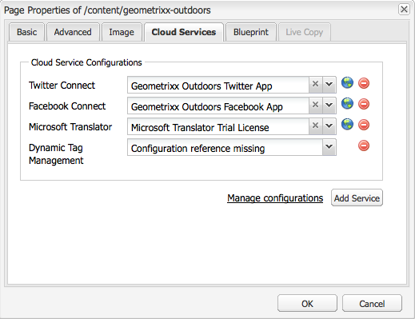

# Integrazione con Adobe Dynamic Tag Management {#integrating-with-adobe-dynamic-tag-management}

Integrare [Adobe Dynamic Tag Management](https://business.adobe.com/products/experience-platform/adobe-experience-platform.html) con AEM in modo da poter utilizzare le proprietà web di Dynamic Tag Management per monitorare i siti AEM. Dynamic Tag Management consente agli addetti al marketing di gestire i tag per la raccolta dei dati e distribuirli tra i sistemi di marketing digitale. Ad esempio, utilizza Dynamic Tag Management per raccogliere i dati di utilizzo per il tuo sito web AEM e distribuirli per l’analisi in Adobe Analytics o Adobe Target.

Prima di procedere all’integrazione, crea Dynamic Tag Management [proprietà web](https://microsite.omniture.com/t2/help/en_US/dtm/#Web_Properties) che tiene traccia del dominio del sito AEM. Il [opzioni di hosting](https://microsite.omniture.com/t2/help/en_US/dtm/#Hosting__Embed_Tab) della proprietà web deve essere configurata in modo da poter configurare l’AEM per accedere alle librerie Dynamic Tag Management.

Dopo aver configurato l’integrazione, le modifiche agli strumenti e alle regole di distribuzione di Dynamic Tag Management non richiedono la modifica della configurazione di Dynamic Tag Management nell’AEM. Le modifiche sono automaticamente disponibili per AEM.

>[!NOTE]
>
>Se utilizzi DTM con una configurazione proxy personalizzata, configura entrambe le configurazioni proxy del client HTTP, in quanto alcune funzionalità dell’AEM utilizzano le API 3.x e altre le API 4.x:
>
>* 3.x è configurato con [http://localhost:4502/system/console/configMgr/com.day.commons.httpclient](http://localhost:4502/system/console/configMgr/com.day.commons.httpclient)
>* 4.x è configurato con [http://localhost:4502/system/console/configMgr/org.apache.http.proxyconfigurator](http://localhost:4502/system/console/configMgr/org.apache.http.proxyconfigurator)
>

## Opzioni di implementazione {#deployment-options}

Le seguenti opzioni di distribuzione influiscono sulla configurazione dell’integrazione con Dynamic Tag Management.

### Hosting dinamico Tag Management {#dynamic-tag-management-hosting}

L’AEM supporta la Dynamic Tag Management ospitata nel cloud o su AEM.

* Ospitato dal cloud: le librerie JavaScript di Dynamic Tag Management sono memorizzate nel cloud e le pagine AEM vi fanno riferimento direttamente.
* Ospitato da AEM: Dynamic Tag Management genera librerie JavaScript. AEM utilizza un modello di flusso di lavoro per ottenere e installare le librerie.

Il tipo di hosting utilizzato dalla tua implementazione determina alcune delle attività di configurazione e implementazione che esegui. Per informazioni sulle opzioni di hosting, vedi [Hosting - Scheda Incorpora](https://microsite.omniture.com/t2/help/en_US/dtm/#Hosting__Embed_Tab) nella Guida di Dynamic Tag Management.

### Libreria di staging e produzione {#staging-and-production-library}

Decidi se l’istanza di authoring dell’AEM utilizza il codice di produzione o di staging Dynamic Tag Management.

In genere, l’istanza di authoring utilizza le librerie di staging Dynamic Tag Management e l’istanza di produzione utilizza le librerie di produzione. Questo scenario consente di utilizzare l’istanza di authoring per testare le configurazioni di Dynamic Tag Management non approvate.

Se lo desideri, l’istanza di authoring può utilizzare le librerie di produzione. Sono disponibili i plug-in del browser web che consentono di passare dall’utilizzo delle librerie di staging a scopo di test quando le librerie sono ospitate nel cloud.

### Utilizzo dell’hook di distribuzione Dynamic Tag Management {#using-the-dynamic-tag-management-deployment-hook}

Quando AEM ospita le librerie Dynamic Tag Management, puoi utilizzare il servizio Dynamic Tag Management Deployment Hook per inviare automaticamente gli aggiornamenti della libreria a AEM. Gli aggiornamenti della libreria vengono inviati quando vengono apportate modifiche alle librerie, ad esempio quando vengono modificate le proprietà della proprietà Web di Dynamic Tag Management.

Per utilizzare l’hook di distribuzione, Dynamic Tag Management deve essere in grado di connettersi all’istanza AEM che ospita le librerie. [Abilitare l’accesso all’AEM](/help/sites-administering/dtm.md#enabling-access-for-the-deployment-hook-service) per i server Dynamic Tag Management.

In alcune circostanze l&#39;AEM può essere irraggiungibile, ad esempio quando l&#39;AEM si trova dietro un firewall. In questi casi, puoi utilizzare l’opzione Importazione polling AEM per recuperare periodicamente le librerie. Un’espressione di processo cron determina la pianificazione dei download della libreria.

## Abilitazione dell’accesso per il servizio Hook di distribuzione {#enabling-access-for-the-deployment-hook-service}

Abilita il servizio Dynamic Tag Management Deployment Hook per accedere all’AEM in modo che il servizio possa aggiornare le librerie ospitate dall’AEM. Specifica l&#39;indirizzo IP dei server Dynamic Tag Management che aggiornano le librerie di staging e produzione in base alle esigenze:

* Staging: `107.21.99.31`
* Produzione: `23.23.225.112` e `204.236.240.48`

Eseguire la configurazione utilizzando [Console web](/help/sites-deploying/configuring-osgi.md#osgi-configuration-with-the-web-console) o un [`sling:OsgiConfig`](/help/sites-deploying/configuring-osgi.md#osgi-configuration-in-the-repository) nodo:

* Nella console web, utilizza l’elemento Adobe Configurazione Hook di distribuzione DTM nella pagina Configurazione.
* Per una configurazione OSGi, il PID del servizio è `com.adobe.cq.dtm.impl.servlets.DTMDeployHookServlet`.

Nella tabella seguente sono descritte le proprietà da configurare.

| Proprietà console Web | Proprietà OSGi | Descrizione |
|---|---|---|
| White list IP DTM per staging | `dtm.staging.ip.whitelist` | Indirizzo IP del server Dynamic Tag Management che aggiorna le librerie di staging. |
| White list IP DTM produzione | `dtm.production.ip.whitelist` | L’indirizzo IP del server Dynamic Tag Management che aggiorna le librerie di produzione. |

## Creazione della configurazione Dynamic Tag Management {#creating-the-dynamic-tag-management-configuration}

Crea una configurazione cloud in modo che l’istanza AEM possa autenticarsi con Dynamic Tag Management e interagire con la tua proprietà web.

>[!NOTE]
>
>Evita di includere due codici di tracciamento Adobe Analytics nelle pagine quando la proprietà web DTM include lo strumento Adobe Analytics e utilizzi anche [Approfondimenti contenuto](/help/sites-authoring/content-insights.md). Nel tuo [Configurazione Adobe Analytics Cloud](/help/sites-administering/adobeanalytics-connect.md#configuring-the-connection-to-adobe-analytics), seleziona l’opzione Do Not Include Tracking Code (Non includere codice di tracciamento).

### Impostazioni generali {#general-settings}

<table>
 <tbody>
  <tr>
   <th>Proprietà</th>
   <th>Descrizione</th>
  </tr>
  <tr>
   <td>Token API</td>
   <td>Il valore della proprietà Token API dell’account utente Dynamic Tag Management. AEM utilizza questa proprietà per l’autenticazione con Dynamic Tag Management.</td>
  </tr>
  <tr>
   <td>Azienda</td>
   <td>Azienda a cui è associato il tuo ID di accesso.</td>
  </tr>
  <tr>
   <td>Proprietà</td>
   <td>Nome della proprietà Web creata per la gestione dei tag per il sito AEM.</td>
  </tr>
  <tr>
   <td>Includi codice di produzione per Autore</td>
   <td>
Seleziona questa opzione affinché le istanze di authoring e pubblicazione dell’AEM utilizzino la versione di produzione delle librerie Dynamic Tag Management. 
 
Se questa opzione non è selezionata, le impostazioni di staging vengono applicate all’istanza di authoring e le impostazioni di produzione all’istanza di pubblicazione.
 </td>
  </tr>
 </tbody>
</table>

### Proprietà di self-hosting - Staging e produzione {#self-hosting-properties-staging-and-production}

Le seguenti proprietà della configurazione di Dynamic Tag Management consentono all’AEM di ospitare le librerie Dynamic Tag Management. Le proprietà consentono all’AEM di scaricare e installare le librerie. Facoltativamente, è possibile aggiornare automaticamente le librerie per garantire che riflettano eventuali modifiche apportate nell&#39;applicazione di gestione Dynamic Tag Management.

Alcune proprietà utilizzano i valori ottenuti dalla sezione Download libreria della scheda Incorpora per la proprietà Web Dynamic Tag Management. Per informazioni, consulta [Download libreria](https://microsite.omniture.com/t2/help/en_US/dtm/#Library_Download) nella Guida di Dynamic Tag Management.

>[!NOTE]
>
>Quando ospiti il bundle Dynamic Tag Management su AEM, il download della libreria deve essere abilitato in Dynamic Tag Management prima di creare la configurazione. Inoltre, Akamai deve essere abilitato perché Akamai fornisce le librerie per il download.

Quando si ospitano le librerie Dynamic Tag Management su AEM, AEM configura automaticamente alcune proprietà della proprietà web in base alla configurazione. Vedi le descrizioni nella tabella seguente.

<table>
 <tbody>
  <tr>
   <th>Proprietà</th>
   <th>Descrizione</th>
  </tr>
  <tr>
   <td>Usa hosting autonomo</td>
   <td>Seleziona quando ospiti il file della libreria Dynamic Tag Management sull'AEM. Se si seleziona questa opzione, vengono visualizzate le altre proprietà della tabella.</td>
  </tr>
  <tr>
   <td>URL bundle DTM</td>
   <td>URL da utilizzare per scaricare la libreria Dynamic Tag Management. Ottieni questo valore dalla sezione URL di download della pagina Download della libreria di Dynamic Tag Management. Per motivi di sicurezza, questo valore deve essere configurato manualmente.</td>
  </tr>
  <tr>
   <td>Flusso di lavoro per download</td>
   <td>
Modello di flusso di lavoro da utilizzare per scaricare e installare la libreria Dynamic Tag Management. Il modello predefinito è Download del bundle DTM predefinito. Utilizzare questo modello a meno che non sia stato creato un modello personalizzato.
 
Il flusso di lavoro di download predefinito attiva automaticamente le librerie quando vengono scaricate.
 </td>
  </tr>
  <tr>
   <td>Suggerimento dominio</td>
   <td>
(Facoltativo) Il dominio del server AEM che ospita la libreria Dynamic Tag Management. Specifica un valore che ti consenta di ignorare il dominio predefinito configurato per <a href="/help/sites-developing/externalizer.md">Servizio Day CQ Link Externalizer</a>.
 
Quando è connesso a Dynamic Tag Management, AEM utilizza questo valore per configurare il percorso HTTP di staging o il percorso HTTP di produzione delle proprietà Library Download per la proprietà web Dynamic Tag Management.
 </td>
  </tr>
  <tr>
   <td>Suggerimento dominio sicuro</td>
   <td>
(Facoltativo) Il dominio del server AEM che ospita la libreria Dynamic Tag Management tramite HTTPS. Specifica un valore che ti consenta di ignorare il dominio predefinito configurato per <a href="/help/sites-developing/externalizer.md">Servizio Day CQ Link Externalizer</a>.
 
Quando è connesso a Dynamic Tag Management, l’AEM utilizza questo valore per configurare il percorso HTTPS di staging o il percorso HTTPS di produzione delle proprietà Library Download per la proprietà web Dynamic Tag Management.
 </td>
  </tr>
  <tr>
   <td>Segreto condiviso</td>
   <td>
(Facoltativo) Segreto condiviso da utilizzare per decrittografare il download. Ottieni questo valore dal campo Segreto condiviso della pagina Download libreria di Dynamic Tag Management.
 
<strong>Nota:</strong> È necessario che nel computer in cui è installato AEM siano installate le librerie OpenSSL in modo che l’AEM possa decrittografare le librerie scaricate.
 </td>
  </tr>
  <tr>
   <td>Abilita importazione polling</td>
   <td>
(Facoltativo) Fai clic su per scaricare e installare periodicamente la libreria Dynamic Tag Management per assicurarti di utilizzare una versione aggiornata. Se questa opzione è selezionata, Dynamic Tag Management non invia richieste HTTP POST all’URL dell’hook di distribuzione.
 
AEM configura automaticamente la proprietà Distribuisci URL hook delle proprietà Library Download per la proprietà Web di Dynamic Tag Management. Se selezionata, la proprietà non viene configurata con alcun valore. Se non è selezionata, la proprietà viene configurata con l’URL della configurazione Dynamic Tag Management.
 
Abilita l’importazione polling quando l’hook di distribuzione Dynamic Tag Management non è in grado di connettersi all’AEM, ad esempio quando l’AEM è dietro un firewall.
 </td>
  </tr>
  <tr>
   <td>Espressione di pianificazione</td>
   <td>(Viene visualizzato ed è obbligatorio quando è selezionata l’opzione Abilita importazione polling). Espressione cron che controlla quando vengono scaricate le librerie Dynamic Tag Management.</td>
  </tr>
 </tbody>
</table>

### Proprietà di hosting cloud - Staging e produzione {#cloud-hosting-properties-staging-and-production}

Puoi configurare le seguenti proprietà per la configurazione di Dynamic Tag Management quando questa è ospitata sul cloud.

<table>
 <tbody>
  <tr>
   <th>Proprietà</th>
   <th>Descrizione</th>
  </tr>
  <tr>
   <td>Usa hosting autonomo</td>
   <td>Deseleziona questa opzione quando il file della libreria Dynamic Tag Management è ospitato nel cloud.</td>
  </tr>
  <tr>
   <td>Codice intestazione</td>
   <td>
Il codice di intestazione per la gestione temporanea ottenuto da Dynamic Tag Management per l’host. Questo valore viene popolato automaticamente quando ci si connette a Dynamic Tag Management.
 
 Per visualizzare il codice in Dynamic Tag Management, fai clic sulla scheda Incorpora, quindi sul nome host. Espandi la sezione Header Code (Codice intestazione) e fai clic su Copy Embed Code (Copia codice di incorporamento) dell’area Staging Embed Code (Codice di incorporamento di staging) o Production Embed Code (Codice di incorporamento di produzione) come richiesto.
 </td>
  </tr>
  <tr>
   <td>Codice piè di pagina</td>
   <td>
Il codice a piè di pagina per la gestione temporanea ottenuto da Dynamic Tag Management per l’host. Questo valore viene popolato automaticamente quando ci si connette a Dynamic Tag Management.
 
Per visualizzare il codice in Dynamic Tag Management, fai clic sulla scheda Incorpora, quindi sul nome host. Espandi la sezione Footer Code (Codice piè di pagina) e fai clic su Copy Embed Code (Copia codice di incorporamento) dell’area Staging Embed Code (Codice di incorporamento di staging) o Production Embed Code (Codice di incorporamento di produzione), a seconda delle esigenze.
 </td>
  </tr>
 </tbody>
</table>

La procedura seguente utilizza l’interfaccia utente ottimizzata per il tocco per configurare l’integrazione con Dynamic Tag Management.

1. Nella barra, fai clic su Strumenti > Operazioni > Cloud > Cloud Service.
1. Nell’area Dynamic Tag Management, per aggiungere una configurazione viene visualizzato uno dei seguenti collegamenti:

   * Fare clic su Configura se si tratta della prima configurazione che si sta aggiungendo.
   * Fai clic su Mostra configurazioni, quindi sul collegamento + accanto a Configurazioni disponibili se sono state create una o più configurazioni.

   

1. Digita un titolo per la configurazione, quindi fai clic su Crea.
1. Nel campo Token API, immetti il valore della proprietà Token API dell’account utente Dynamic Tag Management.

   Per ottenere il valore del token API, contatta l’Assistenza clienti DTM.

   >[!NOTE]
   >
   >Il token API non scade finché l’utente di Dynamic Tag Management non lo richiede esplicitamente.

   

1. Fai clic su Connetti a DTM. L’AEM si autentica con Dynamic Tag Management e recupera l’elenco delle aziende a cui è associato il tuo account.
1. Seleziona l’Azienda, quindi fai clic sulla Proprietà che utilizzi per monitorare il sito AEM.
1. Se utilizzi il codice di staging nell’istanza di authoring, deseleziona Includi codice di produzione nell’istanza di authoring.
1. Immetti i valori per le proprietà nelle schede Impostazioni staging e Impostazioni produzione, se necessario, e quindi fai clic su OK.

## Download manuale della libreria Dynamic Tag Management {#manually-downloading-the-dynamic-tag-management-library}

Scarica manualmente le librerie Dynamic Tag Management per aggiornarle immediatamente sull’AEM. Ad esempio, scarica manualmente quando desideri testare una libreria aggiornata prima che l’importazione polling pianifichi il download automatico della libreria.

1. Nella barra, fai clic su Strumenti > Operazioni > Cloud > Cloud Service.
1. Nell’area Dynamic Tag Management, fai clic su Mostra configurazioni, quindi fai clic sulla configurazione.
1. Nell’area Impostazioni staging o Impostazioni produzione, fai clic sul pulsante Attiva flusso di lavoro di download per scaricare e distribuire il bundle della libreria.

   

>[!NOTE]
>
>I file scaricati vengono memorizzati in `/etc/clientlibs/dtm/my config/companyID/propertyID/servertype`.
>
>I seguenti sono presi direttamente dal tuo [Configurazione DTM](#creating-the-dynamic-tag-management-configuration).
>
>* `myconfig`
>* `companyID`
>* `propertyID`
>* `servertype`
>

## Associazione di una configurazione Dynamic Tag Management al sito {#associating-a-dynamic-tag-management-configuration-with-your-site}

Associa la configurazione Dynamic Tag Management alle pagine del sito web in modo che l’AEM aggiunga lo script richiesto alle pagine. Associa la pagina root del sito alla configurazione. Tutti i discendenti di quella pagina ereditano l’associazione. Se necessario, è possibile ignorare l&#39;associazione in una pagina discendente.

Per associare una pagina e i discendenti a una configurazione Dynamic Tag Management, attenersi alla procedura descritta di seguito.

1. Apri la pagina root del sito nell’interfaccia classica.
1. Utilizza Sidekick per aprire le proprietà della pagina.
1. Nella scheda Cloud Service fare clic su Aggiungi servizio, selezionare Dynamic Tag Management e quindi fare clic su OK.

   

1. Utilizza il menu a discesa Dynamic Tag Management per selezionare la configurazione, quindi fai clic su OK.

Per ignorare l&#39;associazione di configurazione ereditata per una pagina, attenersi alla procedura descritta di seguito. La sostituzione ha effetto sulla pagina e su tutti i suoi discendenti.

1. Apri la pagina nell’interfaccia classica.
1. Utilizza Sidekick per aprire le proprietà della pagina.
1. Nella scheda Cloud Service fare clic sull&#39;icona del lucchetto accanto alla proprietà Ereditato da, quindi fare clic su Sì nella finestra di dialogo di conferma.

   

1. Rimuovere o selezionare una configurazione di Dynamic Tag Management diversa e quindi fare clic su OK.
