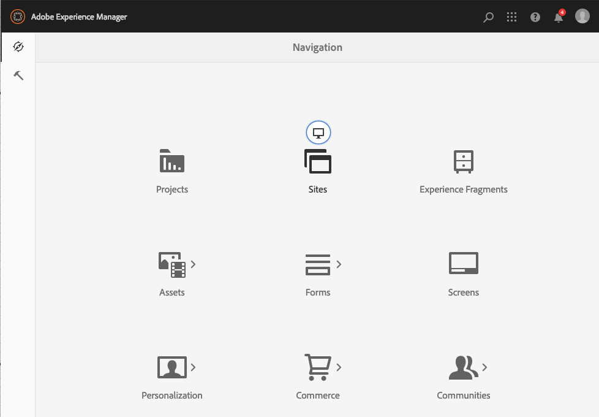

# Admin Console{#admin-consoles}

Per impostazione predefinita, la possibilità di passare all’interfaccia classica tramite le console di amministrazione è stata disattivata. Di conseguenza, le icone a comparsa visualizzate quando si muovono sopra determinate icone della console, consentendo l’accesso all’interfaccia classica, non vengono più visualizzate.

Ogni console con una versione dell’interfaccia classica in `/libs/cq/core/content/nav` possono essere riattivate singolarmente in modo che **Interfaccia classica** L’opzione viene visualizzata di nuovo sopra l’icona della console quando viene spostata.

In questo esempio viene riattivata l’interfaccia classica per la console Sites.

1. Utilizzando CRXDE Lite, trova il nodo corrispondente all’Admin Console per il quale desideri riabilitare l’interfaccia classica. Si trovano in:

   `/libs/cq/core/content/nav`

   Per esempio

   [`https://localhost:4502/crx/de/index.jsp#/libs/cq/core/content/nav`](https://localhost:4502/crx/de/index.jsp#/libs/cq/core/content/nav)

1. Seleziona il nodo corrispondente alla console per la quale desideri riabilitare l’interfaccia classica. Nel nostro esempio, riattiveremo l’interfaccia utente classica per la console Sites.

   `/libs/cq/core/content/nav/sites`

1. Creare una sovrapposizione utilizzando **Sovrapponi nodo** opzione; ad esempio:

   * **Percorso**: `/apps/cq/core/content/nav/sites`
   * **Posizione sovrapposizione**: `/apps/`
   * **Corrispondenza tipi di nodo**: attivo (seleziona la casella di controllo)

1. Aggiungi la seguente proprietà booleana al nodo sovrapposto:

   `enableDesktopOnly = {Boolean}true`

1. Il **Interfaccia classica** l’opzione è nuovamente disponibile come opzione a comparsa in admin console.

   

Ripeti questi passaggi per ogni console per la quale desideri riabilitare l’accesso alla versione dell’interfaccia classica.
