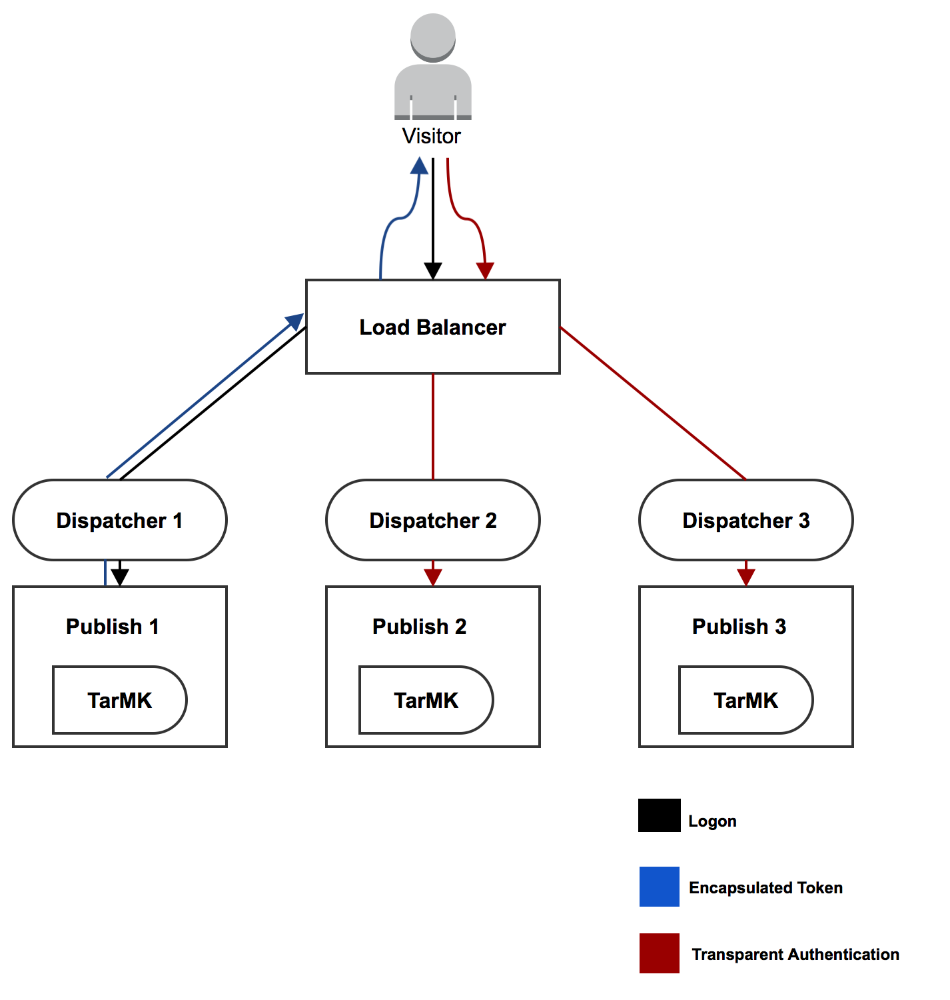

# Supporto token incapsulati{#encapsulated-token-support}

## Introduzione {#introduction}

Per impostazione predefinita, AEM utilizza il gestore di autenticazione dei token per autenticare ogni richiesta. Tuttavia, per soddisfare le richieste di autenticazione, il gestore di autenticazione dei token richiede l’accesso all’archivio per ogni richiesta. Questo accade perché i cookie vengono utilizzati per mantenere lo stato di autenticazione. Logicamente, lo stato deve essere mantenuto nell’archivio per convalidare le richieste successive. In effetti, ciò significa che il meccanismo di autenticazione è stabile.

Questo è di particolare importanza per la scalabilità orizzontale. In una configurazione con più istanze come la farm di pubblicazione illustrata di seguito, il bilanciamento del carico non può essere ottenuto in modo ottimale. Con l’autenticazione con stato, lo stato di autenticazione persistente sarà disponibile solo nell’istanza in cui l’utente viene autenticato per la prima volta.

Prendi ad esempio il seguente scenario:

Un utente può essere autenticato nell&#39;istanza di pubblicazione 1, ma se una richiesta successiva va all&#39;istanza di pubblicazione 2, l&#39;istanza non dispone di tale stato di autenticazione persistente, perché tale stato è stato mantenuto nell&#39;archivio di pubblicazione uno e pubblicazione due ha un proprio archivio.

La soluzione è quella di configurare connessioni permanenti a livello di load balancer. Con le connessioni permanenti, un utente veniva sempre indirizzato alla stessa istanza di pubblicazione. Di conseguenza, non è possibile un bilanciamento del carico ottimale.

Nel caso in cui un&#39;istanza di pubblicazione diventi non disponibile, tutti gli utenti autenticati in tale istanza perderanno la sessione. Questo perché l&#39;accesso al repository è necessario per convalidare il cookie di autenticazione.

## Autenticazione senza stato con token incapsulato {#stateless-authentication-with-the-encapsulated-token}

La soluzione per la scalabilità orizzontale è l’autenticazione senza stato con l’utilizzo del nuovo supporto per i token incapsulati in AEM.

Il Token incapsulato è un elemento di crittografia che consente AEM creare e convalidare in modo sicuro le informazioni di autenticazione offline, senza accedere all’archivio. In questo modo, una richiesta di autenticazione può avvenire su tutte le istanze di pubblicazione e senza la necessità di connessioni permanenti. Inoltre, ha il vantaggio di migliorare le prestazioni di autenticazione, in quanto l’archivio non deve essere accessibile per ogni richiesta di autenticazione.

Puoi vedere come funziona in una distribuzione geograficamente distribuita con autori MongoMK e istanze di pubblicazione TarMK di seguito:

>[!NOTE]
>
>Il token incapsulato riguarda l’autenticazione. Questo garantisce che il cookie possa essere convalidato senza dover accedere all’archivio. Tuttavia, è comunque necessario che l’utente esista su tutte le istanze e che le informazioni memorizzate in tale utente siano accessibili da ogni istanza.
>
>Ad esempio, se un nuovo utente viene creato sull’istanza di pubblicazione numero uno, a causa del funzionamento del Token incapsulato, verrà autenticato correttamente al numero due di pubblicazione. Se l’utente non esiste nella seconda istanza di pubblicazione, la richiesta non avrà esito positivo.

## Configurazione del token incapsulato {#configuring-the-encapsulated-token}

>[!NOTE]
>Tutti i gestori di autenticazione che sincronizzano gli utenti e si basano sull’autenticazione token (come SAML e OAuth) funzioneranno solo con i token incapsulati se:
>
>* Le sessioni permanenti sono abilitate oppure
>
>* Gli utenti vengono già creati in AEM all&#39;avvio della sincronizzazione. Ciò significa che i token incapsulati non saranno supportati in situazioni in cui i gestori **creare** utenti durante il processo di sincronizzazione.

Quando configuri il token incapsulato, è necessario tenere in considerazione alcuni aspetti:

1. A causa della crittografia in questione, tutte le istanze devono avere la stessa chiave HMAC. A partire dal AEM 6.3, il materiale chiave non viene più memorizzato nell’archivio, ma nel file system effettivo. In questo modo, il modo migliore per replicare le chiavi è copiarle dal file system dell&#39;istanza sorgente a quello delle istanze di destinazione a cui si desidera replicare le chiavi. Vedi altre informazioni sotto &quot;Replica della chiave HMAC&quot; qui sotto.
1. Il token incapsulato deve essere abilitato. Questa operazione può essere eseguita tramite la Web Console.

### Replica della chiave HMAC {#replicating-the-hmac-key}

Per replicare la chiave tra le istanze, è necessario:

1. Accedi all&#39;istanza AEM, in genere un&#39;istanza dell&#39;autore, che contiene il materiale chiave da copiare;
1. Individua il `com.adobe.granite.crypto.file` nel file system locale. Ad esempio, sotto questo percorso:

   * `<author-aem-install-dir>/crx-quickstart/launchpad/felix/bundle25`

   La `bundle.info` all&#39;interno di ogni cartella identificherà il nome del bundle.

1. Passa alla cartella dati. Esempio:

   * `<author-aem-install-dir>/crx-quickstart/launchpad/felix/bundle25/data`

1. Copiare i file HMAC e master.
1. Quindi, vai all&#39;istanza di destinazione a cui desideri duplicare la chiave HMAC e passa alla cartella dei dati. Esempio:

   * `<publish-aem-install-dir>/crx-quickstart/launchpad/felix/bundle25/data`

1. Incolla i due file copiati in precedenza.
1. [Aggiorna il bundle Crypto](/help/communities/deploy-communities.md#refresh-the-granite-crypto-bundle) se l’istanza target è già in esecuzione.

1. Ripeti i passaggi precedenti per tutte le istanze a cui desideri replicare la chiave.

#### Abilitazione del token incapsulato {#enabling-the-encapsulated-token}

Una volta replicata la chiave HMAC, puoi abilitare il Token incapsulato tramite la console Web:

1. Posiziona il browser su `https://serveraddress:port/system/console/configMgr`
1. Cerca una voce chiamata **Gestore autenticazione token di Granite Adobe** e fai clic su di esso.
1. Nella finestra seguente, spunta la **Abilita supporto token incapsulati** e premere **Salva**.
