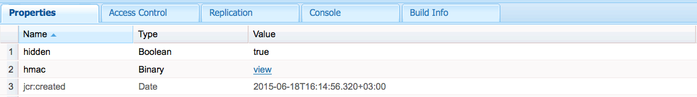

# Supporto token incapsulati{#encapsulated-token-support}

## Introduzione {#introduction}

Per impostazione predefinita, AEM utilizza il gestore autenticazione token per autenticare ogni richiesta. Tuttavia, per soddisfare le richieste di autenticazione, il Gestore autenticazione token richiede l&#39;accesso all&#39;archivio per ogni richiesta. Ciò accade perché i cookie vengono utilizzati per mantenere lo stato di autenticazione. Logicamente, lo stato deve essere mantenuto nella directory archivio per convalidare le richieste successive. In effetti, ciò significa che il meccanismo di autenticazione è statico.

Ciò è di particolare importanza per la scalabilità orizzontale. In una configurazione a più istanze come la farm di pubblicazione descritta di seguito, il bilanciamento del carico non può essere raggiunto in modo ottimale. Con l&#39;autenticazione di stato, lo stato di autenticazione persistente sarà disponibile solo nell&#39;istanza in cui l&#39;utente viene autenticato per la prima volta.

Prendete ad esempio il seguente scenario:

Un utente può essere autenticato nell’istanza di pubblicazione 1, ma se una richiesta successiva va all’istanza di pubblicazione 2, tale istanza non dispone di tale stato di autenticazione persistente, perché tale stato era persistente nell’archivio di pubblicazione 1 e pubblicazione 2 ha un proprio repository.

La soluzione è configurare connessioni fissi a livello di bilanciamento del carico. Con le connessioni fisse, un utente viene sempre indirizzato alla stessa istanza di pubblicazione. Di conseguenza, non è possibile ottenere un bilanciamento del carico ottimale.

Se un’istanza di pubblicazione non è più disponibile, tutti gli utenti autenticati in tale istanza perderanno la sessione. Questo perché l&#39;accesso del repository è necessario per convalidare il cookie di autenticazione.

## Autenticazione senza stato con il token incapsulato {#stateless-authentication-with-the-encapsulated-token}

La soluzione per la scalabilità orizzontale è l&#39;autenticazione senza stato con l&#39;utilizzo del nuovo supporto di Token incapsulati in AEM.

Il Token incapsulato è un elemento di crittografia che consente AEM creare e convalidare in modo sicuro le informazioni di autenticazione offline, senza accedere all&#39;archivio. In questo modo, una richiesta di autenticazione può essere eseguita su tutte le istanze di pubblicazione e senza la necessità di connessioni permanenti. Offre inoltre il vantaggio di migliorare le prestazioni di autenticazione, poiché l&#39;archivio non deve essere accessibile per ogni richiesta di autenticazione.

Potete vedere come funziona in una distribuzione geograficamente distribuita con autori MongoMK e istanze di pubblicazione TarMK di seguito:

>[!NOTE]
>
>Il token incapsulato riguarda l&#39;autenticazione. Garantisce che il cookie possa essere convalidato senza dover accedere alla directory archivio. Tuttavia, è comunque necessario che l&#39;utente esista su tutte le istanze e che le informazioni memorizzate in tale utente siano accessibili a ogni istanza.
>
>Ad esempio, se un nuovo utente viene creato nell’istanza di pubblicazione numero uno, a causa del funzionamento del Token incapsulato, verrà autenticato correttamente al momento della pubblicazione numero due. Se l’utente non esiste nella seconda istanza di pubblicazione, la richiesta non avrà esito positivo.

## Configurazione del token incapsulato {#configuring-the-encapsulated-token}

>[!NOTE]
>Tutti i gestori di autenticazione che sincronizzano gli utenti e si basano sull&#39;autenticazione token (come SAML e OAuth) funzioneranno solo con i token incapsulati se:
>
>* le sessioni permanenti sono abilitate, oppure
   >
   >
* Gli utenti sono già creati in AEM all&#39;avvio della sincronizzazione. Ciò significa che i token incapsulati non saranno supportati nelle situazioni in cui gli utenti **create** durante il processo di sincronizzazione.

Per configurare il token incapsulato è necessario tenere in considerazione alcuni aspetti:

1. A causa della crittografia, tutte le istanze devono avere la stessa chiave HMAC. A partire dal AEM 6.3, il materiale chiave non è più memorizzato nella directory archivio, ma nel file system effettivo. Tenendo presente questo, il modo migliore per replicare le chiavi consiste nel copiarle dal file system dell&#39;istanza di origine a quello delle istanze di destinazione a cui si desidera replicare le chiavi. Per ulteriori informazioni, vedere la sezione &quot;Replica del tasto HMAC&quot; di seguito.
1. Il token incapsulato deve essere abilitato. Questo può essere fatto tramite la console Web.

### Replica del tasto HMAC {#replicating-the-hmac-key}

La chiave HMAC è presente come proprietà binaria di `/etc/key` nella directory archivio. È possibile scaricarlo separatamente premendo il collegamento **view** accanto ad esso:

Per replicare la chiave tra le istanze, è necessario:

1. accedere all&#39;istanza AEM, in genere un&#39;istanza di creazione, che contiene il materiale chiave da copiare;
1. Individuare il bundle `com.adobe.granite.crypto.file` nel file system locale. Ad esempio, in questo percorso:

   * &lt;author-aem-install-dir>/crx-quickstart/launchpad/felix/bundle21

   Il file `bundle.info` all&#39;interno di ciascuna cartella identificherà il nome del bundle.

1. Passa alla cartella dei dati. Esempio:

   * `<author-aem-install-dir>/crx-quickstart/launchpad/felix/bundle21/data`

1. Copiate i file HMAC e master.
1. Quindi, passate all&#39;istanza di destinazione alla quale desiderate duplicare la chiave HMAC e individuate la cartella di dati. Esempio:

   * `<publish-aem-install-dir>/crx-quickstart/launchpad/felix/bundle21/data`

1. Incollate i due file precedentemente copiati.
1. [Aggiornate Crypto ](/help/communities/deploy-communities.md#refresh-the-granite-crypto-bundle) Bundlese l&#39;istanza di destinazione è già in esecuzione.

1. Ripetere i passaggi indicati sopra per tutte le istanze in cui si desidera replicare la chiave.

#### Abilitazione del token incapsulato {#enabling-the-encapsulated-token}

Una volta replicata la chiave HMAC, potete abilitare il token incapsulato tramite la console Web:

1. Posizionate il browser su `https://serveraddress:port/system/console/configMgr`
1. Cercate una voce denominata **Day CRX Token Authentication Handler** e fate clic su di essa.
1. Nella finestra seguente, selezionare la casella **Abilita supporto token incapsulato** e premere **Salva**.

