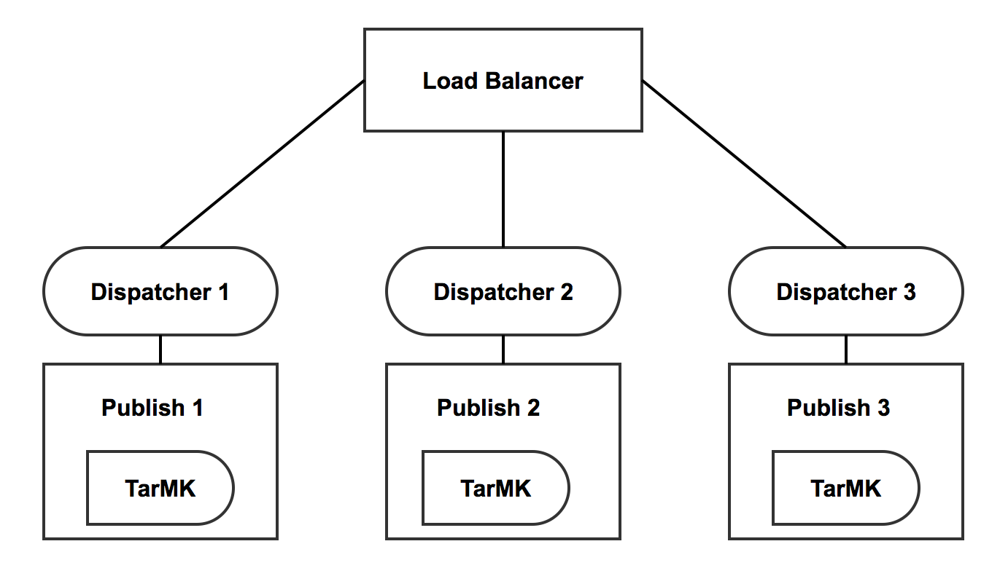

# Supporto di token incapsulati{#encapsulated-token-support}

## Introduzione {#introduction}

Per impostazione predefinita, l’AEM utilizza il gestore di autenticazione token per autenticare ogni richiesta. Tuttavia, per gestire le richieste di autenticazione, il gestore dell’autenticazione token richiede l’accesso all’archivio per ogni richiesta. Questo accade perché i cookie vengono utilizzati per mantenere lo stato di autenticazione. Logicamente, lo stato deve essere mantenuto nell’archivio per convalidare le richieste successive. In effetti, ciò significa che il meccanismo di autenticazione è con conservazione dello stato.

Ciò è particolarmente importante per la scalabilità orizzontale. In una configurazione con più istanze come la farm di pubblicazione descritta di seguito, il bilanciamento del carico non può essere raggiunto in modo ottimale. Con l’autenticazione con conservazione dello stato, lo stato di autenticazione persistente sarà disponibile solo nell’istanza in cui l’utente è stato autenticato per la prima volta.

Prendi ad esempio lo scenario seguente:

Un utente può essere autenticato sull’istanza di pubblicazione 1, ma se una richiesta successiva passa all’istanza di pubblicazione 2, tale istanza non ha tale stato di autenticazione persistente, perché tale stato è stato persistito nell’archivio di pubblicazione 1 e pubblicazione 2 ha un proprio archivio.

La soluzione a questo problema consiste nel configurare connessioni permanenti a livello di load balancer. Con le connessioni permanenti, un utente viene sempre indirizzato alla stessa istanza di pubblicazione. Di conseguenza, non è possibile un bilanciamento del carico veramente ottimale.

Se un’istanza Publish non è più disponibile, tutti gli utenti autenticati in tale istanza perderanno la sessione. Questo perché è necessario l’accesso all’archivio per convalidare il cookie di autenticazione.

## Autenticazione senza stato con token incapsulato {#stateless-authentication-with-the-encapsulated-token}

La soluzione per la scalabilità orizzontale è l’autenticazione senza stato con l’utilizzo del nuovo supporto per i token incapsulati nell’AEM.

Il token incapsulato è un elemento di crittografia che consente all’AEM di creare e convalidare in modo sicuro le informazioni di autenticazione offline, senza accedere all’archivio. In questo modo, una richiesta di autenticazione può verificarsi su tutte le istanze di pubblicazione e non è necessario utilizzare connessioni permanenti. Offre inoltre il vantaggio di migliorare le prestazioni di autenticazione, in quanto non è necessario accedere all’archivio per ogni richiesta di autenticazione.

Di seguito puoi vedere come funziona in una distribuzione geograficamente distribuita con autori MongoMK e istanze di pubblicazione TarMK:

>[!NOTE]
>
>Il token incapsulato riguarda l’autenticazione. In questo modo il cookie può essere convalidato senza dover accedere all’archivio. Tuttavia, è ancora necessario che l’utente esista su tutte le istanze e che le informazioni memorizzate in tale utente siano accessibili a ogni istanza.
>
>Ad esempio, se un nuovo utente viene creato nell’istanza di pubblicazione numero uno, a causa del modo in cui funziona il token incapsulato, verrà autenticato correttamente nella pubblicazione numero due. Se l’utente non esiste nella seconda istanza di pubblicazione, la richiesta non avrà comunque esito positivo.
>

## Configurazione del token incapsulato {#configuring-the-encapsulated-token}

>[!NOTE]
>Tutti i gestori di autenticazione che sincronizzano gli utenti e si basano sull’autenticazione dei token (come SAML e OAuth) funzioneranno con i token incapsulati solo se:
>
>* le sessioni permanenti sono abilitate, oppure
>
>* Gli utenti vengono già creati in AEM all&#39;avvio della sincronizzazione. Ciò significa che i token incapsulati non saranno supportati in situazioni in cui i gestori **creare** utenti durante il processo di sincronizzazione.

Ci sono alcuni aspetti da tenere in considerazione durante la configurazione del token incapsulato:

1. A causa della crittografia richiesta, tutte le istanze devono avere la stessa chiave HMAC. A partire da AEM 6.3, il materiale essenziale non viene più conservato nel deposito, ma nel file system effettivo. In quest’ottica, il modo migliore per replicare le chiavi è copiarle dal file system dell’istanza sorgente a quello delle istanze target in cui desideri replicare le chiavi. Ulteriori informazioni sono disponibili in &quot;Replica della chiave HMAC&quot; di seguito.
1. Il token incapsulato deve essere abilitato. Puoi eseguire questa operazione tramite la console web.

### Replica della chiave HMAC {#replicating-the-hmac-key}

Per replicare la chiave tra le istanze, è necessario:

1. Accedere all’istanza AEM, in genere un’istanza Autore, che contiene il materiale chiave da copiare;
1. Individua il `com.adobe.granite.crypto.file` nel file system locale. Ad esempio, in questo percorso:

   * `<author-aem-install-dir>/crx-quickstart/launchpad/felix/bundle25`

   Il `bundle.info` all’interno di ogni cartella identificherà il nome del bundle.

1. Passa alla cartella dati. Ad esempio:

   * `<author-aem-install-dir>/crx-quickstart/launchpad/felix/bundle25/data`

1. Copiare i file HMAC e master.
1. Quindi, vai all’istanza di destinazione in cui desideri duplicare la chiave HMAC e passa alla cartella dati. Ad esempio:

   * `<publish-aem-install-dir>/crx-quickstart/launchpad/felix/bundle25/data`

1. Incolla i due file copiati in precedenza.
1. [Aggiorna il pacchetto di crittografia](/help/communities/deploy-communities.md#refresh-the-granite-crypto-bundle) se l’istanza di destinazione è già in esecuzione.

1. Ripeti i passaggi precedenti per tutte le istanze in cui desideri replicare la chiave.

#### Abilitazione del token incapsulato {#enabling-the-encapsulated-token}

Una volta replicata la chiave HMAC, puoi abilitare il token incapsulato tramite la console web:

1. Puntare il browser a `https://serveraddress:port/system/console/configMgr`
1. Cerca una voce denominata **Adobe Gestore autenticazione token Granite** e fare clic su di esso.
1. Nella finestra seguente, selezionare **Abilita supporto token incapsulato** e premere **Salva**.
