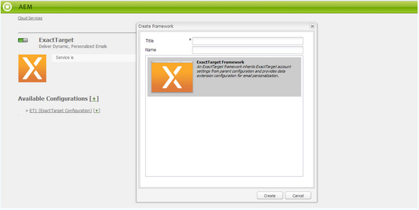

# Integrazione con ExactTarget{#integrating-with-exacttarget}

L’integrazione di AEM con Exact Target consente di gestire e inviare e-mail create in AEM tramite Exact Target. Consente inoltre di utilizzare le funzioni di gestione dei lead di Exact Target tramite moduli AEM nelle pagine AEM.

L’integrazione offre le seguenti funzionalità:

* La possibilità di creare e-mail in AEM e pubblicarle su Exact Target per la distribuzione.
* Possibilità di impostare l’azione di un modulo AEM per creare un utente iscritto a Exact Target.

Una volta configurato ExactTarget, è possibile pubblicare newsletter o e-mail su ExactTarget. Vedi [Pubblicazione di newsletter su un servizio e-mail](/help/sites-authoring/personalization.md).

## Creazione di una configurazione ExactTarget {#creating-an-exacttarget-configuration}

Le configurazioni ExactTarget possono essere aggiunte tramite Cloud Services o Strumenti. Entrambi i metodi sono descritti in questa sezione.

### Configurazione di ExactTarget tramite Cloudservices {#configuring-exacttarget-via-cloudservices}

Per creare una configurazione ExactTarget nei Cloud Services:

1. Nella pagina di benvenuto, fai clic su **Cloud Services**. (o direttamente all&#39;indirizzo `https://<hostname>:<port>/etc/cloudservices.html`.)
1. Fai clic su **ExactTarget** e poi **Configura**. Viene visualizzata la finestra di configurazione ExactTarget.

   

1. Inserisci un titolo e, facoltativamente, un nome e fai clic su **Crea**. La **Impostazioni ExactTarget** si apre la finestra di configurazione.

   

1. Immetti nome utente e password e seleziona un endpoint API (ad esempio, **https://webservice.exacttarget.com/Service.asmx**).
1. Fai clic su **Connettiti a ExactTarget.** Una volta effettuata la connessione, viene visualizzata una finestra di dialogo di successo. Fai clic su **OK** per uscire dalla finestra.

   

1. Seleziona un account, se disponibile. L’account è per i clienti Enterprise 2.0. Fai clic su **OK**.

   ExactTarget è stato configurato. Per modificare la configurazione, fai clic su **Modifica**. Per accedere a ExactTarget, fai clic su **Vai a ExactTarget**.

1. AEM ora fornisce una funzione di estensione dati. Puoi importare le colonne di estensione dati ExactTarget. Per configurarlo, fai clic sul segno &quot;+&quot; visualizzato, oltre a creare correttamente la configurazione ExactTarget. Puoi selezionare una qualsiasi delle estensioni di dati esistenti dall’elenco a discesa. Per ulteriori informazioni su come configurare le estensioni dati, consulta [Documentazione ExactTarget](https://help.exacttarget.com/en/documentation/exacttarget/subscribers/data_extensions_and_data_relationships).

   Le colonne di estensione dei dati importati possono essere successivamente utilizzate tramite **Testo e personalizzazione** componente.

   

### Configurazione di ExactTarget tramite Strumenti {#configuring-exacttarget-via-tools}

Per creare una configurazione ExactTarget in Strumenti:

1. Nella pagina di benvenuto, fai clic su **Strumenti**. Oppure puoi navigare direttamente da `https://<hostname>:<port>/misadmin#/etc`.
1. Seleziona **Strumenti**, quindi **Configurazioni Cloud Services,** then **ExactTarget**.
1. Fai clic su **Nuovo** per aprire la finestra **Crea pagina **.

   

1. Inserisci il **Titolo** e facoltativamente **Nome** e fai clic su **Crea**.
1. Immettere le informazioni di configurazione descritte al punto 4 della procedura precedente. Segui questa procedura per completare la configurazione di ExactTarget.

### Aggiunta di più configurazioni {#adding-multiple-configurations}

Per aggiungere più configurazioni:

1. Nella pagina di benvenuto, fai clic su **Cloud Services** e fai clic su **ExactTarget**. Fai clic su **Mostra configurazioni** che viene visualizzato se sono disponibili una o più configurazioni ExactTarget. Sono elencate tutte le configurazioni disponibili.
1. Fai clic sul pulsante **+** Accedi a Configurazioni disponibili. Viene aperta la **Creare configurazioni** finestra. Segui la procedura di configurazione precedente per creare una nuova configurazione.
