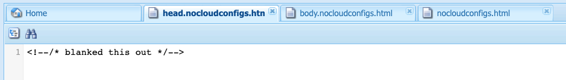

# Esportazione di frammenti di esperienza in Adobe Target{#exporting-experience-fragments-to-adobe-target}

>[!CAUTION]
>
>Alcune funzionalità in questa pagina richiedono l’applicazione della versione 6.5.3.0 (o successiva) dell’AEM.
>
>6.5.3.0:
>
>* **Domini esternalizzazione** ora è possibile selezionare.
>  **Nota:** I domini esternalizzatori sono rilevanti solo per il contenuto del Frammento di esperienza inviato a Target e non per i metadati come Visualizza contenuto offerta.
>
>6.5.2.0:
>
>* I frammenti di esperienza possono essere esportati in:
>
>   * l&#39;area di lavoro predefinita.
>   * un’area di lavoro denominata, specificata in Configurazione cloud.
>   * **Nota:** L’esportazione in aree di lavoro specifiche richiede Adobe Target Premium.
>
>* L’AEM deve essere [integrato con Adobe Target tramite IMS](/help/sites-administering/integration-target-ims.md).
>
>AEM 6.5.0.0 e 6.5.1.0:
>
>* I Frammenti di esperienza AEM vengono esportati nell’area di lavoro predefinita di Adobe Target.
>* AEM deve essere integrato con Adobe Target secondo le istruzioni contenute in [Integrazione con Adobe Target](/help/sites-administering/target.md).

Puoi esportare [Frammenti esperienza](/help/sites-authoring/experience-fragments.md), creato in Adobe Experience Manager (AEM), ad Adobe Target (Target). Possono quindi essere utilizzate come offerte nelle attività di Target, per testare e personalizzare le esperienze su larga scala.

Sono disponibili tre opzioni di formato per esportare un frammento di esperienza in Adobe Target:

* HTML (predefinito): supporto per la distribuzione di contenuti web e ibridi
* JSON: supporto per la distribuzione di contenuti headless
* HTML e JSON

I Frammenti esperienza AEM possono essere esportati nell’area di lavoro predefinita in Adobe Target o in aree di lavoro definite dall’utente per Adobe Target. Questa operazione viene eseguita utilizzando la console Adobe Developer, per la quale è necessario disporre di AEM [integrato con Adobe Target tramite IMS](/help/sites-administering/integration-target-ims.md).

>[!NOTE]
>
>Le aree di lavoro di Adobe Target non sono già esistenti in Adobe Target. Vengono definiti e gestiti in Adobe IMS (Identity Management System), quindi selezionati per l’utilizzo nelle soluzioni tramite integrazioni dalla console Adobe Developer.

>[!NOTE]
>
>Le aree di lavoro di Adobe Target possono essere utilizzate per consentire ai membri di un’organizzazione (gruppo) di creare e gestire offerte e attività riservate all’organizzazione; senza dare accesso ad altri utenti. Ad esempio, organizzazioni specifiche per paese nell&#39;ambito di un’azienda globale.

>[!NOTE]
>
>Per ulteriori informazioni, consulta:
>
>* [Sviluppo Adobe Target](https://developers.adobetarget.com/)
>* [Componenti core: Frammenti di esperienza](https://experienceleague.adobe.com/docs/experience-manager-core-components/using/wcm-components/experience-fragment.html)
>

## Prerequisiti {#prerequisites}

>[!CAUTION]
>
>Alcune funzionalità in questa pagina richiedono l’applicazione della versione 6.5.3.0 dell’AEM.

Sono necessarie diverse azioni:

1. Devi [integrare AEM con Adobe Target utilizzando IMS](/help/sites-administering/integration-target-ims.md).
2. I frammenti di esperienza vengono esportati dall’istanza di authoring dell’AEM, pertanto devi [Configurare AEM Link Externalizer](/help/sites-administering/target-requirements.md#configuring-the-aem-link-externalizer) sull’istanza di authoring per garantire che tutti i riferimenti all’interno del frammento di esperienza siano esternalizzati per la distribuzione web.

   >[!NOTE]
   >
   >Per la riscrittura di collegamenti non coperti dall’impostazione predefinita, è disponibile il [provider del rewriter di collegamento di Frammento esperienza](/help/sites-developing/experience-fragments.md#the-experience-fragment-link-rewriter-provider-html). Con questo, è possibile sviluppare regole personalizzate per la tua istanza.

## Aggiungere la configurazione cloud {#add-the-cloud-configuration}

Prima di esportare un frammento, è necessario aggiungere **Configurazione cloud** per **Adobe Target** al frammento o alla cartella. Questo consente anche di:

* specificare le opzioni di formato da utilizzare per l&#39;esportazione
* selezionare un’area di lavoro di Target come destinazione
* selezionare un dominio esternalizzatore per riscrivere i riferimenti nel frammento di esperienza (facoltativo)

Le opzioni richieste possono essere selezionate in **Proprietà pagina** della cartella e/o del frammento richiesti; la specifica viene ereditata in base alle necessità.

1. Passa alla console **Frammenti di esperienza**.

1. Apri **Proprietà pagina** per la cartella o il frammento appropriato.

   >[!NOTE]
   >
   >Se aggiungi la configurazione cloud alla cartella principale Frammento di esperienza, questa viene ereditata da tutti gli elementi secondari.
   >
   >
   >Se aggiungi la configurazione cloud al frammento di esperienza stesso, questa viene ereditata da tutte le varianti.

1. Seleziona la scheda **Servizi cloud**.

1. Sotto **Configurazione servizio cloud**, seleziona **Adobe Target** dall’elenco a discesa.

   >[!NOTE]
   >
   >È possibile personalizzare il formato JSON di un’offerta Frammento di esperienza. A questo scopo, definisci un componente Frammento esperienza cliente e annota come esportare le sue proprietà nel modello Sling del componente.
   >
   >Consulta il componente core:
   >
   >[Componenti core: Frammenti di esperienza](https://experienceleague.adobe.com/docs/experience-manager-core-components/using/wcm-components/experience-fragment.html)

   Sotto **Adobe Target** seleziona:

   * la configurazione appropriata
   * l’opzione di formato richiesta
   * un’area di lavoro Adobe Target
   * se necessario, il dominio esternalizzatore

   >[!CAUTION]
   >
   >Il dominio esternalizzatore è facoltativo.
   >
   >Un esternalizzatore AEM è configurato quando desideri che il contenuto esportato punti a uno specifico *pubblicare* dominio. Per ulteriori dettagli, consulta [Configurazione di AEM Link Externalizer](/help/sites-administering/target-requirements.md#configuring-the-aem-link-externalizer).
   >
   >Inoltre, i domini esternalizzatori sono rilevanti solo per il contenuto del Frammento di esperienza inviato a Target, e non per i metadati come Visualizza contenuto offerta.

   Ad esempio, per una cartella:

   

1. **Salva e chiudi**.

## Esportazione di un frammento di esperienza in Adobe Target {#exporting-an-experience-fragment-to-adobe-target}

>[!CAUTION]
>
>Per le risorse multimediali, come le immagini, viene esportato solo un riferimento in Target. La risorsa stessa rimane memorizzata in AEM Assets e viene distribuita dall’istanza di pubblicazione AEM.
>
>Per questo motivo, è necessario pubblicare il frammento di esperienza con tutte le relative risorse prima di esportarlo in Target.

Per esportare un frammento di esperienza da AEM a Target (dopo aver specificato la configurazione cloud):

1. Passa alla console Frammenti di esperienza.
1. Seleziona il frammento di esperienza da esportare in Target.

   >[!NOTE]
   >
   >Deve essere una variante Web del frammento di esperienza.

1. Clic **Esporta in Adobe Target**.

   >[!NOTE]
   >
   >Se il frammento di esperienza è già stato esportato, seleziona **Aggiorna in Adobe Target**.

1. Clic **Esporta senza pubblicare** o **Pubblica** secondo necessità.

   >[!NOTE]
   >
   >Selezione **Pubblica** pubblica immediatamente il frammento di esperienza e lo invia a Target.

1. Clic **OK** nella finestra di dialogo di conferma.

   Il frammento di esperienza dovrebbe ora essere in Target.

   >[!NOTE]
   >
   >[Vari dettagli](/help/sites-authoring/experience-fragments.md#details-of-your-experience-fragment) dell&#39;esportazione sono visibili in **Vista a elenco** della console e **Proprietà**.

   >[!NOTE]
   >
   >Quando visualizzi un frammento di esperienza in Adobe Target, la data dell&#39;*ultima modifica* visualizzata è la data dell’ultima modifica apportata al frammento in AEM, non la data dell’ultima esportazione del frammento in Adobe Target.

>[!NOTE]
>
>In alternativa, è possibile eseguire l’esportazione dall’editor di pagine utilizzando comandi comparabili nel menu [Informazioni pagina](/help/sites-authoring/author-environment-tools.md#page-information).

## Utilizzo dei frammenti di esperienza in Adobe Target {#using-your-experience-fragments-in-adobe-target}

Dopo aver eseguito le attività precedenti, il frammento di esperienza viene visualizzato nella pagina Offerte di Adobe Target. Osserva la [documentazione specifica di Target](https://experienceleague.adobe.com/docs/target/using/experiences/offers/aem-experience-fragments.html?lang=it) per scoprire cosa puoi ottenere.

>[!NOTE]
>
>Quando visualizzi un frammento di esperienza in Adobe Target, la data dell&#39;*ultima modifica* visualizzata è la data dell’ultima modifica apportata al frammento in AEM, non la data dell’ultima esportazione del frammento in Adobe Target.

## Eliminazione di un frammento di esperienza già esportato in Adobe Target {#deleting-an-experience-fragment-already-exported-to-adobe-target}

L’eliminazione di un frammento di esperienza già esportato in Target può causare problemi se il frammento è già utilizzato in un’offerta in Adobe Target. L’eliminazione del frammento renderebbe l’offerta inutilizzabile mentre il contenuto del frammento è distribuito da AEM.

Per evitare tali situazioni:

* Se il frammento di esperienza non è attualmente utilizzato in un’attività, AEM consente all’utente di eliminarlo senza un messaggio di avviso.
* Se il frammento di esperienza è utilizzato da un’attività in Adobe Target, un messaggio di errore avvisa l’utente AEM delle possibili conseguenze che l’eliminazione del frammento avrà sull’attività.

  Il messaggio di errore in AEM non impedisce all’utente di (forzare) eliminare il frammento di esperienza. Se il frammento di esperienza viene eliminato:

   * L’offerta Target con il frammento di esperienza AEM può mostrare un comportamento indesiderato

      * L&#39;offerta sarà probabilmente ancora visualizzata, poiché l&#39;HTML del frammento di esperienza è stato inviato su Target
      * Eventuali riferimenti nel frammento di esperienza potrebbero non funzionare correttamente se le risorse di riferimento sono state eliminate anche in AEM.

   * Qualsiasi ulteriore modifica al frammento di esperienza è impossibile in quanto non esiste più nel AEM.


## Rimozione delle ClientLibs dai frammenti esperienza esportati in Target {#removing-clientlibs-from-fragments-exported-target}

I frammenti di esperienza contengono tag HTML completi e tutte le librerie client (CSS/JS) necessarie per eseguire il rendering del frammento esattamente come è stato creato dall’autore del contenuto dei frammenti di esperienza. Questo è by-design.

Quando si utilizza un’offerta Frammento di esperienza con Adobe Target in una pagina consegnata dall’AEM, la pagina Target contiene già tutte le librerie client necessarie. Inoltre, non è necessario neanche il codice HTML estraneo nell’offerta Frammento di esperienza (consulta [Considerazioni](#considerations)).

Di seguito è riportato uno pseudo esempio dell’html in un’offerta per frammenti di esperienza:

```html
<!DOCTYPE>
<html>
   <head>
      <title>…</title>
      <!-- all the client libraries (css/js) -->
      …
   </head>
   <body>
        <!--/* Actual XF Offer content would appear here... */-->
   </body>
</html>
```

Ad alto livello, quando l’AEM esporta un frammento di esperienza in Adobe Target, lo fa utilizzando diversi selettori Sling aggiuntivi. Ad esempio, l’URL del frammento di esperienza esportato potrebbe avere il seguente aspetto (avviso `nocloudconfigs.atoffer`):

* http://www.your-aem-instance.com/content/experience-fragments/my-offers/my-xf-offer.nocloudconfigs.atoffer.html

Il `nocloudconfigs` Il selettore è definito utilizzando HTL e può essere sovrapposto copiandolo da:

* /libs/cq/experience-fragments/components/xfpage/nocloudconfigs.html

Il `atoffer` il selettore viene applicato alla post-elaborazione utilizzando [Sling Rewriter](/help/sites-developing/experience-fragments.md#the-experience-fragment-link-rewriter-provider-html). Entrambi possono essere utilizzati per rimuovere le librerie client.

### Esempio {#example}

Allo scopo, illustriamo come eseguire questa operazione con `nocloudconfigs`.

>[!NOTE]
>
>Consulta [Modelli modificabili](/help/sites-developing/templates.md#editable-templates) per ulteriori dettagli.

#### Sovrapposizioni {#overlays}

In questo esempio particolare, il [sovrapposizioni](/help/sites-developing/overlays.md) l&#39;inclusione rimuoverà le librerie client *e* html estraneo. Si presume che tu abbia già creato il tipo di modello Frammento esperienza. I file necessari da cui copiare `/libs/cq/experience-fragments/components/xfpage/` include:

* `nocloudconfigs.html`
* `head.nocloudconfigs.html`
* `body.nocloudconfigs.html`

#### Sovrapposizioni tipo di modello {#template-type-overlays}

Ai fini di questo esempio, consideriamo la seguente struttura:


Il contenuto di questi file è il seguente:

* `body.nocloudconfigs.html`

  

* `head.nocloudconfigs.html`

  

* `nocloudconfigs.html`

  

>[!NOTE]
>
>Da utilizzare `data-sly-unwrap` per rimuovere il tag body, è necessario `nocloudconfigs.html`.

### Considerazioni {#considerations}

Se devi supportare sia i siti AEM che i siti non AEM utilizzando le Offerte di frammenti di esperienza in Adobe Target, devi creare due Frammenti di esperienza (due diversi tipi di modelli):

* Uno con la sovrapposizione per rimuovere clientlibs/html aggiuntivo

* Uno che non ha la sovrapposizione e quindi include le clientlibs richieste