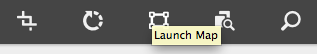
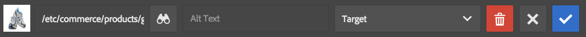
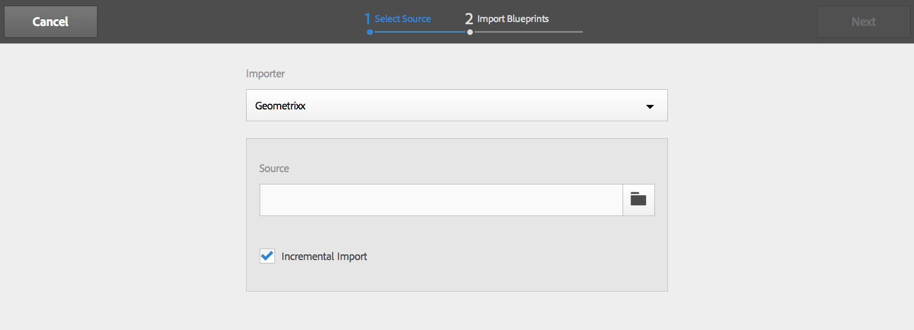

# Amministrazione di eCommerce generico {#administering-generic-ecommerce}

La soluzione AEM generica fornisce metodi per la gestione delle informazioni commerciali detenute all&#39;interno del repository (invece di utilizzare un motore di e-commerce esterno). Ciò include:

* [Prodotti](/help/sites-administering/concepts.md#products)
* [Varianti prodotto](/help/sites-administering/concepts.md#product-variants)
* [Cataloghi](/help/sites-administering/concepts.md#catalogs)
* [Promozioni](/help/sites-administering/concepts.md#promotions)
* [Voucher](/help/sites-administering/concepts.md#vouchers)
* [Ordini](/help/sites-administering/concepts.md#shopping-cart-and-orders)
* [Pagine proxy](/help/sites-administering/concepts.md#proxy-pages)

>[!NOTE]
>
>L&#39;installazione standard AEM include l&#39;implementazione generica AEM eCommerce (JCR).
>
>Al momento è destinato a scopi dimostrativi, o come base per un&#39;implementazione personalizzata in base alle tue esigenze.

## Prodotti e varianti di prodotto {#products-and-product-variations}

>[!NOTE]
>
>Le seguenti procedure si applicano sia a Prodotti che a Variazioni di prodotto.

Prima di creare prodotti è necessario definire una [pagina di scaffolding](/help/sites-authoring/scaffolding.md). Questo specifica i campi che devono essere definiti e come vengono modificati.

È necessaria una pagina di scaffolding per ciascun tipo di prodotto distinto. La pagina di scaffolding appropriata è associata ai prodotti tramite:

* path
* il prodotto può fare riferimento alla pagina di scaffolding

>[!NOTE]
>
>Il negozio Geometrixx-esterno ha un unico tipo di prodotto (e quindi un&#39;unica impalcatura):
>
>`/etc/scaffolding/geometrixx-outdoors`
>
>Il tipo di prodotto Geometrixx-esterno è attivo su:
>
>`/etc/commerce/products/geometrixx-outdoors`
>
>Puoi creare una nuova definizione di prodotto ovunque al di sotto di essa, senza alcuna configurazione aggiuntiva.

### Importing Products {#importing-products}

#### Importazione di prodotti - Interfaccia touch {#importing-products-touch-optimized-ui}

1. Andate alla console **Prodotti** , tramite **Commerce**.
1. Dalla console **Prodotti** passate alla posizione desiderata.
1. Utilizzare l&#39;icona **Importa prodotti** per aprire la procedura guidata.

   

1. Specifica:

   * **Importazione**

      Importazione per il provider commerciale specifico, per impostazione predefinita `Geometrixx`.

   * **Origine**

      Il file da importare; potete usare il browser per selezionare un file.

   * **Importazione incrementale**

      Indicate se si tratta di un&#39;importazione incrementale (anziché completa).
   >[!NOTE]
   >
   >L&#39;importazione incrementale (del campione geometrixx-outdoor importer) opera a livello di prodotto.
   >
   >Un importatore personalizzato può essere definito per funzionare come necessario.

1. Selezionate **Avanti** per importare i prodotti. Viene visualizzato un registro delle azioni eseguite.

   >[!NOTE]
   >
   >I prodotti verranno importati nella posizione corrente o relativi a essa.

   >[!NOTE]
   >
   >Utilizzando ripetutamente **Next** e **Back** , le definizioni dei prodotti vengono importate ripetutamente. Tuttavia, poiché hanno gli stessi SKU, le informazioni esistenti nel repository verranno semplicemente sovrascritte.

1. Selezionate **Fine** per chiudere la procedura guidata.

#### Importazione di prodotti - Interfaccia classica {#importing-products-classic-ui}

1. Utilizzando la console **Strumenti** , aprire la cartella **Commerce** .
1. Fate doppio clic per aprire Importazione **prodotto**:

   

1. Specifica:

   * **Nome store**

      I prodotti verranno importati in:

      `/etc/commerce/products/<*store name*>/`

   * **Provider commerce**

      L&#39;importatore per il fornitore [di](/help/sites-administering/concepts.md#commerce-providers)commercio; per Geometrixx predefinita.

   * **File di origine**

      Posizione nella directory archivio del file da importare.

   * **Importazione incrementale**

      Indicate se si tratta di un&#39;importazione incrementale (anziché completa).

1. Fate clic su **Importa prodotti**.

### Creazione di informazioni sul prodotto {#creating-product-information}

>[!NOTE]
>
>La gestione standard del prodotto è fondamentale, perché il set di prodotti Geometrixx-esterno è stato mantenuto di base. La complessità si basa sulla [scaffolding](/help/sites-authoring/scaffolding.md)del prodotto, per cui con la vostra impalcatura del prodotto è possibile ottenere un editing più sofisticato.

#### Creazione di informazioni sul prodotto - Interfaccia touch {#creating-product-information-touch-optimized-ui}

1. Dalla console **Prodotti** (tramite **Commerce**) passate alla posizione desiderata.
1. Utilizzate l&#39;icona **Crea** per selezionare una delle due opzioni (a seconda della struttura e della posizione):

   * **Crea prodotto**
   * **Crea variante prodotto**

   

1. Verrà aperta la procedura guidata. Utilizzate le schede **Base** e **Prodotto** per immettere gli attributi [del](/help/sites-administering/concepts.md#product-attributes) prodotto per la nuova variante di prodotto o prodotto.

   >[!NOTE]
   >
   >**Titolo** e **SKU** sono il minimo necessario per creare un prodotto o una variante.

1. Selezionate **Crea** per salvare le informazioni.

>[!NOTE]
>
>Molti prodotti sono disponibili in una gamma di colori e/o dimensioni. Le informazioni sul prodotto di base e sulle varianti di prodotto correlate possono essere gestite dalla console **Prodotti** .
>
>I prodotti e le loro varianti sono memorizzati come struttura ad albero, le informazioni sui prodotti sono nella parte superiore, con le varianti sottostanti (questa struttura è applicata dall&#39;interfaccia utente).

### Modifica delle informazioni sul prodotto {#editing-product-information}

>[!NOTE]
>
>Le immagini dei prodotti in geometrixx outdoors sono servite da:
>
>`/etc/commerce/products/...`
>
>Questo significa che, per impostazione predefinita, sono bloccati dal [dispatcher](https://helpx.adobe.com/it/experience-manager/dispatcher/using/dispatcher-configuration.html), quindi configurabili come necessario.

#### Modifica delle informazioni di prodotto - Interfaccia touch {#editing-product-information-touch-optimized-ui}

1. Utilizzando la console **Prodotti** (tramite **Commerce**), andate alle informazioni sul prodotto.
1. \nEffettuate una delle seguenti operazioni:

   * [azioni rapide](/help/sites-authoring/basic-handling.md#quick-actions)
   * [modalità selezione](/help/sites-authoring/basic-handling.md#navigating-and-selection-mode)

   Selezionate l&#39;icona **Visualizza dati** prodotto:

   

1. Verranno visualizzati gli attributi [del](/help/sites-administering/concepts.md#product-attributes) prodotto. Utilizzate **Modifica** e **Fine** per apportare eventuali modifiche.

### Visualizzazione dei riferimenti ai prodotti {#showing-product-references}

#### Showing Product References - Touch-optimized UI {#showing-product-references-touch-optimized-ui}

1. Utilizzando la console **Prodotti** (tramite **Commerce**), andate alle informazioni sul prodotto.
1. Aprite la barra laterale secondaria Riferimenti con l’icona:

   

1. Selezionate il prodotto desiderato. La barra laterale secondaria verrà aggiornata per mostrare i tipi di riferimento disponibili:

   

1. Toccate o fate clic sul tipo di riferimento (ad esempio, Pagine prodotto) per espandere l’elenco.
1. Selezionate un riferimento specifico per visualizzare le opzioni:

   * Passa a pagina prodotto
   * Modifica pagina prodotto

   

### Search for Products {#search-for-products}

1. Andate alla console **Prodotti** , tramite **Commerce**.
1. Aprite la barra laterale secondaria per la ricerca con l’icona:

   

1. Sono disponibili diversi facet per la ricerca di prodotti. Per una ricerca potete usare solo uno o più facet. I prodotti trovati verranno visualizzati:

   

1. Toccando o facendo clic su un prodotto, questo viene aperto. Potete anche pubblicarlo o visualizzare i dati del prodotto.

#### Estensione della ricerca {#extending-search}

Potete modificare un facet esistente o aggiungerne di nuovo, utilizzando CRXDE Lite:

1. Accedi a:

   `http://localhost:4502/crx/de/index.jsp#/libs/commerce/gui/content/products/aside/items/search/items/searchpanel/facets`

1. È possibile modificare, ad esempio, le dimensioni che verranno visualizzate nella pagina di ricerca del prodotto. Fare clic sul `sizegroup` nodo.
1. Fare clic `items` sul nodo, quindi fare clic sul `propertypredicate` nodo.
1. Potete modificare il `propertyValues`. Ad esempio, potete aggiungere XS, XXL o rimuovere una dimensione.
1. Fate clic su **Salva tutto** e passate alla pagina di ricerca dei prodotti. Le modifiche dovrebbero essere visualizzate.

### Più risorse {#multiple-assets}

Puoi aggiungere più risorse nel componente del prodotto, quindi specificare la risorsa che verrà visualizzata nella pagina del prodotto.

>[!NOTE]
>
>Tutto ciò che riguarda più risorse viene fatto con l’interfaccia touch.

#### Aggiunta di più risorse {#adding-multiple-assets}

1. Andate alla console **Prodotti** , tramite **Commerce**.
1. Dalla console **Prodotti** , passate al prodotto richiesto.

   >[!NOTE]
   >
   >Bisogna essere a livello di prodotto, non a livello di variante.

1. Toccate/fate clic sull&#39;icona **Visualizza dati** prodotto con la modalità di selezione o con azioni rapide.
1. Toccate/fate clic sull’icona Modifica.
1. Scorri fino a **Aggiungi**.

   

1. Toccate o fate clic su **Aggiungi**. Viene visualizzato un nuovo segnaposto della risorsa.
1. Toccando o facendo clic su **Cambia **Si apre una finestra di dialogo che consente di scegliere una risorsa.
1. Selezionate la risorsa da aggiungere.

   >[!NOTE]
   >
   >Le risorse che potete selezionare sono disponibili da [Risorse](https://helpx.adobe.com/experience-manager/aem-previous-versions.html#assets).

1. Toccate o fate clic sull’icona Fine.

Nel componente del prodotto sono ora memorizzate due risorse. Puoi configurare quale verrà visualizzato sulla pagina del prodotto. Questo funziona con un sistema di categoria. Prima di tutto, è necessario aggiungere una categoria alle singole risorse:

1. Toccate o fate clic su **Visualizza dati** prodotto.
1. Digitate una categoria **di** risorse sotto le risorse, ad esempio `cat1` e `cat2`.

   >[!NOTE]
   >
   >È inoltre possibile utilizzare i tag per le categorie.

1. Toccate o fate clic sull’icona Fine. Ora è necessario [eseguire il rollout](#rolling-out-a-catalog) delle modifiche.

Ora le risorse nel componente prodotto hanno una categoria. Potete configurare quale categoria verrà visualizzata a tre livelli diversi:

* [Pagina prodotto](#product-page)
* [Catalogo](#catalog)
* [Console Prodotti](#products-console)

>[!NOTE]
>
>Se non impostate categorie, la prima risorsa verrà visualizzata nella pagina del prodotto.

Il meccanismo di selezione dell’immagine da visualizzare è il seguente:

1. Verificate se per la pagina prodotto è impostata una categoria.
1. In caso contrario, verificate se per il catalogo è impostata una categoria.
1. In caso contrario, verifica se per la console Prodotti è impostata una categoria.

>[!NOTE]
>
>Sia a livello di catalogo che di console Prodotti, è necessario eseguire il rollout delle modifiche per applicare le modifiche e visualizzare la differenza nella pagina del prodotto.

#### Pagina prodotto {#product-page}

1. Passa alla pagina del prodotto.
1. **Modificate** il componente del prodotto.
1. Digitate la categoria **** immagine scelta ( `cat1` ad esempio).
1. Toccate o fate clic su **Fine**. La pagina viene aggiornata e viene visualizzata la risorsa corretta.

#### Catalogo  {#catalog}

1. Individuate il catalogo.
1. Toccate o fate clic su **Visualizza proprietà**.
1. Tap/click **Edit**.
1. Toccate o fate clic sulla scheda **Risorse** .
1. Digitate la categoria **di risorse** prodotto richiesta.
1. Toccate o fate clic su **Fine**.
1. [Rollout](#rolling-out-a-catalog) delle modifiche.

#### Console Prodotti {#products-console}

1. Dalla console **Prodotti** , passate al Prodotto richiesto.
1. Toccate o fate clic su **Visualizza dati** prodotto.
1. Tap/click **Edit**.
1. Digitate una categoria **di risorse** predefinita.
1. Toccate o fate clic su **Fine**.
1. [Rollout](#rolling-out-a-catalog) delle modifiche.

### Pubblicazione/Annullamento della pubblicazione delle informazioni di prodotto {#publishing-unpublishing-product-information}

#### Pubblicazione/Annullamento della pubblicazione di informazioni di prodotto - Interfaccia touch {#publishing-unpublishing-product-information-touch-optimized-ui}

>[!NOTE]
>
>Spesso le informazioni sul prodotto vengono pubblicate attraverso le pagine che vi fanno riferimento. Ad esempio, quando pubblicate la pagina X che fa riferimento al prodotto Y, AEM chiederà se desiderate pubblicare anche il prodotto Y.
>
>Per casi speciali, AEM supporta anche la pubblicazione diretta dai dati del prodotto.

1. Utilizzando la console **Prodotti** (tramite **Commerce**), andate alle informazioni sul prodotto.
1. \nEffettuate una delle seguenti operazioni:

   * [azioni rapide](/help/sites-authoring/basic-handling.md#quick-actions)
   * [modalità selezione](/help/sites-authoring/basic-handling.md#navigating-and-selection-mode)

   Selezionate l’icona **Pubblica** o **Annulla pubblicazione** a seconda delle necessità:

    

   Le informazioni sul prodotto verranno pubblicate o annullate, a seconda delle necessità.

### Product Feed {#product-feed}

L&#39;integrazione del Search&amp;Promote consente di:

* utilizzate l&#39;API eCommerce, indipendentemente dalla struttura del repository sottostante e dalla piattaforma di eCommerce.
* sfruttate la funzione del connettore indice di Search&amp;Promote per fornire un feed di prodotto in formato XML.
* utilizzare la funzione di controllo remoto del Search&amp;Promote per eseguire richieste on-demand o programmate del feed del prodotto
* generazione di feed per account di Search&amp;Promote diversi, configurati come configurazioni di servizi cloud.

Per ulteriori informazioni, consultate Feed prodotto.

### Gestore eventi per aggiornamenti prodotti {#event-handler-for-product-updates}

Esiste un gestore eventi che registra un evento quando un prodotto viene aggiunto, modificato o eliminato e quando una pagina di prodotto viene aggiunta, modificata o eliminata. Esistono i seguenti eventi OSGi:

* `com/adobe/cq/commerce/pim/PRODUCT_ADDED`
* `com/adobe/cq/commerce/pim/PRODUCT_MODIFIED`
* `com/adobe/cq/commerce/pim/PRODUCT_DELETED`
* `com/adobe/cq/commerce/pim/PRODUCT_PAGE_ADDED`
* `com/adobe/cq/commerce/pim/PRODUCT_PAGE_MODIFIED`
* `com/adobe/cq/commerce/pim/PRODUCT_PAGE_DELETED`

Per gli `PRODUCT_*` eventi, il percorso punta al prodotto di base in `/etc/commerce/products`. Per gli `PRODUCT_PAGE_*` eventi, il percorso punta al `cq:Page` nodo.

È possibile visualizzarli nella console Web in eventi OSGI ( `/system/console/events`), ad esempio:

>[!NOTE]
>
>Leggete anche la gestione [degli eventi in AEM](https://blogs.adobe.com/experiencedelivers/experience-management/event_handling_incq/). 

### Immagine con collegamenti Aggiungi al carrello {#image-with-add-to-cart-links}

Il componente Immagine con collegamenti Aggiungi al carrello consente di aggiungere rapidamente un prodotto al carrello tramite la creazione di un punto di attivazione collegato a un prodotto su un’immagine.

Facendo clic sul punto di attivazione si apre una finestra di dialogo che consente di scegliere la dimensione e la quantità del prodotto.

1. Passate alla pagina in cui desiderate aggiungere il componente.
1. Trascinare il componente nella pagina.
1. Trascinate un’immagine nel componente dal browser delle [risorse](/help/sites-authoring/author-environment-tools.md#assets-browser).
1. Puoi effettuare le seguenti operazioni:

   * fate clic sul componente, quindi fate clic sull’icona Modifica
   * fare doppio clic lento

1. Fate clic sull’icona a schermo intero.

   

1. Fate clic sull’icona Avvia mappa.

   

1. Fare clic su una delle icone della forma.

   

1. Modificare e spostare la forma come necessario.
1. Fare clic sulla forma.
1. Fate clic sull&#39;icona Sfoglia per aprire il Selettore [risorse](../assets/search-assets.md#assetpicker).

   >[!NOTE]
   >
   >In alternativa, è possibile digitare direttamente il percorso del prodotto che deve essere a livello di prodotto, non a livello di variante.

   

1. Fate clic due volte sull’icona di conferma, quindi fate clic per uscire dalla schermata intera.
1. Fare clic in un punto qualsiasi della pagina accanto al componente. La pagina deve essere aggiornata e sull’immagine deve essere visualizzato il seguente simbolo:

   

1. Switch to [preview](/help/sites-authoring/editing-content.md#previewingpagestouchoptimizedui) mode.
1. Fare clic sul punto di attivazione +. Viene visualizzata una finestra di dialogo in cui potete scegliere la dimensione e la quantità del prodotto immesso in **Percorso**.

   

1. Immettete una dimensione e una quantità.
1. Fate clic sul pulsante Aggiungi al carrello. La finestra di dialogo si chiude.
1. Andate al carrello. Il prodotto dovrebbe essere qui.

#### Configuration Options {#configuration-options}

Potete configurare l’aspetto della finestra di dialogo quando fate clic sul punto di attivazione:

1. Fate clic sul componente e fate clic sull’icona Configura.

   

1. Scorri verso il basso. È presente una scheda **AGGIUNGI AL CARRELLO** .

   

1. Fate clic su **AGGIUNGI AL CARRELLO**. È possibile utilizzare 3 opzioni di configurazione.

   

1. Fate clic sull’icona Fine.

## Cataloghi {#catalogs}

### Generazione di un catalogo {#generating-a-catalog}

#### Generazione di un catalogo - Interfaccia touch {#generating-a-catalog-touch-optimized-ui}

>[!NOTE]
>
>Il catalogo farà riferimento ai Dati prodotto.

Per generare un catalogo:

1. Apri la console Sites (ad esempio [http://localhost:4502/sites.html/content](http://localhost:4502/sites.html/content)).
1. Passa alla posizione in cui desideri creare la nuova pagina.
1. Per aprire l’elenco delle opzioni, usate l’icona **Crea**:

   

1. From the list select **Create Catalog**, the Create Catalog wizard will open.

   

1. Passate alla Blueprint catalogo richiesta.
1. Toccate/fate clic sul pulsante **Seleziona** e toccate/fate clic sulla Blueprint catalogo desiderata.
1. Tap/click **Next**.

   

1. Digitare un **titolo** e un **nome**.
1. Toccate o fate clic sul pulsante **Crea** . Il catalogo viene creato e si apre una finestra di dialogo.

   

1. Toccando o facendo clic sul pulsante **Fine** , potrete tornare alla console Siti, dove potrete vedere il catalogo.

   Toccando o facendo clic sul pulsante **Apri catalogo** si apre il catalogo (ad esempio `http://localhost:4502/editor.html/content/test-catalog.html`).

#### Generazione di un catalogo - Interfaccia classica {#generating-a-catalog-classic-ui}

>[!NOTE]
>
>Il catalogo farà riferimento ai Dati prodotto.

1. Utilizzando la console Siti **Web** , accedete alla Blueprint **del** catalogo e quindi al Catalogo di base.

   Esempio:

   `http://localhost:4502/siteadmin#/content/catalogs/geometrixx-outdoors/base-catalog`

1. Create una nuova pagina utilizzando il modello **Struttura** sezione.

   Esempio, `Swimwear`.

1. Aprite la nuova `Swimwear` pagina, quindi fate clic su **Modifica blueprint** per aprire la finestra di dialogo **Proprietà** , in cui potete impostare la selezione **Prodotti** .

   Ad esempio, aprire il campo **Tag/Parole chiave** per selezionare Attività, quindi Nuotare nella sezione Geometrixx esterni.

1. Fate clic su **OK** per salvare le proprietà; i prodotti di esempio saranno visualizzati nella pagina del progetto in base ai criteri **di selezione del** prodotto.
1. Fate clic su **Rollout delle modifiche...**, selezionate **Rollout della pagina e di tutte le sottopagine**, quindi fate clic su **Avanti** e quindi su **Rollout**. Una volta completato con successo il rollout, l&#39;indicatore **Stato** viene visualizzato come verde.
1. Ora potete fare clic su **Chiudi** e controllare la nuova sezione del catalogo; ad esempio, on e under:

   `http://localhost:4502/cf#/content/geometrixx-outdoors/en/swimwear.html`

1. Nella pagina dei progetti fare nuovamente clic su **Modifica blueprint** e nella finestra di dialogo **Proprietà** aprire la scheda Pagina **** generata. Nel campo Elenco banner, selezionate l’immagine da mostrare; ad esempio, `summer.jpg`
1. Fate clic su **OK** per salvare le proprietà; le informazioni del banner verranno visualizzate nella sezione Criteri **di selezione del** prodotto della pagina della blueprint.
1. Implementa queste nuove modifiche.

### Rollout di un catalogo {#rolling-out-a-catalog}

#### Rollout di un catalogo - Interfaccia touch {#rolling-out-a-catalog-touch-optimized-ui}

Per eseguire il rollout di un catalogo:

1. Andate alla console **Cataloghi** , tramite **Commerce**.
1. Individuate il catalogo da rollout.
1. \nEffettuate una delle seguenti operazioni:

   * [azioni rapide](/help/sites-authoring/basic-handling.md#quick-actions)
   * [modalità selezione](/help/sites-authoring/basic-handling.md#navigating-and-selection-mode)

   Selezionate l’icona **Modifiche** rollout:

   

1. Nella procedura guidata, impostare il rollout come necessario, quindi toccare o fare clic su **Rollout delle modifiche**.
1. Viene visualizzata una finestra di dialogo. Toccate o fate clic su **Fine** al termine del processo.

#### Rollout di un catalogo - Interfaccia classica {#rolling-out-a-catalog-classic-ui}

Per eseguire il rollout di un catalogo:

1. Individuate il catalogo da rollout. Esempio:

   `http://localhost:4502/cf#/content/catalogs/geometrixx-outdoors/base-catalog.html`

1. Fate clic su **Rollout modifiche...**
1. Impostate il rollout come necessario.
1. Fate clic su **Rollout**.

### Importazione Blueprint {#blueprint-importer}

#### Importazione Blueprint - Interfaccia touch {#blueprint-importer-touch-optimized-ui}

1. Andate alla console **Cataloghi** , tramite **Commerce**.
1. Andate alla posizione in cui desiderate importare la blueprint del catalogo.
1. Toccate o fate clic sull&#39;icona **Importa blueprint** .

   

1. Nella procedura guidata, selezionate l&#39;origine come necessario e toccate o fate clic su **Avanti**.

   

1. Toccate o fate clic su **Fine** al termine dell’importazione.

#### Importazione Blueprint - Interfaccia classica {#blueprint-importer-classic-ui}

1. Dalla console **Strumenti** , passa a **Commerce**.

   Esempio:

   `http://localhost:4502/miscadmin#/etc/commerce`

1. Aprite **Catalog Bluprint Importer**.
1. Impostate l’importazione come necessario.
1. Fate clic su **Importa blueprint** catalogo.

## Promozioni {#promotions}

### Creazione di una promozione {#creating-a-promotion}

#### Creazione di una promozione - Interfaccia classica {#creating-a-promotion-classic-ui}

>[!NOTE]
>
>L&#39;esempio seguente riguarda una promozione mantenuta direttamente in una [campagna](/help/sites-classic-ui-authoring/classic-personalization-campaigns.md), utilizzata per i voucher.
>
>Una promozione può essere inclusa anche in un&#39; [esperienza](/help/sites-authoring/personalization.md) all&#39;interno di una campagna.
>
>Per ulteriori informazioni, vedi [Promozioni e voucher](#promotions-and-vouchers).

1. Aprite la console Siti **Web** dell’istanza di creazione.
1. Nel riquadro a sinistra, seleziona la **campagna** desiderata.
1. Fate clic su **Nuovo**, selezionate il modello **Promozione** , quindi specificate un **Titolo** (e **Nome** , se necessario) per il nuovo voucher.
1. Fai clic su **Crea**. La nuova pagina di promozione verrà visualizzata nel riquadro a destra.

1. Modificate le **proprietà** effettuando una delle seguenti operazioni:

   * aprendo la pagina, quindi facendo clic sul pulsante Modifica per aprire la finestra di dialogo Proprietà
   * selezionando la pagina nella console Siti Web, quindi utilizzando il menu di scelta rapida (in genere il pulsante destro del mouse) per selezionare **Proprietà...** e aprire la finestra di dialogo delle proprietà

   Specificate il tipo **di** promozione, il tipo **di** sconto, il valore **di** sconto e tutti gli altri campi, a seconda delle necessità.

1. Fate clic su **OK** per salvare. 

1. Ora potete attivare la promozione, in modo che gli acquirenti la vedano nell’istanza di pubblicazione.

## Voucher {#vouchers}

### Creazione di un voucher {#creating-a-voucher}

#### Creazione di un voucher - Interfaccia classica {#creating-a-voucher-classic-ui}

1. Aprite la console Siti **Web** dell’istanza di creazione.
1. Nel riquadro a sinistra, seleziona la **campagna** desiderata.
1. Fate clic su **Nuovo**, selezionate il modello **Voucher** , quindi specificate un **Titolo** (e **Nome** , se necessario) per il nuovo voucher.
1. Fai clic su **Crea**. La nuova pagina del voucher verrà visualizzata nel riquadro a destra.

1. Aprite la nuova pagina del voucher con un doppio clic, quindi fate clic su **Modifica** per configurare le informazioni come necessario.
1. Fate clic su **OK** per salvare. 

1. Ora potete attivare il voucher, in modo che gli acquirenti possano usarlo nei loro carrelli nell’istanza di pubblicazione.

### Rimozione dei voucher {#removing-vouchers}

#### Rimozione di voucher - Interfaccia classica {#removing-vouchers-classic-ui}

Per rendere un voucher non disponibile ai clienti, potete:

* Disattivate il voucher, che rimarrà disponibile nell’ambiente di authoring per riattivarlo in un secondo momento.
* Lo elimini completamente.

Entrambe le azioni possono essere eseguite dalla console Siti **Web** .

### Modifica dei voucher {#modifying-vouchers}

#### Modifica di voucher - Interfaccia classica {#modifying-vouchers-classic-ui}

Per modificare le proprietà di un voucher o di una promozione, potete fare doppio clic su di esso nella console **Siti** Web e fare clic su **Modifica**. Dopo averlo salvato, è necessario attivarlo in modo che le modifiche vengano inviate alle istanze di pubblicazione.

### Aggiunta di voucher a un carrello {#adding-vouchers-to-a-cart}

Per consentire agli utenti di aggiungere dei voucher ai loro carrelli, potete utilizzare il componente **Vouchers** incorporato (categoria Commerce). È necessario aggiungerlo alla stessa pagina in cui viene visualizzato il carrello (ma non è obbligatorio). Il componente voucher è semplicemente un modulo in cui l’utente può immettere un codice voucher, è il componente carrello che mostra l’elenco dei voucher applicati e il relativo sconto.

Nel sito demo (Geometrixx Outdoors - Inglese) potete vedere il modulo del voucher sulla pagina del carrello, sotto il carrello vero e proprio.

## Ordini {#orders}

>[!NOTE]
>
>È opportuno ricordare che AEM out-of-the-box non sono necessarie azioni per la funzionalità standard relativa agli ordini, come la restituzione di merci, l&#39;aggiornamento dello stato dell&#39;ordine, l&#39;esecuzione, la generazione di slips di imballaggio. Si tratta principalmente di un&#39;anteprima tecnologica.
>
>La gestione generica degli ordini in AEM è stata mantenuta di base; i campi disponibili nella procedura guidata dipendono dalla pagina di scaffolding:
>`/etc/scaffolding/geometrixx-outdoors/order/jcr:content/cq:dialog`
>
>Se create una pagina di scaffolding personalizzata, potete memorizzare ulteriori informazioni sull’ordine.

>[!NOTE]
>
>La console Ordini espone le informazioni sull&#39;ordine fornitore, che non vengono mai pubblicate.
>
>Le informazioni sull&#39;ordine del cliente sono contenute nelle directory principali ed è esposto dalla cronologia dell&#39;ordine per il relativo account. Queste informazioni vengono pubblicate insieme al resto della directory principale.

### Creazione di informazioni sull&#39;ordine {#creating-order-information}

#### Creazione di informazioni sull’ordine - Interfaccia touch {#creating-order-information-touch-optimized-ui}

1. Utilizzando la console **Ordini** , passate alla posizione desiderata.
1. Utilizzate l&#39;icona **Crea** per selezionare **Crea ordine**.

   

1. Verrà aperta la procedura guidata. Utilizzate le schede **Base**, **Contenuto**, **Pagamento** ed **Evasione** per inserire le [informazioni sul nuovo ordine](/help/sites-administering/concepts.md#order-information).

1. Selezionate **Crea** per salvare le informazioni.

### Modifica delle informazioni sull&#39;ordine {#editing-order-information}

#### Informazioni sull’ordine di modifica - Interfaccia touch {#editing-order-information-touch-optimized-ui}

1. Utilizzando la console **Ordini** , passare all’ordine.
1. \nEffettuate una delle seguenti operazioni:

   * [azioni rapide](/help/sites-authoring/basic-handling.md#quick-actions)
   * [modalità selezione](/help/sites-authoring/basic-handling.md#navigating-and-selection-mode)

   Selezionate l’icona **Visualizza dati** ordine:

   

1. Verranno visualizzate le informazioni relative all&#39; [ordine](/help/sites-administering/concepts.md#order-information) . Utilizzate **Modifica** e **Fine** per apportare eventuali modifiche.

