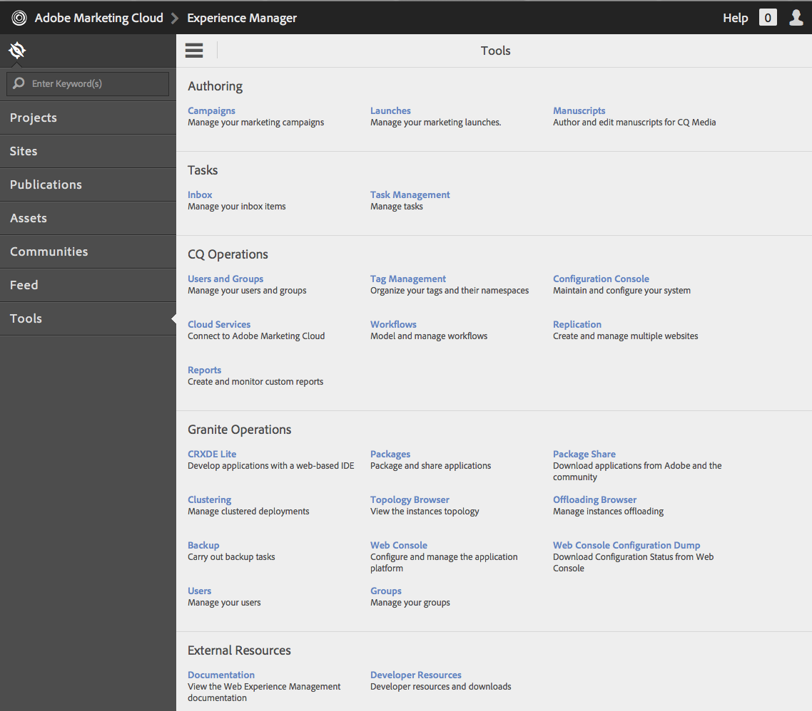
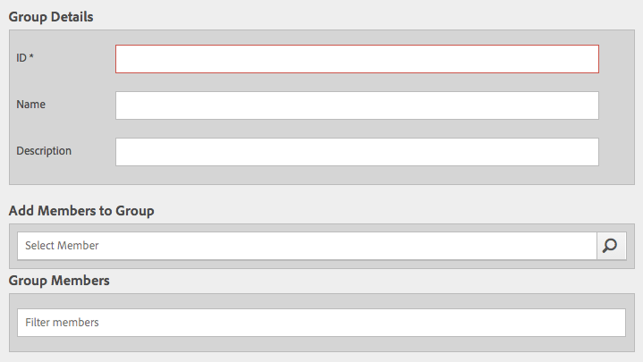

# Operazioni Granite - Amministrazione di utenti e gruppi{#granite-operations-user-and-group-administration}

Poiché Granite incorpora l&#39;implementazione CRX Repository della specifica API JCR, dispone di una propria amministrazione di utenti e gruppi.

Tali conti costituiscono la base sottostante [Account AEM](/help/sites-administering/security.md) e le eventuali modifiche apportate all&#39;account con l&#39;amministrazione Granite saranno applicate se/quando l&#39;accesso ai conti è effettuato dalla [AEM della console Utenti](/help/sites-administering/security.md#accessing-user-administration-with-the-security-console) (ad esempio `http://localhost:4502/useradmin`). Dalla console Utenti AEM puoi anche gestire i privilegi e altre specifiche AEM.

Le console di amministrazione di utenti e gruppi Granite sono entrambe disponibili nella sezione **[Strumenti](/help/sites-administering/tools-consoles.md)** console dell’interfaccia touch:

Scelta di **Utenti** o **Gruppi** dalla console Strumenti verrà aperta la console appropriata. In entrambi i casi puoi intervenire utilizzando la casella di selezione e quindi le azioni dalla barra degli strumenti, oppure aprendo i dettagli dell’account tramite il collegamento in **Nome**.

* [Amministrazione utente](#user-administration)

   

   La **Utenti** elenchi di console:

   * nome utente
   * nome di accesso utente (nome account)
   * qualsiasi titolo assegnato al conto

* [Amministrazione dei gruppi](#group-administration)

   

   La **Gruppi** elenchi di console:

   * il nome del gruppo
   * la descrizione del gruppo
   * il numero di utenti/gruppi nel gruppo

## Amministrazione utente {#user-administration}

### Aggiunta di un nuovo utente {#adding-a-new-user}

1. Utilizza la **Aggiungi utente** icona:

   

1. La **Crea utente** verrà aperto il modulo:

   

   Qui puoi inserire i dettagli utente dell’account (la maggior parte sono standard e esplicativi):

   * **ID**

      Questa è l&#39;identificazione univoca per l&#39;account utente. È obbligatorio e non può contenere spazi.

   * **Indirizzo e-mail**
   * **Password**

      Una password è obbligatoria.

   * **Ripeti password**

      Questo è obbligatorio in quanto è necessario per la conferma della password.

   * **Nome**
   * **Cognome**
   * **Numero telefono**
   * **Qualifica**
   * **Via**
   * **Mobile**
   * **Città**
   * **Codice di avviamento postale**
   * **Paese**
   * **Stadio**
   * **Titolo**
   * **Genere**
   * **Informazioni su**
   * **Impostazioni account**

      * **Stato**
Puoi contrassegnare l’account come 
**attivo** o **inattivo**.
   * **Foto**

      Qui puoi caricare una foto da usare come avatar.

      Tipi di file accettati: `.jpg .png .tif .gif`

      Dimensione preferita: `240x240px`

   * **Aggiungi utente a gruppi**

      Utilizza il menu a discesa di selezione per selezionare i gruppi di cui l’utente deve essere membro. Una volta selezionato, utilizza **X** in base al nome da deselezionare prima di salvare.

   * **Gruppi**

      Elenco dei gruppi di cui l&#39;utente è attualmente membro. Utilizza la **X** in base al nome da deselezionare prima di salvare.

1. Quando hai definito l&#39;account utente, utilizza:

   * **Annulla** per interrompere la registrazione.
   * **Salva** completare la registrazione. La creazione dell’account utente verrà confermata con un messaggio.

### Modifica di un utente esistente {#editing-an-existing-user}

1. Accedi ai dettagli utente dal collegamento sotto il nome utente nella console Utenti.

1. Ora puoi modificare i dettagli come in [Aggiunta di un nuovo utente](#adding-a-new-user).

1. Accedi ai dettagli utente dal collegamento sotto il nome utente nella console Utenti.

1. Ora puoi modificare i dettagli come in [Aggiunta di un nuovo utente](#adding-a-new-user).

### Modifica della password per un utente esistente {#changing-the-password-for-an-existing-user}

1. Accedi ai dettagli utente dal collegamento sotto il nome utente nella console Utenti.

1. Ora puoi modificare i dettagli come in [Aggiunta di un nuovo utente](#adding-a-new-user). Sotto **Impostazioni account** esiste un collegamento per **Modifica password**.

   

1. La **Modifica password** si aprirà la finestra di dialogo . Immetti e digita nuovamente la nuova password insieme alla tua password. Utilizzo **OK** per confermare le modifiche.

   

   Viene visualizzato un messaggio di conferma della modifica della password.

### Assegnazione gruppo rapido {#quick-group-assignment}

1. Utilizza la casella di controllo per contrassegnare uno o più utenti.
1. Utilizza la **Gruppi** icona:

   

   Per aprire il menu a discesa di selezione del gruppo:

   

1. Nella casella di selezione puoi selezionare o deselezionare i gruppi a cui deve appartenere l’account utente.

1. Quando hai assegnato o non assegnato, i gruppi vengono utilizzati come richiesto:

   * **Annulla** per interrompere le modifiche
   * **Salva** per confermare le modifiche

### Eliminazione dei dettagli utente esistenti {#deleting-existing-user-details}

1. Utilizza la casella di controllo per contrassegnare uno o più utenti.
1. Utilizza la **Elimina** per eliminare i dettagli utente:

   

1. Ti verrà chiesto di confermare l’eliminazione, quindi un messaggio confermerà che l’eliminazione effettiva è avvenuta.

## Amministrazione dei gruppi {#group-administration}

### Aggiunta di un nuovo gruppo {#adding-a-new-group}

1. Utilizzate l’icona Aggiungi gruppo :

   

1. La **Crea gruppo** verrà aperto il modulo:

   

   Qui puoi inserire i dettagli del gruppo:

   * **ID**

      Identificatore univoco del gruppo. Questo è obbligatorio e non può contenere spazi.

   * **Nome**

      Nome del gruppo; viene visualizzato nella console Gruppi .

   * **Descrizione**

      Descrizione del gruppo.

   * **Aggiungi membri al gruppo**

      Utilizza il menu a discesa di selezione per selezionare gli utenti da aggiungere al gruppo. Una volta selezionato, utilizza **X** in base al nome da deselezionare prima di salvare.

   * **Membri del gruppo**

      Elenco di utenti nel gruppo. Utilizza la **X** in base al nome da deselezionare prima di salvare.

1. Una volta definito il gruppo, utilizza:

   * **Annulla** per interrompere la registrazione.
   * **Salva** completare la registrazione. La creazione del gruppo verrà confermata con un messaggio.

### Modifica di un gruppo esistente {#editing-an-existing-group}

1. Accedi ai dettagli del gruppo dal collegamento sotto il nome del gruppo nella console Gruppi.

1. Ora puoi modificare e salvare i dettagli come in [Aggiunta di un nuovo gruppo](#adding-a-new-group).

### Copia di un gruppo esistente {#copying-an-existing-group}

1. Utilizza la casella di controllo per contrassegnare un gruppo.
1. Utilizza la **Copia** per copiare i dettagli del gruppo:

   

1. La **Modifica impostazioni gruppo** il modulo verrà aperto.

   L&#39;ID gruppo sarà lo stesso dell&#39;originale, ma con il prefisso `Copy of`. È necessario modificarlo in quanto l’ID non può contenere spazi. Tutti gli altri dettagli saranno uguali all&#39;originale.

   Ora puoi modificare e salvare i dettagli come in [Aggiunta di un nuovo gruppo](#adding-a-new-group).

### Eliminazione di un gruppo esistente {#deleting-an-existing-group}

1. Utilizza la casella di controllo per contrassegnare uno o più gruppi.
1. Utilizza la **Elimina** per eliminare i dettagli del gruppo:

   

1. Ti verrà chiesto di confermare l’eliminazione, quindi un messaggio confermerà che l’eliminazione effettiva è avvenuta.
