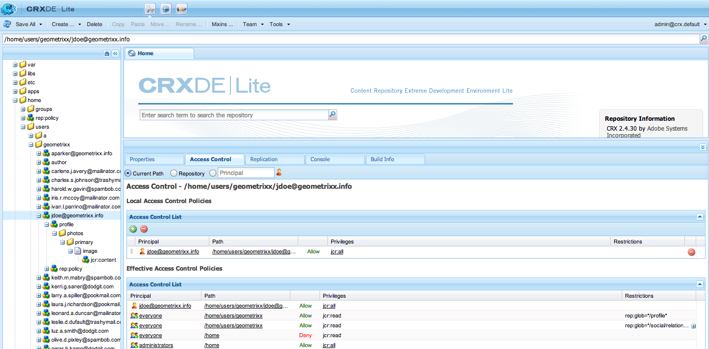
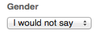

# Gestione identità{#identity-management}

I singoli visitatori del sito web possono essere identificati solo se è possibile consentire loro di accedere. Esistono diversi motivi per cui potrebbe essere utile fornire una funzionalità di accesso:

* [AEM Communities](/help/communities/overview.md)I visitatori del sito devono effettuare l&#39;accesso per pubblicare contenuti nella community.
* [Gruppi utenti chiusi](/help/sites-administering/cug.md)

  Potrebbe essere necessario limitare l’accesso al sito web (o a sue sezioni) a visitatori specifici.

* [Personalization](/help/sites-administering/personalization.md) consente ai visitatori di configurare alcuni aspetti delle modalità di accesso al sito Web.

La funzionalità di accesso (e disconnessione) è fornita da un account [con un **profilo**](#profiles-and-user-accounts), che contiene informazioni aggiuntive sul visitatore (utente) registrato. Le procedure effettive di registrazione e di autorizzazione possono differire:

* Autoregistrazione dal sito web

  È possibile configurare un [sito community](/help/communities/sites-console.md) per consentire ai visitatori di registrarsi autonomamente o di accedere con i propri account Facebook o di Twitter.

* Richiesta di registrazione dal sito web

  Per un gruppo di utenti chiuso puoi consentire ai visitatori di richiedere la registrazione, ma applicare l’autorizzazione tramite un flusso di lavoro.

* Registra ogni account dall’ambiente di authoring

  Se disponi di un numero limitato di profili che necessitano comunque dell’autorizzazione, puoi decidere di registrarli direttamente.

Per consentire ai visitatori di registrarsi, è possibile utilizzare una serie di componenti e moduli per raccogliere le informazioni di identificazione richieste, quindi le informazioni di profilo aggiuntive (spesso facoltative). Dopo la registrazione, essi dovrebbero anche essere in grado di verificare e aggiornare i dati che hanno presentato.

È possibile configurare o sviluppare ulteriori funzionalità:

* Configurare la replica inversa necessaria.
* Consenti a un utente di rimuovere il proprio profilo sviluppando un modulo insieme a un flusso di lavoro.

>[!NOTE]
>
>Le informazioni specificate nel profilo possono essere utilizzate anche per fornire all&#39;utente contenuti mirati tramite [Segmenti](/help/sites-administering/campaign-segmentation.md) e [Campagne](/help/sites-classic-ui-authoring/classic-personalization-campaigns.md).

## Forms di registrazione {#registration-forms}

È possibile utilizzare un [modulo](/help/sites-authoring/default-components.md#form-component) per raccogliere le informazioni di registrazione e generare il nuovo account e profilo.

Gli utenti possono, ad esempio, richiedere un nuovo profilo utilizzando la pagina Geometrixx
`http://localhost:4502/content/geometrixx-outdoors/en/user/register.html`


Quando si invia la richiesta, viene visualizzata la pagina del profilo in cui l’utente può fornire i dati personali.


Il nuovo account è visibile anche nella console [Utenti](/help/sites-administering/security.md).

## Accesso {#login}

Il componente di accesso può essere utilizzato per raccogliere le informazioni di accesso, quindi attivare il processo di accesso.

In questo modo il visitatore dispone dei campi standard di **Nome utente** e **Password**, con un pulsante **Accesso** per attivare il processo di accesso quando vengono immesse le credenziali.

Gli utenti, ad esempio, possono effettuare l&#39;accesso o creare un account utilizzando l&#39;opzione **Accedi** sulla barra degli strumenti di Geometrixx, che utilizza la pagina:

`http://localhost:4502/content/geometrixx-outdoors/en/user/sign-in.html`


## Disconnessione {#logging-out}

Poiché è presente un meccanismo di accesso, è necessario anche un meccanismo di disconnessione. Questa opzione è disponibile come opzione **Disconnetti** in Geometrixx.

## Visualizzazione e aggiornamento di un profilo {#viewing-and-updating-a-profile}

A seconda del modulo di registrazione, il visitatore potrebbe avere delle informazioni registrate nel suo profilo. Dovrebbero essere in grado di visualizzarlo e/o aggiornarlo in una fase successiva. Questa operazione può essere eseguita con un modulo simile, ad esempio in Geometrixx:

```
http://localhost:4502/content/geometrixx-outdoors/en/user/profile.html
```

Per visualizzare i dettagli del tuo profilo, fai clic su **Profilo personale** nell&#39;angolo superiore destro di qualsiasi pagina, ad esempio con l&#39;account `admin`:
`http://localhost:4502/home/users/a/admin/profile.form.html/content/geometrixx-outdoors/en/user/profile.html.`

È possibile visualizzare un altro profilo utilizzando il [contesto client](/help/sites-administering/client-context.md) (nell&#39;ambiente di authoring e con privilegi sufficienti):

1. Apri una pagina; ad esempio, la pagina Geometrixx:

   `http://localhost:4502/cf#/content/geometrixx/en.html`

1. Fai clic su **Il mio profilo** nell&#39;angolo superiore destro. Visualizzerai il profilo del tuo account corrente, ad esempio l’amministratore.
1. Premere **control-alt-C** per aprire il contesto client.
1. Nell&#39;angolo in alto a sinistra del contesto client, fare clic sul pulsante **Carica un profilo**.

   

1. Selezionare un altro profilo dall&#39;elenco a discesa nella finestra di dialogo, ad esempio **Alison Parker**.
1. Fai clic su **OK**.
1. Fai di nuovo clic su **Il mio profilo**. Il modulo verrà aggiornato con i dettagli di Alison.

   

1. È ora possibile utilizzare **Modifica profilo** o **Modifica password** per aggiornare i dettagli.

## Aggiunta di campi alla definizione del profilo {#adding-fields-to-the-profile-definition}

Puoi aggiungere campi alla definizione del profilo. Ad esempio, per aggiungere un campo &quot;Colore preferito&quot; al profilo di Geometrixx:

1. Dalla console Siti web, passa a Geometrixx Outdoors Sito > Inglese > Utente > Il mio profilo.
1. Fare doppio clic sulla pagina **Profilo personale** per aprirla per la modifica.
1. Nella scheda **Componenti** della barra laterale espandere la sezione **Modulo**.
1. Trascina un **elenco a discesa** dalla barra laterale al modulo, appena sotto il campo **Informazioni su di me**.
1. Fare doppio clic sul componente **Elenco a discesa** per aprire la finestra di dialogo per la configurazione e immettere:

   * **Nome elemento** - `favoriteColor`
   * **Titolo** - `Favorite Color`
   * **Elementi** - Aggiungere più colori come elementi

   Fare clic su **OK** per salvare.

1. Chiudere la pagina e tornare alla console **Siti Web** e attivare la pagina Il mio profilo.

   La prossima volta che visualizzi un profilo puoi selezionare un colore preferito:

   

   Il campo verrà salvato nella sezione **profile** dell&#39;account utente pertinente:

   

## Stati del profilo {#profile-states}

Ci sono diversi casi d&#39;uso che richiedono di sapere se un utente (o piuttosto il suo profilo) è in uno stato *specifico* o meno.

Ciò comporta la definizione di una proprietà appropriata nel profilo utente in modo che:

* è visibile e accessibile all’utente
* definisce due stati per ogni proprietà
* consente di alternare tra i due stati definiti

Questa operazione viene eseguita con:

* [Provider di stato](#state-providers)

  Gestire i due stati di una proprietà specifica e le transizioni tra i due stati.

* [Flussi di lavoro](#workflows)

  Gestire le azioni relative agli stati.

È possibile definire più stati; ad esempio, in Geometrixx questi includono:

* iscrizione (o annullamento) a notifiche su newsletter o thread di commenti
* aggiunta e rimozione di una connessione a un amico

### Provider di stato {#state-providers}

Un provider di stato gestisce lo stato corrente della proprietà in questione, insieme alle transizioni tra i due stati possibili.

I provider di stati sono implementati come componenti, quindi possono essere personalizzati per il progetto. In Geometrixx questi includono:

* Effettua/cancella sottoscrizione topic forum
* Aggiungi/Rimuovi amico

### Flussi di lavoro {#workflows}

I provider di stati gestiscono una proprietà di profilo e i relativi stati.

È necessario un flusso di lavoro per implementare le azioni relative agli stati. Ad esempio, per l’abbonamento alle notifiche, il flusso di lavoro gestirà l’azione di abbonamento effettiva; per l’annullamento dell’abbonamento alle notifiche, il flusso di lavoro gestirà la rimozione dell’utente dall’elenco di abbonamento.

## Profili e account utente {#profiles-and-user-accounts}

I profili vengono archiviati nel repository dei contenuti come parte dell&#39;account utente [&#128279;](/help/sites-administering/user-group-ac-admin.md).

Il profilo si trova in `/home/users/geometrixx`:


In un’installazione standard (di authoring o pubblicazione) tutti hanno accesso in lettura all’intero profilo di tutti gli utenti. Everyone è un gruppo &quot;*predefinito contenente automaticamente tutti gli utenti e i gruppi esistenti. Impossibile modificare l&#39;elenco dei membri*&quot;.

Questi diritti di accesso sono definiti dal seguente ACL con caratteri jolly:

/home tutti consentono jcr:read rep:glob = &#42;/profile&#42;

Ciò consente di:

* forum, commenti o post di blog per visualizzare informazioni (come icona o nome completo) dal profilo appropriato
* collegamenti alle pagine di profilo geometrixx

Se tale accesso non è appropriato per l&#39;installazione in uso, è possibile modificare le impostazioni predefinite.

Questa operazione può essere eseguita utilizzando la scheda **[Controllo dell&#39;accesso](/help/sites-administering/user-group-ac-admin.md#access-right-management)**:



## Componenti del profilo {#profile-components}

Per definire i requisiti del profilo per il sito è inoltre disponibile una serie di componenti del profilo.

### Campo per password verificata {#checked-password-field}

Questo componente offre due campi per:

* inserimento di una password
* un segno di spunta per verificare che la password sia stata inserita correttamente.

Con le impostazioni predefinite, il componente viene visualizzato come segue:


### Foto avatar profilo {#profile-avatar-photo}

Questo componente offre all’utente un meccanismo per selezionare e caricare un file di foto avatar.


### Nome completo profilo {#profile-detailed-name}

Questo componente consente all’utente di immettere un nome dettagliato.


### Genere profilo {#profile-gender}

Questo componente consente all’utente di inserire il proprio genere.


