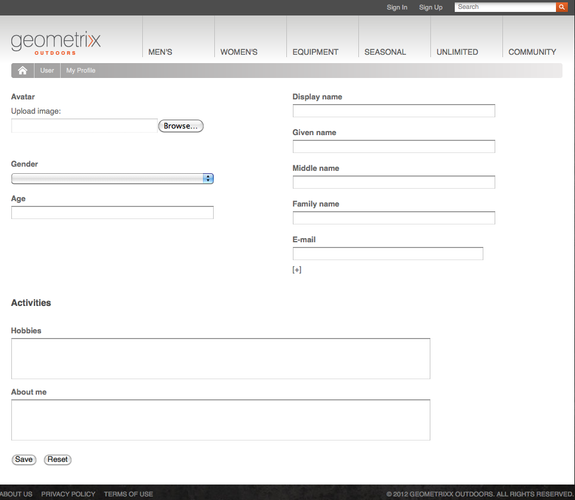

# Gestione identità{#identity-management}

I singoli visitatori del sito web possono essere identificati solo quando è possibile accedere. È possibile fornire una funzionalità di accesso per diversi motivi:

* [AEM Communities](/help/communities/overview.md)Ai visitatori del sito viene richiesto di accedere per pubblicare contenuti nella community.
* [Gruppi di utenti chiusi](/help/sites-administering/cug.md)

   Potrebbe essere necessario limitare l’accesso al sito web (o a sezioni di esso) a visitatori specifici.

* [Personalizzazione](/help/sites-administering/personalization.md) Consente ai visitatori di configurare alcuni aspetti del modo in cui accedono al sito web.

La funzionalità di accesso (e disconnessione) è fornita da un [account con un **Profilo**](#profiles-and-user-accounts), che contiene informazioni aggiuntive sul visitatore registrato (utente). Le procedure effettive di registrazione e autorizzazione possono differire:

* Autoregistrazione dal sito web

   A [Sito community](/help/communities/sites-console.md) può essere configurato per consentire ai visitatori di registrarsi o accedere autonomamente con i loro account Facebook o Twitter.

* Richiesta di registrazione dal sito web

   Per un gruppo utenti chiuso puoi consentire ai visitatori di richiedere la registrazione, ma imporre l’autorizzazione tramite un flusso di lavoro.

* Registrare ogni account dall’ambiente di authoring

   Se disponi di un numero limitato di profili che necessitano comunque di autorizzazione, puoi decidere di registrarli direttamente.

Per consentire ai visitatori di registrarsi, è possibile utilizzare una serie di componenti e moduli per raccogliere le informazioni di identificazione richieste, quindi le informazioni aggiuntive (spesso facoltative) sul profilo. Dopo la registrazione, gli interessati devono anche essere in grado di controllare e aggiornare i dati che hanno presentato.

Ulteriori funzionalità possono essere configurate o sviluppate:

* Configura qualsiasi replica inversa necessaria.
* Consente all’utente di rimuovere il profilo sviluppando un modulo insieme a un flusso di lavoro.

>[!NOTE]
>
>Le informazioni specificate nel profilo possono essere utilizzate anche per fornire all’utente contenuti mirati tramite [Segmenti](/help/sites-administering/campaign-segmentation.md) e [Campagne](/help/sites-classic-ui-authoring/classic-personalization-campaigns.md).

## Registrazione Forms {#registration-forms}

A [modulo](/help/sites-authoring/default-components.md#form-component) può essere utilizzato per raccogliere le informazioni di registrazione, quindi generare il nuovo account e profilo.

Ad esempio, gli utenti possono richiedere un nuovo profilo utilizzando la pagina Geometrixx
`http://localhost:4502/content/geometrixx-outdoors/en/user/register.html`


Dopo aver inviato la richiesta, si apre la pagina del profilo in cui l’utente può fornire i dati personali.



Il nuovo account è visibile anche nel [Console Utenti](/help/sites-administering/security.md).

## Accesso {#login}

Il componente Accesso può essere utilizzato per raccogliere le informazioni di accesso e quindi attivare il processo di accesso.

Questo fornisce al visitatore i campi standard di **Nome utente** e **Password**, con **Login** per attivare il processo di accesso quando le credenziali vengono immesse.

Ad esempio, gli utenti possono effettuare l&#39;accesso o creare un nuovo account utilizzando **Accesso** nella barra degli strumenti di Geometrixx, che utilizza la pagina:

`http://localhost:4502/content/geometrixx-outdoors/en/user/sign-in.html`


## Disconnessione {#logging-out}

Dato che esiste un meccanismo di accesso, è necessario anche un meccanismo di logout. È disponibile come **Esci** in Geometrixx.

## Visualizzazione e aggiornamento di un profilo {#viewing-and-updating-a-profile}

A seconda del modulo di registrazione, il visitatore potrebbe avere delle informazioni registrate nel suo profilo. Essi dovrebbero essere in grado di visualizzare e/o aggiornare questo in una fase successiva. Questo può essere fatto con una forma simile; ad esempio, in Geometrixx:

```
http://localhost:4502/content/geometrixx-outdoors/en/user/profile.html
```

Per visualizzare i dettagli del tuo profilo clicca su **Il mio profilo** nell’angolo in alto a destra di qualsiasi pagina; ad esempio con `admin` account:
`http://localhost:4502/home/users/a/admin/profile.form.html/content/geometrixx-outdoors/en/user/profile.html.`

Puoi visualizzare un altro profilo utilizzando [contesto client](/help/sites-administering/client-context.md) (nell’ambiente di authoring e con privilegi sufficienti):

1. Aprire una pagina; ad esempio la pagina Geometrixx:

   `http://localhost:4502/cf#/content/geometrixx/en.html`

1. Fai clic su **Il mio profilo** nell&#39;angolo in alto a destra. Vedrai il profilo del tuo account corrente; ad esempio l&#39;amministratore.
1. Press **control-alt-C** per aprire il contesto client.
1. Nell’angolo in alto a sinistra del contesto client, fai clic sul pulsante **Caricare un profilo** pulsante .

   

1. Seleziona un altro profilo dall’elenco a discesa nella finestra di dialogo; ad esempio, **Alison Parker**.
1. Fai clic su **OK**.
1. Fai di nuovo clic su **Il mio profilo**. Il modulo verrà aggiornato con i dettagli di Alison.

   

1. Ora puoi utilizzare **Modifica profilo** o **Modifica password** per aggiornare i dettagli.

## Aggiunta di campi alla definizione del profilo {#adding-fields-to-the-profile-definition}

Puoi aggiungere campi alla definizione del profilo. Ad esempio, per aggiungere un campo &quot;Colore preferito&quot; al profilo Geometrixx:

1. Dalla console Siti web passa a Geometrixx Outdoors Sito > Inglese > Utente > Il mio profilo.
1. Fai doppio clic sul pulsante **Il mio profilo** per aprirlo in modalità di modifica.
1. In **Componenti** scheda della barra laterale espandi la **Modulo** sezione .
1. Trascina un **Elenco a discesa** dalla barra laterale al modulo, appena sotto il **Informazioni su di me** campo .
1. Fai doppio clic sul pulsante **Elenco a discesa** per aprire la finestra di dialogo per la configurazione e immettere:

   * **Nome elemento** - `favoriteColor`
   * **Titolo** - `Favorite Color`
   * **Elementi** - Aggiungi diversi colori come elementi

   Fate clic su **OK** per salvare. 

1. Chiudi la pagina e torna alla pagina **Siti Web** console e attiva la pagina Profilo personale .

   La prossima volta che visualizzi un profilo puoi selezionare un colore preferito:

   

   Il campo viene salvato nella **profilo** sezione dell’account utente pertinente:

   

## Stati del profilo {#profile-states}

Esistono diversi casi d’uso che richiedono di sapere se un utente (o piuttosto il suo profilo) si trova in un *stato specifico* o no.

Ciò comporta la definizione di una proprietà appropriata nel profilo utente in modo che:

* è visibile e accessibile all’utente
* definisce due stati per ogni proprietà
* consente di alternare tra i due stati definiti

Questa operazione viene eseguita con:

* [Fornitori di Stato](#state-providers)

   Gestire i due stati di una proprietà specifica e le transizioni tra i due.

* [Flussi di lavoro](#workflows)

   Gestire le azioni relative agli stati.

È possibile definire più stati; ad esempio, in Geometrixx questi includono:

* abbonamento (o annullamento dell’abbonamento) a notifiche su newsletter o thread di commento
* aggiunta e rimozione di una connessione a un amico

### Fornitori di Stato {#state-providers}

Il fornitore statale gestisce lo stato attuale della proprietà in questione, nonché le transizioni tra i due stati possibili.

I provider di stato sono implementati come componenti, quindi possono essere personalizzati per il progetto. In Geometrixx questi includono:

* Effettua/cancella sottoscrizione topic forum
* Aggiungi/rimuovi amico

### Flussi di lavoro {#workflows}

I provider di stato gestiscono una proprietà di profilo e i relativi stati.

È necessario un flusso di lavoro per implementare le azioni relative agli stati . Ad esempio, con l’abbonamento per le notifiche, il flusso di lavoro gestirà l’azione di abbonamento effettiva; quando si annulla l’iscrizione alle notifiche, il flusso di lavoro gestisce la rimozione dell’utente dall’elenco di sottoscrizione.

## Profili e account utente {#profiles-and-user-accounts}

I profili vengono memorizzati nell’archivio dei contenuti come parte del[account utente](/help/sites-administering/user-group-ac-admin.md).

Il profilo si trova in `/home/users/geometrixx`:


In un’installazione standard (authoring o pubblicazione) tutti possono accedere in lettura alle informazioni di profilo di tutti gli utenti. tutti sono un &quot;*Gruppo predefinito che contiene automaticamente tutti gli utenti e i gruppi esistenti. Impossibile modificare l&#39;elenco dei membri*&quot;.

Questi diritti di accesso sono definiti dal seguente ACL con caratteri jolly:

/home tutti permettono jcr:read rep:glob = &#42;/profile&#42;

Ciò consente di:

* forum, commenti o post di blog per visualizzare informazioni (ad esempio icona o nome completo) dal profilo appropriato
* collegamenti alle pagine di profilo geometrixx

Se tale accesso non è appropriato per l&#39;installazione in uso, è possibile modificare queste impostazioni predefinite.

Questa operazione può essere eseguita utilizzando **[Controllo degli accessi](/help/sites-administering/user-group-ac-admin.md#access-right-management)** scheda:


## Componenti Profilo {#profile-components}

È disponibile anche una serie di componenti di profilo per definire i requisiti di profilo per il sito.

### Campo per password verificata {#checked-password-field}

Questo componente fornisce due campi:

* per inserire una password;
* per verificare che la password sia stata inserita correttamente.

Con le impostazioni predefinite, il componente si presenta come segue:


### Foto avatar profilo {#profile-avatar-photo}

Questo componente offre all’utente la possibilità di selezionare e caricare un file di foto avatar.


### Nome completo profilo {#profile-detailed-name}

Questo componente permette all’utente di inserire un nome dettagliato.


### Genere profilo {#profile-gender}

Questo componente permette all’utente di inserire il proprio genere.


