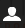

# Gestione identità{#identity-management}

I singoli visitatori del sito Web possono essere identificati solo quando è possibile accedervi. Esistono diversi motivi per cui potrebbe essere utile fornire una funzionalità di accesso:

* [AEM ](/help/communities/overview.md)CommunitiesI visitatori del sito devono effettuare l&#39;accesso per inviare contenuti alla community.
* [Gruppi di utenti chiusi](/help/sites-administering/cug.md)

   Potrebbe essere necessario limitare l’accesso al sito Web (o a sezioni di esso) a visitatori specifici.

* [](/help/sites-administering/personalization.md) PersonalizzazioneConsente ai visitatori di configurare alcuni aspetti di come accedono al sito Web.

La funzionalità di accesso (e disconnessione) è fornita da un account [con un **Profilo**](#profiles-and-user-accounts), che contiene informazioni aggiuntive sul visitatore registrato (utente). Le procedure effettive di registrazione e autorizzazione possono essere diverse:

* Autoregistrazione dal sito Web

   È possibile configurare un [sito community](/help/communities/sites-console.md) per consentire ai visitatori di registrarsi o accedere autonomamente con i propri account Facebook o Twitter.

* Richiesta di registrazione dal sito Web

   Per un gruppo di utenti chiuso potete consentire ai visitatori di richiedere la registrazione, ma imporre l&#39;autorizzazione tramite un flusso di lavoro.

* Registrazione di ciascun account dall’ambiente di authoring

   Se disponete di un numero limitato di profili, per i quali sarà comunque necessaria l&#39;autorizzazione, potete decidere di registrarli direttamente.

Per consentire ai visitatori di registrarsi, è possibile utilizzare una serie di componenti e moduli per raccogliere le informazioni di identificazione richieste, quindi le informazioni aggiuntive (spesso facoltative) sul profilo. Dopo essersi registrati, dovrebbero anche essere in grado di controllare e aggiornare i dati che hanno inviato.

Funzionalità aggiuntive possono essere configurate o sviluppate:

* Configurare qualsiasi replica inversa richiesta.
* Consentire agli utenti di rimuovere il proprio profilo sviluppando un modulo con un flusso di lavoro.

>[!NOTE]
>
>Le informazioni specificate nel profilo possono essere utilizzate anche per fornire all&#39;utente contenuti mirati tramite [Segments](/help/sites-administering/campaign-segmentation.md) e [Campaigns](/help/sites-classic-ui-authoring/classic-personalization-campaigns.md).

## Registrazione Forms {#registration-forms}

È possibile utilizzare un [modulo](/help/sites-authoring/default-components.md#form-component) per raccogliere le informazioni di registrazione e quindi generare il nuovo account e profilo.

Ad esempio, gli utenti possono richiedere un nuovo profilo utilizzando la pagina di Geometrixx
`http://localhost:4502/content/geometrixx-outdoors/en/user/register.html`


Dopo aver inviato la richiesta, si apre la pagina del profilo in cui l&#39;utente può fornire i dati personali.


Il nuovo account è visibile anche nella [console Utenti](/help/sites-administering/security.md).

## Accesso {#login}

Il componente login può essere utilizzato per raccogliere le informazioni di login, quindi attivare il processo di login.

Questo fornisce al visitatore i campi standard di **Nome utente** e **Password**, con un pulsante **Login** per attivare il processo di accesso quando vengono immesse le credenziali.

Ad esempio, gli utenti possono effettuare l&#39;accesso o creare un nuovo account utilizzando l&#39;opzione **Accedi** nella barra degli strumenti dell&#39;Geometrixx, che utilizza la pagina:

`http://localhost:4502/content/geometrixx-outdoors/en/user/sign-in.html`


## Disconnessione {#logging-out}

Poiché esiste un meccanismo di login, è necessario anche un meccanismo di logout. È disponibile come opzione **Esci** in Geometrixx.

## Visualizzazione e aggiornamento di un profilo {#viewing-and-updating-a-profile}

A seconda del modulo di registrazione, il visitatore potrebbe avere nel suo profilo delle informazioni registrate. Dovrebbero essere in grado di visualizzare e/o aggiornare la situazione in una fase successiva. Questo può essere fatto con un modulo simile; ad esempio, in Geometrixx:

```
http://localhost:4502/content/geometrixx-outdoors/en/user/profile.html
```

Per visualizzare i dettagli del tuo profilo, fai clic su **My Profile** nell&#39;angolo superiore destro di qualsiasi pagina; ad esempio con l&#39;account `admin`:
`http://localhost:4502/home/users/a/admin/profile.form.html/content/geometrixx-outdoors/en/user/profile.html.`

Potete visualizzare un altro profilo utilizzando il [contesto client](/help/sites-administering/client-context.md) (nell&#39;ambiente di authoring e con privilegi sufficienti):

1. Aprire una pagina; ad esempio, la pagina di Geometrixx:

   `http://localhost:4502/cf#/content/geometrixx/en.html`

1. Fare clic su **Profilo personale** nell&#39;angolo in alto a destra. Vedrai il profilo del tuo account corrente; ad esempio l&#39;amministratore.
1. Premere **control-alt-C** per aprire il contesto client.
1. Nell&#39;angolo superiore sinistro del contesto client, fare clic sul pulsante **Carica un profilo**.

   

1. Selezionate un altro profilo dall’elenco a discesa nella finestra di dialogo; ad esempio, **Alison Parker**.
1. Fai clic su **OK**.
1. Fare di nuovo clic su **Profilo personale**. Il modulo verrà aggiornato con i dettagli di Alison.

   

1. Per aggiornare i dettagli è ora possibile utilizzare **Modifica profilo** o **Modifica password**.

## Aggiunta di campi alla definizione del profilo {#adding-fields-to-the-profile-definition}

È possibile aggiungere campi alla definizione del profilo. Ad esempio, per aggiungere un campo &quot;Colore preferito&quot; al profilo di Geometrixx:

1. Dalla console Siti Web andate a Geometrixx Outdoors Site > English > User > My Profile (Sito Web).
1. Fare doppio clic sulla pagina **Profilo personale** per aprirla in modalità di modifica.
1. Nella scheda **Componenti** della barra laterale, espandere la sezione **Modulo**.
1. Trascinare un **Elenco a discesa** dalla barra laterale al modulo, immediatamente sotto il campo **Informazioni su di me**.
1. Fare doppio clic sul componente **Elenco a discesa** per aprire la finestra di dialogo per la configurazione e immettere:

   * **Nome elemento** - `favoriteColor`
   * **Titolo** - `Favorite Color`
   * **Articoli**  - Aggiungi diversi colori come elementi

   Fate clic su **OK** per salvare. 

1. Chiudi la pagina e torna alla console **Siti Web** e attiva la pagina Profilo personale.

   La prossima volta che visualizzate un profilo potete selezionare un colore preferito:

   

   Il campo verrà salvato nella sezione **profile** dell&#39;account utente pertinente:

   

## Stati profilo {#profile-states}

Esistono diversi casi d&#39;uso che richiedono di sapere se un utente (o meglio il suo profilo) si trova in uno stato *specifico* o meno.

Ciò comporta la definizione di una proprietà appropriata nel profilo utente in modo che:

* è visibile e accessibile all&#39;utente
* definisce due stati per ciascuna proprietà
* consente di alternare tra i due stati definiti

A questo scopo:

* [Fornitori di stato](#state-providers)

   Per gestire i due stati di una specifica proprietà e le transizioni tra i due.

* [Flussi di lavoro](#workflows)

   Per gestire le azioni relative agli stati.

È possibile definire più stati; ad esempio, in questi Geometrixx:

* sottoscrizione (o annullamento della sottoscrizione) alle notifiche su newsletter o thread di commenti
* aggiunta e rimozione di una connessione a un amico

### Fornitori di stato {#state-providers}

Un provider di stato gestisce lo stato corrente della proprietà in questione, insieme alle transizioni tra i due stati possibili.

I provider di stato sono implementati come componenti, quindi possono essere personalizzati per il progetto. In Geometrixx questi comprendono:

* Effettua/cancella sottoscrizione topic forum
* Aggiungi/rimuovi amico

### Flussi di lavoro {#workflows}

I provider di stato gestiscono una proprietà profilo e i relativi stati.

È necessario un flusso di lavoro per implementare le azioni relative agli stati. Ad esempio, con la sottoscrizione alle notifiche il flusso di lavoro gestirà l’azione di iscrizione effettiva; quando si annulla l&#39;iscrizione dalle notifiche, il flusso di lavoro gestirà la rimozione dell&#39;utente dall&#39;elenco delle iscrizioni.

## Profili e account utente {#profiles-and-user-accounts}

I profili vengono memorizzati nell&#39;archivio dei contenuti come parte dell&#39;account [utente](/help/sites-administering/user-group-ac-admin.md).

Il profilo si trova in `/home/users/geometrixx`:


In un’installazione standard (autore o pubblicazione), tutti possono accedere in lettura alle informazioni di profilo di tutti gli utenti. tutti sono un &quot;*gruppo predefinito che contiene automaticamente tutti gli utenti e i gruppi esistenti. L&#39;elenco dei membri non può essere modificato*&quot;.

Tali diritti di accesso sono definiti dal seguente ACL con caratteri jolly:

/home tutti consentono jcr:read rep:dm = */profile*

Ciò consente di:

* forum, commenti o post di blog per visualizzare informazioni (ad esempio icona o nome completo) dal profilo appropriato
* collegamenti alle pagine di profilo geometrixx

Se tale accesso non è appropriato per l’installazione in uso, potete modificare queste impostazioni predefinite.

Questa operazione può essere eseguita utilizzando la scheda **[Controllo accesso](/help/sites-administering/user-group-ac-admin.md#access-right-management)**:


## Componenti Profilo {#profile-components}

Sono inoltre disponibili una serie di componenti di profilo per definire i requisiti di profilo per il sito.

### Campo per password verificata {#checked-password-field}

Questo componente fornisce due campi:

* per inserire una password;
* per verificare che la password sia stata inserita correttamente.

Con le impostazioni predefinite, il componente si presenta come segue:


### Foto avatar profilo {#profile-avatar-photo}

Questo componente offre all’utente la possibilità di selezionare e caricare un file di foto avatar.


### Nome completo profilo {#profile-detailed-name}

Questo componente permette all’utente di inserire un nome dettagliato.


### Genere profilo {#profile-gender}

Questo componente permette all’utente di inserire il proprio genere.


