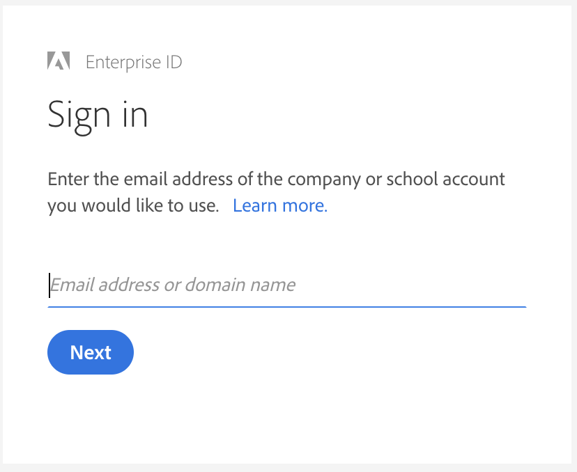

# Autenticazione e [!DNL Admin Console] Supporto per AEM Managed Services {#adobe-ims-authentication-and-admin-console-support-for-aem-managed-services}

>[!NOTE]
>
>Questa funzione è disponibile solo per i clienti Adobe Managed Services.

## Introduzione {#introduction}

AEM 6.4.3.0 introduce [!DNL Admin Console] supporto per le istanze AEM e autenticazione basata su Adobe IMS (Identity Management System) per **Managed Services AEM** clienti.

Onboarding dell’AEM in [!DNL Admin Console] consentirà ai clienti Managed Services dell’AEM di gestire tutti gli utenti Experienci Cloud in un’unica console. Gli utenti possono essere assegnati a profili di prodotto associati a istanze AEM, consentendo loro di accedere a un’istanza specifica.

## Elementi di rilievo {#key-highlights}

* Il supporto per l’autenticazione AEM IMS è riservato solo agli autori, agli amministratori o agli sviluppatori AEM e non agli utenti finali esterni del sito del cliente, come i visitatori del sito
* Il [!DNL Admin Console] rappresenterà i clienti Managed Services dell’AEM come organizzazioni IMS e le loro istanze come contesti di prodotto. Gli amministratori di prodotto e sistema del cliente potranno gestire l’accesso alle istanze
* AEM Managed Services sincronizzerà le topologie dei clienti con [!DNL Admin Console]. Nell’ sarà presente un’istanza del contesto di prodotto AEM Managed Services per istanza [!DNL Admin Console].
* Profili di prodotto in [!DNL Admin Console] determina le istanze a cui un utente può accedere
* È supportata l’autenticazione federata tramite i provider di identità conformi a SAML 2 dei clienti
* Saranno supportati solo Enterprise ID e Federated ID (per il Single Sign-On del cliente), non gli ID Adobe personali.
* [!DNL User Management] (nell&#39;Adobe [!DNL Admin Console]) continuerà a essere di proprietà degli amministratori dei clienti.

## Architettura {#architecture}

L’autenticazione IMS funziona utilizzando il protocollo OAuth tra l’AEM e l’endpoint Adobe IMS. Dopo l’aggiunta a IMS, un utente con identità Adobe può accedere ad AEM Managed Services utilizzando le credenziali IMS.

Il flusso di accesso dell’utente è mostrato di seguito, l’utente verrà reindirizzato a IMS e facoltativamente all’IDP del cliente per la convalida SSO e quindi reindirizzato nuovamente a AEM.

## Come Impostare {#how-to-set-up}

### Onboarding di organizzazioni in [!DNL Admin Console] {#onboarding-organizations-to-admin-console}

L’onboarding del cliente in [!DNL Admin Console] è un prerequisito per l’utilizzo di Adobe IMS per l’autenticazione AEM.

Come primo passaggio, per i clienti deve essere stato eseguito il provisioning di un’organizzazione in Adobe IMS. Adobe I clienti Enterprise sono rappresentati come organizzazioni IMS nel [Adobe [!DNL Admin Console]](https://helpx.adobe.com/it/enterprise/using/admin-console.html).

I clienti Managed Services dell’AEM devono già avere eseguito il provisioning di un’organizzazione e, come parte del provisioning IMS, le istanze dei clienti saranno rese disponibili nel [!DNL Admin Console] per la gestione dei diritti utente e dell’accesso.

Il passaggio a IMS per l’autenticazione degli utenti sarà uno sforzo congiunto tra AMS e i clienti, ciascuno con i propri flussi di lavoro da completare.

Una volta che un cliente esiste come organizzazione IMS e AMS ha completato il provisioning per IMS, si tratta del riepilogo dei flussi di lavoro di configurazione richiesti:

1. L’amministratore di sistema designato riceve un invito ad accedere al [!DNL Admin Console]
1. L’amministratore di sistema richiede il dominio per confermare la proprietà del dominio (in questo esempio acme.com)
1. L’amministratore di sistema configura le directory utente
1. L’amministratore di sistema configura il provider di identità (IDP) in [!DNL Admin Console] per la configurazione SSO.
1. L’amministratore AEM gestisce i gruppi locali, le autorizzazioni e i privilegi come di consueto. Consulta User and Group Sync

>[!NOTE]
>
>Per ulteriori informazioni sull’Adobe Nozioni di base di Identity Management, inclusa la configurazione IDP, consulta l’articolo [questa pagina.](https://helpx.adobe.com/it/enterprise/using/set-up-identity.html)
>
>Per ulteriori informazioni su Enterprise Administration e [!DNL Admin Console] vedi l’articolo [questa pagina](https://helpx.adobe.com/it/enterprise/managing/user-guide.html).

### Onboarding degli utenti in [!DNL Admin Console] {#onboarding-users-to-the-admin-console}

Sono disponibili tre modi per integrare gli utenti a seconda delle dimensioni del cliente e delle sue preferenze:

1. Creare manualmente utenti e gruppi in [!DNL Admin Console]
1. Carica un file CSV con gli utenti
1. Sincronizza utenti e gruppi con Active Directory aziendale del cliente.

#### Aggiunta manuale tramite [!DNL Admin Console] UI {#manual-addition-through-admin-console-ui}

Gli utenti e i gruppi possono essere creati manualmente in [!DNL Admin Console] UI. Questo metodo può essere utilizzato se non hanno molti utenti da gestire. Ad esempio, meno di 50 persone affette da AEM.

Gli utenti possono anche essere creati manualmente se il cliente sta già utilizzando questo metodo per amministrare altri prodotti di Adobe come le applicazioni Adobe Analytics, Adobe Target o Adobe Creative Cloud.

#### Caricamento di file in [!DNL Admin Console] UI {#file-upload-in-the-admin-console-ui}

Per facilitare la creazione di utenti, è possibile caricare un file CSV per aggiungere utenti in blocco:

#### Strumento User Sync {#user-sync-tool}

Lo strumento User Sync consente ai clienti aziendali di creare o gestire utenti Adobi che utilizzano Active Directory o altri servizi di directory OpenLDAP testati. Gli utenti target sono amministratori di identità IT (Enterprise Directory e amministratori di sistema) che saranno in grado di installare e configurare lo strumento. Lo strumento open-source è personalizzabile in modo che i clienti possano chiedere a uno sviluppatore di modificarlo in base alle proprie esigenze.

Quando viene eseguito, User Sync recupera un elenco di utenti dall’istanza di Active Directory dell’organizzazione (o da qualsiasi altra origine dati compatibile) e lo confronta con l’elenco di utenti all’interno di [!DNL Admin Console]. Quindi chiama l&#39;Adobe [!DNL User Management] in modo che il [!DNL Admin Console] viene sincronizzato con la directory dell’organizzazione. Il flusso di modifica è interamente unidirezionale, ovvero qualsiasi modifica apportata nel [!DNL Admin Console] non viene inviato alla directory.

Lo strumento consente all’amministratore di sistema di mappare i gruppi di utenti nella directory del cliente con la configurazione del prodotto e i gruppi di utenti nella [!DNL Admin Console], la nuova versione di User Sync consente anche la creazione dinamica di gruppi di utenti in [!DNL Admin Console].

Per impostare User Sync, l’organizzazione deve creare un set di credenziali in modo analogo a come userebbe la [[!DNL User Management] API](https://www.adobe.io/apis/cloudplatform/usermanagement/docs/setup.html).

La sincronizzazione degli utenti viene distribuita tramite l’archivio Github di Adobe nella posizione seguente:

[https://github.com/adobe-apiplatform/user-sync.py/releases/latest](https://github.com/adobe-apiplatform/user-sync.py/releases/latest)

È disponibile una versione non definitiva 2.4RC1 con supporto per la creazione di gruppi dinamici, disponibile qui: [https://github.com/adobe-apiplatform/user-sync.py/releases/tag/v2.4rc1](https://github.com/adobe-apiplatform/user-sync.py/releases/tag/v2.4rc1)

Le funzioni principali di questa versione sono la possibilità di mappare dinamicamente nuovi gruppi LDAP per l’iscrizione degli utenti nel [!DNL Admin Console]e la creazione dinamica di gruppi di utenti.

Ulteriori informazioni sulle nuove funzioni per i gruppi sono disponibili qui:

[https://adobe-apiplatform.github.io/user-sync.py/en/user-manual/advanced_configuration.html#additional-group-options](https://adobe-apiplatform.github.io/user-sync.py/fr/user-manual/advanced_configuration.html#additional-group-options)

>[!NOTE]
>
>Per ulteriori informazioni sullo strumento User Sync, consultate [pagina della documentazione](https://adobe-apiplatform.github.io/user-sync.py/it/).
>
>
>Lo strumento User Sync deve essere registrato come client UMAPI di Adobe I/O seguendo la procedura descritta [qui](https://adobe-apiplatform.github.io/umapi-documentation/en/UM_Authentication.html).
>
>È possibile trovare la documentazione della console Adobe Developer [qui](https://developer.adobe.com/developer-console/docs/guides/).
>
>
>Il [!DNL User Management] L&#39;API utilizzata dallo strumento User Sync viene descritta qui [posizione](https://adobe-apiplatform.github.io/umapi-documentation/en/).

>[!NOTE]
>
>La configurazione AEM IMS sarà gestita dal team Adobe Managed Services. Tuttavia, l’amministratore del cliente può modificarla in base alle proprie esigenze (ad esempio, Iscrizione automatica al gruppo o Mappatura del gruppo). Anche il client IMS verrà registrato dal team Managed Services.

## Guida all’uso {#how-to-use}

### Gestione dei prodotti e dell’accesso degli utenti in [!DNL Admin Console] {#managing-products-and-user-access-in-admin-console}

Quando l’amministratore del prodotto del cliente accede a [!DNL Admin Console], verranno visualizzate più istanze del contesto di prodotto Managed Services dell’AEM come mostrato di seguito:

In questo esempio, l’organizzazione *AEM-MS-Onboard* dispone di 32 istanze che si estendono su topologie e ambienti diversi, come Stage, Prod e così via.

I dettagli dell’istanza possono essere controllati per identificarla:

In ogni istanza del contesto di prodotto sarà presente un profilo di prodotto associato. Questo profilo di prodotto viene utilizzato per assegnare l’accesso agli utenti.

Tutti gli utenti aggiunti in questo profilo di prodotto potranno accedere a tale istanza come mostrato nell’esempio seguente:

### Accesso all’AEM {#logging-into-aem}

#### Accesso amministratore locale {#local-admin-login}

AEM può continuare a supportare gli accessi locali per gli utenti Admin, in quanto la schermata di accesso dispone di un’opzione per accedere localmente:

#### Accesso basato su IMS {#ims-based-login}

Per altri utenti, è possibile utilizzare l’accesso basato su IMS dopo che IMS è stato configurato per l’istanza. L’utente fa prima clic su **Accedi con un Adobe** come mostrato di seguito:

Vengono quindi reindirizzati alla schermata di accesso di IMS e immettono le relative credenziali:

Se un IDP federato è configurato durante il [!DNL Admin Console] , l&#39;utente verrà reindirizzato all&#39;IDP del cliente per l&#39;SSO.

L’IDP è Okta nell’esempio seguente:

Una volta completata l’autenticazione, l’utente verrà reindirizzato ad AEM per eseguire l’accesso:

### Migrazione degli utenti esistenti {#migrating-existing-users}

Per le istanze AEM esistenti che utilizzano un altro metodo di autenticazione e ora stanno eseguendo la migrazione a IMS, è necessario un passaggio di migrazione.

Gli utenti esistenti nell’archivio AEM (originato localmente, tramite LDAP o SAML) possono essere migrati per indicare IMS come IDP utilizzando l’utility di migrazione utenti.

Questa utility verrà eseguita dal team AMS come parte del provisioning IMS.

### Gestione di autorizzazioni e ACL in AEM {#managing-permissions-and-acls-in-aem}

Il controllo degli accessi e le autorizzazioni continueranno a essere gestiti in AEM; a questo scopo è possibile separare i gruppi di utenti provenienti da IMS (ad esempio AEM-GRP-008 nell’esempio seguente) e dai gruppi locali in cui sono definite le autorizzazioni e il controllo degli accessi. I gruppi di utenti sincronizzati da IMS possono essere assegnati a gruppi locali ed ereditare le autorizzazioni.

Nell’esempio seguente, ad esempio, i gruppi sincronizzati vengono aggiunti al gruppo *Dam_Users* locale.

In questo caso, un utente è stato assegnato anche ad alcuni gruppi nella [!DNL Admin Console]. Gli utenti e i gruppi possono essere sincronizzati da LDAP utilizzando lo strumento User Sync o creati localmente. Consulta **Onboarding degli utenti in[!DNL Admin Console]** precedenti).

>[!NOTE]
>
>I gruppi di utenti vengono sincronizzati solo quando gli utenti accedono all’istanza.

L’utente fa parte dei seguenti gruppi in IMS:

Quando l’utente esegue l’accesso, le iscrizioni ai gruppi vengono sincronizzate, come illustrato di seguito:

In AEM, i gruppi di utenti sincronizzati da IMS possono essere aggiunti come membri a gruppi locali esistenti, ad esempio DAM Users.

Come mostrato di seguito, il gruppo *AEM-GRP_008* eredita le autorizzazioni e i privilegi degli utenti DAM. Si tratta di un modo efficace per gestire le autorizzazioni per i gruppi sincronizzati ed è comunemente utilizzato anche nei metodi di autenticazione basati su LDAP.

