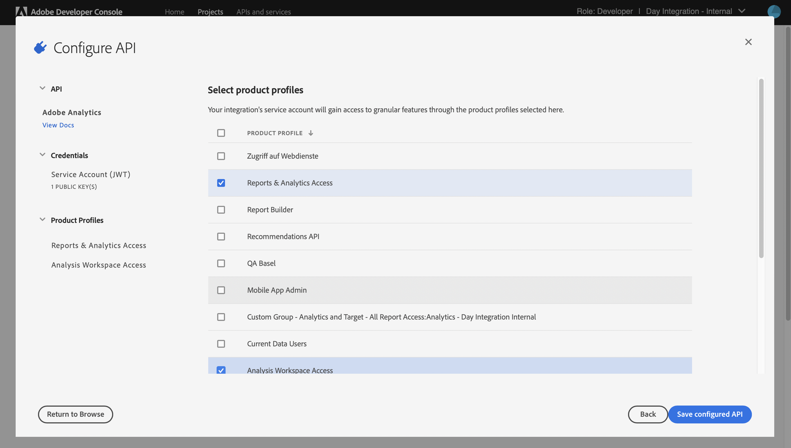
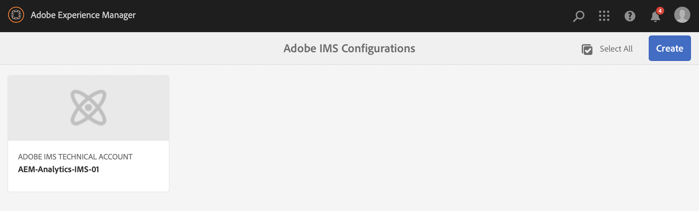
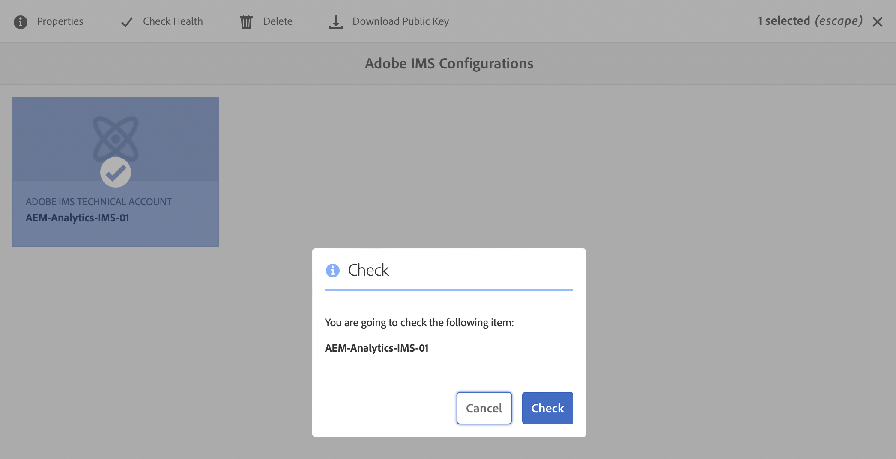

# Integrazione con Adobe Analytics tramite IMS {#integration-with-adobe-analytics-using-ims}

L’integrazione dell’AEM con Adobe Analytics tramite l’API Analytics Standard richiede la configurazione di Adobe IMS (Identity Management System) tramite la console Adobe Developer.

>[!NOTE]
>
>Il supporto per l’API Adobe Analytics Standard 2.0 è una novità dell’AEM 6.5.12.0. Questa versione dell’API supporta l’autenticazione IMS.
>
>L’utilizzo dell’API 1.4 di Adobe Analytics Classic nell’AEM è ancora supportato per la compatibilità con le versioni precedenti. Il [L’API di Analytics Classic utilizza l’autenticazione delle credenziali utente](/help/sites-administering/adobeanalytics-connect.md).
>
>La selezione API è guidata dal metodo di autenticazione utilizzato per l’integrazione AEM/Analytics.
>
>Ulteriori informazioni sono disponibili su [Migrazione alle API 2.0](https://developer.adobe.com/analytics-apis/docs/2.0/guides/migration/).

## Prerequisiti {#prerequisites}

Prima di iniziare questa procedura:

* Il [Supporto Adobe](https://experienceleague.adobe.com/?support-solution=General&amp;support-tab=homehome?lang=it#support) deve effettuare il provisioning del tuo account per:

   * Console Adobe
   * Console per sviluppatori di Adobe
   * Adobe Analytics e
   * Adobe IMS (Identity Management System)

* L’amministratore di sistema della tua organizzazione deve utilizzare l’Admin Console per aggiungere gli sviluppatori necessari ai profili di prodotto pertinenti.

   * Questo fornisce agli sviluppatori specifici le autorizzazioni per abilitare le integrazioni all’interno della console Adobe Developer.
   * Consulta [Gestisci sviluppatori](https://helpx.adobe.com/enterprise/using/manage-developers.html).

## Impostare una configurazione IMS - Generare una chiave pubblica {#configuring-an-ims-configuration-generating-a-public-key}

La prima fase consiste nel creare una configurazione IMS in AEM e generare la chiave pubblica.

1. In AEM apri il menu **Strumenti**.
1. In **Sicurezza** sezione, seleziona **Configurazioni Adobe IMS**.
1. Seleziona **Crea** per aprire **Configurazione dell’account tecnico Adobe IMS**.
1. Dal menu a discesa in **Configurazione cloud**, seleziona **Adobe Analytics**.
1. Attiva **Crea nuovo certificato** e immetti un nuovo alias.
1. Conferma con **Crea certificato**.

   

1. Seleziona **Scarica** (o **Scarica chiave pubblica**) per scaricare il file sull&#39;unità locale, in modo che sia pronto per l&#39;uso durante la [configurazione di IMS per l’integrazione di Adobe Analytics con AEM](#configuring-ims-for-adobe-analytics-integration-with-aem).

   >[!CAUTION]
   >
   >Tieni aperta questa configurazione; sarà necessaria di nuovo quando [Completamento della configurazione IMS in AEM](#completing-the-ims-configuration-in-aem).

   

## Configurazione di IMS per l’integrazione di Adobe Analytics con AEM {#configuring-ims-for-adobe-analytics-integration-with-aem}

Utilizzando la console Adobe Developer, crea un progetto (integrazione) con Adobe Analytics (affinché l’AEM possa utilizzarlo), quindi assegna i privilegi richiesti.

### Creazione del progetto {#creating-the-project}

Per creare un progetto con Adobe Analytics che possa essere utilizzato dall’AEM, apri la console Adobe Developer:

>[!CAUTION]
>
>Attualmente, Adobe Adobe Developer supporta solo i **Account di servizio (JWT)** tipo di credenziali.
>
>Non utilizzare il **OAuth Server-to-Server** tipo di credenziali, che sarà supportato in futuro.

1. Apri la console Adobe Developer per progetti:

   [https://developer.adobe.com/console/projects](https://developer.adobe.com/console/projects)

1. Vengono visualizzati tutti i tuoi progetti. Seleziona **Crea nuovo progetto** - la localizzazione e l&#39;utilizzo dipendono dai seguenti elementi:

   * Se non hai ancora un progetto, **Crea nuovo progetto** si trova in basso al centro.
     
   * Se disponi già di progetti esistenti, questi vengono elencati e **Crea nuovo progetto** si trova in alto a destra.
     

1. Seleziona **Aggiungi a progetto** seguito da **API**:

   

1. Seleziona **Adobe Analytics**, quindi **Successivo**:

   >[!NOTE]
   >
   >Se sei abbonato a Adobe Analytics ma non lo vedi nell’elenco, controlla nei [Prerequisiti](#prerequisites).

   

1. Seleziona **Account di servizio (JWT)** come tipo di autenticazione, quindi continua con **Successivo**:

   

1. **Carica la chiave pubblica**, e una volta fatto, continua con **Successivo**:

   

1. Controlla le credenziali e continua con **Successivo**:

   

1. Seleziona i profili di prodotto richiesti e continua con **Salva API configurata**:

   

1. La configurazione viene confermata.

### Assegnazione di privilegi all&#39;integrazione {#assigning-privileges-to-the-integration}

Ora assegna i privilegi richiesti all’integrazione:

1. Apri l’**Admin Console** Adobe:

   * [https://adminconsole.adobe.com](https://adminconsole.adobe.com/)

1. Passa a **Prodotti** (barra degli strumenti in alto), quindi seleziona **Adobe Analytics - &lt;*tuo-id-tenant*>** (dal pannello a sinistra).
1. Seleziona **Profili di prodotto**, quindi l’area di lavoro richiesta dall’elenco mostrato. Ad esempio, Area di lavoro predefinita.
1. Seleziona **Credenziali API**, quindi la configurazione di integrazione richiesta.
1. Seleziona **Editor** come **Ruolo del prodotto**; anziché **Osservatore**.

## Dettagli memorizzati per il progetto di integrazione della console Adobe Developer {#details-stored-for-the-ims-integration-project}

Dalla Progetti di Adobe Developer Console è disponibile un elenco di tutti i progetti di integrazione:

* [https://developer.adobe.com/console/projects](https://developer.adobe.com/console/projects)

Per visualizzare ulteriori dettagli sulla configurazione, seleziona una voce di progetto specifica. Comprendono:

* Panoramica del progetto
* Approfondimenti
* Credenziali
   * Account servizio (JWT)
      * Dettagli delle credenziali
      * Genera JWT
* API
   * Ad esempio, Adobe Analytics

Alcune di queste sono necessarie per completare l’integrazione di Adobe Analytics nell’AEM.

## Completamento della configurazione IMS in AEM {#completing-the-ims-configuration-in-aem}

Tornando a AEM, puoi completare la configurazione IMS aggiungendo i valori richiesti dal progetto di integrazione per Analytics:

1. Torna a [Configurazione IMS aperta in AEM](#configuring-an-ims-configuration-generating-a-public-key).
1. Seleziona **Avanti**.

1. Qui puoi utilizzare il [Dettagli memorizzati per il progetto di integrazione della console Adobe Developer](#details-stored-for-the-ims-integration-project):

   * **Titolo**: il tuo testo.
   * **Server di autorizzazione**: copia/incolla questo dato dalla riga `aud` della sezione **Payload** sottostante, ad esempio `https://ims-na1.adobelogin.com` nell’esempio seguente
   * **Chiave API**: copia questo dato dalla sezione **Credenziali** della [Panoramica del progetto](#details-stored-for-the-ims-integration-project)
   * **Segreto cliente**: generalo nella scheda [Segreto cliente della sezione Account di servizio (JWT)](#details-stored-for-the-ims-integration-project) e copialo
   * **Payload**: copia questo dato dalla scheda [Genera JWT della sezione Account di servizio (JWT)](#details-stored-for-the-ims-integration-project)

   

1. Conferma con **Crea**.

1. La configurazione di Adobe Analytics viene visualizzata nella console AEM.

   

## Conferma della configurazione IMS {#confirming-the-ims-configuration}

Per confermare che la configurazione funziona come previsto:

1. Apri:

   * `https://localhost<port>/libs/cq/adobeims-configuration/content/configurations.html`

   Esempio:

   * `https://localhost:4502/libs/cq/adobeims-configuration/content/configurations.html`

1. Seleziona la configurazione.
1. Seleziona **Verifica stato** dalla barra degli strumenti, seguito da **Verifica**.

   

1. In caso di esito positivo, viene visualizzato un messaggio di conferma.

## Configurazione del servizio Adobe Analytics Cloud {#configuring-the-adobe-analytics-cloud-service}

È ora possibile fare riferimento alla configurazione affinché un Cloud Service utilizzi l’API Analytics Standard:

1. Apri **Strumenti** menu. Quindi, all&#39;interno del **Cloud Service** sezione, seleziona **Cloud Service legacy**.
1. Scorri verso il basso fino a **Adobe Analytics** e seleziona **Configura ora**.

   Il **Crea configurazione** viene visualizzata.

1. Immetti un **Titolo** e, se lo desideri, un **Nome** (se lasciato vuoto, viene generato dal titolo).

   Puoi anche selezionare il modello richiesto (se ne è disponibile più di uno).

1. Conferma con **Crea**.

   Il **Modifica componente** viene visualizzata.

1. Inserisci i dettagli in **Impostazioni di Analytics** scheda:

   * **Autenticazione**: IMS

   * **Configurazione IMS**: seleziona il nome della configurazione IMS

1. Per inizializzare la connessione con Adobe Analytics, fai clic su **Connetti ad Analytics**.

   Se la connessione ha esito positivo, viene visualizzato il messaggio **Connessione riuscita.**

1. Seleziona **OK** sul messaggio.

1. Completa gli altri parametri come richiesto, seguito da **OK** nella finestra di dialogo, in modo da poter confermare la configurazione.

1. Ora puoi passare a [Aggiunta di un framework Analytics](/help/sites-administering/adobeanalytics-connect.md) per configurare i parametri inviati ad Adobe Analytics.
