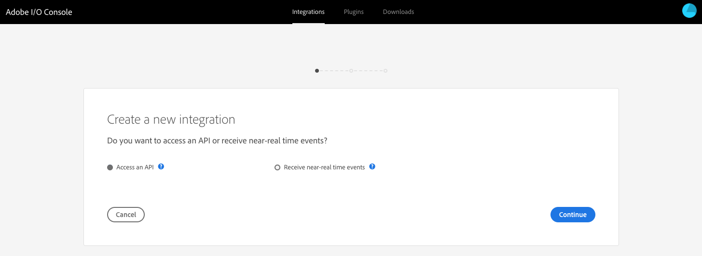

# Integrazione con Adobe Target tramite Adobe I/O{#integration-with-adobe-target-using-adobe-i-o}

L&#39;integrazione di AEM con Adobe Target tramite l&#39;API di Target Standard richiede la configurazione di Adobe IMS (Identity Management System) e Adobe I/O.

>[!NOTE]
>
>Il supporto per l&#39;API Adobe Target Standard è una novità in AEM 6.5. L&#39;API di Target Standard utilizza l&#39;autenticazione IMS.
>
>L&#39;utilizzo dell&#39;API Adobe Target Classic in AEM è ancora supportato per garantire la compatibilità con le versioni precedenti. L&#39;API [Target Classic utilizza l&#39;autenticazione](/help/sites-administering/target-configuring.md#manually-integrating-with-adobe-target)delle credenziali utente.
>
>La selezione API è guidata dal metodo di autenticazione utilizzato per l&#39;integrazione AEM/Target.

## Prerequisiti {#prerequisites}

Prima di avviare questa procedura, [Adobe Support](https://helpx.adobe.com/contact/enterprise-support.ec.html) deve fornire l&#39;account per:

* Adobe Console
* I/O Adobe
* Adobe Target e
* Adobe IMS (Identity Management System)

## Configurazione di una configurazione IMS - Generazione di una chiave pubblica {#configuring-an-ims-configuration-generating-a-public-key}

La prima fase della configurazione consiste nel creare una configurazione IMS in AEM e generare la chiave pubblica.

1. In AEM aprite il menu **Strumenti** .
1. Nella sezione **Sicurezza** , selezionate Configurazioni **Adobe IMS**.
1. Selezionate **Crea** per aprire la Configurazione **account tecnico** Adobe IMS.
1. Nell&#39;elenco a discesa Configurazione **** cloud, seleziona **Adobe Target**.
1. Attiva **Crea nuovo certificato** e immetti un nuovo alias.
1. Conferma con **Crea certificato**.

   

1. Selezionate **Scarica** (o **Scarica chiave** pubblica) per scaricare il file nell&#39;unità locale, in modo che sia pronto per essere utilizzato per [configurare l&#39;I/O Adobe per l&#39;integrazione di Adobe Target con AEM](#configuring-adobe-i-o-for-adobe-target-integration-with-aem).

   >[!CAUTION]
   >
   >Tenete aperta questa configurazione, sarà necessaria di nuovo al [completamento della configurazione IMS in AEM](#completing-the-ims-configuration-in-aem).

   

## Configurazione di Adobe I/O per l&#39;integrazione di Adobe Target con AEM {#configuring-adobe-i-o-for-adobe-target-integration-with-aem}

Devi creare l&#39;integrazione Adobe I/O con Adobe Target che verrà utilizzata da AEM, quindi assegnare i privilegi richiesti.

### Creazione dell&#39;integrazione {#creating-the-integration}

Aprite la console Adobe I/O per creare un&#39;integrazione I/O con Adobe Target che verrà utilizzata da AEM:

>[!NOTE]
>
>Consultate anche le esercitazioni [I/O di](https://www.adobe.io/apis/experienceplatform/home/tutorials/alltutorials.html)Adobe.

1. Apri la console Adobe I/O per le integrazioni:

   * [https://console.adobe.io/integrations](https://console.adobe.io/integrations)

1. Selezionate **Nuova integrazione**:

   >[!NOTE]
   >
   >Se disponete già di integrazioni esistenti, queste verranno elencate e il pulsante **Nuova integrazione** sarà in alto a destra.

   

1. Selezionate **Accesso a un&#39;API** seguito da **Continua**:

   

1. Selezionate **Adobe Target**, quindi **Continua**:

   

1. Aggiungete i dettagli richiesti per la configurazione di integrazione:

   * **Nome**

      Immettete il nome.

   * **Descrizione**

      Una descrizione è facoltativa.

   * **Certificato di chiave pubblica**

      Caricare il file di chiave pubblica; come generato in [Configurazione di una configurazione IMS - Generazione di una chiave](#configuring-an-ims-configuration-generating-a-public-key)pubblica.

      Una volta caricato il certificato, verrà elencato in **Certificati**.

   * **Profili di prodotto**

      I profili di prodotto corrispondono alle aree di lavoro in Target che AEM può utilizzare per l’esportazione dei contenuti e la creazione di offerte. Per impostazione predefinita, l&#39;area di lavoro predefinita di Target è selezionata. Selezionate qualsiasi altro profilo/area di lavoro da visualizzare in AEM come destinazione di esportazione.
   Esempio:

   

1. Conferma con **l’integrazione** Create.
1. La creazione verrà confermata, ora potete **continuare con i dettagli** di integrazione; sono necessarie per [completare la configurazione IMS in AEM](#completing-the-ims-configuration-in-aem).

   

### Assegnazione di privilegi all&#39;integrazione {#assigning-privileges-to-the-integration}

È ora necessario assegnare i privilegi richiesti all&#39;integrazione:

1. Apri Adobe **Admin Console**:

   * [https://adminconsole.adobe.com](https://adminconsole.adobe.com/)

1. Andate a **Prodotti** (barra degli strumenti in alto), quindi selezionate **Adobe Target - &lt;*your-tenant-id*>** (dal pannello a sinistra).
1. Selezionate **Profili** di prodotto, quindi l’area di lavoro desiderata dall’elenco. Ad esempio, Area di lavoro predefinita.
1. Selezionate **Integrazioni**, quindi la configurazione di integrazione richiesta.
1. Selezionate **Editor** come ruolo **** prodotto; invece di **Observer**.

## Dettagli memorizzati per l&#39;integrazione I/O di Adobe {#details-stored-for-the-adobe-i-o-integration}

Dalla console Integrazioni I/O di Adobe potete vedere un elenco di tutte le integrazioni:

* [https://console.adobe.io/integrations](https://console.adobe.io/integrations)

Selezionate **Visualizza** (a destra di una specifica voce di integrazione) per visualizzare ulteriori dettagli sulla configurazione. Comprendono:

* Panoramica
* Approfondimenti
* Servizi
* Eventi
* JWT (token Web JSON)

Alcuni di questi sono necessari per completare l&#39;integrazione di I/O Adobe per Target in AEM.

1. **Panoramica**:

   

1. **JWT**:

   

## Completamento della configurazione IMS in AEM {#completing-the-ims-configuration-in-aem}

Per tornare ad AEM, puoi completare la configurazione IMS aggiungendo i valori richiesti dall’integrazione I/O di Adobe per Target:

1. Tornate alla configurazione [IMS aperta in AEM](#configuring-an-ims-configuration-generating-a-public-key).
1. Seleziona **Avanti**.

1. Qui potete usare i [dettagli dall&#39;I/O](#details-stored-for-the-adobe-i-o-integration)di Adobe:

   * **Titolo**: Testo.
   * **Server** autorizzazioni: Copiate/incollate questo dalla `"aud"` riga della sezione **Payload** seguente, ad esempio `"https://ims-na1.adobelogin.com"` nell&#39;esempio seguente
   * **Chiave** API: Copiatela dalla sezione [Panoramica](#details-stored-for-the-adobe-i-o-integration) dell&#39;integrazione I/O di Adobe per Target
   * **Segreto** cliente: Generare questo valore nella sezione [Panoramica](#details-stored-for-the-adobe-i-o-integration) dell&#39;integrazione I/O di Adobe per Target e copiare
   * **Payload**: Copiatela dalla sezione [JWT](#details-stored-for-the-adobe-i-o-integration) dell&#39;integrazione I/O di Adobe per Target
   

1. Conferma con **Crea**.

1. La configurazione di Adobe Target verrà visualizzata nella console AEM.

   

## Conferma della configurazione IMS {#confirming-the-ims-configuration}

Per confermare che la configurazione funziona come previsto:

1. Apri:

   * `https://localhost<port>/libs/cq/adobeims-configuration/content/configurations.html`
   Esempio:

   * `https://localhost:4502/libs/cq/adobeims-configuration/content/configurations.html`

1. Selezionate la configurazione.
1. Selezionate **Controlla stato** dalla barra degli strumenti, quindi **Controlla**.

   

1. In caso di esito positivo, verrà visualizzato il messaggio:

   

## Configurazione del servizio Adobe Target Cloud {#configuring-the-adobe-target-cloud-service}

Ora è possibile fare riferimento alla configurazione per un servizio Cloud per utilizzare l&#39;API di Target Standard:

1. Aprire il menu **Strumenti** . Quindi, nella sezione Servizi **** Cloud, seleziona Servizi **cloud** legacy.
1. Scorri verso il basso fino ad **Adobe Target** e seleziona **Configura ora**.

   Viene visualizzata la finestra di dialogo **Crea configurazione** .

1. Inserite un **Titolo** e, se lo desiderate, un **Nome** (se lasciato vuoto questo verrà generato dal titolo).

   Potete anche selezionare il modello richiesto (se sono disponibili più modelli).

1. Conferma con **Crea**.

   Viene aperta la finestra di dialogo **Modifica componente** .

1. Immettete i dettagli nella scheda Impostazioni **di** Adobe Target:

   * **Codice** client: l’ID tenant di Adobe IMS

      >[!CAUTION]
      >
      >L&#39;ID tenant Adobe IMS deve essere immesso nel campo Codice cliente.

   * **Autenticazione**: IMS
   * **Configurazione** IMS: selezionate il nome della configurazione IMS
   * **Tipo** API: REST
   * **Configurazione** di A4T Analytics Cloud: Seleziona la configurazione cloud di Analytics utilizzata per gli obiettivi e le metriche dell&#39;attività di destinazione. Questo è necessario se utilizzate Adobe Analytics come origine di reporting quando eseguite il targeting del contenuto. Se non visualizzi la configurazione cloud, consulta la nota in [Configurazione della configurazione](/help/sites-administering/target-configuring.md#configuring-a-t-analytics-cloud-configuration)cloud di Analytics A4T.
   * **Utilizzate targeting** accurato: Per impostazione predefinita questa casella di controllo è selezionata. Se selezionata, la configurazione del servizio cloud attende il caricamento del contesto prima di caricare il contenuto. Vedere la nota seguente.
   * **Sincronizzare i segmenti da Adobe Target**: Selezionate questa opzione per scaricare i segmenti definiti in Target da usare in AEM. Devi selezionare questa opzione quando la proprietà Tipo API è REST, perché i segmenti in linea non sono supportati e devi sempre utilizzare i segmenti da Target. (Il termine AEM &#39;segmento&#39; equivale al termine &#39;pubblico&#39; di Target).
   * **Libreria** client: Selezionate se la libreria client AT.js deve essere obsoleta oppure mbox.js.
   * **Utilizzate Tag Management System per distribuire la libreria** client: Usa DTM (obsoleto), Adobe Launch o qualsiasi altro sistema di gestione tag.
   * **AT.js** personalizzato: Lasciate vuoto se avete selezionato la casella Gestione tag o per utilizzare il file AT.js predefinito. In alternativa, caricate il vostro AT.js personalizzato. Viene visualizzato solo se avete selezionato AT.js.
   >[!NOTE]
   >
   >[La configurazione di un servizio Cloud per l&#39;utilizzo dell&#39;API](/help/sites-administering/target-configuring.md#manually-integrating-with-adobe-target) Target Classic è stata rimossa (utilizza la scheda Impostazioni Adobe Recommendations).

   Esempio:

   

1. Fate clic su **Connect to Target** per inizializzare la connessione con Adobe Target.

   Se la connessione ha esito positivo, viene visualizzato il messaggio **Connessione riuscita** .

1. Selezionate **OK** sul messaggio, quindi **OK** nella finestra di dialogo per confermare la configurazione.
1. Ora potete procedere all&#39; [aggiunta di un framework](/help/sites-administering/target-configuring.md#adding-a-target-framework) Target per configurare i parametri ContextHub o ClientContext che verranno inviati a Target. Questo potrebbe non essere necessario per l&#39;esportazione di frammenti esperienza AEM in Target.

