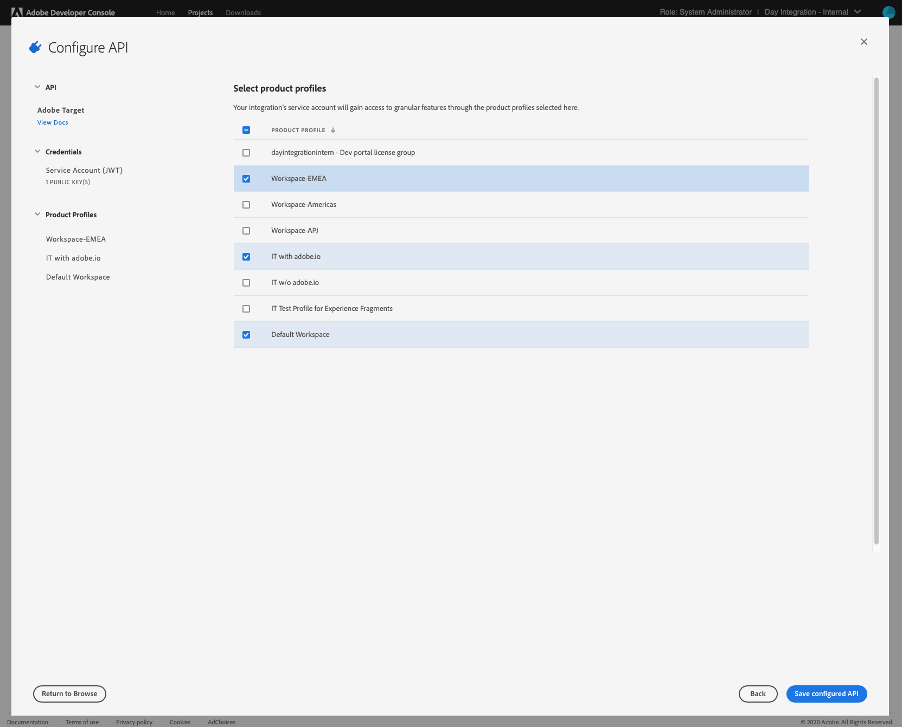

# Integrazione con  Adobe Target utilizzando  I/O Adobe{#integration-with-adobe-target-using-adobe-i-o}

L&#39;integrazione di AEM con  Adobe Target tramite l&#39;API di Target Standard richiede la configurazione di  Adobe IMS ( Identity Management System) e  I/O Adobe.

>[!NOTE]
>
>Il supporto per  Adobe Target Standard API è stato introdotto nella AEM 6.5. L&#39;API di Target Standard utilizza l&#39;autenticazione IMS.
>
>L&#39;utilizzo dell&#39;API Adobe Target Classic  in AEM è ancora supportato per la compatibilità con le versioni precedenti. L&#39;API [Target Classic utilizza l&#39;autenticazione](/help/sites-administering/target-configuring.md#manually-integrating-with-adobe-target)delle credenziali utente.
>
>La selezione API è guidata dal metodo di autenticazione utilizzato per l&#39;integrazione AEM/Target.

## Prerequisiti {#prerequisites}

Prima di avviare la procedura:

* [Adobe di assistenza](https://helpx.adobe.com/it/contact/enterprise-support.ec.html) deve fornire il vostro account per:

   * Console Adobe 
   * I/O Adobe 
   *  Adobe Target e
   *  Adobe IMS ( Identity Management System)

* L&#39;amministratore di sistema della tua organizzazione deve utilizzare il Admin Console  per aggiungere gli sviluppatori richiesti nella tua organizzazione ai profili di prodotto pertinenti.

   * Questo fornisce agli sviluppatori specifici le autorizzazioni per abilitare le integrazioni all&#39;interno  I/O Adobe.
   * Per ulteriori dettagli, consultate [Gestire gli sviluppatori](https://helpx.adobe.com/enterprise/admin-guide.html/enterprise/using/manage-developers.ug.html).

## Configurazione di una configurazione IMS - Generazione di una chiave pubblica {#configuring-an-ims-configuration-generating-a-public-key}

La prima fase della configurazione consiste nel creare una configurazione IMS in AEM e generare la chiave pubblica.

1. AEM aprire il menu **Strumenti** .
1. Nella sezione **Sicurezza** , selezionate **Adobe IMS Configurations**.
1. Selezionate **Crea** per aprire il **Adobe IMS Technical Account Configuration**.
1. Dall’elenco a discesa in Configurazione **** cloud, seleziona **Adobe Target**.
1. Attiva **Crea nuovo certificato** e immetti un nuovo alias.
1. Conferma con **Crea certificato**.

   

1. Selezionate **Scarica** (o **Scarica chiave** pubblica) per scaricare il file nell&#39;unità locale, in modo che sia pronto per essere utilizzato per [configurare  I/O Adobe per &#39;integrazione Adobe Target con AEM](#configuring-adobe-i-o-for-adobe-target-integration-with-aem).

   >[!CAUTION]
   >
   >Mantenete aperta questa configurazione, sarà necessaria di nuovo al [completamento della configurazione IMS in AEM](#completing-the-ims-configuration-in-aem).

   

## Configurazione  I/O Adobe per  integrazione Adobe Target con AEM {#configuring-adobe-i-o-for-adobe-target-integration-with-aem}

È necessario creare il progetto di I/O  Adobe (integrazione) con  Adobe Target che AEM utilizzare, quindi assegnare i privilegi richiesti.

### Creazione del progetto {#creating-the-project}

Aprite la console I/O  Adobe per creare un progetto I/O con  Adobe Target che AEM utilizzare:

>[!NOTE]
>
>Consultate anche le esercitazioni I/O [Adobe](https://www.adobe.io/apis/experienceplatform/home/tutorials/alltutorials.html).

1. Aprite la console I/O  Adobe per Progetti:

   [https://console.adobe.io/projects](https://console.adobe.io/projects)

1. Vengono visualizzati tutti i progetti che avete. Selezionate **Crea nuovo progetto** : la posizione e l’utilizzo dipenderanno da:

   * Se non disponete ancora di alcun progetto, **Create un nuovo progetto** sarà centrato, in basso.
      
   * Se hai già dei progetti esistenti, questi saranno elencati in alto a destra e **Crea nuovo progetto** .
      

1. Selezionate **Aggiungi a progetto** seguito da **API**:

   

1. Selezionate **Adobe Target**, quindi **Avanti**:

   >[!NOTE]
   >
   >Se siete iscritti a  Adobe Target, ma non lo visualizzate, è necessario controllare i [prerequisiti](#prerequisites).

   

1. **Carica la tua chiave** pubblica e, al termine, continua con **Avanti**:

   

1. Rivedete le credenziali e continuate con **Avanti**:

   

1. Selezionate i profili di prodotto richiesti e continuate con **Salva API** configurata:

   >[!NOTE]
   >
   >I profili di prodotto visualizzati dipendono dal fatto che:
   >
   >*  Adobe Target Standard - è disponibile solo **Workspace** predefinito
   >*  Adobe Target Premium: vengono elencate tutte le aree di lavoro disponibili, come mostrato di seguito

   

1. La creazione verrà confermata.

<!--
1. The creation will be confirmed, you can now **Continue to integration details**; these are needed for [Completing the IMS Configuration in AEM](#completing-the-ims-configuration-in-aem).

   
-->

### Assegnazione di privilegi all&#39;integrazione {#assigning-privileges-to-the-integration}

È ora necessario assegnare i privilegi richiesti all&#39;integrazione:

1. Aprite il Adobe  **Admin Console**:

   * [https://adminconsole.adobe.com](https://adminconsole.adobe.com/)

1. Andate a **Prodotti** (barra degli strumenti in alto), quindi selezionate **Adobe Target - &lt;*your-tenant-id*>** (dal pannello a sinistra).
1. Selezionate **Profili** di prodotto, quindi l’area di lavoro desiderata dall’elenco visualizzato. Ad esempio, Area di lavoro predefinita.
1. Selezionate **Integrazioni**, quindi la configurazione di integrazione richiesta.
1. Selezionate **Editor** come ruolo **** prodotto; invece di **Observer**.

## Dettagli memorizzati per il progetto di integrazione I/O del Adobe  {#details-stored-for-the-adobe-io-integration-project}

Dalla console Progetti I/O di  Adobe è disponibile un elenco di tutti i progetti di integrazione:

* [https://console.adobe.io/projects](https://console.adobe.io/projects)

Selezionate **Visualizza** (a destra di una voce specifica del progetto) per visualizzare ulteriori dettagli sulla configurazione. Comprendono:

* Panoramica del progetto
* Approfondimenti
* Credenziali
   * Account di servizio (JWT)
      * Dettagli credenziali
      * Genera JWT
* APIS
   * Ad esempio,  Adobe Target

Alcuni di questi sono necessari per completare l&#39;integrazione I/O  Adobe per Target in AEM.

## Completamento della configurazione IMS in AEM {#completing-the-ims-configuration-in-aem}

Tornando a AEM potete completare la configurazione IMS aggiungendo i valori richiesti dall&#39;integrazione I/O del Adobe  per Target:

1. Tornate alla configurazione [IMS aperta in AEM](#configuring-an-ims-configuration-generating-a-public-key).
1. Seleziona **Avanti**.

1. Qui potete usare [i dettagli  I/O](#details-stored-for-the-adobe-io-integration-project)Adobe:

   * **Titolo**: Testo.
   * **Server** autorizzazioni: Copiate/incollate questo dalla `"aud"` riga della sezione **Payload** seguente, ad esempio `"https://ims-na1.adobelogin.com"` nell&#39;esempio seguente
   * **Chiave** API: Copiatela dalla sezione [Panoramica](#details-stored-for-the-adobe-io-integration-project) dell&#39;integrazione I/O del Adobe  per Target
   * **Segreto** cliente: Generare questo valore nella sezione [Panoramica](#details-stored-for-the-adobe-io-integration-project) dell&#39;integrazione I/O del Adobe  per Target, e copiare
   * **Payload**: Copiatela dalla sezione [Genera JWT](#details-stored-for-the-adobe-io-integration-project) dell&#39;integrazione I/O del Adobe  per Target

   

1. Conferma con **Crea**.

1. La configurazione  Adobe Target verrà visualizzata nella console AEM.

   

## Conferma della configurazione IMS {#confirming-the-ims-configuration}

Per confermare che la configurazione funziona come previsto:

1. Apri:

   * `https://localhost<port>/libs/cq/adobeims-configuration/content/configurations.html`

   Esempio:

   * `https://localhost:4502/libs/cq/adobeims-configuration/content/configurations.html`

1. Selezionate la configurazione.
1. Selezionate **Controlla stato** dalla barra degli strumenti, quindi **Controlla**.

   

1. In caso di esito positivo, verrà visualizzato il messaggio:

   

## Configurazione del Cloud Service Adobe Target  {#configuring-the-adobe-target-cloud-service}

Ora è possibile fare riferimento alla configurazione per un Cloud Service per utilizzare l&#39;API di Target Standard:

1. Aprire il menu **Strumenti** . Quindi, nella sezione **Cloud Services** , selezionate Cloud Services **** precedenti.
1. Scorri verso il basso fino a **Adobe Target** e seleziona **Configura ora**.

   Viene visualizzata la finestra di dialogo **Crea configurazione** .

1. Inserite un **Titolo** e, se lo desiderate, un **Nome** (se lasciato vuoto, questo verrà generato dal titolo).

   Potete anche selezionare il modello richiesto (se sono disponibili più modelli).

1. Conferma con **Crea**.

   Viene aperta la finestra di dialogo **Modifica componente** .

1. Immettete i dettagli nella **scheda Impostazioni** Adobe Target:

   * **Autenticazione**: IMS
   * **ID** tenant: l&#39;ID tenant IMS del Adobe 

      >[!NOTE]
      >
      >Per IMS questo valore deve essere recuperato direttamente da Target. Potete accedere a Target ed estrarre l&#39;ID tenant dall&#39;URL.
      >
      >Ad esempio, se l’URL è:
      >
      >`https://experience.adobe.com/#/@yourtenantid/target/activities`
      >
      >Allora useresti `yourtenantid`.

   * **Configurazione** IMS: selezionate il nome della configurazione IMS
   * **Tipo** API: REST
   * **Configurazione** A4T  Analytics Cloud: Seleziona la configurazione cloud di Analytics utilizzata per gli obiettivi e le metriche dell&#39;attività di destinazione. Questo è necessario se utilizzate  Adobe Analytics come origine di reporting quando eseguite il targeting del contenuto. Se non visualizzate la configurazione cloud, consultate la nota in [Configurazione di A4T  configurazione](/help/sites-administering/target-configuring.md#configuring-a-t-analytics-cloud-configuration)Analytics Cloud.
   * **Utilizzate targeting** accurato: Per impostazione predefinita questa casella di controllo è selezionata. Se selezionata, la configurazione del servizio cloud attende il caricamento del contesto prima di caricare il contenuto. Vedere la nota che segue.
   * **Sincronizzare i segmenti da  Adobe Target**: Selezionate questa opzione per scaricare i segmenti definiti in Target per utilizzarli in AEM. Devi selezionare questa opzione quando la proprietà Tipo API è REST, perché i segmenti in linea non sono supportati e devi sempre utilizzare i segmenti da Target. Il termine AEM &quot;segmento&quot; è equivalente al termine &quot;audience&quot; di Target.
   * **Libreria** client: Selezionate se la libreria client AT.js deve essere obsoleta oppure mbox.js.
   * **Utilizzate Tag Management System per distribuire la libreria** client: Usa DTM (obsoleto), Lancio  Adobe o qualsiasi altro sistema di gestione tag.
   * **AT.js** personalizzato: Lasciate vuoto se avete selezionato la casella Gestione tag o per utilizzare il file AT.js predefinito. In alternativa, caricate il vostro AT.js personalizzato. Viene visualizzato solo se avete selezionato AT.js.

   >[!NOTE]
   >
   >[La configurazione di un Cloud Service per l&#39;utilizzo dell&#39;API](/help/sites-administering/target-configuring.md#manually-integrating-with-adobe-target) di Target Classic è obsoleta (utilizza la scheda  Impostazioni Adobe Recommendations).

   Esempio:

   

1. Fate clic su **Connetti a Target** per inizializzare la connessione con  Adobe Target.

   Se la connessione ha esito positivo, viene visualizzato il messaggio **Connessione riuscita** .

1. Selezionate **OK** sul messaggio, quindi **OK** nella finestra di dialogo per confermare la configurazione.
1. Ora potete procedere all&#39; [aggiunta di un framework](/help/sites-administering/target-configuring.md#adding-a-target-framework) Target per configurare i parametri ContextHub o di ClientContext che verranno inviati a Target. Questo potrebbe non essere necessario per esportare AEM frammenti esperienza in Target.

