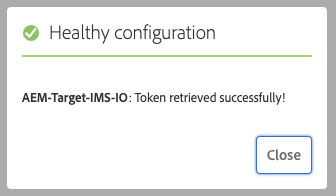

# Integrazione con Adobe Target tramite IMS{#integration-with-adobe-target-using-ims}

L’integrazione dell’AEM con Adobe Target tramite l’API di Target Standard richiede la configurazione di Adobe IMS (Identity Management System) tramite la console Adobe Developer.

>[!NOTE]
>
>Il supporto per l’API Adobe Target Standard è una novità dell’AEM 6.5. L’API di Target Standard utilizza l’autenticazione IMS.
>
>L’utilizzo dell’API classica di Adobe Target nell’AEM è ancora supportato per la compatibilità con le versioni precedenti. Il [L’API di Target Classic utilizza l’autenticazione delle credenziali utente](/help/sites-administering/target-configuring.md#manually-integrating-with-adobe-target).
>
>La selezione API è guidata dal metodo di autenticazione utilizzato per l’integrazione AEM/Target.
>Consulta anche [ID tenant e codice client](#tenant-client) sezione.

## Prerequisiti {#prerequisites}

Prima di iniziare questa procedura:

* Il [Supporto Adobe](https://experienceleague.adobe.com/?support-solution=General&amp;support-tab=homehome?lang=it#support) deve effettuare il provisioning del tuo account per:

   * Console Adobe
   * Console per sviluppatori di Adobe
   * Adobe Target e
   * Adobe IMS (Identity Management System)

* L’amministratore di sistema della tua organizzazione deve utilizzare l’Admin Console per aggiungere gli sviluppatori necessari ai profili di prodotto pertinenti.

   * Questo fornisce agli sviluppatori specifici le autorizzazioni per abilitare le integrazioni all’interno della console Adobe Developer.
   * Consulta [Gestisci sviluppatori](https://helpx.adobe.com/enterprise/using/manage-developers.html).

## Impostare una configurazione IMS - Generare una chiave pubblica {#configuring-an-ims-configuration-generating-a-public-key}

La prima fase consiste nel creare una configurazione IMS in AEM e generare la chiave pubblica.

1. In AEM apri il menu **Strumenti**.
1. In **Sicurezza** sezione, seleziona **Configurazioni Adobe IMS**.
1. Seleziona **Crea** per aprire **Configurazione dell’account tecnico Adobe IMS**.
1. Dal menu a discesa in **Configurazione cloud**, seleziona **Adobe Target**.
1. Attiva **Crea nuovo certificato** e immetti un nuovo alias.
1. Conferma con **Crea certificato**.

   

1. Seleziona **Scarica** (o **Scarica chiave pubblica**) per scaricare il file sull&#39;unità locale, in modo che sia pronto per l&#39;uso durante la [configurazione di IMS per l’integrazione di Adobe Target con AEM](#configuring-ims-for-adobe-target-integration-with-aem).

   >[!CAUTION]
   >
   >Tieni aperta questa configurazione; sarà necessaria di nuovo quando [Completamento della configurazione IMS in AEM](#completing-the-ims-configuration-in-aem).

   

## Configurazione di IMS per l’integrazione di Adobe Target con AEM {#configuring-ims-for-adobe-target-integration-with-aem}

Utilizzando la console Adobe Developer, crea un progetto (integrazione) con Adobe Target che l’AEM può utilizzare, quindi assegna i privilegi richiesti.

### Creazione del progetto {#creating-the-project}

Per creare un progetto con Adobe Target che possa essere utilizzato dall’AEM, apri la console Adobe Developer:

>[!CAUTION]
>
>Attualmente, Adobe Adobe Developer supporta solo i **Account di servizio (JWT)** tipo di credenziali.
>
>Non utilizzare il **OAuth Server-to-Server** tipo di credenziali, che sarà supportato in futuro.

1. Apri la console Adobe Developer per progetti:

   [https://developer.adobe.com/console/projects](https://developer.adobe.com/console/projects)

1. Vengono visualizzati tutti i tuoi progetti. Seleziona **Crea nuovo progetto** - la localizzazione e l&#39;utilizzo dipendono dai seguenti elementi:

   * Se non hai ancora un progetto, **Crea nuovo progetto** si trova in basso al centro.
     
   * Se disponi già di progetti esistenti, questi vengono elencati e **Crea nuovo progetto** è in alto a destra.
     

1. Seleziona **Aggiungi a progetto** seguito da **API**:

   

1. Seleziona **Adobe Target**, quindi **Successivo**:

   >[!NOTE]
   >
   >Se sei abbonato a Adobe Target ma non lo vedi nell’elenco, controlla i [Prerequisiti](#prerequisites).

   

1. **Carica la chiave pubblica** e, una volta completato, continua con **Successivo**:

   

1. Controlla le credenziali e continua con **Successivo**:

   

1. Seleziona i profili di prodotto richiesti e continua con **Salva API configurata**:

   >[!NOTE]
   >
   >I profili di prodotto visualizzati dipendono dall’esistenza o meno di:
   >
   >* Adobe Target Standard: è disponibile solo l&#39;**area di lavoro predefinita**
   >* Adobe Target Premium: vengono elencate tutte le aree di lavoro disponibili, come illustrato di seguito

   

1. La creazione viene confermata.

<!--
1. The creation is confirmed, you can now **Continue to integration details**; these are needed for [Completing the IMS Configuration in AEM](#completing-the-ims-configuration-in-aem).

   
-->

### Assegnazione di privilegi all&#39;integrazione {#assigning-privileges-to-the-integration}

Ora assegna i privilegi richiesti all’integrazione:

1. Apri l’**Admin Console** Adobe:

   * [https://adminconsole.adobe.com](https://adminconsole.adobe.com/)

1. Passa a **Prodotti** (barra degli strumenti superiore), quindi seleziona **Adobe Target - &lt;*tuo-id-tenant*>** (dal pannello a sinistra).
1. Seleziona **Profili di prodotto**, quindi l’area di lavoro richiesta dall’elenco presentato. Ad esempio, Area di lavoro predefinita.
1. Seleziona **Credenziali API**, quindi la configurazione di integrazione richiesta.
1. Seleziona **Editor** come **Ruolo del prodotto**; anziché **Osservatore**.

## Dettagli memorizzati per il progetto di integrazione della console Adobe Developer {#details-stored-for-the-ims-integration-project}

Dalla Console Adobe Developer - Progetti è disponibile un elenco di tutti i progetti di integrazione:

* [https://developer.adobe.com/console/projects](https://developer.adobe.com/console/projects)

Per visualizzare ulteriori dettagli sulla configurazione, seleziona **Visualizza** (a destra di una voce specifica del progetto). Comprendono:

* Panoramica del progetto
* Approfondimenti
* Credenziali
   * Account servizio (JWT)
      * Dettagli delle credenziali
      * Genera JWT
* API
   * Ad esempio, Adobe Target

Alcune di queste sono necessarie per completare l’integrazione di Adobe Target nell’AEM basato su IMS.

## Completamento della configurazione IMS in AEM {#completing-the-ims-configuration-in-aem}

Tornando a AEM, puoi completare la configurazione IMS aggiungendo i valori richiesti dall’integrazione della console Adobe Developer per Target:

1. Torna a [Configurazione IMS aperta in AEM](#configuring-an-ims-configuration-generating-a-public-key).
1. Seleziona **Avanti**.

1. Qui puoi utilizzare i [dettagli dalla configurazione del progetto in Adobe Developer Console](#details-stored-for-the-ims-integration-project):

   * **Titolo**: testo.
   * **Server di autorizzazione**: copia/incolla dalla riga `aud` della sezione **Payload** qui sotto (in questo esempio: `https://ims-na1.adobelogin.com`)
   * **Chiave API**: copia da [Panoramica](#details-stored-for-the-ims-integration-project) sezione
   * **Segreto client**: generalo in [Panoramica](#details-stored-for-the-ims-integration-project) sezione e copia
   * **Payload**: copialo dalla sezione [Genera JWT](#details-stored-for-the-ims-integration-project)

   

1. Conferma con **Crea**.

1. La configurazione di Adobe Target viene visualizzata nella console AEM.

   

## Conferma della configurazione IMS {#confirming-the-ims-configuration}

Per confermare che la configurazione funziona come previsto:

1. Apri:

   * `https://localhost<port>/libs/cq/adobeims-configuration/content/configurations.html`

   Esempio:

   * `https://localhost:4502/libs/cq/adobeims-configuration/content/configurations.html`

1. Seleziona la configurazione.
1. Seleziona **Verifica stato** dalla barra degli strumenti, seguita da **Verifica**.

   

1. In caso di esito positivo, viene visualizzato il messaggio:

   

## Configurazione del Cloud Service Adobe Target {#configuring-the-adobe-target-cloud-service}

È ora possibile fare riferimento alla configurazione affinché un Cloud Service utilizzi l’API di Target Standard:

1. Apri **Strumenti** menu. Quindi, all&#39;interno del **Cloud Service** sezione, seleziona **Cloud Service legacy**.
1. Scorri verso il basso fino a **Adobe Target** e seleziona **Configura ora**.

   Il **Crea configurazione** viene visualizzata.

1. Immetti un **Titolo** e, se lo desideri, un **Nome** (se lasciato vuoto, viene generato dal titolo).

   Puoi anche selezionare il modello richiesto (se ne è disponibile più di uno).

1. Conferma con **Crea**.

   Il **Modifica componente** viene visualizzata.

1. Inserisci i dettagli in **Impostazioni Adobe Target** scheda:

   * **Autenticazione**: IMS

   * **ID tenant**: l’ID tenant di Adobe IMS. Consulta anche [ID tenant e codice client](#tenant-client) sezione.

     >[!NOTE]
     >
     >Per IMS, questo valore deve essere preso da Target stesso. Puoi accedere a Target ed estrarre l’ID tenant dall’URL.
     >
     >Ad esempio, se l’URL è:
     >
     >`https://experience.adobe.com/#/@yourtenantid/target/activities`
     >
     >A quel punto si utilizzerà `yourtenantid`.

   * **Codice client**: consulta [ID tenant e codice client](#tenant-client) sezione.

   * **Configurazione IMS**: seleziona il nome della configurazione IMS

   * **Tipo di API**: REST

   * **Configurazione di A4T Analytics Cloud**: seleziona la configurazione di Analytics Cloud utilizzata per gli obiettivi e le metriche delle attività di destinazione. È necessario se utilizzi Adobe Analytics come origine per la generazione di rapporti durante il targeting del contenuto. Se non vedi la configurazione cloud, vedi la nota in [Configurazione della configurazione di A4T Analytics Cloud](/help/sites-administering/target-configuring.md#configuring-a-t-analytics-cloud-configuration).

   * **Utilizza il targeting accurato**: per impostazione predefinita questa casella di controllo è selezionata. Se viene selezionata, la configurazione del servizio cloud attende il caricamento del contesto prima di caricare il contenuto. Vedi la nota che segue.

   * **Sincronizzare i segmenti da Adobe Target**: seleziona questa opzione per scaricare i segmenti definiti in Target e utilizzarli in AEM. Seleziona questa opzione quando la proprietà Tipo API è REST, perché i segmenti in linea non sono supportati e devi sempre utilizzare i segmenti da Target. Il termine AEM &quot;segmento&quot; equivale al termine Target &quot;pubblico&quot;.

   * **Libreria client**: seleziona se desideri la libreria client AT.js o mbox.js (obsoleto).

   * **Utilizza Tag Management System per distribuire la libreria client**: utilizza DTM (obsoleto), Adobe Launch o qualsiasi altro sistema di gestione dei tag.

   * **AT.js personalizzato**: lascia vuoto se hai selezionato la casella Tag Management o per utilizzare il valore predefinito AT.js. In alternativa, carica il tuo file AT.js personalizzato. Viene visualizzato solo se avete selezionato AT.js.

   >[!NOTE]
   >
   >[Configurazione di un Cloud Service per l’utilizzo dell’API di Target Classic](/help/sites-administering/target-configuring.md#manually-integrating-with-adobe-target) è stato dichiarato obsoleto (utilizza la scheda Impostazioni di Adobe Recommendations).

1. Clic **Connetti a Target** per inizializzare la connessione ad Adobe Target.

   Se la connessione ha esito positivo, viene visualizzato il messaggio **Connessione riuscita.**

1. Seleziona **OK** sul messaggio, seguito da **OK** nella finestra di dialogo, in modo da poter confermare la configurazione.

1. Ora puoi passare a [Aggiunta di un framework Target](/help/sites-administering/target-configuring.md#adding-a-target-framework) per configurare i parametri ContextHub o ClientContext inviati a Target. Tieni presente che questo potrebbe non essere necessario per esportare i frammenti esperienza AEM in Target.

### ID tenant e codice client {#tenant-client}

Con [Adobe Experience Manager 6.5.8.0](/help/release-notes/release-notes.md), il campo Codice client è stato aggiunto alla finestra di configurazione di Target.

Quando configuri i campi ID tenant e Codice client, tieni presente quanto segue:

1. Per la maggior parte dei clienti, l’ID tenant e il codice client sono gli stessi. Ciò significa che entrambi i campi contengono le stesse informazioni e sono identici. Assicurati di inserire l’ID tenant in entrambi i campi.
2. Per motivi di legacy, puoi anche immettere valori diversi nei campi ID tenant e Codice client.

In entrambi i casi, tieni presente quanto segue:

* Per impostazione predefinita, anche il codice client (se aggiunto per primo) viene copiato automaticamente nel campo ID tenant.
* Facoltativamente, puoi modificare il set di ID tenant predefinito.
* Pertanto, le chiamate di backend a Target sono basate sull’ID tenant e le chiamate lato client a Target sono basate sul codice client.

Come indicato in precedenza, il primo caso è il più comune per AEM 6.5. In entrambi i casi, assicurati che **entrambi** I campi contengono le informazioni corrette a seconda delle tue esigenze.

>[!NOTE]
>
>Per modificare una configurazione target esistente:
>
>1. Immetti nuovamente l&#39;ID tenant.
>2. Riconnetti a Target.
>3. Salva la configurazione.
