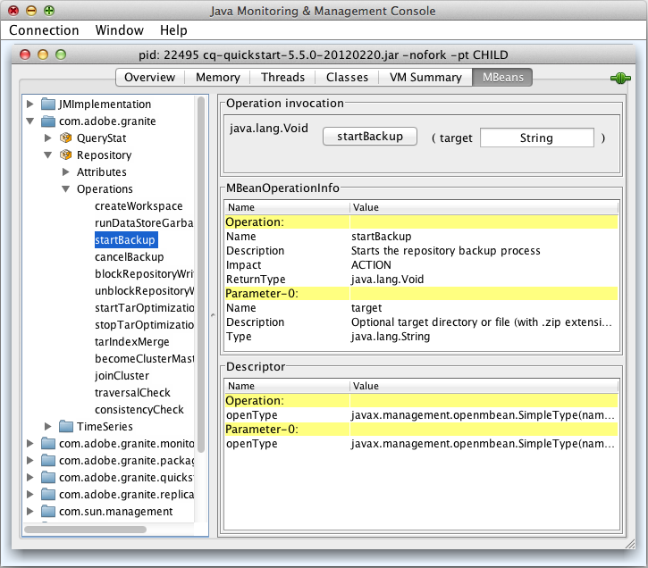

# Risorse del server di monitoraggio tramite la console JMX{#monitoring-server-resources-using-the-jmx-console}

La console JMX consente di monitorare e gestire i servizi sul server CRX. Le sezioni seguenti riepilogano gli attributi e le operazioni esposti attraverso il framework JMX.

Per informazioni sull’utilizzo dei controlli della console, consulta [Utilizzo della console JMX](#using-the-jmx-console). Per informazioni di base su JMX, vedi [Tecnologia Java Management Extensions (JMX)](https://www.oracle.com/technetwork/java/javase/tech/javamanagement-140525.html) sul sito web dell&#39;Oracle.

Per informazioni sulla creazione di MBeans per gestire i servizi utilizzando la console JMX, vedi [Integrazione dei servizi con la console JMX](/help/sites-developing/jmx-integration.md).

## Manutenzione del flusso di lavoro {#workflow-maintenance}

Operazioni per l’amministrazione di istanze del flusso di lavoro in esecuzione, completate, obsolete e non riuscite.

* Dominio: com.adobe.granite.workflow
* Tipo: Manutenzione

>[!NOTE]
>
>Consulta la sezione [console del flusso di lavoro](/help/sites-administering/workflows-administering.md) per ulteriori strumenti di amministrazione del flusso di lavoro e descrizioni dei possibili stati delle istanze del flusso di lavoro.

### Operazioni {#operations}

**listRunningWorkflowsPerModel** Elenca il numero di istanze del flusso di lavoro in esecuzione per ciascun modello di flusso di lavoro.

* Argomenti: nessuno
* Valore restituito: Dati tabulari contenenti le colonne Count e ModelId .

**listCompletedWorkflowsPerModel** Elenca il numero di istanze del flusso di lavoro completate per ciascun modello di flusso di lavoro.

* Argomenti: nessuno
* Valore restituito: Dati tabulari contenenti le colonne Count e ModelId .

**returnWorkflowQueueInfo** Elenca informazioni sugli elementi del flusso di lavoro elaborati e in coda per l’elaborazione.

* Argomenti: nessuno
* Valore restituito: Dati della tabella contenenti le colonne seguenti:

   * Jobs
   * Nome coda
   * Lavori attivi
   * Tempo medio di elaborazione
   * Tempo medio di attesa
   * Lavori annullati
   * Lavori con errori
   * Processi completati
   * Processi elaborati
   * Processi in coda

**returnWorkflowJobTopicInfo** Elenca le informazioni di elaborazione per i lavori del flusso di lavoro, organizzate per argomento.

* Argomenti: nessuno
* Valore restituito: Dati tabulari contenenti le colonne seguenti:

   * Nome argomento
   * Tempo medio di elaborazione
   * Tempo medio di attesa
   * Lavori annullati
   * Lavori con errori
   * Processi completati
   * Processi elaborati

**returnFailedWorkflowCount** Mostra il numero di istanze del flusso di lavoro che hanno avuto esito negativo. Puoi specificare un modello di flusso di lavoro per eseguire query o recuperare informazioni per tutti i modelli di flusso di lavoro.

* Argomenti:

   * modello: ID del modello da interrogare. Per visualizzare un conteggio delle istanze del flusso di lavoro non riuscite per tutti i modelli di flusso di lavoro, non specificare alcun valore. L&#39;ID è il percorso del nodo del modello, ad esempio:

      `/conf/global/settings/workflow/models/dam/update_asset/jcr:content/model`

* Valore restituito: Numero di istanze del flusso di lavoro non riuscite.

**returnFailedWorkflowCountPerModel** Mostra il numero di istanze del flusso di lavoro che non sono riuscite per ciascun modello di flusso di lavoro.

* Argomenti: nessuna.
* Valore restituito: Dati tabulari contenenti le colonne Count e Model ID .

**terminateFailedInstances** Termina le istanze del flusso di lavoro che non sono riuscite. È possibile terminare tutte le istanze non riuscite o solo le istanze non riuscite per un modello specifico. Facoltativamente è possibile riavviare le istanze dopo che sono state terminate. È inoltre possibile testare l&#39;operazione per visualizzare i risultati senza eseguire effettivamente l&#39;operazione.

* Argomenti:

   * Riavvia l&#39;istanza: (Facoltativo) Specifica un valore di `true` per riavviare le istanze una volta terminate. Il valore predefinito di `false` non causa il riavvio delle istanze del flusso di lavoro terminate.
   * Prova a secco: (Facoltativo) Specifica un valore di `true` per visualizzare i risultati dell&#39;operazione senza eseguire effettivamente l&#39;operazione. Il valore predefinito di `false` determina l&#39;esecuzione dell&#39;operazione.
   * Modello: (Facoltativo) L&#39;ID del modello a cui viene applicata l&#39;operazione. Non specificare alcun modello per applicare l&#39;operazione alle istanze non riuscite di tutti i modelli di flusso di lavoro. L&#39;ID è il percorso del nodo del modello, ad esempio:

      `/conf/global/settings/workflow/models/dam/update_asset/jcr:content/model`

* Valore restituito: Dati della tabella relativi alle istanze terminate, contenenti le colonne seguenti:

   * Iniziatore
   * InstanceId
   * ModelId
   * Payload
   * CommentoIniziale
   * Titolo flusso di lavoro

**tryFailedWorkItems** Tentativi di eseguire passaggi di elementi di lavoro non riusciti. È possibile riprovare tutti gli elementi di lavoro non riusciti o solo gli elementi di lavoro non riusciti per un modello di flusso di lavoro specifico. Facoltativamente, è possibile testare l&#39;operazione per visualizzare i risultati senza eseguire effettivamente l&#39;operazione.

* Argomenti:

   * Prova a secco: (Facoltativo) Specifica un valore di `true` per visualizzare i risultati dell&#39;operazione senza eseguire effettivamente l&#39;operazione. Il valore predefinito di `false` determina l&#39;esecuzione dell&#39;operazione.
   * Modello: (Facoltativo) L&#39;ID del modello a cui viene applicata l&#39;operazione. Specificare un modello per applicare l&#39;operazione agli elementi di lavoro non riusciti di tutti i modelli di flusso di lavoro. L&#39;ID è il percorso del nodo del modello, ad esempio:

      `/conf/global/settings/workflow/models/dam/update_asset/jcr:content/model`

* Valore restituito: Dati della tabella relativi agli elementi di lavoro non riusciti che vengono ritentati, incluse le colonne seguenti:

   * Iniziatore
   * InstanceId
   * ModelId
   * Payload
   * CommentoIniziale
   * Titolo flusso di lavoro

**PurgeActive** Rimuove le istanze del flusso di lavoro attivo di una pagina specifica. È possibile eliminare le istanze attive per tutti i modelli o solo per le istanze di un modello specifico. Facoltativamente, puoi testare l’operazione per visualizzare i risultati senza eseguire effettivamente l’operazione.

* Argomenti:

   * Modello: (Facoltativo) L&#39;ID del modello a cui viene applicata l&#39;operazione. Non specificare alcun modello per applicare l’operazione alle istanze del flusso di lavoro di tutti i modelli di flusso di lavoro. L&#39;ID è il percorso del nodo del modello, ad esempio:

      `/conf/global/settings/workflow/models/dam/update_asset/jcr:content/model`
   * Numero di giorni dall’avvio del flusso di lavoro: L’età in giorni delle istanze del flusso di lavoro da eliminare.
   * Prova a secco: (Facoltativo) Specifica un valore di `true` per visualizzare i risultati dell&#39;operazione senza eseguire effettivamente l&#39;operazione. Il valore predefinito di `false` determina l&#39;esecuzione dell&#39;operazione.

* Valore restituito: Dati tabulari sulle istanze del flusso di lavoro attive eliminate, incluse le colonne seguenti:

   * Iniziatore
   * InstanceId
   * ModelId
   * Payload
   * CommentoIniziale
   * Titolo flusso di lavoro

**countStaleWorkflows** Restituisce il numero di istanze del flusso di lavoro non aggiornate. Puoi recuperare il numero di istanze non aggiornate per tutti i modelli di flusso di lavoro o per un modello specifico.

* Argomenti:

   * Modello: (Facoltativo) L&#39;ID del modello a cui viene applicata l&#39;operazione. Non specificare alcun modello per applicare l’operazione alle istanze del flusso di lavoro di tutti i modelli di flusso di lavoro. L&#39;ID è il percorso del nodo del modello, ad esempio:

      `/conf/global/settings/workflow/models/dam/update_asset/jcr:content/model`

* Valore restituito: Il numero di istanze del flusso di lavoro non aggiornate.

**riavvioStaleWorkflows** Riavvia le istanze del flusso di lavoro non aggiornate. È possibile riavviare tutte le istanze obsolete o solo le istanze non aggiornate per un modello specifico. È inoltre possibile testare l&#39;operazione per visualizzare i risultati senza eseguire effettivamente l&#39;operazione.

* Argomenti:

   * Modello: (Facoltativo) L&#39;ID del modello a cui viene applicata l&#39;operazione. Non specificare alcun modello per applicare l’operazione alle istanze non aggiornate di tutti i modelli di flusso di lavoro. L&#39;ID è il percorso del nodo del modello, ad esempio:

      `/conf/global/settings/workflow/models/dam/update_asset/jcr:content/model`
   * Prova a secco: (Facoltativo) Specifica un valore di `true` per visualizzare i risultati dell&#39;operazione senza eseguire effettivamente l&#39;operazione. Il valore predefinito di `false` determina l&#39;esecuzione dell&#39;operazione.

* Valore restituito: Elenco delle istanze del flusso di lavoro riavviate.

**fetchModelList** Elenca tutti i modelli di flusso di lavoro.

* Argomenti: nessuno
* Valore restituito: Dati di tabella che identificano i modelli di flusso di lavoro, incluse le colonne ModelId e ModelName.

**countRunningWorkflows** Restituisce il numero di istanze del flusso di lavoro in esecuzione. È possibile recuperare il numero di istanze in esecuzione per tutti i modelli di flusso di lavoro o per un modello specifico.

* Argomenti:

   * Modello: (Facoltativo) L&#39;ID del modello per il quale viene restituito il numero di istanze in esecuzione. Non specificare alcun modello per restituire il numero di istanze in esecuzione di tutti i modelli di flusso di lavoro. L&#39;ID è il percorso del nodo del modello, ad esempio:

      `/conf/global/settings/workflow/models/dam/update_asset/jcr:content/model`

* Valore restituito: Il numero di istanze del flusso di lavoro in esecuzione.

**countCompletedWorkflows** Restituisce il numero di istanze del flusso di lavoro completate. Puoi recuperare il numero di istanze completate per tutti i modelli di flusso di lavoro o per un modello specifico.

* Argomenti:

   * Modello: (Facoltativo) L&#39;ID del modello per il quale viene restituito il numero di istanze completate. Non specificare alcun modello per restituire il numero di istanze completate di tutti i modelli di flusso di lavoro. L&#39;ID è il percorso del nodo del modello, ad esempio:

      `/conf/global/settings/workflow/models/dam/update_asset/jcr:content/model`

* Valore restituito: Il numero di istanze del flusso di lavoro completate.

**purgeCompleted** Rimuove dall’archivio i record dei flussi di lavoro completati di una specifica età. Utilizza questa operazione periodicamente per ridurre al minimo le dimensioni dell’archivio quando utilizzi intensamente i flussi di lavoro. È possibile eliminare le istanze completate per tutti i modelli o solo per le istanze di un modello specifico. Facoltativamente, puoi testare l’operazione per visualizzare i risultati senza eseguire effettivamente l’operazione.

* Argomenti:

   * Modello: (Facoltativo) L&#39;ID del modello a cui viene applicata l&#39;operazione. Non specificare alcun modello per applicare l’operazione alle istanze del flusso di lavoro di tutti i modelli di flusso di lavoro. L&#39;ID è il percorso del nodo del modello, ad esempio:

      `/conf/global/settings/workflow/models/dam/update_asset/jcr:content/model`
   * Numero di giorni dal completamento del flusso di lavoro: Il numero di giorni in cui le istanze del flusso di lavoro sono state completate.
   * Prova a secco: (Facoltativo) Specifica un valore di `true` per visualizzare i risultati dell&#39;operazione senza eseguire effettivamente l&#39;operazione. Il valore predefinito di `false` determina l&#39;esecuzione dell&#39;operazione.

* Valore restituito: Dati tabulari sulle istanze del flusso di lavoro completate eliminate, incluse le colonne seguenti:

   * Iniziatore
   * InstanceId
   * ModelId
   * Payload
   * CommentoIniziale
   * Titolo flusso di lavoro

## Archivio {#repository}

Informazioni sull&#39;archivio CRX

* Dominio: com.adobe.granite
* Tipo: Archivio

### Attributi {#attributes}

**Nome** Nome dell’implementazione dell’archivio JCR. Sola lettura.

**Versione** Versione di implementazione del repository. Sola lettura.

**HomeDir** La directory in cui si trova l&#39;archivio. Il percorso predefinito è &lt;quickstart_jar_location>/crx-quickstart/repository. Sola lettura.

**NomeCliente** Nome del cliente a cui viene rilasciata la licenza software. Sola lettura.

**LicenseKey** Chiave di licenza univoca per questa installazione dell&#39;archivio. Sola lettura.

**SpazioDiscoDisponibile** Lo spazio su disco disponibile per questa istanza del repository, in Mbyte. Sola lettura.

**MaximumNumberOfOpenFiles** Il numero di file che è possibile aprire contemporaneamente. Sola lettura.

**SessionTracker** Il valore della variabile di sistema crx.debug.Sessions. true indica una sessione di debug. false indica una sessione normale. Lettura/scrittura.

**Descrittori** Un set di coppie chiave-valore che rappresentano le proprietà del repository. Tutte le proprietà sono di sola lettura.

<table>
 <tbody>
  <tr>
   <th>Chiave</th>
   <th>Valore</th>
  </tr>
  <tr>
   <td>option.node.and.property.with.same.name.supported</td>
   <td>Indica se un nodo e una proprietà del nodo possono avere lo stesso nome. true indica che gli stessi nomi sono supportati, false indica che non è supportato. </td>
  </tr>
  <tr>
   <td>identifier.stability</td>
   <td>Indica la stabilità degli identificatori di nodo non referenziabili. Sono possibili i seguenti valori:
    <ul>
     <li>identifier.stability.indefined.duration: Gli identificatori non cambiano.</li>
     <li>identifier.stability.method.duration: Gli identificatori possono cambiare tra le chiamate dei metodi.</li>
     <li>identifier.stability.save.duration: Gli identificatori non cambiano all’interno di un ciclo di salvataggio/aggiornamento.</li>
     <li>identifier.stability.session.duration: Gli identificatori non cambiano durante una sessione.</li>
    </ul> </td>
  </tr>
  <tr>
   <td>query.xpath.pos.index</td>
   <td>Indica se il linguaggio di query JCR 1.0 XPath è supportato. true indica il supporto e false indica l'assenza di supporto.</td>
  </tr>
  <tr>
   <td>crx.repository.systemid</td>
   <td>Identificatore di sistema nel file system.id.</td>
  </tr>
  <tr>
   <td>option.query.sql.supported</td>
   <td>Indica se il linguaggio di query JCR 1.0 XPath è supportato. true indica il supporto e false indica l'assenza di supporto.</td>
  </tr>
  <tr>
   <td>jcr.repository.version</td>
   <td>Versione dell’implementazione dell’archivio.</td>
  </tr>
  <tr>
   <td>option.update.primary.node.type.supported</td>
   <td>Indica se è possibile modificare il tipo di nodo principale di un nodo. true indica che è possibile modificare il tipo di nodo principale e false indica che la modifica non è supportata.</td>
  </tr>
  <tr>
   <td>option.node.type.management.supported</td>
   <td>Indica se la gestione del tipo di nodo è supportata. true indica che è supportato e false indica che non è supportato.</td>
  </tr>
  <tr>
   <td>node.type.management.overrides.supported</td>
   <td>Indica se è possibile ignorare la definizione della proprietà ereditata o del nodo figlio di un tipo di nodo. true indica che le sostituzioni sono supportate e false indica che non sono presenti sostituzioni.</td>
  </tr>
  <tr>
   <td>option.observation.supported</td>
   <td>true indica che è supportata l’osservazione asincrona delle modifiche dell’archivio. Il supporto dell’osservazione asincrona consente alle applicazioni di ricevere e rispondere alle notifiche su ogni cambiamento man mano che si verificano.</td>
  </tr>
  <tr>
   <td>query.jcrscore</td>
   <td><p>true indica che la pseudo-proprietà jcr:score è disponibile nelle query XPath e SQL che includono una funzione jcrfn:contains (in XPath) o CONTAINS (in SQL) per eseguire una ricerca full-text.</p> </td>
  </tr>
  <tr>
   <td>option.simple.versioning.supported</td>
   <td>true indica che l’archivio supporta il controllo delle versioni semplice. Con il semplice controllo delle versioni, l'archivio mantiene una serie sequenziale di versioni di un nodo.</td>
  </tr>
  <tr>
   <td>option.workspace.management.supported</td>
   <td>true indica che l’archivio supporta la creazione e l’eliminazione di aree di lavoro tramite API.</td>
  </tr>
  <tr>
   <td>option.update.mixin.node.types.supported</td>
   <td>true indica che l'archivio supporta l'aggiunta e la rimozione dei tipi di nodo mixin di un nodo esistente.</td>
  </tr>
  <tr>
   <td>node.type.management.primary.item.name.supported</td>
   <td>true indica che l'archivio consente alle definizioni dei nodi di contenere un elemento primario come figlio. Un elemento primario è accessibile tramite l’API senza conoscere il nome dell’elemento.</td>
  </tr>
  <tr>
   <td>level.2.supported</td>
   <td>true indica che i valori LEVEL_1_SUPPORTED e OPTION_XML_IMPORT_SUPPORTED sono true.</td>
  </tr>
  <tr>
   <td>write.supported</td>
   <td>true indica che l’archivio fornisce accesso in scrittura utilizzando l’API. false indica l'accesso in sola lettura.</td>
  </tr>
  <tr>
   <td>node.type.management.update.in.use.supported</td>
   <td>true indica che è possibile modificare le definizioni dei nodi in uso dai nodi esistenti.</td>
  </tr>
  <tr>
   <td>jcr.specification.version</td>
   <td>Versione della specifica JCR implementata dall'archivio.</td>
  </tr>
  <tr>
   <td>option.journaled.observation.supported</td>
   <td>true indica che le applicazioni possono eseguire l'osservazione registrata dell'archivio. con l'osservazione registrata, è possibile ottenere una serie di notifiche di cambiamento per un periodo di tempo specifico. </td>
  </tr>
  <tr>
   <td>query.languages</td>
   <td>I linguaggi di query supportati dal repository. Nessun valore indica il supporto per le query.</td>
  </tr>
  <tr>
   <td>option.xml.export.supported</td>
   <td>true indica che il repository supporta l'esportazione dei nodi come codice XML.</td>
  </tr>
  <tr>
   <td>node.type.management.multiple.binary.properties.supported</td>
   <td>true indica che l'archivio supporta la registrazione di tipi di nodo che hanno più proprietà binarie. false indica che una singola proprietà binaria è supportata per un tipo di nodo.</td>
  </tr>
  <tr>
   <td>option.access.control.supported</td>
   <td>true indica che il repository supporta il controllo degli accessi per impostare e determinare i privilegi utente per l'accesso ai nodi.</td>
  </tr>
  <tr>
   <td>option.baselines.supported</td>
   <td>true indica che l'archivio supporta sia le configurazioni che le linee di base.</td>
  </tr>
  <tr>
   <td>option.shareable.nodes.supported</td>
   <td>true indica che l’archivio supporta la creazione di nodi condivisibili.</td>
  </tr>
  <tr>
   <td>crx.cluster.id</td>
   <td>Identificatore del cluster di archivio.</td>
  </tr>
  <tr>
   <td>query.stored.queries.supported</td>
   <td>true indica che il repository supporta le query memorizzate.</td>
  </tr>
  <tr>
   <td>query.full.text.search.supported</td>
   <td>true indica che l'archivio supporta la ricerca full-text.</td>
  </tr>
  <tr>
   <td>node.type.management.inheritance</td>
   <td><p>Indica il livello di supporto del repository per l'ereditarietà del tipo di nodo. Sono possibili i seguenti valori:</p> <p>node.type.management.inheritance.minimum: La registrazione dei tipi di nodo primario è limitata a quelli che hanno solo nt:base come supertipo. La registrazione dei tipi di nodo mixin è limitata a quelli senza supertipo.</p> <p>node.type.management.inheritance.single: La registrazione dei tipi di nodo primario è limitata a quelli con un supertipo. La registrazione dei tipi di nodo mixin è limitata a quelli con al massimo un supertipo.</p> <p><br /> node.type.management.inheritance.multiple: I tipi di nodo primario possono essere registrati con uno o più supertipi. I tipi di nodo misti possono essere registrati con zero o più supertipi.</p> </td>
  </tr>
  <tr>
   <td>crx.cluster.preferredMaster</td>
   <td>true indica che questo nodo cluster è il master preferito del cluster.</td>
  </tr>
  <tr>
   <td>option.transactions.supported</td>
   <td>true indica che il repository supporta le transazioni.</td>
  </tr>
  <tr>
   <td>jcr.repository.vendor.url</td>
   <td>URL del fornitore del repository.</td>
  </tr>
  <tr>
   <td>node.type.management.value.constraints.supported</td>
   <td>true indica che l'archivio supporta i vincoli di valore per le proprietà dei nodi.</td>
  </tr>
  <tr>
   <td>node.type.management.property.types</td>
   <td>array di costanti javax.jcr.PropertyType che rappresentano i tipi di proprietà che un tipo di nodo registrato può specificare. Una matrice a lunghezza zero indica che i tipi di nodo registrati non possono specificare le definizioni delle proprietà. I tipi di proprietà sono STRING, URI, BOOLEAN, LONG, DOUBLE, DECIMAL, BINARY, DATE, NAME, PATH, WEAKREFERENCE, REFERENCE e UNDEFINED (se supportato)</td>
  </tr>
  <tr>
   <td>node.type.management.orderable.child.nodes.supported</td>
   <td>true indica che l’archivio supporta la conservazione dell’ordine dei nodi figlio.</td>
  </tr>
  <tr>
   <td>jcr.repository.vendor</td>
   <td>Nome del fornitore del repository.</td>
  </tr>
  <tr>
   <td>query.joins</td>
   <td><p>Livello di supporto per i join nelle query. Sono possibili i seguenti valori:</p>
    <ul>
     <li>query.joins.none: Nessun supporto per i join. Le query possono utilizzare un selettore.</li>
     <li>query.joins.inner: Supporto per i join interni.</li>
     <li>query.joins.inner.outer: Supporto per giunti interni ed esterni.</li>
    </ul> </td>
  </tr>
  <tr>
   <td>org.apache.jackrabbit.spi.commons.AdditionalEventInfo</td>
   <td> </td>
  </tr>
  <tr>
   <td>query.xpath.doc.order</td>
   <td>true indica che l'archivio supporta il linguaggio di query XPath 1.0.</td>
  </tr>
  <tr>
   <td>query.jcrpath</td>
   <td> </td>
  </tr>
  <tr>
   <td>option.xml.import.supported</td>
   <td>true indica che il repository supporta l'importazione di codice XML come contenuto.</td>
  </tr>
  <tr>
   <td>node.type.management.same.name.siblings.supported</td>
   <td>true indica che il repository supporta nodi di pari livello (nodi con lo stesso padre) con gli stessi nomi.</td>
  </tr>
  <tr>
   <td>node.type.management.residual.definitions.supported</td>
   <td>true indica che l'archivio supporta le proprietà del nome con definizioni residue. Se supportato, l’attributo name di una definizione di elemento può essere un asterisco ("*").</td>
  </tr>
  <tr>
   <td>node.type.management.autocreated.definitions.supported</td>
   <td>true indica che l'archivio supporta la creazione automatica di elementi secondari (nodi o proprietà) di un nodo quando il nodo viene creato.</td>
  </tr>
  <tr>
   <td>crx.cluster.master</td>
   <td>true indica che il nodo del repository è il nodo principale del cluster.</td>
  </tr>
  <tr>
   <td>level.1.supported</td>
   <td>true indica che option.xml.export.support è true e query.language ha una lunghezza diversa da zero.</td>
  </tr>
  <tr>
   <td>option.unfiled.content.supported</td>
   <td>true indica che l’archivio supporta il contenuto non archiviato. I nodi non archiviati non fanno parte della gerarchia del repository.</td>
  </tr>
  <tr>
   <td>jcr.specification.name</td>
   <td>Nome della specifica JCR implementata dall'archivio.</td>
  </tr>
  <tr>
   <td>option.versioning.supported</td>
   <td>true indica che l’archivio supporta il controllo delle versioni completo.</td>
  </tr>
  <tr>
   <td>jcr.repository.name</td>
   <td>Nome dell'archivio.</td>
  </tr>
  <tr>
   <td>option.locking.supported</td>
   <td>true indica che l'archivio supporta il blocco dei nodi. Il blocco consente a un utente di impedire temporaneamente ad altri utenti di apportare modifiche.</td>
  </tr>
  <tr>
   <td>jcr.repository.version.display</td>
   <td> </td>
  </tr>
  <tr>
   <td>option.activities.supported</td>
   <td>true indica che l’archivio supporta le attività. Le attività sono un insieme di modifiche che vengono eseguite in un’area di lavoro unita a un’altra area di lavoro.</td>
  </tr>
  <tr>
   <td>node.type.management.multivalued.properties.supported</td>
   <td>true indica che il repository supporta le proprietà dei nodi che possono avere zero o più valori.</td>
  </tr>
  <tr>
   <td>option.retention.supported</td>
   <td>true indica che l’archivio supporta l’utilizzo di applicazioni esterne per la gestione della conservazione per applicare criteri di conservazione ai contenuti e supporta il blocco e il rilascio.</td>
  </tr>
  <tr>
   <td>option.lifecycle.supported</td>
   <td>true indica che l'archivio supporta la gestione del ciclo di vita.</td>
  </tr>
 </tbody>
</table>

**NomiArea di lavoro** Nomi delle aree di lavoro nell’archivio. Sola lettura.

**DataStoreGarbageCollectionDelay** La quantità di tempo in millisecondi che la raccolta di oggetti inattivi dorme dopo la scansione ogni decimo nodo. Lettura/scrittura.

**Ritardo backup** Il tempo in millisecondi impiegato dal processo di backup tra ciascun passaggio del backup. Lettura/scrittura.

**BackupInProgress** Il valore true indica che è in esecuzione un processo di backup. Sola lettura.

**BackupProgress** Per il backup corrente, la percentuale di tutti i file di cui è stato eseguito il backup. Sola lettura.

**CurrentBackupTarget** Per il backup corrente, il file ZIP in cui vengono archiviati i file di backup. Quando un backup non è in corso, non viene visualizzato alcun valore. Sola lettura.

**BackupEraCompletato** Il valore true indica che non si sono verificati errori durante il backup corrente o che non è in corso alcun backup. false indica un errore durante il backup corrente. Sola lettura.

**BackupResult** Lo stato del backup corrente. Sono possibili i seguenti valori:

* Backup in corso: È in corso l&#39;esecuzione di un backup.
* Backup annullato: Backup annullato.
* Backup completato con errore: Errore durante il backup. Il messaggio di errore fornisce informazioni sulla causa.
* Backup completato: Backup riuscito.
* Nessun backup eseguito finora: Nessun backup in corso.

Sola lettura.

**TarOptimizationRunningSince** Data di inizio del processo di ottimizzazione file TAR corrente. Sola lettura.

**TarOptimizationDelay** Il tempo in millisecondi impiegato dal processo di ottimizzazione TAR tra ciascun passaggio del processo. Lettura/scrittura.

**ProprietàCluster** Un insieme di coppie chiave-valore che rappresentano proprietà e valori del cluster. Ogni riga della tabella rappresenta una proprietà cluster. Sola lettura.

**ClusterNodes** I membri del cluster di repository.

**ClusterId** Identificatore del cluster di archivio. Sola lettura.

**ClusterMasterId** Identificatore del nodo principale del cluster di repository. Sola lettura.

**ClusterNodeId** Identificatore di questo nodo del cluster di repository. Sola lettura.

### Operazioni {#operations-1}

**createWorkspace** Crea un’area di lavoro in questo archivio.

* Argomenti:

   * nome: Valore String che rappresenta il nome della nuova area di lavoro.

* Valore restituito: nessuno

**runDataStoreGarbageCollection** Esegue la raccolta degli oggetti inattivi sui nodi del repository.

* Argomenti:

   * elimina: Un valore booleano che indica se eliminare gli elementi del repository non utilizzati. Un valore true causa l&#39;eliminazione dei nodi e delle proprietà non utilizzati. Il valore false fa sì che tutti i nodi vengano analizzati, ma non vengono eliminati.

* Valore restituito: nessuno

**stopDataStoreGarbageCollection** Interrompe l&#39;esecuzione della raccolta degli oggetti inattivi nell&#39;archivio dati.

* Argomenti: nessuno
* Valore restituito: rappresentazione a stringa dello stato corrente

**startBackup** Esegue il backup dei dati dell&#39;archivio in un file ZIP.

* Argomenti:

   * `target`: (Facoltativo) A `String` che rappresenta il nome del file o della directory ZIP in cui archiviare i dati del repository. Per utilizzare un file ZIP, includi l’estensione del nome file ZIP. Per utilizzare una directory, non includere alcuna estensione di nome file.

      Per eseguire un backup incrementale, specificare la directory utilizzata in precedenza per il backup.

      È possibile specificare un percorso assoluto o relativo. I percorsi relativi sono relativi al padre della directory crx-quickstart.

      Quando non si specifica alcun valore, il valore predefinito di `backup-currentdate.zip` è utilizzato, se `currentdate` è nel formato `yyyyMMdd-HHmm`.

* Valore restituito: nessuno

**cancelBackup** Arresta il processo di backup corrente ed elimina l&#39;archivio temporaneo creato dal processo per l&#39;archiviazione dei dati.

* Argomenti: nessuno
* Valore restituito: nessuno

**blockRepositoryWrites** Blocca le modifiche ai dati del repository. Tutti i listener di backup dell&#39;archivio vengono informati del blocco.

* Argomenti: nessuno
* Valore restituito: nessuno

**unblockRepositoryWrites** Rimuove il blocco dall’archivio. Tutti i listener di backup dell&#39;archivio vengono informati della rimozione del blocco.

* Argomenti: nessuno
* Valore restituito: nessuno

**startTarOptimization** Avvia il processo di ottimizzazione dei file TAR utilizzando il valore predefinito per tarOptimizationDelay.

* Argomenti: nessuno
* Valore restituito: nessuno

**stopTarOptimization** Interrompe l&#39;ottimizzazione dei file TAR.

* Argomenti: nessuno
* Valore restituito: nessuno

**tarIndexMerge** Unisce i file di indice principali di tutti i set TAR. I file di indice principali sono file con diverse versioni principali. Ad esempio, i file seguenti vengono uniti nel file index_3_1.tar: index_1_1.tar, index_2_0.tar, index_3_0.tar. I file che sono stati uniti vengono eliminati (nell&#39;esempio precedente, index_1_1.tar, index_2_0.tar e index_3_0.tar vengono eliminati).

* Argomenti:

   * `background`: Valore booleano che indica se eseguire l’operazione in background in modo che la console Web sia utilizzabile durante l’esecuzione. Il valore true esegue l&#39;operazione in background.

* Valore restituito: nessuno

**getClusterMaster** Imposta questo nodo del repository come nodo principale del cluster. Se non è già master, questo comando arresta il listener dell&#39;istanza master corrente e avvia un listener principale sul nodo corrente. Questo nodo viene quindi impostato come nodo principale e si riavvia, causando la connessione a questa istanza di tutti gli altri nodi del cluster (cioè quelli controllati dal master).

* Argomenti: nessuno
* Valore restituito: nessuno

**joinCluster** Aggiunge questo archivio a un cluster come nodo controllato dal cluster master. Devi fornire un nome utente e una password a scopo di autenticazione. La connessione utilizza l’autenticazione di base. Le credenziali di protezione sono codificate in base 64 prima di essere inviate al server.

* Argomenti:

   * `master`: Valore stringa che rappresenta l&#39;indirizzo IP o il nome computer del computer che esegue il nodo dell&#39;archivio master.
   * `username`: Nome da utilizzare per l&#39;autenticazione con il cluster.
   * `password`: Password da utilizzare per l&#39;autenticazione.

* Valore restituito: nessuno

**traversalCheck** Passa e, facoltativamente, corregge le incongruenze in una sottostruttura che inizia in un nodo specifico. Questo è descritto in dettaglio nella documentazione sui Persistence Manager.

**consistencyCheck** Verifica e, facoltativamente, corregge la coerenza nel Datastore. Questo è descritto in dettaglio nella documentazione del Datastore.

## Statistiche archivio (TimeSeries) {#repository-statistics-timeseries}

Valore del campo TimeSeries per ogni tipo di statistica che `org.apache.jackrabbit.api.stats.RepositoryStatistics` definisce.

* Dominio: `com.adobe.granite`
* Tipo: `TimeSeries`
* Nome: Uno dei seguenti valori dal `org.apache.jackrabbit.api.stats.RepositoryStatistics.Type` Classe enum:

   * BUNDLE_CACHE_ACCESS_COUNTER
   * BUNDLE_CACHE_MISS_MEDIA
   * BUNDLE_CACHE_MISS_COUNTER
   * BUNDLE_CACHE_MISS_DURATION
   * BUNDLE_CACHE_SIZE_COUNTER
   * BUNDLE_COUNTER
   * BUNDLE_READ_COUNTER
   * BUNDLE_WRITE_MEDIA
   * BUNDLE_WRITE_COUNTER
   * BUNDLE_WRITE_DURATION
   * BUNDLE_WS_SIZE_COUNTER
   * QUERY_MEDIA
   * QUERY_COUNT
   * QUERY_DURATION
   * SESSION_COUNT
   * SESSION_LOGIN_COUNTER
   * SESSION_READ_MEDIA
   * SESSION_READ_COUNTER
   * SESSION_READ_DURATION
   * SESSION_WRITE_MEDIA
   * SESSION_WRITE_COUNTER
   * SESSION_WRITE_DURATION

### Attributi {#attributes-1}

Per ogni tipo di statistica segnalato sono forniti i seguenti attributi:

* ValuePerSecond: Il valore misurato al secondo nell&#39;ultimo minuto. Sola lettura.
* ValuePerMinute: Il valore misurato al minuto nell&#39;ultima ora. Sola lettura.
* ValuePerHour: Il valore misurato all&#39;ora nell&#39;ultima settimana. Sola lettura.
* ValuePerWeek: Il valore misurato a settimana negli ultimi tre anni. Sola lettura.

## Statistiche query archivio {#repository-query-stats}

Informazioni statistiche sulle query del repository.

* Dominio: com.adobe.granite
* Tipo: QueryState

### Attributi {#attributes-2}

**Query lente** Informazioni sulle query del repository che hanno richiesto il tempo più lungo per essere completate. Sola lettura.

**DimensioneCodaLenta** Numero massimo di query da includere nell&#39;elenco SlowQueries. Lettura/scrittura.

**Query popolari** Informazioni sulle query del repository che si sono verificate di più. Sola lettura.

**PopularQueriesQueueSize** Il numero massimo di query nell&#39;elenco PopularQueries. Lettura/scrittura.

### Operazioni {#operations-2}

**clearSlowQueriesQueue** Rimuove tutte le query dall’elenco SlowQueries.

* Argomenti: nessuno
* Valore restituito: nessuno

**clearPopularQueriesQueue** Rimuove tutte le query dall’elenco PopularQueries.

* Argomenti: nessuno
* Valore restituito: nessuno

## Agenti di replica {#replication-agents}

Monitora i servizi per ogni agente di replica. Quando crei un agente di replica, il servizio viene visualizzato automaticamente nella console JMX.

* **Dominio:** com.adobe.granite.replication
* **Tipo:** agente
* **Nome:** nessun valore
* **Proprietà:** {id=&quot;*Nome*&quot;}, dove *Nome* è il valore della proprietà Nome agente.

### Attributi {#attributes-3}

**Id** Valore String che rappresenta l&#39;identificatore della configurazione dell&#39;agente di replica. Più agenti possono utilizzare la stessa configurazione. Sola lettura.

**Valido** Un valore booleano che indica se l’agente è configurato correttamente:

* `true`: Configurazione valida.
* `false` : La configurazione contiene errori.

Sola lettura.

**Abilitato** Un valore booleano che indica se l’agente è abilitato:

* `true`: abilitato.
* `false`: disabilitato.

**QueueBlocked** Un valore booleano che indica se la coda esiste ed è bloccata:

* `true`: Bloccato. È in sospeso un nuovo tentativo automatico.
* `false`: Non bloccato o non esiste.

Sola lettura.

**QueuePaused** Un valore booleano che indica se la coda di lavoro è in pausa:

* `true`: In pausa (sospesa)
* `false`: Non in pausa o non esiste.

Lettura/scrittura.

**QueueNumEntries** Un valore int che rappresenta il numero di processi nella coda dell&#39;agente. Sola lettura.

**QueueStatusTime** Valore Date che indica l&#39;ora sul server in cui sono stati ottenuti i valori di stato visualizzati. Il valore corrisponde all’ora di caricamento della pagina. Sola lettura.

**QueueNextRetryTime** Per le code bloccate, un valore Date che indica quando si verifica il prossimo tentativo automatico. Quando non viene visualizzato alcun tempo, la coda non viene bloccata. Sola lettura.

**QueueProcessingSince** Valore Date che indica quando è iniziata l&#39;elaborazione per il processo corrente. Quando non viene visualizzato il tempo, la coda è bloccata o inattiva. Sola lettura.

**QueueLastProcessTime** Valore Date che indica quando è stato completato il processo precedente. Sola lettura.

### Operazioni {#operations-3}

**queueForceRetry** Per le code bloccate, invia il comando di esecuzione di un nuovo tentativo alla coda.

* Argomenti: nessuno
* Valore restituito: nessuno

**queueClear** Rimuove tutti i processi dalla coda.

* Argomenti: nessuno
* Valore restituito: nessuno

## Motore Sling {#sling-engine}

Fornisce statistiche sulle richieste HTTP in modo da poter monitorare le prestazioni del servizio SlingRequestProcessor.

* Dominio: org.apache.sling
* Tipo: motore
* Proprietà: {service=RequestProcessor}

### Attributi {#attributes-4}

**RequestsCount** Il numero di richieste che si sono verificate dall&#39;ultima reimpostazione delle statistiche.

**MinRequestDurationMsec** Il tempo più breve (in millisecondi) necessario per elaborare una richiesta dall&#39;ultima reimpostazione delle statistiche.

**MaxRequestDuratioMsec** Il periodo di tempo più lungo (in millisecondi) necessario per elaborare una richiesta dall&#39;ultima reimpostazione delle statistiche.

**StandardDeviationDurationMsec** Deviazione standard del tempo necessario per elaborare le richieste. La deviazione standard viene calcolata utilizzando tutte le richieste dall’ultima reimpostazione delle statistiche.

**MediaRequestDurationMsec** Il tempo medio necessario per elaborare una richiesta. La media viene calcolata utilizzando tutte le richieste dall’ultima reimpostazione delle statistiche

### Operazioni {#operations-4}

**resetStatistics** Imposta tutte le statistiche su zero. Reimposta le statistiche quando devi analizzare le prestazioni di elaborazione della richiesta durante un intervallo di tempo specifico.

* Argomenti: nessuno
* Valore restituito: nessuno

**id** La rappresentazione stringa dell&#39;ID pacchetto.

**installato** Un valore booleano che indica se il pacchetto è installato:

* `true`: Installato.
* `false`: Non installato.

**installBy** ID dell&#39;utente che ha installato il pacchetto per l&#39;ultima volta.

**installDate** Data dell&#39;ultima installazione del pacchetto.

**size** Valore lungo che contiene le dimensioni del pacchetto in byte.


## Avvio rapido {#quickstart-launcher}

Informazioni sul processo di avvio e sul modulo di avvio rapido.

* Dominio: com.adobe.granite.quickstart
* Tipo: Launcher

### Operazioni {#operations-5}

**log**

Visualizza un messaggio nella finestra QuickStart.

Argomenti:

* p1: A `String` che rappresenta il messaggio da visualizzare.
* Valore restituito: nessuno

**startupFinished**

Chiama il metodo startupFinished del server launcher. Il metodo tenta di aprire la pagina di benvenuto in un browser Web.

* Argomenti: nessuno
* Valore restituito: nessuno

**startupProgress**

Imposta il valore di completamento del processo di avvio del server. La barra di avanzamento nella finestra QuickStart rappresenta il valore di completamento.

* Argomenti:
   * p1: Un valore Float che rappresenta la quantità di completamento del processo di avvio, come frazione. Il valore deve essere compreso tra zero e uno. Ad esempio, 0,3 indica un completamento del 30%.
* Valore restituito: nessuna.

## Servizi di terze parti {#third-party-services}

Diverse risorse server di terze parti installano MBeans che espongono attributi e operazioni alla console JMX. Nella tabella seguente sono elencate le risorse di terze parti e sono disponibili collegamenti per ulteriori informazioni.

<table>
 <tbody>
  <tr>
   <th>Dominio</th>
   <th>Tipo</th>
   <th>Classe MBean</th>
  </tr>
  <tr>
   <td>Implementazione JMI</td>
   <td>MBeanServerDelegate</td>
   <td><a href="https://docs.oracle.com/javase/8/docs/api/javax/management/MBeanServerDelegate.html">javax.management.MBeanServerDelegate</a></td>
  </tr>
  <tr>
   <td>com.sun.management</td>
   <td>HotSpotDiagnostic</td>
   <td><a href="https://docs.oracle.com/javase/8/docs/jre/api/management/extension/com/sun/management/HotSpotDiagnosticMXBean.html">com.sun.management.HotSpotDiagnosticMXBean</a></td>
  </tr>
  <tr>
   <td>java.lang</td>
   <td>
    <ul>
     <li>ClassLoading</li>
     <li>Compilazione</li>
     <li>GarbageCollector</li>
     <li>Memoria</li>
     <li>MemoryManager</li>
     <li>MemoryPool</li>
     <li>Sistema operativo</li>
     <li>Runtime</li>
     <li>Threading</li>
    </ul> </td>
   <td><a href="https://docs.oracle.com/javase/8/docs/api/javax/management/package-summary.html">javax.management</a> pacchetto</td>
  </tr>
  <tr>
   <td>java.util.logging</td>
   <td> </td>
   <td><a href="https://docs.oracle.com/javase/8/docs/api/java/util/logging/LoggingMXBean.html">java.util.logging.LoggingMXBean</a></td>
  </tr>
  <tr>
   <td>osgi.core</td>
   <td>
    <ul>
     <li>bundleState</li>
     <li>framework</li>
     <li>packageState</li>
     <li>serviceState</li>
    </ul> </td>
   <td><a href="https://osgi.org/specification/osgi.enterprise/7.0.0/service.jmx.html#d0e42567">org.osgi.jmx.framework</a> pacchetto</td>
  </tr>
 </tbody>
</table>

## Utilizzo della console JMX {#using-the-jmx-console}

La console JMX visualizza informazioni su diversi servizi in esecuzione sul server:

* Attributi: Proprietà del servizio come configurazioni o dati di runtime. Gli attributi possono essere di sola lettura o in lettura e scrittura.
* Operazioni: Comandi che è possibile richiamare sul servizio.

MBeans distribuiti con un servizio OSGi espone gli attributi e le operazioni del servizio alla console. MBean determina gli attributi e le operazioni esposti e se gli attributi sono di sola lettura o di lettura-scrittura.

La pagina principale della console JMX include una tabella dei servizi. Ogni riga della tabella rappresenta un servizio esposto da un MBean.

1. Apri la console Web e fai clic sulla scheda JMX . ([http://localhost:4502/system/console/jmx](http://localhost:4502/system/console/jmx))
2. Fai clic su un valore di cella per un servizio per visualizzare gli attributi e le operazioni del servizio.
3. Per modificare un valore di attributo, fare clic sul valore, specificare il valore nella finestra di dialogo visualizzata e fare clic su Salva.
4. Per richiamare un&#39;operazione di servizio, fare clic sul nome dell&#39;operazione, specificare i valori dell&#39;argomento nella finestra di dialogo visualizzata e fare clic su Richiama.

## Utilizzo di applicazioni JMX esterne per il monitoraggio {#using-external-jmx-applications-for-monitoring}

CRX consente alle applicazioni esterne di interagire con i Fagioli gestiti (MBeans) tramite [Estensioni di gestione Java (JMX)](https://docs.oracle.com/javase/6/docs/technotes/guides/management/overview.html). Utilizzo di console generiche come [JConsole](https://java.sun.com/developer/technicalArticles/J2SE/jconsole.html) o applicazioni di monitoraggio specifiche per il dominio, consente di ottenere e impostare configurazioni e proprietà CRX, così come il monitoraggio delle prestazioni e dell&#39;utilizzo delle risorse.

### Utilizzo di JConsole per connettersi a CRX {#using-jconsole-to-connect-to-crx}

Per connettersi a CRX utilizzando JConsole, segui questi passaggi:

1. Apri una finestra terminale.
1. Immetti il seguente comando:

   `jconsole`

JConsole verrà avviato e verrà visualizzata la finestra JConsole.

### Connessione a un processo CRX locale {#connecting-to-a-local-crx-process}

JConsole visualizzerà un elenco dei processi Java Virtual Machine locali. L’elenco conterrà due processi quickstart. Seleziona il processo &quot;CHILD&quot; di avvio rapido dall&#39;elenco dei processi locali (di solito quello con il PID più alto).


### Connessione a un processo CRX remoto {#connecting-to-a-remote-crx-process}

Per connettersi a un processo CRX remoto, la JVM che ospita il processo CRX remoto dovrà essere abilitata per accettare connessioni JMX remote.

Per abilitare le connessioni JMX remote, è necessario impostare la seguente proprietà di sistema all&#39;avvio della JVM:

`com.sun.management.jmxremote.port=portNum`

Nella proprietà precedente, `portNum` è il numero di porta attraverso il quale si desidera abilitare le connessioni JMX RMI. Assicurati di specificare un numero di porta non utilizzato. Oltre a pubblicare un connettore RMI per l&#39;accesso locale, l&#39;impostazione di questa proprietà pubblica un connettore RMI aggiuntivo in un registro di sola lettura privato alla porta specificata utilizzando un nome noto, &quot;jmxrmi&quot;.

Per impostazione predefinita, quando si abilita l&#39;agente JMX per il monitoraggio remoto, utilizza l&#39;autenticazione tramite password basata su un file di password che deve essere specificato utilizzando la seguente proprietà di sistema all&#39;avvio della Java VM:

`com.sun.management.jmxremote.password.file=pwFilePath`

Consulta la sezione [documentazione JMX pertinente](https://docs.oracle.com/javase/6/docs/technotes/guides/management/agent.html) per istruzioni dettagliate sulla configurazione di un file password.

Esempio:

```shell
$ java
  -Dcom.sun.management.jmxremote.password.file=pwFilePath
  -Dcom.sun.management.jmxremote.port=8463
  -jar ./cq-quickstart.jar
```

### Utilizzo dei MBeans forniti da CRX {#using-the-mbeans-provided-by-crx}

Dopo aver effettuato il collegamento al processo quickstart, JConsole fornisce una serie di strumenti di monitoraggio generali per la JVM in cui CRX è in esecuzione.


Per accedere alle opzioni di monitoraggio e configurazione interne di CRX, vai alla scheda MBeans e, dalla struttura dei contenuti gerarchici a sinistra, seleziona la sezione Attributi o operazioni a cui sei interessato. Ad esempio, la sezione com.adobe.granite/Repository/Operations .

All’interno di tale sezione, seleziona l’attributo o l’operazione desiderati nel riquadro a sinistra.


