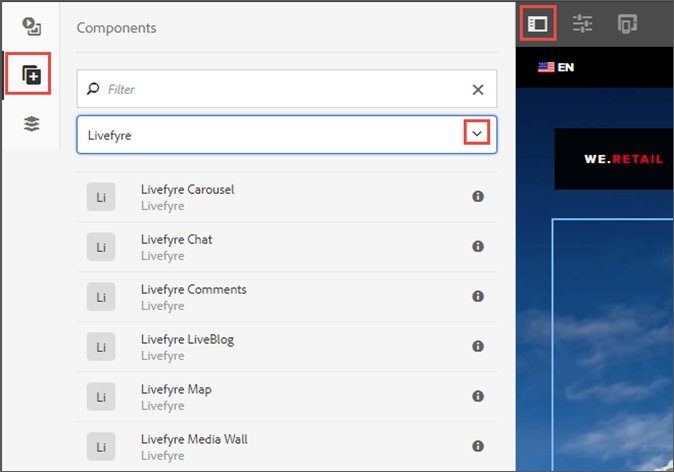

# Integrazione con Livefyre{#integrating-with-livefyre}

Scopri come integrare le funzionalità di cura leader del settore di Livefyre con la tua istanza AEM 6.5, per poter pubblicare in pochi minuti contenuti generati dagli utenti dai social network al tuo sito.

## Guida introduttiva {#getting-started}

### Installa il pacchetto Livefyre per AEM {#install-livefyre-package-for-aem}

AEM 6.5 viene fornito con il pacchetto di funzioni Livefyre 1.2.6 pre-installato. Questo pacchetto include solo un’integrazione limitata di Livefyre con AEM Sites e deve essere disinstallato prima di installare un pacchetto aggiornato. Con il pacchetto più recente, puoi sperimentare la piena integrazione di Livefyre con AEM, compresi Sites, Assets e Commerce.

>[!NOTE]
>
>Alcune caratteristiche del pacchetto AEM-LF dipendono dal Social Component Framework (SCF). Se utilizzi il feature pack Livefyre come parte di un sito non appartenente a una comunità, devi dichiarare *cq.social.scf* come dipendenza nelle clientlib dell’autore del sito web. Se utilizzi il feature pack LF come parte di un sito web di Communities, questa dipendenza deve essere già dichiarata.

1. Nella home page di AEM, fai clic sul pulsante **Strumenti** sulla barra a sinistra.
1. Passa a **Implementazione > Pacchetti**.
1. In Gestione pacchetti, scorri fino a visualizzare il pacchetto di funzioni Livefyre preinstallato, quindi fai clic sul titolo del pacchetto **cq-social-livefyre-pkg-1.2.6.zip** per espandere le opzioni.
1. Fai clic su **Altro > Disinstalla**.

   

1. Scarica il pacchetto Livefyre da [Distribuzione di software](https://experience.adobe.com/#/downloads/content/software-distribution/it/aem.html).

1. Dalla Gestione pacchetti, installa il pacchetto scaricato. Vedi [Come lavorare con i pacchetti](/help/sites-administering/package-manager.md) per ulteriori informazioni sull’utilizzo di Distribuzione di software e pacchetti in AEM

   

   Il pacchetto Livefyre-AEM è ora installato. Prima di poter iniziare a utilizzare le funzioni di integrazione, devi configurare AEM per utilizzare Livefyre.

   Per ulteriori informazioni e note sulla versione dei feature pack, consulta [Feature Pack](https://experienceleague.adobe.com/docs/experience-manager-65/release-notes/home.html).

### Configura AEM per utilizzare Livefyre: Creare una cartella di configurazione {#configure-aem-to-use-livefyre-create-a-configuration-folder}

1. Nella home page di AEM, fai clic sul pulsante **Strumenti** nella barra a sinistra, quindi seleziona **Generale > Browser di configurazione**.
   * Consulta la sezione [Browser di configurazione](/help/sites-administering/configurations.md) documentazione per ulteriori informazioni.
1. Fai clic su **Crea** per aprire la finestra di dialogo Crea configurazione .
1. Assegna un nome alla configurazione e controlla la **Configurazioni cloud** casella di controllo.

   Verrà creata una cartella in **Strumenti > Implementazione > Configurazione Livefyre** con il nome specificato.

   

### Configura AEM per utilizzare Livefyre: Creare una configurazione Livefyre {#configure-aem-to-use-livefyre-create-a-livefyre-configuration}

Configura AEM per utilizzare le credenziali di licenza Livefyre della tua organizzazione, consentendo la comunicazione tra Livefyre e AEM.

1. Nella home page di AEM, fai clic sul pulsante **Strumenti** nella barra a sinistra, quindi seleziona **Implementazione > Configurazione Livefyre**.
1. Seleziona la cartella di configurazione in cui desideri creare una nuova configurazione Livefyre, quindi fai clic su **Crea**.

   

   >[!NOTE]
   >
   >Per poter aggiungere le configurazioni di Livefyre, nelle cartelle deve essere abilitata l’opzione Configurazioni cloud nelle relative proprietà. Le cartelle di configurazione vengono create e gestite in [Browser di configurazione.](/help/sites-administering/configurations.md)
   >
   >Non è possibile creare un nome per una configurazione, a cui fa riferimento il percorso della cartella in cui si trova. Puoi avere una sola configurazione per cartella.

1. Seleziona la scheda di configurazione Livefyre appena creata, quindi fai clic su **Proprietà**.

   

1. Immetti le credenziali Livefyre della tua organizzazione, quindi fai clic su **OK**.

   

   Per accedere a queste informazioni, apri Livefyre studio e passa a **Impostazioni > Impostazioni integrazione > Credenziali**.

   L’istanza AEM è ora configurata per l’utilizzo di Livefyre e puoi utilizzare le funzioni di integrazione.

### Personalizzare l’integrazione con Single Sign-On {#customize-single-sign-on-integration}

Il pacchetto Livefyre for AEM include un’integrazione preconfigurata tra i profili AEM Communities e il servizio SSO di Livefyre.

Quando gli utenti accedono al tuo sito AEM, vengono anche connessi ai componenti social di Livefyre. Quando un utente disconnesso tenta di utilizzare una funzione di componente Livefyre che richiede l’autenticazione (come il caricamento di una foto), il componente Livefyre avvia l’autenticazione dell’utente.

L’integrazione di autenticazione predefinita potrebbe non essere perfetta per ogni sito. Per trovare una corrispondenza ottimale al flusso di autenticazione nei modelli di sito, è possibile sostituire il delegato di autenticazione Livefyre predefinito per soddisfare le proprie esigenze. Segui questi passaggi:

1. Utilizzando CRXDE Lite, copia */libs/social/integrations/livefyre/components/authorizablecomponent/authclientlib* a */apps/social/integrations/livefyre/components/authorizablecomponent/authclientlib*.
1. Modifica e salva */apps/social/integrations/livefyre/components/authorizablecomponent/authclientlib/auth.js* per implementare un delegato Livefyre Auth che soddisfi le tue esigenze.

   Per ulteriori informazioni sulla personalizzazione di un delegato di autenticazione, vedi [Integrazione di Identity](https://answers.livefyre.com/developers/identity-integration/).

   Per ulteriori informazioni sulle AEM Clientlibs, vedi [Utilizzo delle librerie lato client](https://experienceleague.adobe.com/docs/experience-manager-65/developing/introduction/clientlibs.html).

## Utilizzare Livefyre con AEM Sites {#use-livefyre-with-aem-sites}

### Aggiungere componenti Livefyre a una pagina {#add-livefyre-components-to-a-page}

Prima di aggiungere componenti Livefyre a una pagina all’interno di Sites, devi abilitare Livefyre per la pagina ereditando una configurazione cloud Livefyre da una pagina padre o aggiungendo la configurazione direttamente alla pagina. Per informazioni su come includere i servizi cloud sul sito, consulta l’implementazione .

Una volta abilitato Livefyre per la pagina, i contenitori devono essere configurati per consentire i componenti Livefyre. Vedi [Configurazione dei componenti in modalità Progettazione](https://experienceleague.adobe.com/docs/experience-manager-65/authoring/siteandpage/default-components-designmode.html) per istruzioni su come abilitare diversi componenti.

>[!NOTE]
>
>Le app che richiedono l’autenticazione per il post non funzionano finché l’autenticazione non è configurata in Personalizzare l’integrazione con single sign-on.

1. Da **Componenti** pannello laterale in modalità progettazione, seleziona **Livefyre** dal menu per limitare l’elenco ai componenti Livefyre disponibili.

   

1. Seleziona un componente Livefyre e trascinalo nella posizione sulla pagina.
1. Seleziona se creare una nuova app Livefyre o incorporarne una esistente.

   Se incorpori un’app esistente, AEM ti chiede di selezionare l’app. Se crei una nuova app, l’app dovrà essere compilata prima che appaia il contenuto. L’app verrà creata nel sito Livefyre e nella rete selezionati quando la configurazione cloud Livefyre è stata abilitata per la pagina.

   Per ulteriori informazioni sull’inserimento dei componenti, consulta [Modifica del contenuto di una pagina](https://experienceleague.adobe.com/docs/experience-manager-65/authoring/authoring/editing-content.html).

### Modificare un componente Livefyre per una pagina AEM. {#edit-a-livefyre-component-for-an-aem-page}

È possibile configurare e modificare solo un componente Livefyre in Livefyre Studio. Da AEM:

1. Fai clic sul componente Livefyre da configurare.
1. Fai clic sul pulsante **Configura** icona (chiave inglese) per aprire la finestra di dialogo di configurazione.
1. Fai clic su **Per modificare questo componente, vai su Livefyre Studio.**.
1. Modifica l’app in Livefyre Studio.

## Utilizzare Livefyre con AEM Assets {#use-livefyre-with-aem-assets}

### Richiedere diritti e importare UGC in AEM Assets {#request-rights-and-import-ugc-into-aem-assets}

Puoi importare contenuti generati dagli utenti di Twitter e Instagram (UGC) da Livefyre Studio ad AEM Assets utilizzando l’importazione UGC. Dopo aver selezionato il contenuto da importare, è necessario richiedere i diritti per il contenuto prima di completare l’importazione.

>[!NOTE]
>
>Prima di utilizzare Assets per importare UGC, è necessario impostare gli account Social Accounts e Rights Requests in Livefyre Studio. Vedi [Impostazione: Richieste di diritti](https://docs.adobe.com/content/help/en/livefyre/using/rights-requests/c-how-requesting-rights-works.html) per ulteriori informazioni.

Per importare UGC in AEM Assets:

1. Dalla home page di AEM, passa a **Risorse > File**.
1. Fai clic su **Crea**, quindi fai clic su **Importa UGC.**

   

1. Trova contenuto:

   * Da Livefyre facendo clic sulla scheda Libreria UGC. Utilizza i filtri e cerca per trovare il contenuto dalla libreria UGC.
   * Da Twitter e Instagram facendo clic sulla scheda Twitter o Instagram . Utilizza la ricerca o i filtri per trovare il contenuto.

1. Seleziona le risorse da importare. Le risorse selezionate vengono conteggiate e salvate automaticamente in **Selezionati** scheda .
1. **Facoltativo**: Fai clic sul pulsante **Selezionati** seleziona e controlla il contenuto UGC selezionato da importare.
1. Fai clic su **Avanti**.

   

1. Per le richieste di diritti, scegli una delle seguenti opzioni per ogni risorsa:

   Per Instagram:

   * **Richiesta manuale dei diritti** per ricevere un messaggio che può essere copiato e incollato e inviato manualmente ai proprietari dei contenuti tramite Instagram.
   * **Diritti di contenuto degli attributi manualmente** per ignorare i diritti per le singole risorse.

   >[!NOTE]
   >
   >A causa di aggiornamenti che influiscono sull’aggregazione di contenuti da account utente non aziendali, non possiamo più pubblicare commenti per tuo conto o controllare automaticamente le risposte dell’autore. [Fai clic qui per ulteriori informazioni](https://developers.facebook.com/blog/post/2018/04/04/facebook-api-platform-product-changes/).

   

   Per Twitter:

   * **Autore del messaggio** per inviare un messaggio al proprietario del contenuto in cui richiede i diritti per la risorsa.
   * **Diritti di contenuto degli attributi manualmente** per ignorare i diritti per le singole risorse.

1. Fai clic su **Importa**.

   Se hai inviato una richiesta di diritti Twitter, il proprietario del contenuto vedrà il messaggio di richiesta di diritti sul suo account:

   

   >[!NOTE]
   >
   >Twitter ha dei limiti alle richieste identiche provenienti dallo stesso account. Quando importi più di una coppia di risorse, modifica i messaggi singolarmente per evitare di essere contrassegnati.

1. Fai clic su **Fine** nell’angolo in alto a destra per completare il flusso di lavoro Richiesta diritti .

   Puoi vedere lo stato di una richiesta di diritti in sospeso per una risorsa in Livefyre Studio. Se il contenuto è in attesa di una richiesta di diritti, la risorsa non verrà visualizzata in AEM Assets fino a quando non saranno concessi i diritti. La risorsa viene visualizzata automaticamente in AEM Assets quando viene concessa una richiesta di diritti.

   Per Instagram, devi tenere traccia della risposta del proprietario del contenuto e concedere manualmente i diritti in caso di diritti per il contenuto.

## Utilizzare Livefyre con AEM Commerce {#use-livefyre-with-aem-commerce}

### Importare cataloghi di prodotti in Livefyre con AEM Commerce {#import-product-catalogs-into-livefyre-with-aem-commerce}

Gli utenti di AEM Commerce possono integrare facilmente il catalogo di prodotti esistente in Livefyre per incrementare il coinvolgimento degli utenti nelle app di visualizzazione di Livefyre.

Dopo aver importato il catalogo dei prodotti, i prodotti vengono visualizzati in tempo reale nella tua istanza Livefyre. Se modifichi o elimini elementi nel Catalogo dei prodotti Commerce di AEM, le modifiche vengono aggiornate automaticamente in Livefrye.

1. Assicurati di avere l&#39;ultimo pacchetto Livefyre per AEM installato nella tua istanza AEM.
1. Dalla home page di AEM, passa a **AEM Commerce**.
1. Crea una nuova raccolta o utilizza una raccolta esistente.
1. Passa il puntatore del mouse sulla raccolta e fai clic su **Proprietà raccolta** (icona a forma di matita).
1. Controlla **Sincronizzazione con Livefyre**.
1. Riempi **Prefisso pagina Livefyre** per collegare questa raccolta a una pagina specifica in AEM.

   Il prefisso della pagina definisce il percorso principale nell’ambiente in cui inizia la ricerca delle pagine di prodotto. Livefyre sceglie la prima pagina a cui è associato un prodotto corrispondente. Per ottenere pagine diverse per prodotti diversi, sono necessarie più raccolte.

## Matrice di supporto AEM per le app Livefyre {#aem-support-matrix-for-livefyre-apps}

| App di Livefyre | AEM 6.1 | AEM 6.2 | AEM 6.3 | AEM 6.4 |
|---|---|---|---|---|
| Carosello | X | X | X | X |
| Chat | X | X | X | X |
| Commenti | X | X | X | X |
| Filmstrip |  | X | X | X |
| LiveBlog | X | X | X | X |
| Mappa | X | X | X | X |
| Parete multimediale | X | X | X | X |
| Mosaico | X | X | X | X |
| Sondaggio |  | X | X | X |
| Recensioni |  | X | X | X |
| Scheda singola | X | X | X | X |
| Memorizza 2 |  | X | X | X |
| Tendenze |  | X | X | X |
| Pulsante Carica |  | X | X | X |
