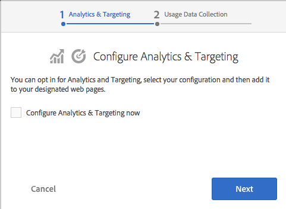

# Integrazione con Adobe Experience Cloud{#integrating-with-the-adobe-marketing-cloud}

Il [Adobe Experience Cloud](https://business.adobe.com/products/marketing-cloud/main.html), include potenti prodotti di analisi web e ottimizzazione dei siti web che forniscono dati e informazioni fruibili e in tempo reale per promuovere iniziative online di successo. Offre una piattaforma integrata e aperta per l&#39;ottimizzazione del business online. Il cloud è costituito da applicazioni integrate per raccogliere e sfruttare la potenza delle informazioni sul cliente al fine di ottimizzare le attività di acquisizione, conversione e conservazione dei clienti, nonché la creazione e la distribuzione dei contenuti.

Con Adobe Experience Manager (AEM), puoi integrarti facilmente con i seguenti prodotti di Adobe Experience Cloud:

* Adobe Analytics fornisce agli esperti di marketing informazioni fruibili e in tempo reale su strategie online e iniziative di marketing.
* Adobe Target offre agli esperti di marketing la possibilità di rendere i contenuti online sempre più rilevanti per i clienti, con conseguente miglioramento delle conversioni.
* Adobe Dynamic Media Classic automatizza la gestione dei supporti, semplifica la pubblicazione web e migliora le esperienze web, il tutto in un ambiente in hosting.
* Adobe Dynamic Tag Management offre agli addetti al marketing strumenti intuitivi per gestire in modo rapido e semplice un numero illimitato di tag Adobe e di terze parti.
<!-- Search&Promote is end of life as of September 1, 2022 * Adobe Search&Promote gives marketers the ability to control and optimize the search results on their sites. -->
* Adobe Campaign consente di gestire il contenuto della consegna e-mail direttamente in Adobe Experience Manager.

Inoltre, è possibile [integrare AEM con Creative Cloud](/help/assets/aem-cc-integration-best-practices.md) e con [servizi di terze parti](/help/sites-administering/third-party-services.md).

## Integrazione con Adobe Analytics {#integrating-with-adobe-analytics}

[Adobe Analytics](https://business.adobe.com/products/analytics/adobe-analytics.html) è la soluzione leader di settore che offre agli esperti di marketing digitale un’unica posizione per misurare, analizzare e ottimizzare i dati integrati da tutte le iniziative online su più canali di marketing. Fornisce agli esperti di marketing informazioni analitiche web in tempo reale e pronti per essere utilizzati, su strategie digitali e iniziative di marketing. Adobe Analytics consente ai professionisti del marketing di identificare rapidamente i percorsi più redditizi in un sito web, segmentare il traffico per individuare i visitatori di valore maggiore, determinare dove i visitatori lasciano il sito e identificare importanti metriche per il successo delle campagne di marketing online.

Puoi utilizzare Adobe Analytics per analizzare i dati dei tuoi siti.

L’integrazione con Adobe Analytics consente di effettuare le seguenti operazioni:

* Abilita il tracciamento degli utenti di Analytics.
* Mappa le modalità di esecuzione (ad esempio, authoring, pubblicazione) su suite di rapporti diverse.
* Invia variabili ClientContext come variabili di conversione o proprietà di traffico.
* Utilizza mappature di variabili predefinite.
* Configurare contemporaneamente le sezioni complete del sito.
* Tracciare eventi personalizzati.

Per informazioni sull’integrazione dell’AEM con Analytics, consulta [Integrazione con Adobe Analytics](/help/sites-administering/adobeanalytics.md).

È inoltre possibile utilizzare [Procedura guidata Opt-in](/help/sites-administering/opt-in.md) per eseguire facilmente l&#39;integrazione.

## Integrazione con Adobe Target {#integrating-with-adobe-target}

[Adobe Target viene utilizzato dagli esperti di marketing per progettare ed eseguire test online, creare all’istante segmenti di pubblico (in base al comportamento) e automatizzare il targeting di contenuti ed esperienze online.](https://business.adobe.com/it/products/target/adobe-target.html)

I consumatori online oggi hanno esigenze in continua evoluzione e si aspettano contenuti pertinenti, anche personalizzati, dall’ampia varietà di siti e fonti di contenuto tra cui possono scegliere. Per coinvolgere un pubblico online, è fondamentale che gli esperti di marketing online identifichino rapidamente quali offerte e contenuti sono rilevanti e interessanti per il proprio pubblico. Sulla base di questa conoscenza, gli esperti di marketing devono essere in grado di trasformare continuamente i loro siti e di indirizzare i contenuti appropriati a tipi di pubblico diversi.

[Integrazione con Adobe Target](/help/sites-administering/target.md) spiega come integrare il sito con Target.

È inoltre possibile utilizzare [Procedura guidata Opt-in](/help/sites-administering/opt-in.md) per eseguire facilmente l&#39;integrazione.

## Consenso ad Analytics e Target {#opting-in-to-analytics-and-target}

L’AEM fornisce una semplice procedura opt-in da integrare con Adobe Analytics e Adobe Target. Quando accedi come amministratore e accedi alla console Progetti, viene visualizzata una procedura guidata di consenso.

Accedi all’integrazione con Analytics e/o Target per abilitare l’utilizzo delle loro funzionalità di tracciamento e analisi delle pagine e delle funzionalità di personalizzazione. Quando scegli il consenso, fornisci le informazioni sul tuo account utente e specifica le pagine tracciate.

Per ulteriori informazioni, consulta [Effettuare l’opt-in con Adobe Analytics e Adobe Target.](/help/sites-administering/opt-in.md)

## Integrazione con Adobe Dynamic Media Classic {#integrating-with-scene}

Adobe Dynamic Media Classic è una soluzione in hosting per la pubblicazione, la gestione, il miglioramento e la distribuzione di risorse di marketing dinamiche e rich visual merchandising per web, dispositivi mobili, e-mail, social media, display connessi a Internet e stampa.

In Adobe Experience Manager, puoi pubblicare le risorse digitali direttamente da Adobe Experience Manager a Dynamic Media Classic, e le risorse digitali da Dynamic Media Classic a Adobe Experience Manager.

Inoltre, puoi visualizzare le risorse Adobe Experience Manager pubblicate in Dynamic Media Classic in vari visualizzatori, ad esempio Zoom e video di base.

Per ulteriori informazioni sull&#39;integrazione di Adobe Experience Manager con Dynamic Media Classic, vedere [Integrazione con Dynamic Media Classic](/help/sites-administering/scene7.md) documentazione.

## Integrazione con Adobe Dynamic Tag Management {#integrating-with-adobe-dynamic-tag-management}

[Adobe Dynamic Tag Management](https://business.adobe.com/products/experience-platform/adobe-experience-platform.html) offre agli addetti al marketing strumenti intuitivi per gestire in modo rapido e semplice un numero illimitato di tag Adobe e di terze parti. È possibile ottenere maggiore controllo e flessibilità per ottimizzare virtualmente qualsiasi elemento online, riducendo al contempo la dipendenza dalle risorse IT.

[Integrare Adobe Dynamic Tag Management](/help/sites-administering/dtm.md) con AEM in modo da poter utilizzare le proprietà web di Dynamic Tag Management per monitorare i siti AEM.

## Integrazione con Adobe Audience Manager {#integrating-with-adobe-audience-manager}

L’integrazione dell’Audience Manager è stata rimossa nell’AEM 6.3.

<!-- Search&Promote is end of life as of September 1, 2022 ## Integrating with Search&Promote {#integrating-with-search-promote} -->

<!-- Search&Promote is end of life as of September 1, 2022 Adobe Search&Promote enables marketers to optimizehow visitors browse, find, compare, and select relevant products and content on web and mobile sites. Businesses can easily promote priority items based on business objectives and visitor intent, and automate merchandising and promotions activity via KPI-based triggers or metrics. -->

<!-- Search&Promote is end of life as of September 1, 2022 Adobe Search&Promote is a reliable and scalable hosted site search application, capable of scaling to millions of pages or products, for heavily visited online businesses ranging from retail to news sites. It offers unprecedented levels of marketer control and metrics-based relevance. -->

<!-- Search&Promote is end of life as of September 1, 2022 For information about integrating AEM and Search&Promote, see [Integrating with Adobe Search&Promote](/help/sites-administering/search-and-promote.md). -->

## Integrazione con Adobe Campaign {#integrating-with-adobe-campaign}

[Adobe Campaign](https://business.adobe.com/products/campaign/adobe-campaign.html) consente di gestire il contenuto della consegna e-mail direttamente in Adobe Experience Manager.

Per informazioni sull’integrazione dell’AEM con Adobe Campaign, consulta [Integrazione con Adobe Campaign](/help/sites-administering/campaignstandard.md).